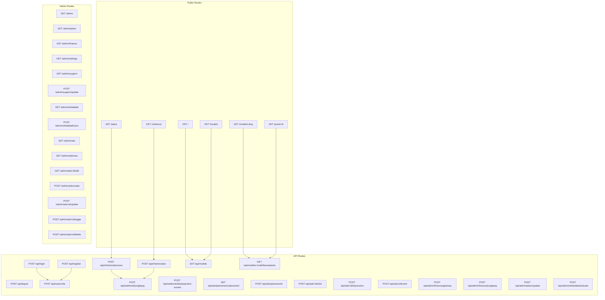
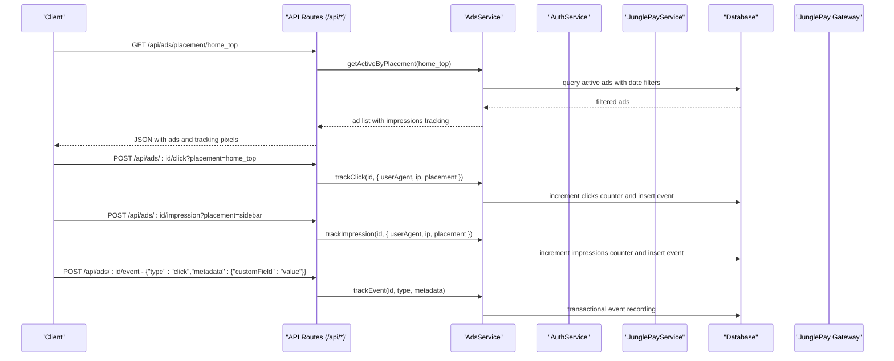

# API Reference

<cite>
**Referenced Files in This Document**
- [api.tsx](file://src/routes/api.tsx)
- [public.tsx](file://src/routes/public.tsx)
- [admin.tsx](file://src/routes/admin.tsx)
- [auth.ts](file://src/services/auth.ts)
- [junglepay.ts](file://src/services/junglepay.ts)
- [ads.ts](file://src/services/ads.ts)
- [schema.ts](file://src/db/schema.ts)
- [whitelabel.ts](file://src/services/whitelabel.ts)
- [models.ts](file://src/services/whitelabel/queries/models.ts)
- [posts.ts](file://src/services/whitelabel/queries/posts.ts)
- [sync.ts](file://src/services/whitelabel/sync.ts)
- [parser.ts](file://src/services/whitelabel/sync/parser.ts)
- [persistence.ts](file://src/services/whitelabel/sync/persistence.ts)
- [activation.ts](file://src/services/admin/activation.ts)
- [Ads.tsx](file://src/pages/admin/Ads.tsx)
- [AdsCreate.tsx](file://src/pages/admin/AdsCreate.tsx)
- [AdTable.tsx](file://src/components/organisms/AdTable.tsx)
- [AdBanner.tsx](file://src/components/molecules/AdBanner.tsx)
- [AdSpotSmall.tsx](file://src/components/molecules/AdSpotSmall.tsx)
- [NativeAdBlock.tsx](file://src/components/molecules/NativeAdBlock.tsx)
- [README.md](file://README.md)
</cite>

## Update Summary
**Changes Made**
- Added comprehensive advertising tracking endpoints documentation for /ads/:id/impression, /ads/:id/click, and /ads/:id/event
- Documented enhanced metadata collection capabilities including user agent, IP address, and placement tracking
- Added transactional guarantees for advertising event recording
- Updated advertising system with comprehensive tracking infrastructure
- Enhanced ad campaign management endpoints with improved metadata handling

## Table of Contents
1. [Introduction](#introduction)
2. [Project Structure](#project-structure)
3. [Core Components](#core-components)
4. [Architecture Overview](#architecture-overview)
5. [Detailed Component Analysis](#detailed-component-analysis)
6. [Advertising System](#advertising-system)
7. [Dependency Analysis](#dependency-analysis)
8. [Performance Considerations](#performance-considerations)
9. [Troubleshooting Guide](#troubleshooting-guide)
10. [Conclusion](#conclusion)
11. [Appendices](#appendices)

## Introduction
This document describes CreatorFlix's REST API surface implemented with Hono. It covers authentication endpoints, payment processing endpoints, content management endpoints, administrative management endpoints, and the comprehensive advertising system. For each endpoint, you will find HTTP methods, URL patterns, request/response schemas, authentication requirements, error codes, and practical examples. Security considerations, rate limiting, and API versioning are also documented.

## Project Structure
The API is organized under route modules:
- Public routes (HTML pages and public data)
- API routes (REST endpoints for authentication, payments, webhooks, admin operations, and advertising)
- Admin routes (administrative dashboards and management actions)



**Diagram sources**
- [public.tsx](file://src/routes/public.tsx#L54-L165)
- [api.tsx](file://src/routes/api.tsx#L16-L973)
- [admin.tsx](file://src/routes/admin.tsx#L18-L162)

**Section sources**
- [public.tsx](file://src/routes/public.tsx#L1-L170)
- [api.tsx](file://src/routes/api.tsx#L1-L973)
- [admin.tsx](file://src/routes/admin.tsx#L1-L162)

## Core Components
- Authentication service: handles registration, login, subscription creation, and subscription status checks.
- Payment services: orchestrates internal checkout creation and integrates with JunglePay for PIX transactions.
- Advertising service: manages ad campaigns, placements, tracking, and analytics with enhanced metadata collection.
- Whitelabel content service: manages model and post listings, signing CDN URLs, and synchronization from S3.
- Admin service: activates whitelabel models and upserts production content.

Key implementation references:
- Authentication endpoints and cookie-based session flow
- Checkout and PIX charge endpoints
- Webhooks for payment success and JunglePay notifications
- Public content endpoints for models and posts
- Advertising endpoints for fetching active ads and tracking engagement with metadata collection
- Admin management endpoints for finance, plans, whitelabel activation, and ad campaign management

**Section sources**
- [auth.ts](file://src/services/auth.ts#L1-L91)
- [junglepay.ts](file://src/services/junglepay.ts#L1-L270)
- [ads.ts](file://src/services/ads.ts#L1-L380)
- [whitelabel.ts](file://src/services/whitelabel.ts#L1-L24)
- [models.ts](file://src/services/whitelabel/queries/models.ts#L1-L94)
- [posts.ts](file://src/services/whitelabel/queries/posts.ts#L1-L47)
- [sync.ts](file://src/services/whitelabel/sync.ts#L1-L334)
- [activation.ts](file://src/services/admin/activation.ts#L1-L86)

## Architecture Overview
The API follows a layered architecture:
- Route handlers define endpoints and orchestrate requests
- Services encapsulate business logic (auth, payment, advertising, whitelabel, admin)
- Database schema defines entities and relations with dedicated tracking tables
- External integrations (JunglePay, S3) are abstracted behind typed services



**Diagram sources**
- [api.tsx](file://src/routes/api.tsx#L864-L973)
- [ads.ts](file://src/services/ads.ts#L243-L301)

## Detailed Component Analysis

### Authentication Endpoints
- POST /api/login
  - Purpose: Authenticate user and set an auth cookie.
  - Authentication: None required for login.
  - Request body fields:
    - email: string
    - password: string
  - Response: Redirects to home on success; otherwise redirects to login with an error query parameter.
  - Errors: Redirects include an error query parameter indicating invalid credentials or server error.

- POST /api/register
  - Purpose: Register a new user and set an auth cookie.
  - Authentication: None required for registration.
  - Request body fields:
    - email: string
    - password: string
    - name: string
  - Response: Redirects to /plans on success; otherwise redirects back with an encoded error message.
  - Errors: Registration failure messages are returned via redirect query parameter.

- POST /api/logout
  - Purpose: Invalidate the current session by clearing the auth cookie.
  - Authentication: None required.
  - Response: Redirects to /login.

- POST /api/subscribe
  - Purpose: Create a subscription for the authenticated user.
  - Authentication: Requires auth_token cookie.
  - Request body fields:
    - planId: number
  - Response: Redirects to admin dashboard on success; otherwise redirects to login.

- GET /api/models
  - Purpose: Retrieve paginated top models with signed thumbnails.
  - Authentication: None required.
  - Query parameters:
    - page: number (default 1)
  - Response: JSON with data, meta (page, limit, count).

- GET /api/models/:modelName/posts
  - Purpose: Retrieve paginated posts for a model with signed media URLs.
  - Authentication: None required.
  - Path parameters:
    - modelName: string
  - Query parameters:
    - page: number (default 1)
  - Response: JSON with data, meta (page, limit, count).

- POST /api/admin/whitelabel/activate
  - Purpose: Activate whitelabel models and synchronize posts.
  - Authentication: Admin-only (HTML response indicates admin service usage).
  - Request body fields:
    - all: string "true" to activate all, or specific model name
  - Response: HTML toast-like feedback indicating processed counts.

- POST /api/admin/finance/gateway
  - Purpose: Toggle active payment gateway (deactivates others, activates selected).
  - Authentication: Admin-only.
  - Request body fields:
    - gatewayName: string
  - Response: Redirects to admin finance page with success flag.

- POST /api/admin/finance/junglepay
  - Purpose: Configure JunglePay credentials.
  - Authentication: Admin-only.
  - Request body fields:
    - publicKey: string
    - secretKey: string
  - Response: Redirects to admin finance page with success flag.

- POST /api/admin/plans/update
  - Purpose: Update plan pricing and acceptance flags.
  - Authentication: Admin-only.
  - Request body fields:
    - id: number
    - price: string (supports dot or comma decimal separators)
    - checkoutUrl: string
    - acceptsPix: boolean
    - acceptsCard: boolean
  - Response: Redirects to admin plans page with success or error flags.

- POST /api/checkout/process
  - Purpose: Create an internal checkout record.
  - Authentication: None required.
  - Request body fields:
    - planId: number
    - paymentMethod: string
    - orderBump: boolean
    - email: string
    - name: string
    - cpf: string
    - phone: string
    - totalAmount: number (cents)
  - Response: JSON with success and checkoutId.

- POST /api/checkout/pix
  - Purpose: Create a PIX charge via JunglePay.
  - Authentication: None required.
  - Request body fields:
    - customerName: string
    - customerEmail: string
    - customerDocument: string
    - customerPhone: string
    - totalAmount: number (cents)
    - planId: number
    - orderBump: boolean
  - Response: On success, returns pixQrCode, pixUrl, expirationDate, status; on failure, returns error and code.
  - Error codes:
    - INVALID_DATA
    - GATEWAY_NOT_CONFIGURED
    - GATEWAY_INACTIVE
    - API_ERROR
    - UNEXPECTED_RESPONSE

- POST /api/webhook/junglepay
  - Purpose: Handle JunglePay webhook notifications.
  - Authentication: None required.
  - Request body: Raw webhook payload.
  - Behavior:
    - On paid: creates/activates subscription, updates user status, marks checkout as paid.
    - On waiting_payment: acknowledges receipt.
    - Other statuses: ignored.
  - Response: JSON acknowledging receipt or error.

- POST /api/webhook/dias/payment-sucess
  - Purpose: Handle Dias Marketplace payment success webhook.
  - Authentication: None required.
  - Request body: Raw webhook payload.
  - Behavior:
    - On PENDING: finds user by email, identifies plan by closest price, inserts pending subscription.
    - On PAID: finds pending subscription, calculates dates, activates subscription, updates user status.
  - Response: JSON acknowledging receipt or error.

**Section sources**
- [api.tsx](file://src/routes/api.tsx#L16-L973)
- [auth.ts](file://src/services/auth.ts#L6-L91)
- [junglepay.ts](file://src/services/junglepay.ts#L107-L268)
- [schema.ts](file://src/db/schema.ts#L6-L127)

### Public Content Endpoints
- GET /
  - Purpose: Serve homepage with top whitelabel models.
  - Authentication: Optional; cookie-based JWT verified to populate user context.
  - Response: HTML page with models and optional user.

- GET /models
  - Purpose: Paginated list of whitelabel models.
  - Authentication: Optional.
  - Query parameters:
    - page: number (default 1)
  - Response: HTML page with pagination metadata.

- GET /models/:slug
  - Purpose: Model profile page with first 20 posts.
  - Authentication: Optional.
  - Path parameters:
    - slug: string
  - Response: HTML page with model and posts.

- GET /posts/:id
  - Purpose: Post detail page.
  - Authentication: Optional.
  - Path parameters:
    - id: number
  - Response: HTML page.

- GET /plans
  - Purpose: Plans page with pricing and features.
  - Authentication: Optional.
  - Response: HTML page with plans and active gateway.

- GET /checkout?planId=...
  - Purpose: Checkout page for a selected plan.
  - Authentication: Optional.
  - Query parameters:
    - planId: number
  - Response: HTML page with plan, user, and active gateway.

**Section sources**
- [public.tsx](file://src/routes/public.tsx#L54-L165)

### Administrative Management Endpoints
- GET /admin
  - Purpose: Admin dashboard.
  - Authentication: Admin-only.

- GET /admin/plans
  - Purpose: Manage plans; ensures defaults exist and lists all plans.
  - Authentication: Admin-only.

- GET /admin/finance
  - Purpose: Configure payment gateways; initializes defaults if empty.
  - Authentication: Admin-only.

- GET /admin/settings
  - Purpose: Admin settings page.
  - Authentication: Admin-only.

- GET /admin/support
  - Purpose: Manage support contact links; initializes defaults if empty.
  - Authentication: Admin-only.

- POST /admin/support/update
  - Purpose: Update support contact URLs and activity status.
  - Authentication: Admin-only.
  - Request body fields:
    - contacts[id][url]: string
    - contacts[id][isActive]: boolean
  - Response: Redirects to /admin/support.

- GET /admin/whitelabel
  - Purpose: Paginated whitelabel model list with stats.
  - Authentication: Admin-only.
  - Query parameters:
    - page: number (default 1)
  - Response: HTML page with models, pagination, and stats.

- POST /admin/whitelabel/sync
  - Purpose: Trigger whitelabel model synchronization from S3.
  - Authentication: Admin-only.
  - Response: JSON with success and count.

**Section sources**
- [admin.tsx](file://src/routes/admin.tsx#L18-L162)

## Advertising System

### Ad Campaign Management Endpoints
Administrators can manage advertising campaigns through the following endpoints:

- GET /admin/ads
  - Purpose: List all advertising campaigns with filtering and pagination.
  - Authentication: Admin-only.
  - Query parameters:
    - page: number (default 1)
    - status: string (active, paused, draft)
    - placement: string (filter by ad placement)
  - Response: HTML page with campaign table, pagination controls, and filters.

- GET /admin/ads/new
  - Purpose: Render form for creating new advertising campaigns.
  - Authentication: Admin-only.
  - Response: HTML form with ad preview and validation.

- GET /admin/ads/:id/edit
  - Purpose: Render edit form for existing campaign.
  - Authentication: Admin-only.
  - Path parameters:
    - id: number
  - Response: HTML form pre-filled with campaign data.

- POST /admin/ads/create
  - Purpose: Create a new advertising campaign.
  - Authentication: Admin-only.
  - Request body fields:
    - name: string (campaign name)
    - type: string (ad type)
    - placement: string (placement location)
    - status: string (draft, active, paused)
    - title: string (main title)
    - subtitle: string (optional)
    - ctaText: string (call-to-action text)
    - imageUrl: string (image URL)
    - link: string (destination URL)
    - category: string (optional)
    - priority: number (default 0)
  - Response: Redirects to /admin/ads with success flag.

- POST /admin/ads/:id/update
  - Purpose: Update existing advertising campaign.
  - Authentication: Admin-only.
  - Path parameters:
    - id: number
  - Request body fields:
    - Same as create endpoint
  - Response: Redirects to /admin/ads with success flag.

- POST /admin/ads/:id/toggle
  - Purpose: Toggle campaign status between active and paused.
  - Authentication: Admin-only.
  - Path parameters:
    - id: number
  - Response: Redirects to /admin/ads with success flag.

- POST /admin/ads/:id/delete
  - Purpose: Delete an advertising campaign.
  - Authentication: Admin-only.
  - Path parameters:
    - id: number
  - Response: Redirects to /admin/ads with success flag.

### Public Advertising Endpoints
Public endpoints for fetching and tracking advertisements with enhanced metadata collection:

- GET /api/ads/placement/:placement
  - Purpose: Fetch active advertisements for a specific placement.
  - Authentication: None required.
  - Path parameters:
    - placement: string (ad placement identifier)
  - Query parameters:
    - limit: number (default 5, maximum 20)
  - Response: JSON with success flag and data array of ads.
  - Auto-tracking: Does not automatically increment impression count for returned ads.

- POST /api/ads/placements
  - Purpose: Fetch active advertisements for multiple placements in a single request.
  - Authentication: None required.
  - Request body fields:
    - placements: string[] (array of placement identifiers)
  - Response: JSON with success flag and data object mapping placement to ad arrays.
  - Auto-tracking: Does not automatically increment impression count for returned ads.

- POST /api/ads/:id/click
  - Purpose: Track advertisement click event with metadata collection.
  - Authentication: None required.
  - Path parameters:
    - id: number (advertisement ID)
  - Query parameters:
    - placement: string (optional placement identifier)
  - Request headers:
    - user-agent: string (automatically captured)
    - x-forwarded-for: string (automatically captured)
    - remote-addr: string (automatically captured)
  - Response: JSON with success flag.
  - Metadata collected: placement, user agent, IP address.

- POST /api/ads/:id/impression
  - Purpose: Manually track advertisement impression event with metadata collection.
  - Authentication: None required.
  - Path parameters:
    - id: number (advertisement ID)
  - Query parameters:
    - placement: string (optional placement identifier)
  - Request headers:
    - user-agent: string (automatically captured)
    - x-forwarded-for: string (automatically captured)
    - remote-addr: string (automatically captured)
  - Response: JSON with success flag.
  - Metadata collected: placement, user agent, IP address.

- POST /api/ads/:id/event
  - Purpose: Generic event tracking endpoint for agnostic event handling.
  - Authentication: None required.
  - Path parameters:
    - id: number (advertisement ID)
  - Request body fields:
    - type: string (either "impression" or "click")
    - metadata: object (custom metadata fields)
  - Request headers:
    - user-agent: string (automatically captured)
    - x-forwarded-for: string (automatically captured)
    - remote-addr: string (automatically captured)
  - Response: JSON with success flag.
  - Metadata collected: placement, user agent, IP address, plus custom metadata from request body.

### Enhanced Tracking Capabilities
The advertising system now provides comprehensive tracking with metadata collection:

- **Automatic metadata capture**: User agent, IP address, and placement are automatically captured from request headers and query parameters.
- **Transactional event recording**: Both impression and click events are recorded in separate tracking tables with foreign key relationships to the ads table.
- **Custom metadata support**: The generic event endpoint allows for custom metadata fields to be passed along with tracking events.
- **Non-blocking operations**: Tracking operations use non-blocking database updates to prevent performance degradation.

### Ad Types and Valid Placements
The advertising system supports five ad types with specific placement restrictions:

- Diamond (Post Style)
  - Type: `diamond`
  - Valid placements: `feed_model`
  - Use case: Sponsored posts in model feed

- Diamond Block (Native Block)
  - Type: `diamond_block`
  - Valid placements: `home_top`, `home_middle`, `models_grid`
  - Use case: Sponsored content blocks in home feed

- Banner (Horizontal)
  - Type: `banner`
  - Valid placements: `home_top`, `home_bottom`, `login`, `register`
  - Use case: Horizontal banners in various locations

- Ad Spot Small
  - Type: `spot`
  - Valid placements: `sidebar`, `model_profile`, `model_sidebar`
  - Use case: Small promotional spots in sidebars

- Hero Carousel
  - Type: `hero`
  - Valid placements: `home_top`
  - Use case: Full-width hero carousels

### Ad Campaign Schema
Each advertisement campaign includes the following fields:

- id: number (auto-generated)
- name: string (campaign name)
- type: string (ad type)
- placement: string (placement location)
- status: string (draft, active, paused)
- title: string (main headline)
- subtitle: string (optional description)
- ctaText: string (call-to-action text)
- imageUrl: string (image URL)
- link: string (destination URL)
- category: string (optional category)
- impressions: number (impression count, default 0)
- clicks: number (click count, default 0)
- priority: number (display priority, default 0)
- startDate: Date (optional activation date)
- endDate: Date (optional expiration date)
- createdAt: Date (creation timestamp)
- updatedAt: Date (last update timestamp)

### Analytics and CTR Calculation
The advertising system provides built-in analytics with click-through rate (CTR) calculation:

- CTR Formula: (clicks / impressions) × 100
- CTR Categories:
  - Excellent: > 2%
  - Good: > 1%
  - Average: ≤ 1%

**Section sources**
- [ads.ts](file://src/services/ads.ts#L1-L380)
- [api.tsx](file://src/routes/api.tsx#L864-L973)
- [admin.tsx](file://src/routes/admin.tsx#L39-L161)
- [Ads.tsx](file://src/pages/admin/Ads.tsx#L1-L131)
- [AdsCreate.tsx](file://src/pages/admin/AdsCreate.tsx#L1-L569)
- [AdTable.tsx](file://src/components/organisms/AdTable.tsx#L1-L119)
- [schema.ts](file://src/db/schema.ts#L194-L253)

## Dependency Analysis
The API relies on typed schemas and services to maintain consistency and reduce coupling.

```mermaid
classDiagram
class Users {
+id
+name
+email
+password
+role
+subscriptionStatus
}
class Plans {
+id
+name
+price
+duration
+acceptsPix
+acceptsCard
}
class Ads {
+id
+name
+type
+placement
+status
+title
+subtitle
+ctaText
+imageUrl
+link
+category
+impressions
+clicks
+priority
+startDate
+endDate
+createdAt
+updatedAt
}
class Impressions {
+id
+adId
+placement
+userAgent
+ip
+createdAt
}
class Clicks {
+id
+adId
+placement
+userAgent
+ip
+createdAt
}
class Subscriptions {
+id
+userId
+planId
+externalId
+startDate
+endDate
+status
}
class Checkouts {
+id
+userId
+planId
+status
+paymentMethod
+orderBump
+totalAmount
+customerName
+customerEmail
+customerDocument
+customerPhone
}
class PaymentGateways {
+id
+name
+publicKey
+secretKey
+postbackUrl
+isActive
}
Users ||--o{ Subscriptions : "has"
Plans ||--o{ Subscriptions : "defines"
Users ||--o{ Checkouts : "creates"
Plans ||--o{ Checkouts : "defines"
Ads ||--|| Ads : "tracking"
Ads ||--o{ Impressions : "tracks"
Ads ||--o{ Clicks : "tracks"
PaymentGateways ||--|| Checkouts : "relates"
```

**Diagram sources**
- [schema.ts](file://src/db/schema.ts#L6-L253)

**Section sources**
- [schema.ts](file://src/db/schema.ts#L1-L253)

## Performance Considerations
- Pagination: Public and admin endpoints use page-based pagination with fixed limits to control payload sizes.
- Batch operations: Admin whitelabel sync processes S3 objects in batches and performs upserts with conflict handling to minimize writes.
- CDN URL signing: Media URLs are signed on demand to avoid storing long-lived presigned URLs.
- Webhook processing: Webhooks avoid heavy computations and rely on database lookups; pending/active transitions are handled efficiently.
- Ad tracking: Click and impression tracking uses non-blocking operations with transactional guarantees to prevent performance degradation.
- Ad caching: Active ad queries consider date filters and priority ordering for efficient retrieval.
- Metadata collection: Automatic metadata capture is optimized to minimize overhead while providing comprehensive tracking data.

## Troubleshooting Guide
Common issues and resolutions:
- Authentication failures
  - Verify credentials during login; invalid credentials lead to a redirect with an error query parameter.
  - Ensure the auth cookie is present for protected operations like subscribe.

- Payment errors
  - For PIX creation, ensure the gateway is configured and active; otherwise, the service returns appropriate error codes.
  - Validate required fields (customerName, customerEmail, customerDocument, totalAmount, planId).

- Webhook handling
  - JunglePay and Dias webhooks update subscriptions and user status; ensure endpoints are reachable and logs show successful processing.

- Admin operations
  - Finance gateway toggling and JunglePay credential updates require admin context; confirm redirects indicate success.

- Advertising system issues
  - Ad placement validation: Ensure ad placement matches the ad type constraints.
  - Active campaign filtering: Ads must have status 'active' and fall within start/end date range.
  - Tracking failures: Click and impression tracking uses non-blocking operations with transactional guarantees; check database connectivity.
  - Metadata collection: Verify that request headers (user-agent, x-forwarded-for, remote-addr) are properly captured.
  - Generic event tracking: Ensure event type is either 'impression' or 'click' and ad ID is valid.

**Section sources**
- [api.tsx](file://src/routes/api.tsx#L316-L398)
- [api.tsx](file://src/routes/api.tsx#L42-L86)
- [api.tsx](file://src/routes/api.tsx#L88-L170)
- [api.tsx](file://src/routes/api.tsx#L402-L973)
- [ads.ts](file://src/services/ads.ts#L145-L301)

## Conclusion
CreatorFlix exposes a cohesive REST API for authentication, payment processing, content discovery, administration, and advertising management. The endpoints are designed with clear request/response contracts, robust error handling, and integration points for external services. Administrators can manage gateways, plans, whitelabel content, and advertising campaigns, while clients can authenticate, subscribe, consume curated content, and interact with targeted advertisements. The advertising system provides comprehensive campaign management, placement validation, analytics capabilities, and enhanced tracking with metadata collection for detailed performance insights.

## Appendices

### API Versioning
- No explicit versioning header or URL segment is used. Clients should pin to the current major behavior and monitor repository changes.

### Rate Limiting
- No built-in rate limiting is implemented in the routes. Consider deploying a reverse proxy or middleware to enforce per-IP or per-token limits as needed.
- Ad tracking endpoints use non-blocking operations with transactional guarantees to handle high-frequency requests without blocking the main application thread.

### Security Considerations
- Authentication
  - Uses HTTP-only, same-site cookies with optional secure flag in production.
  - JWT verification occurs on the server for protected operations.

- CORS and CSRF
  - Cookies are HttpOnly and SameSite=Lax; CSRF protection depends on application rendering and cookie policies.

- Data Validation
  - Payment endpoints validate required fields and gateway configuration before calling external services.
  - Ad placement validation ensures type-specific placement constraints are enforced.
  - Event tracking endpoints validate ad IDs and event types before processing.

- Sensitive Data
  - Secret keys for payment gateways are stored in the database; ensure environment isolation and least-privilege access.
  - Ad tracking operations use non-blocking database updates with transactional guarantees to prevent timing attacks.
  - Metadata collection is limited to necessary fields (user agent, IP, placement) to minimize privacy concerns.

**Section sources**
- [api.tsx](file://src/routes/api.tsx#L336-L343)
- [api.tsx](file://src/routes/api.tsx#L382-L398)
- [junglepay.ts](file://src/services/junglepay.ts#L107-L134)
- [ads.ts](file://src/services/ads.ts#L145-L204)

### Practical Examples

- Login
  - curl
    - curl -X POST https://your-host/api/login -F email=user@example.com -F password=pass

- Register
  - curl
    - curl -X POST https://your-host/api/register -F email=newuser@example.com -F password=pass -F name="New User"

- Subscribe
  - curl
    - curl -X POST https://your-host/api/subscribe --cookie auth_token=JWT_TOKEN -F planId=1

- Create Checkout
  - curl
    - curl -X POST https://your-host/api/checkout/process -H "Content-Type: application/json" -d '{"planId":1,"paymentMethod":"pix","orderBump":false,"email":"user@example.com","name":"User","cpf":"00000000000","phone":"00000000000","totalAmount":2990}'

- Create PIX Charge
  - curl
    - curl -X POST https://your-host/api/checkout/pix -H "Content-Type: application/json" -d '{"customerName":"User","customerEmail":"user@example.com","customerDocument":"00000000000","customerPhone":"","totalAmount":2990,"planId":1,"orderBump":false}'

- Get Models
  - curl
    - curl https://your-host/api/models?page=1

- Get Model Posts
  - curl
    - curl https://your-host/api/models/model-slug/posts?page=1

- Get Active Ads by Placement
  - curl
    - curl https://your-host/api/ads/placement/home_top?limit=5

- Get Multiple Placements
  - curl
    - curl -X POST https://your-host/api/ads/placements -H "Content-Type: application/json" -d '{"placements":["home_top","sidebar","feed_model"]}'

- Track Ad Click with Metadata
  - curl
    - curl -X POST https://your-host/api/ads/123/click?placement=home_top -H "User-Agent: Mozilla/5.0" -H "X-Forwarded-For: 192.168.1.1"

- Track Ad Impression with Metadata
  - curl
    - curl -X POST https://your-host/api/ads/123/impression?placement=sidebar -H "User-Agent: Mozilla/5.0" -H "X-Forwarded-For: 192.168.1.1"

- Generic Event Tracking
  - curl
    - curl -X POST https://your-host/api/ads/123/event -H "Content-Type: application/json" -d '{"type":"click","metadata":{"customField":"value","source":"widget"}}'

- Admin: Toggle Gateway
  - curl
    - curl -X POST https://your-host/api/admin/finance/gateway -F gatewayName="JunglePay"

- Admin: Configure JunglePay
  - curl
    - curl -X POST https://your-host/api/admin/finance/junglepay -F publicKey="pk_live_xxx" -F secretKey="sk_live_xxx"

- Admin: Update Plan
  - curl
    - curl -X POST https://your-host/api/admin/plans/update -F id=1 -F price="29,90" -F checkoutUrl="https://example.com/checkout" -F acceptsPix=true -F acceptsCard=false

- Admin: Activate Whitelabel Models
  - curl
    - curl -X POST https://your-host/api/admin/whitelabel/activate -F all=true

- Admin: Sync Whitelabel Models
  - curl
    - curl -X POST https://your-host/admin/whitelabel/sync

- Admin: Create Ad Campaign
  - curl
    - curl -X POST https://your-host/admin/ads/create -F name="Summer Sale" -F type="banner" -F placement="home_top" -F title="Summer Sale" -F subtitle="Up to 50% off" -F ctaText="SHOP NOW" -F link="https://example.com/sale" -F priority=10

- Admin: Update Ad Campaign
  - curl
    - curl -X POST https://your-host/admin/ads/1/update -F status="active" -F priority=5

- Admin: Delete Ad Campaign
  - curl
    - curl -X POST https://your-host/admin/ads/1/delete

### Client Implementation Guidelines
- Use the auth cookie for subsequent authenticated requests.
- For payment flows, call /api/checkout/process first, then /api/checkout/pix to obtain a QR code and secure URL.
- Poll or rely on webhooks for payment status updates.
- For content consumption, use GET /api/models and GET /api/models/:modelName/posts with pagination.
- For advertising integration, use GET /api/ads/placement/:placement for single placement or POST /api/ads/placements for multiple placements.
- Implement automatic impression tracking when displaying ads and manual click tracking on user interactions.
- Utilize the generic event tracking endpoint for custom analytics and behavioral tracking.
- Collect and pass relevant metadata (user agent, IP, placement) for comprehensive tracking.
- For admin operations, ensure the client respects redirects and handles success/error query parameters.
- Validate ad placement constraints client-side before submitting campaigns to prevent server errors.

### Testing Strategies and Debugging
- Unit tests for services
  - Validate AuthService.register, AuthService.login, and AuthService.createSubscription.
  - Validate JunglePayService.createPixCharge with various scenarios (invalid data, inactive gateway, API errors).
  - Validate AdsService.create, AdsService.update, and AdsService.delete operations.
  - Test ad placement validation and type-specific constraints.
  - Test enhanced tracking endpoints with metadata collection.
  - Test generic event tracking with custom metadata.
- Integration tests for endpoints
  - Test /api/login and /api/register redirects and cookie setting.
  - Test /api/checkout/process and /api/checkout/pix responses and database inserts.
  - Verify webhook endpoints update subscriptions and user status.
  - Test ad campaign CRUD operations in admin routes.
  - Validate ad placement filtering and date-based activation logic.
  - Test click and impression tracking endpoints with metadata capture.
  - Test generic event tracking endpoint with various event types and metadata combinations.
- Logging and monitoring
  - Inspect server logs for webhook receipts and errors.
  - Confirm database state after operations (checkouts, subscriptions, users, ads).
  - Monitor ad tracking metrics and CTR calculations.
  - Verify ad placement validation errors and constraint violations.
  - Monitor tracking table entries for impressions and clicks.
  - Validate metadata collection accuracy in tracking records.

**Section sources**
- [auth.ts](file://src/services/auth.ts#L6-L91)
- [junglepay.ts](file://src/services/junglepay.ts#L107-L268)
- [ads.ts](file://src/services/ads.ts#L86-L380)
- [api.tsx](file://src/routes/api.tsx#L88-L170)
- [api.tsx](file://src/routes/api.tsx#L402-L973)
- [schema.ts](file://src/db/schema.ts#L237-L253)