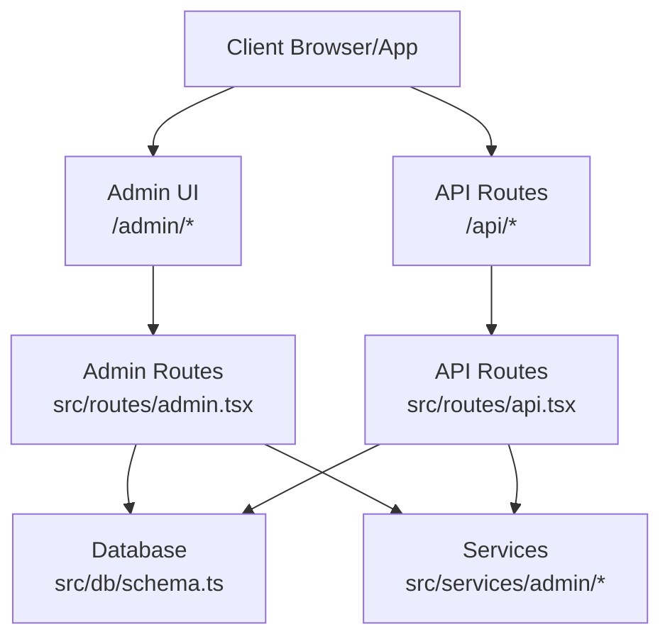
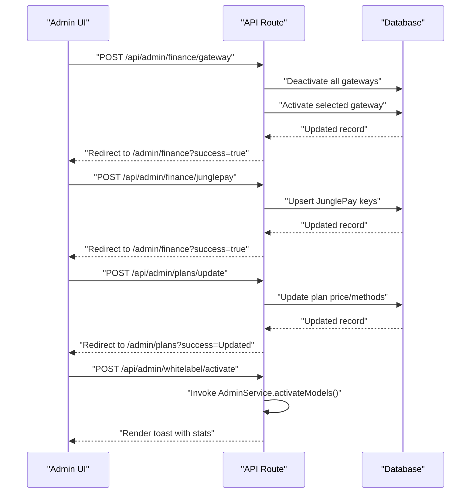
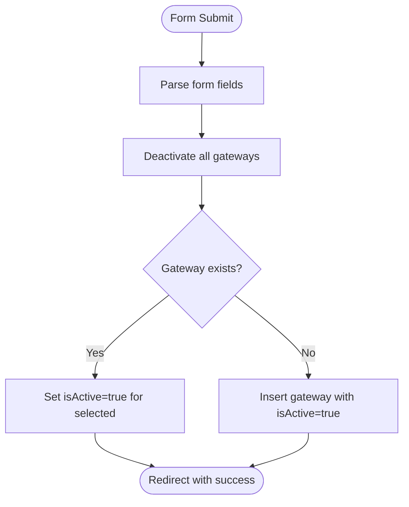
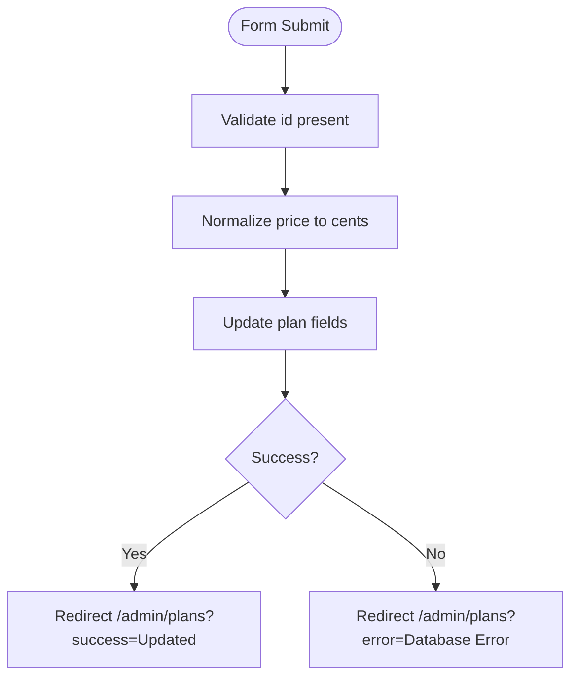
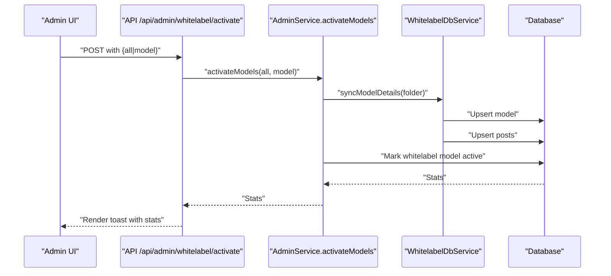
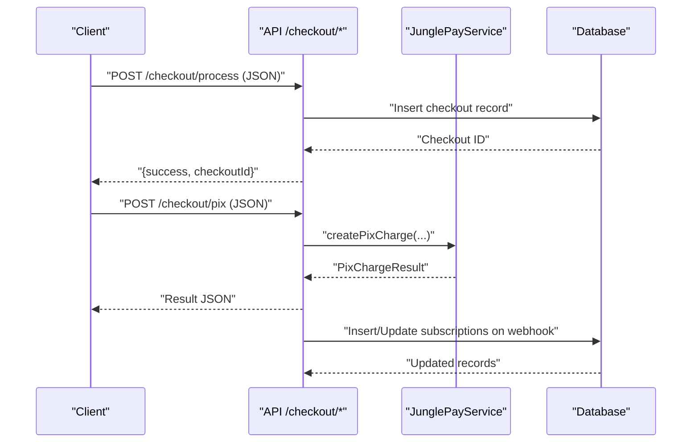
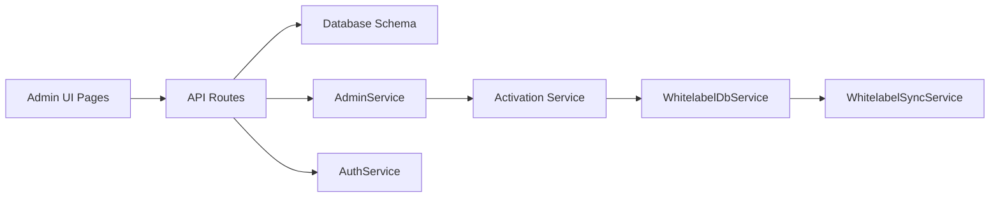

# Administrative Endpoints

<cite>
**Referenced Files in This Document**
- [index.tsx](file://src/index.tsx)
- [admin.tsx](file://src/routes/admin.tsx)
- [api.tsx](file://src/routes/api.tsx)
- [Finance.tsx](file://src/pages/admin/Finance.tsx)
- [Plans.tsx](file://src/pages/admin/Plans.tsx)
- [Whitelabel.tsx](file://src/pages/admin/Whitelabel.tsx)
- [schema.ts](file://src/db/schema.ts)
- [activation.ts](file://src/services/admin/activation.ts)
- [mappers.ts](file://src/services/admin/mappers.ts)
- [sync.ts](file://src/services/whitelabel/sync.ts)
- [models.ts](file://src/services/whitelabel/queries/models.ts)
- [AdminLayout.tsx](file://src/components/templates/AdminLayout.tsx)
</cite>

## Table of Contents
1. [Introduction](#introduction)
2. [Project Structure](#project-structure)
3. [Core Components](#core-components)
4. [Architecture Overview](#architecture-overview)
5. [Detailed Component Analysis](#detailed-component-analysis)
6. [Dependency Analysis](#dependency-analysis)
7. [Performance Considerations](#performance-considerations)
8. [Troubleshooting Guide](#troubleshooting-guide)
9. [Conclusion](#conclusion)
10. [Appendices](#appendices)

## Introduction
This document provides comprehensive API documentation for administrative endpoints. It covers HTTP methods, URL patterns, request/response schemas, and admin-only functionality for:
- Payment gateway configuration
- Plan management
- Whitelabel model activation
- Financial reporting and checkout flows

It also documents administrative workflows, permission requirements, security considerations, practical cURL examples, and integration guidelines for the administrative interface. Bulk operations, system configuration, and administrative audit trails are addressed.

## Project Structure
The application is structured around three route groups:
- Public routes under "/" (mounted in index.tsx)
- Admin routes under "/admin" (mounted in index.tsx)
- API routes under "/api" (mounted in index.tsx)

**Diagram sources**
- [index.tsx](file://src/index.tsx#L11-L14)
- [admin.tsx](file://src/routes/admin.tsx#L1-L158)
- [api.tsx](file://src/routes/api.tsx#L1-L519)
- [schema.ts](file://src/db/schema.ts#L1-L178)

**Section sources**
- [index.tsx](file://src/index.tsx#L11-L14)

## Core Components
- Admin UI pages render forms and views for finance, plans, whitelabel, and support management.
- API endpoints implement admin actions: gateway activation, JunglePay credentials update, plan updates, and model activation.
- Services orchestrate whitelabel synchronization and model/post upserts.
- Database schema defines payment gateways, plans, checkouts, and whitelabel staging/production tables.

**Section sources**
- [Finance.tsx](file://src/pages/admin/Finance.tsx#L1-L112)
- [Plans.tsx](file://src/pages/admin/Plans.tsx#L1-L126)
- [Whitelabel.tsx](file://src/pages/admin/Whitelabel.tsx#L1-L30)
- [api.tsx](file://src/routes/api.tsx#L172-L273)
- [activation.ts](file://src/services/admin/activation.ts#L1-L86)
- [schema.ts](file://src/db/schema.ts#L16-L127)

## Architecture Overview
Administrative workflows are implemented as HTML form submissions to API endpoints. The Admin UI renders forms bound to specific URLs, and the backend persists changes to the database.

**Diagram sources**
- [api.tsx](file://src/routes/api.tsx#L172-L273)
- [Finance.tsx](file://src/pages/admin/Finance.tsx#L39-L106)
- [Plans.tsx](file://src/pages/admin/Plans.tsx#L32-L101)
- [activation.ts](file://src/services/admin/activation.ts#L7-L20)

## Detailed Component Analysis

### Payment Gateway Configuration
- Purpose: Switch active payment gateway and configure JunglePay credentials.
- Admin-only: Yes. The UI exposes forms that POST to admin endpoints.

Endpoints:
- POST /api/admin/finance/gateway
  - Purpose: Set the active gateway among supported providers.
  - Request (form-encoded):
    - gatewayName: string ("Dias Marketplace" or "JunglePay")
  - Response: Redirect to /admin/finance?success=true
  - Notes: Deactivates all gateways, activates the selected one.

- POST /api/admin/finance/junglepay
  - Purpose: Save JunglePay public and secret keys.
  - Request (form-encoded):
    - publicKey: string
    - secretKey: string
  - Response: Redirect to /admin/finance?success=true
  - Notes: Upserts JunglePay row; does not activate it.

Integration:
- Admin UI form action="/api/admin/finance/gateway" and "/api/admin/finance/junglepay" submit to these endpoints.

Security considerations:
- Keys are stored in the database; ensure database encryption at rest and restrict access to admin accounts.
- Prefer HTTPS in production.

Audit trail:
- Changes are persisted to the payment_gateways table; future enhancements could add an audit log table.

**Section sources**
- [api.tsx](file://src/routes/api.tsx#L172-L216)
- [Finance.tsx](file://src/pages/admin/Finance.tsx#L39-L106)
- [schema.ts](file://src/db/schema.ts#L29-L35)

#### Gateway Activation Flow

**Diagram sources**
- [api.tsx](file://src/routes/api.tsx#L172-L194)

### Plan Management
- Purpose: Configure plan pricing, checkout links, and accepted payment methods per plan.
- Admin-only: Yes. The UI renders plan cards with editable fields.

Endpoint:
- POST /api/admin/plans/update
  - Purpose: Update a single plan’s price, checkout URL, and accepted payment methods.
  - Request (form-encoded):
    - id: integer
    - price: string (supports dot or comma decimal separators)
    - checkoutUrl: string (when gateway is external)
    - acceptsPix: string "true"|"false" (when gateway is internal)
    - acceptsCard: string "true"|"false" (when gateway is internal)
  - Response: Redirect to /admin/plans?success=Updated or error query param.
  - Notes: Price is normalized to cents.

Integration:
- Admin UI renders three plan cards (weekly, monthly, annual) with hidden id and editable fields. Form action="/api/admin/plans/update".

Security considerations:
- Enforce admin session/role checks before allowing access to the admin UI and endpoints.

Audit trail:
- Changes are persisted to the plans table; consider adding a change log for compliance.

**Section sources**
- [api.tsx](file://src/routes/api.tsx#L218-L248)
- [Plans.tsx](file://src/pages/admin/Plans.tsx#L32-L101)
- [schema.ts](file://src/db/schema.ts#L16-L27)

#### Plan Update Flow

**Diagram sources**
- [api.tsx](file://src/routes/api.tsx#L218-L248)

### Whitelabel Model Activation
- Purpose: Activate whitelabel models and posts by syncing from staging to production.
- Admin-only: Yes. Triggered via admin UI.

Endpoint:
- POST /api/admin/whitelabel/activate
  - Purpose: Activate models (all or specific) and upsert posts.
  - Request (form-encoded):
    - all: string "true"|"false"
    - model: string (optional; model folder name)
  - Response: Renders a toast with processed counts (models, new posts).
  - Notes: Uses AdminService.activateModels() which orchestrates:
    - Determine folders to process (all or specific)
    - Sync model details from bucket
    - Upsert model to production
    - Upsert posts to production
    - Mark whitelabel model as active

Integration:
- Admin UI triggers this endpoint; the UI shows stats and pagination for whitelabel models.

Security considerations:
- Restrict access to admin accounts.
- Validate inputs (folder names) to prevent injection.

Audit trail:
- Consider logging activation events with timestamps and operator info.

**Section sources**
- [api.tsx](file://src/routes/api.tsx#L250-L273)
- [activation.ts](file://src/services/admin/activation.ts#L7-L86)
- [mappers.ts](file://src/services/admin/mappers.ts#L3-L39)
- [sync.ts](file://src/services/whitelabel/sync.ts#L6-L197)
- [models.ts](file://src/services/whitelabel/queries/models.ts#L36-L57)
- [Whitelabel.tsx](file://src/pages/admin/Whitelabel.tsx#L15-L30)

#### Model Activation Flow

**Diagram sources**
- [api.tsx](file://src/routes/api.tsx#L250-L273)
- [activation.ts](file://src/services/admin/activation.ts#L31-L55)
- [sync.ts](file://src/services/whitelabel/sync.ts#L199-L205)

### Financial Reporting and Checkout Integration
- Purpose: Manage payment gateways and integrate checkout flows.
- Admin-only: Yes. The Finance page controls gateway selection and JunglePay keys.

Endpoints:
- GET /admin/finance
  - Purpose: Render Finance page with current gateways and active gateway preference.
  - Behavior: Initializes default gateways if none exist.

- POST /api/admin/finance/gateway
  - See Payment Gateway Configuration.

- POST /api/admin/finance/junglepay
  - See Payment Gateway Configuration.

- POST /checkout/process
  - Purpose: Create a checkout record for later payment.
  - Request (JSON):
    - planId: integer
    - paymentMethod: string
    - orderBump: boolean
    - email: string
    - name: string
    - cpf: string
    - phone: string
    - totalAmount: integer (cents)
  - Response: JSON with checkoutId.

- POST /checkout/pix
  - Purpose: Create a PIX charge via JunglePay.
  - Request (JSON): Same as above plus required fields.
  - Response: PixChargeResult indicating success/error and code.

- POST /webhook/junglepay
  - Purpose: Handle JunglePay webhook events to activate subscriptions.
  - Request: Raw body JSON payload.
  - Behavior: On paid transactions, create/activate subscription and update user status.

- POST /webhook/dias/payment-sucess
  - Purpose: Handle Dias Marketplace webhook to manage pending/active subscriptions.

Security considerations:
- Verify webhook signatures if provided by gateways.
- Store secrets securely (environment variables).
- Use HTTPS and CSRF protection for admin forms.

Audit trail:
- Webhooks update subscriptions and users; consider adding a dedicated audit_log table.

**Section sources**
- [admin.tsx](file://src/routes/admin.tsx#L50-L65)
- [api.tsx](file://src/routes/api.tsx#L16-L86)
- [api.tsx](file://src/routes/api.tsx#L172-L216)
- [api.tsx](file://src/routes/api.tsx#L401-L506)
- [schema.ts](file://src/db/schema.ts#L113-L127)

#### Checkout and Webhook Flow

**Diagram sources**
- [api.tsx](file://src/routes/api.tsx#L16-L86)
- [api.tsx](file://src/routes/api.tsx#L88-L170)

## Dependency Analysis
Administrative endpoints depend on:
- Database schema for payment gateways, plans, checkouts, and whitelabel staging/production tables.
- Services for whitelabel synchronization and admin activation.
- Admin UI components for rendering forms and views.

**Diagram sources**
- [api.tsx](file://src/routes/api.tsx#L1-L13)
- [schema.ts](file://src/db/schema.ts#L16-L127)
- [activation.ts](file://src/services/admin/activation.ts#L1-L6)
- [sync.ts](file://src/services/whitelabel/sync.ts#L1-L6)

**Section sources**
- [schema.ts](file://src/db/schema.ts#L16-L127)
- [activation.ts](file://src/services/admin/activation.ts#L1-L86)
- [sync.ts](file://src/services/whitelabel/sync.ts#L1-L6)

## Performance Considerations
- Bulk operations:
  - Whitelabel activation iterates over folders and performs upserts; consider batching and indexing on folderName and contentUrl.
  - S3 listing uses continuation tokens; ensure efficient pagination and parallelization where appropriate.
- Database writes:
  - Use transactions for atomic plan updates and whitelabel activations.
  - Indexes on payment_gateways(name), plans(id), and whitelabel models/posts improve lookup performance.
- Caching:
  - Cache active gateway and plan configurations to reduce DB reads in admin UI.

## Troubleshooting Guide
Common issues and resolutions:
- Gateway activation fails silently:
  - Verify gatewayName is valid and that the endpoint redirects with success query param.
  - Check database rows for payment_gateways.
- Plan update returns error:
  - Ensure id is present and price is a valid numeric string.
  - Confirm database connectivity and permissions.
- Whitelabel activation shows zero counts:
  - Confirm S3 bucket listing and model folder names match.
  - Review whitelabel staging tables for synced data.
- Webhook not activating subscriptions:
  - Validate webhook URL configuration with the payment provider.
  - Check logs for parsing errors and ensure user identification by email.

**Section sources**
- [api.tsx](file://src/routes/api.tsx#L172-L273)
- [activation.ts](file://src/services/admin/activation.ts#L31-L55)

## Conclusion
Administrative endpoints provide a cohesive set of operations for managing payment gateways, plans, and whitelabel content. They integrate tightly with the admin UI and rely on robust database schemas and services. Security and auditability should be prioritized, especially for sensitive operations like gateway key management and bulk activations.

## Appendices

### Administrative Workflows and Permissions
- Admin-only functionality:
  - The admin UI is rendered server-side and requires admin privileges.
  - Forms submit to protected endpoints that modify system configuration and content.
- Permission requirements:
  - Enforce role-based access control (RBAC) to ensure only admins can access /admin and POST to /api/admin/*.
- Security considerations:
  - Use HTTPS, secure cookies, and CSRF protection.
  - Limit exposure of admin endpoints; consider rate limiting and IP allowlists.

### Practical Examples

- Set active gateway (cURL):
  - curl -X POST https://yourdomain/api/admin/finance/gateway -F gatewayName="JunglePay" --cookie "auth_token=..."

- Update JunglePay keys (cURL):
  - curl -X POST https://yourdomain/api/admin/finance/junglepay -F publicKey="pk_live_..." -F secretKey="sk_live_..." --cookie "auth_token=..."

- Update plan (cURL):
  - curl -X POST https://yourdomain/api/admin/plans/update -F id=1 -F price="29.90" -F checkoutUrl="https://..." --cookie "auth_token=..."

- Activate whitelabel models (cURL):
  - curl -X POST https://yourdomain/api/admin/whitelabel/activate -F all=true --cookie "auth_token=..."

- Create checkout (cURL):
  - curl -X POST https://yourdomain/api/checkout/process -H "Content-Type: application/json" -d '{"planId":1,"paymentMethod":"pix","orderBump":false,"email":"user@example.com","name":"User","cpf":"12345678901","phone":"5511999999999","totalAmount":2990}'

- Create PIX charge (cURL):
  - curl -X POST https://yourdomain/api/checkout/pix -H "Content-Type: application/json" -d '{"customerName":"User","customerEmail":"user@example.com","customerDocument":"12345678901","totalAmount":2990,"planId":1}'

### Administrative Interface Integration Guidelines
- Forms:
  - Use action attributes pointing to /api/admin endpoints.
  - Include hidden fields for IDs when editing existing records.
- Validation:
  - Validate required fields client-side and server-side.
- Feedback:
  - Use success/error query params or toast notifications to inform administrators of outcomes.
- Layout:
  - Wrap content in AdminLayout to maintain consistent navigation and styling.

**Section sources**
- [Finance.tsx](file://src/pages/admin/Finance.tsx#L39-L106)
- [Plans.tsx](file://src/pages/admin/Plans.tsx#L32-L101)
- [AdminLayout.tsx](file://src/components/templates/AdminLayout.tsx#L9-L64)