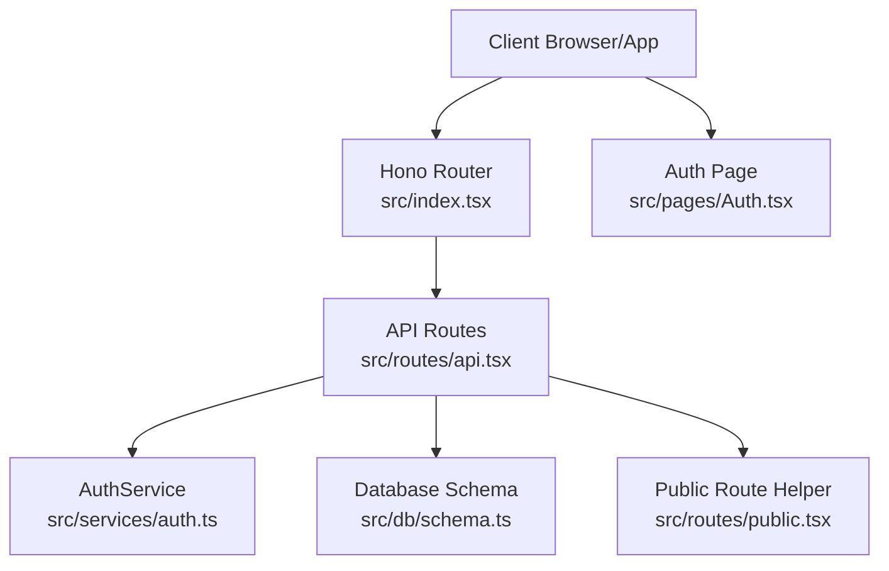
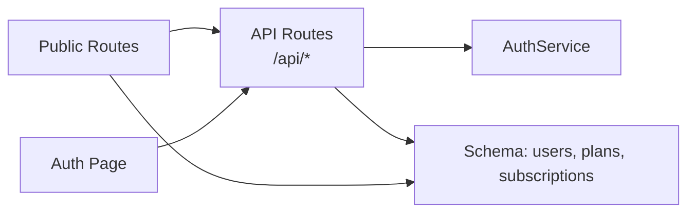

# Authentication Endpoints

<cite>
**Referenced Files in This Document**
- [index.tsx](file://src/index.tsx)
- [api.tsx](file://src/routes/api.tsx)
- [public.tsx](file://src/routes/public.tsx)
- [auth.ts](file://src/services/auth.ts)
- [schema.ts](file://src/db/schema.ts)
- [Auth.tsx](file://src/pages/Auth.tsx)
</cite>

## Table of Contents
1. [Introduction](#introduction)
2. [Project Structure](#project-structure)
3. [Core Components](#core-components)
4. [Architecture Overview](#architecture-overview)
5. [Detailed Component Analysis](#detailed-component-analysis)
6. [Dependency Analysis](#dependency-analysis)
7. [Performance Considerations](#performance-considerations)
8. [Troubleshooting Guide](#troubleshooting-guide)
9. [Conclusion](#conclusion)
10. [Appendices](#appendices)

## Introduction
This document provides comprehensive API documentation for authentication endpoints. It covers HTTP methods, URL patterns, request/response schemas, authentication requirements, JWT token handling, cookie-based session management, and subscription creation. It also documents response formats, error codes, security considerations, practical examples with cURL commands, and client implementation guidelines. The authentication flow, token verification, and session management patterns are explained with diagrams and code-level references.

## Project Structure
The authentication endpoints are implemented in the server-side routing module and backed by a service layer and database schema. The application is mounted under the /api base route and integrates with frontend pages for login and registration.



**Diagram sources**
- [index.tsx](file://src/index.tsx#L11-L14)
- [api.tsx](file://src/routes/api.tsx#L1-L14)
- [auth.ts](file://src/services/auth.ts#L1-L91)
- [schema.ts](file://src/db/schema.ts#L6-L46)
- [public.tsx](file://src/routes/public.tsx#L18-L51)
- [Auth.tsx](file://src/pages/Auth.tsx#L38-L75)

**Section sources**
- [index.tsx](file://src/index.tsx#L11-L14)
- [api.tsx](file://src/routes/api.tsx#L1-L14)

## Core Components
- API Routes: Define authentication endpoints and handle request/response flows.
- AuthService: Implements registration, login, subscription creation, and subscription status checks.
- Database Schema: Defines users, plans, subscriptions, and related relations.
- Public Route Helper: Provides JWT verification and user hydration for frontend pages.
- Auth Page: Renders login and registration forms that submit to the API.

**Section sources**
- [api.tsx](file://src/routes/api.tsx#L315-L517)
- [auth.ts](file://src/services/auth.ts#L5-L91)
- [schema.ts](file://src/db/schema.ts#L6-L46)
- [public.tsx](file://src/routes/public.tsx#L20-L51)
- [Auth.tsx](file://src/pages/Auth.tsx#L38-L75)

## Architecture Overview
The authentication flow uses cookie-based sessions with an HTTP-only JWT stored in a cookie named auth_token. The frontend submits HTML forms to the API, which responds with redirects. The public routes use the same cookie to verify the user and hydrate the page with user data.

```mermaid
sequenceDiagram
participant C as "Client"
participant API as "API Routes<br/>/api"
participant S as "AuthService"
participant DB as "Database<br/>users/subscriptions/plans"
C->>API : POST /api/login {email,password}
API->>S : login(email,password)
S->>DB : query users by email
DB-->>S : user record
S-->>API : user or null
API->>S : checkSubscriptionStatus(userId)
S->>DB : query active subscription
DB-->>S : subscription or null
API->>API : sign JWT payload
API-->>C : Set-Cookie : auth_token=JWT; HttpOnly; SameSite=Lax; Secure?
C->>API : POST /api/register {name,email,password}
API->>S : register(email,password,name)
S->>DB : insert user
DB-->>S : new user
API->>API : sign JWT payload
API-->>C : Set-Cookie : auth_token=JWT; HttpOnly; SameSite=Lax; Secure?
```

**Diagram sources**
- [api.tsx](file://src/routes/api.tsx#L315-L379)
- [auth.ts](file://src/services/auth.ts#L28-L39)
- [schema.ts](file://src/db/schema.ts#L6-L14)

## Detailed Component Analysis

### Endpoint: POST /api/login
- Method: POST
- URL: /api/login
- Purpose: Authenticate a user and establish a session via cookie.
- Request body (form fields):
  - email: string (required)
  - password: string (required)
- Response:
  - On success: Redirect to home with Set-Cookie: auth_token=JWT; HttpOnly; SameSite=Lax; Secure? (maxAge 7 days).
  - On invalid credentials: Redirect to login with error query parameter.
  - On server error: Redirect to login with error query parameter.
- Security:
  - Cookie is HttpOnly and SameSite=Lax; Secure flag depends on NODE_ENV production setting.
  - JWT payload includes id, email, name, role.
- Notes:
  - After successful login, the service checks and updates subscription status.

**Section sources**
- [api.tsx](file://src/routes/api.tsx#L315-L349)
- [auth.ts](file://src/services/auth.ts#L28-L39)

### Endpoint: POST /api/register
- Method: POST
- URL: /api/register
- Purpose: Register a new user and establish a session.
- Request body (form fields):
  - name: string (required)
  - email: string (required)
  - password: string (required)
- Response:
  - On success: Redirect to plans with Set-Cookie: auth_token=JWT; HttpOnly; SameSite=Lax; Secure?.
  - On error: Redirect to register with error query parameter.
- Security:
  - Password is hashed before insertion.
  - Cookie policy mirrors login.

**Section sources**
- [api.tsx](file://src/routes/api.tsx#L351-L379)
- [auth.ts](file://src/services/auth.ts#L6-L26)

### Endpoint: POST /api/logout
- Method: POST
- URL: /api/logout
- Purpose: Destroy the session by clearing the auth_token cookie.
- Response:
  - Redirect to login page.
- Security:
  - Sets maxAge=0 to expire the cookie immediately.

**Section sources**
- [api.tsx](file://src/routes/api.tsx#L508-L517)

### Endpoint: POST /api/subscribe
- Method: POST
- URL: /api/subscribe
- Purpose: Create a subscription for the authenticated user.
- Authentication:
  - Requires auth_token cookie; otherwise redirects to login.
- Request body (form fields):
  - planId: number (required)
- Response:
  - On success: Redirect to admin.
  - On missing planId: JSON { error: "Plan ID required" } with 400.
  - On invalid token or error: Redirect to login.
- Behavior:
  - Validates plan existence and calculates start/end dates based on plan duration.
  - Updates user subscriptionStatus to active.

**Section sources**
- [api.tsx](file://src/routes/api.tsx#L381-L399)
- [auth.ts](file://src/services/auth.ts#L41-L65)

### Frontend Forms and Submission
- Login form action: /api/login
- Registration form action: /api/register
- Fields:
  - Login: email, password
  - Register: name, email, password
- Redirect behavior:
  - Successful login: redirect to home
  - Successful registration: redirect to plans
  - Errors: redirect back with error query parameter

**Section sources**
- [Auth.tsx](file://src/pages/Auth.tsx#L38-L75)

### Token Verification and Session Hydration (Public Routes)
- Public routes verify the auth_token cookie using JWT verification.
- On success, the user object is hydrated with active subscription and plan details.
- On failure or missing token, user is considered unauthenticated.

**Section sources**
- [public.tsx](file://src/routes/public.tsx#L20-L51)

## Dependency Analysis
The authentication endpoints depend on:
- Hono for routing and JWT cookie helpers.
- AuthService for business logic.
- Database schema for user, plan, and subscription records.
- Frontend Auth page for form submission targets.



**Diagram sources**
- [api.tsx](file://src/routes/api.tsx#L1-L14)
- [auth.ts](file://src/services/auth.ts#L1-L91)
- [schema.ts](file://src/db/schema.ts#L6-L46)
- [public.tsx](file://src/routes/public.tsx#L18-L51)
- [Auth.tsx](file://src/pages/Auth.tsx#L38-L75)

**Section sources**
- [api.tsx](file://src/routes/api.tsx#L1-L14)
- [auth.ts](file://src/services/auth.ts#L1-L91)
- [schema.ts](file://src/db/schema.ts#L6-L46)
- [public.tsx](file://src/routes/public.tsx#L18-L51)
- [Auth.tsx](file://src/pages/Auth.tsx#L38-L75)

## Performance Considerations
- JWT signing and verification are lightweight; however, ensure JWT_SECRET is strong and rotated periodically.
- Cookie-based sessions reduce server-side state and improve scalability.
- Consider rate-limiting login attempts at the router level to mitigate brute-force attacks.
- Use HTTPS in production to protect cookies and tokens.

## Troubleshooting Guide
Common issues and resolutions:
- Invalid credentials during login:
  - Symptom: Redirect to login with error query parameter.
  - Resolution: Verify email and password match stored hash.
- Missing auth_token:
  - Symptom: Redirect to login on protected endpoints.
  - Resolution: Ensure browser accepts cookies and the cookie is sent with requests.
- Plan not found during subscription:
  - Symptom: Error thrown indicating plan not found.
  - Resolution: Confirm planId exists and is active.
- Server errors:
  - Symptom: Redirect to login with server error query parameter.
  - Resolution: Check server logs for underlying exceptions.

**Section sources**
- [api.tsx](file://src/routes/api.tsx#L323-L325)
- [api.tsx](file://src/routes/api.tsx#L390-L391)
- [api.tsx](file://src/routes/api.tsx#L346-L348)

## Conclusion
The authentication system uses a robust cookie-based session with an HTTP-only JWT stored in auth_token. The API endpoints provide straightforward login, registration, logout, and subscription creation flows. The public routes integrate seamlessly with the cookie to hydrate user data. Following the guidelines and examples below will help clients implement secure and reliable authentication.

## Appendices

### API Definitions

- POST /api/login
  - Request body: { email: string, password: string }
  - Success response: Redirect to home with Set-Cookie: auth_token=JWT
  - Error responses: Redirect to login with error query parameter

- POST /api/register
  - Request body: { name: string, email: string, password: string }
  - Success response: Redirect to plans with Set-Cookie: auth_token=JWT
  - Error responses: Redirect to register with error query parameter

- POST /api/logout
  - No request body
  - Success response: Redirect to login

- POST /api/subscribe
  - Request body: { planId: number }
  - Success response: Redirect to admin
  - Error responses: 400 with { error: "Plan ID required" } if planId missing; Redirect to login on invalid token

### Security Considerations
- Use HTTPS in production to enable the Secure flag for cookies.
- Store JWT_SECRET in environment variables and rotate regularly.
- Validate and sanitize all inputs on the server.
- Consider CSRF protection for state-changing endpoints.
- Limit cookie lifetime and refresh tokens if needed.

### Practical Examples

- cURL: Login
  - curl -X POST https://your-domain/api/login -F email=user@example.com -F password=SecretPass123 -v -c cookies.txt

- cURL: Register
  - curl -X POST https://your-domain/api/register -F name=John -F email=john@example.com -F password=SecretPass123 -v -c cookies.txt

- cURL: Subscribe
  - curl -X POST https://your-domain/api/subscribe -F planId=1 -b cookies.txt -v

- cURL: Logout
  - curl -X POST https://your-domain/api/logout -b cookies.txt -v

### Client Implementation Guidelines
- Use multipart/form-data for login/register endpoints.
- Persist the auth_token cookie across sessions.
- On each request to protected endpoints, ensure the cookie is included.
- On receiving a redirect, update the UI accordingly.
- For subscription creation, validate planId presence before sending the request.