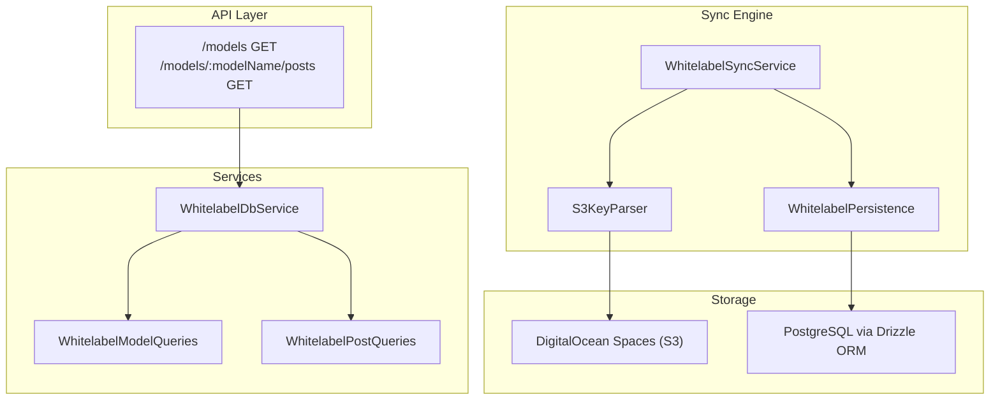
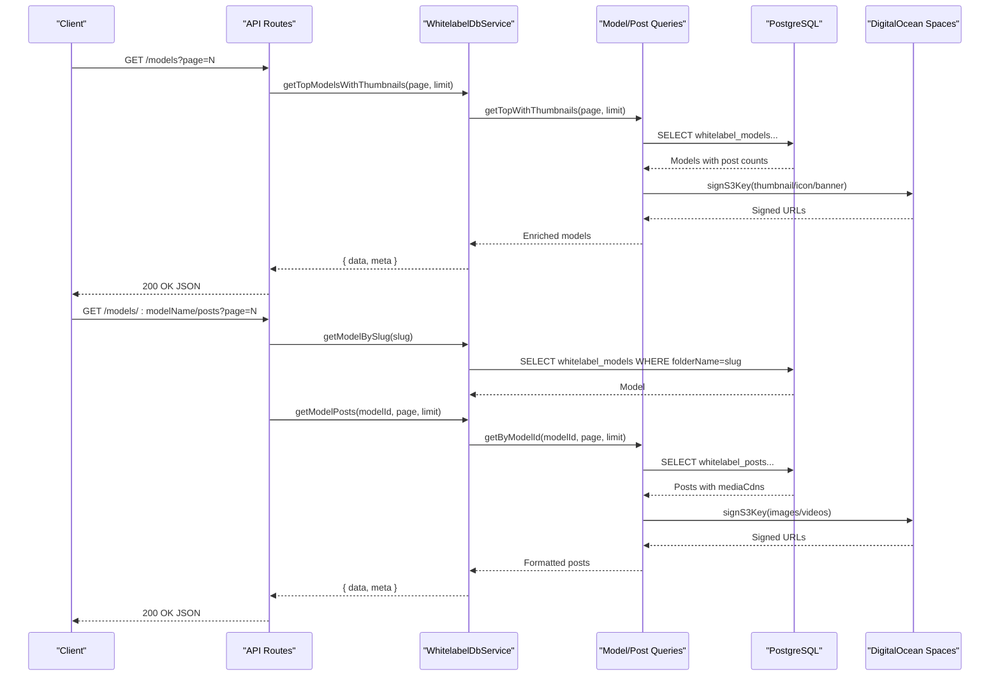
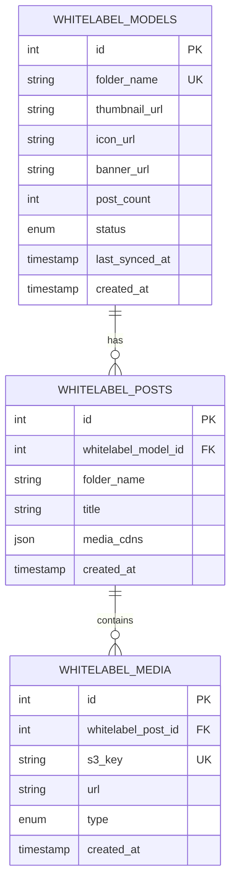
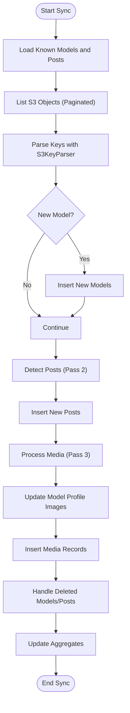
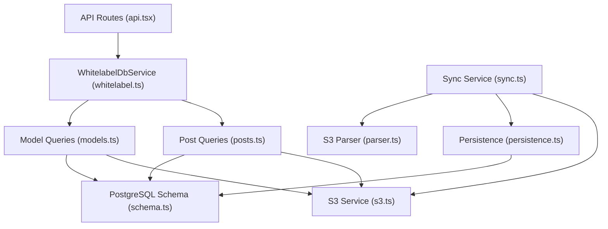

# Content Management Endpoints

<cite>
**Referenced Files in This Document**
- [api.tsx](file://src/routes/api.tsx)
- [whitelabel.ts](file://src/services/whitelabel.ts)
- [models.ts](file://src/services/whitelabel/queries/models.ts)
- [posts.ts](file://src/services/whitelabel/queries/posts.ts)
- [sync.ts](file://src/services/whitelabel/sync.ts)
- [parser.ts](file://src/services/whitelabel/sync/parser.ts)
- [persistence.ts](file://src/services/whitelabel/sync/persistence.ts)
- [schema.ts](file://src/db/schema.ts)
- [s3.ts](file://src/services/s3.ts)
- [Models.tsx](file://src/pages/Models.tsx)
- [ModelProfile.tsx](file://src/pages/ModelProfile.tsx)
</cite>

## Table of Contents
1. [Introduction](#introduction)
2. [Project Structure](#project-structure)
3. [Core Components](#core-components)
4. [Architecture Overview](#architecture-overview)
5. [Detailed Component Analysis](#detailed-component-analysis)
6. [Dependency Analysis](#dependency-analysis)
7. [Performance Considerations](#performance-considerations)
8. [Troubleshooting Guide](#troubleshooting-guide)
9. [Conclusion](#conclusion)
10. [Appendices](#appendices)

## Introduction
This document provides comprehensive API documentation for content management endpoints focused on white-label model and post discovery, pagination, and media asset handling. It covers HTTP methods, URL patterns, request/response schemas, filtering options, and content organization patterns. Practical examples with cURL commands and client implementation guidelines are included, along with guidance on content caching, media asset handling, and white-label content ingestion workflows.

## Project Structure
The content management endpoints are implemented as part of the Hono-based API routes and supported by whitelabel services, database schema, and S3 integration.

**Diagram sources**
- [api.tsx](file://src/routes/api.tsx#L276-L313)
- [whitelabel.ts](file://src/services/whitelabel.ts#L5-L24)
- [models.ts](file://src/services/whitelabel/queries/models.ts#L6-L93)
- [posts.ts](file://src/services/whitelabel/queries/posts.ts#L6-L46)
- [sync.ts](file://src/services/whitelabel/sync.ts#L6-L333)
- [parser.ts](file://src/services/whitelabel/sync/parser.ts#L10-L58)
- [persistence.ts](file://src/services/whitelabel/sync/persistence.ts#L5-L93)
- [schema.ts](file://src/db/schema.ts#L73-L103)
- [s3.ts](file://src/services/s3.ts#L1-L48)

**Section sources**
- [api.tsx](file://src/routes/api.tsx#L276-L313)
- [whitelabel.ts](file://src/services/whitelabel.ts#L5-L24)

## Core Components
- API routes expose two primary endpoints:
  - GET /models: Retrieve paginated white-label models with thumbnails.
  - GET /models/:modelName/posts: Retrieve paginated posts for a specific model by slug.
- Services encapsulate data access and white-label synchronization:
  - WhitelabelDbService: Public facade for model and post queries and sync operations.
  - WhitelabelModelQueries: Model listing, top models by post count, and thumbnail enrichment.
  - WhitelabelPostQueries: Post retrieval by model ID with signed media URLs.
  - WhitelabelSyncService: Full white-label content ingestion from S3, including models, posts, and media.
  - S3KeyParser: Parses S3 keys into structured metadata for models, posts, and profile media.
  - WhitelabelPersistence: CRUD operations and aggregate updates for whitelabel models, posts, and media.
- Database schema defines whitelabel models, posts, and media entities with relationships and constraints.
- S3 integration provides signed URLs for media assets.

**Section sources**
- [api.tsx](file://src/routes/api.tsx#L276-L313)
- [whitelabel.ts](file://src/services/whitelabel.ts#L5-L24)
- [models.ts](file://src/services/whitelabel/queries/models.ts#L6-L93)
- [posts.ts](file://src/services/whitelabel/queries/posts.ts#L6-L46)
- [sync.ts](file://src/services/whitelabel/sync.ts#L6-L333)
- [parser.ts](file://src/services/whitelabel/sync/parser.ts#L10-L58)
- [persistence.ts](file://src/services/whitelabel/sync/persistence.ts#L5-L93)
- [schema.ts](file://src/db/schema.ts#L73-L103)
- [s3.ts](file://src/services/s3.ts#L25-L47)

## Architecture Overview
The content management architecture integrates API routes, service layers, database persistence, and S3 storage. The whitelabel ingestion pipeline synchronizes content from S3 into the database and prepares signed URLs for clients.

**Diagram sources**
- [api.tsx](file://src/routes/api.tsx#L276-L313)
- [whitelabel.ts](file://src/services/whitelabel.ts#L5-L24)
- [models.ts](file://src/services/whitelabel/queries/models.ts#L59-L87)
- [posts.ts](file://src/services/whitelabel/queries/posts.ts#L7-L35)
- [s3.ts](file://src/services/s3.ts#L25-L47)
- [schema.ts](file://src/db/schema.ts#L73-L103)

## Detailed Component Analysis

### API Endpoints

#### GET /models
- Purpose: Retrieve paginated white-label models with thumbnails.
- Authentication: None.
- Query parameters:
  - page: Integer, default 1, minimum 1.
- Response schema:
  - data: Array of model objects with fields:
    - id: Integer
    - name: String (folderName)
    - postCount: Integer
    - thumbnailUrl: String (signed URL or null)
  - meta: Object with fields:
    - page: Integer
    - limit: Integer
    - count: Integer
- Pagination: Fixed limit of 20 items per page.
- Filtering: No explicit filters; models are ordered by post count descending in the service layer.
- Example cURL:
  - curl "https://your-domain/api/models?page=1"

**Section sources**
- [api.tsx](file://src/routes/api.tsx#L276-L293)
- [models.ts](file://src/services/whitelabel/queries/models.ts#L59-L74)

#### GET /models/:modelName/posts
- Purpose: Retrieve paginated posts for a specific model identified by slug.
- Authentication: None.
- Path parameters:
  - modelName: String (model slug/folderName).
- Query parameters:
  - page: Integer, default 1, minimum 1.
- Response schema:
  - data: Array of post objects with fields:
    - id: Integer
    - whitelabelModelId: Integer
    - folderName: String
    - title: String
    - thumbnail: String (first signed image URL or null)
    - mediaCdns: Object with:
      - images: Array of signed image URLs
      - videos: Array of signed video URLs
  - meta: Object with fields:
    - page: Integer
    - limit: Integer
    - count: Integer
- Pagination: Fixed limit of 20 items per page.
- Filtering: No explicit filters; posts are ordered by creation date descending.
- Example cURL:
  - curl "https://your-domain/api/models/model-slug/posts?page=1"

**Section sources**
- [api.tsx](file://src/routes/api.tsx#L296-L313)
- [posts.ts](file://src/services/whitelabel/queries/posts.ts#L7-L35)

### Data Models and Relationships

**Diagram sources**
- [schema.ts](file://src/db/schema.ts#L73-L103)

**Section sources**
- [schema.ts](file://src/db/schema.ts#L73-L103)

### White-label Content Ingestion Workflow

**Diagram sources**
- [sync.ts](file://src/services/whitelabel/sync.ts#L7-L197)
- [parser.ts](file://src/services/whitelabel/sync/parser.ts#L10-L58)
- [persistence.ts](file://src/services/whitelabel/sync/persistence.ts#L5-L93)

**Section sources**
- [sync.ts](file://src/services/whitelabel/sync.ts#L7-L197)
- [parser.ts](file://src/services/whitelabel/sync/parser.ts#L10-L58)
- [persistence.ts](file://src/services/whitelabel/sync/persistence.ts#L5-L93)

### Media Asset Handling and Caching
- Signed URLs: Media assets are accessed via signed URLs generated by the S3 service to ensure controlled access.
- CDN Integration: Media URLs are constructed using DigitalOcean Spaces CDN endpoints.
- Caching Strategy:
  - Short-lived signed URLs (1 hour) reduce exposure while enabling efficient client-side caching.
  - Clients should cache signed URLs per session and refresh upon expiration.
  - Thumbnails and profile images are signed during query enrichment to minimize repeated signing operations.

**Section sources**
- [s3.ts](file://src/services/s3.ts#L25-L47)
- [models.ts](file://src/services/whitelabel/queries/models.ts#L7-L34)
- [posts.ts](file://src/services/whitelabel/queries/posts.ts#L16-L32)

### Client Implementation Guidelines
- Pagination:
  - Use the meta.page, meta.limit, and meta.count fields to manage pagination UI.
  - Respect the fixed limit of 20 items per page.
- Media Consumption:
  - Use the signed URLs under mediaCdns.images and mediaCdns.videos for rendering.
  - Prefer the thumbnail field for preview cards.
- Error Handling:
  - Handle 404 responses when a model slug does not exist.
  - Implement retry logic for 5xx responses with exponential backoff.
- Caching:
  - Cache model lists and post feeds locally with timestamps.
  - Invalidate cached entries on pagination navigation or after significant content updates.

**Section sources**
- [api.tsx](file://src/routes/api.tsx#L276-L313)
- [posts.ts](file://src/services/whitelabel/queries/posts.ts#L16-L32)

## Dependency Analysis

**Diagram sources**
- [api.tsx](file://src/routes/api.tsx#L276-L313)
- [whitelabel.ts](file://src/services/whitelabel.ts#L5-L24)
- [models.ts](file://src/services/whitelabel/queries/models.ts#L6-L93)
- [posts.ts](file://src/services/whitelabel/queries/posts.ts#L6-L46)
- [sync.ts](file://src/services/whitelabel/sync.ts#L6-L333)
- [parser.ts](file://src/services/whitelabel/sync/parser.ts#L10-L58)
- [persistence.ts](file://src/services/whitelabel/sync/persistence.ts#L5-L93)
- [schema.ts](file://src/db/schema.ts#L73-L103)
- [s3.ts](file://src/services/s3.ts#L1-L48)

**Section sources**
- [api.tsx](file://src/routes/api.tsx#L276-L313)
- [whitelabel.ts](file://src/services/whitelabel.ts#L5-L24)
- [models.ts](file://src/services/whitelabel/queries/models.ts#L6-L93)
- [posts.ts](file://src/services/whitelabel/queries/posts.ts#L6-L46)
- [sync.ts](file://src/services/whitelabel/sync.ts#L6-L333)
- [parser.ts](file://src/services/whitelabel/sync/parser.ts#L10-L58)
- [persistence.ts](file://src/services/whitelabel/sync/persistence.ts#L5-L93)
- [schema.ts](file://src/db/schema.ts#L73-L103)
- [s3.ts](file://src/services/s3.ts#L1-L48)

## Performance Considerations
- Pagination: Fixed limit of 20 items per page reduces payload size and improves responsiveness.
- Thumbnail enrichment: Thumbnails are resolved via a single join and signed once per model to minimize repeated signing operations.
- Media signing: Media URLs are signed on demand; clients should cache signed URLs to reduce latency.
- Batch processing: The sync engine processes S3 listings in batches and performs upserts to minimize write contention.
- Aggregates: Post counts and media CDNs are updated via SQL aggregates to keep data consistent.

[No sources needed since this section provides general guidance]

## Troubleshooting Guide
- 404 Not Found:
  - Occurs when a model slug does not exist in the database.
  - Verify the slug corresponds to a whitelabel model’s folderName.
- 500 Internal Server Error:
  - Indicates database or service failures during model or post retrieval.
  - Check database connectivity and query logs.
- Missing Thumbnails or Media:
  - Ensure S3 keys are correctly parsed and signed; verify CDN URLs are reachable.
  - Confirm that profile media (icon/banners) and post media are present in S3.
- Pagination Issues:
  - Validate page parameter is an integer >= 1.
  - Ensure clients respect the fixed limit of 20 items per page.

**Section sources**
- [api.tsx](file://src/routes/api.tsx#L296-L313)
- [models.ts](file://src/services/whitelabel/queries/models.ts#L76-L87)
- [posts.ts](file://src/services/whitelabel/queries/posts.ts#L7-L35)

## Conclusion
The content management endpoints provide a robust foundation for white-label model and post discovery with integrated media asset handling. The API offers predictable pagination, signed URLs for secure media access, and a scalable ingestion pipeline for syncing content from S3. Clients should implement caching strategies and handle pagination and error responses appropriately to ensure optimal performance and user experience.

[No sources needed since this section summarizes without analyzing specific files]

## Appendices

### API Reference Summary

- GET /models
  - Query parameters: page (Integer, default 1)
  - Response: { data: Model[], meta: { page, limit, count } }

- GET /models/:modelName/posts
  - Path parameters: modelName (String)
  - Query parameters: page (Integer, default 1)
  - Response: { data: Post[], meta: { page, limit, count } }

- Example cURL Commands
  - curl "https://your-domain/api/models?page=1"
  - curl "https://your-domain/api/models/model-slug/posts?page=1"

**Section sources**
- [api.tsx](file://src/routes/api.tsx#L276-L313)

### Frontend Integration Notes
- The Models page renders model cards using the models endpoint.
- The Model Profile page displays model details and initial posts fetched from the posts endpoint.

**Section sources**
- [Models.tsx](file://src/pages/Models.tsx#L16-L56)
- [ModelProfile.tsx](file://src/pages/ModelProfile.tsx#L15-L51)