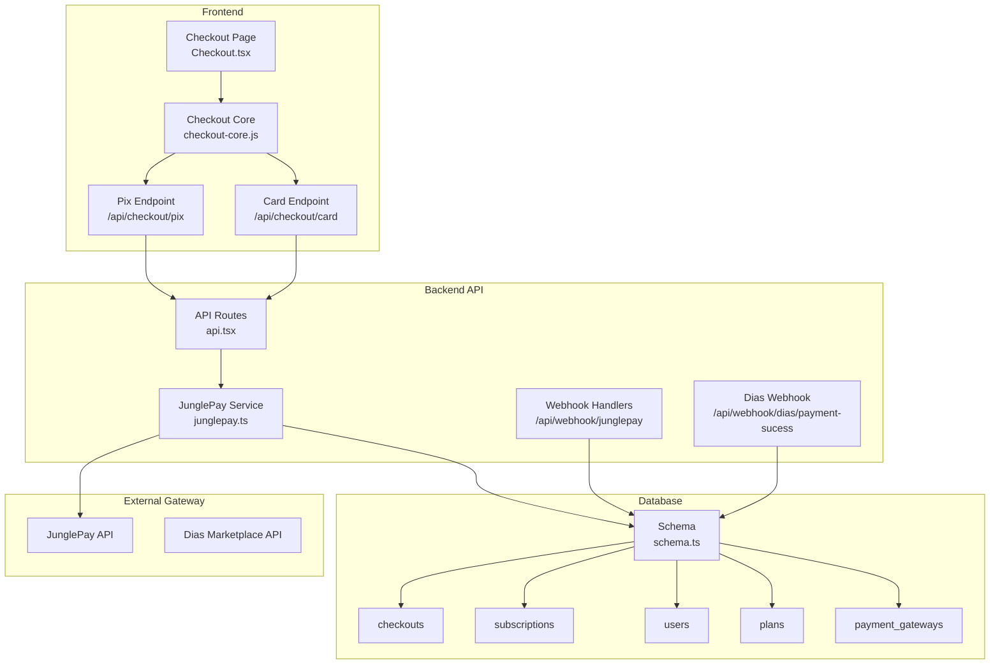
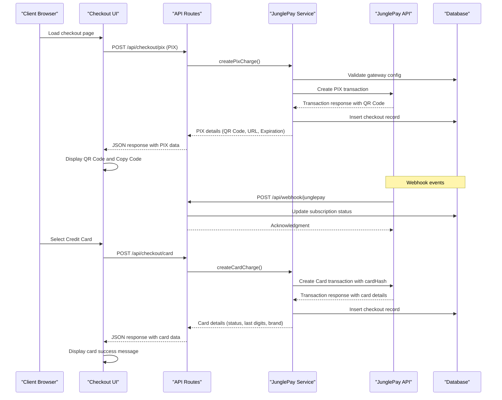
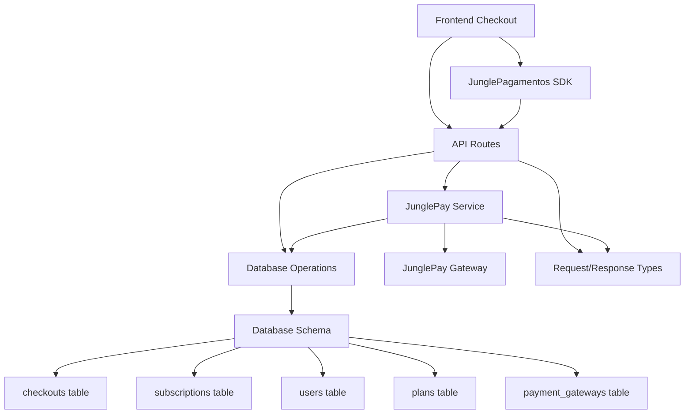

# Payment Processing Endpoints

<cite>
**Referenced Files in This Document**
- [api.tsx](file://src/routes/api.tsx)
- [junglepay.ts](file://src/services/junglepay.ts)
- [schema.ts](file://src/db/schema.ts)
- [checkout-core.js](file://static/js/checkout-core.js)
- [Checkout.tsx](file://src/pages/Checkout.tsx)
- [junglepay-documentation.md](file://junglepay-documentation.md)
</cite>

## Update Summary
**Changes Made**
- Added comprehensive documentation for the new `/api/checkout/card` endpoint for credit card processing
- Enhanced existing endpoints documentation to include comprehensive credit card payment flow alongside existing PIX functionality
- Updated endpoint descriptions and request/response schemas to reflect the expanded payment capabilities
- Added detailed credit card charge generation workflow and response schemas
- Expanded error handling strategies for credit card transactions
- Updated frontend integration examples for credit card checkout flow

## Table of Contents
1. [Introduction](#introduction)
2. [Project Structure](#project-structure)
3. [Core Components](#core-components)
4. [Architecture Overview](#architecture-overview)
5. [Detailed Component Analysis](#detailed-component-analysis)
6. [Dependency Analysis](#dependency-analysis)
7. [Performance Considerations](#performance-considerations)
8. [Troubleshooting Guide](#troubleshooting-guide)
9. [Conclusion](#conclusion)

## Introduction
This document provides comprehensive API documentation for payment processing endpoints in the CreatorFlix platform. It covers HTTP methods, URL patterns, request/response schemas, payment gateway integration with JunglePay, and webhook payload handling. The documentation includes parameter specifications for checkout creation, PIX charge generation, credit card processing, webhook payload handling, payment status updates, payment method configurations, amount formatting, customer data validation, error handling strategies, practical examples with cURL commands, webhook implementation guidelines, payment security considerations, webhook verification, and transaction lifecycle management.

**Updated** Added new `/api/checkout/card` endpoint for credit card processing and enhanced webhook processing documentation to include comprehensive payment method support.

## Project Structure
The payment processing system is implemented using Hono (serverless framework) with PostgreSQL and Drizzle ORM. The key components include:
- API routes for checkout and webhooks
- JunglePay service for PIX and credit card transactions
- Database schema for storing payment data
- Frontend checkout flow with client-side JavaScript

**Diagram sources**
- [api.tsx](file://src/routes/api.tsx#L15-L136)
- [junglepay.ts](file://src/services/junglepay.ts#L52-L485)
- [schema.ts](file://src/db/schema.ts#L113-L127)

**Section sources**
- [api.tsx](file://src/routes/api.tsx#L1-L569)
- [junglepay.ts](file://src/services/junglepay.ts#L1-L487)
- [schema.ts](file://src/db/schema.ts#L1-L178)

## Core Components
The payment processing system consists of six main endpoints:

### 1. Checkout Creation Endpoint
- **Method**: POST
- **Path**: `/api/checkout/process`
- **Purpose**: Creates a checkout record for traditional credit card payments
- **Response**: JSON with success status and checkoutId

### 2. PIX Charge Generation Endpoint
- **Method**: POST
- **Path**: `/api/checkout/pix`
- **Purpose**: Generates PIX charges via JunglePay
- **Response**: JSON with PIX details or error information

### 3. Credit Card Charge Generation Endpoint
- **Method**: POST
- **Path**: `/api/checkout/card`
- **Purpose**: Creates credit card charges via JunglePay with tokenization
- **Response**: JSON with card details or error information

### 4. JunglePay Webhook Endpoint
- **Method**: POST
- **Path**: `/api/webhook/junglepay`
- **Purpose**: Handles payment status updates from JunglePay
- **Response**: JSON acknowledgment or error

### 5. Dias Marketplace Webhook Endpoint
- **Method**: POST
- **Path**: `/api/webhook/dias/payment-sucess`
- **Purpose**: Handles payment status updates from Dias Marketplace
- **Response**: JSON acknowledgment or error

### 6. Admin Finance Gateway Configuration
- **Method**: POST
- **Path**: `/api/admin/finance/gateway`
- **Purpose**: Activates/deactivates payment gateways
- **Response**: Redirect to admin finance page

### 7. Admin JunglePay Configuration
- **Method**: POST
- **Path**: `/api/admin/finance/junglepay`
- **Purpose**: Configures JunglePay credentials
- **Response**: Redirect to admin finance page

**Updated** Added the new `/api/checkout/card` endpoint for credit card processing and enhanced gateway configuration endpoints.

**Section sources**
- [api.tsx](file://src/routes/api.tsx#L15-L136)
- [api.tsx](file://src/routes/api.tsx#L138-L220)
- [api.tsx](file://src/routes/api.tsx#L451-L556)
- [api.tsx](file://src/routes/api.tsx#L222-L266)

## Architecture Overview
The payment processing architecture follows a clear separation of concerns with distinct layers for frontend, backend API, payment service, and external gateway integration.

**Updated** Enhanced the sequence diagram to show the new credit card processing workflow with tokenization and card details display.

**Diagram sources**
- [checkout-core.js](file://static/js/checkout-core.js#L265-L472)
- [api.tsx](file://src/routes/api.tsx#L88-L136)
- [junglepay.ts](file://src/services/junglepay.ts#L311-L485)

## Detailed Component Analysis

### Checkout Creation Endpoint (`/api/checkout/process`)
This endpoint handles traditional credit card checkout creation and stores customer information in the database.

**Request Schema:**
- planId: integer (required)
- paymentMethod: string (required, must be 'credit_card')
- orderBump: boolean (optional)
- email: string (required)
- name: string (required)
- cpf: string (required)
- phone: string (required)
- totalAmount: integer (required, in cents)

**Response Schema:**
- success: boolean
- checkoutId: integer

**Processing Logic:**
1. Validates request parameters
2. Creates checkout record with pending status
3. Returns success with checkout identifier

**Section sources**
- [api.tsx](file://src/routes/api.tsx#L15-L39)
- [schema.ts](file://src/db/schema.ts#L113-L127)

### PIX Charge Generation Endpoint (`/api/checkout/pix`)
This endpoint generates PIX charges via JunglePay and handles all validation and error scenarios.

**Request Validation:**
- Required fields: customerName, customerEmail, customerDocument, totalAmount, planId
- Additional validations: plan existence, gateway configuration, amount validity

**JunglePay Integration:**
- Authentication: Basic Auth using secret key
- Payload construction: Includes customer data, items, and postback URL
- Error handling: Comprehensive error mapping with specific status codes

**Response Schema:**
- Success response includes: transactionId, pixQrCode, pixUrl, expirationDate, status
- Error response includes: success (false), error (string), code (enumerated)

**Section sources**
- [api.tsx](file://src/routes/api.tsx#L41-L86)
- [junglepay.ts](file://src/services/junglepay.ts#L145-L306)

### Credit Card Charge Generation Endpoint (`/api/checkout/card`)
This endpoint creates credit card charges via JunglePay with comprehensive validation, tokenization, and error handling.

**Request Validation:**
- Required fields: customerName, customerEmail, customerDocument, totalAmount, planId, cardHash
- Additional validations: plan existence, gateway configuration, amount validity, card hash presence

**Frontend Tokenization:**
- Uses JunglePagamentos SDK for secure card tokenization
- Collects card holder name, number, expiry, CVC, and installments
- Validates card number length (13-19 digits)
- Parses expiry date format (MM/YY or MM/YYYY)

**JunglePay Integration:**
- Authentication: Basic Auth using secret key
- Payload construction: Includes card hash, installments, customer data, items, and postback URL
- Error handling: Comprehensive error mapping including card refusal scenarios

**Response Schema:**
- Success response includes: transactionId, status, cardLastDigits, cardBrand, installments
- Error response includes: success (false), error (string), code (enumerated)

**Section sources**
- [api.tsx](file://src/routes/api.tsx#L88-L136)
- [junglepay.ts](file://src/services/junglepay.ts#L311-L485)
- [checkout-core.js](file://static/js/checkout-core.js#L277-L350)

### JunglePay Webhook Handler (`/api/webhook/junglepay`)
This endpoint processes payment status updates from JunglePay and manages subscription lifecycle.

**Webhook Processing Flow:**
1. Parse and validate webhook payload
2. Filter for transaction type events
3. Handle different payment statuses:
   - paid: Activate subscription, update user status, mark checkout as paid
   - waiting_payment: Log and acknowledge
   - Other statuses: Ignore gracefully

**Data Synchronization:**
- User lookup by email
- Plan matching by closest price value
- Subscription creation with calculated dates
- Checkout status updates

**Section sources**
- [api.tsx](file://src/routes/api.tsx#L138-L220)

### Dias Marketplace Webhook Handler (`/api/webhook/dias/payment-sucess`)
This endpoint handles payment notifications from Dias Marketplace with a two-stage payment flow.

**Webhook Processing:**
1. Parse webhook payload
2. Handle PENDING status: Create pending subscription
3. Handle PAID status: Activate existing pending subscription
4. Graceful handling of missing users/subscriptions

**Subscription Management:**
- Pending stage: Create subscription with null dates
- Paid stage: Calculate start/end dates based on plan duration
- User status update to active

**Section sources**
- [api.tsx](file://src/routes/api.tsx#L451-L556)

### Admin Finance Configuration Endpoints
These endpoints handle payment gateway configuration and plan management.

**Gateway Activation Endpoint (`/api/admin/finance/gateway`):**
- Toggles payment gateway activation status
- Supports multiple gateways (JunglePay, Dias Marketplace)

**JunglePay Configuration Endpoint (`/api/admin/finance/junglepay`):**
- Updates JunglePay public and secret keys
- Implements upsert logic for gateway configuration

**Plan Management Endpoint (`/api/admin/plans/update`):**
- Updates plan pricing and acceptance flags
- Supports both PIX and credit card acceptance flags
- Converts price format from string to cents

**Section sources**
- [api.tsx](file://src/routes/api.tsx#L222-L298)

### JunglePay Service Implementation
The JunglePay service encapsulates all gateway-specific logic and provides a clean interface for the API layer.

**Key Features:**
- Gateway configuration validation
- Customer data sanitization (CPF, phone removal)
- Dynamic item construction based on plan and order bump
- Secure authentication header generation
- Comprehensive error handling with mapped error codes

**Error Codes:**
- GATEWAY_NOT_CONFIGURED: Gateway missing or inactive
- GATEWAY_INACTIVE: Gateway configured but not active
- INVALID_DATA: Missing or invalid required fields
- API_ERROR: Communication failures with JunglePay
- UNEXPECTED_RESPONSE: Malformed responses from gateway
- CARD_REFUSED: Credit card declined by issuer

**Section sources**
- [junglepay.ts](file://src/services/junglepay.ts#L90-L485)

## Dependency Analysis
The payment system has clear dependencies between components, with the API routes depending on the JunglePay service, which in turn depends on database configuration and external gateway APIs.

**Diagram sources**
- [api.tsx](file://src/routes/api.tsx#L1-L12)
- [junglepay.ts](file://src/services/junglepay.ts#L1-L3)
- [schema.ts](file://src/db/schema.ts#L1-L178)
- [checkout-core.js](file://static/js/checkout-core.js#L38-L42)

**Section sources**
- [api.tsx](file://src/routes/api.tsx#L1-L12)
- [junglepay.ts](file://src/services/junglepay.ts#L1-L3)
- [schema.ts](file://src/db/schema.ts#L1-L178)

## Performance Considerations
The payment system implements several performance optimizations:

### Database Operations
- Efficient queries using prepared statements and parameterized queries
- Minimal database round trips through batch operations
- Proper indexing on frequently queried fields (email, externalId)

### External API Calls
- Asynchronous processing to avoid blocking requests
- Proper timeout configuration for external gateway calls
- Error handling to prevent cascading failures

### Frontend Experience
- Client-side validation reduces unnecessary API calls
- QR code generation handled efficiently in browser
- Progressive loading indicators for better UX
- Card tokenization performed client-side for security

## Troubleshooting Guide

### Common Error Scenarios

**Gateway Configuration Issues:**
- Error: "Gateway JunglePay não está configurado no sistema"
- Resolution: Verify payment gateway configuration in admin panel

**Validation Failures:**
- Error: "Campo obrigatório ausente: [field]"
- Resolution: Ensure all required fields are present in request

**Amount Formatting Issues:**
- Error: "Valor total inválido"
- Resolution: Amount must be positive integer in cents

**Customer Data Validation:**
- Error: "Dados do cliente incompletos"
- Resolution: Verify CPF/CNPJ format and required fields

**Credit Card Processing Issues:**
- Error: "Cartão recusado pela operadora"
- Resolution: Verify card details and card hash validity
- Error: "Número do cartão inválido"
- Resolution: Card number must be 13-19 digits

**Frontend Tokenization Issues:**
- Error: "SDK de pagamento não carregado. Recarregue a página."
- Resolution: Ensure JunglePagamentos SDK loads successfully
- Error: "Erro ao tokenizar cartão. Verifique os dados."
- Resolution: Verify card details format and JunglePay public key

### Debugging Steps
1. Enable detailed logging in webhook handlers
2. Verify webhook URLs in payment gateway settings
3. Check database connectivity and migrations
4. Validate JWT secrets and cookie configurations
5. Monitor external API response times
6. Test card tokenization separately from payment processing

**Section sources**
- [api.tsx](file://src/routes/api.tsx#L78-L85)
- [junglepay.ts](file://src/services/junglepay.ts#L135-L161)
- [checkout-core.js](file://static/js/checkout-core.js#L304-L310)

## Conclusion
The payment processing system provides a robust, scalable solution for handling multiple payment methods including PIX via JunglePay and traditional credit card payments with secure tokenization. The architecture ensures clear separation of concerns, comprehensive error handling, and efficient database operations. The webhook implementations provide reliable payment status synchronization, while the frontend checkout flow offers a seamless user experience with both PIX QR code generation and credit card processing capabilities. The system is designed for extensibility, allowing easy addition of new payment methods and gateways, and includes comprehensive administrative controls for payment gateway configuration and plan management.

**Updated** Enhanced conclusion to reflect the new credit card endpoint capabilities, secure tokenization process, and improved payment method diversity.