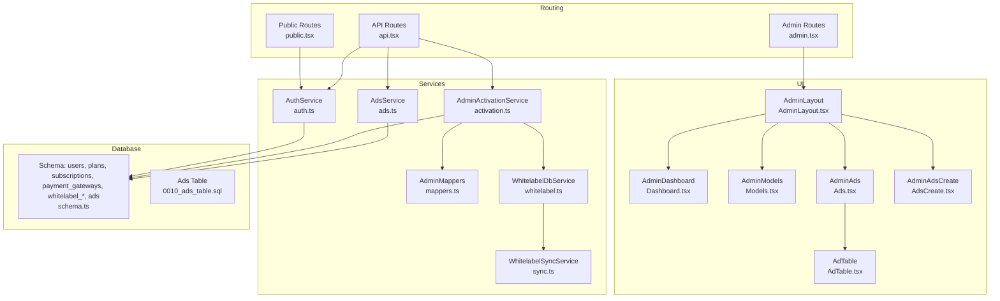
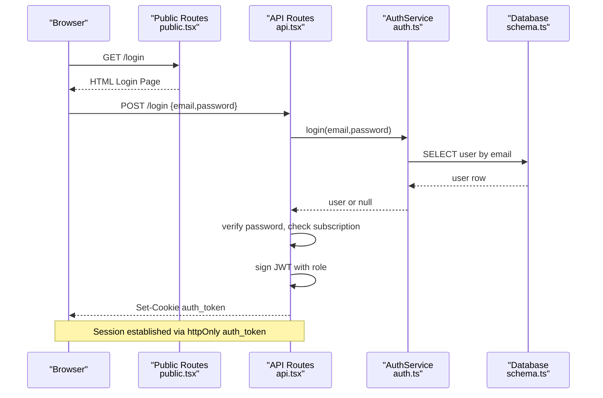
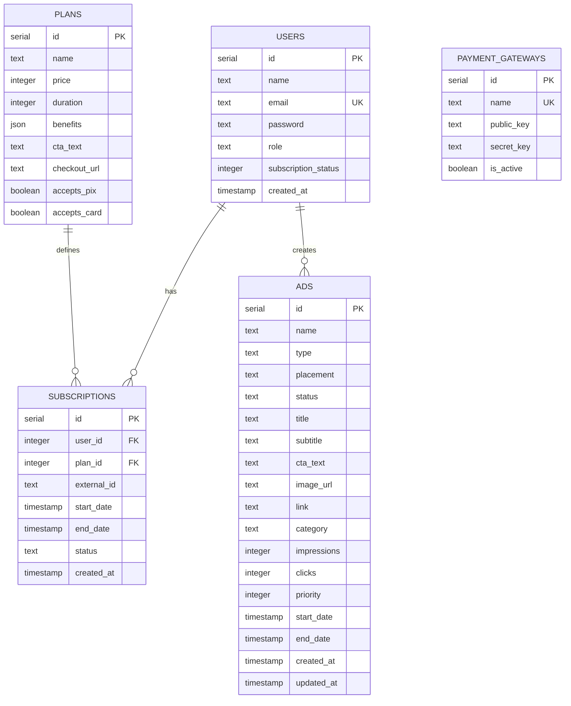
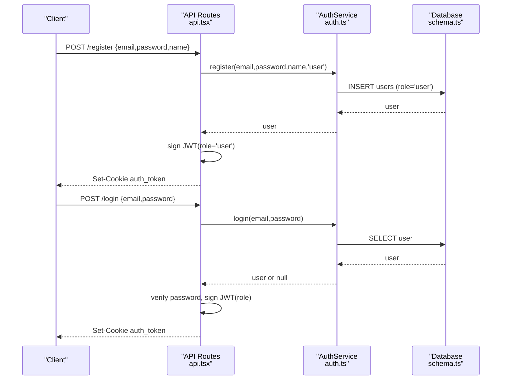
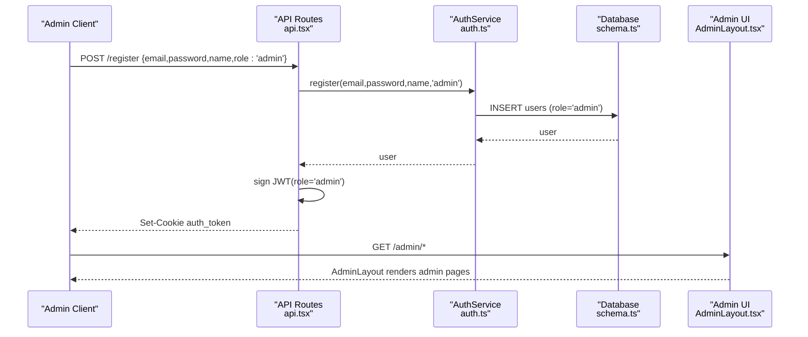
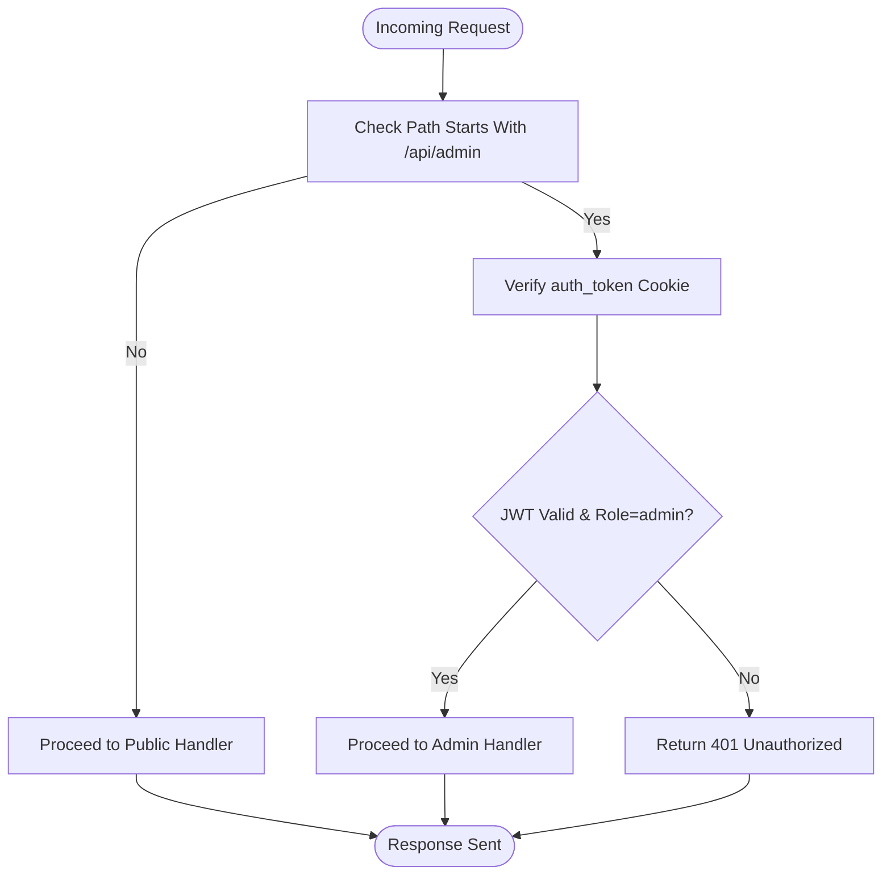
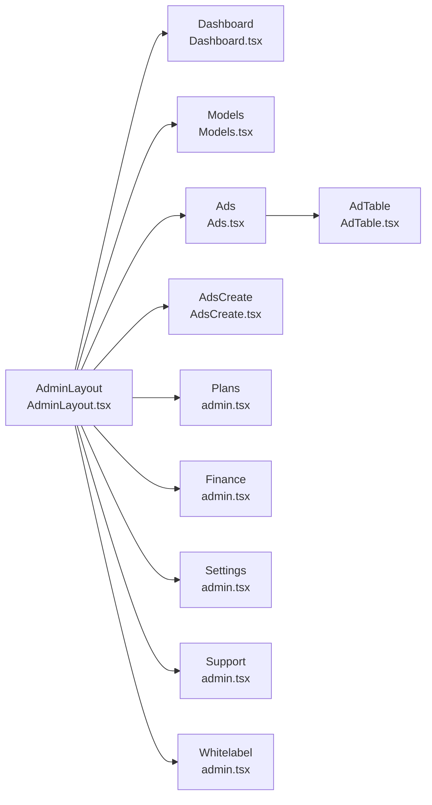
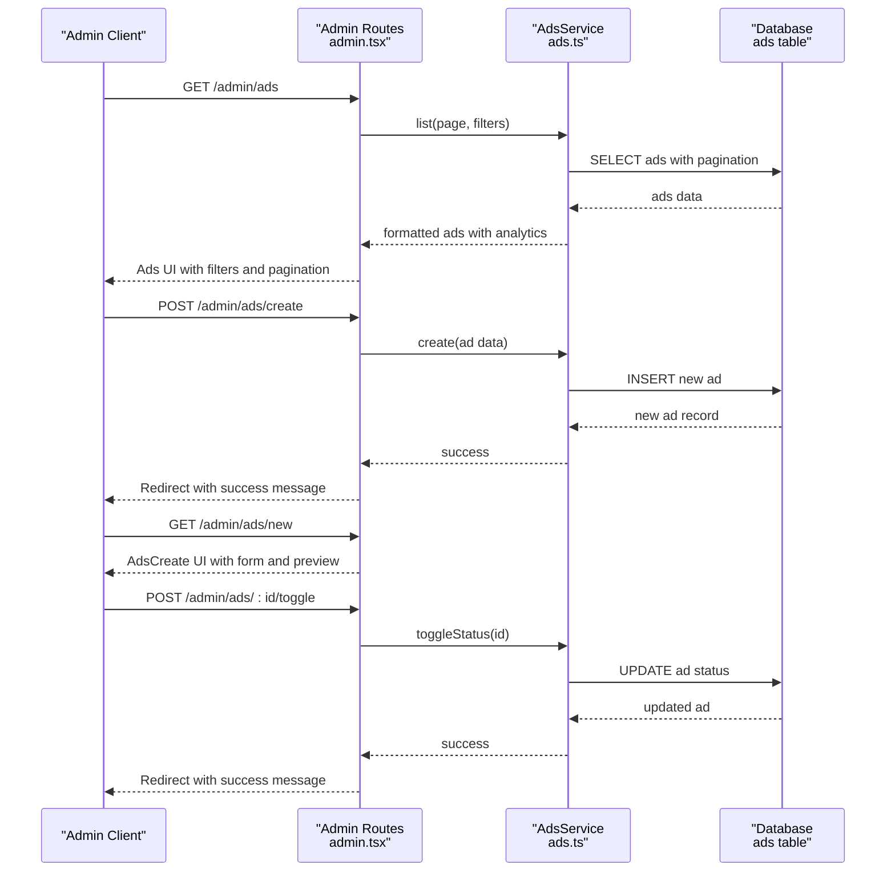
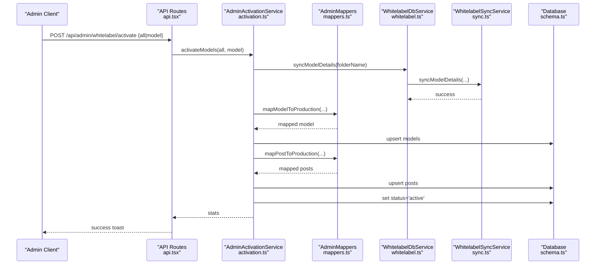
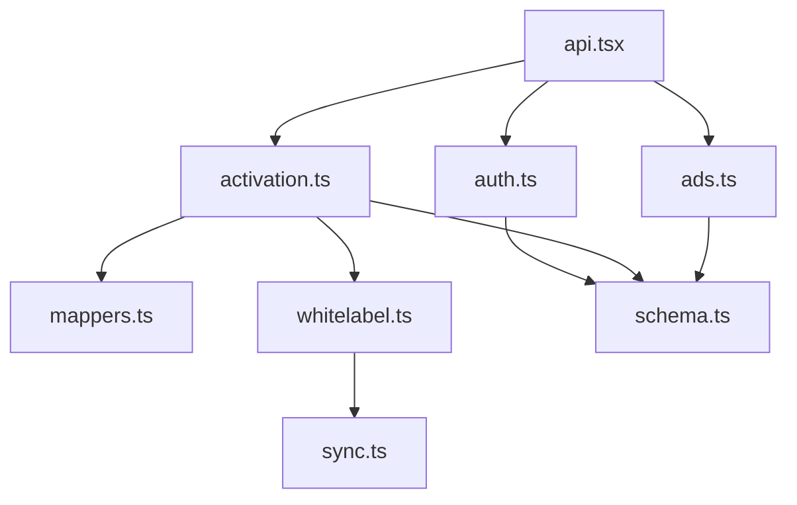

# Administrator Authorization

<cite>
**Referenced Files in This Document**
- [schema.ts](file://src/db/schema.ts)
- [auth.ts](file://src/services/auth.ts)
- [api.tsx](file://src/routes/api.tsx)
- [public.tsx](file://src/routes/public.tsx)
- [admin.tsx](file://src/routes/admin.tsx)
- [Admin.tsx](file://src/pages/Admin.tsx)
- [Dashboard.tsx](file://src/pages/admin/Dashboard.tsx)
- [Models.tsx](file://src/pages/admin/Models.tsx)
- [Ads.tsx](file://src/pages/admin/Ads.tsx)
- [AdsCreate.tsx](file://src/pages/admin/AdsCreate.tsx)
- [AdminLayout.tsx](file://src/components/templates/AdminLayout.tsx)
- [AdTable.tsx](file://src/components/organisms/AdTable.tsx)
- [activation.ts](file://src/services/admin/activation.ts)
- [mappers.ts](file://src/services/admin/mappers.ts)
- [ads.ts](file://src/services/ads.ts)
- [whitelabel.ts](file://src/services/whitelabel.ts)
- [sync.ts](file://src/services/whitelabel/sync.ts)
- [0010_ads_table.sql](file://drizzle/0010_ads_table.sql)
- [0010_snapshot.json](file://drizzle/meta/0010_snapshot.json)
</cite>

## Update Summary
**Changes Made**
- Added comprehensive ad management routes and functionality
- Enhanced Admin Dashboard with advertising controls and campaign management
- Implemented complete CRUD operations for advertisements
- Added advanced filtering, pagination, and analytics for ad campaigns
- Integrated real-time preview system for ad creatives
- Added sophisticated ad placement validation and management

## Table of Contents
1. [Introduction](#introduction)
2. [Project Structure](#project-structure)
3. [Core Components](#core-components)
4. [Architecture Overview](#architecture-overview)
5. [Detailed Component Analysis](#detailed-component-analysis)
6. [Dependency Analysis](#dependency-analysis)
7. [Performance Considerations](#performance-considerations)
8. [Troubleshooting Guide](#troubleshooting-guide)
9. [Conclusion](#conclusion)

## Introduction
This document explains administrator authorization and role-based access control in the system. It covers admin user creation, role assignment, and permission hierarchies; admin dashboard access and administrative capabilities; enforcement of administrative privileges; admin-only route protection; permission checking mechanisms; audit logging; differences between regular user and admin authentication flows; special admin endpoints; elevated access controls; admin session management; multi-admin scenarios; and security considerations for privileged accounts.

**Updated** The system now includes comprehensive advertisement management capabilities with full CRUD operations, advanced targeting options, and real-time analytics for advertising campaigns.

## Project Structure
The authorization system spans routing, authentication services, database schema, admin UI pages, and admin-only backend endpoints. Admin-capable actions are exposed via dedicated API endpoints and server-rendered admin routes with enhanced advertising management functionality.

**Diagram sources**
- [public.tsx](file://src/routes/public.tsx#L1-L170)
- [api.tsx](file://src/routes/api.tsx#L1-L519)
- [admin.tsx](file://src/routes/admin.tsx#L1-L158)
- [auth.ts](file://src/services/auth.ts#L1-L91)
- [activation.ts](file://src/services/admin/activation.ts#L1-L86)
- [ads.ts](file://src/services/ads.ts#L1-L329)
- [mappers.ts](file://src/services/admin/mappers.ts#L1-L40)
- [whitelabel.ts](file://src/services/whitelabel.ts#L1-L24)
- [sync.ts](file://src/services/whitelabel/sync.ts#L1-L334)
- [AdminLayout.tsx](file://src/components/templates/AdminLayout.tsx#L1-L64)
- [Dashboard.tsx](file://src/pages/admin/Dashboard.tsx#L1-L85)
- [Models.tsx](file://src/pages/admin/Models.tsx#L1-L35)
- [Ads.tsx](file://src/pages/admin/Ads.tsx#L1-L131)
- [AdsCreate.tsx](file://src/pages/admin/AdsCreate.tsx#L1-L569)
- [AdTable.tsx](file://src/components/organisms/AdTable.tsx#L1-L119)
- [schema.ts](file://src/db/schema.ts#L1-L178)
- [0010_ads_table.sql](file://drizzle/0010_ads_table.sql#L1-L21)

**Section sources**
- [public.tsx](file://src/routes/public.tsx#L1-L170)
- [api.tsx](file://src/routes/api.tsx#L1-L519)
- [admin.tsx](file://src/routes/admin.tsx#L1-L158)
- [auth.ts](file://src/services/auth.ts#L1-L91)
- [activation.ts](file://src/services/admin/activation.ts#L1-L86)
- [ads.ts](file://src/services/ads.ts#L1-L329)
- [mappers.ts](file://src/services/admin/mappers.ts#L1-L40)
- [whitelabel.ts](file://src/services/whitelabel.ts#L1-L24)
- [sync.ts](file://src/services/whitelabel/sync.ts#L1-L334)
- [AdminLayout.tsx](file://src/components/templates/AdminLayout.tsx#L1-L64)
- [Dashboard.tsx](file://src/pages/admin/Dashboard.tsx#L1-L85)
- [Models.tsx](file://src/pages/admin/Models.tsx#L1-L35)
- [Ads.tsx](file://src/pages/admin/Ads.tsx#L1-L131)
- [AdsCreate.tsx](file://src/pages/admin/AdsCreate.tsx#L1-L569)
- [AdTable.tsx](file://src/components/organisms/AdTable.tsx#L1-L119)
- [schema.ts](file://src/db/schema.ts#L1-L178)
- [0010_ads_table.sql](file://drizzle/0010_ads_table.sql#L1-L21)

## Core Components
- Role model: Users have a role field with values admin or user.
- Authentication: Login and registration endpoints produce a signed JWT stored in an httpOnly cookie.
- Admin-only endpoints: Dedicated API endpoints under /api/admin/* for administrative tasks.
- Admin UI: Server-rendered admin pages protected by role checks in the API layer.
- Admin activation pipeline: Imports whitelabel content into production models and posts.
- **Updated** Advertisement management: Comprehensive ad creation, editing, and analytics with real-time preview capabilities.

**Section sources**
- [schema.ts](file://src/db/schema.ts#L6-L14)
- [auth.ts](file://src/services/auth.ts#L5-L39)
- [api.tsx](file://src/routes/api.tsx#L315-L379)
- [api.tsx](file://src/routes/api.tsx#L250-L273)
- [admin.tsx](file://src/routes/admin.tsx#L1-L158)
- [ads.ts](file://src/services/ads.ts#L1-L329)

## Architecture Overview
The system enforces admin authorization centrally in the API layer. Requests to admin endpoints are validated against the user's role embedded in the JWT. Admin UI pages are rendered server-side and include navigation tailored for administrators with enhanced advertising management capabilities.

**Diagram sources**
- [public.tsx](file://src/routes/public.tsx#L167-L168)
- [api.tsx](file://src/routes/api.tsx#L315-L349)
- [auth.ts](file://src/services/auth.ts#L28-L39)
- [schema.ts](file://src/db/schema.ts#L6-L14)

## Detailed Component Analysis

### Role Model and Schema
- The users table includes a role field constrained to admin or user.
- Subscriptions and plans tables support billing and access control.
- Payment gateways table supports administrative configuration of payment providers.
- **Updated** Ads table supports comprehensive advertisement management with tracking metrics.

**Diagram sources**
- [schema.ts](file://src/db/schema.ts#L6-L14)
- [schema.ts](file://src/db/schema.ts#L16-L27)
- [schema.ts](file://src/db/schema.ts#L37-L46)
- [schema.ts](file://src/db/schema.ts#L29-L35)
- [0010_ads_table.sql](file://drizzle/0010_ads_table.sql#L1-L21)

**Section sources**
- [schema.ts](file://src/db/schema.ts#L6-L14)
- [schema.ts](file://src/db/schema.ts#L16-L27)
- [schema.ts](file://src/db/schema.ts#L37-L46)
- [schema.ts](file://src/db/schema.ts#L29-L35)
- [0010_ads_table.sql](file://drizzle/0010_ads_table.sql#L1-L21)
- [0010_snapshot.json](file://drizzle/meta/0010_snapshot.json#L32-L160)

### Authentication and Session Management
- Registration and login endpoints create or validate credentials and issue a signed JWT in an httpOnly cookie.
- The JWT payload includes user identity and role.
- Logout clears the auth_token cookie.

**Diagram sources**
- [api.tsx](file://src/routes/api.tsx#L351-L379)
- [api.tsx](file://src/routes/api.tsx#L315-L349)
- [auth.ts](file://src/services/auth.ts#L6-L26)
- [auth.ts](file://src/services/auth.ts#L28-L39)
- [schema.ts](file://src/db/schema.ts#L6-L14)

**Section sources**
- [api.tsx](file://src/routes/api.tsx#L315-L379)
- [api.tsx](file://src/routes/api.tsx#L508-L517)
- [auth.ts](file://src/services/auth.ts#L6-L39)
- [schema.ts](file://src/db/schema.ts#L6-L14)

### Admin Authentication Flow
- Admin users are created with role=admin during registration or via administrative processes.
- The JWT payload carries role, enabling downstream checks.
- Admin UI pages are server-rendered and include admin navigation.

**Diagram sources**
- [api.tsx](file://src/routes/api.tsx#L351-L379)
- [auth.ts](file://src/services/auth.ts#L6-L26)
- [AdminLayout.tsx](file://src/components/templates/AdminLayout.tsx#L9-L22)
- [Admin.tsx](file://src/pages/Admin.tsx#L4-L24)

**Section sources**
- [api.tsx](file://src/routes/api.tsx#L351-L379)
- [auth.ts](file://src/services/auth.ts#L6-L26)
- [AdminLayout.tsx](file://src/components/templates/AdminLayout.tsx#L9-L22)
- [Admin.tsx](file://src/pages/Admin.tsx#L4-L24)

### Admin-Only Route Protection
- Admin endpoints are defined under /api/admin/* and are intended for administrative tasks.
- The current code does not implement middleware to enforce role-based access control on these endpoints.
- Recommendation: Add a middleware that verifies the presence of a verified JWT with role=admin before invoking handler logic.

**Section sources**
- [api.tsx](file://src/routes/api.tsx#L250-L273)
- [api.tsx](file://src/routes/api.tsx#L172-L194)
- [api.tsx](file://src/routes/api.tsx#L196-L216)
- [api.tsx](file://src/routes/api.tsx#L218-L248)

### Permission Checking Mechanisms
- Role is embedded in the JWT payload; handlers should verify role before performing sensitive operations.
- Current admin endpoints do not perform role checks; they should be augmented with middleware to enforce admin-only access.

**Section sources**
- [api.tsx](file://src/routes/api.tsx#L315-L349)
- [api.tsx](file://src/routes/api.tsx#L250-L273)

### Audit Logging
- Webhooks and admin actions log events to the console.
- Recommendations:
  - Centralize logs with structured entries (timestamp, actor, action, target, outcome).
  - Store audit records in a dedicated table for compliance and monitoring.
  - Include request correlation IDs and sensitive data redaction.

**Section sources**
- [api.tsx](file://src/routes/api.tsx#L89-L170)
- [api.tsx](file://src/routes/api.tsx#L401-L506)
- [admin.tsx](file://src/routes/admin.tsx#L147-L155)

### Admin Dashboard Access and Capabilities
- Admin UI is served via server-rendered pages under /admin/*.
- Dashboard, Models, Ads, Plans, Finance, Settings, Support, and Whitelabel views are provided.
- AdminLayout provides navigation and header for admin pages.
- **Updated** Ads management includes comprehensive campaign creation, editing, and analytics with real-time preview capabilities.

**Diagram sources**
- [AdminLayout.tsx](file://src/components/templates/AdminLayout.tsx#L9-L22)
- [Dashboard.tsx](file://src/pages/admin/Dashboard.tsx#L5-L84)
- [Models.tsx](file://src/pages/admin/Models.tsx#L7-L34)
- [Ads.tsx](file://src/pages/admin/Ads.tsx#L7-L32)
- [AdsCreate.tsx](file://src/pages/admin/AdsCreate.tsx#L40-L569)
- [AdTable.tsx](file://src/components/organisms/AdTable.tsx#L17-L119)
- [admin.tsx](file://src/routes/admin.tsx#L18-L83)
- [admin.tsx](file://src/routes/admin.tsx#L117-L155)

**Section sources**
- [AdminLayout.tsx](file://src/components/templates/AdminLayout.tsx#L9-L22)
- [Dashboard.tsx](file://src/pages/admin/Dashboard.tsx#L5-L84)
- [Models.tsx](file://src/pages/admin/Models.tsx#L7-L34)
- [Ads.tsx](file://src/pages/admin/Ads.tsx#L7-L32)
- [AdsCreate.tsx](file://src/pages/admin/AdsCreate.tsx#L40-L569)
- [AdTable.tsx](file://src/components/organisms/AdTable.tsx#L17-L119)
- [admin.tsx](file://src/routes/admin.tsx#L18-L83)
- [admin.tsx](file://src/routes/admin.tsx#L117-L155)

### Advertisement Management System
- **New** Comprehensive ad management with full CRUD operations for advertising campaigns.
- Supports multiple ad types: Diamond (Post), Diamond Block, Banner, Ad Spot, and Hero Carousel.
- Advanced targeting with placement-specific configurations.
- Real-time analytics including impressions, clicks, and click-through rate (CTR) calculations.
- Dynamic preview system with client-side JavaScript for real-time ad rendering.
- Sophisticated validation ensuring ad placements match ad types.

**Diagram sources**
- [admin.tsx](file://src/routes/admin.tsx#L39-L161)
- [ads.ts](file://src/services/ads.ts#L86-L329)
- [Ads.tsx](file://src/pages/admin/Ads.tsx#L29-L131)
- [AdsCreate.tsx](file://src/pages/admin/AdsCreate.tsx#L40-L569)

**Section sources**
- [admin.tsx](file://src/routes/admin.tsx#L39-L161)
- [ads.ts](file://src/services/ads.ts#L1-L329)
- [Ads.tsx](file://src/pages/admin/Ads.tsx#L1-L131)
- [AdsCreate.tsx](file://src/pages/admin/AdsCreate.tsx#L1-L569)
- [AdTable.tsx](file://src/components/organisms/AdTable.tsx#L1-L119)

### Special Admin Endpoints and Elevated Access Controls
- Whitelabel activation endpoint triggers bulk import of models and posts from staging to production.
- Finance configuration endpoints manage payment gateway settings.
- Plan update endpoint modifies pricing and checkout behavior.
- **Updated** Advertisement management endpoints for comprehensive ad campaign control.

**Diagram sources**
- [api.tsx](file://src/routes/api.tsx#L250-L273)
- [activation.ts](file://src/services/admin/activation.ts#L7-L86)
- [mappers.ts](file://src/services/admin/mappers.ts#L3-L39)
- [whitelabel.ts](file://src/services/whitelabel.ts#L5-L24)
- [sync.ts](file://src/services/whitelabel/sync.ts#L199-L333)
- [schema.ts](file://src/db/schema.ts#L48-L66)

**Section sources**
- [api.tsx](file://src/routes/api.tsx#L250-L273)
- [activation.ts](file://src/services/admin/activation.ts#L7-L86)
- [mappers.ts](file://src/services/admin/mappers.ts#L3-L39)
- [whitelabel.ts](file://src/services/whitelabel.ts#L5-L24)
- [sync.ts](file://src/services/whitelabel/sync.ts#L199-L333)
- [schema.ts](file://src/db/schema.ts#L48-L66)

### Admin Session Management
- Sessions are managed via an httpOnly auth_token cookie with a 7-day expiry.
- Logout clears the cookie.
- Consider adding refresh tokens, IP binding, device fingerprinting, and forced re-authentication for high-risk admin actions.

**Section sources**
- [api.tsx](file://src/routes/api.tsx#L336-L343)
- [api.tsx](file://src/routes/api.tsx#L508-L517)

### Multi-Admin Scenarios
- The schema supports multiple users with role=admin.
- No explicit admin groups or hierarchical roles are modeled; all admins share the same permissions.
- Recommendations:
  - Introduce granular permissions (e.g., content, finance, settings, advertising) and role-based policies.
  - Enforce separation of duties for critical operations (e.g., require dual control for large financial changes).

**Section sources**
- [schema.ts](file://src/db/schema.ts#L6-L14)

### Advertisement Types and Placement Validation
- **New** Comprehensive ad type system with strict placement validation.
- Diamond (Post): Feed model content integration.
- Diamond Block: Native block display in premium locations.
- Banner: Horizontal native ads for various placements.
- Ad Spot: Small native ads for sidebar and secondary positions.
- Hero Carousel: Full-width promotional banners.
- Automatic placement validation prevents invalid combinations.

**Section sources**
- [ads.ts](file://src/services/ads.ts#L6-L36)
- [AdsCreate.tsx](file://src/pages/admin/AdsCreate.tsx#L16-L38)
- [AdsCreate.tsx](file://src/pages/admin/AdsCreate.tsx#L330-L351)

## Dependency Analysis
Admin functionality depends on authentication, database schema, whitelabel services, and the new advertisement management system. Admin endpoints rely on AdminActivationService, AdsService, which in turn uses the Ads table schema.

**Diagram sources**
- [api.tsx](file://src/routes/api.tsx#L1-L12)
- [auth.ts](file://src/services/auth.ts#L1-L91)
- [activation.ts](file://src/services/admin/activation.ts#L1-L86)
- [ads.ts](file://src/services/ads.ts#L1-L329)
- [mappers.ts](file://src/services/admin/mappers.ts#L1-L40)
- [whitelabel.ts](file://src/services/whitelabel.ts#L1-L24)
- [sync.ts](file://src/services/whitelabel/sync.ts#L1-L334)
- [schema.ts](file://src/db/schema.ts#L1-L178)

**Section sources**
- [api.tsx](file://src/routes/api.tsx#L1-L12)
- [auth.ts](file://src/services/auth.ts#L1-L91)
- [activation.ts](file://src/services/admin/activation.ts#L1-L86)
- [ads.ts](file://src/services/ads.ts#L1-L329)
- [mappers.ts](file://src/services/admin/mappers.ts#L1-L40)
- [whitelabel.ts](file://src/services/whitelabel.ts#L1-L24)
- [sync.ts](file://src/services/whitelabel/sync.ts#L1-L334)
- [schema.ts](file://src/db/schema.ts#L1-L178)

## Performance Considerations
- Admin activation performs batched inserts and updates; consider paginating and batching large operations.
- Whitelabel synchronization iterates over S3 objects; tune listing limits and parallelism.
- JWT verification is lightweight; ensure secret rotation and secure cookie transport.
- **Updated** Ads service includes efficient pagination and filtering for large ad catalogs.
- Real-time preview system uses client-side JavaScript; optimize for performance with lazy loading.

## Troubleshooting Guide
- Admin endpoints return generic error messages; enhance error responses with structured codes and user-friendly messages.
- Console logs are used for webhook and admin actions; integrate centralized logging with persistence for audit trails.
- If admin UI fails to render, verify that the auth_token cookie is present and valid, and that the role claim is admin.
- **Updated** For ad management issues, check placement validation errors and ensure ad types match their configured placements.
- **Updated** Verify that ad preview functionality works correctly across different browser environments.

**Section sources**
- [api.tsx](file://src/routes/api.tsx#L265-L272)
- [api.tsx](file://src/routes/api.tsx#L89-L170)
- [api.tsx](file://src/routes/api.tsx#L401-L506)
- [ads.ts](file://src/services/ads.ts#L145-L173)

## Conclusion
The system defines admin users and role-based capabilities but lacks centralized admin-only route protection and granular permissions. Administrators can access server-rendered dashboards and perform administrative tasks via dedicated API endpoints. **Updated** The system now includes comprehensive advertisement management with full CRUD operations, advanced targeting, real-time analytics, and sophisticated validation systems. To harden the system, implement middleware-based admin-only access control, introduce granular permissions, centralize audit logging, and strengthen session and credential management. The new ad management system provides powerful tools for advertising campaign control while maintaining security and performance standards.