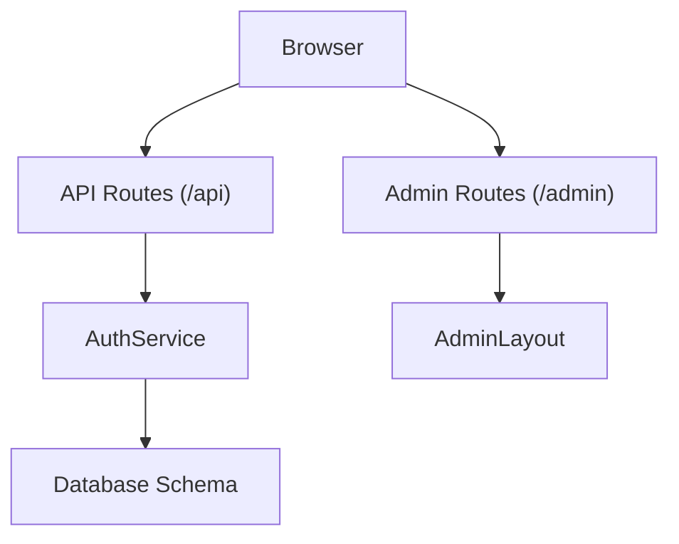
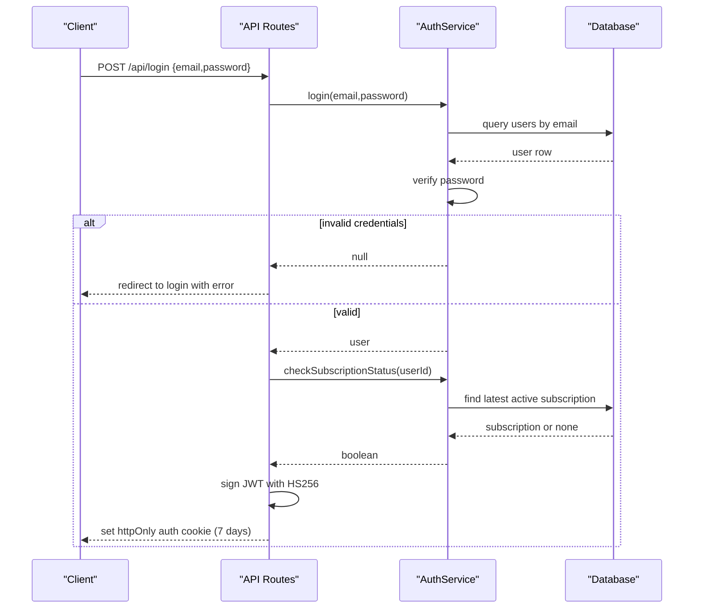
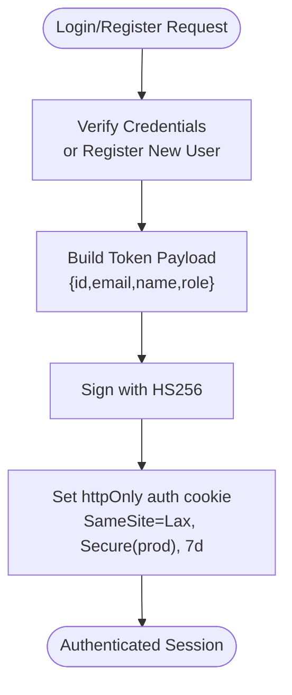
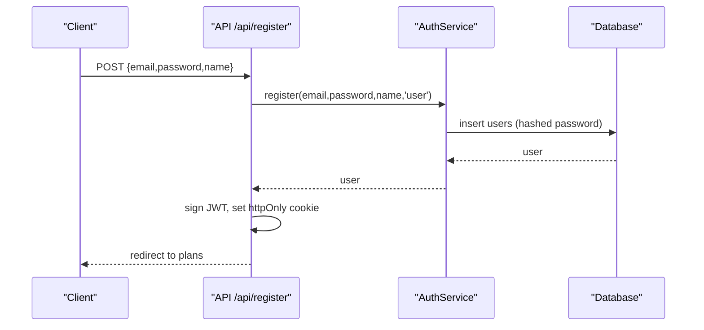
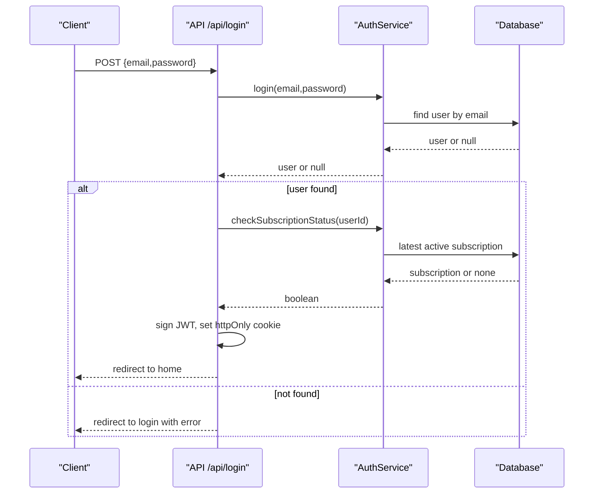
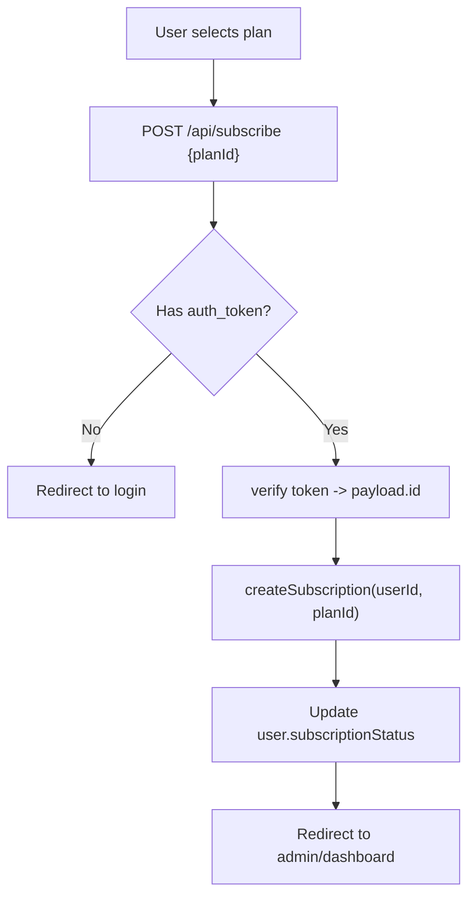
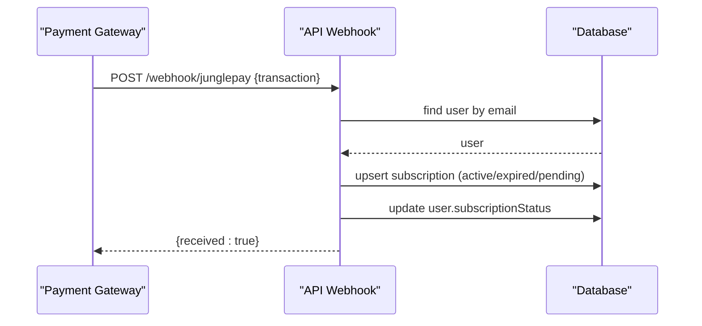
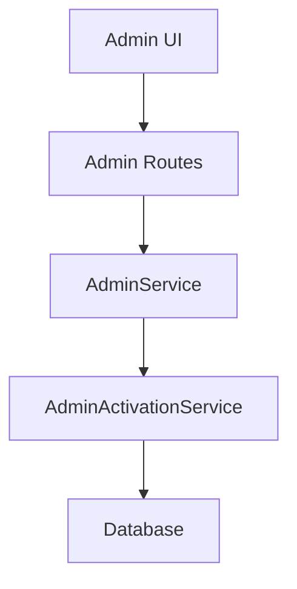
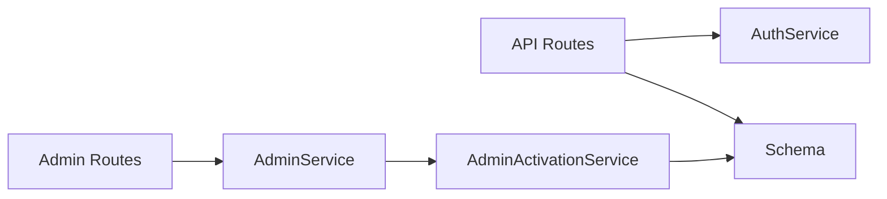

# Authentication & Authorization

<cite>
**Referenced Files in This Document**
- [src/routes/api.tsx](file://src/routes/api.tsx)
- [src/services/auth.ts](file://src/services/auth.ts)
- [src/db/schema.ts](file://src/db/schema.ts)
- [src/pages/Auth.tsx](file://src/pages/Auth.tsx)
- [src/index.tsx](file://src/index.tsx)
- [src/routes/admin.tsx](file://src/routes/admin.tsx)
- [src/components/templates/AdminLayout.tsx](file://src/components/templates/AdminLayout.tsx)
- [src/services/admin.ts](file://src/services/admin.ts)
- [src/services/admin/activation.ts](file://src/services/admin/activation.ts)
- [junglepay-documentation.md](file://junglepay-documentation.md)
</cite>

## Table of Contents
1. [Introduction](#introduction)
2. [Project Structure](#project-structure)
3. [Core Components](#core-components)
4. [Architecture Overview](#architecture-overview)
5. [Detailed Component Analysis](#detailed-component-analysis)
6. [Dependency Analysis](#dependency-analysis)
7. [Performance Considerations](#performance-considerations)
8. [Troubleshooting Guide](#troubleshooting-guide)
9. [Conclusion](#conclusion)

## Introduction
This document explains CreatorFlix’s authentication and authorization model. It covers JWT cookie-based sessions, user roles, subscription-based access, and administrative controls. It also documents login/logout flows, registration, password hashing, subscription lifecycle, and webhook-driven payment updates. Security best practices, token refresh, and session expiration are addressed alongside common vulnerability mitigations.

## Project Structure
Authentication and authorization logic is implemented across route handlers, a dedicated service, database schema, and admin controls:
- Route handlers manage login, registration, logout, subscription creation, and payment webhooks.
- The authentication service encapsulates password hashing/verification and subscription checks.
- The database schema defines users, roles, plans, subscriptions, and related entities.
- Admin routes and layouts provide privileged access and operational controls.

**Diagram sources**
- [src/routes/api.tsx](file://src/routes/api.tsx#L315-L517)
- [src/services/auth.ts](file://src/services/auth.ts#L5-L90)
- [src/db/schema.ts](file://src/db/schema.ts#L6-L46)
- [src/routes/admin.tsx](file://src/routes/admin.tsx#L16-L157)
- [src/components/templates/AdminLayout.tsx](file://src/components/templates/AdminLayout.tsx#L9-L64)

**Section sources**
- [src/index.tsx](file://src/index.tsx#L1-L20)
- [src/routes/api.tsx](file://src/routes/api.tsx#L1-L519)
- [src/services/auth.ts](file://src/services/auth.ts#L1-L91)
- [src/db/schema.ts](file://src/db/schema.ts#L1-L178)
- [src/routes/admin.tsx](file://src/routes/admin.tsx#L1-L158)
- [src/components/templates/AdminLayout.tsx](file://src/components/templates/AdminLayout.tsx#L1-L64)

## Core Components
- API authentication endpoints:
  - POST /api/login: Validates credentials, verifies subscription status, signs JWT, sets httpOnly auth cookie.
  - POST /api/register: Registers user, hashes password, signs JWT, sets httpOnly auth cookie.
  - POST /api/logout: Clears auth cookie.
  - POST /api/subscribe: Creates subscription for authenticated user.
- Authentication service:
  - register(email, password, name?, role?): Hashes password, prevents duplicates, inserts user.
  - login(email, password): Finds user by email and verifies password.
  - createSubscription(userId, planId): Creates subscription with calculated dates.
  - checkSubscriptionStatus(userId): Updates user subscription status based on latest active subscription.
- Database schema:
  - users: id, email (unique), password, role (admin/user), subscriptionStatus, timestamps.
  - plans: id, name, price (cents), duration (days), flags for accepted payment methods.
  - subscriptions: id, userId (FK), planId (FK), externalId, start/end dates, status (active/expired/pending).
- Admin routes and UI:
  - Admin routes expose privileged views and actions.
  - AdminLayout provides navigation and header for admin pages.

**Section sources**
- [src/routes/api.tsx](file://src/routes/api.tsx#L315-L517)
- [src/services/auth.ts](file://src/services/auth.ts#L5-L90)
- [src/db/schema.ts](file://src/db/schema.ts#L6-L46)
- [src/routes/admin.tsx](file://src/routes/admin.tsx#L16-L157)
- [src/components/templates/AdminLayout.tsx](file://src/components/templates/AdminLayout.tsx#L9-L64)

## Architecture Overview
The authentication flow uses signed JWT stored in an httpOnly cookie. On successful login/register, the server:
- Verifies credentials or creates a new user with hashed password.
- Optionally re-validates subscription status.
- Signs a JWT with user identity and role.
- Sets a secure, httpOnly cookie with a long-lived expiry.

**Diagram sources**
- [src/routes/api.tsx](file://src/routes/api.tsx#L315-L349)
- [src/services/auth.ts](file://src/services/auth.ts#L28-L39)
- [src/services/auth.ts](file://src/services/auth.ts#L67-L89)

**Section sources**
- [src/routes/api.tsx](file://src/routes/api.tsx#L315-L349)
- [src/services/auth.ts](file://src/services/auth.ts#L28-L39)
- [src/services/auth.ts](file://src/services/auth.ts#L67-L89)

## Detailed Component Analysis

### JWT Cookie Management
- Signing and verification:
  - HS256 signing and verification are performed with a shared secret from environment configuration.
- Cookie attributes:
  - httpOnly: prevents XSS access to the token.
  - SameSite: Lax for CSRF protection.
  - Secure: enabled in production environments.
  - Max-Age: 7 days for long-lived sessions.
- Token payload includes user identity and role for downstream authorization decisions.

**Diagram sources**
- [src/routes/api.tsx](file://src/routes/api.tsx#L329-L343)
- [src/routes/api.tsx](file://src/routes/api.tsx#L360-L374)

**Section sources**
- [src/routes/api.tsx](file://src/routes/api.tsx#L329-L343)
- [src/routes/api.tsx](file://src/routes/api.tsx#L360-L374)

### User Registration Workflow
- Frontend form posts to /api/register with email, password, and optional name.
- Backend:
  - Hash password using the runtime password hashing API.
  - Prevent duplicate emails.
  - Insert user with default role=user and inactive subscription status.
  - Issue JWT and set auth cookie.

**Diagram sources**
- [src/pages/Auth.tsx](file://src/pages/Auth.tsx#L39-L74)
- [src/routes/api.tsx](file://src/routes/api.tsx#L351-L379)
- [src/services/auth.ts](file://src/services/auth.ts#L6-L26)

**Section sources**
- [src/pages/Auth.tsx](file://src/pages/Auth.tsx#L39-L74)
- [src/routes/api.tsx](file://src/routes/api.tsx#L351-L379)
- [src/services/auth.ts](file://src/services/auth.ts#L6-L26)

### Login and Logout
- Login:
  - Validates credentials, optionally refreshes subscription status, signs JWT, and sets cookie.
- Logout:
  - Clears the auth cookie by setting maxAge=0.

**Diagram sources**
- [src/routes/api.tsx](file://src/routes/api.tsx#L315-L349)
- [src/services/auth.ts](file://src/services/auth.ts#L28-L39)
- [src/services/auth.ts](file://src/services/auth.ts#L67-L89)

**Section sources**
- [src/routes/api.tsx](file://src/routes/api.tsx#L315-L349)
- [src/routes/api.tsx](file://src/routes/api.tsx#L508-L517)

### Password Management
- Password hashing:
  - Uses the runtime password hashing API to securely hash passwords during registration.
- Verification:
  - During login, compares provided password against stored hash.

Best practices observed:
- Never store plaintext passwords.
- Use a strong, built-in hashing mechanism.

**Section sources**
- [src/services/auth.ts](file://src/services/auth.ts#L6-L39)

### Role-Based Permissions and Authorization Patterns
- Roles:
  - Users have role=user by default; admins have role=admin.
- Authorization:
  - Token payload includes role; downstream logic can enforce role-based access.
  - Admin routes are mounted under /admin and intended for administrators.

Note: There is no explicit middleware enforcing role-based routing in the provided files. Administrators are indicated by role=admin in the schema and service, while admin routes exist under /admin.

**Section sources**
- [src/db/schema.ts](file://src/db/schema.ts#L11-L12)
- [src/services/auth.ts](file://src/services/auth.ts#L6)
- [src/routes/admin.tsx](file://src/routes/admin.tsx#L16-L157)

### Subscription-Based Features and Access Control
- Subscription lifecycle:
  - Creation: POST /api/subscribe validates token, resolves user, and creates subscription for a plan.
  - Status check: checkSubscriptionStatus ensures user.subscriptionStatus reflects current validity.
- Payment webhooks:
  - Webhook endpoints update subscriptions and user status upon payment events from payment providers.

**Diagram sources**
- [src/routes/api.tsx](file://src/routes/api.tsx#L381-L399)
- [src/services/auth.ts](file://src/services/auth.ts#L41-L65)

**Section sources**
- [src/routes/api.tsx](file://src/routes/api.tsx#L381-L399)
- [src/services/auth.ts](file://src/services/auth.ts#L41-L89)

### Payment Webhooks and Subscription Activation
- Webhooks:
  - JunglePay webhook: activates subscription and updates user status on paid events.
  - Dias marketplace webhook: handles pending and paid statuses, creating/updating subscriptions accordingly.
- Data integrity:
  - Webhooks resolve user by email, infer plan by closest price match, and update status fields.

**Diagram sources**
- [src/routes/api.tsx](file://src/routes/api.tsx#L88-L170)
- [src/routes/api.tsx](file://src/routes/api.tsx#L401-L506)

**Section sources**
- [src/routes/api.tsx](file://src/routes/api.tsx#L88-L170)
- [src/routes/api.tsx](file://src/routes/api.tsx#L401-L506)

### Administrative Privileges and Operations
- Admin routes:
  - Provide dashboards, finance configuration, plans management, whitelabel sync, and support contacts.
- Admin activation service:
  - Imports whitelabel models and posts into production tables and marks as active.

**Diagram sources**
- [src/routes/admin.tsx](file://src/routes/admin.tsx#L16-L157)
- [src/services/admin.ts](file://src/services/admin.ts#L3-L5)
- [src/services/admin/activation.ts](file://src/services/admin/activation.ts#L7-L86)

**Section sources**
- [src/routes/admin.tsx](file://src/routes/admin.tsx#L16-L157)
- [src/services/admin.ts](file://src/services/admin.ts#L3-L5)
- [src/services/admin/activation.ts](file://src/services/admin/activation.ts#L7-L86)

## Dependency Analysis
- Route handlers depend on:
  - AuthService for authentication and subscription operations.
  - Database schema for reads/writes.
- Admin routes depend on:
  - AdminService and AdminActivationService for model/post synchronization.
- JWT signing/verification depends on a shared secret configured in environment variables.

**Diagram sources**
- [src/routes/api.tsx](file://src/routes/api.tsx#L1-L12)
- [src/services/auth.ts](file://src/services/auth.ts#L1-L3)
- [src/db/schema.ts](file://src/db/schema.ts#L1-L3)
- [src/routes/admin.tsx](file://src/routes/admin.tsx#L1-L16)
- [src/services/admin.ts](file://src/services/admin.ts#L1-L5)
- [src/services/admin/activation.ts](file://src/services/admin/activation.ts#L1-L5)

**Section sources**
- [src/routes/api.tsx](file://src/routes/api.tsx#L1-L12)
- [src/services/auth.ts](file://src/services/auth.ts#L1-L3)
- [src/db/schema.ts](file://src/db/schema.ts#L1-L3)
- [src/routes/admin.tsx](file://src/routes/admin.tsx#L1-L16)
- [src/services/admin.ts](file://src/services/admin.ts#L1-L5)
- [src/services/admin/activation.ts](file://src/services/admin/activation.ts#L1-L5)

## Performance Considerations
- Password hashing:
  - Using the runtime hashing API is efficient and secure for user registration and login verification.
- Subscription checks:
  - checkSubscriptionStatus performs a single query to find the latest active subscription and updates status accordingly; ensure appropriate indexing on user_id and status for scalability.
- Webhooks:
  - Webhooks trigger database writes; ensure idempotency and handle retries gracefully to avoid duplicate subscriptions.

[No sources needed since this section provides general guidance]

## Troubleshooting Guide
Common issues and resolutions:
- Invalid credentials on login:
  - The login handler redirects back with an error when user is not found or password does not match.
- Missing auth cookie:
  - Logout clears the cookie; ensure clients send cookies for protected routes.
- Subscription status mismatch:
  - checkSubscriptionStatus updates user.subscriptionStatus if no active subscription or expired; verify webhook delivery and timing.
- Payment webhook failures:
  - Review webhook logs and ensure payment provider configurations are correct; confirm plan lookup logic and user resolution by email.

**Section sources**
- [src/routes/api.tsx](file://src/routes/api.tsx#L321-L325)
- [src/routes/api.tsx](file://src/routes/api.tsx#L508-L517)
- [src/services/auth.ts](file://src/services/auth.ts#L67-L89)
- [src/routes/api.tsx](file://src/routes/api.tsx#L88-L170)

## Conclusion
CreatorFlix implements a straightforward, secure authentication and authorization system centered on JWT stored in httpOnly cookies. User roles and subscription status drive access to premium content and administrative capabilities. Payment webhooks keep subscription states synchronized. To maintain robustness, ensure secure secret management, monitor webhook delivery, and consider adding middleware for role-based routing and token refresh strategies.