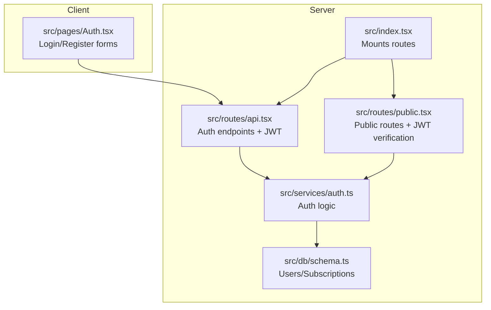
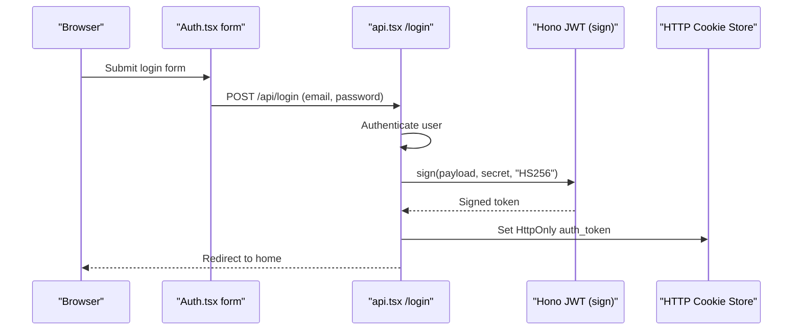
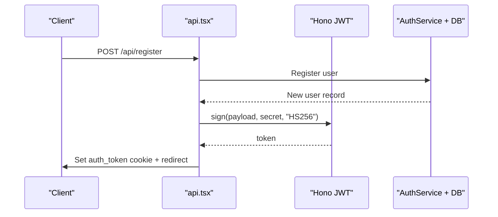
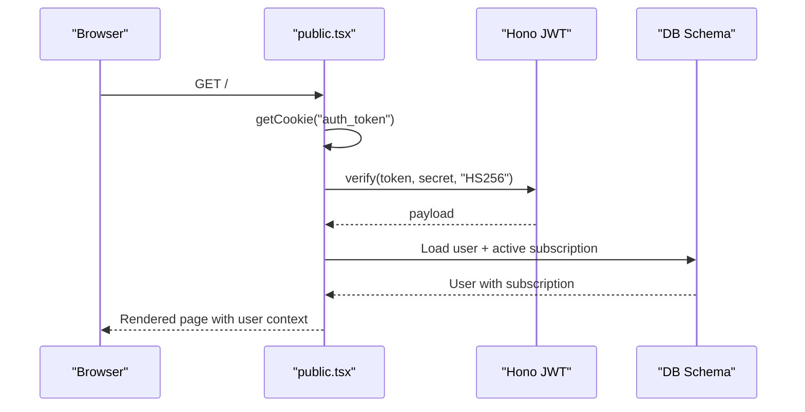
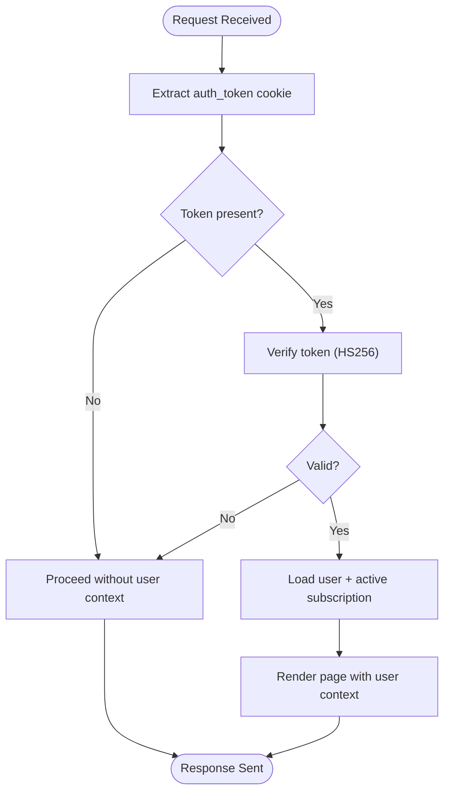
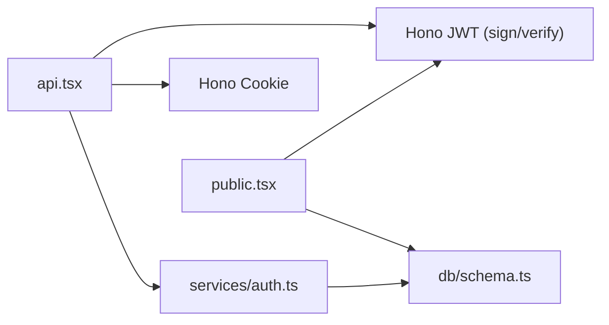

# JWT Token Management

<cite>
**Referenced Files in This Document**
- [index.tsx](file://src/index.tsx)
- [api.tsx](file://src/routes/api.tsx)
- [public.tsx](file://src/routes/public.tsx)
- [auth.ts](file://src/services/auth.ts)
- [schema.ts](file://src/db/schema.ts)
- [Auth.tsx](file://src/pages/Auth.tsx)
- [package.json](file://package.json)
</cite>

## Table of Contents
1. [Introduction](#introduction)
2. [Project Structure](#project-structure)
3. [Core Components](#core-components)
4. [Architecture Overview](#architecture-overview)
5. [Detailed Component Analysis](#detailed-component-analysis)
6. [Dependency Analysis](#dependency-analysis)
7. [Performance Considerations](#performance-considerations)
8. [Troubleshooting Guide](#troubleshooting-guide)
9. [Conclusion](#conclusion)
10. [Appendices](#appendices)

## Introduction
This document explains JWT token management in CreatorFlix, covering generation, validation, storage, lifecycle, and security. It documents the current implementation using Hono's JWT utilities, cookie-based storage, HS256 signing, and subscription-aware user sessions. It also outlines practical usage patterns for API requests and frontend integration, along with recommendations for refresh, revocation, and secure transport.

## Project Structure
CreatorFlix organizes routing and authentication primarily under the routes and services directories. Authentication endpoints and middleware are implemented in the API and public route modules, while the authentication service encapsulates user registration, login, and subscription checks.

**Diagram sources**
- [index.tsx](file://src/index.tsx#L1-L20)
- [api.tsx](file://src/routes/api.tsx#L1-L519)
- [public.tsx](file://src/routes/public.tsx#L1-L119)
- [auth.ts](file://src/services/auth.ts#L1-L91)
- [schema.ts](file://src/db/schema.ts#L1-L178)
- [Auth.tsx](file://src/pages/Auth.tsx#L1-L116)

**Section sources**
- [index.tsx](file://src/index.tsx#L1-L20)
- [api.tsx](file://src/routes/api.tsx#L1-L519)
- [public.tsx](file://src/routes/public.tsx#L1-L119)
- [auth.ts](file://src/services/auth.ts#L1-L91)
- [schema.ts](file://src/db/schema.ts#L1-L178)
- [Auth.tsx](file://src/pages/Auth.tsx#L1-L116)

## Core Components
- JWT Secret and Algorithm
  - Secret is loaded from environment variable or defaults to a development value.
  - Signing algorithm is HS256.
- Token Generation
  - Generated during login and registration with a payload containing user identity and role.
- Token Validation
  - Verified on protected routes and public routes to hydrate user context.
- Storage Strategy
  - Stored in an HttpOnly, SameSite=Lax, optional Secure cookie named auth_token.
  - Cookie TTL is 7 days.
- Logout
  - Clears the auth_token cookie by setting maxAge to 0.

**Section sources**
- [api.tsx](file://src/routes/api.tsx#L12-L13)
- [api.tsx](file://src/routes/api.tsx#L329-L343)
- [api.tsx](file://src/routes/api.tsx#L360-L374)
- [api.tsx](file://src/routes/api.tsx#L385-L386)
- [api.tsx](file://src/routes/api.tsx#L508-L516)
- [public.tsx](file://src/routes/public.tsx#L18-L28)
- [public.tsx](file://src/routes/public.tsx#L20-L51)

## Architecture Overview
The authentication flow integrates frontend forms, backend endpoints, and middleware-like verification in public routes.

**Diagram sources**
- [Auth.tsx](file://src/pages/Auth.tsx#L39-L74)
- [api.tsx](file://src/routes/api.tsx#L316-L348)
- [api.tsx](file://src/routes/api.tsx#L336-L343)

## Detailed Component Analysis

### JWT Secret and Algorithm
- Secret sourcing
  - Loaded from process environment variable or falls back to a development default.
- Algorithm
  - HS256 is used for signing and verification.

Security considerations:
- Never use the development fallback in production.
- Rotate secrets periodically and invalidate tokens after rotation.

**Section sources**
- [api.tsx](file://src/routes/api.tsx#L12-L13)
- [public.tsx](file://src/routes/public.tsx#L18-L18)

### Token Payload and Claims
- Claims included in the payload:
  - id: numeric user identifier
  - email: user email
  - name: user display name or derived from email
  - role: user role (admin or user)
- These claims are used to reconstruct user context on subsequent requests.

**Section sources**
- [api.tsx](file://src/routes/api.tsx#L329-L334)
- [api.tsx](file://src/routes/api.tsx#L360-L365)
- [public.tsx](file://src/routes/public.tsx#L29-L44)

### Token Generation During Login and Registration
- Both endpoints compute the same payload and sign with HS256.
- On success, the signed token is stored in a cookie with:
  - HttpOnly: prevents client-side script access.
  - SameSite: Lax for CSRF protection.
  - Secure: enabled in production environments.
  - Path: root path.
  - Max-Age: 7 days.

**Diagram sources**
- [api.tsx](file://src/routes/api.tsx#L351-L379)
- [api.tsx](file://src/routes/api.tsx#L360-L374)
- [auth.ts](file://src/services/auth.ts#L6-L26)

**Section sources**
- [api.tsx](file://src/routes/api.tsx#L316-L348)
- [api.tsx](file://src/routes/api.tsx#L351-L379)
- [auth.ts](file://src/services/auth.ts#L6-L26)

### Token Validation in Public Routes
- Public routes extract the auth_token cookie and verify it using HS256.
- On success, the server loads the user record and their active subscription to hydrate the page context.

**Diagram sources**
- [public.tsx](file://src/routes/public.tsx#L20-L51)
- [public.tsx](file://src/routes/public.tsx#L29-L44)
- [schema.ts](file://src/db/schema.ts#L37-L46)

**Section sources**
- [public.tsx](file://src/routes/public.tsx#L20-L51)
- [schema.ts](file://src/db/schema.ts#L37-L46)

### Subscription-Aware Session Hydration
- After successful JWT verification, the server queries the user record and eagerly loads their active subscription.
- This enables UI logic to gate premium content based on subscription status.

**Section sources**
- [public.tsx](file://src/routes/public.tsx#L29-L44)
- [schema.ts](file://src/db/schema.ts#L37-L46)

### Logout and Cookie Revocation
- Logout clears the auth_token cookie by setting maxAge to 0.
- This immediately invalidates the token for future requests.

**Section sources**
- [api.tsx](file://src/routes/api.tsx#L508-L516)

### Token Lifecycle Management
- Generation: On successful login or registration.
- Validation: On every request to public routes and protected endpoints.
- Expiration: Controlled by cookie TTL (7 days); no per-token exp claim is present in the current implementation.
- Renewal: Not implemented; the cookie is not automatically refreshed.

**Diagram sources**
- [public.tsx](file://src/routes/public.tsx#L20-L51)
- [schema.ts](file://src/db/schema.ts#L37-L46)

**Section sources**
- [public.tsx](file://src/routes/public.tsx#L20-L51)

### Security Considerations
- Transport security
  - Secure flag is enabled in production, reducing exposure over insecure channels.
- Cookie flags
  - HttpOnly mitigates XSS risks.
  - SameSite=Lax balances CSRF protection with usability.
- Secret management
  - Ensure JWT_SECRET is strong and rotated regularly; avoid development fallbacks.
- Token scope
  - Current implementation does not include exp or nbf claims; consider adding exp for stricter expiration control.

**Section sources**
- [api.tsx](file://src/routes/api.tsx#L337-L343)
- [api.tsx](file://src/routes/api.tsx#L368-L374)
- [api.tsx](file://src/routes/api.tsx#L12-L13)

### Practical Usage Examples

- Frontend login integration
  - The login form submits to the backend authentication endpoint.
  - On success, the browser receives an HttpOnly cookie and is redirected to the home page.

- Frontend registration integration
  - The registration form submits to the registration endpoint.
  - On success, the browser receives an HttpOnly cookie and is redirected to the plans page.

- API requests with cookies
  - When making authenticated API requests from the browser, include credentials to send cookies automatically.
  - The server validates the token and responds accordingly.

- Logout
  - Calling the logout endpoint clears the cookie and redirects to the login page.

**Section sources**
- [Auth.tsx](file://src/pages/Auth.tsx#L39-L74)
- [api.tsx](file://src/routes/api.tsx#L316-L348)
- [api.tsx](file://src/routes/api.tsx#L351-L379)
- [api.tsx](file://src/routes/api.tsx#L508-L516)

## Dependency Analysis
- Runtime dependencies
  - Hono provides JWT signing and verification utilities and cookie helpers.
  - Drizzle ORM is used for database operations related to user and subscription data.

**Diagram sources**
- [api.tsx](file://src/routes/api.tsx#L1-L11)
- [public.tsx](file://src/routes/public.tsx#L1-L16)
- [auth.ts](file://src/services/auth.ts#L1-L4)
- [schema.ts](file://src/db/schema.ts#L1-L4)

**Section sources**
- [package.json](file://package.json#L8-L16)
- [api.tsx](file://src/routes/api.tsx#L1-L11)
- [public.tsx](file://src/routes/public.tsx#L1-L16)
- [auth.ts](file://src/services/auth.ts#L1-L4)
- [schema.ts](file://src/db/schema.ts#L1-L4)

## Performance Considerations
- JWT verification cost
  - Minimal overhead; performed per request in public routes.
- Database round-trips
  - Verification triggers a single user lookup with eager loading of the active subscription.
- Cookie size
  - Token payload is small; cookie size is negligible.

[No sources needed since this section provides general guidance]

## Troubleshooting Guide
- Invalid or missing token
  - Symptoms: Requests render without user context.
  - Causes: Missing or expired cookie, invalid signature, or wrong secret.
  - Resolution: Re-authenticate; ensure cookie is sent; verify JWT_SECRET.

- Login/registration failures
  - Symptoms: Redirects with error messages.
  - Causes: Incorrect credentials, duplicate user, or server errors.
  - Resolution: Check form inputs; review server logs.

- Logout not working
  - Symptoms: User remains logged in after clicking logout.
  - Causes: Cookie not cleared or blocked by browser policies.
  - Resolution: Confirm Secure flag in production; test in incognito mode.

**Section sources**
- [public.tsx](file://src/routes/public.tsx#L47-L50)
- [api.tsx](file://src/routes/api.tsx#L323-L325)
- [api.tsx](file://src/routes/api.tsx#L346-L348)
- [api.tsx](file://src/routes/api.tsx#L508-L516)

## Conclusion
CreatorFlix implements a straightforward JWT-based authentication system using Hono’s utilities, storing tokens in HttpOnly cookies with sensible security flags. The current design focuses on simplicity and ease of integration, with explicit support for subscription-aware user contexts. For production hardening, consider adding token expiration, refresh mechanisms, and token revocation strategies.

[No sources needed since this section summarizes without analyzing specific files]

## Appendices

### Token Claims Reference
- id: Numeric user identifier
- email: User email address
- name: Display name or derived from email
- role: User role (admin or user)

**Section sources**
- [api.tsx](file://src/routes/api.tsx#L329-L334)
- [api.tsx](file://src/routes/api.tsx#L360-L365)

### Cookie Configuration Summary
- Name: auth_token
- HttpOnly: Enabled
- Secure: Conditional on environment
- SameSite: Lax
- Path: /
- Max-Age: 7 days

**Section sources**
- [api.tsx](file://src/routes/api.tsx#L337-L343)
- [api.tsx](file://src/routes/api.tsx#L368-L374)
- [api.tsx](file://src/routes/api.tsx#L508-L516)

### Recommendations
- Add exp claim to enforce strict expiration.
- Implement refresh tokens for long-lived sessions.
- Introduce blacklist/revocation mechanism for compromised tokens.
- Enforce CSRF protection for state-changing endpoints.
- Use short-lived access tokens with rotating secrets.

[No sources needed since this section provides general guidance]