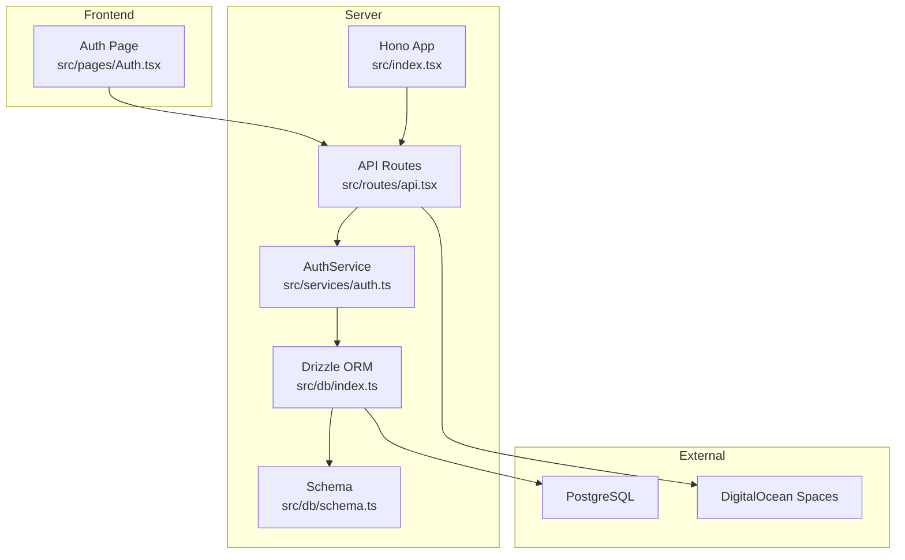
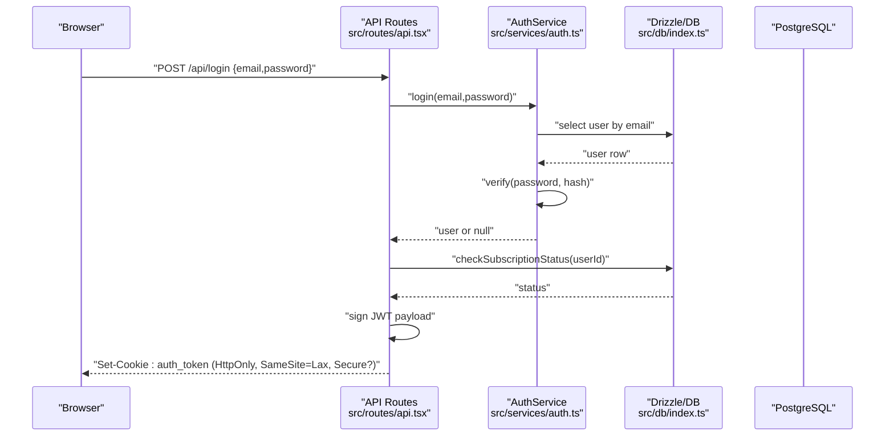
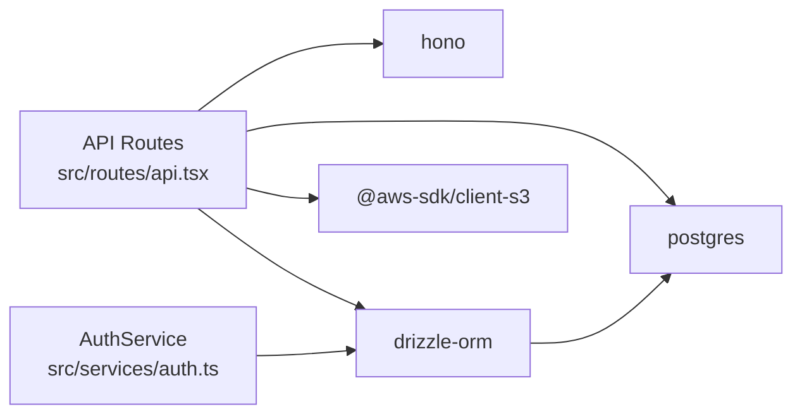

# Security Best Practices

<cite>
**Referenced Files in This Document**
- [src/services/auth.ts](file://src/services/auth.ts)
- [src/routes/api.tsx](file://src/routes/api.tsx)
- [src/db/schema.ts](file://src/db/schema.ts)
- [src/db/index.ts](file://src/db/index.ts)
- [src/index.tsx](file://src/index.tsx)
- [package.json](file://package.json)
- [drizzle.config.ts](file://drizzle.config.ts)
- [src/utils/storage.ts](file://src/utils/storage.ts)
- [src/services/s3.ts](file://src/services/s3.ts)
- [src/pages/Auth.tsx](file://src/pages/Auth.tsx)
</cite>

## Table of Contents
1. [Introduction](#introduction)
2. [Project Structure](#project-structure)
3. [Core Components](#core-components)
4. [Architecture Overview](#architecture-overview)
5. [Detailed Component Analysis](#detailed-component-analysis)
6. [Dependency Analysis](#dependency-analysis)
7. [Performance Considerations](#performance-considerations)
8. [Troubleshooting Guide](#troubleshooting-guide)
9. [Conclusion](#conclusion)
10. [Appendices](#appendices)

## Introduction
This document consolidates security best practices for the authentication system, focusing on password handling, token lifecycle, transport security, and operational hygiene. It synthesizes the current implementation and highlights areas requiring hardening to mitigate common authentication vulnerabilities such as weak password policies, insufficient transport security, and insecure cookie configurations.

## Project Structure
The authentication system spans a small set of focused modules:
- Authentication service orchestrating registration, login, and subscription checks
- API routes implementing login, registration, logout, and subscription flows
- Database schema defining user, plan, and subscription entities
- Database client configuration and Drizzle setup
- Frontend authentication page wiring form submission to API endpoints
- Storage utilities for S3 uploads and signed URLs

**Diagram sources**
- [src/pages/Auth.tsx](file://src/pages/Auth.tsx#L39-L75)
- [src/index.tsx](file://src/index.tsx#L1-L21)
- [src/routes/api.tsx](file://src/routes/api.tsx#L315-L379)
- [src/services/auth.ts](file://src/services/auth.ts#L5-L39)
- [src/db/index.ts](file://src/db/index.ts#L1-L8)
- [src/db/schema.ts](file://src/db/schema.ts#L6-L46)
- [src/utils/storage.ts](file://src/utils/storage.ts#L1-L39)
- [src/services/s3.ts](file://src/services/s3.ts#L1-L47)

**Section sources**
- [src/pages/Auth.tsx](file://src/pages/Auth.tsx#L1-L116)
- [src/index.tsx](file://src/index.tsx#L1-L21)
- [src/routes/api.tsx](file://src/routes/api.tsx#L1-L519)
- [src/services/auth.ts](file://src/services/auth.ts#L1-L91)
- [src/db/schema.ts](file://src/db/schema.ts#L1-L178)
- [src/db/index.ts](file://src/db/index.ts#L1-L8)
- [src/utils/storage.ts](file://src/utils/storage.ts#L1-L39)
- [src/services/s3.ts](file://src/services/s3.ts#L1-L47)

## Core Components
- Password hashing and verification are handled by the runtime’s built-in password API during registration and login.
- Authentication tokens are JSON Web Tokens (JWT) signed with a shared secret and stored in an HttpOnly, SameSite cookie.
- Database access uses Drizzle ORM with a PostgreSQL client configured via environment variables.
- S3 uploads and signed URLs are implemented for media delivery.

Key security-relevant behaviors:
- Password hashing uses the platform’s recommended hashing mechanism.
- JWT signing uses a configurable secret; cookies are marked HttpOnly and include SameSite/Lax semantics.
- Database credentials and endpoints are loaded from environment variables.

**Section sources**
- [src/services/auth.ts](file://src/services/auth.ts#L7-L35)
- [src/routes/api.tsx](file://src/routes/api.tsx#L13-L13)
- [src/routes/api.tsx](file://src/routes/api.tsx#L336-L343)
- [src/db/index.ts](file://src/db/index.ts#L5-L7)
- [src/utils/storage.ts](file://src/utils/storage.ts#L4-L7)

## Architecture Overview
The authentication flow integrates frontend forms, backend routes, and database operations. Tokens are issued upon successful login and stored in a cookie. Subscription status is validated after authentication.

**Diagram sources**
- [src/pages/Auth.tsx](file://src/pages/Auth.tsx#L39-L75)
- [src/routes/api.tsx](file://src/routes/api.tsx#L315-L349)
- [src/services/auth.ts](file://src/services/auth.ts#L28-L39)
- [src/db/index.ts](file://src/db/index.ts#L1-L8)

## Detailed Component Analysis

### Password Security Requirements
- Hashing: Passwords are hashed using the platform’s built-in hashing mechanism during registration.
- Verification: Login compares the provided password against the stored hash.
- Salt: The hashing mechanism uses a per-record salt internally; no manual salt handling is present in the code.
- Policy gaps:
  - No explicit password strength requirements (length, character diversity, history constraints).
  - No account lockout or rate limiting around authentication attempts.
  - No password expiration or rotation policy enforced.

Recommendations:
- Enforce minimum length and complexity (upper/lowercase, digits, symbols).
- Implement a deny-list of commonly breached passwords.
- Add adaptive throttling and lockout after repeated failures.
- Consider periodic password rotation policies and breach detection.

**Section sources**
- [src/services/auth.ts](file://src/services/auth.ts#L7-L35)

### Token Transmission and Cookie Configuration
- Token issuance: JWT payload is signed and returned as a cookie.
- Cookie attributes:
  - HttpOnly: Prevents client-side JS access.
  - SameSite: Lax to balance CSRF protection and usability.
  - Secure flag: Conditionally enabled based on environment.
  - Path: Root path.
  - Max-Age: 7 days.

Observations:
- The JWT secret is loaded from an environment variable; however, the code initializes a default literal if the variable is missing, which is a critical risk.
- The cookie’s Secure flag is only set in production, which is acceptable but risky if misconfigured.

Recommendations:
- Generate and rotate the JWT secret securely; never fallback to a default literal.
- Always enable the Secure flag for cookies in production environments.
- Consider short-lived access tokens and refresh tokens with secure refresh storage.
- Implement token binding (IP, UA) and audience/realm checks.

**Section sources**
- [src/routes/api.tsx](file://src/routes/api.tsx#L13-L13)
- [src/routes/api.tsx](file://src/routes/api.tsx#L336-L343)
- [src/routes/api.tsx](file://src/routes/api.tsx#L508-L517)

### Transport Security and HTTPS Enforcement
- Database connection string is loaded from an environment variable.
- Cookie Secure flag depends on NODE_ENV; production deployments should enforce HTTPS at the edge/load balancer.
- S3 client credentials are loaded from environment variables; ensure HTTPS endpoints and strict credential management.

Recommendations:
- Enforce HTTPS at the ingress/load balancer and configure HSTS.
- Use TLS 1.2+ and modern cipher suites.
- Store secrets in a secure vault and rotate regularly.

**Section sources**
- [src/db/index.ts](file://src/db/index.ts#L5-L7)
- [src/utils/storage.ts](file://src/utils/storage.ts#L4-L7)
- [src/services/s3.ts](file://src/services/s3.ts#L4-L12)

### Input Validation and SQL Injection Prevention
- API routes parse JSON or form bodies and convert numeric fields to integers.
- Database queries use typed ORM methods with parameterized conditions.
- There is no explicit schema validation for request payloads.

Recommendations:
- Validate and sanitize all inputs (body, query, params) using a schema library.
- Apply allowlists for enums and numeric ranges.
- Use strict typing and exhaustive checks for dynamic keys.
- Employ ORM with strict typing and avoid raw SQL unless unavoidable.

**Section sources**
- [src/routes/api.tsx](file://src/routes/api.tsx#L18-L38)
- [src/routes/api.tsx](file://src/routes/api.tsx#L21-L32)
- [src/routes/api.tsx](file://src/routes/api.tsx#L317-L325)
- [src/db/schema.ts](file://src/db/schema.ts#L6-L46)

### XSS Protection Measures
- The frontend renders JSX with string interpolation; ensure all user-controlled content is escaped when rendered outside of JSX boundaries.
- Avoid inline event handlers and untrusted HTML insertion.

Recommendations:
- Use a templating engine or framework with automatic escaping.
- Apply Content-Security-Policy headers to restrict script execution.
- Sanitize any user-generated content before rendering.

[No sources needed since this section provides general guidance]

### CSRF Protection
- Cookies use SameSite=Lax, which mitigates CSRF for cross-site requests.
- CSRF tokens are not currently implemented for state-changing forms.

Recommendations:
- Add CSRF tokens for forms and validate them server-side.
- Enforce SameSite=Strict for critical administrative endpoints.
- Use anti-CSRF libraries or middleware where applicable.

**Section sources**
- [src/routes/api.tsx](file://src/routes/api.tsx#L336-L343)
- [src/routes/api.tsx](file://src/routes/api.tsx#L508-L517)

### Rate Limiting and Brute Force Mitigation
- No explicit rate limiting or account lockout logic is implemented.

Recommendations:
- Implement sliding window or token bucket rate limits per IP/email.
- Lock accounts temporarily after threshold breaches.
- Use challenge mechanisms (e.g., CAPTCHA) for high-risk scenarios.

[No sources needed since this section provides general guidance]

### Secure Cookie Configurations
- HttpOnly and SameSite=Lax are used; Secure flag is environment-dependent.
- Consider adding:
  - Domain attribute aligned with deployment.
  - Partitioned cookies for future privacy controls.
  - Explicit SameSite=Strict for sensitive actions.

**Section sources**
- [src/routes/api.tsx](file://src/routes/api.tsx#L336-L343)
- [src/routes/api.tsx](file://src/routes/api.tsx#L508-L517)

### Database Schema Security
- Unique constraints on email and whitelabel model folder name prevent duplicates.
- Foreign keys link subscriptions to users/plans.
- Sensitive fields (passwords) are stored hashed; ensure backups are encrypted.

Recommendations:
- Audit and minimize exposed columns in API responses.
- Use row-level security policies if supported.
- Encrypt backups and limit access to DB credentials.

**Section sources**
- [src/db/schema.ts](file://src/db/schema.ts#L6-L46)
- [src/db/schema.ts](file://src/db/schema.ts#L73-L94)

### S3 Uploads and Signed URLs
- Uploads use SDK client with credentials from environment variables.
- Signed URLs are generated for temporary access with a fixed expiry.

Recommendations:
- Restrict bucket policies to least privilege.
- Use IAM roles and temporary credentials where possible.
- Validate and sanitize filenames; avoid path traversal.

**Section sources**
- [src/utils/storage.ts](file://src/utils/storage.ts#L4-L7)
- [src/utils/storage.ts](file://src/utils/storage.ts#L18-L38)
- [src/services/s3.ts](file://src/services/s3.ts#L4-L12)
- [src/services/s3.ts](file://src/services/s3.ts#L25-L46)

## Dependency Analysis
The authentication stack relies on:
- Hono for routing and JWT signing/verification
- Drizzle ORM for database access
- PostgreSQL for persistence
- AWS SDK for S3 operations

**Diagram sources**
- [package.json](file://package.json#L8-L16)
- [src/routes/api.tsx](file://src/routes/api.tsx#L1-L12)
- [src/services/auth.ts](file://src/services/auth.ts#L1-L3)

**Section sources**
- [package.json](file://package.json#L1-L23)
- [src/routes/api.tsx](file://src/routes/api.tsx#L1-L12)
- [src/services/auth.ts](file://src/services/auth.ts#L1-L3)

## Performance Considerations
- JWT signing/verification adds CPU overhead; consider caching verified tokens or using shorter-lived tokens with refresh flows.
- Database queries use ORM with parameterized conditions; ensure indexes on frequently queried columns (e.g., users.email).
- S3 signed URL generation is efficient but should be cached for repeated access.

[No sources needed since this section provides general guidance]

## Troubleshooting Guide
Common issues and mitigations:
- JWT secret not configured: The code initializes a default secret if the environment variable is missing. This must be corrected immediately.
  - Remediation: Set a strong, random JWT_SECRET and remove the default initialization.
- Cookie not secured: If NODE_ENV is not set to production, the Secure flag will not be applied.
  - Remediation: Ensure HTTPS termination at the edge and set NODE_ENV appropriately.
- Database connectivity: Misconfigured DATABASE_URL can cause authentication failures.
  - Remediation: Verify connection string and network access; enable SSL mode in production.
- S3 upload failures: Incorrect credentials or bucket policies.
  - Remediation: Validate DO Spaces endpoint, region, and permissions; test signed URL generation.

**Section sources**
- [src/routes/api.tsx](file://src/routes/api.tsx#L13-L13)
- [src/db/index.ts](file://src/db/index.ts#L5-L7)
- [src/utils/storage.ts](file://src/utils/storage.ts#L4-L7)
- [src/services/s3.ts](file://src/services/s3.ts#L4-L12)

## Conclusion
The authentication system demonstrates sound foundations: hashed passwords, JWT-based session tokens, and ORM-backed database access. However, several critical areas require immediate hardening: eliminating the default JWT secret, enforcing HTTPS and Secure cookies, implementing robust input validation, CSRF protections, and rate limiting. Adopting these practices will significantly reduce the attack surface and align the system with industry security standards.

[No sources needed since this section summarizes without analyzing specific files]

## Appendices

### Security Audit Procedures
- Secret rotation: Rotate JWT_SECRET and database credentials quarterly; invalidate old keys promptly.
- Dependency review: Regularly update Hono, Drizzle, and AWS SDK packages; monitor advisories.
- Access logging: Log authentication events (success/failure) and anomalies; retain logs per policy.
- Penetration testing: Conduct periodic assessments targeting authentication flows and token handling.
- Compliance: Align configurations with applicable standards (e.g., OWASP ASVS, ISO 27001).

[No sources needed since this section provides general guidance]