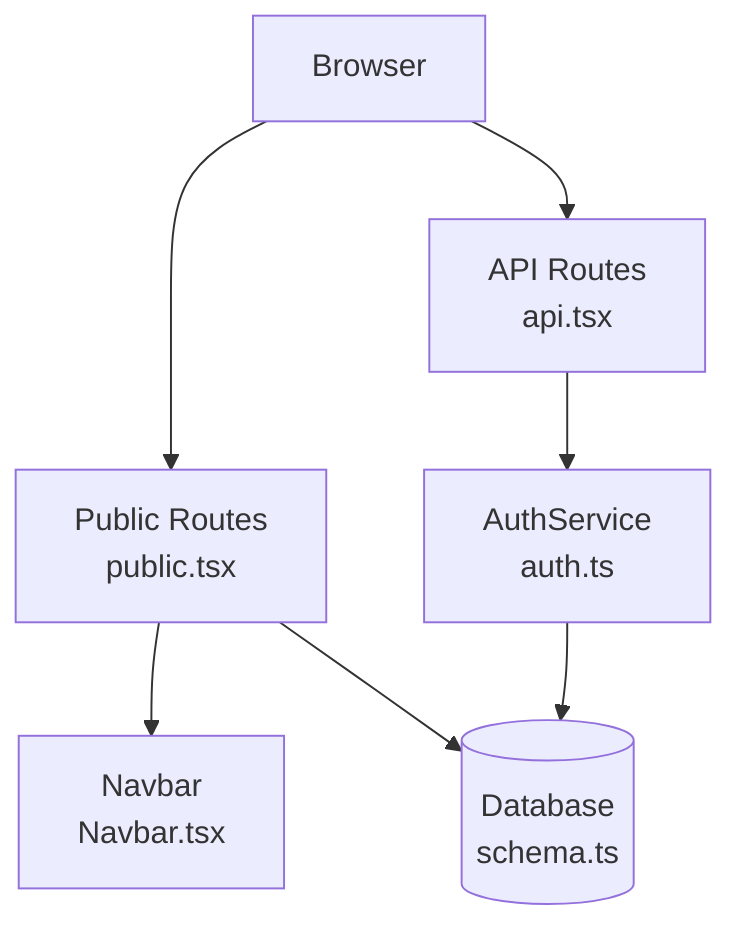
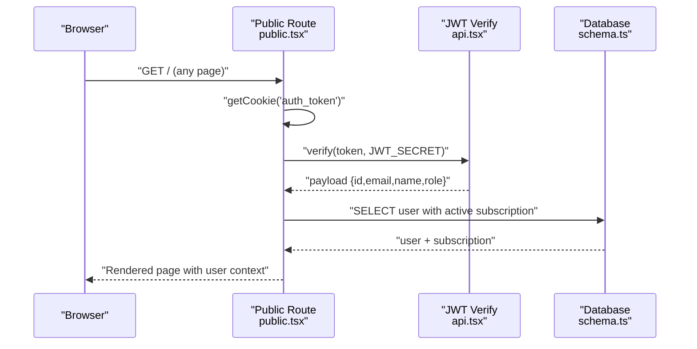
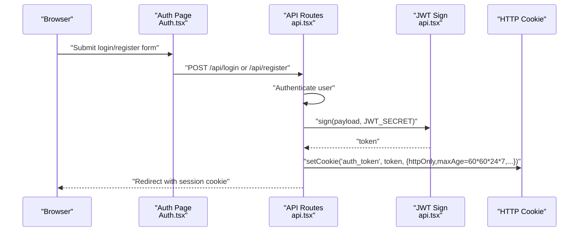
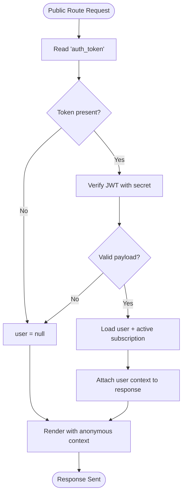
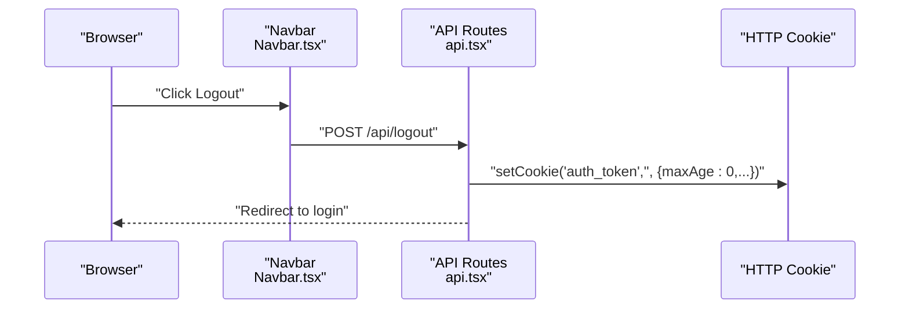
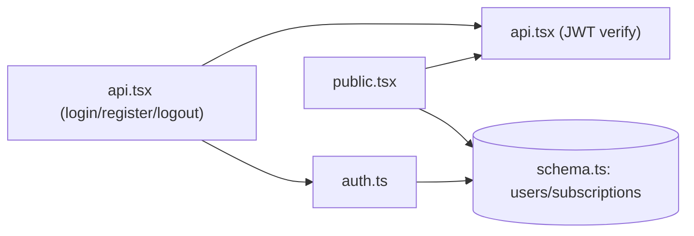

# Session Management

<cite>
**Referenced Files in This Document**
- [index.tsx](file://src/index.tsx)
- [api.tsx](file://src/routes/api.tsx)
- [public.tsx](file://src/routes/public.tsx)
- [schema.ts](file://src/db/schema.ts)
- [auth.ts](file://src/services/auth.ts)
- [Auth.tsx](file://src/pages/Auth.tsx)
- [Navbar.tsx](file://src/components/organisms/Navbar.tsx)
</cite>

## Table of Contents
1. [Introduction](#introduction)
2. [Project Structure](#project-structure)
3. [Core Components](#core-components)
4. [Architecture Overview](#architecture-overview)
5. [Detailed Component Analysis](#detailed-component-analysis)
6. [Dependency Analysis](#dependency-analysis)
7. [Performance Considerations](#performance-considerations)
8. [Troubleshooting Guide](#troubleshooting-guide)
9. [Conclusion](#conclusion)

## Introduction
This document explains how the application manages user sessions from creation to termination, including storage, validation, and security controls. It covers the JWT-based session mechanism, cookie configuration, subscription-based access gating, and frontend integration. It also documents timeout behavior, logout procedures, and operational guidance for handling session persistence across browser restarts and cross-device access.

## Project Structure
The session lifecycle spans frontend pages, public routes, API routes, and database schema. The server is a Hono app that mounts public and API routes. Authentication uses JWT stored in an httpOnly cookie. Subscription status is persisted in the database and influences access.

**Diagram sources**
- [index.tsx](file://src/index.tsx#L1-L21)
- [public.tsx](file://src/routes/public.tsx#L1-L170)
- [api.tsx](file://src/routes/api.tsx#L1-L519)
- [auth.ts](file://src/services/auth.ts#L1-L91)
- [schema.ts](file://src/db/schema.ts#L1-L178)
- [Navbar.tsx](file://src/components/organisms/Navbar.tsx#L1-L117)

**Section sources**
- [index.tsx](file://src/index.tsx#L1-L21)
- [public.tsx](file://src/routes/public.tsx#L1-L170)
- [api.tsx](file://src/routes/api.tsx#L1-L519)
- [auth.ts](file://src/services/auth.ts#L1-L91)
- [schema.ts](file://src/db/schema.ts#L1-L178)
- [Navbar.tsx](file://src/components/organisms/Navbar.tsx#L1-L117)

## Core Components
- JWT cookie storage: The backend signs a JWT and stores it in an httpOnly cookie named auth_token with a seven-day max age.
- Session validation: Public routes extract the cookie, verify the JWT, and resolve the user record with active subscription data.
- Subscription gating: Access checks are influenced by the user’s subscription status in the database.
- Logout: The backend clears the auth_token cookie by setting maxAge to zero.

Key implementation references:
- Cookie creation and verification: [api.tsx](file://src/routes/api.tsx#L316-L349), [public.tsx](file://src/routes/public.tsx#L20-L51)
- Subscription status checks: [auth.ts](file://src/services/auth.ts#L67-L89)
- Logout: [api.tsx](file://src/routes/api.tsx#L508-L517)

**Section sources**
- [api.tsx](file://src/routes/api.tsx#L316-L349)
- [public.tsx](file://src/routes/public.tsx#L20-L51)
- [auth.ts](file://src/services/auth.ts#L67-L89)
- [api.tsx](file://src/routes/api.tsx#L508-L517)

## Architecture Overview
The session architecture uses a stateless JWT stored in an httpOnly cookie. Validation occurs on every public route request by verifying the JWT and loading user data with active subscription details.

**Diagram sources**
- [public.tsx](file://src/routes/public.tsx#L20-L51)
- [api.tsx](file://src/routes/api.tsx#L13-L13)
- [schema.ts](file://src/db/schema.ts#L37-L46)

## Detailed Component Analysis

### Session Creation (Login/Register)
- On successful login or registration, the backend creates a JWT payload containing user identity and role, signs it with a shared secret, and sets an httpOnly cookie named auth_token with a seven-day expiry.
- The cookie is scoped to the entire domain path and configured with SameSite lax and secure flags in production.

Implementation references:
- Login flow and cookie setting: [api.tsx](file://src/routes/api.tsx#L316-L349)
- Registration flow and cookie setting: [api.tsx](file://src/routes/api.tsx#L351-L379)
- Frontend forms posting to these endpoints: [Auth.tsx](file://src/pages/Auth.tsx#L39-L75)

**Diagram sources**
- [Auth.tsx](file://src/pages/Auth.tsx#L39-L75)
- [api.tsx](file://src/routes/api.tsx#L316-L379)

**Section sources**
- [api.tsx](file://src/routes/api.tsx#L316-L379)
- [Auth.tsx](file://src/pages/Auth.tsx#L39-L75)

### Session Validation and Access Gating
- Every public route attempts to read the auth_token cookie, verify the JWT, and load the user record with active subscription details.
- Subscription status influences UI affordances (e.g., VIP CTA) and access decisions in higher-level routing or page logic.

Implementation references:
- Cookie retrieval and JWT verification: [public.tsx](file://src/routes/public.tsx#L20-L51)
- Active subscription join in query: [public.tsx](file://src/routes/public.tsx#L29-L44)
- Subscription status update logic: [auth.ts](file://src/services/auth.ts#L67-L89)

**Diagram sources**
- [public.tsx](file://src/routes/public.tsx#L20-L51)
- [auth.ts](file://src/services/auth.ts#L67-L89)

**Section sources**
- [public.tsx](file://src/routes/public.tsx#L20-L51)
- [auth.ts](file://src/services/auth.ts#L67-L89)

### Session Termination (Logout)
- Logout clears the auth_token cookie by setting its maxAge to zero, immediately invalidating the session.

Implementation references:
- Logout endpoint: [api.tsx](file://src/routes/api.tsx#L508-L517)
- Logout link/button in navbar: [Navbar.tsx](file://src/components/organisms/Navbar.tsx#L86-L91)

**Diagram sources**
- [Navbar.tsx](file://src/components/organisms/Navbar.tsx#L86-L91)
- [api.tsx](file://src/routes/api.tsx#L508-L517)

**Section sources**
- [api.tsx](file://src/routes/api.tsx#L508-L517)
- [Navbar.tsx](file://src/components/organisms/Navbar.tsx#L86-L91)

### Session Storage Mechanisms
- Cookie storage: The session token is stored in an httpOnly cookie named auth_token with a seven-day lifetime. This prevents client-side JavaScript access and reduces XSS risks.
- Alternative storage: Local storage is not used for session tokens in the current implementation.

Implementation references:
- Cookie configuration during login/register: [api.tsx](file://src/routes/api.tsx#L337-L343), [api.tsx](file://src/routes/api.tsx#L368-L374)
- Cookie retrieval in public routes: [public.tsx](file://src/routes/public.tsx#L21-L25)

**Section sources**
- [api.tsx](file://src/routes/api.tsx#L337-L343)
- [api.tsx](file://src/routes/api.tsx#L368-L374)
- [public.tsx](file://src/routes/public.tsx#L21-L25)

### Session Timeout and Idle Detection
- Server-side expiration: The cookie has a fixed seven-day maxAge. After this time, the cookie is considered expired by the browser.
- Client-side idle detection: There is no explicit client-side idle timer in the current codebase. Applications may implement heartbeat requests or unload timers to proactively log out inactive users.

Operational note:
- The server does not enforce per-request sliding expiration; the session remains valid until the cookie expires or is cleared.

**Section sources**
- [api.tsx](file://src/routes/api.tsx#L340-L340)
- [api.tsx](file://src/routes/api.tsx#L371-L371)

### Security Measures Against Session Hijacking
- httpOnly cookie: Prevents client-side JavaScript from accessing the token, reducing XSS theft risk.
- Secure flag: Enabled in production to ensure cookies are transmitted over HTTPS.
- SameSite lax: Balances CSRF protection with usability for cross-site referrals.
- Shared secret: JWT signing uses a server-side secret; clients cannot forge tokens.

Implementation references:
- Cookie attributes: [api.tsx](file://src/routes/api.tsx#L337-L343), [api.tsx](file://src/routes/api.tsx#L368-L374)
- JWT verification: [public.tsx](file://src/routes/public.tsx#L27-L27)

**Section sources**
- [api.tsx](file://src/routes/api.tsx#L337-L343)
- [api.tsx](file://src/routes/api.tsx#L368-L374)
- [public.tsx](file://src/routes/public.tsx#L27-L27)

### Persistence Across Browser Restarts and Cross-Device Access
- Persistence: Because the cookie has a seven-day maxAge, sessions persist across browser restarts until the cookie expires.
- Cross-device: The same auth_token cookie will be sent by the browser to the same origin on other devices, enabling session continuity.

Operational note:
- To prevent concurrent sessions from different devices, consider adding device/session metadata to the JWT payload and validating it on the server, or maintaining a revocation table keyed by user and device.

**Section sources**
- [api.tsx](file://src/routes/api.tsx#L340-L340)
- [api.tsx](file://src/routes/api.tsx#L371-L371)

### Automatic Logout Patterns
- Immediate logout: Clearing the cookie via the logout endpoint.
- Graceful logout UX: The navbar provides a logout button that posts to the logout endpoint.

Implementation references:
- Logout endpoint: [api.tsx](file://src/routes/api.tsx#L508-L517)
- Logout button: [Navbar.tsx](file://src/components/organisms/Navbar.tsx#L86-L91)

**Section sources**
- [api.tsx](file://src/routes/api.tsx#L508-L517)
- [Navbar.tsx](file://src/components/organisms/Navbar.tsx#L86-L91)

### Concurrent Session Handling
- Current behavior: No explicit mechanism prevents multiple concurrent sessions. A single auth_token cookie can represent multiple active sessions across devices.
- Recommended enhancements (conceptual):
  - Add a session identifier to the JWT payload and store active sessions per user.
  - On login, invalidate previous sessions or implement a “log out everywhere” option.
  - Enforce per-session device/user-agent binding and reject mismatched tokens.

[No sources needed since this section proposes conceptual enhancements]

### Session Invalidation Scenarios
- Manual logout: Cookie cleared by setting maxAge to zero.
- Token verification failure: If JWT verification fails, the user is treated as unauthenticated.
- Subscription changes: The backend updates user subscription status based on database records; this affects access but not the session cookie itself.

Implementation references:
- Logout: [api.tsx](file://src/routes/api.tsx#L508-L517)
- Subscription checks: [auth.ts](file://src/services/auth.ts#L67-L89)

**Section sources**
- [api.tsx](file://src/routes/api.tsx#L508-L517)
- [auth.ts](file://src/services/auth.ts#L67-L89)

## Dependency Analysis
The session lifecycle depends on the following relationships:
- Public routes depend on cookie retrieval and JWT verification.
- API routes create and clear the session cookie.
- AuthService encapsulates subscription status checks used during login.
- Database schema defines user and subscription entities used to build the user context.

**Diagram sources**
- [public.tsx](file://src/routes/public.tsx#L20-L51)
- [api.tsx](file://src/routes/api.tsx#L316-L349)
- [auth.ts](file://src/services/auth.ts#L67-L89)
- [schema.ts](file://src/db/schema.ts#L6-L46)

**Section sources**
- [public.tsx](file://src/routes/public.tsx#L20-L51)
- [api.tsx](file://src/routes/api.tsx#L316-L349)
- [auth.ts](file://src/services/auth.ts#L67-L89)
- [schema.ts](file://src/db/schema.ts#L6-L46)

## Performance Considerations
- JWT verification cost: Minimal overhead per request; performed only when a cookie is present.
- Database joins: Public routes join user with active subscription; keep indexes on foreign keys and status fields to minimize query cost.
- Cookie size: Keep JWT payload minimal to reduce header size and bandwidth usage.
- Idle timeouts: Consider implementing periodic revalidation or sliding window logic if traffic increases significantly.

[No sources needed since this section provides general guidance]

## Troubleshooting Guide
Common issues and resolutions:
- Invalid credentials on login: The login endpoint redirects with an error; verify email/password and ensure the user exists.
  - Reference: [api.tsx](file://src/routes/api.tsx#L322-L325)
- JWT verification failures: If the cookie is missing, expired, or tampered, the public route treats the user as unauthenticated.
  - Reference: [public.tsx](file://src/routes/public.tsx#L26-L50)
- Logout not working: Ensure the logout endpoint is invoked and the cookie is cleared.
  - Reference: [api.tsx](file://src/routes/api.tsx#L508-L517)
- Subscription status discrepancies: The backend updates user subscription status based on database records; verify plan and subscription entries.
  - Reference: [auth.ts](file://src/services/auth.ts#L67-L89)

**Section sources**
- [api.tsx](file://src/routes/api.tsx#L322-L325)
- [public.tsx](file://src/routes/public.tsx#L26-L50)
- [api.tsx](file://src/routes/api.tsx#L508-L517)
- [auth.ts](file://src/services/auth.ts#L67-L89)

## Conclusion
The application implements a straightforward, stateless session model using an httpOnly JWT cookie with seven-day persistence. Public routes validate sessions by verifying the JWT and loading user context with active subscription data. While this design is simple and secure, consider augmenting with device-bound tokens, per-session identifiers, and optional idle timers for stronger concurrency and security controls.