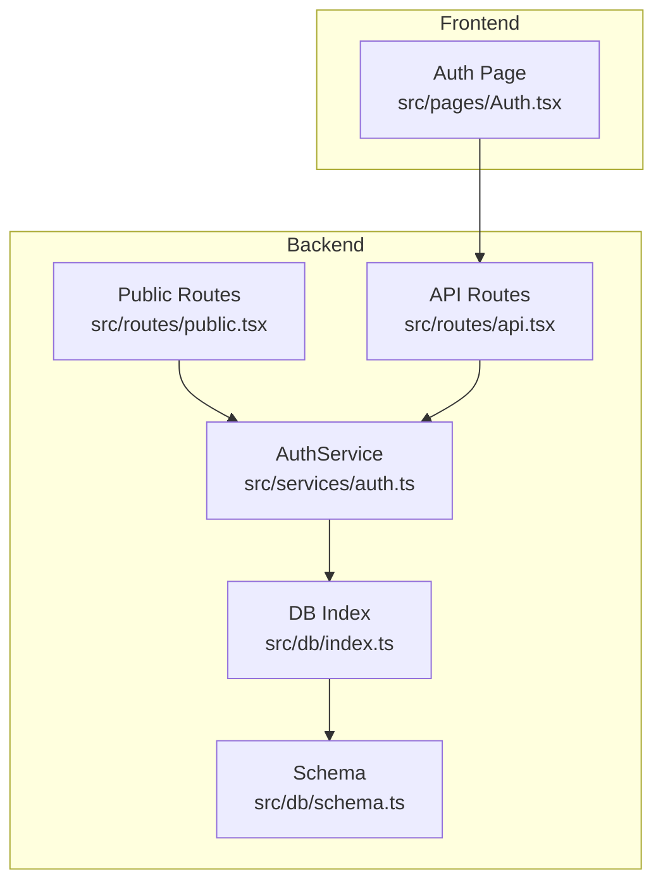
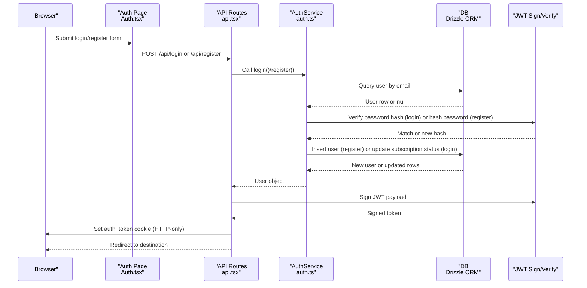
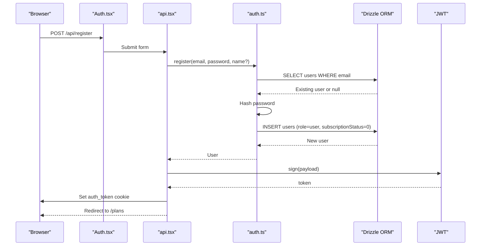
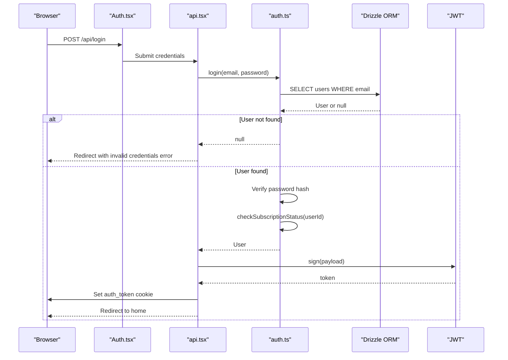
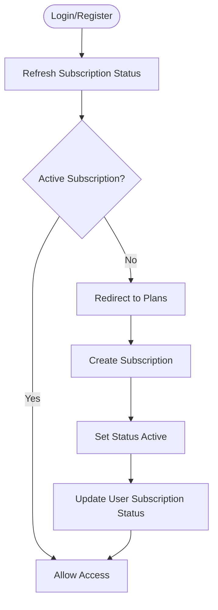
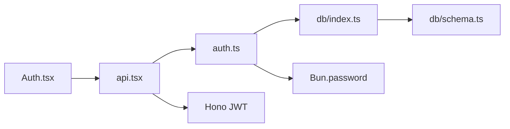

# User Registration & Login

<cite>
**Referenced Files in This Document**
- [src/services/auth.ts](file://src/services/auth.ts)
- [src/routes/api.tsx](file://src/routes/api.tsx)
- [src/routes/public.tsx](file://src/routes/public.tsx)
- [src/pages/Auth.tsx](file://src/pages/Auth.tsx)
- [src/db/schema.ts](file://src/db/schema.ts)
- [src/db/index.ts](file://src/db/index.ts)
- [drizzle/0000_special_white_queen.sql](file://drizzle/0000_special_white_queen.sql)
- [drizzle/0001_chunky_thunderbolts.sql](file://drizzle/0001_chunky_thunderbolts.sql)
- [drizzle/0002_sparkling_madripoor.sql](file://drizzle/0002_sparkling_madripoor.sql)
- [package.json](file://package.json)
</cite>

## Table of Contents
1. [Introduction](#introduction)
2. [Project Structure](#project-structure)
3. [Core Components](#core-components)
4. [Architecture Overview](#architecture-overview)
5. [Detailed Component Analysis](#detailed-component-analysis)
6. [Dependency Analysis](#dependency-analysis)
7. [Performance Considerations](#performance-considerations)
8. [Troubleshooting Guide](#troubleshooting-guide)
9. [Conclusion](#conclusion)
10. [Appendices](#appendices)

## Introduction
This document explains the user registration and login functionality, focusing on the end-to-end flow from form submission to authentication state. It covers:
- Registration workflow: email uniqueness checks, password hashing, and user creation
- Login process: credential verification and JWT-based session establishment
- Authentication success and failure scenarios
- Password security, hash verification, and account lockout mechanisms
- Role assignment during registration, default permissions, and subscription activation
- Common authentication errors, validation failures, and recovery procedures
- Frontend integration examples and backend API endpoint references

## Project Structure
The authentication system spans frontend pages, API routes, and backend services backed by a PostgreSQL database via Drizzle ORM.

**Diagram sources**
- [src/pages/Auth.tsx](file://src/pages/Auth.tsx#L1-L116)
- [src/routes/public.tsx](file://src/routes/public.tsx#L1-L170)
- [src/routes/api.tsx](file://src/routes/api.tsx#L1-L519)
- [src/services/auth.ts](file://src/services/auth.ts#L1-L91)
- [src/db/index.ts](file://src/db/index.ts#L1-L8)
- [src/db/schema.ts](file://src/db/schema.ts#L1-L178)

**Section sources**
- [src/pages/Auth.tsx](file://src/pages/Auth.tsx#L1-L116)
- [src/routes/public.tsx](file://src/routes/public.tsx#L1-L170)
- [src/routes/api.tsx](file://src/routes/api.tsx#L1-L519)
- [src/services/auth.ts](file://src/services/auth.ts#L1-L91)
- [src/db/index.ts](file://src/db/index.ts#L1-L8)
- [src/db/schema.ts](file://src/db/schema.ts#L1-L178)

## Core Components
- Frontend Auth Page: Renders the login and registration forms and posts to backend endpoints.
- API Routes: Handles registration, login, logout, and subscription flows.
- AuthService: Implements password hashing, credential verification, and subscription lifecycle.
- Database Layer: Defines user, plan, and subscription schemas and connects to PostgreSQL via Drizzle ORM.

Key responsibilities:
- Registration: Hash password, check email uniqueness, insert user record, issue JWT cookie.
- Login: Lookup user by email, verify password hash, update subscription status, issue JWT cookie.
- Subscription: Create subscription records and update user subscription status.
- Public routes: Verify JWT cookie to hydrate user context for protected UI rendering.

**Section sources**
- [src/pages/Auth.tsx](file://src/pages/Auth.tsx#L39-L75)
- [src/routes/api.tsx](file://src/routes/api.tsx#L315-L379)
- [src/services/auth.ts](file://src/services/auth.ts#L5-L39)
- [src/db/schema.ts](file://src/db/schema.ts#L6-L46)

## Architecture Overview
The authentication architecture uses a cookie-based JWT session. On successful login or registration, the server signs a JWT and stores it in an HTTP-only cookie. Subsequent requests include the cookie, allowing the server to verify the token and hydrate user context.

**Diagram sources**
- [src/pages/Auth.tsx](file://src/pages/Auth.tsx#L39-L75)
- [src/routes/api.tsx](file://src/routes/api.tsx#L315-L379)
- [src/services/auth.ts](file://src/services/auth.ts#L5-L39)
- [src/db/index.ts](file://src/db/index.ts#L1-L8)

## Detailed Component Analysis

### Registration Workflow
Registration handles:
- Email uniqueness validation
- Password hashing using Bun’s built-in password hashing
- User insertion with default role and subscription status
- JWT issuance and cookie setting

Implementation highlights:
- Password hashing: [src/services/auth.ts](file://src/services/auth.ts#L7)
- Duplicate email prevention: [src/services/auth.ts](file://src/services/auth.ts#L9-L15)
- Default role and subscription status: [src/services/auth.ts](file://src/services/auth.ts#L17-L23)
- Cookie issuance: [src/routes/api.tsx](file://src/routes/api.tsx#L367-L374)

**Diagram sources**
- [src/pages/Auth.tsx](file://src/pages/Auth.tsx#L39-L75)
- [src/routes/api.tsx](file://src/routes/api.tsx#L351-L379)
- [src/services/auth.ts](file://src/services/auth.ts#L6-L26)

**Section sources**
- [src/services/auth.ts](file://src/services/auth.ts#L6-L26)
- [src/routes/api.tsx](file://src/routes/api.tsx#L351-L379)

### Login Process
Login performs:
- User lookup by email
- Password hash verification
- Subscription status refresh
- JWT issuance and cookie setting

Security and behavior:
- Password verification: [src/services/auth.ts](file://src/services/auth.ts#L35)
- Subscription status refresh: [src/services/auth.ts](file://src/services/auth.ts#L327)
- Cookie attributes: [src/routes/api.tsx](file://src/routes/api.tsx#L337-L343)

**Diagram sources**
- [src/pages/Auth.tsx](file://src/pages/Auth.tsx#L39-L75)
- [src/routes/api.tsx](file://src/routes/api.tsx#L315-L349)
- [src/services/auth.ts](file://src/services/auth.ts#L28-L39)

**Section sources**
- [src/services/auth.ts](file://src/services/auth.ts#L28-L39)
- [src/routes/api.tsx](file://src/routes/api.tsx#L315-L349)

### Password Security and Hash Verification
- Password hashing: Uses Bun’s password hashing for secure one-way hashing.
- Verification: Uses Bun’s password verification to compare provided password against stored hash.
- No explicit account lockout mechanism is implemented in the current code.

Best practices observed:
- Strong hashing via Bun’s built-in password hashing.
- Immediate hash verification without storing plaintext passwords.

**Section sources**
- [src/services/auth.ts](file://src/services/auth.ts#L7-L36)

### Account Lockout Mechanisms
- No explicit account lockout logic is present in the current implementation.
- Consider adding rate limiting and temporary lockout after failed attempts for production hardening.

**Section sources**
- [src/services/auth.ts](file://src/services/auth.ts#L28-L39)
- [src/routes/api.tsx](file://src/routes/api.tsx#L315-L349)

### User Role Assignment and Default Permissions
- Default role: Users are created with role=user by default.
- Admin role: Can be passed to the registration method; otherwise defaults to user.
- Subscription status: Defaults to inactive (0) upon registration.

Permissions and defaults:
- Role default: [src/services/auth.ts](file://src/services/auth.ts#L21)
- Schema role enum: [src/db/schema.ts](file://src/db/schema.ts#L11)
- Subscription status default: [src/services/auth.ts](file://src/services/auth.ts#L22)

**Section sources**
- [src/services/auth.ts](file://src/services/auth.ts#L6-L26)
- [src/db/schema.ts](file://src/db/schema.ts#L11)

### Account Activation and Subscription Lifecycle
- After login, subscription status is refreshed to ensure consistency.
- Subscription creation requires a plan ID and sets status to active with calculated dates.
- Subscription expiration updates both subscription and user status.

**Diagram sources**
- [src/services/auth.ts](file://src/services/auth.ts#L67-L89)
- [src/services/auth.ts](file://src/services/auth.ts#L41-L65)

**Section sources**
- [src/services/auth.ts](file://src/services/auth.ts#L41-L89)

### Logout and Session Termination
- Logout clears the auth_token cookie by setting maxAge to 0.
- Redirects to the login page.

**Section sources**
- [src/routes/api.tsx](file://src/routes/api.tsx#L508-L517)

### Frontend Integration Examples
- Auth form posts to backend endpoints:
  - Login: [src/pages/Auth.tsx](file://src/pages/Auth.tsx#L39)
  - Register: [src/pages/Auth.tsx](file://src/pages/Auth.tsx#L39)
- Public routes verify JWT cookie to hydrate user context:
  - Token extraction and verification: [src/routes/public.tsx](file://src/routes/public.tsx#L20-L51)

**Section sources**
- [src/pages/Auth.tsx](file://src/pages/Auth.tsx#L39-L75)
- [src/routes/public.tsx](file://src/routes/public.tsx#L20-L51)

### Backend API Endpoints
- POST /api/register: Registers a new user, hashes password, issues JWT cookie, redirects to plans.
- POST /api/login: Authenticates user, verifies password, refreshes subscription status, issues JWT cookie, redirects to home.
- POST /api/logout: Clears auth_token cookie.
- POST /api/subscribe: Creates a subscription for a logged-in user.

Endpoint references:
- [src/routes/api.tsx](file://src/routes/api.tsx#L315-L379)
- [src/routes/api.tsx](file://src/routes/api.tsx#L508-L517)
- [src/routes/api.tsx](file://src/routes/api.tsx#L381-L399)

**Section sources**
- [src/routes/api.tsx](file://src/routes/api.tsx#L315-L379)
- [src/routes/api.tsx](file://src/routes/api.tsx#L381-L399)
- [src/routes/api.tsx](file://src/routes/api.tsx#L508-L517)

## Dependency Analysis
The authentication stack depends on:
- Hono for routing and JWT signing/verification
- Drizzle ORM for database operations
- Bun’s password hashing for secure credentials
- PostgreSQL for persistent storage

**Diagram sources**
- [src/pages/Auth.tsx](file://src/pages/Auth.tsx#L1-L116)
- [src/routes/api.tsx](file://src/routes/api.tsx#L1-L519)
- [src/services/auth.ts](file://src/services/auth.ts#L1-L91)
- [src/db/index.ts](file://src/db/index.ts#L1-L8)
- [src/db/schema.ts](file://src/db/schema.ts#L1-L178)

**Section sources**
- [src/routes/api.tsx](file://src/routes/api.tsx#L1-L12)
- [src/services/auth.ts](file://src/services/auth.ts#L1-L3)
- [src/db/index.ts](file://src/db/index.ts#L1-L8)
- [package.json](file://package.json#L8-L16)

## Performance Considerations
- Password hashing is performed synchronously; consider batching or offloading if scaling to high concurrency.
- JWT signing/verification is lightweight; ensure secret rotation and secure cookie attributes.
- Database queries use equality filters on indexed email; keep indexes aligned with query patterns.
- Subscription status refresh occurs on login; cache or lazy-refresh for high traffic.

[No sources needed since this section provides general guidance]

## Troubleshooting Guide
Common issues and resolutions:
- Invalid credentials on login:
  - Cause: Nonexistent user or incorrect password.
  - Behavior: Redirect with invalid credentials error.
  - Reference: [src/routes/api.tsx](file://src/routes/api.tsx#L323-L325)
- User already exists during registration:
  - Cause: Duplicate email.
  - Behavior: Redirect with error parameter.
  - Reference: [src/services/auth.ts](file://src/services/auth.ts#L13-L15), [src/routes/api.tsx](file://src/routes/api.tsx#L377)
- Missing auth_token cookie:
  - Cause: Not logged in or cookie cleared.
  - Behavior: Public routes return null user context.
  - Reference: [src/routes/public.tsx](file://src/routes/public.tsx#L20-L25)
- Subscription not found during subscribe:
  - Cause: Invalid plan ID.
  - Behavior: Redirect to login or error response.
  - Reference: [src/services/auth.ts](file://src/services/auth.ts#L46), [src/routes/api.tsx](file://src/routes/api.tsx#L390)
- Expired subscription:
  - Cause: End date passed.
  - Behavior: Status updated to expired and user subscription status reset.
  - Reference: [src/services/auth.ts](file://src/services/auth.ts#L82-L86)

**Section sources**
- [src/routes/api.tsx](file://src/routes/api.tsx#L323-L325)
- [src/services/auth.ts](file://src/services/auth.ts#L13-L15)
- [src/routes/api.tsx](file://src/routes/api.tsx#L377)
- [src/routes/public.tsx](file://src/routes/public.tsx#L20-L25)
- [src/services/auth.ts](file://src/services/auth.ts#L46)
- [src/routes/api.tsx](file://src/routes/api.tsx#L390)
- [src/services/auth.ts](file://src/services/auth.ts#L82-L86)

## Conclusion
The authentication system provides a robust foundation for user registration and login:
- Secure password handling via Bun’s password hashing
- JWT-based session management with HTTP-only cookies
- Clear separation of concerns between frontend forms, API routes, and backend services
- Subscription lifecycle integration for premium access

Areas for future enhancement include:
- Implementing account lockout and rate limiting
- Adding email verification and activation flows
- Enhancing error messages and recovery procedures

[No sources needed since this section summarizes without analyzing specific files]

## Appendices

### Database Schema Notes
- Users table includes email uniqueness, role enum, and subscription status integer.
- Subscriptions table links users to plans with status and date fields.
- Migration history reflects schema evolution for roles, subscription status, and plan duration.

**Section sources**
- [src/db/schema.ts](file://src/db/schema.ts#L6-L46)
- [drizzle/0000_special_white_queen.sql](file://drizzle/0000_special_white_queen.sql#L35-L43)
- [drizzle/0001_chunky_thunderbolts.sql](file://drizzle/0001_chunky_thunderbolts.sql#L1-L14)
- [drizzle/0002_sparkling_madripoor.sql](file://drizzle/0002_sparkling_madripoor.sql#L1)