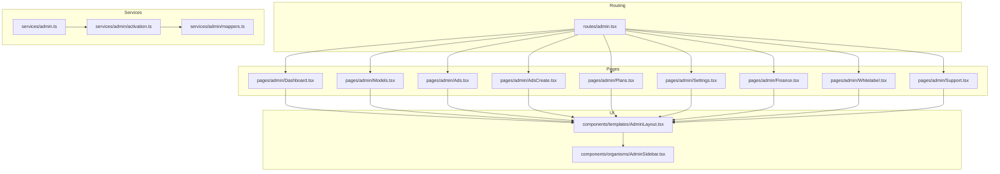
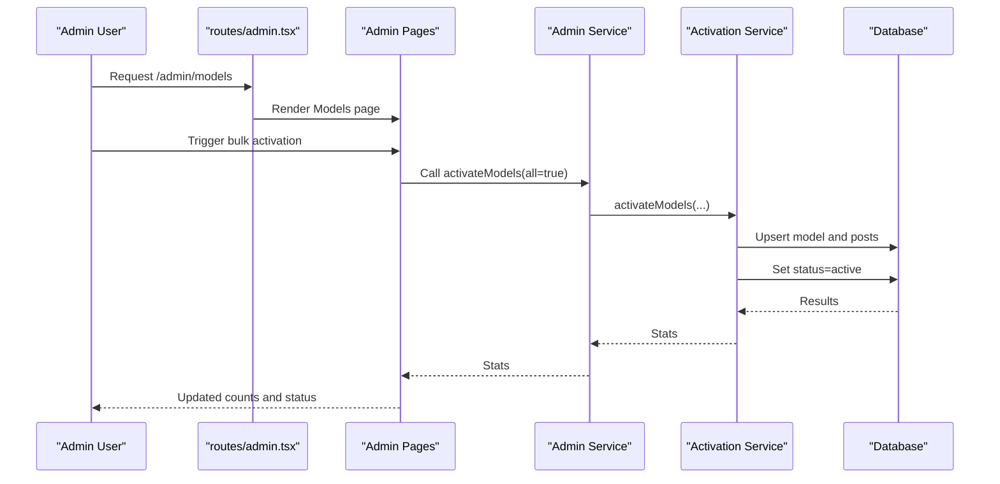
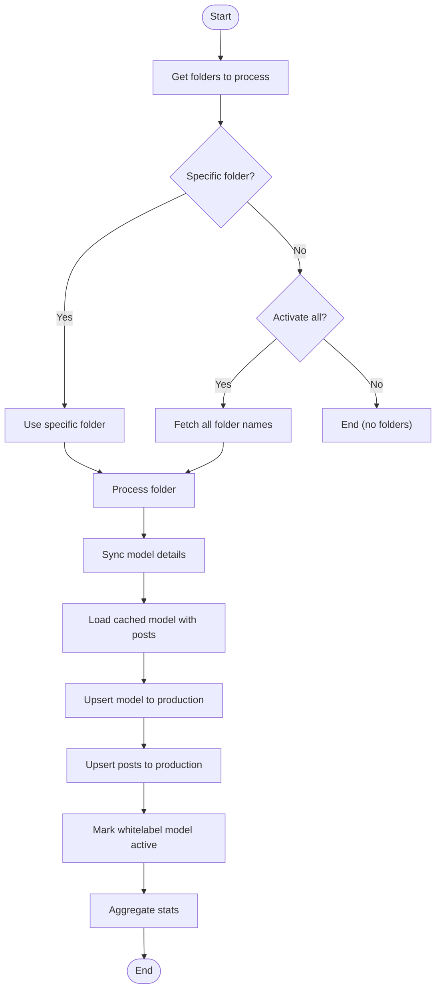
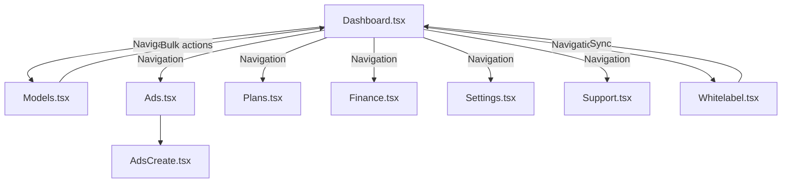
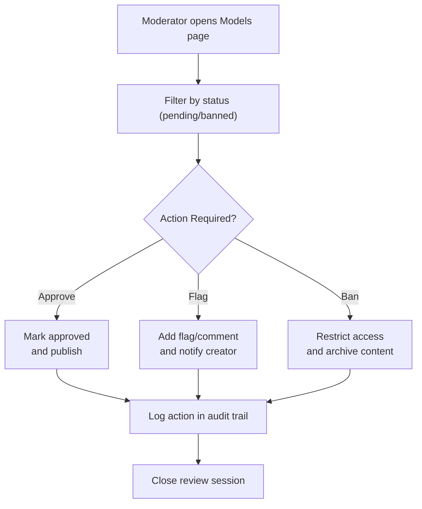
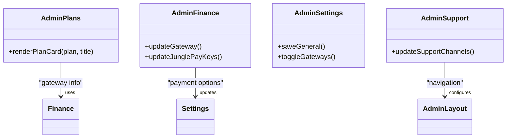
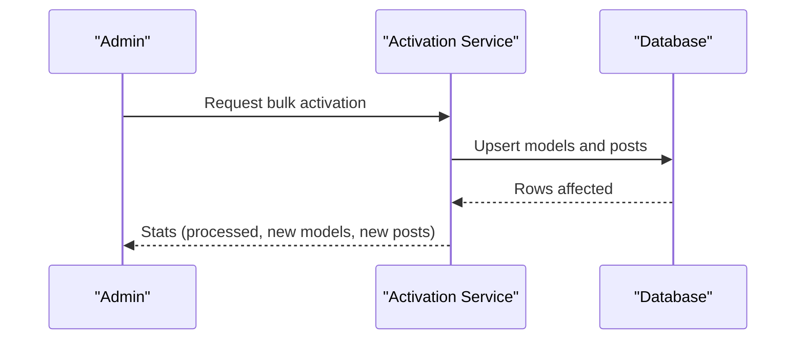
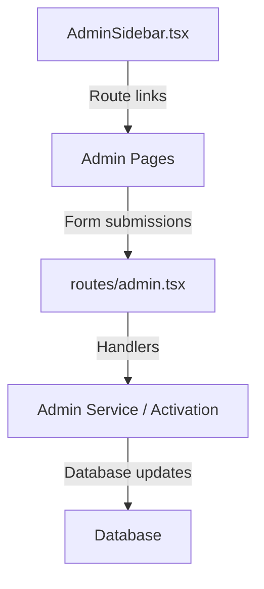
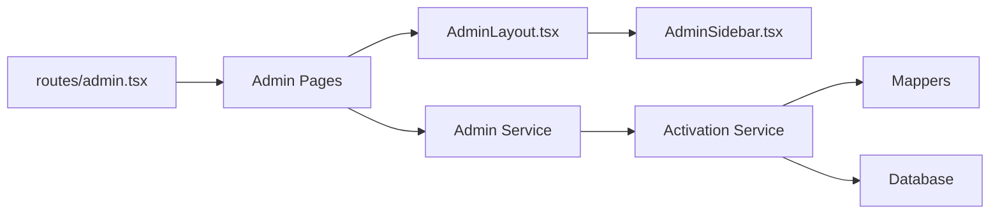

# Administrative Content Controls

<cite>
**Referenced Files in This Document**
- [Admin.tsx](file://src/pages/Admin.tsx)
- [admin.tsx](file://src/routes/admin.tsx)
- [AdminLayout.tsx](file://src/components/templates/AdminLayout.tsx)
- [AdminSidebar.tsx](file://src/components/organisms/AdminSidebar.tsx)
- [activation.ts](file://src/services/admin/activation.ts)
- [mappers.ts](file://src/services/admin/mappers.ts)
- [admin.ts](file://src/services/admin.ts)
- [Dashboard.tsx](file://src/pages/admin/Dashboard.tsx)
- [Models.tsx](file://src/pages/admin/Models.tsx)
- [Ads.tsx](file://src/pages/admin/Ads.tsx)
- [AdsCreate.tsx](file://src/pages/admin/AdsCreate.tsx)
- [Plans.tsx](file://src/pages/admin/Plans.tsx)
- [Settings.tsx](file://src/pages/admin/Settings.tsx)
- [Support.tsx](file://src/pages/admin/Support.tsx)
- [Finance.tsx](file://src/pages/admin/Finance.tsx)
- [Whitelabel.tsx](file://src/pages/admin/Whitelabel.tsx)
</cite>

## Table of Contents
1. [Introduction](#introduction)
2. [Project Structure](#project-structure)
3. [Core Components](#core-components)
4. [Architecture Overview](#architecture-overview)
5. [Detailed Component Analysis](#detailed-component-analysis)
6. [Dependency Analysis](#dependency-analysis)
7. [Performance Considerations](#performance-considerations)
8. [Troubleshooting Guide](#troubleshooting-guide)
9. [Conclusion](#conclusion)

## Introduction
This document explains the administrative content management controls and moderation systems implemented in the project. It covers content activation/deactivation workflows, creator onboarding processes, system configuration options, and administrative interfaces for content review, user management, and policy enforcement. It also documents content approval workflows, flag management, quality assurance processes, bulk operations, reporting mechanisms, and audit trails. Examples of administrative actions, permission controls, and workflow automation are included to guide operators and administrators.

## Project Structure
The administrative subsystem is organized around:
- Routes that expose administrative pages and backend handlers
- Page components that render admin dashboards and forms
- Services that implement activation and mapping logic
- Shared layout and sidebar components for consistent navigation

**Diagram sources**
- [admin.tsx](file://src/routes/admin.tsx#L1-L158)
- [Dashboard.tsx](file://src/pages/admin/Dashboard.tsx#L1-L85)
- [Models.tsx](file://src/pages/admin/Models.tsx#L1-L35)
- [Ads.tsx](file://src/pages/admin/Ads.tsx#L1-L33)
- [AdsCreate.tsx](file://src/pages/admin/AdsCreate.tsx#L1-L321)
- [Plans.tsx](file://src/pages/admin/Plans.tsx#L1-L126)
- [Settings.tsx](file://src/pages/admin/Settings.tsx#L1-L51)
- [Finance.tsx](file://src/pages/admin/Finance.tsx#L1-L112)
- [Whitelabel.tsx](file://src/pages/admin/Whitelabel.tsx#L1-L30)
- [Support.tsx](file://src/pages/admin/Support.tsx#L1-L88)
- [AdminLayout.tsx](file://src/components/templates/AdminLayout.tsx#L1-L64)
- [AdminSidebar.tsx](file://src/components/organisms/AdminSidebar.tsx#L1-L98)
- [admin.ts](file://src/services/admin.ts#L1-L5)
- [activation.ts](file://src/services/admin/activation.ts#L1-L86)
- [mappers.ts](file://src/services/admin/mappers.ts#L1-L40)

**Section sources**
- [admin.tsx](file://src/routes/admin.tsx#L1-L158)
- [Admin.tsx](file://src/pages/Admin.tsx#L1-L107)
- [AdminLayout.tsx](file://src/components/templates/AdminLayout.tsx#L1-L64)
- [AdminSidebar.tsx](file://src/components/organisms/AdminSidebar.tsx#L1-L98)

## Core Components
- Admin routing module exposes administrative endpoints and initializes default configurations for plans, payment gateways, and support contacts.
- Admin pages provide dashboards, content management, monetization controls, configuration panels, and whitelabel integration.
- Activation service orchestrates model and post creation from staged data into production tables and marks models active.
- Mappers transform whitelabel staging data into production-ready records, including signed S3 URLs for media assets.
- Admin service aggregates activation capabilities for use by higher-level orchestration.

Key responsibilities:
- Content activation/deactivation: activation service toggles model status after upserting models and posts.
- Creator onboarding: whitelabel integration lists models and supports bulk synchronization from external storage.
- System configuration: plans, finance, settings, and support pages manage pricing, payment gateways, site metadata, and support channels.
- Moderation and quality assurance: models page filters and pagination enable review workflows; ads creation preview supports quality checks.

**Section sources**
- [admin.tsx](file://src/routes/admin.tsx#L18-L155)
- [activation.ts](file://src/services/admin/activation.ts#L7-L86)
- [mappers.ts](file://src/services/admin/mappers.ts#L3-L39)
- [admin.ts](file://src/services/admin.ts#L3-L5)
- [Models.tsx](file://src/pages/admin/Models.tsx#L7-L34)
- [AdsCreate.tsx](file://src/pages/admin/AdsCreate.tsx#L10-L321)
- [Whitelabel.tsx](file://src/pages/admin/Whitelabel.tsx#L15-L29)

## Architecture Overview
The admin architecture follows a layered pattern:
- Routing layer maps HTTP requests to page components and handlers.
- Presentation layer renders admin dashboards and forms using shared layout and sidebar.
- Service layer encapsulates activation logic and data mapping.
- Data layer persists state to the database and integrates with external storage for media.

**Diagram sources**
- [admin.tsx](file://src/routes/admin.tsx#L18-L155)
- [admin.ts](file://src/services/admin.ts#L3-L5)
- [activation.ts](file://src/services/admin/activation.ts#L7-L86)

## Detailed Component Analysis

### Content Activation and Creator Onboarding
The activation workflow moves content from staged whitelabel data to production:
- Retrieve folders to process (all or specific).
- Sync model details from external storage.
- Upsert model into production models table.
- Upsert posts linked to the model.
- Mark the whitelabel model as active.

**Diagram sources**
- [activation.ts](file://src/services/admin/activation.ts#L22-L55)

Implementation highlights:
- Bulk operations: activate all whitelabel models with a single action.
- Quality assurance: mapper signs S3 keys for media URLs before insertion.
- Audit trail: stats track processed models and new posts created.

**Section sources**
- [activation.ts](file://src/services/admin/activation.ts#L7-L86)
- [mappers.ts](file://src/services/admin/mappers.ts#L3-L39)
- [admin.ts](file://src/services/admin.ts#L3-L5)

### Administrative Interfaces and Workflows
- Dashboard: overview metrics and recent activity.
- Models: filter by status, search, paginate, and trigger activation.
- Ads: manage campaigns and previews; create new ads with live preview.
- Plans: configure pricing and checkout links per gateway.
- Finance: select active gateway and update JunglePay credentials.
- Settings: general site configuration and payment gateway toggles.
- Support: configure support channels and visibility.
- Whitelabel: list models, show stats, and synchronize from external storage.

**Diagram sources**
- [Dashboard.tsx](file://src/pages/admin/Dashboard.tsx#L5-L84)
- [Models.tsx](file://src/pages/admin/Models.tsx#L7-L34)
- [Ads.tsx](file://src/pages/admin/Ads.tsx#L7-L32)
- [AdsCreate.tsx](file://src/pages/admin/AdsCreate.tsx#L10-L321)
- [Plans.tsx](file://src/pages/admin/Plans.tsx#L20-L125)
- [Finance.tsx](file://src/pages/admin/Finance.tsx#L18-L111)
- [Settings.tsx](file://src/pages/admin/Settings.tsx#L5-L50)
- [Support.tsx](file://src/pages/admin/Support.tsx#L15-L87)
- [Whitelabel.tsx](file://src/pages/admin/Whitelabel.tsx#L15-L29)

**Section sources**
- [Dashboard.tsx](file://src/pages/admin/Dashboard.tsx#L5-L84)
- [Models.tsx](file://src/pages/admin/Models.tsx#L7-L34)
- [Ads.tsx](file://src/pages/admin/Ads.tsx#L7-L32)
- [AdsCreate.tsx](file://src/pages/admin/AdsCreate.tsx#L10-L321)
- [Plans.tsx](file://src/pages/admin/Plans.tsx#L20-L125)
- [Finance.tsx](file://src/pages/admin/Finance.tsx#L18-L111)
- [Settings.tsx](file://src/pages/admin/Settings.tsx#L5-L50)
- [Support.tsx](file://src/pages/admin/Support.tsx#L15-L87)
- [Whitelabel.tsx](file://src/pages/admin/Whitelabel.tsx#L15-L29)

### Content Approval and Flag Management
- Models page provides filtering by status categories (all, pending, banned) to support moderation workflows.
- Ads creation preview enables quality checks before publishing.
- Finance and plans pages centralize approval-related configuration (checkout links, accepted payment methods).

**Diagram sources**
- [Models.tsx](file://src/pages/admin/Models.tsx#L12-L19)

**Section sources**
- [Models.tsx](file://src/pages/admin/Models.tsx#L12-L19)
- [AdsCreate.tsx](file://src/pages/admin/AdsCreate.tsx#L10-L321)
- [Plans.tsx](file://src/pages/admin/Plans.tsx#L56-L93)
- [Finance.tsx](file://src/pages/admin/Finance.tsx#L39-L59)

### System Configuration Options
- Plans: set prices and checkout URLs per plan; gateway-specific options (Dias Marketplace vs. JunglePay).
- Finance: choose active gateway and update JunglePay credentials.
- Settings: general site metadata and payment gateway toggles.
- Support: configure support channel URLs and visibility.

**Diagram sources**
- [Plans.tsx](file://src/pages/admin/Plans.tsx#L20-L125)
- [Finance.tsx](file://src/pages/admin/Finance.tsx#L18-L111)
- [Settings.tsx](file://src/pages/admin/Settings.tsx#L5-L50)
- [Support.tsx](file://src/pages/admin/Support.tsx#L15-L87)

**Section sources**
- [Plans.tsx](file://src/pages/admin/Plans.tsx#L20-L125)
- [Finance.tsx](file://src/pages/admin/Finance.tsx#L18-L111)
- [Settings.tsx](file://src/pages/admin/Settings.tsx#L5-L50)
- [Support.tsx](file://src/pages/admin/Support.tsx#L15-L87)

### Reporting Mechanisms and Audit Trails
- Dashboard displays metrics and recent activity for monitoring.
- Activation service returns statistics for processed models and new posts, enabling audit logs.
- Whitelabel status component surfaces operational stats for synchronization.

**Diagram sources**
- [activation.ts](file://src/services/admin/activation.ts#L7-L20)

**Section sources**
- [Dashboard.tsx](file://src/pages/admin/Dashboard.tsx#L5-L84)
- [activation.ts](file://src/services/admin/activation.ts#L7-L20)
- [Whitelabel.tsx](file://src/pages/admin/Whitelabel.tsx#L22-L22)

### Permission Controls and Workflow Automation
- Navigation and access are centralized in the admin layout and sidebar.
- Bulk operations (e.g., activate all models) streamline workflow automation.
- Gateway-driven configuration automates checkout and payment acceptance logic.

**Diagram sources**
- [AdminSidebar.tsx](file://src/components/organisms/AdminSidebar.tsx#L3-L98)
- [admin.tsx](file://src/routes/admin.tsx#L18-L155)
- [admin.ts](file://src/services/admin.ts#L3-L5)

**Section sources**
- [AdminSidebar.tsx](file://src/components/organisms/AdminSidebar.tsx#L3-L98)
- [AdminLayout.tsx](file://src/components/templates/AdminLayout.tsx#L9-L64)
- [admin.tsx](file://src/routes/admin.tsx#L18-L155)
- [admin.ts](file://src/services/admin.ts#L3-L5)

## Dependency Analysis
The admin subsystem exhibits clear separation of concerns:
- Routing depends on page components and services.
- Pages depend on shared layout and sidebar.
- Services encapsulate activation logic and data mapping.
- Database interactions are centralized in services.

**Diagram sources**
- [admin.tsx](file://src/routes/admin.tsx#L1-L158)
- [AdminLayout.tsx](file://src/components/templates/AdminLayout.tsx#L9-L64)
- [AdminSidebar.tsx](file://src/components/organisms/AdminSidebar.tsx#L3-L98)
- [admin.ts](file://src/services/admin.ts#L3-L5)
- [activation.ts](file://src/services/admin/activation.ts#L1-L86)
- [mappers.ts](file://src/services/admin/mappers.ts#L1-L40)

**Section sources**
- [admin.tsx](file://src/routes/admin.tsx#L1-L158)
- [admin.ts](file://src/services/admin.ts#L3-L5)
- [activation.ts](file://src/services/admin/activation.ts#L1-L86)
- [mappers.ts](file://src/services/admin/mappers.ts#L1-L40)

## Performance Considerations
- Batch processing: activation service iterates folders and performs upserts; consider batching and transaction boundaries to reduce overhead.
- Media signing: S3 key signing occurs during mapping; ensure caching and rate limiting to avoid repeated signing operations.
- Rendering: Dashboard and table-heavy pages should leverage pagination and virtualization for large datasets.
- Database queries: pre-warming defaults (plans, gateways, support contacts) reduces runtime branching and improves responsiveness.

## Troubleshooting Guide
Common issues and resolutions:
- Missing default plans or gateways: the route handler creates defaults if absent; verify database initialization and retry.
- Invalid support URLs: URL normalization ensures correct prefixes; confirm platform-specific formatting.
- Activation failures: check mapper signing results and database constraints; review returned stats for insight.
- Whitelabel sync errors: inspect error propagation and logs; retry synchronization after resolving external storage issues.

**Section sources**
- [admin.tsx](file://src/routes/admin.tsx#L22-L47)
- [admin.tsx](file://src/routes/admin.tsx#L85-L113)
- [activation.ts](file://src/services/admin/activation.ts#L31-L55)
- [Whitelabel.tsx](file://src/pages/admin/Whitelabel.tsx#L22-L22)

## Conclusion
The administrative subsystem provides a comprehensive toolkit for content management and moderation. It supports creator onboarding via whitelabel integration, automates bulk activation, and offers robust configuration panels for plans, finance, settings, and support. Moderation workflows are facilitated through filtering and quality assurance steps, while reporting and audit capabilities help maintain oversight. The modular design enables further enhancements to permissions, automation, and scalability.