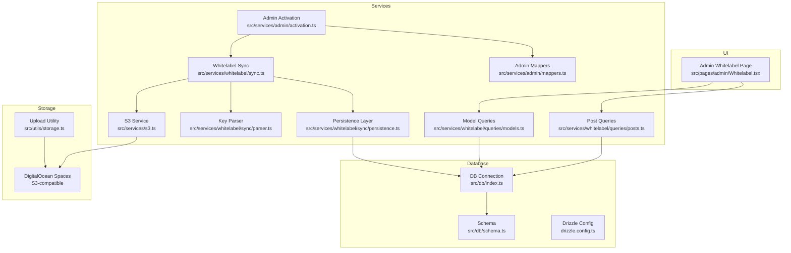
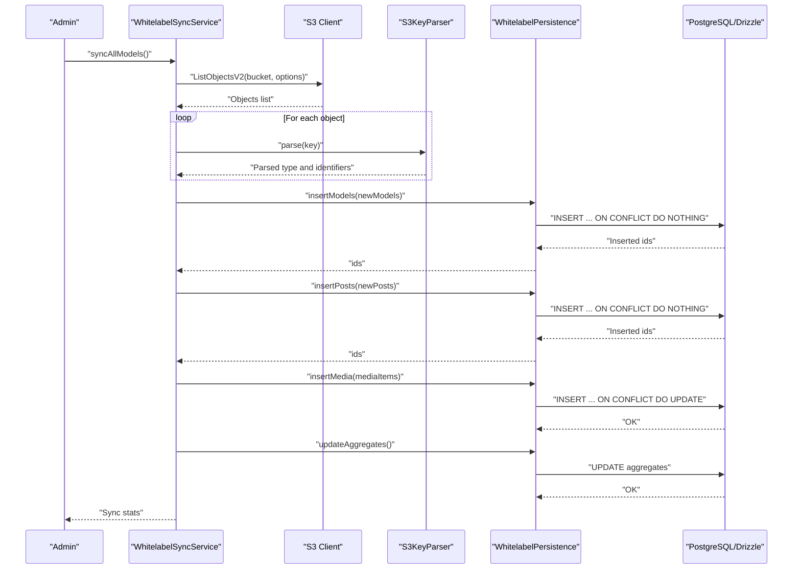
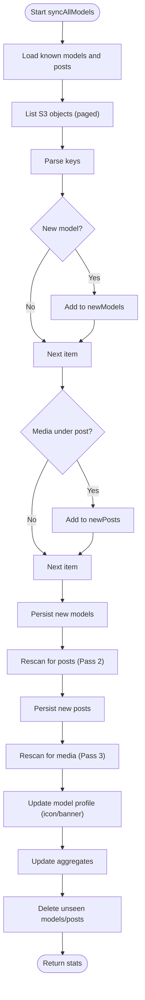
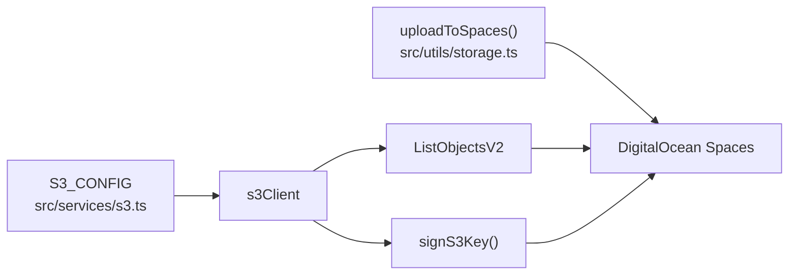
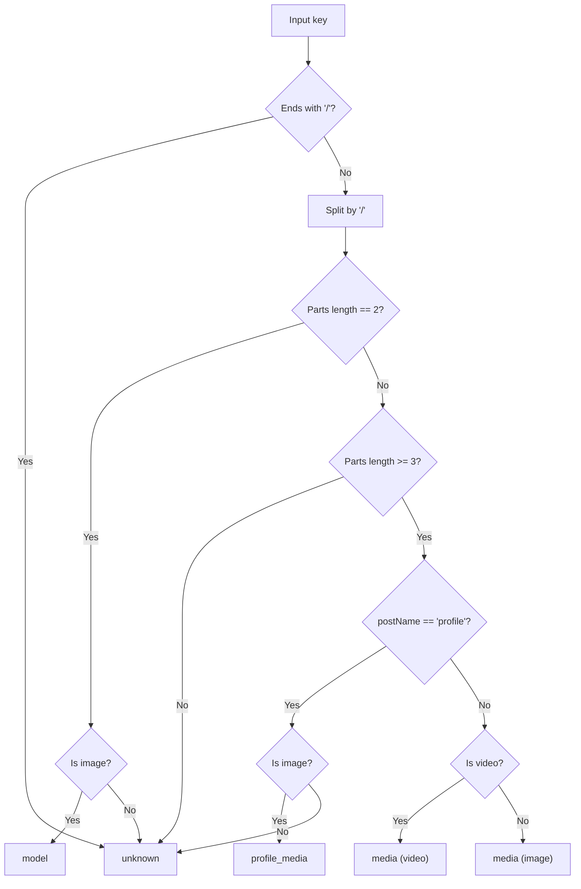
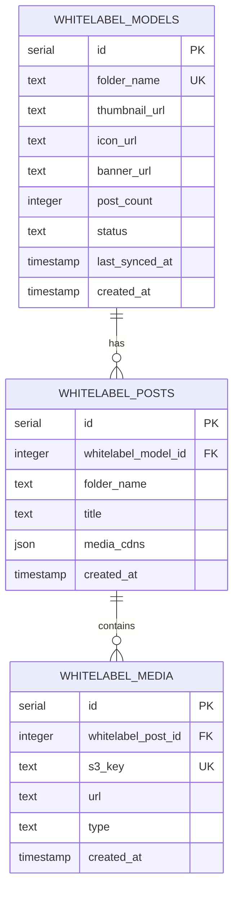
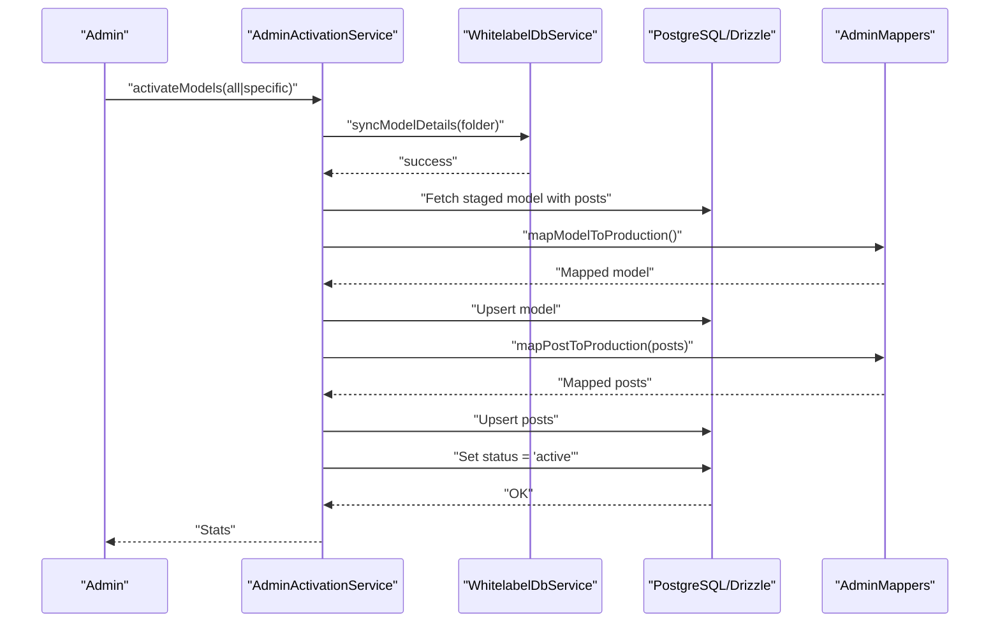
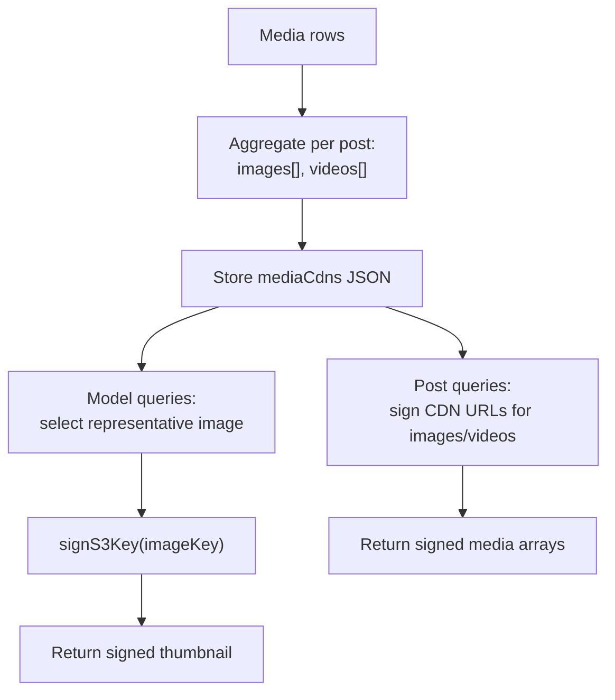
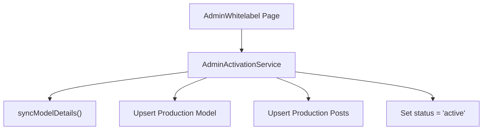
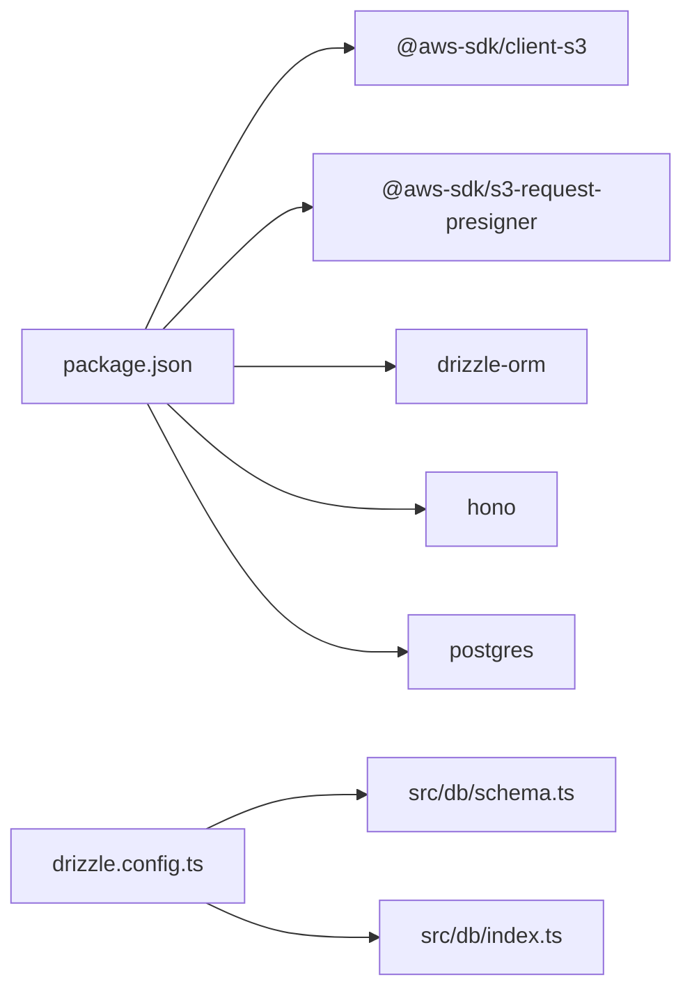

# Content Management System

<cite>
**Referenced Files in This Document**
- [README.md](file://README.md)
- [package.json](file://package.json)
- [drizzle.config.ts](file://drizzle.config.ts)
- [src/db/index.ts](file://src/db/index.ts)
- [src/db/schema.ts](file://src/db/schema.ts)
- [src/services/s3.ts](file://src/services/s3.ts)
- [src/utils/storage.ts](file://src/utils/storage.ts)
- [src/services/whitelabel/sync.ts](file://src/services/whitelabel/sync.ts)
- [src/services/whitelabel/sync/parser.ts](file://src/services/whitelabel/sync/parser.ts)
- [src/services/whitelabel/sync/persistence.ts](file://src/services/whitelabel/sync/persistence.ts)
- [src/services/whitelabel/queries/models.ts](file://src/services/whitelabel/queries/models.ts)
- [src/services/whitelabel/queries/posts.ts](file://src/services/whitelabel/queries/posts.ts)
- [src/services/admin.ts](file://src/services/admin.ts)
- [src/services/admin/activation.ts](file://src/services/admin/activation.ts)
- [src/services/admin/mappers.ts](file://src/services/admin/mappers.ts)
- [src/pages/admin/Whitelabel.tsx](file://src/pages/admin/Whitelabel.tsx)
</cite>

## Table of Contents
1. [Introduction](#introduction)
2. [Project Structure](#project-structure)
3. [Core Components](#core-components)
4. [Architecture Overview](#architecture-overview)
5. [Detailed Component Analysis](#detailed-component-analysis)
6. [Dependency Analysis](#dependency-analysis)
7. [Performance Considerations](#performance-considerations)
8. [Troubleshooting Guide](#troubleshooting-guide)
9. [Conclusion](#conclusion)
10. [Appendices](#appendices)

## Introduction
CreatorFlix is a white-label content platform built with Bun and Hono, integrating DigitalOcean Spaces (S3-compatible) for media storage and PostgreSQL with Drizzle ORM for persistence. This document explains the multi-pass content synchronization algorithm, S3 integration, content parsing, database persistence, automated ingestion pipeline, media processing workflows, thumbnail generation, administrative controls, and operational best practices.

## Project Structure
The repository follows a modular structure:
- Services: S3 integration, whitelabel synchronization, admin operations, and storage utilities
- Database: Drizzle ORM schema and connection setup
- Pages and Components: Admin UI for whitelabel management
- Utilities: Storage helpers for uploads

**Diagram sources**
- [src/services/whitelabel/sync.ts](file://src/services/whitelabel/sync.ts#L1-L334)
- [src/services/whitelabel/sync/parser.ts](file://src/services/whitelabel/sync/parser.ts#L1-L59)
- [src/services/whitelabel/sync/persistence.ts](file://src/services/whitelabel/sync/persistence.ts#L1-L94)
- [src/services/whitelabel/queries/models.ts](file://src/services/whitelabel/queries/models.ts#L1-L94)
- [src/services/whitelabel/queries/posts.ts](file://src/services/whitelabel/queries/posts.ts#L1-L47)
- [src/services/admin/activation.ts](file://src/services/admin/activation.ts#L1-L86)
- [src/services/admin/mappers.ts](file://src/services/admin/mappers.ts#L1-L40)
- [src/services/s3.ts](file://src/services/s3.ts#L1-L48)
- [src/utils/storage.ts](file://src/utils/storage.ts#L1-L39)
- [src/db/index.ts](file://src/db/index.ts#L1-L8)
- [src/db/schema.ts](file://src/db/schema.ts#L1-L178)
- [drizzle.config.ts](file://drizzle.config.ts#L1-L11)
- [src/pages/admin/Whitelabel.tsx](file://src/pages/admin/Whitelabel.tsx#L1-L30)

**Section sources**
- [README.md](file://README.md#L1-L49)
- [package.json](file://package.json#L1-L23)

## Core Components
- S3 Integration: Provides S3 client configuration and signed URL generation for secure access to DigitalOcean Spaces.
- Whitelabel Sync Service: Implements a three-pass synchronization pipeline to discover, create, and persist models, posts, and media from S3.
- Parser: Interprets S3 keys into structured content types (model, post, media, profile media).
- Persistence Layer: Manages CRUD operations and aggregate updates using Drizzle ORM.
- Admin Activation: Bridges staging whitelabel content to production models and posts.
- Queries: Exposes paginated lists, top creators, and model/post statistics with signed CDN URLs.
- Storage Utilities: Upload helper for DigitalOcean Spaces.

**Section sources**
- [src/services/s3.ts](file://src/services/s3.ts#L1-L48)
- [src/services/whitelabel/sync.ts](file://src/services/whitelabel/sync.ts#L1-L334)
- [src/services/whitelabel/sync/parser.ts](file://src/services/whitelabel/sync/parser.ts#L1-L59)
- [src/services/whitelabel/sync/persistence.ts](file://src/services/whitelabel/sync/persistence.ts#L1-L94)
- [src/services/admin/activation.ts](file://src/services/admin/activation.ts#L1-L86)
- [src/services/whitelabel/queries/models.ts](file://src/services/whitelabel/queries/models.ts#L1-L94)
- [src/services/whitelabel/queries/posts.ts](file://src/services/whitelabel/queries/posts.ts#L1-L47)
- [src/utils/storage.ts](file://src/utils/storage.ts#L1-L39)

## Architecture Overview
The system synchronizes content from DigitalOcean Spaces into a PostgreSQL database via Drizzle ORM. Admins trigger activation to promote staged whitelabel content to production models and posts. Signed URLs enable secure content delivery.

**Diagram sources**
- [src/services/whitelabel/sync.ts](file://src/services/whitelabel/sync.ts#L1-L197)
- [src/services/whitelabel/sync/parser.ts](file://src/services/whitelabel/sync/parser.ts#L10-L58)
- [src/services/whitelabel/sync/persistence.ts](file://src/services/whitelabel/sync/persistence.ts#L5-L92)

## Detailed Component Analysis

### Multi-Pass Content Synchronization Algorithm
The synchronization runs in three passes:
- Pass 1: Discover and insert models. Known models are loaded from the database to avoid duplicates.
- Pass 2: Discover and insert posts per model. Uses model ids resolved in Pass 1.
- Pass 3: Insert media items and update model profile fields (icon/banner) from profile media.

Deletion handling:
- After scanning, models and posts not seen during the scan are deleted to keep the database in sync with S3.

**Diagram sources**
- [src/services/whitelabel/sync.ts](file://src/services/whitelabel/sync.ts#L7-L197)

**Section sources**
- [src/services/whitelabel/sync.ts](file://src/services/whitelabel/sync.ts#L1-L197)

### S3 Integration with DigitalOcean Spaces
- Client configuration defines region, endpoint, credentials, and bucket.
- Signed URLs are generated for secure access to S3 objects.
- Upload utility supports public uploads to Spaces with proper MIME types.

**Diagram sources**
- [src/services/s3.ts](file://src/services/s3.ts#L4-L47)
- [src/utils/storage.ts](file://src/utils/storage.ts#L1-L39)

**Section sources**
- [src/services/s3.ts](file://src/services/s3.ts#L1-L48)
- [src/utils/storage.ts](file://src/utils/storage.ts#L1-L39)

### Content Parsing Mechanisms
The parser interprets S3 keys into structured types:
- Model-level images: "ModelName/file.jpg"
- Post content: "ModelName/PostName/file.ext"
- Profile media: "ModelName/profile/file.ext"
- Media classification distinguishes images and videos.

**Diagram sources**
- [src/services/whitelabel/sync/parser.ts](file://src/services/whitelabel/sync/parser.ts#L10-L58)

**Section sources**
- [src/services/whitelabel/sync/parser.ts](file://src/services/whitelabel/sync/parser.ts#L1-L59)

### Database Persistence Strategies
- Models, posts, and media are persisted with conflict handling:
  - Models and posts: upsert with conflict-do-nothing
  - Media: upsert with conflict-do-update
- Aggregates are updated after sync:
  - Model post counts
  - Post media CDNs aggregated as JSON with separate arrays for images and videos
- Foreign keys enforce referential integrity with cascade deletes.

**Diagram sources**
- [src/db/schema.ts](file://src/db/schema.ts#L73-L103)
- [src/services/whitelabel/sync/persistence.ts](file://src/services/whitelabel/sync/persistence.ts#L5-L92)

**Section sources**
- [src/db/schema.ts](file://src/db/schema.ts#L1-L178)
- [src/services/whitelabel/sync/persistence.ts](file://src/services/whitelabel/sync/persistence.ts#L1-L94)

### Automated Content Ingestion Pipeline
- Admin triggers activation to process whitelabel staging into production models and posts.
- Activation orchestrates:
  - Sync model details
  - Upsert model into production
  - Upsert posts into production
  - Mark model active

**Diagram sources**
- [src/services/admin/activation.ts](file://src/services/admin/activation.ts#L8-L55)
- [src/services/admin/mappers.ts](file://src/services/admin/mappers.ts#L3-L39)

**Section sources**
- [src/services/admin/activation.ts](file://src/services/admin/activation.ts#L1-L86)
- [src/services/admin/mappers.ts](file://src/services/admin/mappers.ts#L1-L40)

### Media Processing Workflows and Thumbnail Generation
- Media insertion records S3 keys and CDN URLs with type classification.
- Thumbnails are enriched by selecting a representative image per model and signing S3 keys for secure delivery.
- Post listings sign CDN URLs for images and videos to enable secure playback.

**Diagram sources**
- [src/services/whitelabel/sync/persistence.ts](file://src/services/whitelabel/sync/persistence.ts#L63-L92)
- [src/services/whitelabel/queries/models.ts](file://src/services/whitelabel/queries/models.ts#L7-L34)
- [src/services/whitelabel/queries/posts.ts](file://src/services/whitelabel/queries/posts.ts#L16-L32)

**Section sources**
- [src/services/whitelabel/sync/persistence.ts](file://src/services/whitelabel/sync/persistence.ts#L45-L92)
- [src/services/whitelabel/queries/models.ts](file://src/services/whitelabel/queries/models.ts#L1-L94)
- [src/services/whitelabel/queries/posts.ts](file://src/services/whitelabel/queries/posts.ts#L1-L47)

### Administrative Controls
- Admin activation service coordinates:
  - Determining folders to process (all or specific)
  - Processing each folder through sync and upsert
  - Updating model status to active
- Admin UI displays whitelabel status and pagination controls.

**Diagram sources**
- [src/services/admin/activation.ts](file://src/services/admin/activation.ts#L8-L55)
- [src/pages/admin/Whitelabel.tsx](file://src/pages/admin/Whitelabel.tsx#L15-L29)

**Section sources**
- [src/services/admin/activation.ts](file://src/services/admin/activation.ts#L1-L86)
- [src/pages/admin/Whitelabel.tsx](file://src/pages/admin/Whitelabel.tsx#L1-L30)

## Dependency Analysis
External dependencies include AWS SDK for S3, Drizzle ORM, Hono, and PostgreSQL driver. Drizzle Kit is used for migrations and schema management.

**Diagram sources**
- [package.json](file://package.json#L8-L22)
- [drizzle.config.ts](file://drizzle.config.ts#L1-L11)
- [src/db/schema.ts](file://src/db/schema.ts#L1-L178)
- [src/db/index.ts](file://src/db/index.ts#L1-L8)

**Section sources**
- [package.json](file://package.json#L1-L23)
- [drizzle.config.ts](file://drizzle.config.ts#L1-L11)

## Performance Considerations
- Batch sizing: The sync uses a fixed page size for S3 listing; consider tuning based on workload.
- Conflict handling: Upserts minimize redundant writes; ensure indexes exist on conflict targets.
- Aggregation updates: JSON aggregation and count updates occur after bulk inserts; consider periodic recomputation for very large datasets.
- Signed URL caching: Cache signed URLs server-side to reduce repeated signing overhead.
- CDN delivery: Serve media via DigitalOcean CDN endpoints to improve latency and bandwidth utilization.

## Troubleshooting Guide
Common issues and resolutions:
- Authentication failures with Spaces:
  - Verify region, endpoint, and credentials in S3 configuration.
  - Confirm bucket name and permissions.
- Signed URL errors:
  - Ensure keys are properly decoded and percent-encoded.
  - Validate that objects exist and are publicly readable.
- Sync inconsistencies:
  - Run deletion cleanup to remove orphaned models/posts.
  - Re-run sync with prefix for targeted folders.
- Migration and schema drift:
  - Use Drizzle Kit to generate and apply migrations.
  - Confirm DATABASE_URL environment variable and connection string.

**Section sources**
- [src/services/s3.ts](file://src/services/s3.ts#L25-L47)
- [src/services/whitelabel/sync.ts](file://src/services/whitelabel/sync.ts#L154-L197)
- [drizzle.config.ts](file://drizzle.config.ts#L1-L11)
- [src/db/index.ts](file://src/db/index.ts#L5-L7)

## Conclusion
CreatorFlix’s content management system integrates DigitalOcean Spaces with a robust synchronization pipeline, structured parsing, and efficient persistence. Admin activation streamlines onboarding and moderation, while signed URLs and CDN aggregation ensure secure and performant content delivery.

## Appendices
- Environment variables to configure:
  - DATABASE_URL for PostgreSQL connection
  - DO_SPACES_ENDPOINT, DO_SPACES_KEY, DO_SPACES_SECRET, DO_SPACES_BUCKET for Spaces uploads
- Operational tasks:
  - Generate and apply migrations using Drizzle Kit
  - Monitor sync stats and adjust batch sizes
  - Review and approve whitelabel content in the Admin UI