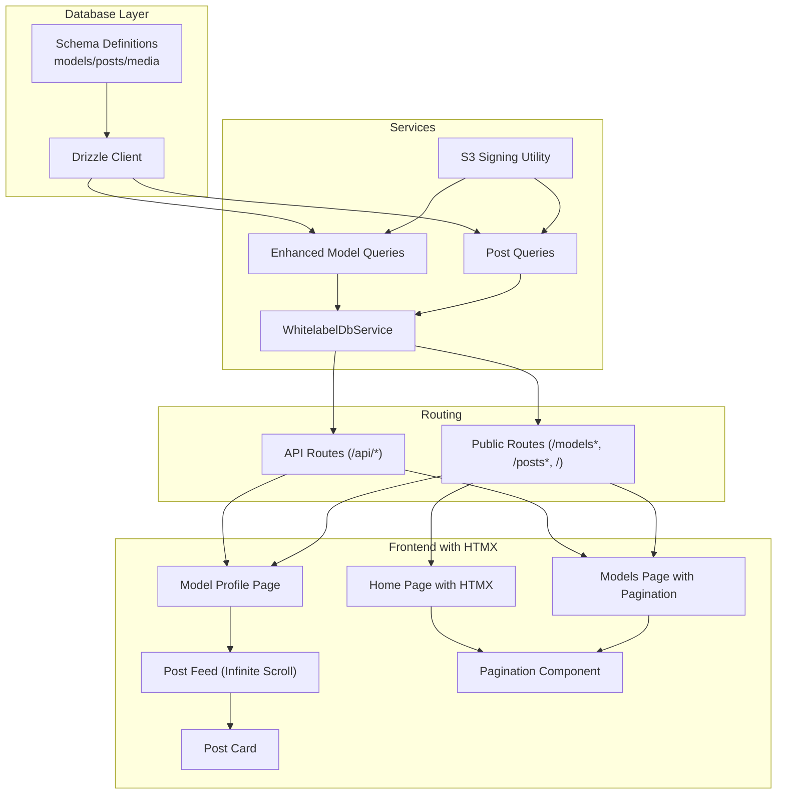
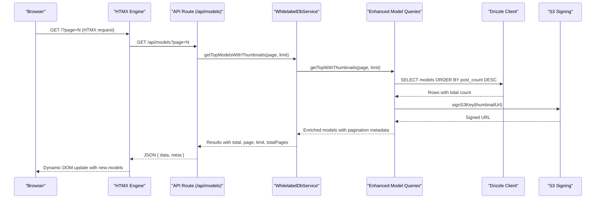
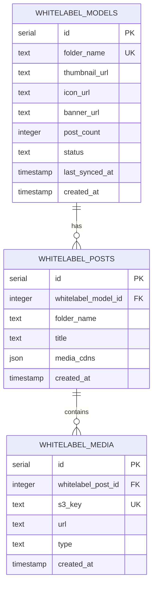
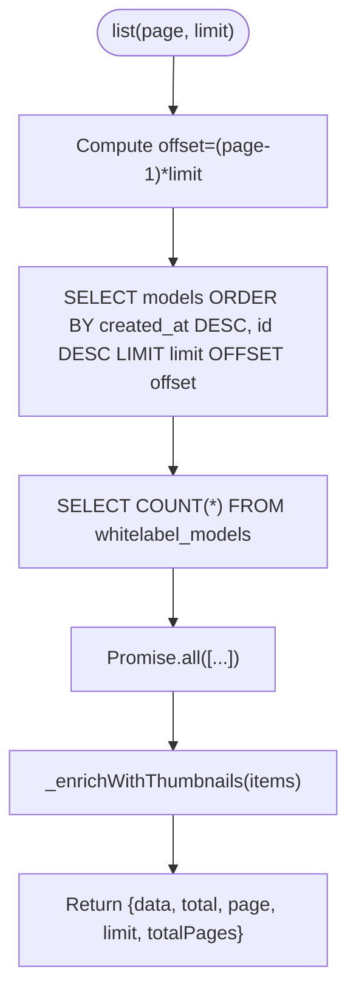
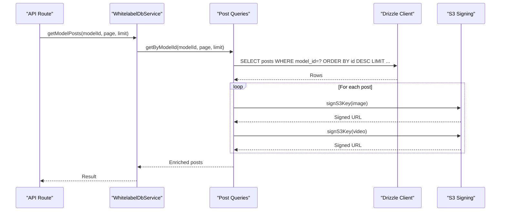
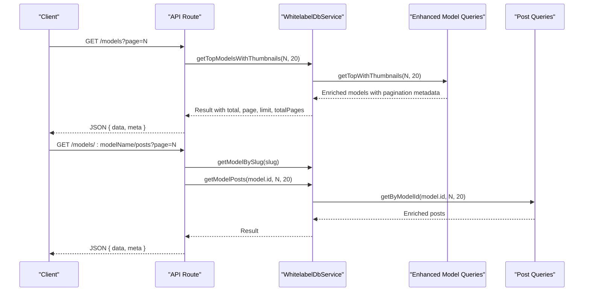
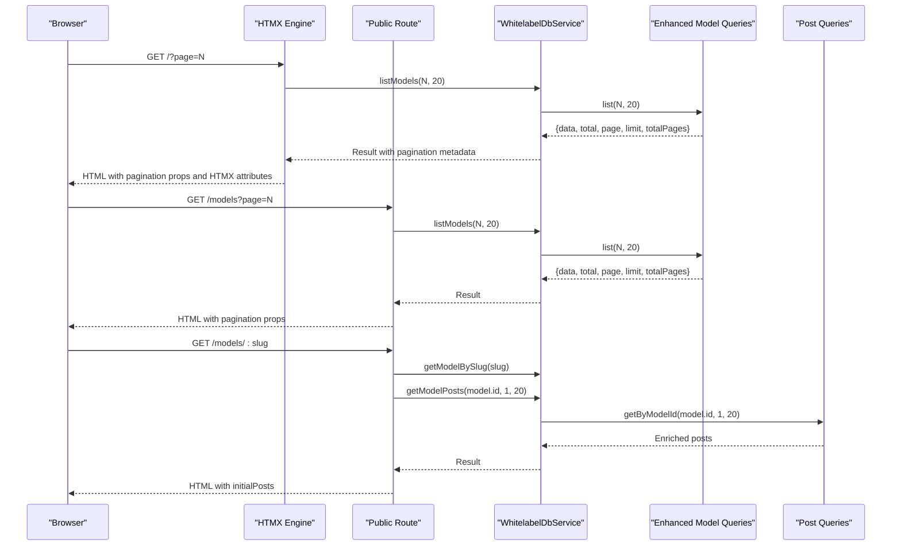
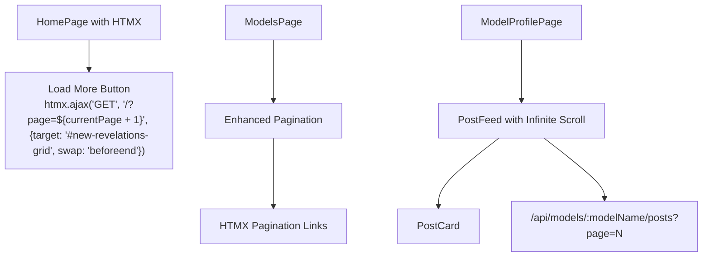
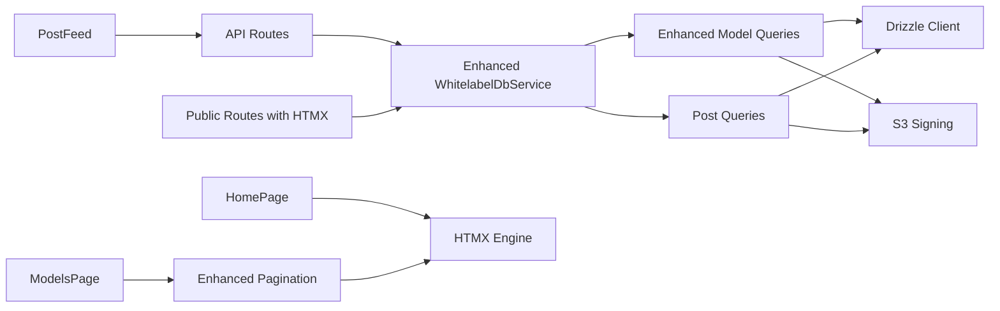

# Content Query & Retrieval

<cite>
**Referenced Files in This Document**
- [schema.ts](file://src/db/schema.ts)
- [index.ts](file://src/db/index.ts)
- [models.ts](file://src/services/whitelabel/queries/models.ts)
- [posts.ts](file://src/services/whitelabel/queries/posts.ts)
- [whitelabel.ts](file://src/services/whitelabel.ts)
- [s3.ts](file://src/services/s3.ts)
- [api.tsx](file://src/routes/api.tsx)
- [public.tsx](file://src/routes/public.tsx)
- [Models.tsx](file://src/pages/Models.tsx)
- [ModelProfile.tsx](file://src/pages/ModelProfile.tsx)
- [PostFeed.tsx](file://src/components/organisms/PostFeed.tsx)
- [PostCard.tsx](file://src/components/organisms/PostCard.tsx)
- [Pagination.tsx](file://src/components/molecules/Pagination.tsx)
- [Home.tsx](file://src/pages/Home.tsx)
- [0000_snapshot.json](file://drizzle/meta/0000_snapshot.json)
- [0001_snapshot.json](file://drizzle/meta/0001_snapshot.json)
</cite>

## Update Summary
**Changes Made**
- Enhanced documentation to reflect HTMX-based pagination support for homepage, model listings, and model profiles
- Added comprehensive model query functionality with improved pagination and total record counting
- Updated architecture diagrams to show HTMX integration patterns
- Expanded pagination metadata structure documentation
- Added HTMX-specific implementation details for seamless user experience

## Table of Contents
1. [Introduction](#introduction)
2. [Project Structure](#project-structure)
3. [Core Components](#core-components)
4. [Architecture Overview](#architecture-overview)
5. [Detailed Component Analysis](#detailed-component-analysis)
6. [HTMX-Based Pagination Implementation](#htmx-based-pagination-implementation)
7. [Dependency Analysis](#dependency-analysis)
8. [Performance Considerations](#performance-considerations)
9. [Troubleshooting Guide](#troubleshooting-guide)
10. [Conclusion](#conclusion)
11. [Appendices](#appendices)

## Introduction
This document explains the content query and retrieval services powering the whitelabel model and post discovery experience. It covers database query patterns, filtering and ordering strategies, pagination with HTMX integration, enrichment with signed media URLs, and the end-to-end flow from API endpoints to frontend rendering. The system now features comprehensive HTMX-based pagination support for seamless user experiences across homepage, model listings, and model profiles, along with enhanced model query functionality and accurate pagination calculations.

## Project Structure
The content query and retrieval pipeline spans database definitions, ORM-backed query services, API routes, and frontend pages/components with HTMX integration:
- Database schema defines whitelabel models, posts, and media entities.
- Query services encapsulate pagination, ordering, and enrichment logic with improved total record counting.
- API routes expose discovery endpoints for models and posts with pagination metadata.
- Public routes orchestrate server-side rendering with HTMX pagination support.
- Frontend components render paginated lists with HTMX-powered dynamic loading.

**Diagram sources**
- [schema.ts](file://src/db/schema.ts#L48-L103)
- [index.ts](file://src/db/index.ts#L1-L8)
- [models.ts](file://src/services/whitelabel/queries/models.ts#L6-L105)
- [posts.ts](file://src/services/whitelabel/queries/posts.ts#L6-L46)
- [s3.ts](file://src/services/s3.ts#L25-L47)
- [api.tsx](file://src/routes/api.tsx#L276-L313)
- [public.tsx](file://src/routes/public.tsx#L80-L170)
- [Home.tsx](file://src/pages/Home.tsx#L209-L226)
- [Models.tsx](file://src/pages/Models.tsx#L16-L58)
- [ModelProfile.tsx](file://src/pages/ModelProfile.tsx#L15-L51)
- [PostFeed.tsx](file://src/components/organisms/PostFeed.tsx#L10-L72)
- [PostCard.tsx](file://src/components/organisms/PostCard.tsx#L11-L117)
- [Pagination.tsx](file://src/components/molecules/Pagination.tsx#L13-L88)

**Section sources**
- [schema.ts](file://src/db/schema.ts#L1-L178)
- [index.ts](file://src/db/index.ts#L1-L8)
- [models.ts](file://src/services/whitelabel/queries/models.ts#L1-L105)
- [posts.ts](file://src/services/whitelabel/queries/posts.ts#L1-L47)
- [s3.ts](file://src/services/s3.ts#L1-L48)
- [api.tsx](file://src/routes/api.tsx#L276-L313)
- [public.tsx](file://src/routes/public.tsx#L80-L170)
- [Home.tsx](file://src/pages/Home.tsx#L1-L245)
- [Models.tsx](file://src/pages/Models.tsx#L1-L64)
- [ModelProfile.tsx](file://src/pages/ModelProfile.tsx#L1-L104)
- [PostFeed.tsx](file://src/components/organisms/PostFeed.tsx#L1-L95)
- [PostCard.tsx](file://src/components/organisms/PostCard.tsx#L1-L117)
- [Pagination.tsx](file://src/components/molecules/Pagination.tsx#L1-L88)

## Core Components
- Database schema: Defines whitelabel_models, whitelabel_posts, and whitelabel_media with foreign keys and uniqueness constraints.
- Drizzle client: Provides typed database access with enhanced pagination support.
- Model queries: Implements listing, top-ranked retrieval, slug lookup, and stats with improved pagination metadata; enriches thumbnails via S3 signing.
- Post queries: Implements paginated post retrieval per model and stats; enriches media URLs via S3 signing.
- WhitelabelDbService: Facade exposing sync and query methods with comprehensive pagination support.
- S3 signing utility: Generates short-lived signed URLs for media assets.
- API routes: Expose GET /models and GET /models/:modelName/posts with enhanced pagination metadata.
- Public routes: Server-render models list and model profile with HTMX pagination support and pagination metadata.
- Frontend components: Render paginated grids with HTMX-powered dynamic loading and infinite-scroll feeds with media cards.

**Section sources**
- [schema.ts](file://src/db/schema.ts#L48-L103)
- [index.ts](file://src/db/index.ts#L1-L8)
- [models.ts](file://src/services/whitelabel/queries/models.ts#L6-L105)
- [posts.ts](file://src/services/whitelabel/queries/posts.ts#L6-L46)
- [whitelabel.ts](file://src/services/whitelabel.ts#L5-L24)
- [s3.ts](file://src/services/s3.ts#L25-L47)
- [api.tsx](file://src/routes/api.tsx#L276-L313)
- [public.tsx](file://src/routes/public.tsx#L80-L170)
- [Home.tsx](file://src/pages/Home.tsx#L209-L226)
- [Models.tsx](file://src/pages/Models.tsx#L16-L58)
- [ModelProfile.tsx](file://src/pages/ModelProfile.tsx#L15-L51)
- [PostFeed.tsx](file://src/components/organisms/PostFeed.tsx#L10-L72)
- [PostCard.tsx](file://src/components/organisms/PostCard.tsx#L11-L117)
- [Pagination.tsx](file://src/components/molecules/Pagination.tsx#L13-L88)

## Architecture Overview
The system follows a layered architecture with HTMX integration:
- Presentation layer: Public routes render pages with HTMX support; API routes serve JSON with pagination metadata.
- Service layer: WhitelabelDbService orchestrates queries and enrichment with comprehensive pagination support.
- Data access layer: Drizzle ORM executes SQL against PostgreSQL with optimized pagination queries.
- Asset layer: S3 signing generates time-limited URLs for media.

**Diagram sources**
- [api.tsx](file://src/routes/api.tsx#L447-L468)
- [whitelabel.ts](file://src/services/whitelabel.ts#L11-L13)
- [models.ts](file://src/services/whitelabel/queries/models.ts#L59-L85)
- [s3.ts](file://src/services/s3.ts#L25-L47)
- [Home.tsx](file://src/pages/Home.tsx#L215)

**Section sources**
- [api.tsx](file://src/routes/api.tsx#L447-L468)
- [whitelabel.ts](file://src/services/whitelabel.ts#L11-L13)
- [models.ts](file://src/services/whitelabel/queries/models.ts#L59-L85)
- [s3.ts](file://src/services/s3.ts#L25-L47)
- [Home.tsx](file://src/pages/Home.tsx#L215)

## Detailed Component Analysis

### Database Schema and Relationships
The schema defines three primary tables for whitelabel content:
- whitelabel_models: Stores model metadata and counts.
- whitelabel_posts: Stores per-model posts with media references.
- whitelabel_media: Stores media entries linked to posts.

**Diagram sources**
- [schema.ts](file://src/db/schema.ts#L73-L103)
- [0000_snapshot.json](file://drizzle/meta/0000_snapshot.json#L341-L492)
- [0001_snapshot.json](file://drizzle/meta/0001_snapshot.json#L425-L576)

**Section sources**
- [schema.ts](file://src/db/schema.ts#L73-L103)
- [0000_snapshot.json](file://drizzle/meta/0000_snapshot.json#L341-L492)
- [0001_snapshot.json](file://drizzle/meta/0001_snapshot.json#L425-L576)

### Enhanced Model Queries: Comprehensive Pagination and Total Counting
- list(page, limit): Returns paginated models ordered by creation date and ID, with total count computed concurrently. Thumbnails are enriched via S3 signing.
- getTopWithThumbnails(page, limit): Returns models ordered by post_count descending, with thumbnails enriched and comprehensive pagination metadata including total, page, limit, and totalPages.
- getBySlug(slug): Fetches a single model by folder_name and signs banner/icon/thumbnail URLs.
- _enrichWithThumbnails(models): Performs a join between media and posts to find the first image per model, filters by image extensions, and signs the S3 key.

**Updated** Enhanced with improved pagination metadata structure including total record counting for accurate pagination calculations.

**Diagram sources**
- [models.ts](file://src/services/whitelabel/queries/models.ts#L36-L57)
- [models.ts](file://src/services/whitelabel/queries/models.ts#L59-L85)

**Section sources**
- [models.ts](file://src/services/whitelabel/queries/models.ts#L36-L57)
- [models.ts](file://src/services/whitelabel/queries/models.ts#L59-L85)
- [models.ts](file://src/services/whitelabel/queries/models.ts#L87-L105)
- [models.ts](file://src/services/whitelabel/queries/models.ts#L7-L34)

### Post Queries: Paginated Retrieval and Media Enrichment
- getByModelId(modelId, page, limit): Returns posts for a given model ordered by ID descending, with mediaCdns parsed and signed URLs generated for images and videos. A thumbnail is derived from the first signed image.
- getStats(): Returns counts for posts and media.

**Diagram sources**
- [posts.ts](file://src/services/whitelabel/queries/posts.ts#L7-L35)
- [s3.ts](file://src/services/s3.ts#L25-L47)

**Section sources**
- [posts.ts](file://src/services/whitelabel/queries/posts.ts#L7-L35)
- [posts.ts](file://src/services/whitelabel/queries/posts.ts#L37-L45)

### API Endpoints: Discovery and Enhanced Pagination Metadata
- GET /models: Returns top models with comprehensive pagination metadata including total count and page calculations.
- GET /models/:modelName/posts: Returns paginated posts for a model with signed media URLs.

**Updated** Enhanced pagination metadata structure with improved total record counting for accurate pagination calculations.

**Diagram sources**
- [api.tsx](file://src/routes/api.tsx#L447-L468)
- [whitelabel.ts](file://src/services/whitelabel.ts#L11-L16)

**Section sources**
- [api.tsx](file://src/routes/api.tsx#L447-L468)
- [whitelabel.ts](file://src/services/whitelabel.ts#L11-L16)

### Public Routes: Server-Side Rendering with HTMX Pagination
- GET /: Renders HomePage with HTMX pagination support and pagination metadata computed from service results.
- GET /models: Renders ModelsPage with comprehensive pagination metadata and HTMX support for dynamic loading.
- GET /models/:slug: Renders ModelProfilePage with initial posts and model metadata.

**Updated** Enhanced with HTMX-based pagination support for seamless user experience across all pages.

**Diagram sources**
- [public.tsx](file://src/routes/public.tsx#L100-L170)
- [public.tsx](file://src/routes/public.tsx#L144-L170)

**Section sources**
- [public.tsx](file://src/routes/public.tsx#L100-L170)
- [public.tsx](file://src/routes/public.tsx#L144-L170)

### Frontend Components: HTMX-Powered Pagination and Infinite Scroll
- HomePage renders with HTMX-powered "Load More" button that dynamically loads additional models using htmx.ajax with swap and target attributes.
- ModelsPage renders a grid of model cards and a Pagination component with comprehensive pagination metadata.
- ModelProfilePage renders a hero and a PostFeed with infinite scroll functionality.
- PostFeed implements infinite scroll by fetching subsequent pages from the API and appending PostCard items.
- PostCard displays media items detected by extension and falls back to a thumbnail if none are present.
- Pagination component supports both traditional pagination links and HTMX-powered navigation.

**Updated** Enhanced with HTMX integration for seamless dynamic loading and improved user experience.

**Diagram sources**
- [Home.tsx](file://src/pages/Home.tsx#L209-L226)
- [Models.tsx](file://src/pages/Models.tsx#L16-L58)
- [Pagination.tsx](file://src/components/molecules/Pagination.tsx#L13-L88)
- [ModelProfile.tsx](file://src/pages/ModelProfile.tsx#L15-L51)
- [PostFeed.tsx](file://src/components/organisms/PostFeed.tsx#L10-L72)
- [PostCard.tsx](file://src/components/organisms/PostCard.tsx#L11-L117)

**Section sources**
- [Home.tsx](file://src/pages/Home.tsx#L209-L226)
- [Models.tsx](file://src/pages/Models.tsx#L16-L58)
- [Pagination.tsx](file://src/components/molecules/Pagination.tsx#L13-L88)
- [ModelProfile.tsx](file://src/pages/ModelProfile.tsx#L15-L51)
- [PostFeed.tsx](file://src/components/organisms/PostFeed.tsx#L10-L72)
- [PostCard.tsx](file://src/components/organisms/PostCard.tsx#L11-L117)

## HTMX-Based Pagination Implementation

### Homepage HTMX Integration
The homepage features HTMX-powered pagination that allows users to dynamically load more models without full page reloads. The implementation uses htmx.ajax with specific configuration for seamless DOM manipulation.

**Key Features:**
- Dynamic model loading using `htmx.ajax('GET', '/?page=${pagination.currentPage + 1}', {target: '#new-revelations-grid', swap: 'beforeend'})`
- Automatic pagination state management with `currentPage` tracking
- Smooth DOM insertion using `swap: 'beforeend'` for efficient rendering
- Disabled button state during loading to prevent duplicate requests

### Enhanced Pagination Component
The Pagination component now supports both traditional pagination and HTMX-powered navigation with comprehensive metadata display.

**Enhanced Features:**
- Support for `nextUrl` and `prevUrl` properties for direct navigation
- Dynamic pagination metadata with `showingFrom`, `showingTo`, and `totalItems`
- HTMX-compatible URL generation with automatic page parameter handling
- Responsive pagination controls with conditional rendering based on current page state

### Models Page Pagination
The models page utilizes the enhanced Pagination component with comprehensive metadata for accurate pagination display and navigation.

**Pagination Metadata Structure:**
- `currentPage`: Current page number
- `totalPages`: Total number of pages calculated from total count
- `totalItems`: Total number of records for display
- `showingFrom`: Starting item number in current page
- `showingTo`: Ending item number in current page
- `nextUrl`/`prevUrl`: Direct navigation URLs for seamless user experience

**Section sources**
- [Home.tsx](file://src/pages/Home.tsx#L209-L226)
- [Pagination.tsx](file://src/components/molecules/Pagination.tsx#L13-L88)
- [public.tsx](file://src/routes/public.tsx#L159-L167)

## Dependency Analysis
- Services depend on Drizzle ORM and the schema definitions with enhanced pagination support.
- API and public routes depend on WhitelabelDbService with comprehensive pagination capabilities.
- Model and post queries depend on S3 signing for asset URLs with improved metadata handling.
- Frontend components depend on route-provided props, API endpoints, and HTMX for dynamic loading.

**Updated** Enhanced dependency relationships with HTMX integration for seamless user experience.

**Diagram sources**
- [api.tsx](file://src/routes/api.tsx#L276-L313)
- [public.tsx](file://src/routes/public.tsx#L80-L170)
- [whitelabel.ts](file://src/services/whitelabel.ts#L5-L24)
- [models.ts](file://src/services/whitelabel/queries/models.ts#L6-L105)
- [posts.ts](file://src/services/whitelabel/queries/posts.ts#L6-L46)
- [s3.ts](file://src/services/s3.ts#L25-L47)
- [Home.tsx](file://src/pages/Home.tsx#L209-L226)

**Section sources**
- [api.tsx](file://src/routes/api.tsx#L276-L313)
- [public.tsx](file://src/routes/public.tsx#L80-L170)
- [whitelabel.ts](file://src/services/whitelabel.ts#L5-L24)
- [models.ts](file://src/services/whitelabel/queries/models.ts#L6-L105)
- [posts.ts](file://src/services/whitelabel/queries/posts.ts#L6-L46)
- [s3.ts](file://src/services/s3.ts#L25-L47)
- [Home.tsx](file://src/pages/Home.tsx#L209-L226)

## Performance Considerations
- Query patterns:
  - Models listing and top ranking use ORDER BY with LIMIT/OFFSET; counts are fetched concurrently with improved accuracy.
  - Post retrieval per model uses ORDER BY id DESC with LIMIT/OFFSET.
  - Thumbnail enrichment performs a DISTINCT ON join to pick one image per model, filtered by type and extension.
- Indexing recommendations:
  - Add an index on whitelabel_models(folder_name) to accelerate getBySlug.
  - Add an index on whitelabel_posts(whitelabel_model_id, id) to optimize post pagination per model.
  - Add an index on whitelabel_media(whitelabel_post_id, type) to speed up media joins.
  - Consider partial indexes for media type filtering if applicable.
- Caching strategies:
  - Cache top models and model profiles for short TTLs to reduce repeated S3 signing and DB load.
  - Cache post lists per model with ETag/Last-Modified headers for CDN-friendly invalidation.
  - Use CDN for signed URLs where feasible to reduce origin requests.
  - Implement HTMX cache control for dynamic content to improve perceived performance.
- Query execution plans:
  - Use EXPLAIN/EXPLAIN ANALYZE to inspect plans for ORDER BY + LIMIT/OFFSET queries.
  - Ensure appropriate statistics are maintained for accurate planner estimates.
- Data access patterns:
  - Batch S3 signing via Promise.all to minimize latency.
  - Avoid N+1 queries by pre-fetching related media in a single join.
  - Optimize HTMX requests with appropriate caching headers for dynamic content.

**Updated** Enhanced with HTMX-specific performance considerations and caching strategies.

[No sources needed since this section provides general guidance]

## Troubleshooting Guide
- Empty or missing thumbnails:
  - Verify media entries exist for the model and filter conditions match image extensions.
  - Confirm S3 signing succeeds and returns non-null URLs.
- Pagination inconsistencies:
  - Ensure page and limit parameters are validated and defaulted.
  - Confirm total count matches actual rows after concurrent counting.
  - Verify HTMX pagination metadata is correctly calculated and passed to frontend components.
- Infinite scroll not loading:
  - Check API endpoint availability and response format.
  - Inspect console logs for fetch errors and ensure mediaCdns parsing handles both string and object forms.
  - Verify HTMX event listeners are properly attached and functioning.
- Slug not found:
  - Confirm folder_name uniqueness and correct casing.
  - Validate getBySlug query and S3 signing for banner/icon/thumbnail.
- HTMX pagination issues:
  - Check HTMX configuration and ensure proper target elements exist in the DOM.
  - Verify pagination metadata is correctly structured and passed to HTMX components.
  - Ensure swap and target attributes are properly configured for dynamic DOM manipulation.

**Updated** Enhanced troubleshooting guide with HTMX-specific issues and solutions.

**Section sources**
- [models.ts](file://src/services/whitelabel/queries/models.ts#L7-L34)
- [posts.ts](file://src/services/whitelabel/queries/posts.ts#L16-L32)
- [PostFeed.tsx](file://src/components/organisms/PostFeed.tsx#L48-L72)
- [api.tsx](file://src/routes/api.tsx#L296-L313)
- [Home.tsx](file://src/pages/Home.tsx#L209-L226)

## Conclusion
The content query and retrieval system combines straightforward SQL patterns with targeted enrichment to deliver a responsive model and post browsing experience. With the addition of HTMX-based pagination support, the system now provides seamless user experiences across homepage, model listings, and model profiles. The enhanced model query functionality with improved pagination and total record counting ensures accurate pagination calculations and optimal user experience. By leveraging concurrent counting, S3-signed URLs, and HTMX-powered dynamic loading, it balances UX performance with scalable data access. Applying recommended indexing and caching strategies will further improve throughput and reduce latency.

**Updated** Enhanced conclusion reflecting the comprehensive HTMX integration and improved pagination capabilities.

[No sources needed since this section summarizes without analyzing specific files]

## Appendices

### API Definitions
- GET /models
  - Query parameters: page (default 1)
  - Response: { data: Model[], meta: { page, limit, count, totalPages } }
- GET /models/:modelName/posts
  - Path parameter: modelName
  - Query parameters: page (default 1)
  - Response: { data: Post[], meta: { page, limit, count } }

**Updated** Enhanced pagination metadata structure with improved total record counting.

**Section sources**
- [api.tsx](file://src/routes/api.tsx#L447-L468)

### Common Query Scenarios and Filtering Options
- List newest models: ORDER BY created_at DESC, LIMIT/OFFSET with concurrent COUNT.
- List top models by post count: ORDER BY post_count DESC, LIMIT/OFFSET with comprehensive pagination metadata.
- Retrieve posts for a model: WHERE whitelabel_model_id = ?, ORDER BY id DESC.
- Enrich thumbnails: JOIN whitelabel_media ON post.id = media.whitelabel_post_id, filter by type and extension, DISTINCT ON model.
- HTMX-powered dynamic loading: Use htmx.ajax with target and swap configuration for seamless DOM updates.

**Updated** Enhanced with HTMX-specific query scenarios and dynamic loading patterns.

**Section sources**
- [models.ts](file://src/services/whitelabel/queries/models.ts#L36-L57)
- [models.ts](file://src/services/whitelabel/queries/models.ts#L59-L85)
- [models.ts](file://src/services/whitelabel/queries/models.ts#L7-L34)
- [posts.ts](file://src/services/whitelabel/queries/posts.ts#L7-L14)
- [Home.tsx](file://src/pages/Home.tsx#L209-L226)

### Result Formatting
- Models: id, folderName/name, postCount, thumbnailUrl (signed), with comprehensive pagination metadata.
- Posts: id, folderName/title, mediaCdns with signed images/videos, thumbnail derived from first image.
- Pagination metadata: page, limit, total, totalPages, showingFrom, showingTo, nextUrl, prevUrl.

**Updated** Enhanced result formatting with comprehensive pagination metadata structure.

**Section sources**
- [models.ts](file://src/services/whitelabel/queries/models.ts#L62-L85)
- [posts.ts](file://src/services/whitelabel/queries/posts.ts#L16-L32)
- [public.tsx](file://src/routes/public.tsx#L159-L167)

### HTMX Integration Patterns
- Dynamic content loading: `htmx.ajax('GET', '/?page=${currentPage + 1}', {target: '#new-revelations-grid', swap: 'beforeend'})`
- Pagination metadata: `{currentPage, totalPages, hasNextPage, totalItems, showingFrom, showingTo}`
- Seamless DOM manipulation: Automatic target element updates without full page reloads
- Event-driven pagination: HTMX-powered navigation with proper state management

**Section sources**
- [Home.tsx](file://src/pages/Home.tsx#L209-L226)
- [Pagination.tsx](file://src/components/molecules/Pagination.tsx#L13-L88)