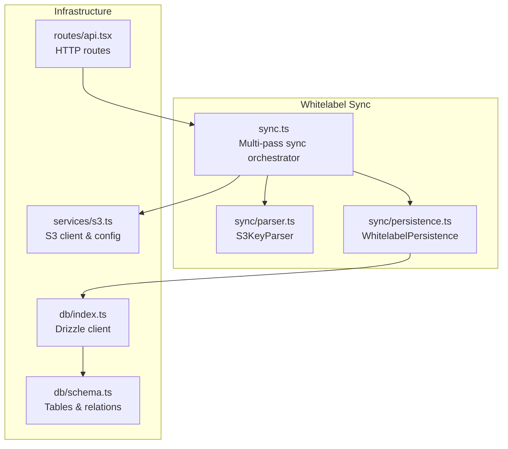
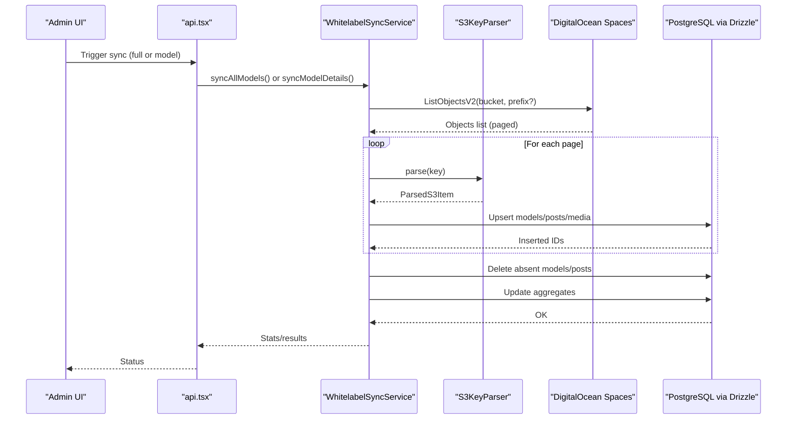
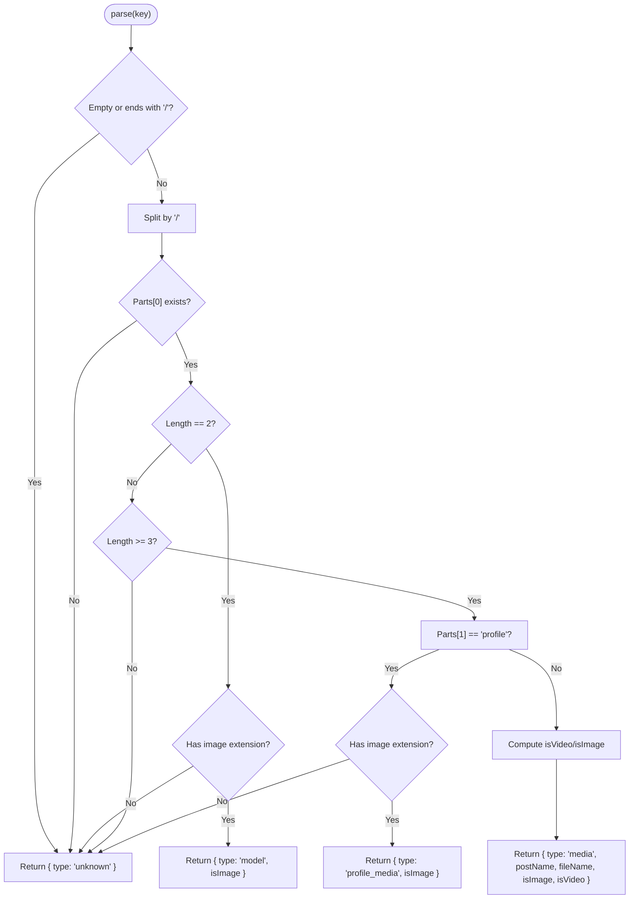
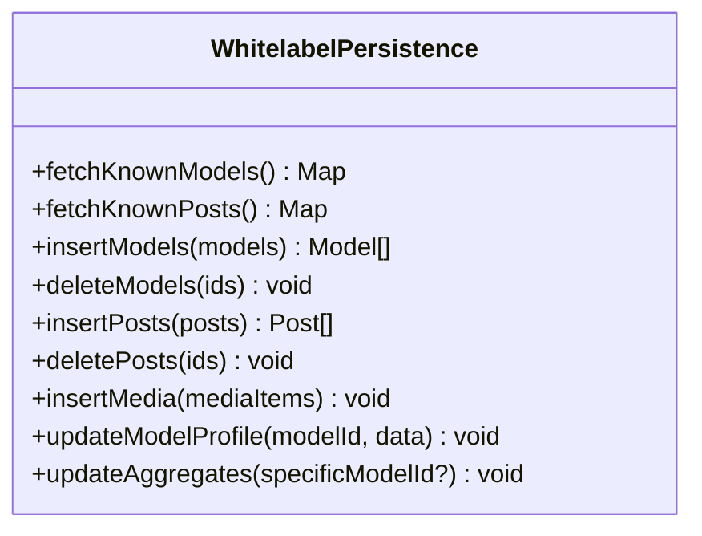
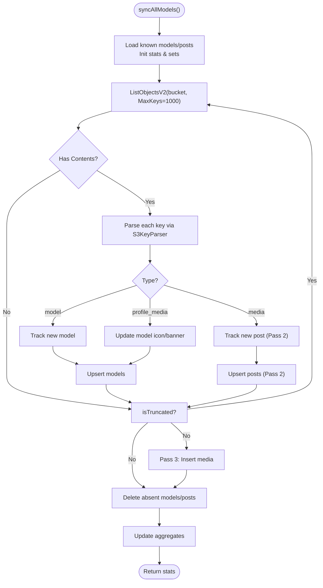
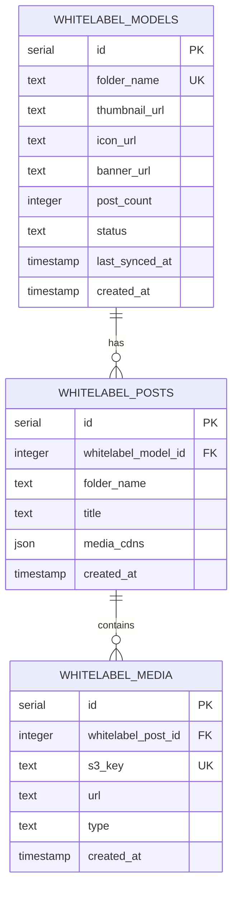
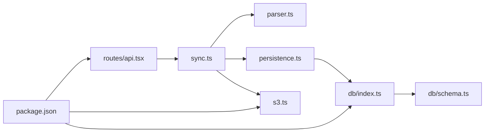

# Content Synchronization Engine

<cite>
**Referenced Files in This Document**
- [sync.ts](file://src/services/whitelabel/sync.ts)
- [parser.ts](file://src/services/whitelabel/sync/parser.ts)
- [persistence.ts](file://src/services/whitelabel/sync/persistence.ts)
- [schema.ts](file://src/db/schema.ts)
- [index.ts](file://src/db/index.ts)
- [s3.ts](file://src/services/s3.ts)
- [api.tsx](file://src/routes/api.tsx)
- [package.json](file://package.json)
- [README.md](file://README.md)
</cite>

## Table of Contents
1. [Introduction](#introduction)
2. [Project Structure](#project-structure)
3. [Core Components](#core-components)
4. [Architecture Overview](#architecture-overview)
5. [Detailed Component Analysis](#detailed-component-analysis)
6. [Dependency Analysis](#dependency-analysis)
7. [Performance Considerations](#performance-considerations)
8. [Troubleshooting Guide](#troubleshooting-guide)
9. [Conclusion](#conclusion)
10. [Appendices](#appendices)

## Introduction
This document describes the multi-pass content synchronization engine that ingests media assets from DigitalOcean Spaces (S3-compatible), parses hierarchical S3 keys into models, posts, and media items, and persists normalized records into a PostgreSQL database via Drizzle ORM. It explains the three-pass synchronization algorithm, content parsing rules, database persistence strategies, conflict resolution, incremental updates, and operational aspects such as triggers, scheduling, and monitoring.

## Project Structure
The synchronization system resides under the whitelabel module and integrates with S3, database schema, and HTTP routes.

**Diagram sources**
- [sync.ts](file://src/services/whitelabel/sync.ts#L1-L334)
- [parser.ts](file://src/services/whitelabel/sync/parser.ts#L1-L59)
- [persistence.ts](file://src/services/whitelabel/sync/persistence.ts#L1-L94)
- [s3.ts](file://src/services/s3.ts#L1-L48)
- [index.ts](file://src/db/index.ts#L1-L8)
- [schema.ts](file://src/db/schema.ts#L73-L103)
- [api.tsx](file://src/routes/api.tsx#L1-L519)

**Section sources**
- [sync.ts](file://src/services/whitelabel/sync.ts#L1-L334)
- [parser.ts](file://src/services/whitelabel/sync/parser.ts#L1-L59)
- [persistence.ts](file://src/services/whitelabel/sync/persistence.ts#L1-L94)
- [s3.ts](file://src/services/s3.ts#L1-L48)
- [index.ts](file://src/db/index.ts#L1-L8)
- [schema.ts](file://src/db/schema.ts#L73-L103)
- [api.tsx](file://src/routes/api.tsx#L1-L519)
- [README.md](file://README.md#L1-L49)

## Core Components
- S3KeyParser: Parses S3 object keys into structured types (model, post, media, profile media) and infers media type.
- WhitelabelPersistence: Encapsulates database reads/writes for models, posts, and media with conflict handling and aggregate updates.
- WhitelabelSyncService: Orchestrates multi-pass synchronization against S3, tracks deletions, and updates aggregates.

Key responsibilities:
- Multi-pass processing to resolve dependencies (models before posts, posts before media).
- Conflict-free inserts using upsert-like semantics.
- Incremental deletion detection based on observed S3 keys.
- Aggregate recomputation for post counts and media CDNs per post.

**Section sources**
- [parser.ts](file://src/services/whitelabel/sync/parser.ts#L10-L59)
- [persistence.ts](file://src/services/whitelabel/sync/persistence.ts#L5-L94)
- [sync.ts](file://src/services/whitelabel/sync.ts#L6-L197)

## Architecture Overview
The system follows a pipeline: S3 listing → parsing → persistence → aggregation. It supports two entry points:
- Full sync across all models.
- Prefix-based sync for a specific model folder.

**Diagram sources**
- [api.tsx](file://src/routes/api.tsx#L251-L273)
- [sync.ts](file://src/services/whitelabel/sync.ts#L7-L197)
- [parser.ts](file://src/services/whitelabel/sync/parser.ts#L10-L59)
- [persistence.ts](file://src/services/whitelabel/sync/persistence.ts#L5-L94)
- [s3.ts](file://src/services/s3.ts#L1-L48)

## Detailed Component Analysis

### S3KeyParser
Responsibilities:
- Detects model-level images (single-level key).
- Detects profile media under a special "profile" subfolder.
- Detects post media under "ModelName/PostName/*".
- Infers image vs video by extension.
- Returns a discriminated union of types with optional metadata.

Implementation highlights:
- Guard clause for empty or trailing slash keys.
- Two major branches: single-level (model thumbnails) and multi-level (posts/profile media).
- Uses regex-based extension checks to classify media.

**Diagram sources**
- [parser.ts](file://src/services/whitelabel/sync/parser.ts#L10-L59)

**Section sources**
- [parser.ts](file://src/services/whitelabel/sync/parser.ts#L10-L59)

### WhitelabelPersistence
Responsibilities:
- Fetch existing models and posts to build lookup maps.
- Insert models and posts with conflict-free semantics.
- Insert media with conflict-aware upsert on S3 key.
- Update model and post aggregates.

Notable behaviors:
- fetchKnownModels: returns Map<folderName, id>.
- fetchKnownPosts: returns Map<"modelId:folderName", id>.
- insertModels/onConflictDoNothing: avoids duplicates.
- insertPosts/onConflictDoNothing: avoids duplicates.
- insertMedia/onConflictDoUpdate(target: s3Key): updates URL if key conflicts.
- updateModelProfile: sets iconUrl/bannerUrl for a model.
- updateAggregates: recomputes post_count and mediaCdns JSON per post.

**Diagram sources**
- [persistence.ts](file://src/services/whitelabel/sync/persistence.ts#L5-L94)

**Section sources**
- [persistence.ts](file://src/services/whitelabel/sync/persistence.ts#L5-L94)

### WhitelabelSyncService
Responsibilities:
- Full synchronization across all S3 objects with pagination.
- Prefix-based synchronization for a specific model.
- Multi-pass processing:
  - Pass 1: Discover and insert new models.
  - Pass 2: Discover and insert new posts (requires model IDs).
  - Pass 3: Insert media and update profile banners/icons.
- Deletion detection:
  - Models: delete models whose folder names are not present in current listing.
  - Posts: delete posts whose keys were not seen during the run.
- Aggregate recomputation after deletions.

Entry points:
- syncAllModels(): full scan with pagination.
- syncModelDetails(folderName): prefix-based sync ensuring model existence.
- _syncPrefix(prefix): internal reusable logic.

**Diagram sources**
- [sync.ts](file://src/services/whitelabel/sync.ts#L7-L197)
- [parser.ts](file://src/services/whitelabel/sync/parser.ts#L10-L59)
- [persistence.ts](file://src/services/whitelabel/sync/persistence.ts#L5-L94)

**Section sources**
- [sync.ts](file://src/services/whitelabel/sync.ts#L6-L197)

### Database Schema and Relations
The whitelabel tables and relations define the persistence model for models, posts, and media.

**Diagram sources**
- [schema.ts](file://src/db/schema.ts#L73-L103)

**Section sources**
- [schema.ts](file://src/db/schema.ts#L73-L103)

### HTTP Integration and Triggers
- Admin route triggers synchronization for all models or a specific model.
- The API endpoints call into the sync service and return results to the admin UI.

Operational notes:
- The admin route for activation invokes the sync service and reports processed counts.
- The API routes are defined in the Hono router and expose endpoints for models and posts.

**Section sources**
- [api.tsx](file://src/routes/api.tsx#L251-L273)

## Dependency Analysis
External dependencies and integrations:
- AWS SDK for S3-compatible storage (DigitalOcean Spaces).
- Drizzle ORM for PostgreSQL operations.
- Hono for HTTP routing.

**Diagram sources**
- [sync.ts](file://src/services/whitelabel/sync.ts#L1-L5)
- [parser.ts](file://src/services/whitelabel/sync/parser.ts#L1-L59)
- [persistence.ts](file://src/services/whitelabel/sync/persistence.ts#L1-L94)
- [s3.ts](file://src/services/s3.ts#L1-L48)
- [index.ts](file://src/db/index.ts#L1-L8)
- [schema.ts](file://src/db/schema.ts#L1-L178)
- [api.tsx](file://src/routes/api.tsx#L1-L519)
- [package.json](file://package.json#L1-L23)

**Section sources**
- [package.json](file://package.json#L1-L23)
- [s3.ts](file://src/services/s3.ts#L1-L48)
- [index.ts](file://src/db/index.ts#L1-L8)
- [schema.ts](file://src/db/schema.ts#L1-L178)
- [api.tsx](file://src/routes/api.tsx#L1-L519)

## Performance Considerations
- Pagination: The sync iterates pages of S3 objects with a fixed page size, reducing memory pressure.
- Multi-pass design: Ensures referential integrity by resolving model IDs before inserting posts and media.
- Upsert semantics: Uses conflict-free insert patterns to avoid redundant writes.
- Batched media insertion: Media items are accumulated and inserted in bulk per page.
- Aggregate recomputation: Updates are performed after deletions to keep counters accurate.
- CDN URL construction: Builds CDN URLs directly from S3 keys to avoid extra lookups.

Recommendations:
- Tune page size (currently 1000) based on S3 latency and memory constraints.
- Consider chunking media inserts if batches grow large.
- Add retry/backoff for transient S3 errors.
- Monitor Drizzle query durations and consider indexing on frequently filtered columns.

[No sources needed since this section provides general guidance]

## Troubleshooting Guide
Common issues and resolutions:
- Missing model IDs during post/media insertion: Ensure Pass 1 completes successfully so model IDs are populated before Pass 2/3.
- Duplicate entries: The persistence layer uses conflict-free inserts; verify that unique constraints are respected.
- Deleted content not reflected: Confirm that deletion detection runs and that aggregates are updated afterward.
- S3 connectivity: Verify credentials and endpoint configuration; ensure bucket name is correct.
- Database connectivity: Confirm DATABASE_URL and connection parameters.

Operational tips:
- Use the admin route to trigger targeted syncs for specific models.
- Inspect logs from the API endpoints for error messages.
- Validate S3 key patterns match expectations of the parser.

**Section sources**
- [sync.ts](file://src/services/whitelabel/sync.ts#L7-L197)
- [persistence.ts](file://src/services/whitelabel/sync/persistence.ts#L5-L94)
- [s3.ts](file://src/services/s3.ts#L4-L19)
- [api.tsx](file://src/routes/api.tsx#L251-L273)

## Conclusion
The multi-pass synchronization engine provides a robust, incremental pipeline to align S3 content with the database. Its design ensures referential integrity, handles deletions, and maintains aggregates. With clear separation of concerns—parsing, persistence, and orchestration—the system is maintainable and extensible.

[No sources needed since this section summarizes without analyzing specific files]

## Appendices

### Synchronization Triggers and Scheduling
- Manual trigger: Admin activation route initiates sync for all or a specific model.
- Scheduling: No built-in scheduler is present in the repository; consider integrating a cron job or task queue to automate periodic syncs.

**Section sources**
- [api.tsx](file://src/routes/api.tsx#L251-L273)
- [README.md](file://README.md#L1-L49)

### Monitoring Workflows
- Admin dashboard UI includes a section for recent activity/logs; integrate sync results and errors into this area for visibility.
- Consider adding metrics endpoints or logging to track sync duration, inserted/updated/deleted counts, and error rates.

**Section sources**
- [api.tsx](file://src/routes/api.tsx#L251-L273)