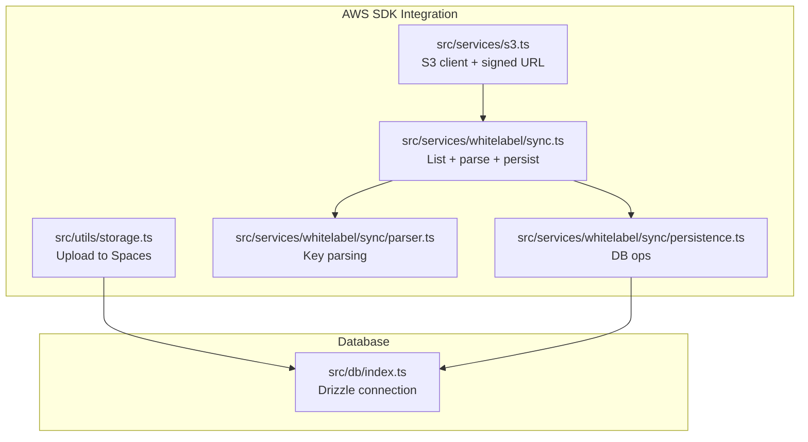
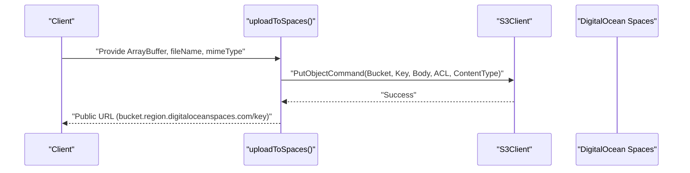
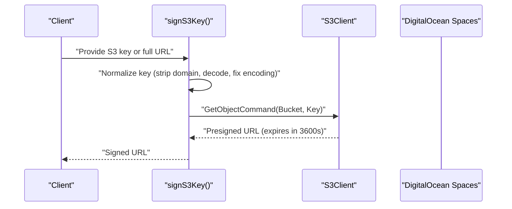
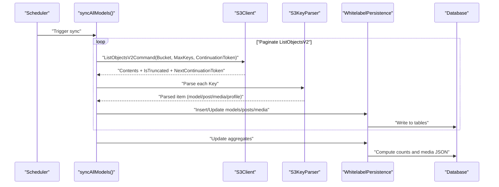
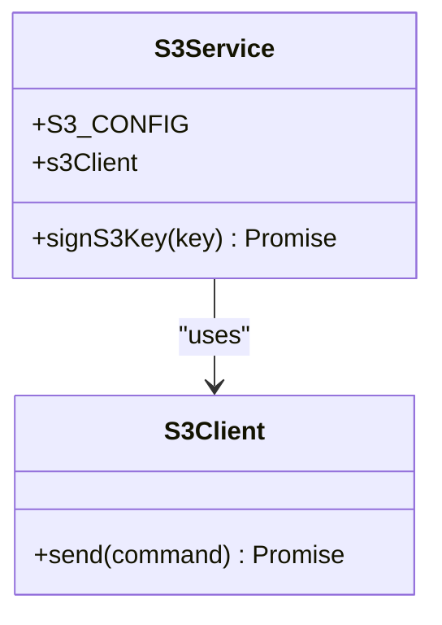
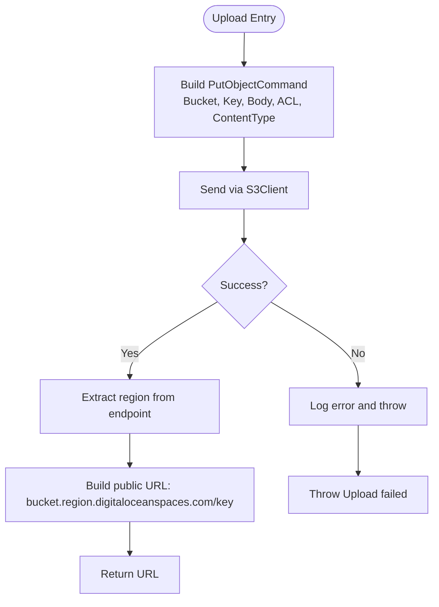
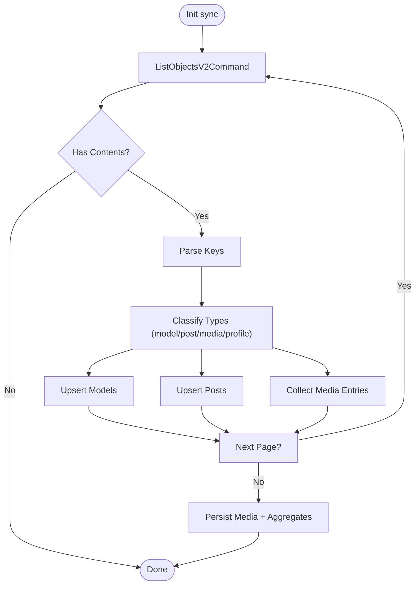
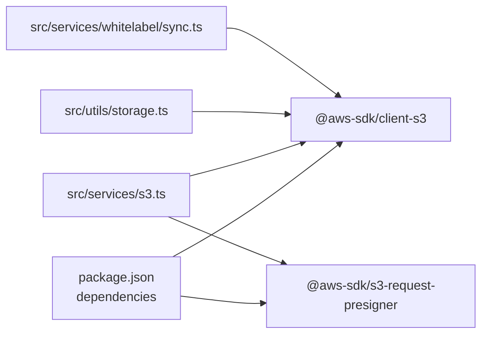

# S3 Integration & Storage

<cite>
**Referenced Files in This Document**
- [README.md](file://README.md)
- [package.json](file://package.json)
- [src/services/s3.ts](file://src/services/s3.ts)
- [src/utils/storage.ts](file://src/utils/storage.ts)
- [src/services/whitelabel/sync.ts](file://src/services/whitelabel/sync.ts)
- [src/services/whitelabel/sync/parser.ts](file://src/services/whitelabel/sync/parser.ts)
- [src/services/whitelabel/sync/persistence.ts](file://src/services/whitelabel/sync/persistence.ts)
- [src/db/index.ts](file://src/db/index.ts)
</cite>

## Table of Contents
1. [Introduction](#introduction)
2. [Project Structure](#project-structure)
3. [Core Components](#core-components)
4. [Architecture Overview](#architecture-overview)
5. [Detailed Component Analysis](#detailed-component-analysis)
6. [Dependency Analysis](#dependency-analysis)
7. [Performance Considerations](#performance-considerations)
8. [Troubleshooting Guide](#troubleshooting-guide)
9. [Conclusion](#conclusion)
10. [Appendices](#appendices)

## Introduction
This document explains how DigitalOcean Spaces (S3-compatible storage) is integrated into the project. It covers AWS SDK configuration, bucket operations, media upload and download workflows, presigned URLs, CDN integration, authentication, CORS considerations, security best practices, error handling, retry strategies, and performance optimization for large media assets. The implementation leverages two distinct modules:
- A generic S3 service module for signed URL generation and bucket access.
- A storage utility module for uploading files to Spaces with public URLs.

Additionally, a whitelabel synchronization service demonstrates how to enumerate bucket contents, parse keys, and persist metadata into the local database.

## Project Structure
The S3 integration spans several modules:
- AWS SDK clients and helpers for S3 operations
- Utilities for uploading media to Spaces
- A synchronization service that lists bucket objects and persists metadata
- Parser and persistence utilities for organizing S3 keys into models, posts, and media
- Database connection for persistence

**Diagram sources**
- [src/services/s3.ts](file://src/services/s3.ts#L1-L47)
- [src/utils/storage.ts](file://src/utils/storage.ts#L1-L39)
- [src/services/whitelabel/sync.ts](file://src/services/whitelabel/sync.ts#L1-L197)
- [src/services/whitelabel/sync/parser.ts](file://src/services/whitelabel/sync/parser.ts#L1-L59)
- [src/services/whitelabel/sync/persistence.ts](file://src/services/whitelabel/sync/persistence.ts#L1-L94)
- [src/db/index.ts](file://src/db/index.ts#L1-L8)

**Section sources**
- [README.md](file://README.md#L1-L49)
- [package.json](file://package.json#L1-L23)

## Core Components
- S3 client and configuration for DigitalOcean Spaces
- Presigned URL generator for secure, time-limited access
- Upload utility for media to Spaces with public URL construction
- Whitelabel synchronization pipeline for listing bucket objects, parsing keys, and persisting metadata

Key responsibilities:
- S3 client initialization with region, endpoint, and credentials
- Signed URL creation for private objects with configurable expiry
- Public upload with ACL and content-type handling
- Listing bucket objects, parsing hierarchical keys, and updating aggregates

**Section sources**
- [src/services/s3.ts](file://src/services/s3.ts#L4-L19)
- [src/services/s3.ts](file://src/services/s3.ts#L25-L47)
- [src/utils/storage.ts](file://src/utils/storage.ts#L9-L38)
- [src/services/whitelabel/sync.ts](file://src/services/whitelabel/sync.ts#L1-L197)

## Architecture Overview
The system integrates three primary flows:
- Upload flow: Client-side or server-side buffers are uploaded to Spaces via PutObjectCommand, returning a public URL.
- Download flow: Objects are accessed directly via public URLs or via signed URLs generated on-demand.
- Sync flow: The system lists bucket objects, parses keys into models/posts/media, and persists metadata to the database.

**Diagram sources**
- [src/utils/storage.ts](file://src/utils/storage.ts#L18-L33)

**Diagram sources**
- [src/services/s3.ts](file://src/services/s3.ts#L25-L42)

**Diagram sources**
- [src/services/whitelabel/sync.ts](file://src/services/whitelabel/sync.ts#L6-L197)
- [src/services/whitelabel/sync/parser.ts](file://src/services/whitelabel/sync/parser.ts#L10-L58)
- [src/services/whitelabel/sync/persistence.ts](file://src/services/whitelabel/sync/persistence.ts#L5-L94)

## Detailed Component Analysis

### S3 Service Module
Responsibilities:
- Centralized S3 configuration for DigitalOcean Spaces
- Client initialization with region, endpoint, credentials, and path-style settings
- Presigned URL generation for secure access with 1-hour expiry

Implementation highlights:
- Configuration object defines region, endpoint, credentials, and bucket
- Client uses path-style access disabled (virtual-hosted style)
- Signed URL normalization handles full URLs, decoding, and special character fixes

**Diagram sources**
- [src/services/s3.ts](file://src/services/s3.ts#L4-L19)
- [src/services/s3.ts](file://src/services/s3.ts#L25-L47)

**Section sources**
- [src/services/s3.ts](file://src/services/s3.ts#L4-L19)
- [src/services/s3.ts](file://src/services/s3.ts#L25-L47)

### Storage Utility Module
Responsibilities:
- Upload media to Spaces with public-read ACL
- Construct public URLs using bucket and region extracted from endpoint
- Environment-driven configuration for endpoint, credentials, and bucket

Implementation highlights:
- Uses PutObjectCommand with explicit ACL and content type
- Builds public URL using bucket name and region derived from endpoint
- Error logging and rethrow on failure

**Diagram sources**
- [src/utils/storage.ts](file://src/utils/storage.ts#L18-L33)

**Section sources**
- [src/utils/storage.ts](file://src/utils/storage.ts#L9-L16)
- [src/utils/storage.ts](file://src/utils/storage.ts#L18-L38)

### Whitelabel Synchronization Pipeline
Responsibilities:
- Enumerate bucket objects with pagination
- Parse S3 keys into models, posts, and media
- Persist metadata to the database and compute aggregates

Key steps:
- Paginate using ListObjectsV2Command with MaxKeys and continuation tokens
- Parse keys into structured types (model, post, media, profile media)
- Insert or update models and posts, then insert media entries
- Update model and post aggregates (counts and media JSON)

**Diagram sources**
- [src/services/whitelabel/sync.ts](file://src/services/whitelabel/sync.ts#L19-L152)
- [src/services/whitelabel/sync/parser.ts](file://src/services/whitelabel/sync/parser.ts#L10-L58)
- [src/services/whitelabel/sync/persistence.ts](file://src/services/whitelabel/sync/persistence.ts#L17-L92)

**Section sources**
- [src/services/whitelabel/sync.ts](file://src/services/whitelabel/sync.ts#L1-L197)
- [src/services/whitelabel/sync/parser.ts](file://src/services/whitelabel/sync/parser.ts#L1-L59)
- [src/services/whitelabel/sync/persistence.ts](file://src/services/whitelabel/sync/persistence.ts#L1-L94)

### Database Integration
Responsibilities:
- Provide a Drizzle ORM connection to PostgreSQL
- Used by the persistence layer to upsert models/posts and update aggregates

Integration points:
- Connection string sourced from environment variable
- Used by persistence module for inserts, updates, and aggregate computations

**Section sources**
- [src/db/index.ts](file://src/db/index.ts#L1-L8)
- [src/services/whitelabel/sync/persistence.ts](file://src/services/whitelabel/sync/persistence.ts#L1-L94)

## Dependency Analysis
External dependencies relevant to S3 integration:
- @aws-sdk/client-s3 for S3 operations
- @aws-sdk/s3-request-presigner for generating signed URLs

**Diagram sources**
- [package.json](file://package.json#L8-L10)
- [src/services/s3.ts](file://src/services/s3.ts#L1-L2)
- [src/utils/storage.ts](file://src/utils/storage.ts#L1)
- [src/services/whitelabel/sync.ts](file://src/services/whitelabel/sync.ts#L1)

**Section sources**
- [package.json](file://package.json#L8-L10)
- [src/services/s3.ts](file://src/services/s3.ts#L1-L2)
- [src/utils/storage.ts](file://src/utils/storage.ts#L1)
- [src/services/whitelabel/sync.ts](file://src/services/whitelabel/sync.ts#L1)

## Performance Considerations
- Upload throughput: For large media files, consider multipart uploads to improve reliability and speed. The current upload utility uses a single PutObjectCommand; multipart uploads are not implemented in the referenced code.
- CDN acceleration: The sync pipeline constructs CDN URLs for profile and media assets, enabling global distribution and reduced latency.
- Pagination: The sync pipeline paginates with MaxKeys and continuation tokens to handle large buckets efficiently.
- Content encoding: Normalize and encode keys to avoid special characters and ensure compatibility with CDNs.
- Caching: Store computed aggregates and metadata in the database to minimize repeated S3 listings and parsing.

[No sources needed since this section provides general guidance]

## Troubleshooting Guide
Common issues and remedies:
- Authentication failures: Verify endpoint, region, and credentials. Ensure environment variables are set for production deployments.
- URL construction errors: Confirm bucket name and region extraction logic aligns with the configured endpoint.
- Signed URL failures: Validate key normalization and ensure the object exists in the bucket.
- Large bucket enumeration: Use pagination and limit page sizes to avoid timeouts.
- Upload failures: Inspect error logs and confirm ACL and content-type settings.

Operational references:
- S3 service error logging during signed URL generation
- Storage utility error logging and thrown error on upload failure
- Sync pipeline robustness with pagination and classification

**Section sources**
- [src/services/s3.ts](file://src/services/s3.ts#L43-L46)
- [src/utils/storage.ts](file://src/utils/storage.ts#L34-L37)
- [src/services/whitelabel/sync.ts](file://src/services/whitelabel/sync.ts#L19-L152)

## Conclusion
The project integrates DigitalOcean Spaces using the AWS SDK with two complementary modules: a generic S3 service for signed URLs and a storage utility for public uploads. A whitelabel synchronization pipeline enumerates bucket objects, parses keys, and persists metadata to the database. While the current implementation focuses on basic uploads and signed URLs, adopting multipart uploads, CDN-backed URLs, and robust error handling/retry strategies will further enhance scalability and reliability for large media workloads.

[No sources needed since this section summarizes without analyzing specific files]

## Appendices

### Authentication Methods
- Static credentials in code (development only)
- Environment variables for production (endpoint, access key, secret key, bucket)

Security note: Hardcoded credentials are present in the S3 service configuration. Replace with environment variables and secure secret management in production.

**Section sources**
- [src/services/s3.ts](file://src/services/s3.ts#L4-L12)
- [src/utils/storage.ts](file://src/utils/storage.ts#L3-L7)

### CORS Configuration
- Configure CORS at the Spaces bucket level to allow cross-origin requests from your frontend origin.
- Ensure allowed methods, headers, and origins match your deployment requirements.

[No sources needed since this section provides general guidance]

### Security Best Practices
- Use signed URLs for private assets with minimal expiry windows.
- Store credentials in environment variables and restrict IAM permissions.
- Enable server-side encryption and versioning at the bucket level.
- Sanitize and validate S3 keys to prevent injection or unauthorized access.

[No sources needed since this section provides general guidance]

### Multipart Uploads
- Recommended for large files to improve resilience and performance.
- Not implemented in the referenced code; consider adding multipart upload commands and completion logic.

[No sources needed since this section provides general guidance]

### Presigned URLs
- Generated with a fixed 1-hour expiry for secure, time-limited access.
- Normalize keys to handle full URLs and special characters.

**Section sources**
- [src/services/s3.ts](file://src/services/s3.ts#L25-L42)

### CDN Integration
- Construct CDN URLs for profile and media assets using bucket and region.
- Use CDN domains for improved global delivery and reduced origin load.

**Section sources**
- [src/services/whitelabel/sync.ts](file://src/services/whitelabel/sync.ts#L117-L142)

### Error Handling and Retry Mechanisms
- Current code includes try/catch blocks and error logging.
- Implement exponential backoff and retry policies for transient failures in production.

**Section sources**
- [src/services/s3.ts](file://src/services/s3.ts#L43-L46)
- [src/utils/storage.ts](file://src/utils/storage.ts#L34-L37)

### Storage Cost Optimization
- Use lifecycle policies to transition older objects to cheaper storage tiers.
- Compress images and videos where appropriate and leverage CDN caching.
- Archive unused content and monitor bucket usage regularly.

[No sources needed since this section provides general guidance]