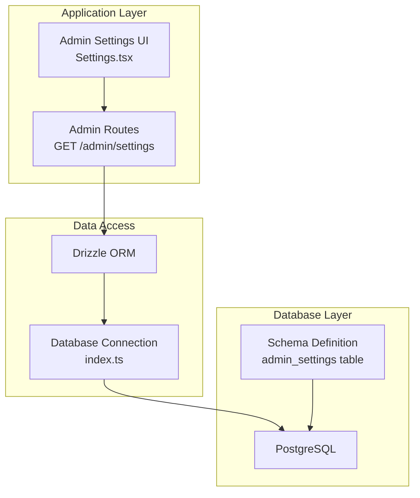
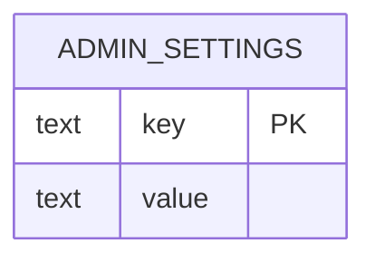
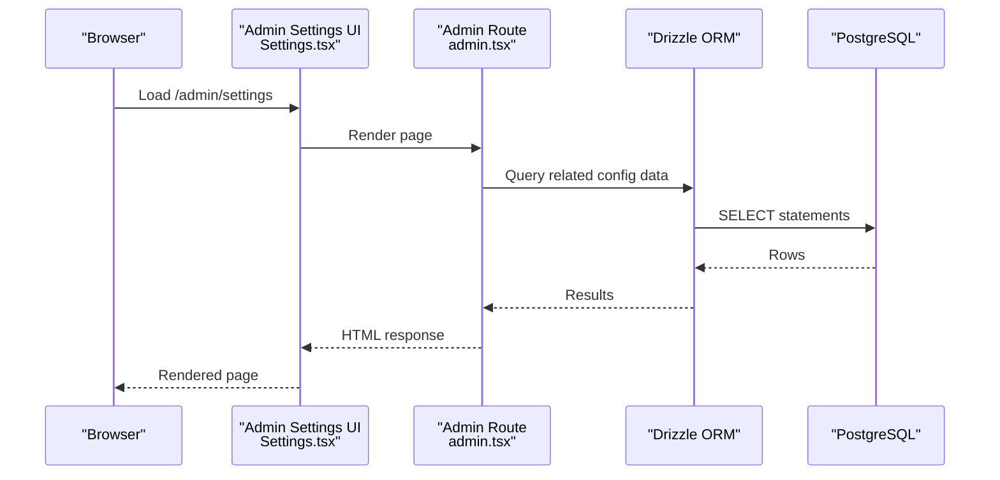
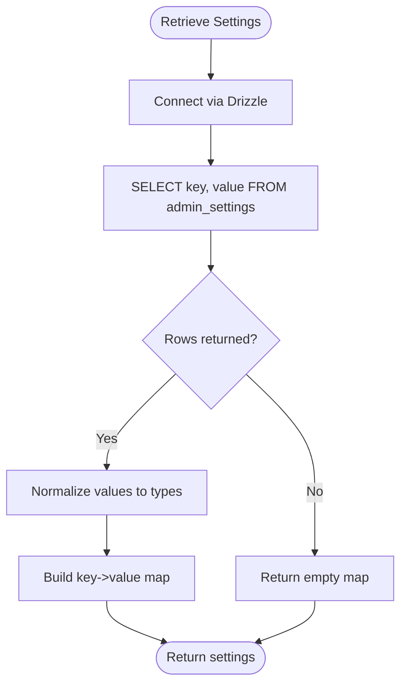
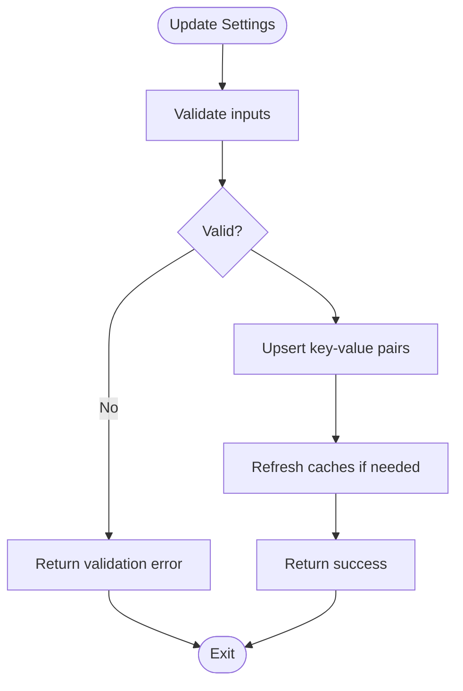
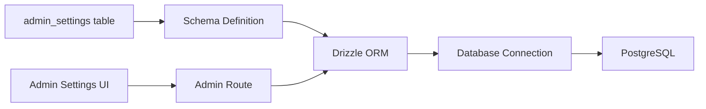

# Admin Settings Model

<cite>
**Referenced Files in This Document**
- [schema.ts](file://src/db/schema.ts)
- [Settings.tsx](file://src/pages/admin/Settings.tsx)
- [admin.tsx](file://src/routes/admin.tsx)
- [api.tsx](file://src/routes/api.tsx)
- [index.ts](file://src/db/index.ts)
- [0000_snapshot.json](file://drizzle/meta/0000_snapshot.json)
- [0001_snapshot.json](file://drizzle/meta/0001_snapshot.json)
- [0002_snapshot.json](file://drizzle/meta/0002_snapshot.json)
- [0003_snapshot.json](file://drizzle/meta/0003_snapshot.json)
- [0004_snapshot.json](file://drizzle/meta/0004_snapshot.json)
- [0005_snapshot.json](file://drizzle/meta/0005_snapshot.json)
- [0006_snapshot.json](file://drizzle/meta/0006_snapshot.json)
</cite>

## Table of Contents
1. [Introduction](#introduction)
2. [Project Structure](#project-structure)
3. [Core Components](#core-components)
4. [Architecture Overview](#architecture-overview)
5. [Detailed Component Analysis](#detailed-component-analysis)
6. [Dependency Analysis](#dependency-analysis)
7. [Performance Considerations](#performance-considerations)
8. [Troubleshooting Guide](#troubleshooting-guide)
9. [Conclusion](#conclusion)

## Introduction
This document describes the Admin Settings data model used for system-wide configuration management. It explains the key-value pair structure, categories of settings, data type handling, validation rules, and the relationship with administrative interfaces. It also covers dynamic configuration updates and provides examples of retrieving and modifying settings.

## Project Structure
The Admin Settings model is defined in the database schema and surfaced through administrative routes and UI components. The relevant parts of the project structure include:
- Database schema definition for admin settings
- Administrative route handlers for settings
- Administrative UI for managing settings
- Database connection configuration

**Diagram sources**
- [schema.ts](file://src/db/schema.ts#L68-L71)
- [admin.tsx](file://src/routes/admin.tsx#L67-L67)
- [Settings.tsx](file://src/pages/admin/Settings.tsx#L1-L51)
- [index.ts](file://src/db/index.ts#L1-L8)

**Section sources**
- [schema.ts](file://src/db/schema.ts#L68-L71)
- [admin.tsx](file://src/routes/admin.tsx#L67-L67)
- [Settings.tsx](file://src/pages/admin/Settings.tsx#L1-L51)
- [index.ts](file://src/db/index.ts#L1-L8)

## Core Components
The Admin Settings model is a simple key-value store persisted in the database. The table structure supports:
- Key: Unique identifier for the setting
- Value: Text representation of the setting value

**Diagram sources**
- [schema.ts](file://src/db/schema.ts#L68-L71)
- [0000_snapshot.json](file://drizzle/meta/0000_snapshot.json#L7-L23)
- [0001_snapshot.json](file://drizzle/meta/0001_snapshot.json#L7-L23)
- [0002_snapshot.json](file://drizzle/meta/0002_snapshot.json#L7-L23)
- [0003_snapshot.json](file://drizzle/meta/0003_snapshot.json#L7-L23)
- [0004_snapshot.json](file://drizzle/meta/0004_snapshot.json#L7-L23)
- [0005_snapshot.json](file://drizzle/meta/0005_snapshot.json#L7-L23)
- [0006_snapshot.json](file://drizzle/meta/0006_snapshot.json#L7-L23)

**Section sources**
- [schema.ts](file://src/db/schema.ts#L68-L71)
- [0000_snapshot.json](file://drizzle/meta/0000_snapshot.json#L7-L23)
- [0001_snapshot.json](file://drizzle/meta/0001_snapshot.json#L7-L23)
- [0002_snapshot.json](file://drizzle/meta/0002_snapshot.json#L7-L23)
- [0003_snapshot.json](file://drizzle/meta/0003_snapshot.json#L7-L23)
- [0004_snapshot.json](file://drizzle/meta/0004_snapshot.json#L7-L23)
- [0005_snapshot.json](file://drizzle/meta/0005_snapshot.json#L7-L23)
- [0006_snapshot.json](file://drizzle/meta/0006_snapshot.json#L7-L23)

## Architecture Overview
The Admin Settings model integrates with the administrative interface and backend routes. The UI renders a form for general site settings and payment gateways. While the current UI does not bind to the admin_settings table, the backend routes demonstrate patterns for updating configuration-like data in other tables (e.g., payment gateways). The database connection is configured via Drizzle ORM.

**Diagram sources**
- [Settings.tsx](file://src/pages/admin/Settings.tsx#L1-L51)
- [admin.tsx](file://src/routes/admin.tsx#L67-L67)
- [index.ts](file://src/db/index.ts#L1-L8)

## Detailed Component Analysis

### Data Model and Categories
- Table: admin_settings
- Columns:
  - key: text, primary key
  - value: text, not null
- Categories of settings (conceptual):
  - Platform configuration: site name, support email
  - Feature toggles: enable/disable features
  - Operational parameters: thresholds, limits, timeouts

Note: The current schema defines a generic key-value table. Specific categories and typed handling are not enforced by the schema and should be implemented at the application level.

**Section sources**
- [schema.ts](file://src/db/schema.ts#L68-L71)
- [0000_snapshot.json](file://drizzle/meta/0000_snapshot.json#L7-L23)

### Data Type Handling
- Storage: Values are stored as text.
- Retrieval: Values are returned as text.
- Application responsibility: Convert text to appropriate types (boolean, numeric, JSON) when consumed.

Validation and conversion examples:
- Boolean: Parse "true"/"false" to boolean
- Numeric: Parse "123.45" to number
- JSON: Parse serialized JSON to object/array

**Section sources**
- [schema.ts](file://src/db/schema.ts#L68-L71)

### Configuration Validation Rules
- Uniqueness: Keys must be unique (primary key constraint).
- Presence: Values must be present (not null).
- Length: No explicit length limits in schema; consider application-level constraints.
- Type: No schema-level type enforcement; enforce at application level.

**Section sources**
- [schema.ts](file://src/db/schema.ts#L68-L71)

### Administrative Interfaces and Dynamic Updates
- UI: The Settings page exists but currently displays placeholder values and does not submit to the admin_settings table.
- Backend pattern: Other admin endpoints demonstrate update patterns (e.g., payment gateways). Similar patterns can be applied to admin_settings.

Example patterns observed in the codebase:
- Query defaults and initialize if empty
- Update or upsert records
- Redirect with success/error feedback

**Section sources**
- [Settings.tsx](file://src/pages/admin/Settings.tsx#L1-L51)
- [admin.tsx](file://src/routes/admin.tsx#L67-L67)
- [api.tsx](file://src/routes/api.tsx#L173-L194)

### Setting Retrieval Patterns
Conceptual retrieval flow:
1. Connect to database via Drizzle
2. Select rows from admin_settings
3. Normalize values to target types in application code
4. Provide to UI or services

[No sources needed since this diagram shows conceptual workflow, not actual code structure]

### Setting Modification Patterns
Conceptual update flow:
1. Validate inputs (presence, type)
2. Upsert key-value pairs
3. Invalidate or refresh caches if applicable
4. Return success or error

[No sources needed since this diagram shows conceptual workflow, not actual code structure]

## Dependency Analysis
The Admin Settings model depends on:
- Database schema definition
- Drizzle ORM for queries
- Database connection configuration
- Administrative routes for UI exposure

**Diagram sources**
- [schema.ts](file://src/db/schema.ts#L68-L71)
- [index.ts](file://src/db/index.ts#L1-L8)
- [admin.tsx](file://src/routes/admin.tsx#L67-L67)
- [Settings.tsx](file://src/pages/admin/Settings.tsx#L1-L51)

**Section sources**
- [schema.ts](file://src/db/schema.ts#L68-L71)
- [index.ts](file://src/db/index.ts#L1-L8)
- [admin.tsx](file://src/routes/admin.tsx#L67-L67)
- [Settings.tsx](file://src/pages/admin/Settings.tsx#L1-L51)

## Performance Considerations
- Indexing: The key column is the primary key, ensuring efficient lookups.
- Caching: Consider caching frequently accessed settings in memory to reduce database round-trips.
- Batch operations: Group updates to minimize write operations.
- Connection pooling: Ensure the database connection pool is sized appropriately for concurrent admin requests.

[No sources needed since this section provides general guidance]

## Troubleshooting Guide
Common issues and resolutions:
- Duplicate key errors: Ensure uniqueness of keys before insert/upsert.
- Type conversion errors: Validate and convert values before storing.
- Missing values: Initialize defaults during first access if needed.
- Connection failures: Verify DATABASE_URL and network connectivity.

**Section sources**
- [schema.ts](file://src/db/schema.ts#L68-L71)
- [index.ts](file://src/db/index.ts#L1-L8)

## Conclusion
The Admin Settings model provides a flexible, generic key-value store suitable for system-wide configuration. While the schema enforces uniqueness and presence, type handling and validation are application responsibilities. The administrative UI and routes demonstrate patterns for managing configuration-like data, which can be extended to support the admin_settings table. Implement robust validation, normalization, and caching to ensure reliable operation.