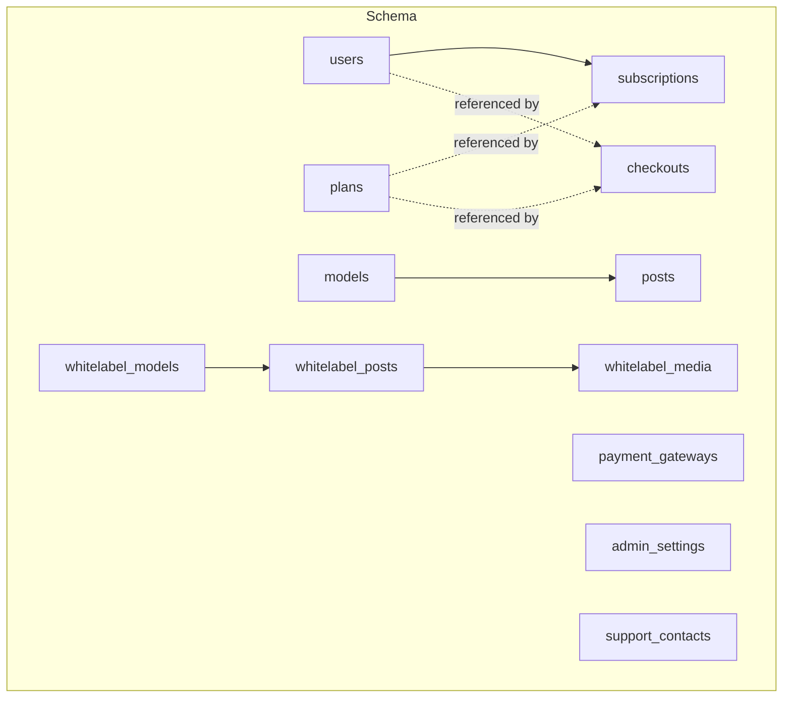
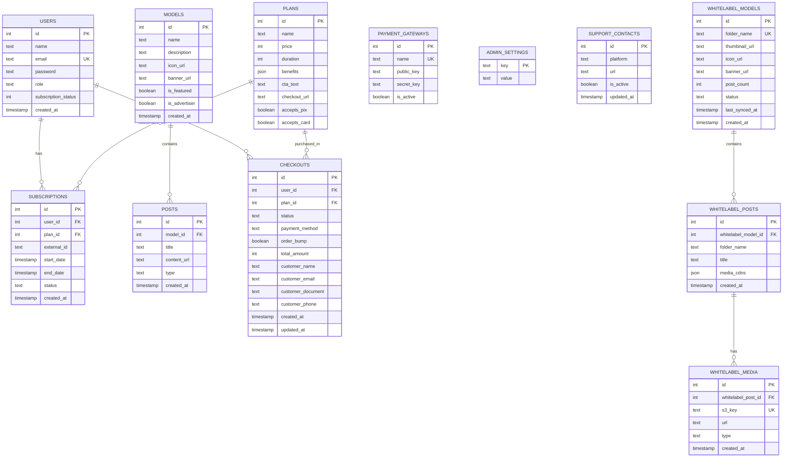
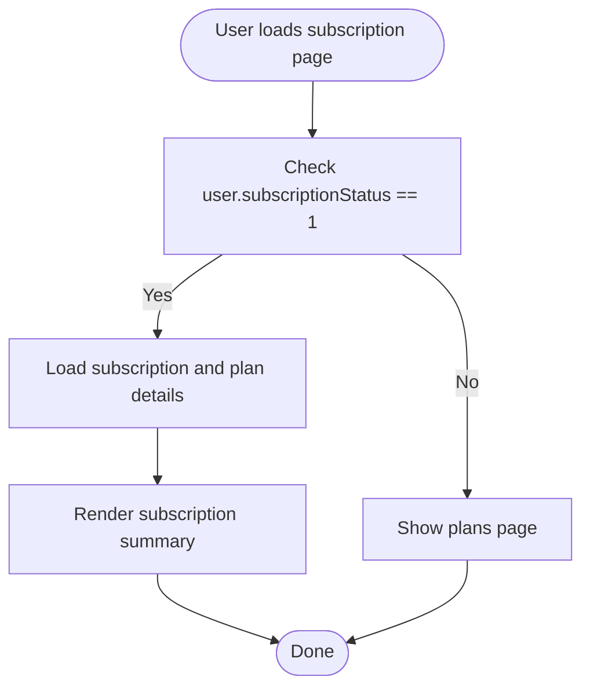
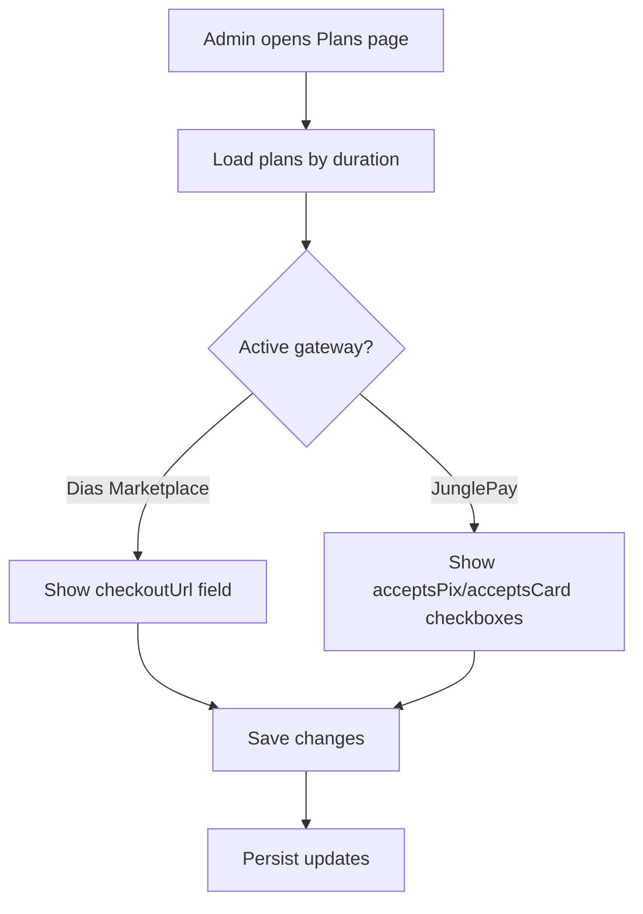
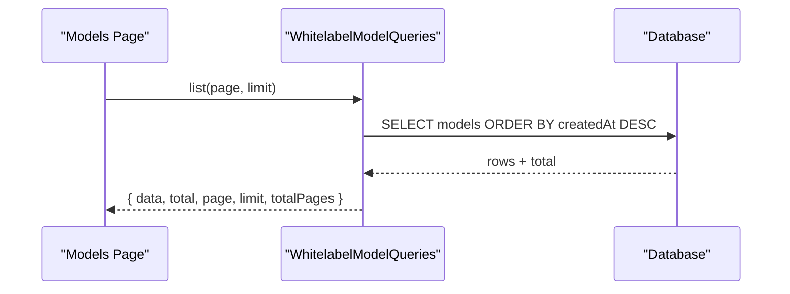
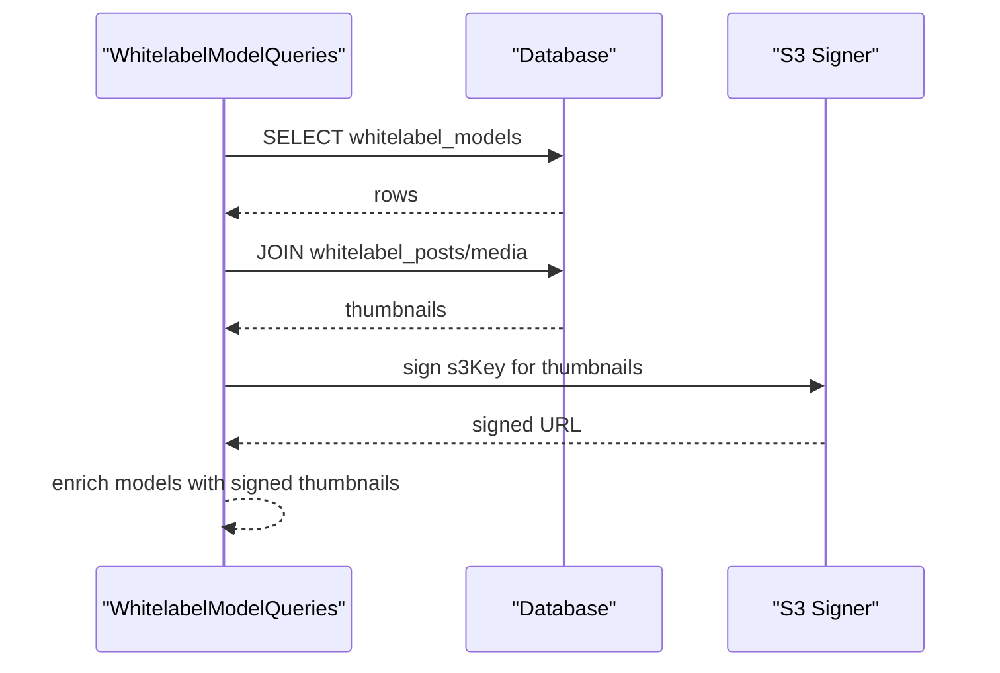
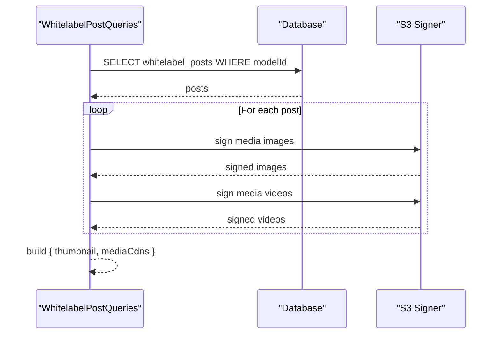
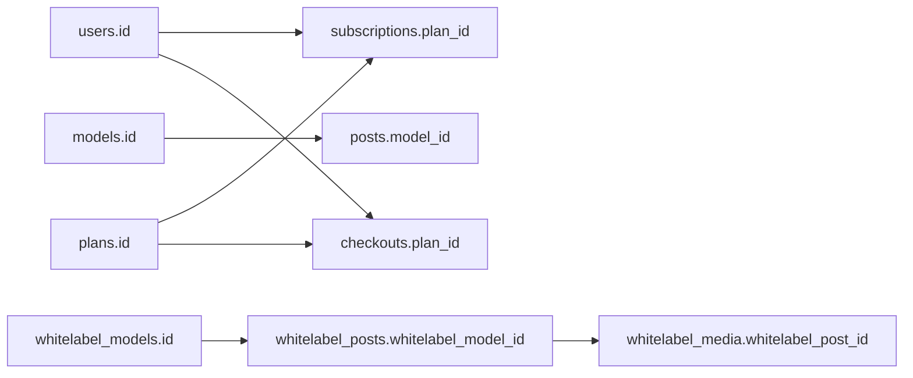

# Core Data Models

<cite>
**Referenced Files in This Document**
- [schema.ts](file://src/db/schema.ts)
- [0000_special_white_queen.sql](file://drizzle/0000_special_white_queen.sql)
- [0001_chunky_thunderbolts.sql](file://drizzle/0001_chunky_thunderbolts.sql)
- [0002_sparkling_madripoor.sql](file://drizzle/0002_sparkling_madripoor.sql)
- [0003_deep_thunderbird.sql](file://drizzle/0003_deep_thunderbird.sql)
- [0004_mixed_vermin.sql](file://drizzle/0004_mixed_vermin.sql)
- [0005_furry_catseye.sql](file://drizzle/0005_furry_catseye.sql)
- [0006_overconfident_titania.sql](file://drizzle/0006_overconfident_titania.sql)
- [models.ts](file://src/services/whitelabel/queries/models.ts)
- [posts.ts](file://src/services/whitelabel/queries/posts.ts)
- [mappers.ts](file://src/services/admin/mappers.ts)
- [Plans.tsx](file://src/pages/Plans.tsx)
- [Models.tsx](file://src/pages/Models.tsx)
- [AdminPlans.tsx](file://src/pages/admin/Plans.tsx)
</cite>

## Table of Contents
1. [Introduction](#introduction)
2. [Project Structure](#project-structure)
3. [Core Components](#core-components)
4. [Architecture Overview](#architecture-overview)
5. [Detailed Component Analysis](#detailed-component-analysis)
6. [Dependency Analysis](#dependency-analysis)
7. [Performance Considerations](#performance-considerations)
8. [Troubleshooting Guide](#troubleshooting-guide)
9. [Conclusion](#conclusion)
10. [Appendices](#appendices)

## Introduction
This document describes CreatorFlix’s core data models: users, subscriptions, plans, models, and posts. It explains field definitions, data types, constraints, validation rules, primary and foreign keys, indexing strategies, and business rules. It also outlines common query patterns and provides sample data structures to help developers and operators implement and maintain the system effectively.

## Project Structure
The data model is defined in a single schema file and enforced by a set of migrations. Queries for whitelabel models and posts are implemented in dedicated service modules. Frontend pages consume these models to render user-facing views.

**Diagram sources**
- [schema.ts](file://src/db/schema.ts#L6-L127)

**Section sources**
- [schema.ts](file://src/db/schema.ts#L1-L178)

## Core Components

### Users
- Purpose: Stores user account information and subscription status.
- Fields and constraints:
  - id: serial, primary key
  - name: text
  - email: text, not null, unique
  - password: text, not null
  - role: text enum ['admin','user'], default 'user'
  - subscriptionStatus: integer, default 0
  - createdAt: timestamp, default now()
- Validation rules:
  - Email uniqueness enforced at DB level.
  - Password presence enforced at DB level.
  - Role constrained to predefined enum.
- Indexing strategy:
  - Primary key index on id.
  - Unique index on email via unique constraint.
- Business rules:
  - subscriptionStatus is an integer flag; frontend logic interprets 1 as “has active subscription” and displays subscription details accordingly.
- Sample data structure:
  - { id: 1, name: "Alex", email: "alex@example.com", password: "...", role: "user", subscriptionStatus: 1, createdAt: "2025-01-01T00:00:00Z" }

**Section sources**
- [schema.ts](file://src/db/schema.ts#L6-L14)
- [0000_special_white_queen.sql](file://drizzle/0000_special_white_queen.sql#L35-L43)
- [0003_deep_thunderbird.sql](file://drizzle/0003_deep_thunderbird.sql#L1-L1)
- [Plans.tsx](file://src/pages/Plans.tsx#L11-L16)

### Subscriptions
- Purpose: Tracks user subscriptions to plans, including status and timing.
- Fields and constraints:
  - id: serial, primary key
  - userId: integer, not null, references users(id)
  - planId: integer, references plans(id)
  - externalId: text (payment gateway transaction id)
  - startDate: timestamp (nullable)
  - endDate: timestamp (nullable)
  - status: text enum ['active','expired','pending'], default 'pending'
  - createdAt: timestamp, default now()
- Validation rules:
  - userId must reference an existing user.
  - planId must reference an existing plan.
  - Status constrained to predefined enum.
- Indexing strategy:
  - Primary key index on id.
  - Foreign key indices implied by references.
- Business rules:
  - Status transitions and lifecycle are managed by backend/payment flows; frontend displays subscription details when subscriptionStatus indicates an active subscription.
- Sample data structure:
  - { id: 1, userId: 1, planId: 2, externalId: "ext_abc123", startDate: "2025-01-01T00:00:00Z", endDate: "2025-01-31T00:00:00Z", status: "active", createdAt: "2025-01-01T00:00:00Z" }

**Section sources**
- [schema.ts](file://src/db/schema.ts#L37-L46)
- [0001_chunky_thunderbolts.sql](file://drizzle/0001_chunky_thunderbolts.sql#L1-L14)
- [0004_mixed_vermin.sql](file://drizzle/0004_mixed_vermin.sql#L9-L11)

### Plans
- Purpose: Defines subscription tiers and checkout configuration.
- Fields and constraints:
  - id: serial, primary key
  - name: text, not null
  - price: integer, not null (in cents)
  - duration: integer, not null (in days)
  - benefits: json (stored as JSON)
  - ctaText: text
  - checkoutUrl: text
  - acceptsPix: boolean, default true
  - acceptsCard: boolean, default true
- Validation rules:
  - price and duration are required positive integers.
  - checkoutUrl optional; depends on selected gateway.
  - acceptsPix and acceptsCard flags enable/disable payment methods.
- Indexing strategy:
  - Primary key index on id.
- Business rules:
  - Duration determines billing cycle length.
  - Benefits stored as JSON for flexibility.
- Sample data structure:
  - { id: 1, name: "Monthly VIP", price: 19900, duration: 30, benefits: { features: ["unlimited_access"] }, ctaText: "Subscribe Now", checkoutUrl: "https://...", acceptsPix: true, acceptsCard: true }

**Section sources**
- [schema.ts](file://src/db/schema.ts#L16-L27)
- [0002_sparkling_madripoor.sql](file://drizzle/0002_sparkling_madripoor.sql#L1-L1)
- [0005_furry_catseye.sql](file://drizzle/0005_furry_catseye.sql#L10-L11)
- [AdminPlans.tsx](file://src/pages/admin/Plans.tsx#L5-L13)

### Models
- Purpose: Core content creators’ profiles and metadata.
- Fields and constraints:
  - id: serial, primary key
  - name: text, not null
  - description: text
  - iconUrl: text
  - bannerUrl: text
  - isFeatured: boolean, default false
  - isAdvertiser: boolean, default false
  - createdAt: timestamp, default now()
- Validation rules:
  - Name is required.
  - Flags control visibility and advertising status.
- Indexing strategy:
  - Primary key index on id.
- Business rules:
  - isFeatured and isAdvertiser influence discovery and monetization.
- Sample data structure:
  - { id: 1, name: "Creator One", description: "Popular model", iconUrl: "https://...", bannerUrl: "https://...", isFeatured: true, isAdvertiser: false, createdAt: "2025-01-01T00:00:00Z" }

**Section sources**
- [schema.ts](file://src/db/schema.ts#L48-L57)
- [0000_special_white_queen.sql](file://drizzle/0000_special_white_queen.sql#L6-L15)

### Posts
- Purpose: Individual content items associated with a model.
- Fields and constraints:
  - id: serial, primary key
  - modelId: integer, references models(id)
  - title: text
  - contentUrl: text, not null
  - type: text enum ['image','video'], not null
  - createdAt: timestamp, default now()
- Validation rules:
  - contentUrl required; type constrained to enum.
  - Optional association to a model via modelId.
- Indexing strategy:
  - Primary key index on id; foreign key index implied by references.
- Business rules:
  - Content type affects rendering and player behavior.
- Sample data structure:
  - { id: 1, modelId: 1, title: "Beach Day", contentUrl: "https://...", type: "image", createdAt: "2025-01-01T00:00:00Z" }

**Section sources**
- [schema.ts](file://src/db/schema.ts#L59-L66)
- [0000_special_white_queen.sql](file://drizzle/0000_special_white_queen.sql#L26-L33)

### Additional Entities (Supporting Models)
These entities support advanced features and administration.

- Payment Gateways
  - Fields: id, name (unique), publicKey, secretKey, isActive
  - Constraints: unique(name)
  - Business rules: Gateway selection influences checkout behavior.

- Checkouts
  - Fields: id, userId (optional), planId, status, paymentMethod, orderBump, totalAmount (cents), customer_* fields, timestamps
  - Constraints: status enum; totalAmount not null; planId not null
  - Business rules: Captures payment intent and customer info; supports optional user linkage.

- Admin Settings
  - Fields: key (pk), value
  - Business rules: Centralized key-value store for admin configuration.

- Support Contacts
  - Fields: id, platform, url, isActive, updatedAt
  - Business rules: Dynamic support links per platform.

- Whitelabel Models
  - Fields: id, folderName (unique), thumbnail/icon/banner URLs, postCount, status enum, lastSyncedAt, createdAt
  - Constraints: unique(folderName); status enum

- Whitelabel Posts
  - Fields: id, whitelabelModelId (fk), folderName, title, mediaCdns (JSON), createdAt
  - Constraints: unique(whitelabelModelId, folderName)

- Whitelabel Media
  - Fields: id, whitelabelPostId (fk), s3Key (unique), url, type enum, createdAt
  - Constraints: unique(s3Key); type enum

**Section sources**
- [schema.ts](file://src/db/schema.ts#L29-L127)
- [0000_special_white_queen.sql](file://drizzle/0000_special_white_queen.sql#L1-L76)
- [0005_furry_catseye.sql](file://drizzle/0005_furry_catseye.sql#L1-L8)
- [0006_overconfident_titania.sql](file://drizzle/0006_overconfident_titania.sql#L1-L18)

## Architecture Overview
The data model centers around users subscribing to plans, managing content via models and posts, and supporting administrative and monetization features. Whitelabel entities mirror core entities for external integrations.

**Diagram sources**
- [schema.ts](file://src/db/schema.ts#L6-L127)

## Detailed Component Analysis

### Users and Subscription Status Tracking
- Business rule: subscriptionStatus is an integer flag interpreted by the frontend. When equal to 1, the UI displays subscription details and plan information.
- Frontend usage: The subscription page conditionally renders based on user.subscriptionStatus and the presence of a subscription record with plan details.

**Diagram sources**
- [Plans.tsx](file://src/pages/Plans.tsx#L11-L61)

**Section sources**
- [schema.ts](file://src/db/schema.ts#L12-L12)
- [Plans.tsx](file://src/pages/Plans.tsx#L11-L16)

### Plans and Payment Methods
- Business rule: Plans define pricing (in cents), duration (days), and accepted payment methods (PIX/credit card). Admin UI adapts based on the active gateway.
- Frontend usage: AdminPlans page renders three plan cards (weekly/monthly/annual) and toggles fields depending on the active gateway.

**Diagram sources**
- [AdminPlans.tsx](file://src/pages/admin/Plans.tsx#L20-L126)
- [schema.ts](file://src/db/schema.ts#L16-L27)
- [0005_furry_catseye.sql](file://drizzle/0005_furry_catseye.sql#L10-L11)

**Section sources**
- [schema.ts](file://src/db/schema.ts#L16-L27)
- [0005_furry_catseye.sql](file://drizzle/0005_furry_catseye.sql#L1-L11)
- [AdminPlans.tsx](file://src/pages/admin/Plans.tsx#L20-L126)

### Models and Posts Management
- Business rule: Models represent creators; Posts are content items linked to a model. Type determines rendering behavior.
- Frontend usage: Models page lists whitelabel models and renders cards; posts are fetched per model for display.

**Diagram sources**
- [Models.tsx](file://src/pages/Models.tsx#L16-L56)
- [models.ts](file://src/services/whitelabel/queries/models.ts#L36-L57)

**Section sources**
- [schema.ts](file://src/db/schema.ts#L48-L66)
- [0000_special_white_queen.sql](file://drizzle/0000_special_white_queen.sql#L6-L33)
- [models.ts](file://src/services/whitelabel/queries/models.ts#L36-L57)
- [Models.tsx](file://src/pages/Models.tsx#L16-L56)

### Whitelabel Content Pipeline
- Business rule: Whitelabel models and posts mirror core entities for external content ingestion. Media entries are signed for secure delivery.
- Mapping: Admin mappers transform whitelabel staging data into production-ready records.

**Diagram sources**
- [models.ts](file://src/services/whitelabel/queries/models.ts#L7-L34)
- [mappers.ts](file://src/services/admin/mappers.ts#L4-L38)

**Section sources**
- [schema.ts](file://src/db/schema.ts#L73-L103)
- [models.ts](file://src/services/whitelabel/queries/models.ts#L7-L34)
- [mappers.ts](file://src/services/admin/mappers.ts#L4-L38)

### Whitelabel Posts and Media
- Business rule: Posts aggregate media assets; media entries are signed for secure access. The UI constructs image/video arrays and selects a thumbnail.
- Query pattern: Fetch posts by modelId with pagination and sign media URLs.

**Diagram sources**
- [posts.ts](file://src/services/whitelabel/queries/posts.ts#L7-L35)
- [schema.ts](file://src/db/schema.ts#L85-L103)

**Section sources**
- [schema.ts](file://src/db/schema.ts#L85-L103)
- [posts.ts](file://src/services/whitelabel/queries/posts.ts#L7-L35)

## Dependency Analysis
- Primary keys: users.id, plans.id, subscriptions.id, models.id, posts.id, whitelabel_models.id, whitelabel_posts.id, whitelabel_media.id, payment_gateways.id, checkouts.id, admin_settings.key, support_contacts.id.
- Foreign keys:
  - subscriptions.userId -> users.id
  - subscriptions.planId -> plans.id
  - posts.modelId -> models.id
  - whitelabel_posts.whitelabelModelId -> whitelabel_models.id (ON DELETE CASCADE)
  - whitelabel_media.whitelabelPostId -> whitelabel_posts.id (ON DELETE CASCADE)
  - checkouts.userId -> users.id
  - checkouts.planId -> plans.id
- Uniqueness:
  - users.email
  - whitelabel_models.folderName
  - whitelabel_posts.whitelabelModelId,folderName
  - whitelabel_media.s3Key
  - payment_gateways.name
  - admin_settings.key

**Diagram sources**
- [schema.ts](file://src/db/schema.ts#L37-L127)
- [0000_special_white_queen.sql](file://drizzle/0000_special_white_queen.sql#L78-L79)
- [0006_overconfident_titania.sql](file://drizzle/0006_overconfident_titania.sql#L17-L18)

**Section sources**
- [schema.ts](file://src/db/schema.ts#L37-L127)
- [0000_special_white_queen.sql](file://drizzle/0000_special_white_queen.sql#L78-L79)
- [0006_overconfident_titania.sql](file://drizzle/0006_overconfident_titania.sql#L17-L18)

## Performance Considerations
- Indexes:
  - Primary keys are indexed by default.
  - Unique constraints imply unique indexes (users.email, whitelabel_models.folderName, whitelabel_media.s3Key, payment_gateways.name).
  - Consider adding composite indexes for frequent joins and filters (e.g., subscriptions(userId,status), posts(modelId,createdAt)).
- Query patterns:
  - Paginated reads for whitelabel models and posts reduce memory footprint.
  - DISTINCT ON and JOINs for thumbnail enrichment should be paired with appropriate ordering and filtering to minimize result sets.
- Data types:
  - Integer cents for monetary values prevent floating-point precision issues.
  - JSON fields (benefits, media_cdns) offer flexibility but should be validated and kept minimal.

[No sources needed since this section provides general guidance]

## Troubleshooting Guide
- Duplicate email on signup:
  - Symptom: Insert fails due to unique email.
  - Resolution: Validate email availability before insert; surface user-friendly error messages.
- Missing subscription details:
  - Symptom: subscriptionStatus 1 but no subscription record.
  - Resolution: Ensure subscription creation on plan purchase; verify foreign key integrity.
- Whitelabel media signing failures:
  - Symptom: Empty or null signed URLs.
  - Resolution: Verify S3 key existence and permissions; handle missing keys gracefully.
- Checkout linkage:
  - Symptom: checkouts.userId is null unexpectedly.
  - Resolution: Capture user context during checkout; ensure referential integrity.

**Section sources**
- [schema.ts](file://src/db/schema.ts#L11-L12)
- [models.ts](file://src/services/whitelabel/queries/models.ts#L26-L33)
- [posts.ts](file://src/services/whitelabel/queries/posts.ts#L16-L32)
- [mappers.ts](file://src/services/admin/mappers.ts#L27-L31)

## Conclusion
CreatorFlix’s core data model cleanly separates user accounts, subscription lifecycle, plan definitions, and content entities. Whitelabel variants support scalable external content ingestion. Consistent constraints, enums, and foreign keys ensure data integrity, while frontend pages and service queries demonstrate practical usage patterns. Following the outlined business rules and query patterns will help maintain a robust and extensible system.

[No sources needed since this section summarizes without analyzing specific files]

## Appendices

### Common Query Patterns
- List whitelabel models with pagination and enriched thumbnails:
  - SELECT models ORDER BY createdAt DESC LIMIT N OFFSET (page-1)*N; JOIN whitelabel_posts/media to find first image per model; sign S3 keys.
- Get posts by modelId with signed media:
  - SELECT whitelabel_posts WHERE whitelabelModelId; parse media_cdns JSON; sign images/videos; select first image as thumbnail.
- Get top whitelabel models by postCount:
  - SELECT whitelabelModels ORDER BY postCount DESC LIMIT N OFFSET ...
- Admin: Update plan pricing and payment acceptance:
  - POST form to update price, checkoutUrl (gateway-dependent), acceptsPix, acceptsCard.

**Section sources**
- [models.ts](file://src/services/whitelabel/queries/models.ts#L36-L74)
- [posts.ts](file://src/services/whitelabel/queries/posts.ts#L7-L35)
- [AdminPlans.tsx](file://src/pages/admin/Plans.tsx#L30-L102)