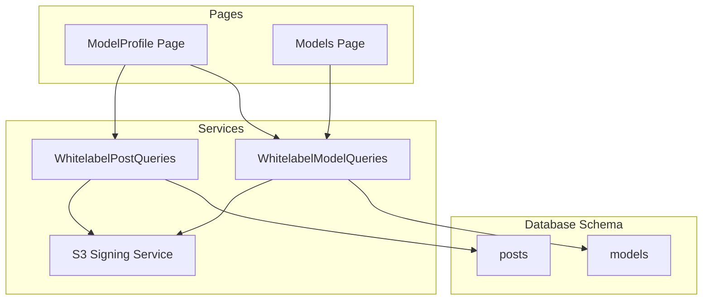
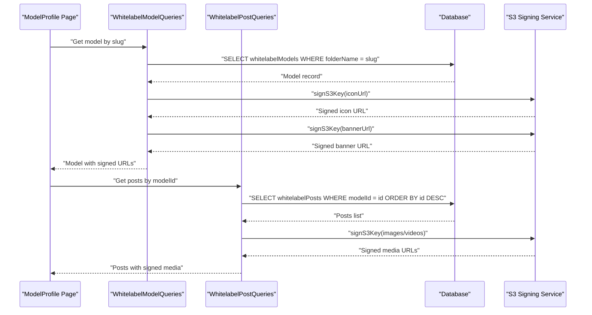
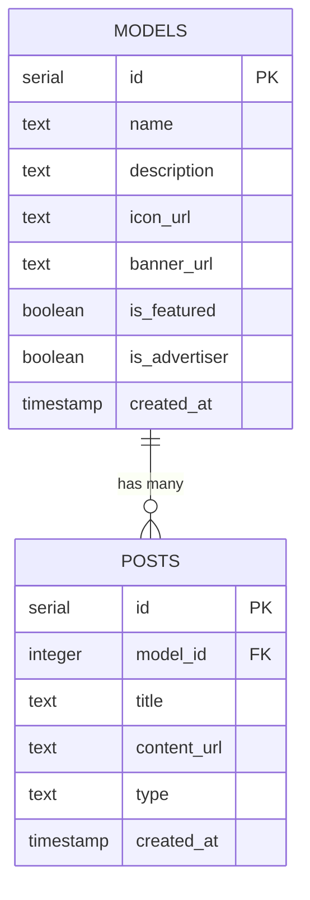
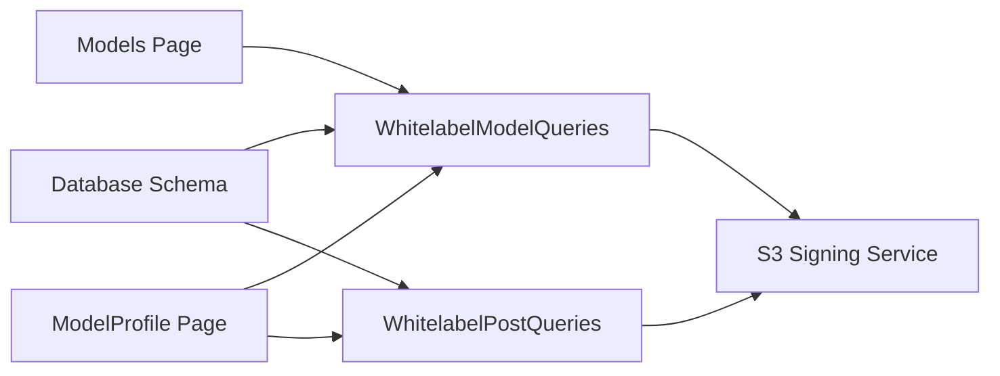

# Models & Posts Models

<cite>
**Referenced Files in This Document**
- [schema.ts](file://src/db/schema.ts)
- [index.ts](file://src/db/index.ts)
- [0000_special_white_queen.sql](file://drizzle/0000_special_white_queen.sql)
- [0001_chunky_thunderbolts.sql](file://drizzle/0001_chunky_thunderbolts.sql)
- [models.ts](file://src/services/whitelabel/queries/models.ts)
- [posts.ts](file://src/services/whitelabel/queries/posts.ts)
- [s3.ts](file://src/services/s3.ts)
- [sync.ts](file://src/services/whitelabel/sync.ts)
- [persistence.ts](file://src/services/whitelabel/sync/persistence.ts)
- [Models.tsx](file://src/pages/Models.tsx)
- [ModelProfile.tsx](file://src/pages/ModelProfile.tsx)
</cite>

## Table of Contents
1. [Introduction](#introduction)
2. [Project Structure](#project-structure)
3. [Core Components](#core-components)
4. [Architecture Overview](#architecture-overview)
5. [Detailed Component Analysis](#detailed-component-analysis)
6. [Dependency Analysis](#dependency-analysis)
7. [Performance Considerations](#performance-considerations)
8. [Troubleshooting Guide](#troubleshooting-guide)
9. [Conclusion](#conclusion)
10. [Appendices](#appendices)

## Introduction
This document describes the Models and Posts data models used in the CreatorFlix platform. It focuses on:
- Fields and constraints for the Models table (including name, description, media URLs, featured/advertiser flags, and timestamps)
- Fields and constraints for the Posts table (including model relationships, content URLs, media type enumeration, and creation timestamps)
- The one-to-many relationship between models and posts
- Business rules for content categorization, media validation, and content discovery features
- Examples of model-post relationships and common queries for content management

The platform is a premium content streaming site inspired by Netflix and OnlyFans, built with Bun, Hono, PostgreSQL, Drizzle ORM, and DigitalOcean Spaces for storage.

## Project Structure
The data model definitions live in the database schema and are generated/migrated via Drizzle. Queries for whitelabel models and posts are implemented in dedicated service modules. Frontend pages consume these services to render model listings and profiles.

**Diagram sources**
- [schema.ts](file://src/db/schema.ts#L48-L66)
- [models.ts](file://src/services/whitelabel/queries/models.ts#L6-L93)
- [posts.ts](file://src/services/whitelabel/queries/posts.ts#L6-L46)
- [s3.ts](file://src/services/s3.ts#L25-L47)
- [Models.tsx](file://src/pages/Models.tsx#L16-L55)
- [ModelProfile.tsx](file://src/pages/ModelProfile.tsx#L15-L49)

**Section sources**
- [schema.ts](file://src/db/schema.ts#L48-L66)
- [index.ts](file://src/db/index.ts#L1-L8)

## Core Components
This section documents the Models and Posts tables, their fields, constraints, and relationships.

- Models table
  - Purpose: Stores creator profile metadata and branding assets.
  - Key fields:
    - id: serial primary key
    - name: text (not null)
    - description: text
    - iconUrl: text
    - bannerUrl: text
    - isFeatured: boolean (default false)
    - isAdvertiser: boolean (default false)
    - createdAt: timestamp (default now())
  - Notes:
    - isFeatured and isAdvertiser act as flags for content categorization and discovery.
    - Media URLs (iconUrl, bannerUrl) are stored as plain text and later signed for secure delivery.

- Posts table
  - Purpose: Stores individual content items associated with a model.
  - Key fields:
    - id: serial primary key
    - modelId: integer (foreign key to models.id)
    - title: text
    - contentUrl: text (not null)
    - type: text enum ['image', 'video'] (not null)
    - createdAt: timestamp (default now())
  - Notes:
    - type enforces media validation at the database level.
    - contentUrl stores a direct URL to the content resource.

- Relationship
  - One-to-many: models.id -> posts.modelId
  - The foreign key constraint ensures referential integrity.

**Section sources**
- [schema.ts](file://src/db/schema.ts#L48-L66)
- [0000_special_white_queen.sql](file://drizzle/0000_special_white_queen.sql#L6-L33)

## Architecture Overview
The system integrates database schema, service queries, and frontend pages. Services query the database and enrich data (e.g., sign S3 URLs), while pages render model lists and profiles.

**Diagram sources**
- [models.ts](file://src/services/whitelabel/queries/models.ts#L76-L87)
- [posts.ts](file://src/services/whitelabel/queries/posts.ts#L7-L35)
- [s3.ts](file://src/services/s3.ts#L25-L47)
- [ModelProfile.tsx](file://src/pages/ModelProfile.tsx#L15-L49)

## Detailed Component Analysis

### Models Table
- Fields and constraints
  - id: serial primary key
  - name: text not null
  - description: text nullable
  - iconUrl: text nullable
  - bannerUrl: text nullable
  - isFeatured: boolean default false
  - isAdvertiser: boolean default false
  - createdAt: timestamp default now()

- Business rules
  - isFeatured: Used to promote models in discovery feeds.
  - isAdvertiser: Marks models eligible for advertising placements.
  - Media URLs: Stored as-is; later signed by the S3 service for secure access.

- Data enrichment
  - Thumbnail selection: The service selects a representative image per model for display.
  - Signed URLs: All media URLs are signed to enable time-limited access.

- Example queries
  - List models with pagination and enrichment
  - Get top models by post count
  - Get model by slug with signed media URLs

**Section sources**
- [schema.ts](file://src/db/schema.ts#L48-L57)
- [models.ts](file://src/services/whitelabel/queries/models.ts#L36-L57)
- [models.ts](file://src/services/whitelabel/queries/models.ts#L59-L74)
- [models.ts](file://src/services/whitelabel/queries/models.ts#L76-L87)

### Posts Table
- Fields and constraints
  - id: serial primary key
  - modelId: integer referencing models.id
  - title: text nullable
  - contentUrl: text not null
  - type: text enum ['image', 'video'] not null
  - createdAt: timestamp default now()

- Business rules
  - type: Enforces media validation at the database level.
  - contentUrl: Stores a direct URL to the content resource.
  - One-to-many relationship: Each post belongs to exactly one model.

- Data enrichment
  - Signed URLs: Media URLs are signed for secure delivery.
  - Thumbnail extraction: First image used as a preview thumbnail.

- Example queries
  - Fetch posts for a given model with pagination
  - Retrieve media counts and statistics

**Section sources**
- [schema.ts](file://src/db/schema.ts#L59-L66)
- [posts.ts](file://src/services/whitelabel/queries/posts.ts#L7-L35)
- [posts.ts](file://src/services/whitelabel/queries/posts.ts#L37-L45)

### Relationship Between Models and Posts
- Foreign key constraint
  - posts.modelId references models.id with no action on delete/update.

- Cardinality
  - One model can have many posts.
  - Each post belongs to exactly one model.

- Implications
  - Deleting a model does not automatically delete its posts.
  - Queries should filter by modelId to scope results.

**Diagram sources**
- [schema.ts](file://src/db/schema.ts#L48-L66)
- [0000_special_white_queen.sql](file://drizzle/0000_special_white_queen.sql#L78-L78)

**Section sources**
- [schema.ts](file://src/db/schema.ts#L48-L66)
- [0000_special_white_queen.sql](file://drizzle/0000_special_white_queen.sql#L78-L78)

### Content Discovery and Categorization
- Discovery features
  - Featured models flag promotes curated content.
  - Top models by post count are surfaced for popularity-based discovery.
  - Thumbnails are derived from model media to improve visual discoverability.

- Categorization rules
  - isFeatured: Promotional visibility.
  - isAdvertiser: Eligibility for ads.
  - postCount: Aggregated metric for popularity.

- Media validation
  - type field restricts accepted media types to image or video.
  - S3 signing ensures only authorized access to media resources.

**Section sources**
- [models.ts](file://src/services/whitelabel/queries/models.ts#L59-L74)
- [schema.ts](file://src/db/schema.ts#L48-L57)
- [schema.ts](file://src/db/schema.ts#L59-L66)

### Media Validation and Content Management
- Media validation
  - Database-level enum enforces type consistency.
  - S3 signing validates and authorizes access to media keys.

- Content management
  - Sync pipeline parses S3 keys to create models, posts, and media records.
  - Persistence layer inserts/upserts records and updates aggregates.

- Example flows
  - Model listing with enriched thumbnails
  - Model profile with signed media URLs
  - Post feed with signed images and videos

**Section sources**
- [schema.ts](file://src/db/schema.ts#L59-L66)
- [s3.ts](file://src/services/s3.ts#L25-L47)
- [sync.ts](file://src/services/whitelabel/sync.ts#L77-L152)
- [persistence.ts](file://src/services/whitelabel/sync/persistence.ts#L17-L29)

## Dependency Analysis
This section maps dependencies among database tables, services, and pages.

**Diagram sources**
- [schema.ts](file://src/db/schema.ts#L48-L66)
- [models.ts](file://src/services/whitelabel/queries/models.ts#L6-L93)
- [posts.ts](file://src/services/whitelabel/queries/posts.ts#L6-L46)
- [s3.ts](file://src/services/s3.ts#L25-L47)
- [Models.tsx](file://src/pages/Models.tsx#L16-L55)
- [ModelProfile.tsx](file://src/pages/ModelProfile.tsx#L15-L49)

**Section sources**
- [schema.ts](file://src/db/schema.ts#L48-L66)
- [models.ts](file://src/services/whitelabel/queries/models.ts#L6-L93)
- [posts.ts](file://src/services/whitelabel/queries/posts.ts#L6-L46)
- [s3.ts](file://src/services/s3.ts#L25-L47)
- [Models.tsx](file://src/pages/Models.tsx#L16-L55)
- [ModelProfile.tsx](file://src/pages/ModelProfile.tsx#L15-L49)

## Performance Considerations
- Indexing and ordering
  - Use createdAt and id for deterministic ordering in paginated queries.
  - Consider adding indexes on frequently filtered columns (e.g., isFeatured, isAdvertiser).

- Query patterns
  - Prefer selective projections (only required fields) to reduce payload size.
  - Batch operations for enrichment (e.g., signing multiple S3 keys) to minimize round trips.

- Storage access
  - Signed URLs expire after one hour; cache results where appropriate to avoid frequent re-signing.

- Aggregation
  - Use database-level aggregations for counts and statistics to avoid loading unnecessary rows.

[No sources needed since this section provides general guidance]

## Troubleshooting Guide
- Common issues
  - Missing media URLs: Ensure iconUrl, bannerUrl, and contentUrl are populated; otherwise, signed URLs may be null.
  - Type mismatch: Posts with invalid type values will fail insertion/update; ensure type is either image or video.
  - Orphaned posts: If a model is deleted, posts remain; handle cleanup via cascading deletes if desired.

- Debugging steps
  - Verify foreign key constraints and referential integrity.
  - Inspect S3 signing errors and key normalization logic.
  - Confirm pagination parameters and ordering behavior.

**Section sources**
- [schema.ts](file://src/db/schema.ts#L59-L66)
- [s3.ts](file://src/services/s3.ts#L25-L47)

## Conclusion
The Models and Posts models form the backbone of content management and discovery in CreatorFlix. The schema enforces media validation and maintains referential integrity, while services enrich data with signed URLs and aggregated metrics. Pages leverage these services to deliver curated model profiles and content feeds. Following the outlined business rules and query patterns ensures robust content management and optimal user experience.

[No sources needed since this section summarizes without analyzing specific files]

## Appendices

### Appendix A: Migration History
- Initial schema includes models, posts, and related tables.
- Foreign key constraints establish the models-posts relationship.

**Section sources**
- [0000_special_white_queen.sql](file://drizzle/0000_special_white_queen.sql#L6-L33)
- [0001_chunky_thunderbolts.sql](file://drizzle/0001_chunky_thunderbolts.sql#L1-L14)

### Appendix B: Example Queries and Relationships
- Model listing with pagination and enriched thumbnails
- Top models by post count
- Model profile with signed media URLs
- Posts feed with signed images and videos
- Statistics for models and posts

**Section sources**
- [models.ts](file://src/services/whitelabel/queries/models.ts#L36-L57)
- [models.ts](file://src/services/whitelabel/queries/models.ts#L59-L74)
- [models.ts](file://src/services/whitelabel/queries/models.ts#L76-L87)
- [posts.ts](file://src/services/whitelabel/queries/posts.ts#L7-L35)
- [posts.ts](file://src/services/whitelabel/queries/posts.ts#L37-L45)