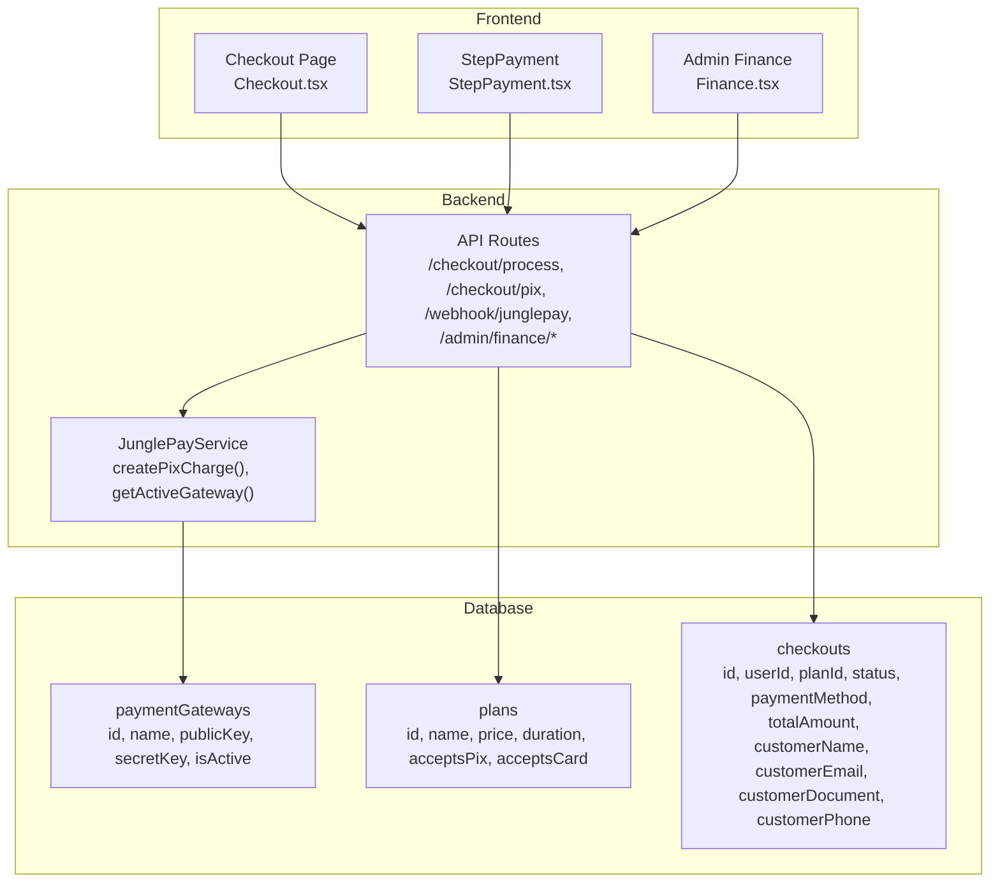
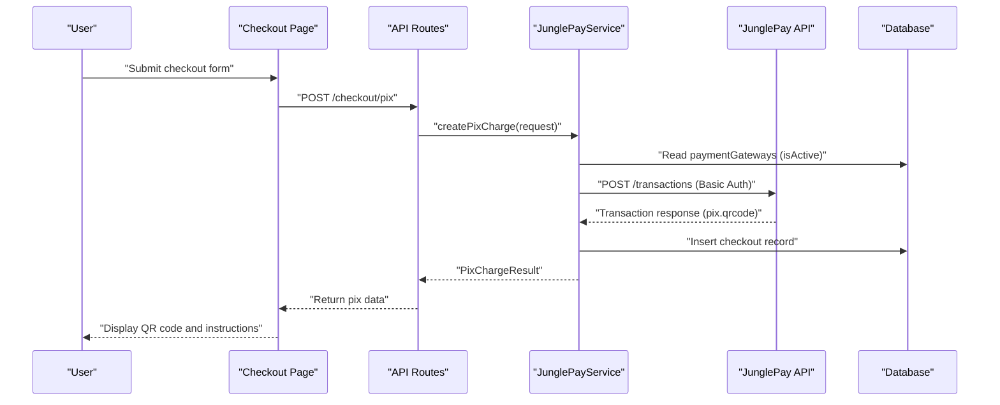
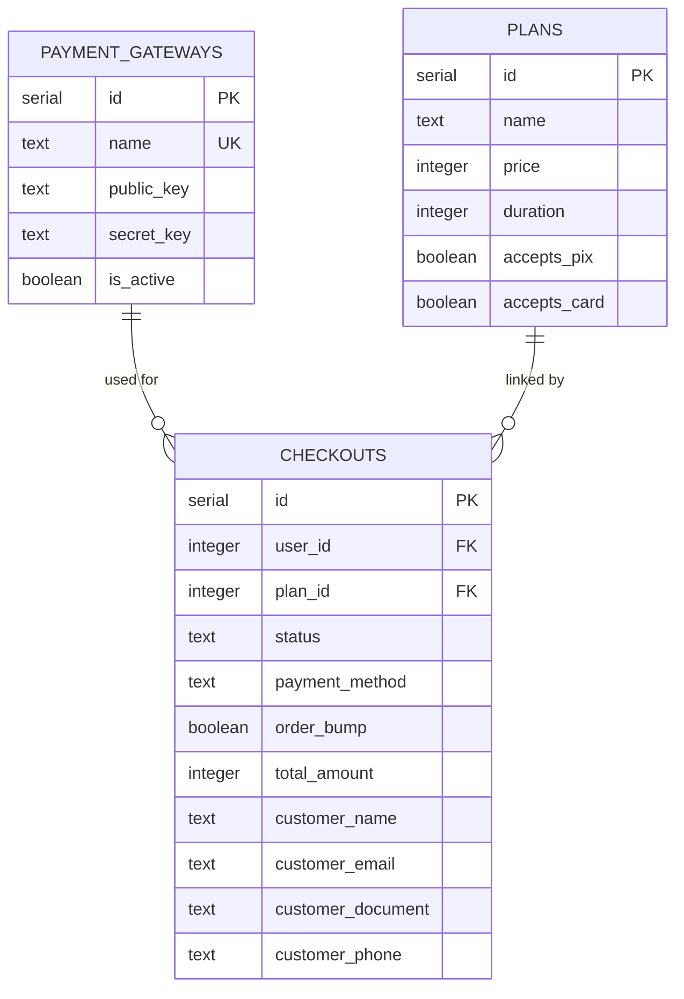
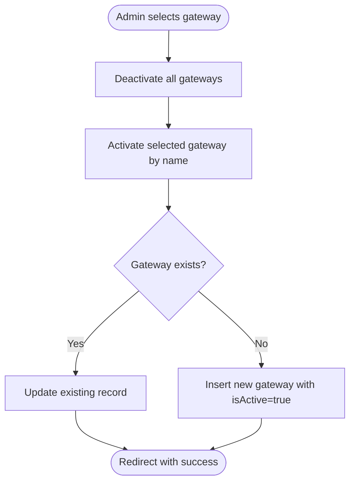
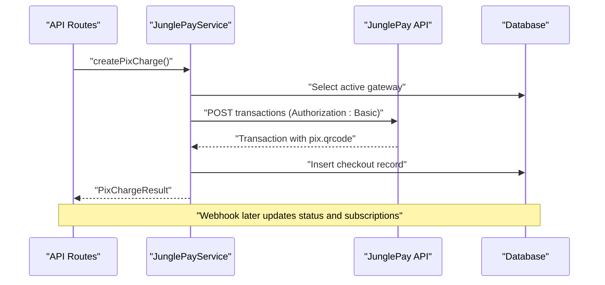
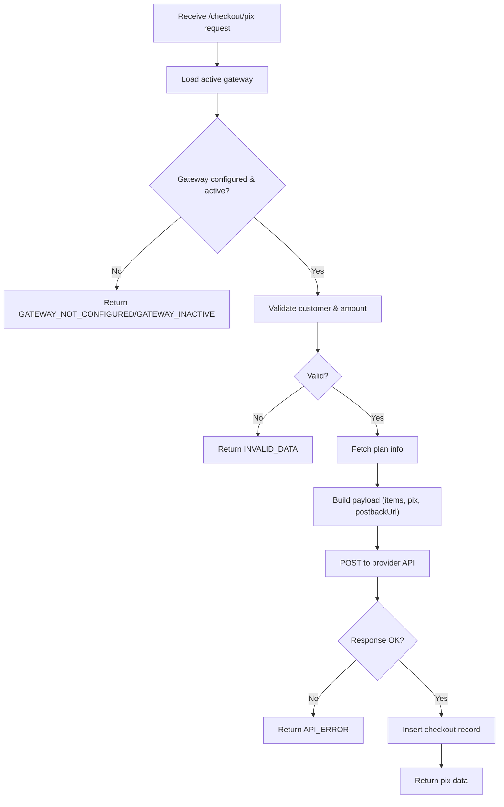
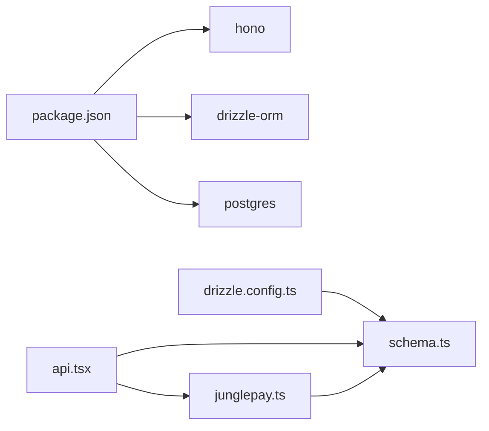

# Payment Gateways Model

<cite>
**Referenced Files in This Document**
- [schema.ts](file://src/db/schema.ts)
- [junglepay.ts](file://src/services/junglepay.ts)
- [api.tsx](file://src/routes/api.tsx)
- [Finance.tsx](file://src/pages/admin/Finance.tsx)
- [Checkout.tsx](file://src/pages/Checkout.tsx)
- [StepPayment.tsx](file://src/components/organisms/StepPayment.tsx)
- [drizzle.config.ts](file://drizzle.config.ts)
- [package.json](file://package.json)
</cite>

## Table of Contents
1. [Introduction](#introduction)
2. [Project Structure](#project-structure)
3. [Core Components](#core-components)
4. [Architecture Overview](#architecture-overview)
5. [Detailed Component Analysis](#detailed-component-analysis)
6. [Dependency Analysis](#dependency-analysis)
7. [Performance Considerations](#performance-considerations)
8. [Troubleshooting Guide](#troubleshooting-guide)
9. [Conclusion](#conclusion)
10. [Appendices](#appendices)

## Introduction
This document describes the Payment Gateways data model and integration patterns for a checkout system supporting two providers: Dias Marketplace (external) and JunglePay (internal checkout). It covers gateway identification, API credentials, active status, configuration management, selection logic, security practices, and payment processing workflows. Business rules for gateway availability, fallback mechanisms, and webhook-driven subscription activation are explained with practical examples and common queries.

## Project Structure
The payment system spans database modeling, backend API routes, frontend checkout pages, and a dedicated service for JunglePay integration. Key areas:
- Database schema defines paymentGateways, plans, checkouts, and related entities.
- Backend routes expose admin configuration endpoints and customer checkout endpoints.
- Frontend pages render checkout steps and payment options.
- JunglePay service encapsulates provider-specific logic and API interactions.

**Diagram sources**
- [schema.ts](file://src/db/schema.ts#L29-L46)
- [api.tsx](file://src/routes/api.tsx#L15-L86)
- [junglepay.ts](file://src/services/junglepay.ts#L52-L102)
- [Checkout.tsx](file://src/pages/Checkout.tsx#L19-L74)
- [StepPayment.tsx](file://src/components/organisms/StepPayment.tsx#L11-L61)
- [Finance.tsx](file://src/pages/admin/Finance.tsx#L18-L111)

**Section sources**
- [schema.ts](file://src/db/schema.ts#L29-L46)
- [api.tsx](file://src/routes/api.tsx#L15-L86)
- [junglepay.ts](file://src/services/junglepay.ts#L52-L102)
- [Checkout.tsx](file://src/pages/Checkout.tsx#L19-L74)
- [StepPayment.tsx](file://src/components/organisms/StepPayment.tsx#L11-L61)
- [Finance.tsx](file://src/pages/admin/Finance.tsx#L18-L111)

## Core Components
- paymentGateways table: Stores gateway metadata and credentials.
- plans table: Defines pricing tiers and acceptance flags for payment methods.
- checkouts table: Captures checkout attempts and customer data.
- JunglePayService: Encapsulates provider logic, credential sanitization, and API calls.
- API routes: Expose admin configuration and customer checkout endpoints.
- Admin Finance UI: Allows selecting active gateway and updating JunglePay credentials.

Field definitions and relationships are defined in the schema and enforced by backend logic.

**Section sources**
- [schema.ts](file://src/db/schema.ts#L29-L46)
- [junglepay.ts](file://src/services/junglepay.ts#L52-L102)
- [api.tsx](file://src/routes/api.tsx#L173-L216)
- [Finance.tsx](file://src/pages/admin/Finance.tsx#L18-L111)

## Architecture Overview
The system supports two gateway modes:
- Dias Marketplace: External checkout handled by a third-party provider.
- JunglePay: Internal checkout with QR code generation and webhooks.

**Diagram sources**
- [api.tsx](file://src/routes/api.tsx#L41-L86)
- [junglepay.ts](file://src/services/junglepay.ts#L107-L268)
- [schema.ts](file://src/db/schema.ts#L29-L46)

## Detailed Component Analysis

### Data Model: Payment Gateways
The paymentGateways table stores provider identity, credentials, and activation state.

- Gateway identification: name is unique and constrained to supported providers.
- Credentials: public_key and secret_key are stored as plain text in the database (see Security Practices).
- Active status: isActive controls whether the internal checkout flow is enabled.
- Configuration management: Admin endpoints update credentials and active selection.

**Diagram sources**
- [schema.ts](file://src/db/schema.ts#L29-L46)

**Section sources**
- [schema.ts](file://src/db/schema.ts#L29-L46)
- [api.tsx](file://src/routes/api.tsx#L173-L216)
- [Finance.tsx](file://src/pages/admin/Finance.tsx#L18-L111)

### Gateway Selection Logic
- Admin selects the active gateway via a dropdown and submits to /admin/finance/gateway.
- The route deactivates all gateways and activates the chosen one (upsert).
- The frontend renders payment options based on plan acceptance flags and active gateway.

**Diagram sources**
- [api.tsx](file://src/routes/api.tsx#L173-L194)
- [Finance.tsx](file://src/pages/admin/Finance.tsx#L37-L60)

**Section sources**
- [api.tsx](file://src/routes/api.tsx#L173-L194)
- [Finance.tsx](file://src/pages/admin/Finance.tsx#L37-L60)

### Credential Security Practices
- Secret keys are transmitted via Basic Authentication headers to the provider API.
- The service constructs Basic credentials using the secret key and a placeholder suffix.
- Frontend inputs for secret keys use password masking.

Security recommendations derived from current implementation:
- Store secretKey in encrypted environment variables and load at runtime.
- Avoid logging raw credentials; mask logs containing keys.
- Use HTTPS-only cookies and secure headers for API requests.
- Rotate keys regularly and invalidate old ones after migration.

**Section sources**
- [junglepay.ts](file://src/services/junglepay.ts#L70-L75)
- [junglepay.ts](file://src/services/junglepay.ts#L205-L213)
- [Finance.tsx](file://src/pages/admin/Finance.tsx#L90-L106)

### Integration Patterns
- Customer checkout flow:
  - Frontend collects customer details and plan selection.
  - Backend validates required fields and invokes JunglePayService.
  - On success, checkout record is inserted and pix data returned.
- Webhook processing:
  - JunglePay webhook updates checkout status and creates/activates subscriptions.
  - Dias Marketplace webhook handles pending and paid statuses similarly.

**Diagram sources**
- [api.tsx](file://src/routes/api.tsx#L41-L86)
- [junglepay.ts](file://src/services/junglepay.ts#L107-L268)

**Section sources**
- [api.tsx](file://src/routes/api.tsx#L41-L86)
- [junglepay.ts](file://src/services/junglepay.ts#L107-L268)

### Business Rules and Availability
- Gateway availability:
  - Internal checkout requires an active gateway record with a configured secret key.
  - If inactive or missing, the service returns appropriate error codes.
- Fallback mechanisms:
  - When internal checkout is unavailable, external provider (Dias Marketplace) remains selectable in UI and plan acceptance flags guide option visibility.
- Payment method acceptance:
  - plans.acceptsPix and plans.acceptsCard influence which payment methods are presented to users.

**Section sources**
- [junglepay.ts](file://src/services/junglepay.ts#L107-L133)
- [schema.ts](file://src/db/schema.ts#L16-L27)
- [Checkout.tsx](file://src/pages/Checkout.tsx#L19-L74)
- [StepPayment.tsx](file://src/components/organisms/StepPayment.tsx#L11-L61)

### Payment Processing Workflows
- PIX creation:
  - Validates gateway configuration, required customer data, and plan existence.
  - Builds items array with plan and optional order bump.
  - Sends request to provider API and persists checkout record.
- Webhook handling:
  - Parses transaction events and updates subscriptions and user status accordingly.

**Diagram sources**
- [junglepay.ts](file://src/services/junglepay.ts#L107-L268)
- [api.tsx](file://src/routes/api.tsx#L41-L86)

**Section sources**
- [junglepay.ts](file://src/services/junglepay.ts#L107-L268)
- [api.tsx](file://src/routes/api.tsx#L41-L86)

### Examples and Common Queries

- Example: Configure JunglePay credentials
  - Navigate to Admin Finance and submit public and secret keys for JunglePay.
  - The endpoint upserts credentials and keeps isActive false until selected as active.

- Example: Activate a gateway
  - Select gateway in Admin Finance and save preference.
  - The route deactivates all gateways and activates the chosen one.

- Example: Process a PIX payment
  - Submit checkout with required fields to /checkout/pix.
  - On success, display pix QR code and wait for webhook to finalize.

- Example: Webhook-driven subscription activation
  - On paid event, create or update subscription and set user status to active.

Common queries for payment system management:
- Which gateway is currently active?
  - Query paymentGateways where isActive is true.
- Retrieve all gateway configurations
  - Select all records from paymentGateways.
- List recent checkout attempts
  - Select from checkouts ordered by createdAt desc.
- Find plan acceptance flags
  - Select acceptsPix and acceptsCard from plans.

**Section sources**
- [api.tsx](file://src/routes/api.tsx#L173-L216)
- [schema.ts](file://src/db/schema.ts#L29-L46)
- [Checkout.tsx](file://src/pages/Checkout.tsx#L19-L74)

## Dependency Analysis
External dependencies relevant to payment:
- Hono: Web framework for API routes.
- Drizzle ORM: Database access and migrations.
- PostgreSQL: Data persistence for gateways, plans, and checkouts.

**Diagram sources**
- [package.json](file://package.json#L8-L22)
- [drizzle.config.ts](file://drizzle.config.ts#L1-L11)
- [schema.ts](file://src/db/schema.ts#L1-L178)
- [api.tsx](file://src/routes/api.tsx#L1-L12)
- [junglepay.ts](file://src/services/junglepay.ts#L1-L3)

**Section sources**
- [package.json](file://package.json#L8-L22)
- [drizzle.config.ts](file://drizzle.config.ts#L1-L11)
- [schema.ts](file://src/db/schema.ts#L1-L178)
- [api.tsx](file://src/routes/api.tsx#L1-L12)
- [junglepay.ts](file://src/services/junglepay.ts#L1-L3)

## Performance Considerations
- Minimize database round-trips by batching reads/writes where possible.
- Cache frequently accessed plan data to reduce repeated lookups.
- Use pagination for listing checkouts and subscriptions.
- Keep webhook handlers idempotent to handle retries gracefully.

## Troubleshooting Guide
- Gateway not configured or inactive
  - Symptoms: Error code indicating gateway not configured or inactive.
  - Resolution: Verify paymentGateways record and set isActive true; ensure secretKey is present.

- Invalid data errors
  - Symptoms: Validation failures for customer fields or amount.
  - Resolution: Ensure required fields are provided and amount is positive.

- API errors during provider request
  - Symptoms: Provider API response not ok or unexpected response.
  - Resolution: Check network connectivity, credentials, and BASE_URL for webhook.

- Webhook not activating subscriptions
  - Symptoms: Paid events do not update subscriptions.
  - Resolution: Confirm webhook URL matches BASE_URL, verify payload parsing, and check database writes.

**Section sources**
- [junglepay.ts](file://src/services/junglepay.ts#L111-L133)
- [junglepay.ts](file://src/services/junglepay.ts#L215-L235)
- [api.tsx](file://src/routes/api.tsx#L88-L170)

## Conclusion
The Payment Gateways model provides a clear separation between external and internal checkout flows. The schema supports provider configuration and activation, while backend services and routes enforce business rules and handle provider-specific integrations. Administrators can manage credentials and active gateway selection, and users benefit from a streamlined checkout experience with webhook-driven subscription management.

## Appendices

### Field Reference: paymentGateways
- id: Unique identifier
- name: Provider name (unique); supported values include Dias Marketplace and JunglePay
- publicKey: Public key for provider integration
- secretKey: Secret key for provider integration
- isActive: Whether internal checkout is enabled for this provider

**Section sources**
- [schema.ts](file://src/db/schema.ts#L29-L35)

### Field Reference: plans
- id: Unique identifier
- name: Plan name
- price: Price in cents
- duration: Duration in days
- acceptsPix: Whether PIX is accepted for this plan
- acceptsCard: Whether credit card is accepted for this plan

**Section sources**
- [schema.ts](file://src/db/schema.ts#L16-L27)

### Field Reference: checkouts
- id: Unique identifier
- userId: Optional user identifier
- planId: Associated plan
- status: Checkout status (pending, paid, failed, abandoned)
- paymentMethod: Selected payment method (pix, credit_card)
- orderBump: Whether premium access was added
- totalAmount: Total amount in cents
- customerName: Customer name
- customerEmail: Customer email
- customerDocument: Customer document
- customerPhone: Customer phone

**Section sources**
- [schema.ts](file://src/db/schema.ts#L113-L127)