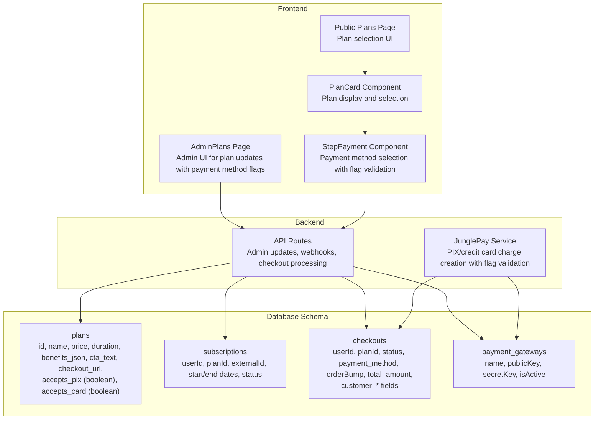
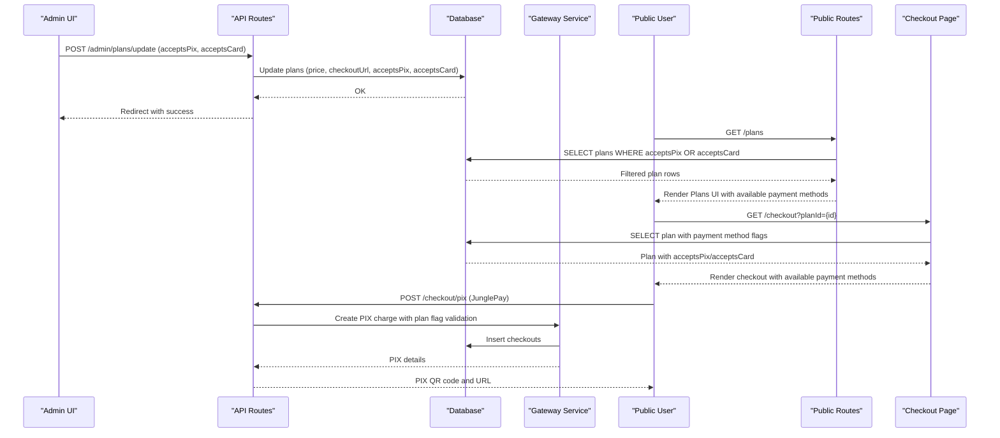
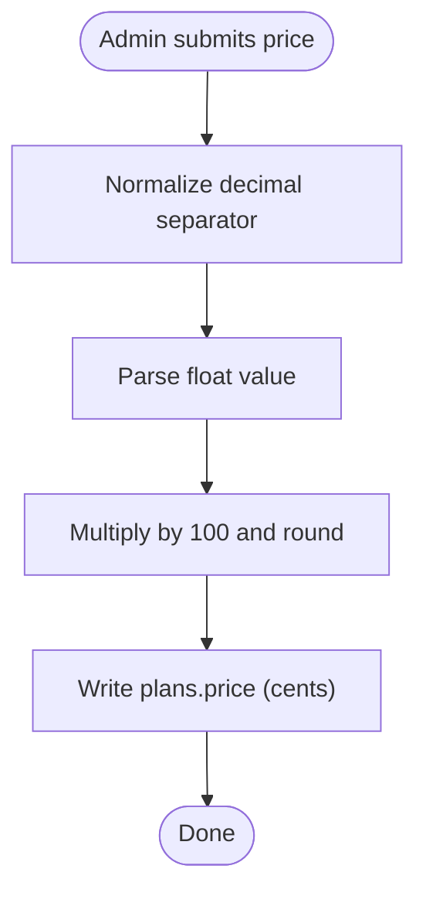
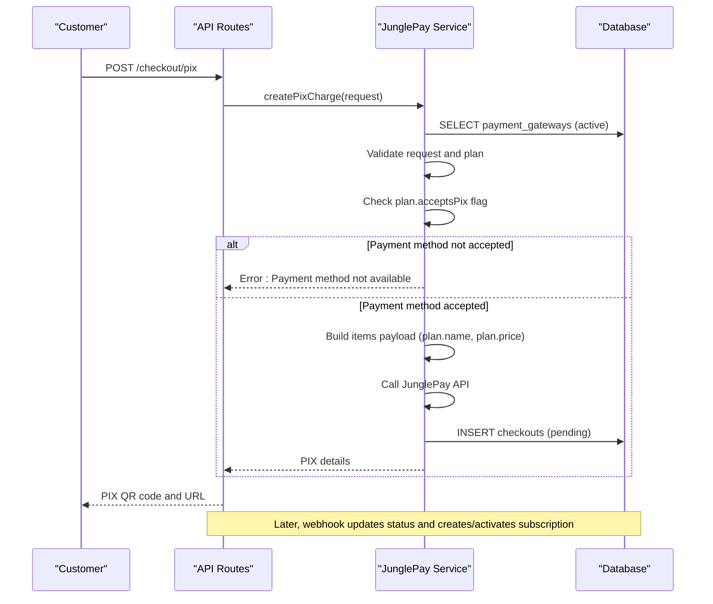
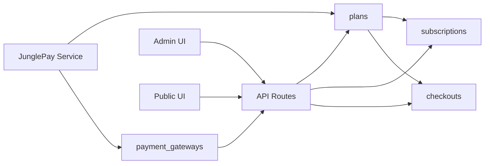

# Plans Model

<cite>
**Referenced Files in This Document**
- [schema.ts](file://src/db/schema.ts)
- [Plans.tsx](file://src/pages/admin/Plans.tsx)
- [Plans.tsx](file://src/pages/Plans.tsx)
- [PlanCard.tsx](file://src/components/molecules/PlanCard.tsx)
- [StepPayment.tsx](file://src/components/organisms/StepPayment.tsx)
- [api.tsx](file://src/routes/api.tsx)
- [junglepay.ts](file://src/services/junglepay.ts)
- [public.tsx](file://src/routes/public.tsx)
- [0002_sparkling_madripoor.sql](file://drizzle/0002_sparkling_madripoor.sql)
- [0005_furry_catseye.sql](file://drizzle/0005_furry_catseye.sql)
- [0000_snapshot.json](file://drizzle/meta/0000_snapshot.json)
- [0001_snapshot.json](file://drizzle/meta/0001_snapshot.json)
- [0002_snapshot.json](file://drizzle/meta/0002_snapshot.json)
- [0003_snapshot.json](file://drizzle/meta/0003_snapshot.json)
- [0004_snapshot.json](file://drizzle/meta/0004_snapshot.json)
</cite>

## Update Summary
**Changes Made**
- Updated Plans data model definition to include new `acceptsPix` and `acceptsCard` boolean flags
- Enhanced payment method availability control documentation
- Added validation rules for payment method flags in admin interface
- Updated payment gateway integration patterns to reflect per-plan payment method configuration
- Revised troubleshooting guide to include payment method flag validation

## Table of Contents
1. [Introduction](#introduction)
2. [Project Structure](#project-structure)
3. [Core Components](#core-components)
4. [Architecture Overview](#architecture-overview)
5. [Detailed Component Analysis](#detailed-component-analysis)
6. [Dependency Analysis](#dependency-analysis)
7. [Performance Considerations](#performance-considerations)
8. [Troubleshooting Guide](#troubleshooting-guide)
9. [Conclusion](#conclusion)
10. [Appendices](#appendices)

## Introduction
This document describes the Plans data model used to define subscription tiers, pricing, durations, and checkout integration. The model now includes enhanced payment method availability control through `acceptsPix` and `acceptsCard` boolean flags that allow granular control over which payment methods are available for each plan. It explains the schema, business logic for plan configuration, pricing calculations, duration handling, and payment gateway integration patterns. It also provides examples of plan configurations and common queries for plan management.

## Project Structure
The Plans model is defined in the database schema and consumed across the admin UI, public pages, and payment services. The addition of payment method flags enhances the model's flexibility for different payment scenarios.

**Diagram sources**
- [schema.ts](file://src/db/schema.ts#L16-L27)
- [api.tsx](file://src/routes/api.tsx#L219-L248)
- [junglepay.ts](file://src/services/junglepay.ts#L52-L269)
- [Plans.tsx](file://src/pages/admin/Plans.tsx#L20-L126)
- [PlanCard.tsx](file://src/components/molecules/PlanCard.tsx#L25-L110)
- [StepPayment.tsx](file://src/components/organisms/StepPayment.tsx#L55-L75)

**Section sources**
- [schema.ts](file://src/db/schema.ts#L16-L27)
- [Plans.tsx](file://src/pages/admin/Plans.tsx#L20-L126)
- [PlanCard.tsx](file://src/components/molecules/PlanCard.tsx#L25-L110)
- [StepPayment.tsx](file://src/components/organisms/StepPayment.tsx#L55-L75)
- [api.tsx](file://src/routes/api.tsx#L219-L248)
- [junglepay.ts](file://src/services/junglepay.ts#L52-L269)

## Core Components
- plans: Core table storing plan definitions, pricing, durations, and payment method availability flags.
- subscriptions: Tracks active/expired/pending subscriptions linked to plans.
- checkouts: Temporary records for pending payments and customer info.
- payment_gateways: Active gateway configuration for payment processing.
- Admin UI: Updates plan pricing, checkout URLs, and payment method availability flags.
- Public UI: Renders plans and links to checkout with payment method filtering.
- Payment Services: Handles gateway-specific flows (e.g., JunglePay PIX) with per-plan validation.

**Section sources**
- [schema.ts](file://src/db/schema.ts#L16-L27)
- [schema.ts](file://src/db/schema.ts#L37-L46)
- [schema.ts](file://src/db/schema.ts#L113-L127)
- [schema.ts](file://src/db/schema.ts#L29-L35)
- [Plans.tsx](file://src/pages/admin/Plans.tsx#L20-L126)
- [PlanCard.tsx](file://src/components/molecules/PlanCard.tsx#L25-L110)
- [StepPayment.tsx](file://src/components/organisms/StepPayment.tsx#L55-L75)
- [api.tsx](file://src/routes/api.tsx#L219-L248)
- [junglepay.ts](file://src/services/junglepay.ts#L52-L269)

## Architecture Overview
The Plans model integrates with:
- Admin API to update plan pricing and payment method availability flags.
- Public routes to render plans and initiate checkout with payment method filtering.
- Payment webhooks to activate subscriptions based on gateway events.
- Gateway service to create PIX charges and persist checkout records with per-plan validation.

**Diagram sources**
- [api.tsx](file://src/routes/api.tsx#L219-L248)
- [api.tsx](file://src/routes/api.tsx#L42-L86)
- [junglepay.ts](file://src/services/junglepay.ts#L107-L269)
- [public.tsx](file://src/routes/public.tsx#L121-L170)
- [StepPayment.tsx](file://src/components/organisms/StepPayment.tsx#L55-L75)

## Detailed Component Analysis

### Plans Data Model Definition
- Fields
  - id: serial primary key
  - name: text, not null
  - price: integer, not null (stored in cents)
  - duration: integer, not null (days)
  - benefits_json: json (nullable)
  - cta_text: text (nullable)
  - checkout_url: text (nullable)
  - accepts_pix: boolean, default true
  - accepts_card: boolean, default true

- Notes
  - Benefits are stored as JSON; the schema supports arbitrary benefit structures.
  - Pricing is stored in cents to avoid floating-point precision issues.
  - Duration is in whole days.
  - Payment method flags control UI rendering and payment processing validation.

**Updated** Enhanced with payment method availability flags for granular control over plan payment options.

**Section sources**
- [schema.ts](file://src/db/schema.ts#L16-L27)
- [0005_furry_catseye.sql](file://drizzle/0005_furry_catseye.sql#L10-L11)
- [0000_snapshot.json](file://drizzle/meta/0000_snapshot.json#L96-L142)
- [0001_snapshot.json](file://drizzle/meta/0001_snapshot.json#L96-L142)
- [0002_snapshot.json](file://drizzle/meta/0002_snapshot.json#L96-L142)
- [0003_snapshot.json](file://drizzle/meta/0003_snapshot.json#L96-L142)
- [0004_snapshot.json](file://drizzle/meta/0004_snapshot.json#L96-L142)

### Benefits JSON Schema Structure
- The benefits_json column stores structured benefits as JSON.
- Typical usage includes lists of features or capabilities associated with a plan.
- The frontend renders benefits via a generic features array; benefits_json enables flexible benefit definitions per plan.

**Section sources**
- [schema.ts](file://src/db/schema.ts#L21-L21)
- [PlanCard.tsx](file://src/components/molecules/PlanCard.tsx#L10-L23)

### Business Logic for Plan Configurations
- Pricing
  - Stored in cents; conversion to currency format occurs in the UI layer.
  - Admin updates convert human-readable amounts to cents before writing to the database.
- Duration
  - Used to compute subscription end dates during webhook processing.
  - Public UI highlights annual plans and formats periods accordingly.
- Payment Method Flags
  - `accepts_pix` and `accepts_card` control UI rendering in the admin panel and payment processing validation.
  - JunglePay service validates gateway configuration and activity before creating charges.
  - Payment method flags prevent processing payments for plans that don't accept the selected method.

**Updated** Enhanced payment method availability control with per-plan validation logic.

**Section sources**
- [Plans.tsx](file://src/pages/admin/Plans.tsx#L219-L248)
- [public.tsx](file://src/routes/public.tsx#L121-L143)
- [junglepay.ts](file://src/services/junglepay.ts#L225-L232)
- [junglepay.ts](file://src/services/junglepay.ts#L421-L428)
- [StepPayment.tsx](file://src/components/organisms/StepPayment.tsx#L55-L75)

### Pricing Calculations
- Admin update flow converts a formatted price string to cents:
  - Clean price string (supports dot or comma as decimal separator).
  - Multiply by 100 and round to nearest cent.
- Public UI displays price as localized currency string using the stored cents value.

**Diagram sources**
- [api.tsx](file://src/routes/api.tsx#L229-L231)
- [Plans.tsx](file://src/pages/admin/Plans.tsx#L46-L53)

**Section sources**
- [api.tsx](file://src/routes/api.tsx#L229-L231)
- [Plans.tsx](file://src/pages/admin/Plans.tsx#L46-L53)

### Duration Handling
- Webhooks compute subscription end dates by adding plan.duration days to the start date.
- Public UI uses plan.duration to highlight annual plans and format periods.

**Section sources**
- [api.tsx](file://src/routes/api.tsx#L130-L133)
- [public.tsx](file://src/routes/public.tsx#L121-L136)

### Payment Gateway Integration Patterns
- JunglePay Service
  - Validates gateway configuration and activity.
  - Sanitizes customer documents and phones.
  - Builds items payload using plan.name and plan.price.
  - Supports optional order bump item.
  - Persists a checkout record upon successful charge creation.
  - **Enhanced**: Validates payment method flags before processing charges.
- Webhooks
  - Dias Marketplace: Creates pending subscriptions on PENDING, activates on PAID.
  - JunglePay: Activates on paid webhook, identifies plan by closest price match.

**Updated** Enhanced with payment method flag validation in payment processing.

**Diagram sources**
- [api.tsx](file://src/routes/api.tsx#L42-L86)
- [junglepay.ts](file://src/services/junglepay.ts#L107-L269)
- [junglepay.ts](file://src/services/junglepay.ts#L225-L232)
- [0006_overconfident_titania.sql](file://drizzle/0006_overconfident_titania.sql#L1-L18)

**Section sources**
- [junglepay.ts](file://src/services/junglepay.ts#L107-L269)
- [junglepay.ts](file://src/services/junglepay.ts#L225-L232)
- [junglepay.ts](file://src/services/junglepay.ts#L421-L428)
- [api.tsx](file://src/routes/api.tsx#L89-L170)
- [api.tsx](file://src/routes/api.tsx#L402-L506)

### Examples of Plan Configurations
- Weekly Trial Plan
  - duration: 7 days
  - price: stored in cents (e.g., weekly trial pricing)
  - checkout_url: link for Dias Marketplace checkout
  - accepts_pix: true/false (controls PIX availability)
  - accepts_card: true/false (controls credit card availability)
- Monthly Plan
  - duration: 30 days
  - price: stored in cents
  - checkout_url: link for Dias Marketplace checkout
  - accepts_pix: true/false
  - accepts_card: true/false
- Annual Plan
  - duration: 365 days
  - price: stored in cents
  - checkout_url: link for Dias Marketplace checkout
  - accepts_pix: true/false
  - accepts_card: true/false

**Updated** Added payment method availability flags to all plan examples.

**Section sources**
- [Plans.tsx](file://src/pages/admin/Plans.tsx#L26-L28)
- [public.tsx](file://src/routes/public.tsx#L121-L136)

### Common Queries for Plan Management
- Retrieve all plans with formatted prices and periods
  - Select plans and map price to localized currency string and period suffix (/week, /month, /year).
- Find plan by duration
  - Filter plans by duration to select weekly/monthly/annual variants.
- Identify plan by closest price match
  - On webhook, compute absolute difference between amount and plan.price, pick the smallest difference.
- Update plan pricing and flags
  - Update price (cents), checkout_url, accepts_pix, accepts_card by plan id.
- Filter plans by payment method availability
  - SELECT plans WHERE accepts_pix = true OR accepts_card = true for public display.
  - SELECT plans WHERE accepts_pix = true AND accepts_card = true for exclusive payment methods.

**Updated** Added payment method availability filtering queries.

**Section sources**
- [public.tsx](file://src/routes/public.tsx#L121-L143)
- [api.tsx](file://src/routes/api.tsx#L434-L438)
- [api.tsx](file://src/routes/api.tsx#L219-L248)

## Dependency Analysis
- plans depends on:
  - subscriptions (via foreign key planId)
  - checkouts (via foreign key planId)
  - payment_gateways (configuration for gateway-specific flows)
- Admin UI depends on:
  - API routes to update plans
  - payment_gateways to decide whether to show checkout URL or payment method flags
- Public UI depends on:
  - plans for rendering with payment method filtering
  - checkouts for checkout initiation
- Payment Services depend on:
  - plan payment method flags for validation
  - gateway configuration for processing

**Updated** Enhanced dependencies to include payment method flag validation.

**Diagram sources**
- [schema.ts](file://src/db/schema.ts#L16-L27)
- [schema.ts](file://src/db/schema.ts#L37-L46)
- [schema.ts](file://src/db/schema.ts#L113-L127)
- [schema.ts](file://src/db/schema.ts#L29-L35)
- [api.tsx](file://src/routes/api.tsx#L219-L248)
- [junglepay.ts](file://src/services/junglepay.ts#L225-L232)

**Section sources**
- [schema.ts](file://src/db/schema.ts#L16-L27)
- [schema.ts](file://src/db/schema.ts#L37-L46)
- [schema.ts](file://src/db/schema.ts#L113-L127)
- [schema.ts](file://src/db/schema.ts#L29-L35)
- [api.tsx](file://src/routes/api.tsx#L219-L248)
- [junglepay.ts](file://src/services/junglepay.ts#L225-L232)

## Performance Considerations
- Store pricing in cents to avoid floating-point arithmetic pitfalls and simplify comparisons.
- Use integer duration for straightforward date calculations.
- Keep benefits_json minimal and indexed only if queried frequently; otherwise, load as needed.
- Webhooks compute plan matches by scanning all plans; consider indexing price if frequently queried by amount.
- **Enhanced**: Consider indexing payment method flags for filtering queries in public UI.

## Troubleshooting Guide
- Gateway not configured or inactive
  - Symptoms: PIX creation fails with configuration errors.
  - Resolution: Ensure payment_gateways has an active entry with secretKey set.
- Invalid data during PIX creation
  - Symptoms: Validation errors for missing customer fields or invalid amount.
  - Resolution: Verify customerName, customerEmail, customerDocument, totalAmount, planId.
- Webhook does not activate subscription
  - Symptoms: Paid transactions do not create active subscriptions.
  - Resolution: Confirm webhook payload status and amount; ensure plan exists and price matches; verify externalId linkage.
- Admin update not applied
  - Symptoms: Changes to price/flags not reflected.
  - Resolution: Confirm form submission and cents conversion logic; verify database write succeeded.
- **New**: Payment method not available error
  - Symptoms: "Este plano não aceita pagamento via PIX" or "Este plano não aceita pagamento via Cartão de Crédito".
  - Resolution: Verify plan.acceptsPix or plan.acceptsCard flag is set to true; ensure payment method is enabled in admin interface.
- **New**: No payment methods available
  - Symptoms: "Não há métodos de pagamento disponíveis para este plano no momento."
  - Resolution: Enable at least one payment method (PIX or Credit Card) for the plan in the admin interface.

**Updated** Added troubleshooting guidance for payment method flag validation errors.

**Section sources**
- [junglepay.ts](file://src/services/junglepay.ts#L107-L161)
- [junglepay.ts](file://src/services/junglepay.ts#L225-L232)
- [junglepay.ts](file://src/services/junglepay.ts#L421-L428)
- [api.tsx](file://src/routes/api.tsx#L42-L86)
- [api.tsx](file://src/routes/api.tsx#L89-L170)
- [api.tsx](file://src/routes/api.tsx#L219-L248)
- [StepPayment.tsx](file://src/components/organisms/StepPayment.tsx#L69-L73)

## Conclusion
The Plans model provides a flexible foundation for subscription tiers with precise pricing in cents, configurable durations, and enhanced payment method availability control through `acceptsPix` and `acceptsCard` boolean flags. These flags enable granular control over which payment methods are available for each plan, improving the user experience by preventing invalid payment attempts. Admin and public UIs integrate seamlessly with backend APIs and payment services to manage plan configurations and handle payment flows. Proper use of cents, duration-based date calculations, gateway validations, and payment method flag validation ensures reliable subscription activation and user experience.

## Appendices

### Field Reference
- id: serial primary key
- name: text, not null
- price: integer (cents)
- duration: integer (days)
- benefits_json: json (optional)
- cta_text: text (optional)
- checkout_url: text (optional)
- accepts_pix: boolean (default true)
- accepts_card: boolean (default true)

**Updated** Added payment method availability flags to field reference.

**Section sources**
- [schema.ts](file://src/db/schema.ts#L16-L27)
- [0000_snapshot.json](file://drizzle/meta/0000_snapshot.json#L96-L142)
- [0001_snapshot.json](file://drizzle/meta/0001_snapshot.json#L96-L142)
- [0002_snapshot.json](file://drizzle/meta/0002_snapshot.json#L96-L142)
- [0003_snapshot.json](file://drizzle/meta/0003_snapshot.json#L96-L142)
- [0004_snapshot.json](file://drizzle/meta/0004_snapshot.json#L96-L142)

### Payment Method Flag Usage Examples
- **Admin Interface**: Payment method checkboxes automatically reflect current plan settings
- **Public Interface**: Payment methods are filtered based on plan flags before rendering
- **Payment Processing**: Gateway service validates plan flags before accepting payments
- **Checkout Flow**: Users only see available payment methods for the selected plan

**Section sources**
- [Plans.tsx](file://src/pages/admin/Plans.tsx#L80-L105)
- [StepPayment.tsx](file://src/components/organisms/StepPayment.tsx#L55-L75)
- [junglepay.ts](file://src/services/junglepay.ts#L225-L232)
- [junglepay.ts](file://src/services/junglepay.ts#L421-L428)