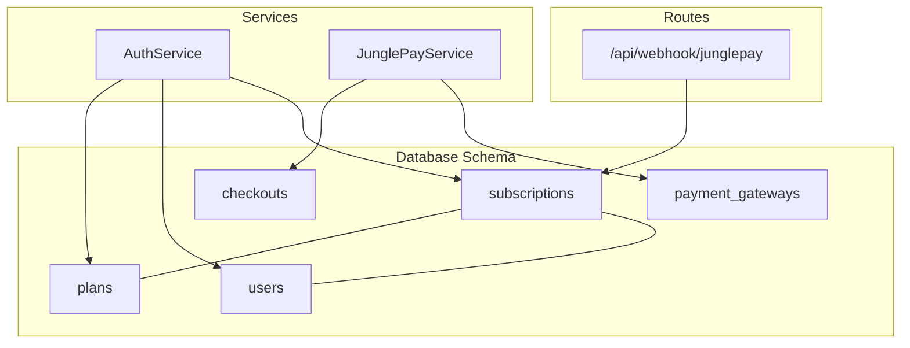
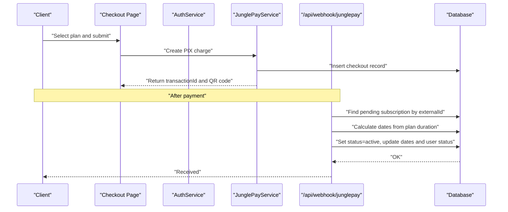
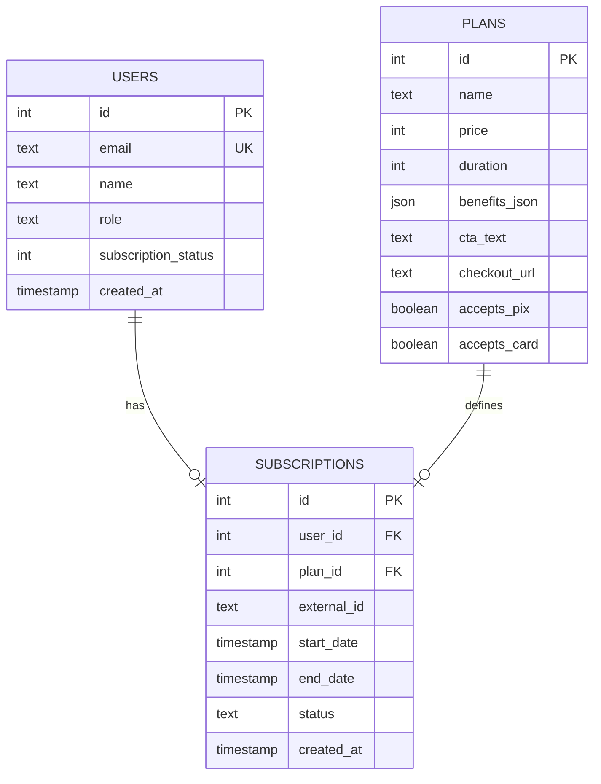
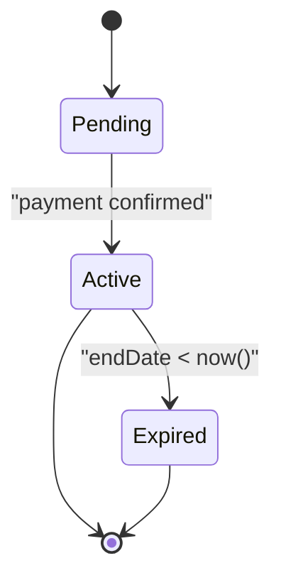
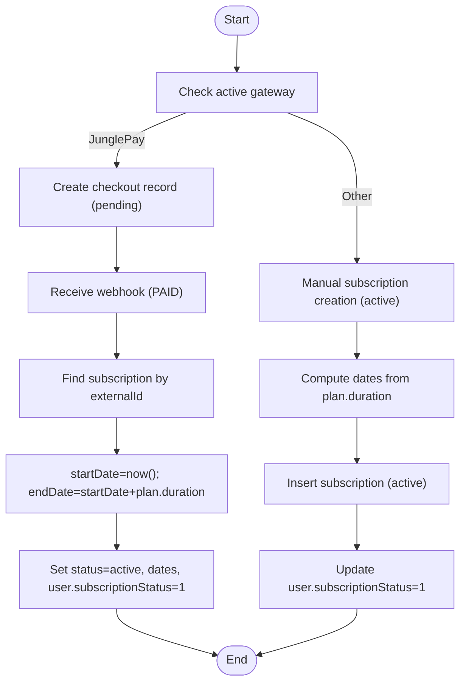
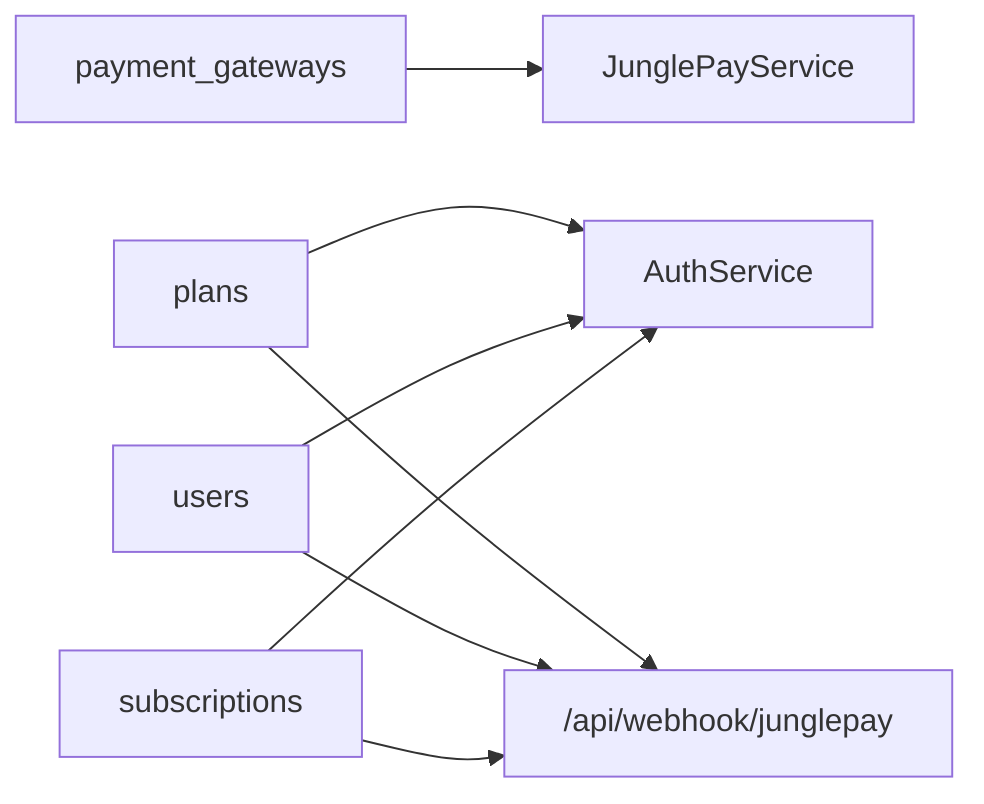

# Subscriptions Model

<cite>
**Referenced Files in This Document**
- [schema.ts](file://src/db/schema.ts)
- [0001_chunky_thunderbolts.sql](file://drizzle/0001_chunky_thunderbolts.sql)
- [0002_sparkling_madripoor.sql](file://drizzle/0002_sparkling_madripoor.sql)
- [0003_deep_thunderbird.sql](file://drizzle/0003_deep_thunderbird.sql)
- [0004_mixed_vermin.sql](file://drizzle/0004_mixed_vermin.sql)
- [0005_furry_catseye.sql](file://drizzle/0005_furry_catseye.sql)
- [0006_overconfident_titania.sql](file://drizzle/0006_overconfident_titania.sql)
- [auth.ts](file://src/services/auth.ts)
- [api.tsx](file://src/routes/api.tsx)
- [junglepay.ts](file://src/services/junglepay.ts)
- [Checkout.tsx](file://src/pages/Checkout.tsx)
</cite>

## Table of Contents
1. [Introduction](#introduction)
2. [Project Structure](#project-structure)
3. [Core Components](#core-components)
4. [Architecture Overview](#architecture-overview)
5. [Detailed Component Analysis](#detailed-component-analysis)
6. [Dependency Analysis](#dependency-analysis)
7. [Performance Considerations](#performance-considerations)
8. [Troubleshooting Guide](#troubleshooting-guide)
9. [Conclusion](#conclusion)
10. [Appendices](#appendices)

## Introduction
This document describes the Subscriptions data model, including field definitions, relationships with Users and Plans, external transaction IDs, date ranges, status enumeration, and lifecycle management. It explains status transitions, renewal logic, business rules for validation and automatic expiration, and payment status tracking. It also provides examples of subscription states and common queries for subscription management.

## Project Structure
The Subscriptions model is defined in the database schema and is used by services and routes that handle authentication, payment webhooks, and checkout flows.

**Diagram sources**
- [schema.ts](file://src/db/schema.ts#L37-L46)
- [auth.ts](file://src/services/auth.ts#L1-L91)
- [junglepay.ts](file://src/services/junglepay.ts#L1-L270)
- [api.tsx](file://src/routes/api.tsx#L442-L506)

**Section sources**
- [schema.ts](file://src/db/schema.ts#L37-L46)
- [auth.ts](file://src/services/auth.ts#L1-L91)
- [junglepay.ts](file://src/services/junglepay.ts#L1-L270)
- [api.tsx](file://src/routes/api.tsx#L442-L506)

## Core Components
- subscriptions: Stores subscription records with user and plan relationships, external transaction identifiers, date ranges, status, and timestamps.
- users: Contains user account data and a subscription status indicator.
- plans: Defines pricing tiers with duration in days and acceptance flags for payment methods.
- payment_gateways: Stores active payment provider configurations.
- checkouts: Tracks checkout sessions and payment metadata.

Field definitions and relationships are defined in the schema and enforced by migrations.

**Section sources**
- [schema.ts](file://src/db/schema.ts#L6-L14)
- [schema.ts](file://src/db/schema.ts#L16-L27)
- [schema.ts](file://src/db/schema.ts#L29-L35)
- [schema.ts](file://src/db/schema.ts#L113-L127)
- [schema.ts](file://src/db/schema.ts#L37-L46)

## Architecture Overview
The subscription lifecycle spans checkout creation, webhook processing, and periodic status checks. The system supports internal checkout via JunglePay and external checkout via third-party providers.

**Diagram sources**
- [Checkout.tsx](file://src/pages/Checkout.tsx#L1-L74)
- [junglepay.ts](file://src/services/junglepay.ts#L107-L268)
- [auth.ts](file://src/services/auth.ts#L41-L65)
- [api.tsx](file://src/routes/api.tsx#L442-L506)

## Detailed Component Analysis

### Subscriptions Table Definition
- Fields:
  - id: serial primary key
  - userId: integer, references users.id
  - planId: integer, references plans.id (nullable)
  - externalId: text (external transaction identifier)
  - startDate: timestamp (nullable)
  - endDate: timestamp (nullable)
  - status: text enum ['active', 'expired', 'pending'], default 'pending'
  - createdAt: timestamp default now()

Relationships:
- One-to-one with users via userId
- Optional one-to-one with plans via planId

**Diagram sources**
- [schema.ts](file://src/db/schema.ts#L6-L14)
- [schema.ts](file://src/db/schema.ts#L16-L27)
- [schema.ts](file://src/db/schema.ts#L37-L46)

**Section sources**
- [schema.ts](file://src/db/schema.ts#L37-L46)
- [0001_chunky_thunderbolts.sql](file://drizzle/0001_chunky_thunderbolts.sql#L1-L14)
- [0004_mixed_vermin.sql](file://drizzle/0004_mixed_vermin.sql#L1-L12)

### Status Enumeration and Lifecycle
- Status values: active, expired, pending
- Pending state is used during payment initiation; active is set after successful payment
- Automatic expiration occurs when endDate < current time

**Diagram sources**
- [schema.ts](file://src/db/schema.ts#L44-L44)
- [auth.ts](file://src/services/auth.ts#L67-L89)
- [api.tsx](file://src/routes/api.tsx#L456-L496)

**Section sources**
- [schema.ts](file://src/db/schema.ts#L44-L44)
- [auth.ts](file://src/services/auth.ts#L67-L89)
- [api.tsx](file://src/routes/api.tsx#L456-L496)

### Payment and Renewal Logic
- Internal checkout (JunglePay):
  - Creates a checkout record with status 'pending'
  - On webhook 'PAID', finds the pending subscription by externalId
  - Calculates startDate as now() and endDate as startDate + plan.duration days
  - Updates subscription to status 'active', sets dates, and updates user.subscriptionStatus
- Direct plan activation (admin/dev flows):
  - Inserts subscription with status 'active', dates computed from plan.duration
  - Updates user.subscriptionStatus to 1

**Diagram sources**
- [junglepay.ts](file://src/services/junglepay.ts#L107-L268)
- [api.tsx](file://src/routes/api.tsx#L442-L506)
- [auth.ts](file://src/services/auth.ts#L41-L65)

**Section sources**
- [junglepay.ts](file://src/services/junglepay.ts#L107-L268)
- [api.tsx](file://src/routes/api.tsx#L442-L506)
- [auth.ts](file://src/services/auth.ts#L41-L65)

### Business Rules and Validation
- External transaction ID uniqueness: externalId is stored for reconciliation and lookup
- Plan duration drives renewal: endDate = startDate + plan.duration (days)
- Default duration fallback: if no planId, default 30 days is used in webhook logic
- User subscription status synchronization:
  - Active subscription: user.subscriptionStatus = 1
  - No active subscription or expired: user.subscriptionStatus = 0
- Pending subscriptions without dates are allowed until payment confirmation

**Section sources**
- [api.tsx](file://src/routes/api.tsx#L456-L496)
- [auth.ts](file://src/services/auth.ts#L67-L89)
- [schema.ts](file://src/db/schema.ts#L16-L27)
- [schema.ts](file://src/db/schema.ts#L41-L41)

### Examples of Subscription States
- Pending: Created immediately after initiating payment; externalId present; dates null; status='pending'
- Active: Payment confirmed; dates set; status='active'; user.subscriptionStatus=1
- Expired: Active but endDate < now(); status updated to 'expired'; user.subscriptionStatus=0

**Section sources**
- [api.tsx](file://src/routes/api.tsx#L442-L496)
- [auth.ts](file://src/services/auth.ts#L67-L89)

### Common Queries for Subscription Management
- Get latest active subscription for a user:
  - Select subscription where userId=? and status='active', ordered by endDate descending, limit 1
- List all pending subscriptions with externalId:
  - Select where status='pending' and externalId is not null
- Count active vs expired subscriptions:
  - Aggregate counts by status
- Renewal candidates (within X days of expiry):
  - Select where status='active' and endDate between now() and now()+X days

**Section sources**
- [auth.ts](file://src/services/auth.ts#L67-L74)
- [schema.ts](file://src/db/schema.ts#L37-L46)

## Dependency Analysis
- subscriptions depends on users (userId) and plans (planId)
- webhook handler depends on externalId to reconcile payments
- checkout creation depends on plan duration and gateway configuration
- user.subscriptionStatus is managed by both manual activation and webhook processing

**Diagram sources**
- [schema.ts](file://src/db/schema.ts#L29-L35)
- [schema.ts](file://src/db/schema.ts#L16-L27)
- [schema.ts](file://src/db/schema.ts#L6-L14)
- [schema.ts](file://src/db/schema.ts#L37-L46)
- [auth.ts](file://src/services/auth.ts#L1-L91)
- [api.tsx](file://src/routes/api.tsx#L442-L506)
- [junglepay.ts](file://src/services/junglepay.ts#L1-L270)

**Section sources**
- [schema.ts](file://src/db/schema.ts#L150-L159)
- [schema.ts](file://src/db/schema.ts#L131-L137)
- [schema.ts](file://src/db/schema.ts#L113-L127)

## Performance Considerations
- Index externalId for fast webhook reconciliation
- Add indexes on subscriptions(userId, status, endDate) for status checks
- Batch expiration updates during maintenance windows
- Avoid frequent recalculations of user.subscriptionStatus; compute only on state changes

## Troubleshooting Guide
- Webhook receives unknown externalId:
  - Verify checkout was created and externalId matches
  - Confirm planId resolution if used for duration calculation
- Subscription remains pending:
  - Check gateway webhook configuration and endpoint reachability
  - Ensure status transitions occur only after payment confirmation
- User marked as inactive despite active subscription:
  - Validate endDate comparison logic and timezone consistency
  - Confirm latest active subscription ordering by endDate desc

**Section sources**
- [api.tsx](file://src/routes/api.tsx#L456-L506)
- [auth.ts](file://src/services/auth.ts#L67-L89)

## Conclusion
The Subscriptions model integrates cleanly with Users and Plans, supports external payment reconciliation via externalId, and enforces a clear lifecycle from pending to active to expired. The system’s design allows for flexible payment providers while maintaining consistent state management and user status synchronization.

## Appendices

### Migration History Impacting Subscriptions
- Initial subscriptions table with NOT NULL dates and default 'active' status
- Later migrations:
  - Allow nullable dates and default status 'pending'
  - Add external_id column for reconciliation
  - Introduce plan.duration and payment gateway support
  - Add checkout table for internal payment tracking

**Section sources**
- [0001_chunky_thunderbolts.sql](file://drizzle/0001_chunky_thunderbolts.sql#L1-L14)
- [0002_sparkling_madripoor.sql](file://drizzle/0002_sparkling_madripoor.sql#L1-L1)
- [0003_deep_thunderbird.sql](file://drizzle/0003_deep_thunderbird.sql#L1-L1)
- [0004_mixed_vermin.sql](file://drizzle/0004_mixed_vermin.sql#L1-L12)
- [0005_furry_catseye.sql](file://drizzle/0005_furry_catseye.sql#L1-L11)
- [0006_overconfident_titania.sql](file://drizzle/0006_overconfident_titania.sql#L1-L18)