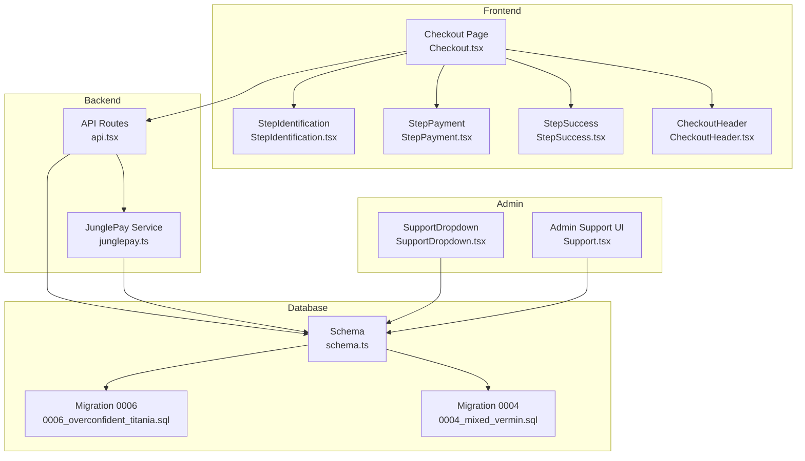
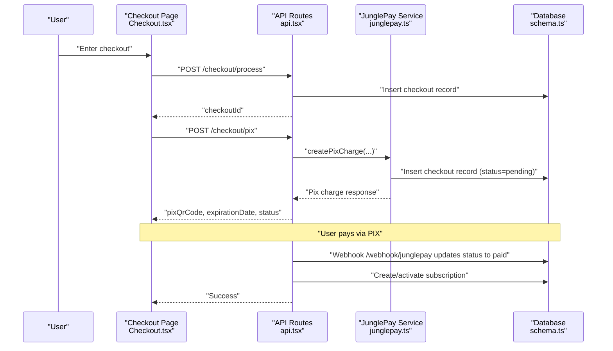
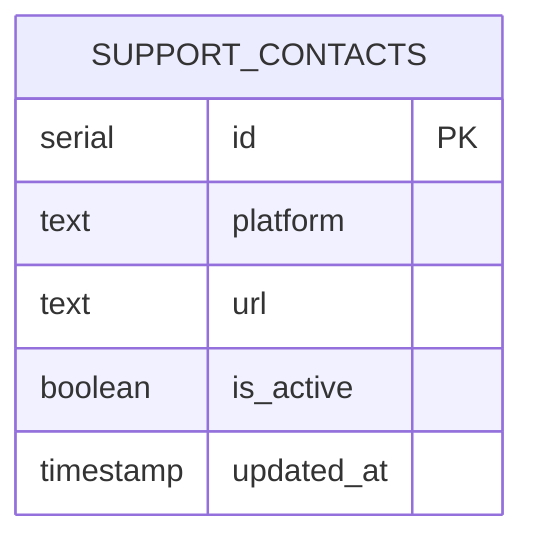
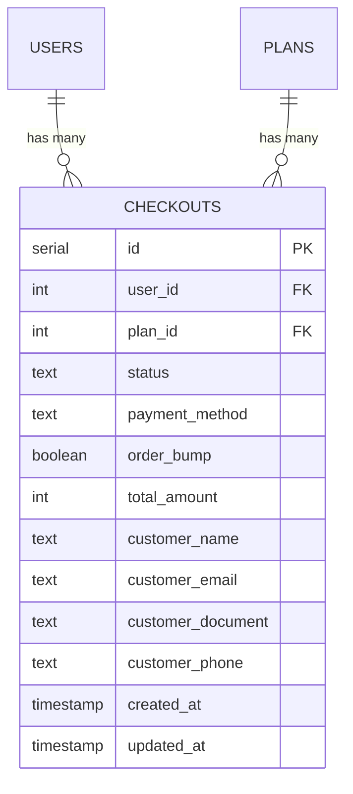
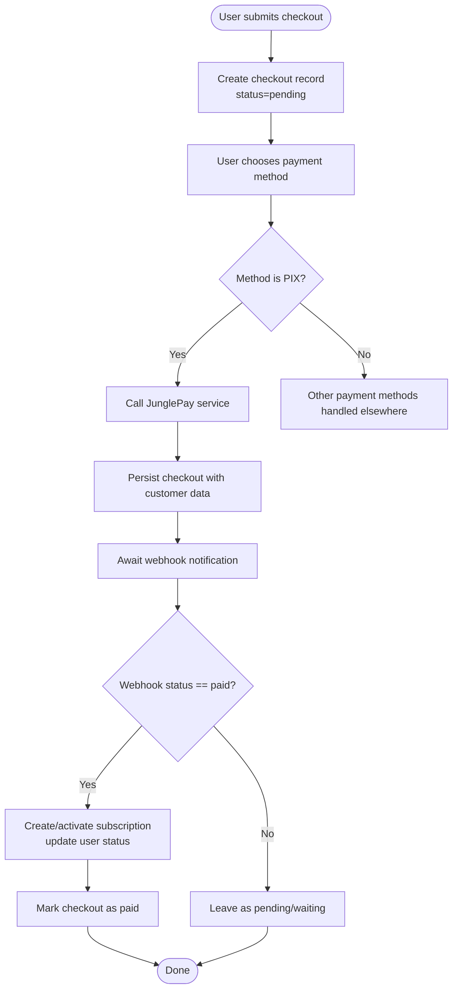
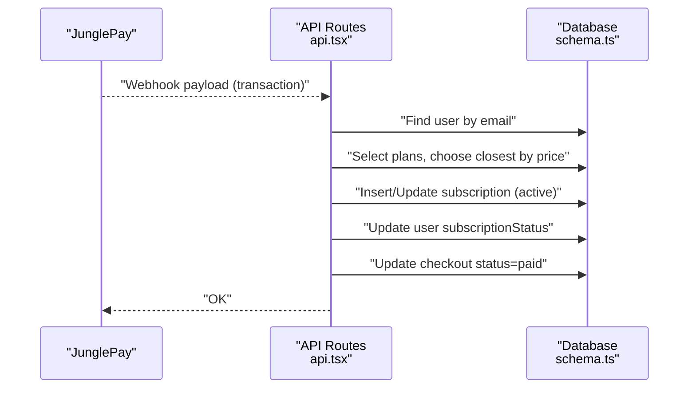
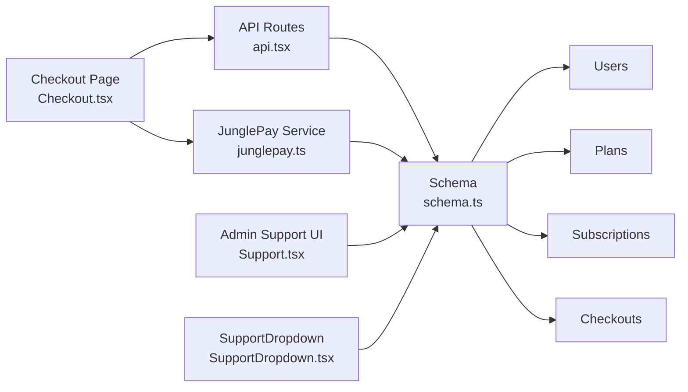

# Support Contacts & Checkouts

<cite>
**Referenced Files in This Document**
- [schema.ts](file://src/db/schema.ts)
- [0006_overconfident_titania.sql](file://drizzle/0006_overconfident_titania.sql)
- [0004_mixed_vermin.sql](file://drizzle/0004_mixed_vermin.sql)
- [Checkout.tsx](file://src/pages/Checkout.tsx)
- [StepIdentification.tsx](file://src/components/organisms/StepIdentification.tsx)
- [StepPayment.tsx](file://src/components/organisms/StepPayment.tsx)
- [StepSuccess.tsx](file://src/components/organisms/StepSuccess.tsx)
- [CheckoutHeader.tsx](file://src/components/organisms/CheckoutHeader.tsx)
- [junglepay.ts](file://src/services/junglepay.ts)
- [api.tsx](file://src/routes/api.tsx)
- [SupportDropdown.tsx](file://src/components/atoms/SupportDropdown.tsx)
- [Support.tsx](file://src/pages/admin/Support.tsx)
</cite>

## Table of Contents
1. [Introduction](#introduction)
2. [Project Structure](#project-structure)
3. [Core Components](#core-components)
4. [Architecture Overview](#architecture-overview)
5. [Detailed Component Analysis](#detailed-component-analysis)
6. [Dependency Analysis](#dependency-analysis)
7. [Performance Considerations](#performance-considerations)
8. [Troubleshooting Guide](#troubleshooting-guide)
9. [Conclusion](#conclusion)
10. [Appendices](#appendices)

## Introduction
This document explains the Support Contacts and Checkouts data models and their associated workflows. It covers:
- Support Contacts: platform identification (WhatsApp/Telegram), contact URLs, active status, and update timestamps.
- Checkouts: user and plan relationships, payment status enumeration, customer information fields, amount tracking in cents, and payment method types.
It also documents checkout lifecycle management, payment status updates, customer data protection, business rules for validation and verification, and practical examples of checkout workflows and common queries.

## Project Structure
The relevant parts of the codebase include:
- Database schema and migrations for support contacts and checkouts
- Frontend checkout page and steps
- Backend API routes for checkout processing and webhooks
- Services for payment processing (JunglePay)
- Admin UI for managing support contacts

**Diagram sources**
- [Checkout.tsx](file://src/pages/Checkout.tsx#L1-L74)
- [StepIdentification.tsx](file://src/components/organisms/StepIdentification.tsx#L1-L50)
- [StepPayment.tsx](file://src/components/organisms/StepPayment.tsx#L1-L61)
- [StepSuccess.tsx](file://src/components/organisms/StepSuccess.tsx#L1-L43)
- [CheckoutHeader.tsx](file://src/components/organisms/CheckoutHeader.tsx#L1-L32)
- [api.tsx](file://src/routes/api.tsx#L1-L519)
- [junglepay.ts](file://src/services/junglepay.ts#L1-L270)
- [schema.ts](file://src/db/schema.ts#L105-L127)
- [0006_overconfident_titania.sql](file://drizzle/0006_overconfident_titania.sql#L1-L18)
- [0004_mixed_vermin.sql](file://drizzle/0004_mixed_vermin.sql#L1-L12)
- [SupportDropdown.tsx](file://src/components/atoms/SupportDropdown.tsx#L1-L78)
- [Support.tsx](file://src/pages/admin/Support.tsx#L1-L88)

**Section sources**
- [schema.ts](file://src/db/schema.ts#L105-L127)
- [0006_overconfident_titania.sql](file://drizzle/0006_overconfident_titania.sql#L1-L18)
- [0004_mixed_vermin.sql](file://drizzle/0004_mixed_vermin.sql#L1-L12)
- [Checkout.tsx](file://src/pages/Checkout.tsx#L1-L74)
- [api.tsx](file://src/routes/api.tsx#L15-L86)

## Core Components
- Support Contacts table stores platform, URL, active flag, and update timestamp.
- Checkouts table stores user and plan references, payment status, method, order bump flag, amount in cents, and customer info. It also tracks creation and update timestamps.

Key attributes and constraints:
- Support Contacts
  - Platform: 'whatsapp' or 'telegram'
  - URL: platform-specific link
  - Active: boolean flag
  - Updated: timestamp with automatic update
- Checkouts
  - Status: pending, paid, failed, abandoned
  - Payment Method: pix or credit_card
  - Amount: integer in cents
  - Customer Info: name, email, document, phone
  - Timestamps: created_at, updated_at

**Section sources**
- [schema.ts](file://src/db/schema.ts#L105-L127)
- [0006_overconfident_titania.sql](file://drizzle/0006_overconfident_titania.sql#L1-L18)
- [0004_mixed_vermin.sql](file://drizzle/0004_mixed_vermin.sql#L1-L12)

## Architecture Overview
The checkout flow integrates frontend steps, backend API endpoints, and a payment provider service. Webhooks handle asynchronous payment events and update subscriptions and checkouts accordingly.

**Diagram sources**
- [Checkout.tsx](file://src/pages/Checkout.tsx#L19-L74)
- [api.tsx](file://src/routes/api.tsx#L15-L86)
- [junglepay.ts](file://src/services/junglepay.ts#L107-L268)
- [schema.ts](file://src/db/schema.ts#L113-L127)

## Detailed Component Analysis

### Support Contacts Data Model
- Purpose: Provide quick access links to support channels (WhatsApp/Telegram) for users.
- Schema highlights:
  - platform: 'whatsapp' or 'telegram'
  - url: platform-specific link
  - is_active: enables/disables display
  - updated_at: auto-updated timestamp
- Admin management:
  - Admin UI allows editing URLs and toggling active state per channel.
- Frontend integration:
  - Support dropdown renders active channels with icons and labels.

**Diagram sources**
- [schema.ts](file://src/db/schema.ts#L105-L111)
- [0004_mixed_vermin.sql](file://drizzle/0004_mixed_vermin.sql#L1-L12)

**Section sources**
- [schema.ts](file://src/db/schema.ts#L105-L111)
- [SupportDropdown.tsx](file://src/components/atoms/SupportDropdown.tsx#L6-L78)
- [Support.tsx](file://src/pages/admin/Support.tsx#L39-L82)

### Checkouts Data Model
- Purpose: Track payment attempts, methods, amounts, and customer data for subscriptions.
- Schema highlights:
  - userId: optional reference to user
  - planId: required reference to plan
  - status: pending, paid, failed, abandoned
  - paymentMethod: pix or credit_card
  - orderBump: boolean flag
  - totalAmount: integer in cents
  - customerName, customerEmail, customerDocument, customerPhone
  - createdAt, updatedAt

**Diagram sources**
- [schema.ts](file://src/db/schema.ts#L113-L127)
- [schema.ts](file://src/db/schema.ts#L139-L148)
- [0006_overconfident_titania.sql](file://drizzle/0006_overconfident_titania.sql#L1-L18)

**Section sources**
- [schema.ts](file://src/db/schema.ts#L113-L127)
- [0006_overconfident_titania.sql](file://drizzle/0006_overconfident_titania.sql#L1-L18)

### Checkout Lifecycle Management
- Steps:
  - Identification: collects email, name, CPF, phone.
  - Payment: selects method (pix or credit_card), optionally adds order bump.
  - Success: displays payment instructions and completion message.
- Backend endpoints:
  - POST /checkout/process: creates a checkout record with pending status.
  - POST /checkout/pix: validates request, calls JunglePay service, persists checkout, returns pix details.
  - Webhooks:
    - /webhook/junglepay: on paid status, activates subscription and marks checkout as paid.
    - /webhook/dias/payment-sucess: handles Dias Marketplace payments (pending/active lifecycle).

**Diagram sources**
- [api.tsx](file://src/routes/api.tsx#L15-L86)
- [junglepay.ts](file://src/services/junglepay.ts#L107-L268)
- [api.tsx](file://src/routes/api.tsx#L88-L170)

**Section sources**
- [Checkout.tsx](file://src/pages/Checkout.tsx#L19-L74)
- [StepIdentification.tsx](file://src/components/organisms/StepIdentification.tsx#L11-L50)
- [StepPayment.tsx](file://src/components/organisms/StepPayment.tsx#L11-L61)
- [StepSuccess.tsx](file://src/components/organisms/StepSuccess.tsx#L3-L43)
- [api.tsx](file://src/routes/api.tsx#L15-L86)
- [junglepay.ts](file://src/services/junglepay.ts#L107-L268)
- [api.tsx](file://src/routes/api.tsx#L88-L170)

### Payment Status Updates and Webhooks
- JunglePay webhook (/webhook/junglepay):
  - On paid: finds user by email, identifies plan by closest price match, inserts/activates subscription, sets user subscriptionStatus, updates checkout status to paid.
- Dias Marketplace webhook (/webhook/dias/payment-sucess):
  - On PENDING: creates pending subscription.
  - On PAID: finds pending subscription, calculates dates, activates subscription, updates user status.

**Diagram sources**
- [api.tsx](file://src/routes/api.tsx#L88-L170)
- [schema.ts](file://src/db/schema.ts#L37-L46)

**Section sources**
- [api.tsx](file://src/routes/api.tsx#L88-L170)

### Business Rules and Validation
- Checkout creation:
  - Required fields: planId, paymentMethod, orderBump, email, name, cpf, phone, totalAmount.
  - Status initialized as pending.
- PIX charge:
  - Gateway must be configured and active with secret key.
  - Customer data must include name, email, document; totalAmount must be positive.
  - Plan must exist; items include plan and optional order bump item.
  - Postback URL configured via BASE_URL for webhook delivery.
- Customer data protection:
  - Sensitive fields (document, phone) are sanitized before forwarding to payment provider.
  - Webhooks identify user by email; user creation is logged but not performed automatically in webhook handler.

**Section sources**
- [api.tsx](file://src/routes/api.tsx#L15-L86)
- [junglepay.ts](file://src/services/junglepay.ts#L107-L268)

### Examples and Common Queries
- Example: User completes checkout with PIX
  - Submit checkout form → POST /checkout/process → POST /checkout/pix → receive pix details → pay via app → webhook updates status to paid → subscription activated.
- Example: User pays via Dias Marketplace
  - Webhook with status PENDING → create pending subscription → webhook with status PAID → activate subscription.
- Common queries:
  - Retrieve checkouts by user email: query checkouts where customer_email equals the given email.
  - List active support contacts: select support_contacts where is_active is true.
  - Find nearest plan by amount: compare plan.price to the payment amount and pick the smallest difference.

**Section sources**
- [api.tsx](file://src/routes/api.tsx#L88-L170)
- [SupportDropdown.tsx](file://src/components/atoms/SupportDropdown.tsx#L6-L78)

## Dependency Analysis
- Checkout depends on:
  - Users (optional relationship)
  - Plans (required relationship)
  - Payment gateways (via service)
- Webhooks depend on:
  - Users lookup by email
  - Plans lookup to match amount
  - Subscriptions creation/updates
- Frontend depends on:
  - API endpoints for checkout processing and pix generation
  - Client-side scripts for masking and UI transitions

**Diagram sources**
- [schema.ts](file://src/db/schema.ts#L105-L148)
- [api.tsx](file://src/routes/api.tsx#L1-L519)
- [junglepay.ts](file://src/services/junglepay.ts#L1-L270)
- [Checkout.tsx](file://src/pages/Checkout.tsx#L1-L74)
- [Support.tsx](file://src/pages/admin/Support.tsx#L1-L88)
- [SupportDropdown.tsx](file://src/components/atoms/SupportDropdown.tsx#L1-L78)

**Section sources**
- [schema.ts](file://src/db/schema.ts#L105-L148)
- [api.tsx](file://src/routes/api.tsx#L1-L519)
- [junglepay.ts](file://src/services/junglepay.ts#L1-L270)

## Performance Considerations
- Minimize database roundtrips in webhooks by batching reads/writes where possible.
- Use indexed lookups for user emails and checkout customer emails to reduce latency.
- Avoid heavy computations in webhook handlers; delegate to background jobs if needed.
- Cache frequently accessed plan lists for amount matching logic.

## Troubleshooting Guide
- Gateway not configured or inactive:
  - Error returned when creating PIX charge if JunglePay is not configured or not active.
- Invalid data errors:
  - Missing required fields or invalid totalAmount cause immediate failure with INVALID_DATA.
- Unexpected API responses:
  - If pix QR code is missing from provider response, return UNEXPECTED_RESPONSE.
- Webhook mismatches:
  - If user not found by email, webhook handler logs and returns without creating subscription.
  - If plan amount does not match any plan, handler selects the closest price.

**Section sources**
- [junglepay.ts](file://src/services/junglepay.ts#L107-L268)
- [api.tsx](file://src/routes/api.tsx#L88-L170)

## Conclusion
The Support Contacts and Checkouts models provide a clear foundation for customer support access and payment lifecycle management. The frontend checkout experience integrates seamlessly with backend APIs and payment providers, while webhooks ensure accurate subscription activation and checkout status updates. Adhering to the documented business rules and validation ensures reliable payment processing and customer data protection.

## Appendices
- Migration references:
  - Checkouts table creation and foreign keys
  - Support contacts table creation
- Admin UI:
  - Manage support contact URLs and active flags
- Frontend components:
  - Checkout steps and success messaging

**Section sources**
- [0006_overconfident_titania.sql](file://drizzle/0006_overconfident_titania.sql#L1-L18)
- [0004_mixed_vermin.sql](file://drizzle/0004_mixed_vermin.sql#L1-L12)
- [Support.tsx](file://src/pages/admin/Support.tsx#L1-L88)
- [Checkout.tsx](file://src/pages/Checkout.tsx#L1-L74)