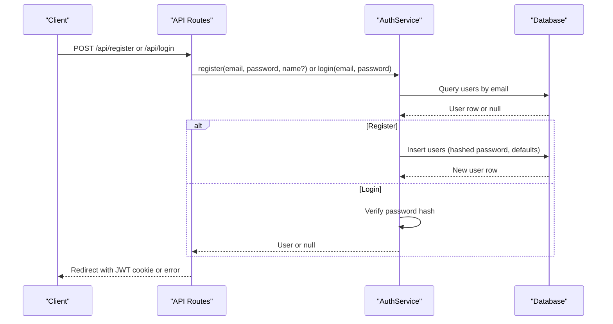
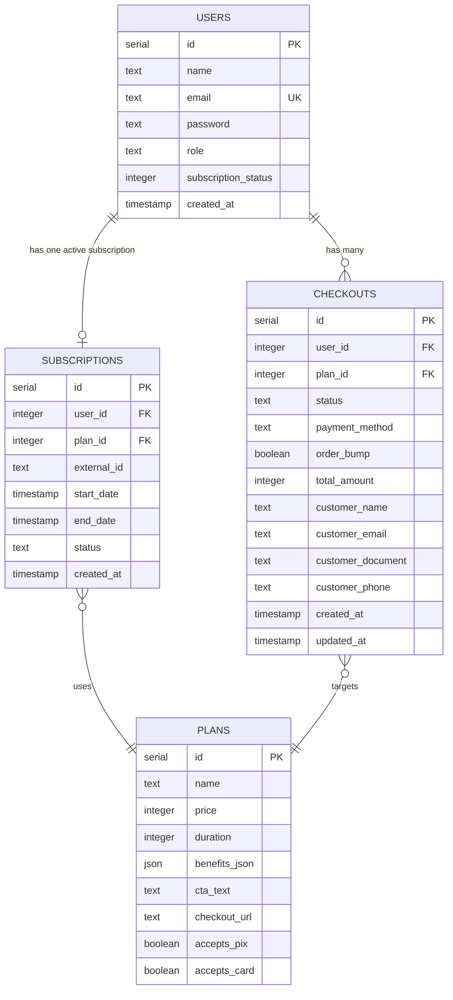
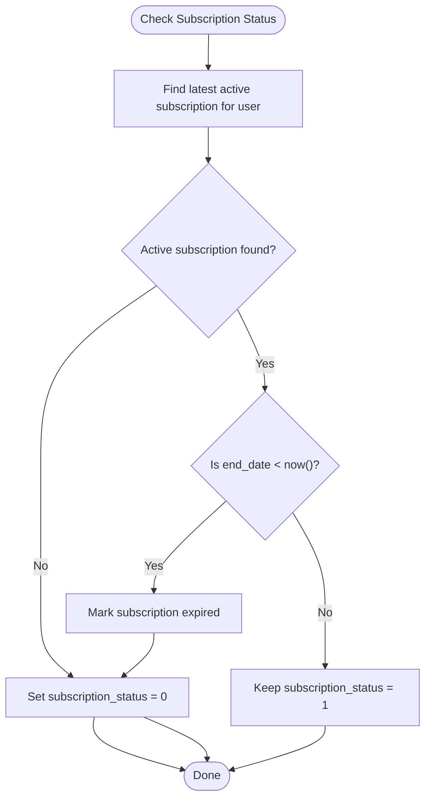
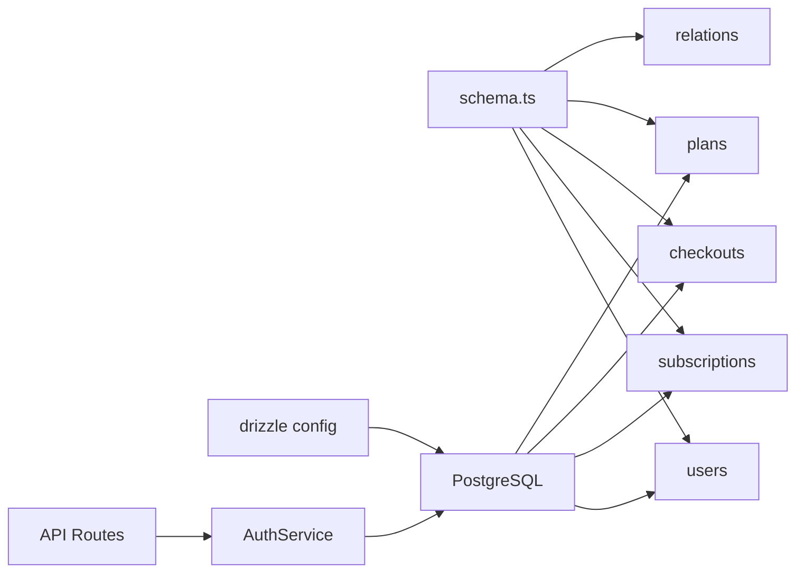

# Users Model

<cite>
**Referenced Files in This Document**
- [schema.ts](file://src/db/schema.ts)
- [index.ts](file://src/db/index.ts)
- [auth.ts](file://src/services/auth.ts)
- [api.tsx](file://src/routes/api.tsx)
- [0000_special_white_queen.sql](file://drizzle/0000_special_white_queen.sql)
- [0001_chunky_thunderbolts.sql](file://drizzle/0001_chunky_thunderbolts.sql)
- [0002_sparkling_madripoor.sql](file://drizzle/0002_sparkling_madripoor.sql)
- [0003_deep_thunderbird.sql](file://drizzle/0003_deep_thunderbird.sql)
- [0004_mixed_vermin.sql](file://drizzle/0004_mixed_vermin.sql)
- [0005_furry_catseye.sql](file://drizzle/0005_furry_catseye.sql)
- [0006_overconfident_titania.sql](file://drizzle/0006_overconfident_titania.sql)
- [0004_snapshot.json](file://drizzle/meta/0004_snapshot.json)
- [0003_snapshot.json](file://drizzle/meta/0003_snapshot.json)
</cite>

## Table of Contents
1. [Introduction](#introduction)
2. [Project Structure](#project-structure)
3. [Core Components](#core-components)
4. [Architecture Overview](#architecture-overview)
5. [Detailed Component Analysis](#detailed-component-analysis)
6. [Dependency Analysis](#dependency-analysis)
7. [Performance Considerations](#performance-considerations)
8. [Troubleshooting Guide](#troubleshooting-guide)
9. [Conclusion](#conclusion)
10. [Appendices](#appendices)

## Introduction
This document provides comprehensive documentation for the Users data model. It defines all fields, enumerations, constraints, relationships, validation rules, data types, indexing strategies, and operational patterns. It also explains how the Users model relates to Subscriptions and Checkouts tables and outlines typical user management queries and workflows.

## Project Structure
The Users model is defined in the database schema and is used by the application’s database client and services. The schema file declares the table structure, constraints, and relations. Migration files show the evolution of the Users table across versions. The database client connects to PostgreSQL via Drizzle ORM.

```mermaid
graph TB
subgraph "Database Layer"
U["users table<br/>fields: id, name, email, password, role, subscription_status, created_at"]
S["subscriptions table<br/>fields: id, user_id, plan_id, external_id, start_date, end_date, status, created_at"]
C["checkouts table<br/>fields: id, user_id, plan_id, status, payment_method, order_bump, total_amount, customer_* fields, created_at, updated_at"]
P["plans table<br/>fields: id, name, price, duration, benefits_json, cta_text, checkout_url, accepts_pix, accepts_card"]
end
subgraph "Application Layer"
D["Drizzle Client<br/>src/db/index.ts"]
SC["Schema Definition<br/>src/db/schema.ts"]
AS["AuthService<br/>src/services/auth.ts"]
AR["API Routes<br/>src/routes/api.tsx"]
end
SC --> D
AS --> D
AR --> AS
SC --> U
SC --> S
SC --> C
SC --> P
U <- --> S
U <- --> C
S --> P
C --> P
```

**Diagram sources**
- [schema.ts](file://src/db/schema.ts#L6-L14)
- [schema.ts](file://src/db/schema.ts#L37-L46)
- [schema.ts](file://src/db/schema.ts#L113-L127)
- [schema.ts](file://src/db/schema.ts#L16-L27)
- [index.ts](file://src/db/index.ts#L1-L8)
- [auth.ts](file://src/services/auth.ts#L1-L91)
- [api.tsx](file://src/routes/api.tsx#L321-L365)

**Section sources**
- [schema.ts](file://src/db/schema.ts#L1-L178)
- [index.ts](file://src/db/index.ts#L1-L8)

## Core Components
- Users table: central identity and profile holder for registered users.
- Subscriptions table: tracks user membership plans and statuses.
- Checkouts table: captures purchase attempts and transactions associated with users.
- Plans table: defines pricing tiers and durations.

Field definitions and constraints:
- id: serial primary key
- name: text, nullable
- email: text, not null, unique
- password: text, not null
- role: text enum ['admin', 'user'], default 'user'
- subscriptionStatus: integer, default 0 (non-subscriber)
- createdAt: timestamp, default now()

Relationships:
- users.id → subscriptions.user_id (one-to-one via relations)
- users.id → checkouts.user_id (one-to-many)
- subscriptions.plan_id → plans.id (many-to-one)
- checkouts.plan_id → plans.id (many-to-one)

Validation and data handling:
- Email uniqueness enforced at the database level.
- Passwords are hashed before insertion and verified during login.
- Subscription status is managed automatically based on active/expired subscriptions.

**Section sources**
- [schema.ts](file://src/db/schema.ts#L6-L14)
- [schema.ts](file://src/db/schema.ts#L37-L46)
- [schema.ts](file://src/db/schema.ts#L113-L127)
- [schema.ts](file://src/db/schema.ts#L129-L137)
- [auth.ts](file://src/services/auth.ts#L6-L39)
- [0000_special_white_queen.sql](file://drizzle/0000_special_white_queen.sql#L35-L43)
- [0001_chunky_thunderbolts.sql](file://drizzle/0001_chunky_thunderbolts.sql#L11-L12)

## Architecture Overview
The Users model participates in two major workflows:
- Authentication: registration and login with password hashing and verification.
- Subscription lifecycle: creation of subscriptions linked to plans and automatic status updates.



**Diagram sources**
- [api.tsx](file://src/routes/api.tsx#L321-L365)
- [auth.ts](file://src/services/auth.ts#L6-L39)

## Detailed Component Analysis

### Users Table Schema and Constraints
- Fields and types:
  - id: serial (primary key)
  - name: text (nullable)
  - email: text (not null, unique)
  - password: text (not null)
  - role: text enum ['admin', 'user'] (default 'user')
  - subscriptionStatus: integer (default 0)
  - createdAt: timestamp (default now())
- Unique constraint: email is unique.
- Indexes: none declared in schema snapshot; email uniqueness implies an index-backed unique constraint.



**Diagram sources**
- [schema.ts](file://src/db/schema.ts#L6-L14)
- [schema.ts](file://src/db/schema.ts#L37-L46)
- [schema.ts](file://src/db/schema.ts#L113-L127)
- [schema.ts](file://src/db/schema.ts#L16-L27)

**Section sources**
- [schema.ts](file://src/db/schema.ts#L6-L14)
- [0003_snapshot.json](file://drizzle/meta/0003_snapshot.json#L366-L370)
- [0004_snapshot.json](file://drizzle/meta/0004_snapshot.json#L366-L370)

### Role Enumeration
- Values: 'admin', 'user'
- Default: 'user'
- Usage: stored as text with enum-like restriction; used for access control and administrative features.

**Section sources**
- [schema.ts](file://src/db/schema.ts#L11-L11)

### Subscription Status Numeric Codes
- 0: Non-subscriber
- 1: Subscriber (active subscription detected)
- Automatic update occurs when checking subscription status; expired subscriptions reset status to 0.



**Diagram sources**
- [auth.ts](file://src/services/auth.ts#L67-L89)

**Section sources**
- [auth.ts](file://src/services/auth.ts#L60-L89)
- [0001_chunky_thunderbolts.sql](file://drizzle/0001_chunky_thunderbolts.sql#L11-L12)

### Email Uniqueness Constraint
- Enforced at the database level via unique index/constraint.
- Registration rejects duplicate emails.
- Login queries by email to locate the user.

**Section sources**
- [0000_special_white_queen.sql](file://drizzle/0000_special_white_queen.sql#L42-L42)
- [auth.ts](file://src/services/auth.ts#L9-L15)
- [auth.ts](file://src/services/auth.ts#L29-L31)

### Password Handling
- Registration hashes passwords before storing.
- Login verifies provided password against stored hash.

**Section sources**
- [auth.ts](file://src/services/auth.ts#L7-L7)
- [auth.ts](file://src/services/auth.ts#L35-L36)

### Relationship with Subscriptions and Checkouts
- One-to-one relation via users.subscription and subscriptions.user_id.
- One-to-many relation via users.checkouts and checkouts.user_id.
- Both subscriptions and checkouts reference plans via plan_id.

**Section sources**
- [schema.ts](file://src/db/schema.ts#L131-L137)
- [schema.ts](file://src/db/schema.ts#L139-L148)
- [schema.ts](file://src/db/schema.ts#L150-L159)

### Validation Rules and Data Type Specifications
- Not-null constraints apply to email, password, and plan duration (via plans).
- Enumerations restrict role and status fields to predefined values.
- Default values for role ('user'), subscription_status (0), and timestamps (now()).

**Section sources**
- [schema.ts](file://src/db/schema.ts#L9-L13)
- [schema.ts](file://src/db/schema.ts#L16-L27)
- [schema.ts](file://src/db/schema.ts#L44-L44)

### Indexing Strategies
- No explicit indexes are declared in the schema snapshot for users.
- Email uniqueness implies an index-backed unique constraint.
- Consider adding indexes on frequently queried columns (e.g., role, created_at) if query performance requires it.

**Section sources**
- [0003_snapshot.json](file://drizzle/meta/0003_snapshot.json#L400-L410)
- [0004_snapshot.json](file://drizzle/meta/0004_snapshot.json#L400-L410)

### Sample User Records
- Minimal user: id, email, password, role='user', subscriptionStatus=0, created_at=<current timestamp>
- Admin user: role='admin'
- Named user: name set to a non-null text value

Note: These are conceptual examples to illustrate field usage.

### Common Query Patterns for User Management
- Find user by email (login):
  - Query users where email equals input email.
- Register new user:
  - Insert users with hashed password, optional name, default role and subscriptionStatus.
- Update subscription status:
  - After creating or expiring a subscription, update users.subscriptionStatus accordingly.
- List users by role:
  - Query users where role equals desired value (e.g., 'admin').
- Get user with related subscriptions/checkouts:
  - Use relations to fetch user along with subscription and/or checkouts.

**Section sources**
- [auth.ts](file://src/services/auth.ts#L9-L15)
- [auth.ts](file://src/services/auth.ts#L29-L39)
- [auth.ts](file://src/services/auth.ts#L41-L65)
- [schema.ts](file://src/db/schema.ts#L131-L137)

## Dependency Analysis
The Users model depends on:
- Drizzle ORM schema definition and relations.
- PostgreSQL database with unique constraints and foreign keys.
- Application services for authentication and subscription management.



**Diagram sources**
- [schema.ts](file://src/db/schema.ts#L1-L178)
- [drizzle.config.ts](file://drizzle.config.ts#L1-L11)

**Section sources**
- [schema.ts](file://src/db/schema.ts#L1-L178)
- [drizzle.config.ts](file://drizzle.config.ts#L1-L11)

## Performance Considerations
- Email uniqueness ensures fast lookups but may require monitoring for write contention during registration bursts.
- Consider adding indexes on role and created_at if frequent filtering or sorting by these fields becomes necessary.
- Batch operations for subscription status updates should leverage server-side logic to minimize round-trips.

## Troubleshooting Guide
- Duplicate email on registration:
  - Symptom: Insert fails due to unique constraint.
  - Resolution: Prompt user to use another email or initiate password reset flow.
- Invalid credentials on login:
  - Symptom: Login returns null after password verification.
  - Resolution: Inform user of invalid credentials and allow retry.
- Expired subscription not reflected:
  - Symptom: User remains marked as subscriber despite expiry.
  - Resolution: Trigger subscription status check to update users.subscriptionStatus to 0 and mark subscription as expired.

**Section sources**
- [auth.ts](file://src/services/auth.ts#L13-L15)
- [auth.ts](file://src/services/auth.ts#L35-L36)
- [auth.ts](file://src/services/auth.ts#L76-L89)

## Conclusion
The Users model is a foundational component with clear constraints, enums, and relationships. Its design supports secure authentication, flexible subscription management, and straightforward integration with checkout workflows. Proper indexing and consistent use of relations enable efficient querying and maintain referential integrity.

## Appendices

### Migration History Impacting Users
- Initial users table with email/password/role/subscription_status/created_at and email unique constraint.
- Added name column.
- Converted subscription_status to integer with default 0.
- Adjusted subscriptions table to reference users and plans.

**Section sources**
- [0000_special_white_queen.sql](file://drizzle/0000_special_white_queen.sql#L35-L43)
- [0003_deep_thunderbird.sql](file://drizzle/0003_deep_thunderbird.sql#L1-L1)
- [0001_chunky_thunderbolts.sql](file://drizzle/0001_chunky_thunderbolts.sql#L11-L12)
- [0004_mixed_vermin.sql](file://drizzle/0004_mixed_vermin.sql#L9-L12)
- [0006_overconfident_titania.sql](file://drizzle/0006_overconfident_titania.sql#L17-L17)