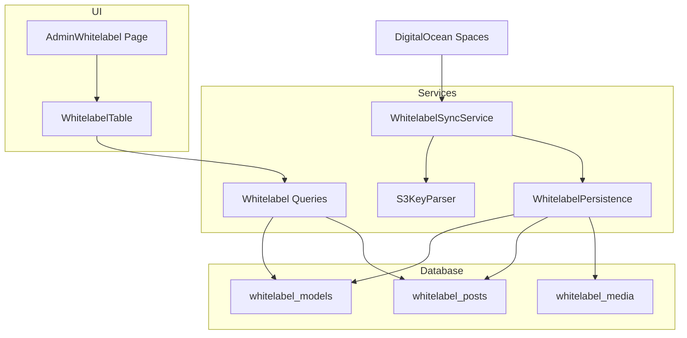
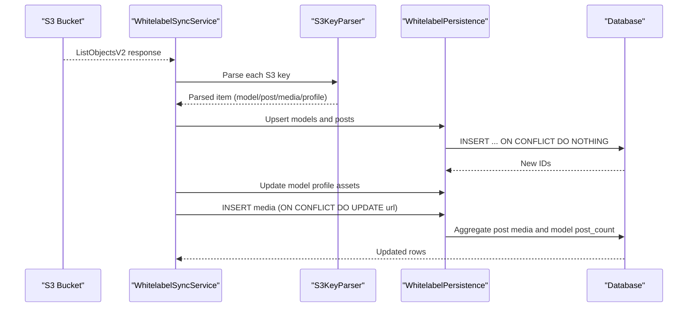
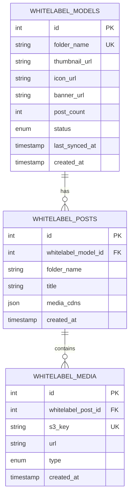
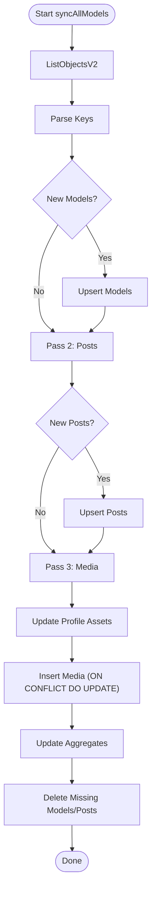
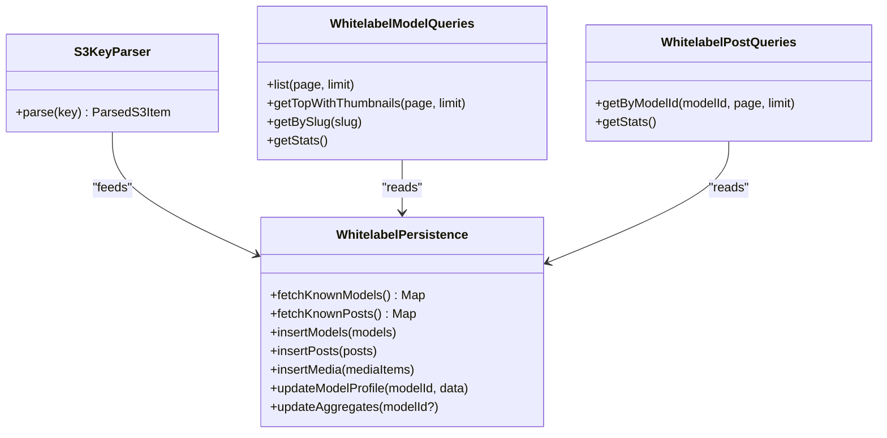
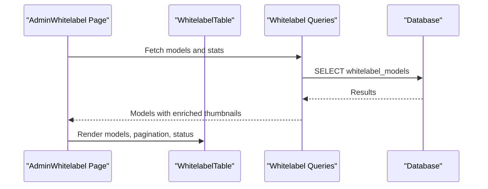
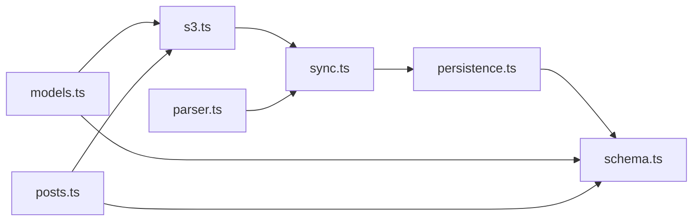

# White-label Models

<cite>
**Referenced Files in This Document**
- [schema.ts](file://src/db/schema.ts)
- [whitelabel.ts](file://src/services/whitelabel.ts)
- [sync.ts](file://src/services/whitelabel/sync.ts)
- [parser.ts](file://src/services/whitelabel/sync/parser.ts)
- [persistence.ts](file://src/services/whitelabel/sync/persistence.ts)
- [models.ts](file://src/services/whitelabel/queries/models.ts)
- [posts.ts](file://src/services/whitelabel/queries/posts.ts)
- [s3.ts](file://src/services/s3.ts)
- [WhitelabelTable.tsx](file://src/components/organisms/WhitelabelTable.tsx)
- [Whitelabel.tsx](file://src/pages/admin/Whitelabel.tsx)
- [0000_special_white_queen.sql](file://drizzle/0000_special_white_queen.sql)
</cite>

## Table of Contents
1. [Introduction](#introduction)
2. [Project Structure](#project-structure)
3. [Core Components](#core-components)
4. [Architecture Overview](#architecture-overview)
5. [Detailed Component Analysis](#detailed-component-analysis)
6. [Dependency Analysis](#dependency-analysis)
7. [Performance Considerations](#performance-considerations)
8. [Troubleshooting Guide](#troubleshooting-guide)
9. [Conclusion](#conclusion)
10. [Appendices](#appendices)

## Introduction
This document describes the White-label Models data model and the ingestion pipeline that synchronizes content from a DigitalOcean Spaces bucket into the application’s database. It defines the schema, field semantics, synchronization behavior, and relationships with whitelabel posts and media. It also outlines business rules for content approval, synchronization status tracking, and multi-tenant content management via per-model folders. Finally, it provides examples of configuration and common queries for content ingestion.

## Project Structure
The white-label ingestion system spans database definitions, service orchestration, parsing, persistence, and presentation layers:
- Database schema defines three core tables: whitelabel_models, whitelabel_posts, and whitelabel_media.
- Services coordinate S3 listing, parsing, and persistence of models, posts, and media.
- Queries expose read APIs for models and posts, including signed URLs for secure asset access.
- UI components present the sync status and allow administrative actions.

**Diagram sources**
- [schema.ts](file://src/db/schema.ts#L73-L103)
- [sync.ts](file://src/services/whitelabel/sync.ts#L6-L334)
- [parser.ts](file://src/services/whitelabel/sync/parser.ts#L10-L59)
- [persistence.ts](file://src/services/whitelabel/sync/persistence.ts#L5-L94)
- [models.ts](file://src/services/whitelabel/queries/models.ts#L6-L94)
- [posts.ts](file://src/services/whitelabel/queries/posts.ts#L6-L47)
- [WhitelabelTable.tsx](file://src/components/organisms/WhitelabelTable.tsx#L11-L111)
- [Whitelabel.tsx](file://src/pages/admin/Whitelabel.tsx#L15-L30)

**Section sources**
- [schema.ts](file://src/db/schema.ts#L73-L103)
- [sync.ts](file://src/services/whitelabel/sync.ts#L6-L334)
- [parser.ts](file://src/services/whitelabel/sync/parser.ts#L10-L59)
- [persistence.ts](file://src/services/whitelabel/sync/persistence.ts#L5-L94)
- [models.ts](file://src/services/whitelabel/queries/models.ts#L6-L94)
- [posts.ts](file://src/services/whitelabel/queries/posts.ts#L6-L47)
- [WhitelabelTable.tsx](file://src/components/organisms/WhitelabelTable.tsx#L11-L111)
- [Whitelabel.tsx](file://src/pages/admin/Whitelabel.tsx#L15-L30)

## Core Components
- whitelabel_models: Represents a white-label model with a unique folder name, profile assets, post count, status, and timestamps.
- whitelabel_posts: Represents a post within a model, linked to the model and containing aggregated media CDN URLs.
- whitelabel_media: Stores individual media entries per post, keyed by S3 key and typed as image or video.

Key fields and semantics:
- folderName: Unique identifier for the model; corresponds to the top-level S3 folder.
- thumbnailUrl, iconUrl, bannerUrl: Profile assets; may be updated during sync.
- postCount: Denormalized count of posts per model; updated after sync.
- status: Enumeration with values new, active, hidden; used for approval and visibility.
- lastSyncedAt: Timestamp of the last synchronization.
- createdAt: Creation timestamp for audit and ordering.
- folderName: Unique composite constraint with whitelabel_model_id ensures one post per model per folder.
- media_cdns: JSON blob aggregating signed CDN URLs for images and videos per post.
- s3Key: Unique key for media; used to detect duplicates and update URLs on conflict.

**Section sources**
- [schema.ts](file://src/db/schema.ts#L73-L103)
- [0000_special_white_queen.sql](file://drizzle/0000_special_white_queen.sql#L55-L76)

## Architecture Overview
The ingestion pipeline follows a three-pass process:
1. Discover models and posts by scanning S3 objects and parsing keys.
2. Insert new models and posts, then update model profile assets.
3. Insert media entries and rebuild post-level media aggregates.

**Diagram sources**
- [sync.ts](file://src/services/whitelabel/sync.ts#L6-L197)
- [parser.ts](file://src/services/whitelabel/sync/parser.ts#L10-L59)
- [persistence.ts](file://src/services/whitelabel/sync/persistence.ts#L5-L94)

## Detailed Component Analysis

### Data Model and Relationships
The schema enforces referential integrity and uniqueness:
- whitelabel_posts has a unique composite key on (whitelabel_model_id, folder_name).
- whitelabel_media has a unique key on s3_key and cascading deletes on post deletion.
- Relations define parent-child relationships for traversal and joins.

**Diagram sources**
- [schema.ts](file://src/db/schema.ts#L73-L103)

**Section sources**
- [schema.ts](file://src/db/schema.ts#L73-L103)

### Synchronization Workflow
The sync service performs:
- Listing S3 objects with pagination and continuation tokens.
- Parsing keys into model, post, media, and profile media categories.
- Two-phase post creation to ensure model IDs exist before inserting posts.
- Aggregation updates for post media and model post counts.

**Diagram sources**
- [sync.ts](file://src/services/whitelabel/sync.ts#L6-L197)
- [persistence.ts](file://src/services/whitelabel/sync/persistence.ts#L63-L92)

**Section sources**
- [sync.ts](file://src/services/whitelabel/sync.ts#L6-L197)
- [persistence.ts](file://src/services/whitelabel/sync/persistence.ts#L5-L94)

### Key Processing Logic
- S3KeyParser categorizes keys into model, post, media, and profile media, and detects image/video types.
- Persistence layer manages upserts, deletions, and aggregate recomputation.
- Queries enrich results with signed URLs and compute thumbnails.

**Diagram sources**
- [parser.ts](file://src/services/whitelabel/sync/parser.ts#L10-L59)
- [persistence.ts](file://src/services/whitelabel/sync/persistence.ts#L5-L94)
- [models.ts](file://src/services/whitelabel/queries/models.ts#L6-L94)
- [posts.ts](file://src/services/whitelabel/queries/posts.ts#L6-L47)

**Section sources**
- [parser.ts](file://src/services/whitelabel/sync/parser.ts#L10-L59)
- [persistence.ts](file://src/services/whitelabel/sync/persistence.ts#L5-L94)
- [models.ts](file://src/services/whitelabel/queries/models.ts#L6-L94)
- [posts.ts](file://src/services/whitelabel/queries/posts.ts#L6-L47)

### Presentation Layer
- AdminWhitelabel page renders sync status and statistics.
- WhitelabelTable displays models with folder names, post counts, status, and import actions.

**Diagram sources**
- [Whitelabel.tsx](file://src/pages/admin/Whitelabel.tsx#L15-L30)
- [WhitelabelTable.tsx](file://src/components/organisms/WhitelabelTable.tsx#L11-L111)
- [models.ts](file://src/services/whitelabel/queries/models.ts#L36-L57)

**Section sources**
- [Whitelabel.tsx](file://src/pages/admin/Whitelabel.tsx#L15-L30)
- [WhitelabelTable.tsx](file://src/components/organisms/WhitelabelTable.tsx#L11-L111)
- [models.ts](file://src/services/whitelabel/queries/models.ts#L36-L57)

## Dependency Analysis
- Services depend on S3 client configuration and the parser to interpret keys.
- Persistence depends on the schema definitions and Drizzle ORM for SQL generation.
- Queries depend on persistence and S3 signing utilities to produce secure URLs.

**Diagram sources**
- [s3.ts](file://src/services/s3.ts#L1-L48)
- [sync.ts](file://src/services/whitelabel/sync.ts#L1-L5)
- [parser.ts](file://src/services/whitelabel/sync/parser.ts#L10-L59)
- [persistence.ts](file://src/services/whitelabel/sync/persistence.ts#L1-L4)
- [schema.ts](file://src/db/schema.ts#L1-L103)
- [models.ts](file://src/services/whitelabel/queries/models.ts#L1-L4)
- [posts.ts](file://src/services/whitelabel/queries/posts.ts#L1-L4)

**Section sources**
- [s3.ts](file://src/services/s3.ts#L1-L48)
- [sync.ts](file://src/services/whitelabel/sync.ts#L1-L5)
- [parser.ts](file://src/services/whitelabel/sync/parser.ts#L10-L59)
- [persistence.ts](file://src/services/whitelabel/sync/persistence.ts#L1-L4)
- [schema.ts](file://src/db/schema.ts#L1-L103)
- [models.ts](file://src/services/whitelabel/queries/models.ts#L1-L4)
- [posts.ts](file://src/services/whitelabel/queries/posts.ts#L1-L4)

## Performance Considerations
- Batch sizing: The sync uses a fixed page size for S3 listing; consider tuning for large datasets.
- Conflict handling: Media upsert uses ON CONFLICT DO UPDATE to avoid redundant writes.
- Aggregation updates: Recompute post media and model post counts after bulk inserts to maintain consistency.
- Signed URL caching: Consider caching signed URLs at the application layer to reduce repeated signing overhead.

[No sources needed since this section provides general guidance]

## Troubleshooting Guide
Common issues and resolutions:
- Missing model IDs during post insertion: Ensure two passes are executed so models exist before posts.
- Deleted content not reflected: Verify deletion logic runs after listing and that aggregates are updated afterward.
- Incorrect media types: Confirm parser regexes for images and videos match actual filenames.
- Signed URL failures: Validate S3 credentials and bucket permissions; confirm key normalization for special characters.

Operational checks:
- Confirm S3 bucket listing returns expected prefixes and keys.
- Validate uniqueness constraints for folder_name and s3_key.
- Monitor last_synced_at to track freshness.

**Section sources**
- [sync.ts](file://src/services/whitelabel/sync.ts#L77-L197)
- [persistence.ts](file://src/services/whitelabel/sync/persistence.ts#L45-L92)
- [parser.ts](file://src/services/whitelabel/sync/parser.ts#L10-L59)
- [s3.ts](file://src/services/s3.ts#L25-L47)

## Conclusion
The white-label ingestion system cleanly maps S3 folder structures to database entities, supports robust synchronization with deletion cleanup, and exposes secure, signed URLs for media consumption. The design balances simplicity with reliability, enabling multi-tenant content management through per-model folders and status-driven approval workflows.

[No sources needed since this section summarizes without analyzing specific files]

## Appendices

### Field Definitions Reference
- whitelabel_models
  - folder_name: Unique model identifier (top-level S3 folder).
  - thumbnail_url, icon_url, banner_url: Profile assets.
  - post_count: Denormalized post count.
  - status: Enumeration new | active | hidden.
  - last_synced_at: Timestamp of last sync.
  - created_at: Audit timestamp.
- whitelabel_posts
  - whitelabel_model_id: Parent model.
  - folder_name: Post identifier (second-level S3 folder).
  - title: Human-readable label.
  - media_cdns: JSON { images: [...], videos: [...] }.
  - created_at: Audit timestamp.
- whitelabel_media
  - whitelabel_post_id: Parent post.
  - s3_key: Unique S3 key.
  - url: CDN URL.
  - type: image | video.
  - created_at: Audit timestamp.

**Section sources**
- [schema.ts](file://src/db/schema.ts#L73-L103)
- [0000_special_white_queen.sql](file://drizzle/0000_special_white_queen.sql#L55-L76)

### Business Rules
- Approval and Visibility:
  - status new indicates newly discovered content awaiting review.
  - status active makes content visible.
  - status hidden hides content without deletion.
- Multi-tenant Management:
  - Each model corresponds to a distinct S3 folder; content isolation is enforced by folder names.
- Synchronization Tracking:
  - last_synced_at reflects the latest successful sync; use it to monitor freshness.
- Content Organization:
  - Top-level folder: model.
  - Second-level folder: post.
  - Optional profile subfolder: profile icon/banners.

**Section sources**
- [schema.ts](file://src/db/schema.ts#L73-L83)
- [sync.ts](file://src/services/whitelabel/sync.ts#L108-L148)

### Examples and Common Queries
- List models with pagination and enriched thumbnails:
  - Use the list method with page and limit parameters.
  - Returns data with computed thumbnail URLs via signed S3 keys.
- Get top models by post count:
  - Use getTopWithThumbnails to retrieve models ordered by post_count.
- Get a model by folder name:
  - Use getBySlug with folder_name to retrieve model details with signed profile URLs.
- Get posts for a model:
  - Use getByModelId to fetch posts and sign media CDN URLs for images and videos.
- Admin stats:
  - Use getStats to retrieve counts for models, posts, and media.

**Section sources**
- [models.ts](file://src/services/whitelabel/queries/models.ts#L36-L94)
- [posts.ts](file://src/services/whitelabel/queries/posts.ts#L7-L47)
- [whitelabel.ts](file://src/services/whitelabel.ts#L19-L24)