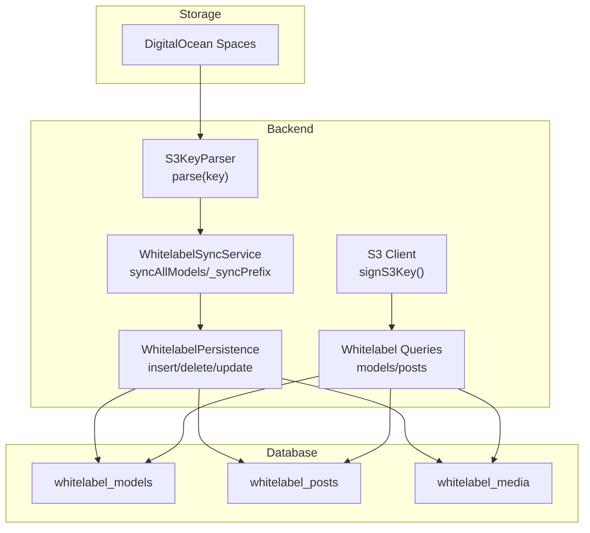
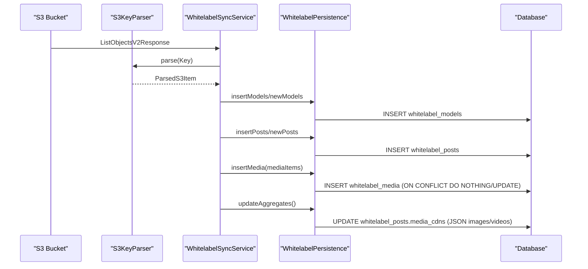
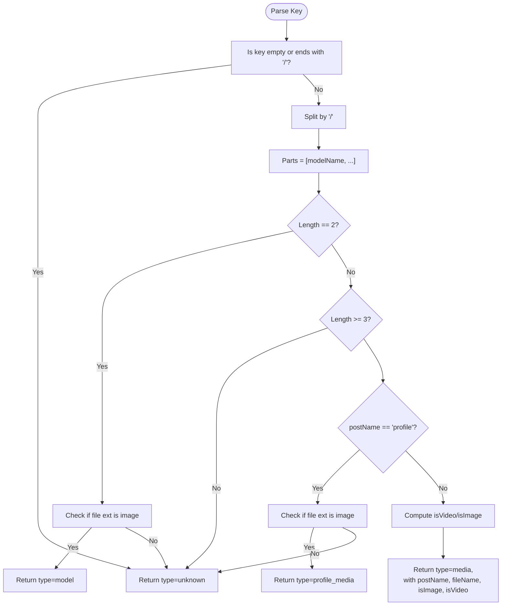
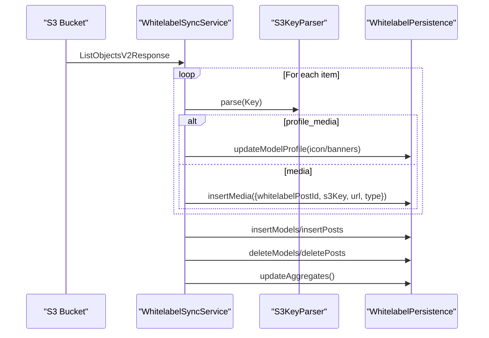
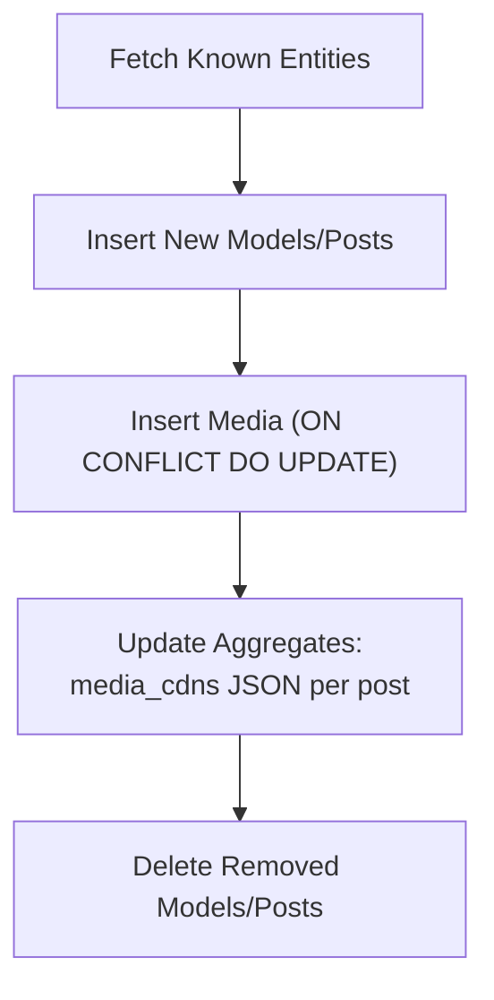
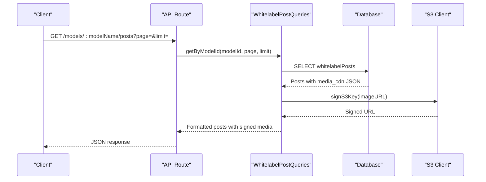
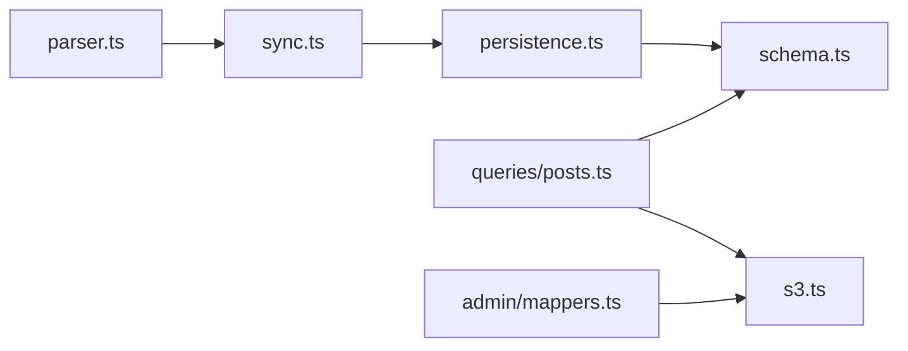

# White-label Posts & Media

<cite>
**Referenced Files in This Document**
- [schema.ts](file://src/db/schema.ts)
- [0006_snapshot.json](file://drizzle/meta/0006_snapshot.json)
- [parser.ts](file://src/services/whitelabel/sync/parser.ts)
- [persistence.ts](file://src/services/whitelabel/sync/persistence.ts)
- [sync.ts](file://src/services/whitelabel/sync.ts)
- [posts.ts](file://src/services/whitelabel/queries/posts.ts)
- [models.ts](file://src/services/whitelabel/queries/models.ts)
- [s3.ts](file://src/services/s3.ts)
- [storage.ts](file://src/utils/storage.ts)
- [whitelabel.ts](file://src/services/whitelabel.ts)
- [api.tsx](file://src/routes/api.tsx)
- [WhitelabelTable.tsx](file://src/components/organisms/WhitelabelTable.tsx)
- [AdminWhitelabel.tsx](file://src/pages/admin/Whitelabel.tsx)
- [mappers.ts](file://src/services/admin/mappers.ts)
</cite>

## Table of Contents
1. [Introduction](#introduction)
2. [Project Structure](#project-structure)
3. [Core Components](#core-components)
4. [Architecture Overview](#architecture-overview)
5. [Detailed Component Analysis](#detailed-component-analysis)
6. [Dependency Analysis](#dependency-analysis)
7. [Performance Considerations](#performance-considerations)
8. [Troubleshooting Guide](#troubleshooting-guide)
9. [Conclusion](#conclusion)
10. [Appendices](#appendices)

## Introduction
This document explains the White-label Posts and Media data models and their relationships. It covers:
- Posts table: folder name relationships, titles, CDN media arrays, and creation timestamps
- Media table: S3 key relationships, URL mappings, media types, and unique constraints
- Hierarchical relationships among whitelabel models, posts, and media
- Content parsing workflow, CDN integration patterns, and media validation processes
- Business rules for content deduplication, media quality checks, and storage optimization
- Examples of white-label content structures and common queries for media management

## Project Structure
The white-label system is implemented with:
- Database schema defining whitelabel models, posts, and media tables
- A synchronization pipeline that reads from DigitalOcean Spaces, parses keys, persists entities, and updates aggregates
- Query services that enrich data with signed URLs and statistics
- Frontend admin pages and components to display and manage white-label content

**Diagram sources**
- [parser.ts](file://src/services/whitelabel/sync/parser.ts#L10-L58)
- [sync.ts](file://src/services/whitelabel/sync.ts#L6-L197)
- [persistence.ts](file://src/services/whitelabel/sync/persistence.ts#L5-L94)
- [schema.ts](file://src/db/schema.ts#L73-L103)
- [s3.ts](file://src/services/s3.ts#L25-L47)

**Section sources**
- [schema.ts](file://src/db/schema.ts#L73-L103)
- [0006_snapshot.json](file://drizzle/meta/0006_snapshot.json#L676-L754)
- [parser.ts](file://src/services/whitelabel/sync/parser.ts#L10-L58)
- [sync.ts](file://src/services/whitelabel/sync.ts#L6-L197)
- [persistence.ts](file://src/services/whitelabel/sync/persistence.ts#L5-L94)
- [posts.ts](file://src/services/whitelabel/queries/posts.ts#L6-L46)
- [models.ts](file://src/services/whitelabel/queries/models.ts#L6-L93)
- [s3.ts](file://src/services/s3.ts#L25-L47)

## Core Components
- whitelabel_models: stores white-label brand metadata and counts
- whitelabel_posts: stores per-model post entries with folderName and CDN media aggregation
- whitelabel_media: stores per-post media items with S3 key, URL, and type

Key constraints and relationships:
- Unique constraints: folder_name on whitelabel_models, s3_key on whitelabel_media
- Foreign keys: posts belong to a model; media belongs to a post with cascade delete
- Aggregation: posts store a JSON array of CDN URLs grouped by image/video

**Section sources**
- [schema.ts](file://src/db/schema.ts#L73-L103)
- [0006_snapshot.json](file://drizzle/meta/0006_snapshot.json#L676-L754)
- [0006_snapshot.json](file://drizzle/meta/0006_snapshot.json#L604-L675)

## Architecture Overview
The white-label ingestion pipeline follows a three-pass process:
1. Discover models and posts by scanning S3 keys
2. Insert new models and posts
3. Insert media items and update aggregates

CDN integration:
- Media URLs are constructed from S3 keys and signed using pre-signed URLs for controlled access

**Diagram sources**
- [sync.ts](file://src/services/whitelabel/sync.ts#L6-L197)
- [parser.ts](file://src/services/whitelabel/sync/parser.ts#L10-L58)
- [persistence.ts](file://src/services/whitelabel/sync/persistence.ts#L5-L94)
- [schema.ts](file://src/db/schema.ts#L85-L103)

## Detailed Component Analysis

### Data Model: whitelabel_models
- Purpose: represent white-label brands with metadata and counts
- Key fields:
  - folderName: unique identifier for the brand
  - thumbnailUrl/iconUrl/bannerUrl: optional branding assets
  - postCount: denormalized count updated by persistence
  - status: lifecycle state
  - lastSyncedAt/createdAt: timestamps

Business rules:
- folderName is unique; enforced at DB level
- postCount is recalculated after sync operations

**Section sources**
- [schema.ts](file://src/db/schema.ts#L73-L83)
- [0006_snapshot.json](file://drizzle/meta/0006_snapshot.json#L676-L754)
- [persistence.ts](file://src/services/whitelabel/sync/persistence.ts#L63-L92)

### Data Model: whitelabel_posts
- Purpose: represent per-model posts
- Key fields:
  - whitelabelModelId: foreign key to whitelabel_models
  - folderName: post identifier within the model
  - title: human-readable title
  - mediaCdns: JSON object containing images and videos arrays
  - createdAt: timestamp

Unique constraint:
- Composite unique on (whitelabelModelId, folderName)

Aggregation:
- mediaCdns is populated by persistence using JSON aggregation of whitelabel_media URLs

**Section sources**
- [schema.ts](file://src/db/schema.ts#L85-L94)
- [0006_snapshot.json](file://drizzle/meta/0006_snapshot.json#L755-L796)
- [persistence.ts](file://src/services/whitelabel/sync/persistence.ts#L63-L92)

### Data Model: whitelabel_media
- Purpose: store per-post media items
- Key fields:
  - whitelabelPostId: foreign key to whitelabel_posts
  - s3Key: unique S3 key
  - url: CDN URL derived from S3 key
  - type: enum image or video
  - createdAt: timestamp

Unique constraint:
- s3Key is unique; prevents duplicates

Cascade behavior:
- Deleting a post cascades to its media

**Section sources**
- [schema.ts](file://src/db/schema.ts#L96-L103)
- [0006_snapshot.json](file://drizzle/meta/0006_snapshot.json#L604-L675)
- [persistence.ts](file://src/services/whitelabel/sync/persistence.ts#L45-L54)

### Content Parsing Workflow (S3KeyParser)
The parser interprets S3 keys into typed items:
- Model-level images: "ModelName/file.jpg" → type model
- Profile media: "ModelName/profile/file.ext" → type profile_media
- Post media: "ModelName/PostName/file.ext" → type media with postName
- Unknown: empty or trailing slash keys

Type detection:
- Images: common image extensions
- Videos: common video extensions

**Diagram sources**
- [parser.ts](file://src/services/whitelabel/sync/parser.ts#L10-L58)

**Section sources**
- [parser.ts](file://src/services/whitelabel/sync/parser.ts#L10-L58)

### Synchronization Pipeline (WhitelabelSyncService)
Three-pass processing:
1) Discover models and posts by scanning S3 keys; insert new models and posts
2) Re-scan to ensure model IDs are available; finalize post inserts
3) Process media items; compute CDN URLs; insert media; update aggregates

Deletions:
- Models and posts not seen during sync are deleted to keep the DB in sync with S3

CDN URL construction:
- Constructed from bucket and region constants; keys are percent-encoded

**Diagram sources**
- [sync.ts](file://src/services/whitelabel/sync.ts#L6-L197)
- [parser.ts](file://src/services/whitelabel/sync/parser.ts#L10-L58)
- [persistence.ts](file://src/services/whitelabel/sync/persistence.ts#L5-L94)

**Section sources**
- [sync.ts](file://src/services/whitelabel/sync.ts#L6-L197)
- [persistence.ts](file://src/services/whitelabel/sync/persistence.ts#L5-L94)

### Persistence Layer (WhitelabelPersistence)
- fetchKnownModels/fetchKnownPosts: maintain in-memory maps for conflict-free upserts
- insertModels/insertPosts: insert new entities with conflict handling
- insertMedia: insert media with ON CONFLICT DO NOTHING/UPDATE to prevent duplicates and refresh URLs
- updateModelProfile: update model icon/banners when profile media is detected
- updateAggregates: compute post-level media_cdn JSON aggregating images and videos

**Diagram sources**
- [persistence.ts](file://src/services/whitelabel/sync/persistence.ts#L5-L94)

**Section sources**
- [persistence.ts](file://src/services/whitelabel/sync/persistence.ts#L5-L94)

### Query Services and CDN Integration
- WhitelabelPostQueries.getByModelId:
  - Loads posts for a model
  - Parses media_cdn JSON and signs each URL for access
  - Returns signed images and videos arrays plus a thumbnail
- WhitelabelModelQueries._enrichWithThumbnails:
  - Joins posts/media to find a representative image per model
  - Signs the chosen S3 key for delivery
- signS3Key:
  - Generates pre-signed URLs with a 1-hour expiry
  - Handles full URLs and special characters

**Diagram sources**
- [api.tsx](file://src/routes/api.tsx#L295-L313)
- [posts.ts](file://src/services/whitelabel/queries/posts.ts#L6-L46)
- [s3.ts](file://src/services/s3.ts#L25-L47)

**Section sources**
- [posts.ts](file://src/services/whitelabel/queries/posts.ts#L6-L46)
- [models.ts](file://src/services/whitelabel/queries/models.ts#L6-L93)
- [s3.ts](file://src/services/s3.ts#L25-L47)

### Admin Mapping and Production Import
- AdminMappers:
  - mapModelToProduction: converts staged whitelabel_models to production models
  - mapPostToProduction: selects primary media (prefer video fallback), signs S3 key, and builds contentUrl/type

**Section sources**
- [mappers.ts](file://src/services/admin/mappers.ts#L3-L39)

### Frontend Admin Pages
- AdminWhitelabel page renders stats and a table of whitelabel models
- WhitelabelTable displays model thumbnails, post counts, and status, with pagination controls

**Section sources**
- [AdminWhitelabel.tsx](file://src/pages/admin/Whitelabel.tsx#L15-L29)
- [WhitelabelTable.tsx](file://src/components/organisms/WhitelabelTable.tsx#L11-L111)

## Dependency Analysis
- Schema defines tables and relations
- Sync depends on Parser and Persistence
- Queries depend on schema and S3 client
- Admin mappers depend on S3 client for signing

**Diagram sources**
- [parser.ts](file://src/services/whitelabel/sync/parser.ts#L10-L58)
- [sync.ts](file://src/services/whitelabel/sync.ts#L6-L197)
- [persistence.ts](file://src/services/whitelabel/sync/persistence.ts#L5-L94)
- [schema.ts](file://src/db/schema.ts#L73-L103)
- [posts.ts](file://src/services/whitelabel/queries/posts.ts#L6-L46)
- [s3.ts](file://src/services/s3.ts#L25-L47)
- [mappers.ts](file://src/services/admin/mappers.ts#L3-L39)

**Section sources**
- [schema.ts](file://src/db/schema.ts#L73-L103)
- [sync.ts](file://src/services/whitelabel/sync.ts#L6-L197)
- [persistence.ts](file://src/services/whitelabel/sync/persistence.ts#L5-L94)
- [posts.ts](file://src/services/whitelabel/queries/posts.ts#L6-L46)
- [s3.ts](file://src/services/s3.ts#L25-L47)
- [mappers.ts](file://src/services/admin/mappers.ts#L3-L39)

## Performance Considerations
- Batch processing: sync processes items in batches with continuation tokens
- Conflict handling: insertions use ON CONFLICT DO NOTHING/UPDATE to minimize duplicate writes
- Aggregation: JSON aggregation is computed server-side and cached in media_cdn
- Signed URLs: pre-signing avoids exposing raw S3 URLs and reduces latency by delegating to CDN

[No sources needed since this section provides general guidance]

## Troubleshooting Guide
Common issues and resolutions:
- Missing or invalid S3 keys:
  - Verify bucket name and region configuration
  - Ensure keys do not contain unsupported characters
- Duplicate media entries:
  - s3Key uniqueness prevents duplicates; conflicts are handled by update logic
- Deleted content not reflected:
  - Ensure sync runs to detect absence and deletes removed models/posts
- Thumbnails not appearing:
  - Confirm profile media exists and is an image extension
  - Check that _enrichWithThumbnails filters by supported image extensions

**Section sources**
- [s3.ts](file://src/services/s3.ts#L4-L12)
- [persistence.ts](file://src/services/whitelabel/sync/persistence.ts#L45-L54)
- [sync.ts](file://src/services/whitelabel/sync.ts#L154-L196)
- [models.ts](file://src/services/whitelabel/queries/models.ts#L7-L34)

## Conclusion
The white-label system integrates DigitalOcean Spaces with a structured relational schema to manage brands, posts, and media. It uses a robust sync pipeline with conflict-free upserts, CDN URL generation, and aggregate caching to deliver efficient content discovery and administration.

[No sources needed since this section summarizes without analyzing specific files]

## Appendices

### Business Rules Summary
- Content deduplication:
  - s3Key uniqueness prevents duplicate media entries
  - ON CONFLICT DO NOTHING/UPDATE ensures idempotent inserts
- Media quality checks:
  - Parser validates file extensions to classify media types
  - Thumbnails are selected from supported image extensions
- Storage optimization:
  - Pre-signed URLs reduce exposure and leverage CDN caching
  - Aggregated media_cdn minimizes downstream processing

**Section sources**
- [schema.ts](file://src/db/schema.ts#L96-L103)
- [parser.ts](file://src/services/whitelabel/sync/parser.ts#L20-L54)
- [persistence.ts](file://src/services/whitelabel/sync/persistence.ts#L45-L54)
- [s3.ts](file://src/services/s3.ts#L25-L47)

### Example White-label Content Structures
- Model:
  - folderName: brand identifier
  - postCount: denormalized count
  - status: lifecycle state
- Post:
  - folderName: post identifier
  - title: human-readable title
  - mediaCdns: JSON object with images and videos arrays
- Media:
  - s3Key: unique S3 key
  - url: CDN URL
  - type: image or video

**Section sources**
- [schema.ts](file://src/db/schema.ts#L73-L103)
- [0006_snapshot.json](file://drizzle/meta/0006_snapshot.json#L676-L754)
- [0006_snapshot.json](file://drizzle/meta/0006_snapshot.json#L755-L796)
- [0006_snapshot.json](file://drizzle/meta/0006_snapshot.json#L604-L675)

### Common Queries for Media Management
- List top models by post count with thumbnails:
  - Uses _enrichWithThumbnails to join posts/media and sign a representative image
- Get model posts with signed media:
  - Loads posts and signs each image/video URL for immediate playback
- Retrieve stats:
  - Counts models, posts, and media for monitoring

**Section sources**
- [models.ts](file://src/services/whitelabel/queries/models.ts#L59-L93)
- [posts.ts](file://src/services/whitelabel/queries/posts.ts#L7-L46)
- [api.tsx](file://src/routes/api.tsx#L276-L313)