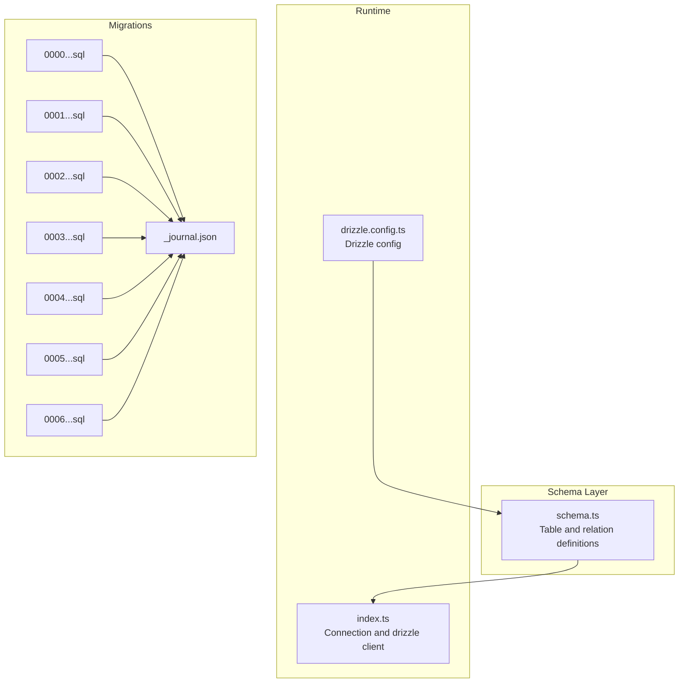
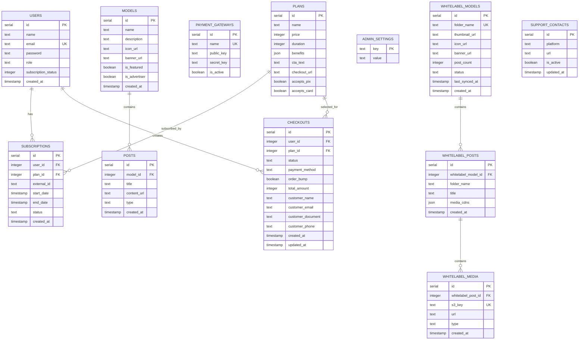
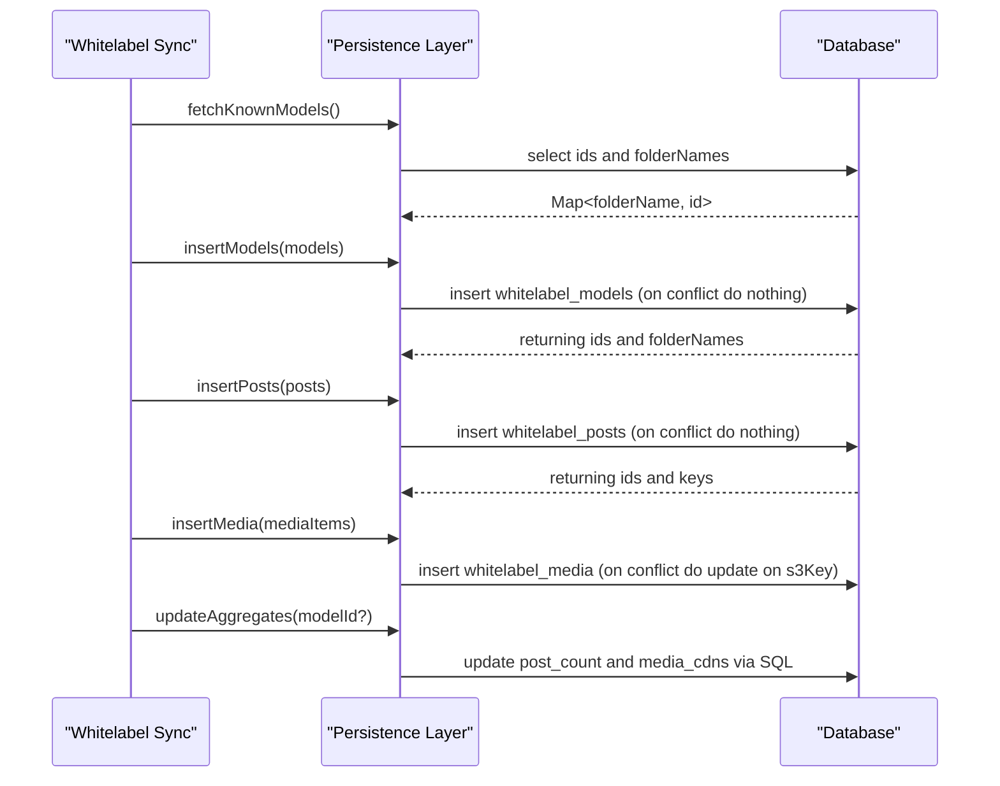
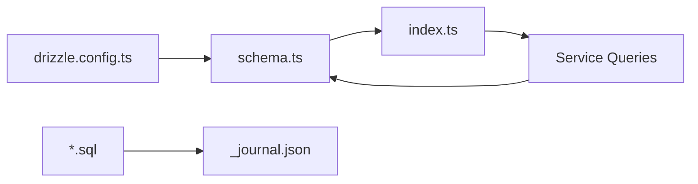

# Database Design

<cite>
**Referenced Files in This Document**
- [schema.ts](file://src/db/schema.ts)
- [index.ts](file://src/db/index.ts)
- [drizzle.config.ts](file://drizzle.config.ts)
- [0000_special_white_queen.sql](file://drizzle/0000_special_white_queen.sql)
- [0001_chunky_thunderbolts.sql](file://drizzle/0001_chunky_thunderbolts.sql)
- [0002_sparkling_madripoor.sql](file://drizzle/0002_sparkling_madripoor.sql)
- [0003_deep_thunderbird.sql](file://drizzle/0003_deep_thunderbird.sql)
- [0004_mixed_vermin.sql](file://drizzle/0004_mixed_vermin.sql)
- [0005_furry_catseye.sql](file://drizzle/0005_furry_catseye.sql)
- [0006_overconfident_titania.sql](file://drizzle/0006_overconfident_titania.sql)
- [_journal.json](file://drizzle/meta/_journal.json)
- [models.ts](file://src/services/whitelabel/queries/models.ts)
- [posts.ts](file://src/services/whitelabel/queries/posts.ts)
- [persistence.ts](file://src/services/whitelabel/sync/persistence.ts)
</cite>

## Table of Contents
1. [Introduction](#introduction)
2. [Project Structure](#project-structure)
3. [Core Components](#core-components)
4. [Architecture Overview](#architecture-overview)
5. [Detailed Component Analysis](#detailed-component-analysis)
6. [Dependency Analysis](#dependency-analysis)
7. [Performance Considerations](#performance-considerations)
8. [Troubleshooting Guide](#troubleshooting-guide)
9. [Conclusion](#conclusion)
10. [Appendices](#appendices)

## Introduction
This document describes the CreatorFlix database schema and data model. It covers entity definitions, relationships, constraints, indexes, and business rules related to users, subscriptions, plans, models, posts, checkouts, and administrative entities. It also documents data access patterns, synchronization strategies, and operational considerations derived from the schema and service implementations.

## Project Structure
The database layer is defined with Drizzle ORM and PostgreSQL. The schema is declared in TypeScript and migrated via Drizzle Kit. The connection is established at runtime using a connection string from environment variables.

**Diagram sources**
- [schema.ts](file://src/db/schema.ts#L1-L178)
- [index.ts](file://src/db/index.ts#L1-L8)
- [drizzle.config.ts](file://drizzle.config.ts#L1-L11)
- [0000_special_white_queen.sql](file://drizzle/0000_special_white_queen.sql#L1-L80)
- [0001_chunky_thunderbolts.sql](file://drizzle/0001_chunky_thunderbolts.sql#L1-L14)
- [0002_sparkling_madripoor.sql](file://drizzle/0002_sparkling_madripoor.sql#L1-L1)
- [0003_deep_thunderbird.sql](file://drizzle/0003_deep_thunderbird.sql#L1-L1)
- [0004_mixed_vermin.sql](file://drizzle/0004_mixed_vermin.sql#L1-L12)
- [0005_furry_catseye.sql](file://drizzle/0005_furry_catseye.sql#L1-L11)
- [0006_overconfident_titania.sql](file://drizzle/0006_overconfident_titania.sql#L1-L18)
- [_journal.json](file://drizzle/meta/_journal.json#L1-L55)

**Section sources**
- [schema.ts](file://src/db/schema.ts#L1-L178)
- [index.ts](file://src/db/index.ts#L1-L8)
- [drizzle.config.ts](file://drizzle.config.ts#L1-L11)
- [_journal.json](file://drizzle/meta/_journal.json#L1-L55)

## Core Components
This section enumerates entities, their fields, data types, constraints, and indexes, and highlights primary/foreign keys and unique constraints.

- Users
  - Fields: id (serial, PK), name (text), email (text, not null, unique), password (text, not null), role (text enum: admin, user, default user), subscriptionStatus (integer, default 0), createdAt (timestamp, default now)
  - Indexes/Constraints: unique(email); default role and subscriptionStatus
  - Notes: subscriptionStatus was altered to integer with default 0 in later migrations

- Plans
  - Fields: id (serial, PK), name (text, not null), price (integer, not null), duration (integer, not null), benefits (json), ctaText (text), checkoutUrl (text), acceptsPix (boolean, default true), acceptsCard (boolean, default true)
  - Indexes/Constraints: none explicitly defined beyond PK

- Payment Gateways
  - Fields: id (serial, PK), name (text, not null, unique), publicKey (text), secretKey (text), isActive (boolean, default false)
  - Indexes/Constraints: unique(name)

- Subscriptions
  - Fields: id (serial, PK), userId (integer, FK to users.id), planId (integer, FK to plans.id), externalId (text), startDate (timestamp), endDate (timestamp), status (text enum: active, expired, pending, default pending), createdAt (timestamp, default now)
  - Indexes/Constraints: FKs to users and plans; status default pending; start/end nullable per migration

- Models
  - Fields: id (serial, PK), name (text, not null), description (text), iconUrl (text), bannerUrl (text), isFeatured (boolean, default false), isAdvertiser (boolean, default false), createdAt (timestamp, default now)
  - Indexes/Constraints: none

- Posts
  - Fields: id (serial, PK), modelId (integer, FK to models.id), title (text), contentUrl (text, not null), type (text enum: image, video), createdAt (timestamp, default now)
  - Indexes/Constraints: FK to models; type not null

- Admin Settings
  - Fields: key (text, PK), value (text, not null)
  - Indexes/Constraints: primary key on key

- Whitelabel Models
  - Fields: id (serial, PK), folderName (text, not null, unique), thumbnailUrl (text), iconUrl (text), bannerUrl (text), postCount (integer, default 0), status (text enum: new, active, hidden, default new), lastSyncedAt (timestamp, default now), createdAt (timestamp, default now)
  - Indexes/Constraints: unique(folderName)

- Whitelabel Posts
  - Fields: id (serial, PK), whitelabelModelId (integer, FK to whitelabel_models.id, cascade delete), folderName (text, not null), title (text), mediaCdns (json), createdAt (timestamp, default now)
  - Indexes/Constraints: unique(whitelabelModelId, folderName)

- Whitelabel Media
  - Fields: id (serial, PK), whitelabelPostId (integer, FK to whitelabel_posts.id, cascade delete), s3Key (text, not null, unique), url (text), type (text enum: image, video), createdAt (timestamp, default now)
  - Indexes/Constraints: unique(s3Key)

- Support Contacts
  - Fields: id (serial, PK), platform (text, not null), url (text, not null), isActive (boolean, default true), updatedAt (timestamp, default now, on update now)
  - Indexes/Constraints: none

- Checkouts
  - Fields: id (serial, PK), userId (integer, FK to users.id), planId (integer, FK to plans.id), status (text enum: pending, paid, failed, abandoned, default pending), paymentMethod (text enum: pix, credit_card), orderBump (boolean, default false), totalAmount (integer, not null), customerName (text), customerEmail (text), customerDocument (text), customerPhone (text), createdAt (timestamp, default now), updatedAt (timestamp, default now, on update now)
  - Indexes/Constraints: FKs to users and plans; defaults and enums as listed

Notes on schema evolution:
- Initial snapshot added users, models, posts, whitelabel models, posts, and media.
- Subscriptions table added with FKs to users/plans.
- Plans gained duration column.
- Users gained name column and subscriptionStatus altered to integer with default 0.
- Support contacts table added.
- Payment gateways table added with unique name.
- Checkouts table added with FKs to users/plans.

**Section sources**
- [schema.ts](file://src/db/schema.ts#L6-L127)
- [0000_special_white_queen.sql](file://drizzle/0000_special_white_queen.sql#L1-L80)
- [0001_chunky_thunderbolts.sql](file://drizzle/0001_chunky_thunderbolts.sql#L1-L14)
- [0002_sparkling_madripoor.sql](file://drizzle/0002_sparkling_madripoor.sql#L1-L1)
- [0003_deep_thunderbird.sql](file://drizzle/0003_deep_thunderbird.sql#L1-L1)
- [0004_mixed_vermin.sql](file://drizzle/0004_mixed_vermin.sql#L1-L12)
- [0005_furry_catseye.sql](file://drizzle/0005_furry_catseye.sql#L1-L11)
- [0006_overconfident_titania.sql](file://drizzle/0006_overconfident_titania.sql#L1-L18)

## Architecture Overview
The database architecture centers on a central schema with explicit relations and cascading deletes for whitelabel hierarchical data. Drizzle ORM provides type-safe SQL generation and runtime connection management.

**Diagram sources**
- [schema.ts](file://src/db/schema.ts#L6-L127)

## Detailed Component Analysis

### Users and Authentication
- Purpose: Store identities, roles, and subscription status indicators.
- Constraints: Unique email; default role and subscriptionStatus.
- Access patterns: Auth services rely on email/password; relations connect to subscriptions and checkouts.

**Section sources**
- [schema.ts](file://src/db/schema.ts#L6-L14)
- [schema.ts](file://src/db/schema.ts#L131-L137)

### Plans and Pricing
- Purpose: Define subscription offerings with pricing, duration, and payment method flags.
- Constraints: Not null price and duration; optional benefits JSON; payment acceptance flags.

**Section sources**
- [schema.ts](file://src/db/schema.ts#L16-L27)
- [0002_sparkling_madripoor.sql](file://drizzle/0002_sparkling_madripoor.sql#L1-L1)

### Payment Gateways
- Purpose: Manage external payment provider credentials and activation state.
- Constraints: Unique name.

**Section sources**
- [schema.ts](file://src/db/schema.ts#L29-L35)
- [0005_furry_catseye.sql](file://drizzle/0005_furry_catseye.sql#L1-L11)

### Subscriptions
- Purpose: Track user subscriptions, plan associations, and lifecycle.
- Constraints: Status defaults to pending; FKs to users and plans; nullable start/end dates per migration.
- Business rules:
  - Status transitions governed by external events and internal updates.
  - External identifiers stored for reconciliation.

**Section sources**
- [schema.ts](file://src/db/schema.ts#L37-L46)
- [0001_chunky_thunderbolts.sql](file://drizzle/0001_chunky_thunderbolts.sql#L1-L14)
- [0004_mixed_vermin.sql](file://drizzle/0004_mixed_vermin.sql#L1-L12)

### Models and Posts
- Purpose: Content catalog for creators and their media assets.
- Constraints: Posts require contentUrl and type; FK from posts to models.

**Section sources**
- [schema.ts](file://src/db/schema.ts#L48-L66)

### Admin Settings
- Purpose: Centralized key-value configuration for admin controls.

**Section sources**
- [schema.ts](file://src/db/schema.ts#L68-L71)

### Whitelabel Entities
- Purpose: Hierarchical content ingestion and synchronization pipeline.
- Entities:
  - whitelabel_models: top-level model container with counts and status.
  - whitelabel_posts: per-model folders with media CDN aggregation.
  - whitelabel_media: individual media items with S3 key uniqueness.
- Constraints:
  - Unique folderName for whitelabel_models.
  - Composite unique on (whitelabelModelId, folderName) for whitelabel_posts.
  - Unique s3Key for whitelabel_media.
- Cascading:
  - Deletes on whitelabel_models cascade to posts and media.
  - Deletes on whitelabel_posts cascade to media.

**Section sources**
- [schema.ts](file://src/db/schema.ts#L73-L103)
- [0000_special_white_queen.sql](file://drizzle/0000_special_white_queen.sql#L55-L76)

### Support Contacts
- Purpose: Platform contact channels and activity tracking.

**Section sources**
- [schema.ts](file://src/db/schema.ts#L105-L111)

### Checkouts
- Purpose: Track purchase attempts, payment methods, and customer data.
- Constraints: Defaults and enums; FKs to users and plans; timestamps auto-updated.

**Section sources**
- [schema.ts](file://src/db/schema.ts#L113-L127)
- [0006_overconfident_titania.sql](file://drizzle/0006_overconfident_titania.sql#L1-L18)

### Data Access Patterns and Synchronization
- Listing and pagination:
  - Whitelabel models and posts queries support pagination and ordering by creation date or counts.
- Aggregation and enrichment:
  - Thumbnails are enriched by joining media and posts; S3 keys are signed for secure delivery.
- Persistence:
  - Upserts and conflict handling:
    - Insert models and posts with conflict-do-nothing semantics.
    - Update media by unique s3Key to avoid duplication.
  - Aggregate recomputation:
    - Recompute post_count per model and media_cdns per post using SQL aggregation.

**Diagram sources**
- [persistence.ts](file://src/services/whitelabel/sync/persistence.ts#L6-L92)
- [models.ts](file://src/services/whitelabel/queries/models.ts#L6-L93)
- [posts.ts](file://src/services/whitelabel/queries/posts.ts#L6-L46)

**Section sources**
- [models.ts](file://src/services/whitelabel/queries/models.ts#L6-L93)
- [posts.ts](file://src/services/whitelabel/queries/posts.ts#L6-L46)
- [persistence.ts](file://src/services/whitelabel/sync/persistence.ts#L6-L92)

### Validation and Business Rules
- Authentication:
  - Users must have unique emails; passwords are stored as hashed values elsewhere in the stack.
- Subscription lifecycle:
  - Status defaults to pending; start/end dates may be null until confirmed.
- Payments:
  - Checkouts capture customer info and payment method; amounts are stored in smallest currency unit.
- Content management:
  - Posts require contentUrl and type; media uniqueness enforced by s3Key.
- Whitelabel ingestion:
  - Conflict handling prevents duplicates; cascading ensures referential integrity.

**Section sources**
- [schema.ts](file://src/db/schema.ts#L6-L127)
- [0001_chunky_thunderbolts.sql](file://drizzle/0001_chunky_thunderbolts.sql#L1-L14)
- [0006_overconfident_titania.sql](file://drizzle/0006_overconfident_titania.sql#L1-L18)
- [0000_special_white_queen.sql](file://drizzle/0000_special_white_queen.sql#L55-L76)

## Dependency Analysis
- Drizzle ORM defines tables and relations in schema.ts and binds them to a PostgreSQL client in index.ts.
- Migrations evolve the schema over time and are tracked in _journal.json.
- Services depend on schema definitions for queries and persistence.

**Diagram sources**
- [schema.ts](file://src/db/schema.ts#L1-L178)
- [index.ts](file://src/db/index.ts#L1-L8)
- [drizzle.config.ts](file://drizzle.config.ts#L1-L11)
- [_journal.json](file://drizzle/meta/_journal.json#L1-L55)

**Section sources**
- [schema.ts](file://src/db/schema.ts#L1-L178)
- [index.ts](file://src/db/index.ts#L1-L8)
- [drizzle.config.ts](file://drizzle.config.ts#L1-L11)
- [_journal.json](file://drizzle/meta/_journal.json#L1-L55)

## Performance Considerations
- Indexing and constraints:
  - Unique indexes on email, folderName, and s3Key reduce duplicate writes and improve lookup performance.
  - Composite unique on (whitelabelModelId, folderName) optimizes whitelabel post retrieval.
- Aggregation efficiency:
  - Recomputing aggregates via SQL avoids N+1 queries and reduces application-side computation.
- Batch operations:
  - Upserts with conflict handling minimize redundant inserts during sync.
- Query patterns:
  - Ordering by createdAt or postCount supports efficient pagination and trending views.
- Connection management:
  - Drizzle client reuse avoids connection overhead.

[No sources needed since this section provides general guidance]

## Troubleshooting Guide
- Duplicate entries:
  - Use on conflict do nothing for whitelabel models and posts; on conflict do update for media by s3Key.
- Cascade deletion:
  - Deleting a whitelabel model removes dependent posts and media automatically.
- Timestamp updates:
  - updatedAt fields are managed via default and onUpdate clauses; verify triggers if not updating.
- Migration drift:
  - Review _journal.json to confirm applied migrations and reconcile schema snapshots.

**Section sources**
- [persistence.ts](file://src/services/whitelabel/sync/persistence.ts#L17-L54)
- [schema.ts](file://src/db/schema.ts#L92-L94)
- [0000_special_white_queen.sql](file://drizzle/0000_special_white_queen.sql#L78-L80)
- [_journal.json](file://drizzle/meta/_journal.json#L1-L55)

## Conclusion
CreatorFlix employs a normalized PostgreSQL schema with Drizzle ORM for type-safe operations. The design balances referential integrity, unique constraints, and efficient aggregation for whitelabel content. Migrations track schema evolution, while service-layer queries and persistence routines enforce business rules and optimize performance.

[No sources needed since this section summarizes without analyzing specific files]

## Appendices

### Appendix A: Sample Data Structures
- Users
  - Example fields: id, name, email, role, subscriptionStatus, createdAt
- Plans
  - Example fields: id, name, price, duration, benefits, ctaText, checkoutUrl, acceptsPix, acceptsCard
- Subscriptions
  - Example fields: id, userId, planId, externalId, startDate, endDate, status, createdAt
- Models
  - Example fields: id, name, description, iconUrl, bannerUrl, isFeatured, isAdvertiser, createdAt
- Posts
  - Example fields: id, modelId, title, contentUrl, type, createdAt
- Admin Settings
  - Example fields: key, value
- Whitelabel Models
  - Example fields: id, folderName, thumbnailUrl, iconUrl, bannerUrl, postCount, status, lastSyncedAt, createdAt
- Whitelabel Posts
  - Example fields: id, whitelabelModelId, folderName, title, mediaCdns, createdAt
- Whitelabel Media
  - Example fields: id, whitelabelPostId, s3Key, url, type, createdAt
- Support Contacts
  - Example fields: id, platform, url, isActive, updatedAt
- Checkouts
  - Example fields: id, userId, planId, status, paymentMethod, orderBump, totalAmount, customerName, customerEmail, customerDocument, customerPhone, createdAt, updatedAt

[No sources needed since this section provides general guidance]