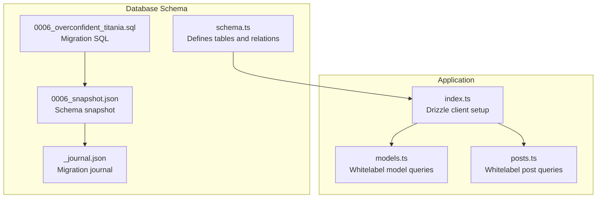
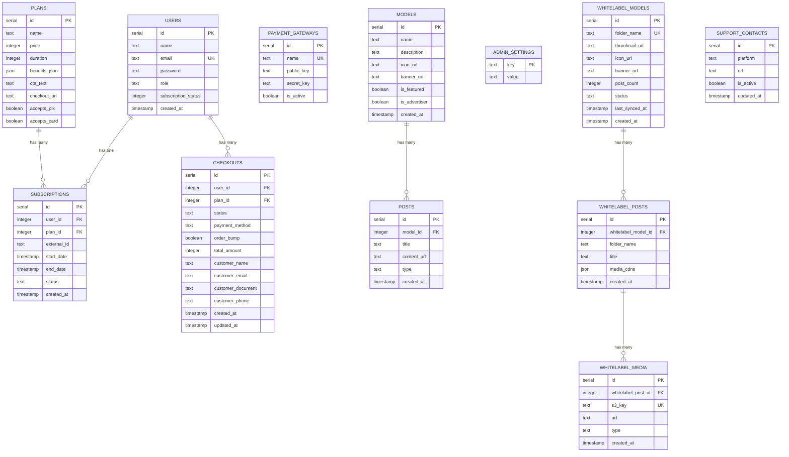
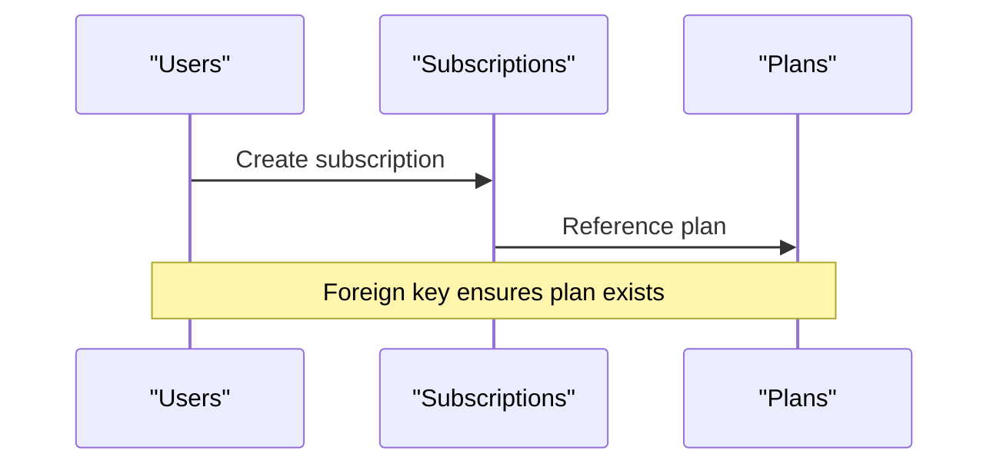
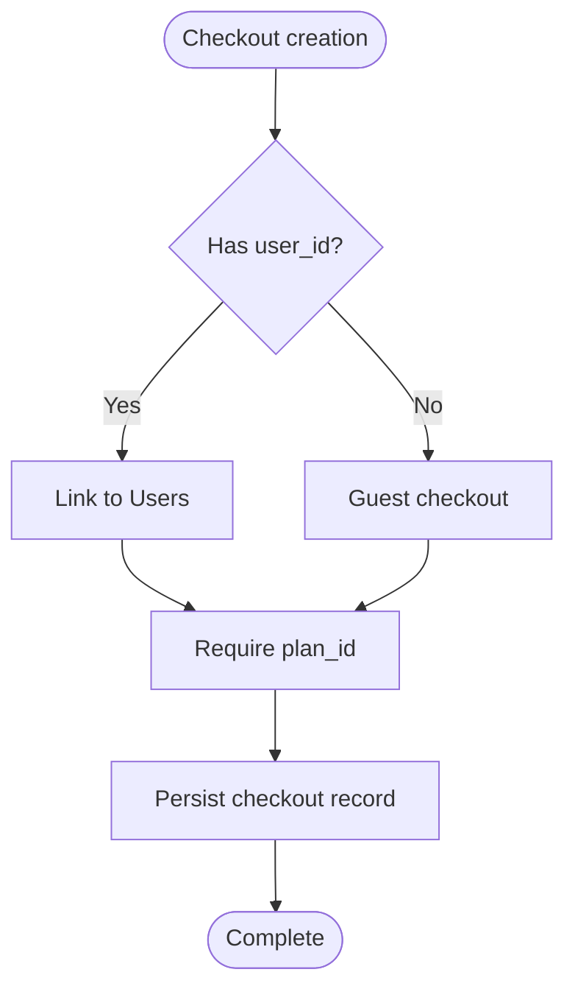
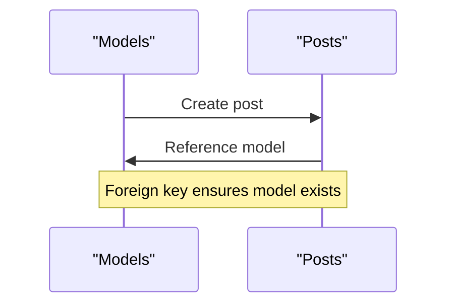
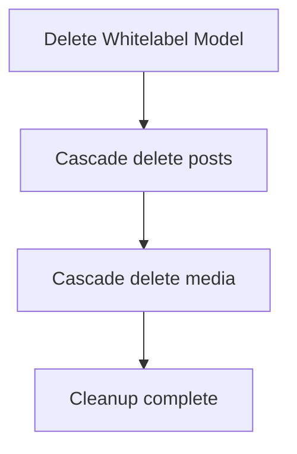
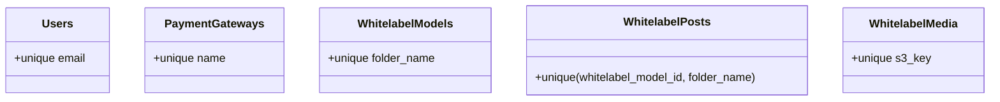
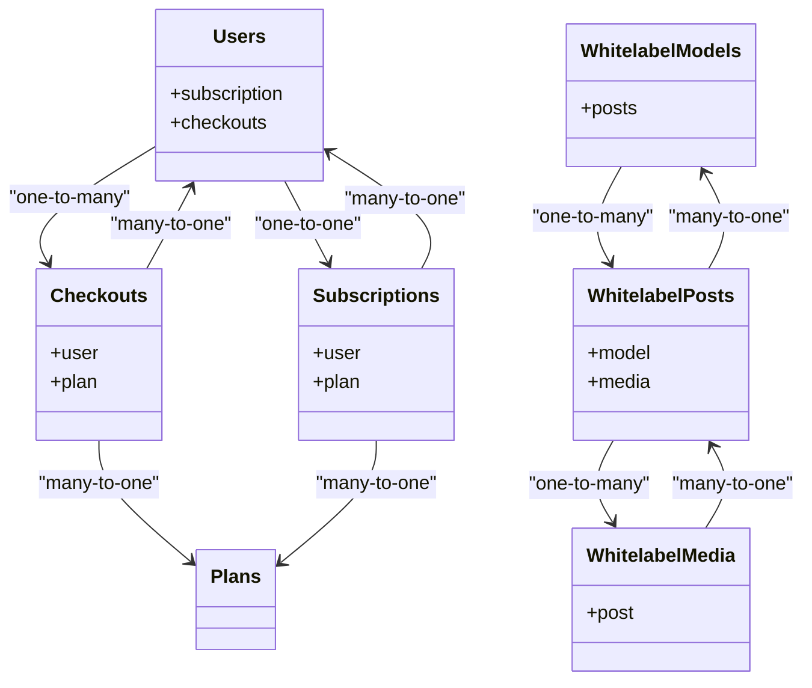
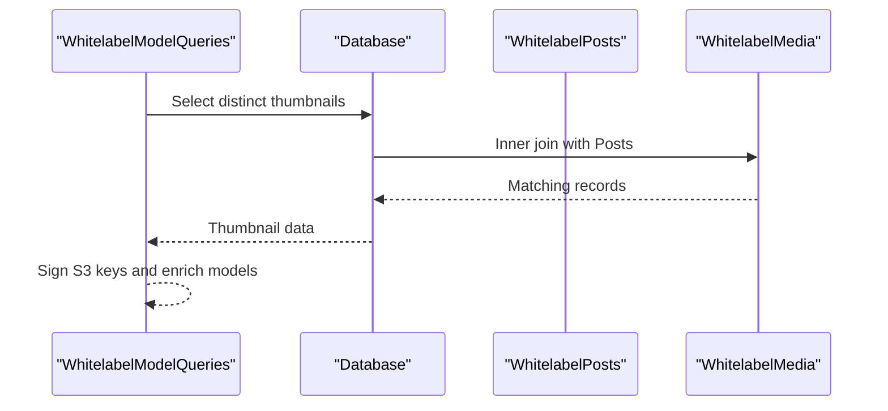
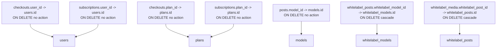

# Database Relationships & Constraints

<cite>
**Referenced Files in This Document**
- [schema.ts](file://src/db/schema.ts)
- [index.ts](file://src/db/index.ts)
- [0006_overconfident_titania.sql](file://drizzle/0006_overconfident_titania.sql)
- [0006_snapshot.json](file://drizzle/meta/0006_snapshot.json)
- [_journal.json](file://drizzle/meta/_journal.json)
- [models.ts](file://src/services/whitelabel/queries/models.ts)
- [posts.ts](file://src/services/whitelabel/queries/posts.ts)
</cite>

## Table of Contents
1. [Introduction](#introduction)
2. [Project Structure](#project-structure)
3. [Core Components](#core-components)
4. [Architecture Overview](#architecture-overview)
5. [Detailed Component Analysis](#detailed-component-analysis)
6. [Dependency Analysis](#dependency-analysis)
7. [Performance Considerations](#performance-considerations)
8. [Troubleshooting Guide](#troubleshooting-guide)
9. [Conclusion](#conclusion)

## Introduction
This document provides comprehensive documentation of the database relationships, foreign key constraints, and referential integrity rules in the CreatorFlix platform. It explains how the `relations()` function implementations define entity connections, documents cascade behaviors, unique constraints, and business rule enforcement through the database schema. Relationship diagrams illustrate cardinality between entities, and the impact of deletion operations on related records is explained.

## Project Structure
The database schema is defined using Drizzle ORM with PostgreSQL. The schema file defines tables and their relationships, while migration snapshots capture the final state of the database including foreign keys, unique constraints, and indexes. The application connects to the database via a Drizzle client configured in the database index file.

**Diagram sources**
- [schema.ts](file://src/db/schema.ts#L1-L178)
- [index.ts](file://src/db/index.ts#L1-L8)
- [0006_overconfident_titania.sql](file://drizzle/0006_overconfident_titania.sql#L1-L18)
- [0006_snapshot.json](file://drizzle/meta/0006_snapshot.json#L1-L840)
- [_journal.json](file://drizzle/meta/_journal.json#L1-L55)

**Section sources**
- [schema.ts](file://src/db/schema.ts#L1-L178)
- [index.ts](file://src/db/index.ts#L1-L8)
- [0006_overconfident_titania.sql](file://drizzle/0006_overconfident_titania.sql#L1-L18)
- [0006_snapshot.json](file://drizzle/meta/0006_snapshot.json#L1-L840)
- [_journal.json](file://drizzle/meta/_journal.json#L1-L55)

## Core Components
This section outlines the core database entities and their relationships as defined in the schema and enforced by foreign keys and unique constraints.

- Users: Core entity representing platform users with roles and subscription status.
- Plans: Subscription plans with pricing and duration.
- Payment Gateways: Payment provider configurations.
- Subscriptions: User-subscription associations with plan references.
- Models: Content creators or brands managed by the platform.
- Posts: Content items associated with models.
- Admin Settings: Global configuration key-value pairs.
- Whitelabel Models: White-label brand entities with unique folder names.
- Whitelabel Posts: Content items under whitelabel models with composite uniqueness.
- Whitelabel Media: Media assets linked to whitelabel posts with S3 key uniqueness.
- Support Contacts: Platform support contact links.
- Checkouts: Purchase transactions with optional user association.

**Section sources**
- [schema.ts](file://src/db/schema.ts#L6-L127)

## Architecture Overview
The database architecture enforces referential integrity through foreign keys and cascading rules. The relations() functions define how entities connect, enabling efficient joins and maintaining data consistency across the platform.

**Diagram sources**
- [schema.ts](file://src/db/schema.ts#L6-L127)
- [0006_snapshot.json](file://drizzle/meta/0006_snapshot.json#L538-L827)

## Detailed Component Analysis

### Users and Subscriptions
Users can have a single active subscription tied to a plan. The subscription table references both users and plans, enforcing referential integrity.

**Diagram sources**
- [schema.ts](file://src/db/schema.ts#L37-L46)
- [0006_snapshot.json](file://drizzle/meta/0006_snapshot.json#L403-L492)

**Section sources**
- [schema.ts](file://src/db/schema.ts#L37-L46)
- [0006_snapshot.json](file://drizzle/meta/0006_snapshot.json#L403-L492)

### Users and Checkouts
Checkouts optionally link to users and always link to plans. The user_id can be null, allowing guest checkouts, but plan_id is required.

**Diagram sources**
- [schema.ts](file://src/db/schema.ts#L113-L127)
- [0006_snapshot.json](file://drizzle/meta/0006_snapshot.json#L32-L153)

**Section sources**
- [schema.ts](file://src/db/schema.ts#L113-L127)
- [0006_snapshot.json](file://drizzle/meta/0006_snapshot.json#L32-L153)

### Models and Posts
Posts belong to models. The foreign key ensures each post references an existing model.

**Diagram sources**
- [schema.ts](file://src/db/schema.ts#L48-L66)
- [0006_snapshot.json](file://drizzle/meta/0006_snapshot.json#L339-L402)

**Section sources**
- [schema.ts](file://src/db/schema.ts#L48-L66)
- [0006_snapshot.json](file://drizzle/meta/0006_snapshot.json#L339-L402)

### Whitelabel Entities and Cascading Rules
Whitelabel posts and media enforce strong referential integrity with cascading deletes. Deleting a whitelabel model cascades to posts and media, preventing orphaned records.

**Diagram sources**
- [schema.ts](file://src/db/schema.ts#L85-L103)
- [0006_snapshot.json](file://drizzle/meta/0006_snapshot.json#L755-L827)

**Section sources**
- [schema.ts](file://src/db/schema.ts#L85-L103)
- [0006_snapshot.json](file://drizzle/meta/0006_snapshot.json#L755-L827)

### Unique Constraints and Business Rules
Unique constraints enforce business rules:
- Users.email: Ensures unique user identification.
- Payment gateways.name: Prevents duplicate payment providers.
- Whitelabel models.folder_name: Ensures unique whitelabel identifiers.
- Whitelabel posts (composite): Ensures unique post-folder combinations per model.
- Whitelabel media.s3_key: Ensures unique S3 keys for media assets.

**Diagram sources**
- [schema.ts](file://src/db/schema.ts#L9, #L31, #L75, #L93, #L99)
- [0006_snapshot.json](file://drizzle/meta/0006_snapshot.json#L591-L671)

**Section sources**
- [schema.ts](file://src/db/schema.ts#L9, #L31, #L75, #L93, #L99)
- [0006_snapshot.json](file://drizzle/meta/0006_snapshot.json#L591-L671)

### Relations() Function Implementations
The relations() functions define entity connections:
- usersRelations: One-to-one with subscriptions; one-to-many with checkouts.
- checkoutsRelations: Many-to-one with users; many-to-one with plans.
- subscriptionsRelations: Many-to-one with users; many-to-one with plans.
- whitelabelModelsRelations: One-to-many with whitelabel posts.
- whitelabelPostsRelations: Many-to-one with whitelabel models; one-to-many with whitelabel media.
- whitelabelMediaRelations: Many-to-one with whitelabel posts.

**Diagram sources**
- [schema.ts](file://src/db/schema.ts#L129-L178)

**Section sources**
- [schema.ts](file://src/db/schema.ts#L129-L178)

### Practical Usage in Services
Services demonstrate how relationships are used:
- WhitelabelModelQueries: Joins whitelabel posts and media to enrich model thumbnails.
- WhitelabelPostQueries: Retrieves posts by model with media signing for S3 URLs.

**Diagram sources**
- [models.ts](file://src/services/whitelabel/queries/models.ts#L11-L34)
- [posts.ts](file://src/services/whitelabel/queries/posts.ts#L16-L32)

**Section sources**
- [models.ts](file://src/services/whitelabel/queries/models.ts#L1-L94)
- [posts.ts](file://src/services/whitelabel/queries/posts.ts#L1-L47)

## Dependency Analysis
Foreign keys and cascading rules create dependencies between entities. The migration snapshot captures the final state of these dependencies.

**Diagram sources**
- [0006_snapshot.json](file://drizzle/meta/0006_snapshot.json#L120-L147)
- [0006_snapshot.json](file://drizzle/meta/0006_snapshot.json#L459-L485)
- [0006_snapshot.json](file://drizzle/meta/0006_snapshot.json#L382-L396)
- [0006_snapshot.json](file://drizzle/meta/0006_snapshot.json#L798-L811)
- [0006_snapshot.json](file://drizzle/meta/0006_snapshot.json#L647-L661)

**Section sources**
- [0006_snapshot.json](file://drizzle/meta/0006_snapshot.json#L120-L147)
- [0006_snapshot.json](file://drizzle/meta/0006_snapshot.json#L459-L485)
- [0006_snapshot.json](file://drizzle/meta/0006_snapshot.json#L382-L396)
- [0006_snapshot.json](file://drizzle/meta/0006_snapshot.json#L798-L811)
- [0006_snapshot.json](file://drizzle/meta/0006_snapshot.json#L647-L661)

## Performance Considerations
- Indexes: Consider adding indexes on frequently joined columns (e.g., user_id, plan_id) to improve join performance.
- Unique constraints: Enforce business rules efficiently at the database level, reducing application-level checks.
- Cascading deletes: Use carefully to prevent accidental mass deletions; ensure backups and transaction boundaries around bulk operations.

## Troubleshooting Guide
Common issues and resolutions:
- Foreign key violations during inserts/updates: Verify referenced keys exist in parent tables.
- Cascade deletion surprises: Review cascading rules and ensure proper transaction boundaries.
- Unique constraint violations: Ensure unique values for email, payment gateway name, whitelabel folder_name, and S3 keys.
- Migration inconsistencies: Use the migration journal to track applied migrations and resolve conflicts.

**Section sources**
- [_journal.json](file://drizzle/meta/_journal.json#L1-L55)

## Conclusion
The database schema enforces robust referential integrity through foreign keys and unique constraints, with cascading rules protecting data consistency. The relations() functions define clear entity connections, enabling efficient queries and maintaining business rules. Proper understanding of these relationships is essential for safe data modifications and reliable application behavior.