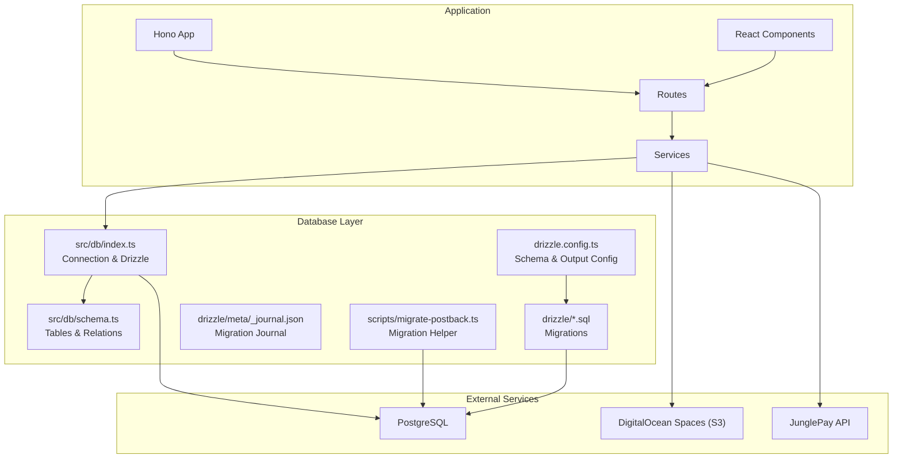
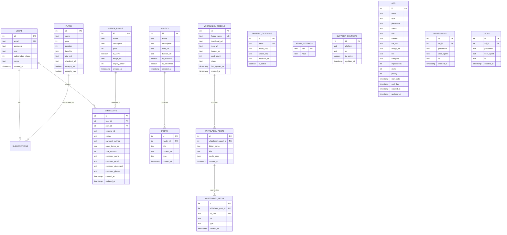
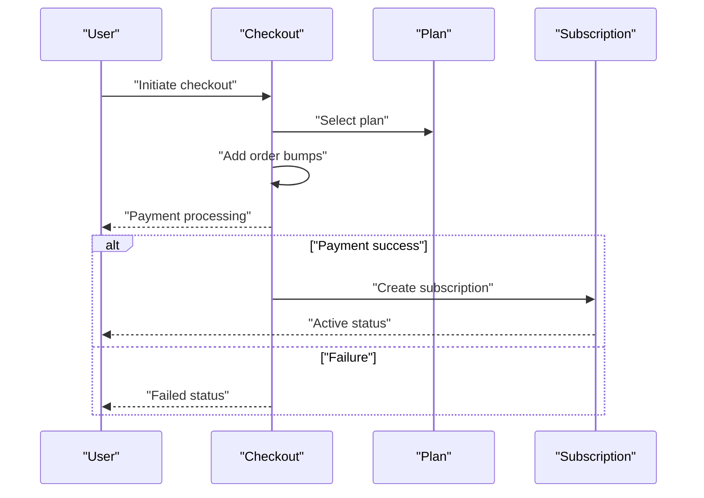
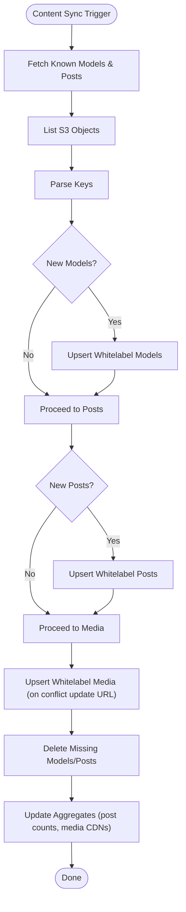
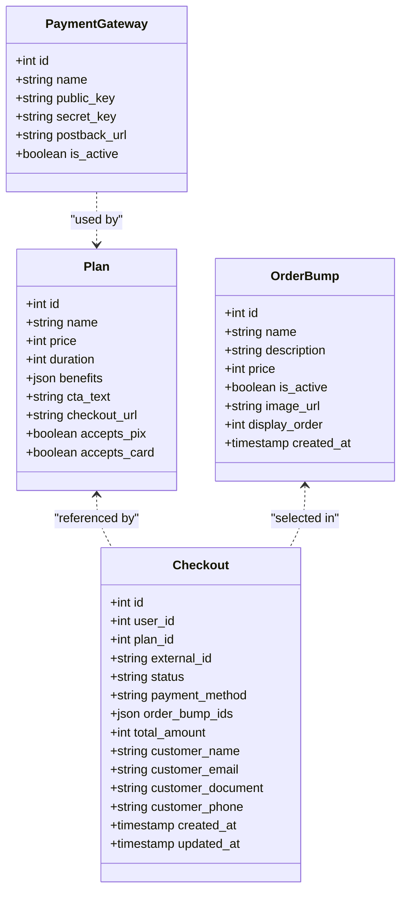
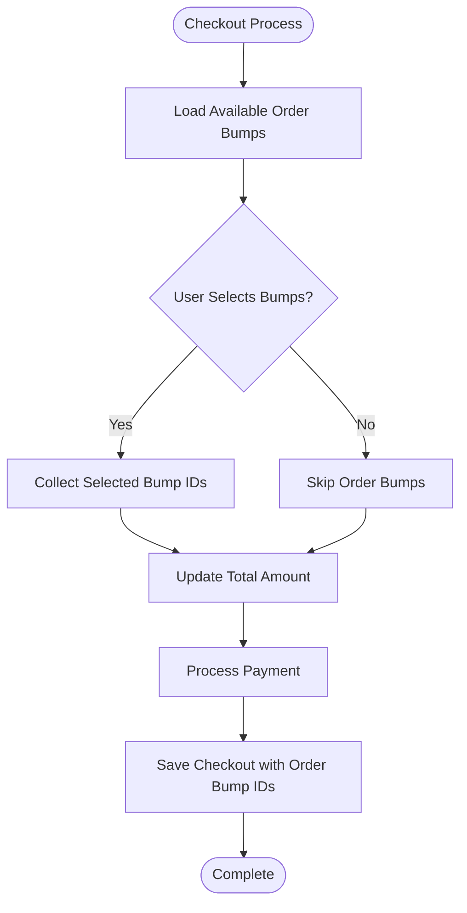
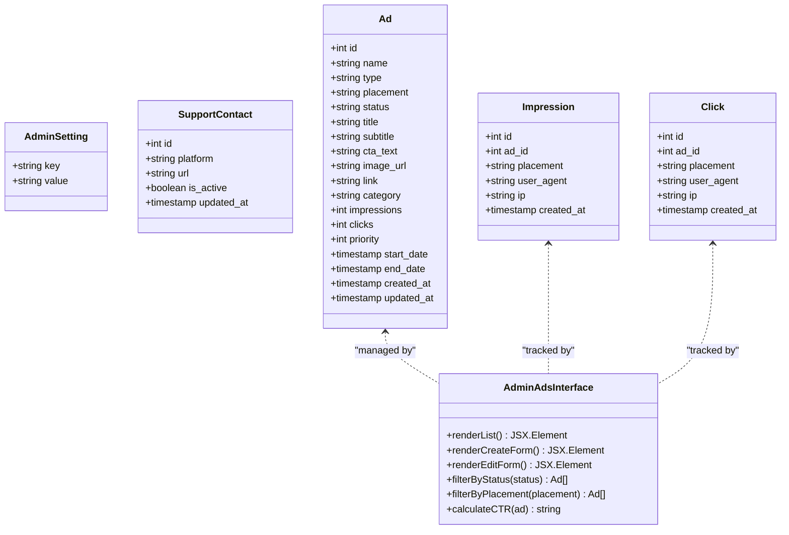
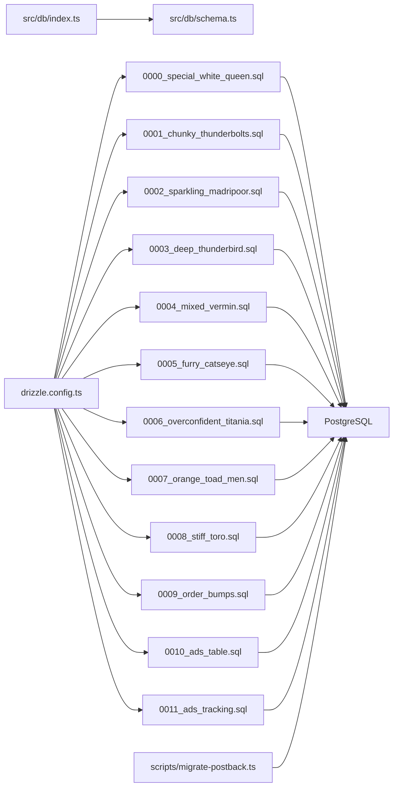

# Database Schema Overview

<cite>
**Referenced Files in This Document**
- [schema.ts](file://src/db/schema.ts)
- [index.ts](file://src/db/index.ts)
- [drizzle.config.ts](file://drizzle.config.ts)
- [_journal.json](file://drizzle/meta/_journal.json)
- [0000_special_white_queen.sql](file://drizzle/0000_special_white_queen.sql)
- [0001_chunky_thunderbolts.sql](file://drizzle/0001_chunky_thunderbolts.sql)
- [0002_sparkling_madripoor.sql](file://drizzle/0002_sparkling_madripoor.sql)
- [0003_deep_thunderbird.sql](file://drizzle/0003_deep_thunderbird.sql)
- [0004_mixed_vermin.sql](file://drizzle/0004_mixed_vermin.sql)
- [0005_furry_catseye.sql](file://drizzle/0005_furry_catseye.sql)
- [0006_overconfident_titania.sql](file://drizzle/0006_overconfident_titania.sql)
- [0007_orange_toad_men.sql](file://drizzle/0007_orange_toad_men.sql)
- [0008_stiff_toro.sql](file://drizzle/0008_stiff_toro.sql)
- [0009_order_bumps.sql](file://drizzle/0009_order_bumps.sql)
- [0010_ads_table.sql](file://drizzle/0010_ads_table.sql)
- [0011_ads_tracking.sql](file://drizzle/0011_ads_tracking.sql)
- [0009_snapshot.json](file://drizzle/meta/0009_snapshot.json)
- [0010_snapshot.json](file://drizzle/meta/0010_snapshot.json)
- [migrate-postback.ts](file://scripts/migrate-postback.ts)
- [README.md](file://README.md)
- [sync.ts](file://src/services/whitelabel/sync.ts)
- [parser.ts](file://src/services/whitelabel/sync/parser.ts)
- [persistence.ts](file://src/services/whitelabel/sync/persistence.ts)
- [OrderBump.tsx](file://src/components/molecules/OrderBump.tsx)
- [Checkout.tsx](file://src/pages/Checkout.tsx)
- [checkout-core.js](file://static/js/checkout-core.js)
- [api.tsx](file://src/routes/api.tsx)
- [Ads.tsx](file://src/pages/admin/Ads.tsx)
- [AdsCreate.tsx](file://src/pages/admin/AdsCreate.tsx)
- [AdTable.tsx](file://src/components/organisms/AdTable.tsx)
- [ads.ts](file://src/services/ads.ts)
</cite>

## Update Summary
**Changes Made**
- Added comprehensive advertising tracking system with dedicated impressions and clicks tables
- Enhanced analytics tracking with detailed metadata including user agents and IP addresses
- Updated Ads table with foreign key relationships to tracking tables
- Integrated detailed analytics capabilities with atomic increment operations and transaction support
- Enhanced administrative functions with comprehensive ad management and analytics dashboard

## Table of Contents
1. [Introduction](#introduction)
2. [Project Structure](#project-structure)
3. [Core Components](#core-components)
4. [Architecture Overview](#architecture-overview)
5. [Detailed Component Analysis](#detailed-component-analysis)
6. [Dependency Analysis](#dependency-analysis)
7. [Performance Considerations](#performance-considerations)
8. [Troubleshooting Guide](#troubleshooting-guide)
9. [Conclusion](#conclusion)
10. [Appendices](#appendices)

## Introduction
This document provides a comprehensive overview of the CreatorFlix database schema. It explains the design philosophy, table organization, and core entity relationships. It documents the purpose and scope of major categories such as user management, content management, payment processing, and administrative functions. It also outlines schema evolution principles and recurring design patterns, and presents high-level entity relationship diagrams to illustrate how users, models, posts, subscriptions, order bumps, ads, and related entities interact.

## Project Structure
The database layer is implemented with Drizzle ORM targeting PostgreSQL. The schema is defined programmatically in TypeScript and migrated via SQL migration files managed by Drizzle Kit. The runtime connection is established in a dedicated database module.



**Diagram sources**
- [index.ts](file://src/db/index.ts#L1-L8)
- [schema.ts](file://src/db/schema.ts#L1-L253)
- [drizzle.config.ts](file://drizzle.config.ts#L1-L11)
- [_journal.json](file://drizzle/meta/_journal.json#L1-L69)
- [0000_special_white_queen.sql](file://drizzle/0000_special_white_queen.sql#L1-L80)
- [0001_chunky_thunderbolts.sql](file://drizzle/0001_chunky_thunderbolts.sql#L1-L14)
- [0002_sparkling_madripoor.sql](file://drizzle/0002_sparkling_madripoor.sql#L1-L1)
- [0003_deep_thunderbird.sql](file://drizzle/0003_deep_thunderbird.sql#L1-L1)
- [0004_mixed_vermin.sql](file://drizzle/0004_mixed_vermin.sql#L1-L12)
- [0005_furry_catseye.sql](file://drizzle/0005_furry_catseye.sql#L1-L11)
- [0006_overconfident_titania.sql](file://drizzle/0006_overconfident_titania.sql#L1-L18)
- [0007_orange_toad_men.sql](file://drizzle/0007_orange_toad_men.sql#L1-L1)
- [0008_stiff_toro.sql](file://drizzle/0008_stiff_toro.sql#L1-L1)
- [0009_order_bumps.sql](file://drizzle/0009_order_bumps.sql#L1-L12)
- [0010_ads_table.sql](file://drizzle/0010_ads_table.sql#L1-L21)
- [0011_ads_tracking.sql](file://drizzle/0011_ads_tracking.sql#L1-L21)
- [migrate-postback.ts](file://scripts/migrate-postback.ts#L1-L22)

**Section sources**
- [README.md](file://README.md#L1-L49)
- [index.ts](file://src/db/index.ts#L1-L8)
- [drizzle.config.ts](file://drizzle.config.ts#L1-L11)

## Core Components
This section describes the primary table categories and their roles within the platform.

- Users
  - Purpose: Store user accounts, roles, and subscription status indicators.
  - Scope: Authentication credentials, profile metadata, and association to subscriptions and checkouts.
  - Key attributes: identity, email, role, subscription status, timestamps.

- Plans
  - Purpose: Define subscription tiers, pricing, and checkout configuration.
  - Scope: Pricing in smallest currency units, duration, benefits payload, and accepted payment methods flags.
  - Key attributes: name, price, duration, benefits JSON, CTA text, checkout URL, payment acceptance flags.

- Payment Gateways
  - Purpose: Manage third-party payment provider integrations.
  - Scope: Public and secret keys, activation flag, unique provider name, and webhook callback URL.
  - Key attributes: name, keys, active flag, postback URL.

- Subscriptions
  - Purpose: Track user membership periods, statuses, and external transaction identifiers.
  - Scope: Link to users and plans, lifecycle dates, and status enumeration.
  - Key attributes: user, plan, external ID, start/end dates, status, timestamps.

- Models
  - Purpose: Represent creator profiles and content producers.
  - Scope: Basic profile metadata, feature flags, and creation timestamp.
  - Key attributes: name, description, branding URLs, feature/advertiser flags.

- Posts
  - Purpose: Represent content items associated with models.
  - Scope: Association to a model, title, media URL, and type enumeration.
  - Key attributes: model, title, content URL, type, timestamps.

- Order Bumps
  - Purpose: Manage optional add-on purchases during checkout process.
  - Scope: Product catalog with pricing, descriptions, activation status, and display ordering.
  - Key attributes: name, description, price, active status, image URL, display order, timestamps.

- Checkouts
  - Purpose: Capture checkout sessions, customer details, and payment outcomes with multi-order bump support.
  - Scope: Optional user linkage, plan selection, status enumeration, payment method, order bump selection tracking, totals, and customer info.
  - Key attributes: user, plan, status, payment method, order bump IDs JSON, total amount, customer info, timestamps.

- Whitelabel Models
  - Purpose: Federated model representation for white-label environments.
  - Scope: folder-based identity, branding assets, synchronization metadata, and counts.
  - Key attributes: folder name, thumbnails/icons/banners, post count, status, timestamps.

- Whitelabel Posts
  - Purpose: Federated post representation under whitelabel models.
  - Scope: Composite uniqueness with model, title, media CDN aggregation, and timestamps.
  - Key attributes: model, folder name, title, media CDNs JSON, timestamps.

- Whitelabel Media
  - Purpose: Federated media assets linked to whitelabel posts.
  - Scope: Unique S3 key mapping, URL, type enumeration, and timestamps.
  - Key attributes: post, S3 key, URL, type, timestamps.

- Admin Settings
  - Purpose: Centralized key-value configuration for administrators.
  - Scope: Dynamic settings with enforced unique keys.
  - Key attributes: key, value.

- Support Contacts
  - Purpose: Platform support channels and availability.
  - Scope: Channel platform, link, activity flag, and update timestamps.
  - Key attributes: platform, URL, active flag, timestamps.

- Ads
  - Purpose: Manage advertising campaigns and placements across the platform with comprehensive analytics tracking.
  - Scope: Campaign management, placement targeting, statistics tracking, scheduling, and content management.
  - Key attributes: name, type, placement, status, content fields, impressions, clicks, priority, date ranges, timestamps.

- Impressions
  - Purpose: Track detailed impression events with metadata for analytics and attribution.
  - Scope: Individual impression records with placement, user agent, IP address, and timestamp.
  - Key attributes: ad reference, placement, user agent, IP address, timestamp.

- Clicks
  - Purpose: Track detailed click events with metadata for analytics and attribution.
  - Scope: Individual click records with placement, user agent, IP address, and timestamp.
  - Key attributes: ad reference, placement, user agent, IP address, timestamp.

**Updated** Added comprehensive Ads table with campaign management, placement targeting, and analytics tracking capabilities, plus dedicated impressions and clicks tracking tables with detailed metadata.

**Section sources**
- [schema.ts](file://src/db/schema.ts#L6-L14)
- [schema.ts](file://src/db/schema.ts#L16-L27)
- [schema.ts](file://src/db/schema.ts#L29-L36)
- [schema.ts](file://src/db/schema.ts#L38-L47)
- [schema.ts](file://src/db/schema.ts#L49-L58)
- [schema.ts](file://src/db/schema.ts#L60-L67)
- [schema.ts](file://src/db/schema.ts#L132-L141)
- [schema.ts](file://src/db/schema.ts#L114-L130)
- [schema.ts](file://src/db/schema.ts#L74-L84)
- [schema.ts](file://src/db/schema.ts#L86-L95)
- [schema.ts](file://src/db/schema.ts#L97-L104)
- [schema.ts](file://src/db/schema.ts#L69-L72)
- [schema.ts](file://src/db/schema.ts#L106-L112)
- [schema.ts](file://src/db/schema.ts#L196-L253)

## Architecture Overview
The database architecture centers around a few core entities and their relationships:
- Users subscribe to Plans and create Checkouts.
- Subscriptions track membership periods per user and plan.
- Models publish Posts; whitelabel equivalents mirror this structure for white-label environments.
- Order Bumps provide optional add-on purchases during checkout.
- Checkouts manage payment sessions with multi-order bump support.
- Whitelabel Posts aggregate media CDN URLs; Whitelabel Media stores unique S3 keys and URLs.
- Admin Settings provide centralized configuration.
- Support Contacts expose platform contact channels.
- Ads manage advertising campaigns across different placements with comprehensive analytics tracking.
- Impressions and Clicks tables provide detailed event tracking with metadata for attribution and analytics.



**Updated** Added comprehensive Ads table with campaign management, placement targeting, and analytics tracking capabilities, plus dedicated impressions and clicks tracking tables with detailed metadata.

**Diagram sources**
- [schema.ts](file://src/db/schema.ts#L6-L14)
- [schema.ts](file://src/db/schema.ts#L16-L27)
- [schema.ts](file://src/db/schema.ts#L29-L36)
- [schema.ts](file://src/db/schema.ts#L38-L47)
- [schema.ts](file://src/db/schema.ts#L49-L58)
- [schema.ts](file://src/db/schema.ts#L60-L67)
- [schema.ts](file://src/db/schema.ts#L132-L141)
- [schema.ts](file://src/db/schema.ts#L114-L130)
- [schema.ts](file://src/db/schema.ts#L74-L84)
- [schema.ts](file://src/db/schema.ts#L86-L95)
- [schema.ts](file://src/db/schema.ts#L97-L104)
- [schema.ts](file://src/db/schema.ts#L69-L72)
- [schema.ts](file://src/db/schema.ts#L106-L112)
- [schema.ts](file://src/db/schema.ts#L196-L253)

## Detailed Component Analysis

### User Management
- Entities: users, subscriptions, checkouts
- Responsibilities:
  - Users: authentication, roles, subscription status, profile name.
  - Subscriptions: membership lifecycle, linking users to plans, external transaction IDs.
  - Checkouts: payment session capture, optional user linkage, totals, and customer details.
- Relationships:
  - One-to-one subscription per user (via relations).
  - One-to-many checkouts per user.
  - Many-to-one plan linkage for both subscriptions and checkouts.



**Diagram sources**
- [schema.ts](file://src/db/schema.ts#L131-L137)
- [schema.ts](file://src/db/schema.ts#L139-L148)
- [schema.ts](file://src/db/schema.ts#L150-L159)
- [schema.ts](file://src/db/schema.ts#L113-L129)

**Section sources**
- [schema.ts](file://src/db/schema.ts#L6-L14)
- [schema.ts](file://src/db/schema.ts#L38-L47)
- [schema.ts](file://src/db/schema.ts#L114-L130)
- [schema.ts](file://src/db/schema.ts#L131-L137)
- [schema.ts](file://src/db/schema.ts#L139-L148)
- [schema.ts](file://src/db/schema.ts#L150-L159)

### Content Management
- Entities: models, posts
- Responsibilities:
  - Models: creator profiles with branding and feature flags.
  - Posts: content items linked to models with type and URL.
- Whitelabel variant:
  - whitelabel_models, whitelabel_posts, whitelabel_media mirror the above for white-label environments.
  - Aggregation of media CDN URLs per post and post counts per model.



**Diagram sources**
- [sync.ts](file://src/services/whitelabel/sync.ts#L7-L197)
- [parser.ts](file://src/services/whitelabel/sync/parser.ts#L10-L58)
- [persistence.ts](file://src/services/whitelabel/sync/persistence.ts#L5-L94)

**Section sources**
- [schema.ts](file://src/db/schema.ts#L49-L58)
- [schema.ts](file://src/db/schema.ts#L60-L67)
- [schema.ts](file://src/db/schema.ts#L74-L84)
- [schema.ts](file://src/db/schema.ts#L86-L95)
- [schema.ts](file://src/db/schema.ts#L97-L104)
- [sync.ts](file://src/services/whitelabel/sync.ts#L1-L334)
- [parser.ts](file://src/services/whitelabel/sync/parser.ts#L1-L59)
- [persistence.ts](file://src/services/whitelabel/sync/persistence.ts#L1-L94)

### Payment Processing
- Entities: plans, payment_gateways, checkouts, order_bumps
- Responsibilities:
  - Plans: pricing, duration, benefits, and accepted payment methods flags.
  - Payment Gateways: provider configuration, activation, and webhook callback URL.
  - Checkouts: payment session capture, customer info, totals, status, external transaction IDs, and multi-order bump tracking.
  - Order Bumps: optional add-on purchases with individual pricing and activation control.
- Design pattern:
  - Enumerations for status and method ensure data integrity.
  - Customer info is stored for compliance and reporting.
  - External transaction IDs enable integration with payment providers.
  - JSON column for order_bump_ids supports flexible multi-order bump selection tracking.

**Updated** Enhanced with order bump management capabilities and multi-order bump functionality.



**Diagram sources**
- [schema.ts](file://src/db/schema.ts#L16-L27)
- [schema.ts](file://src/db/schema.ts#L29-L36)
- [schema.ts](file://src/db/schema.ts#L132-L141)
- [schema.ts](file://src/db/schema.ts#L114-L130)

**Section sources**
- [schema.ts](file://src/db/schema.ts#L16-L27)
- [schema.ts](file://src/db/schema.ts#L29-L36)
- [schema.ts](file://src/db/schema.ts#L132-L141)
- [schema.ts](file://src/db/schema.ts#L114-L130)

### Order Bump Management
- Entities: order_bumps
- Responsibilities:
  - Order Bumps: optional add-on purchases during checkout with individual pricing and activation control.
  - Multi-order bump support enables customers to select multiple add-ons during checkout.
  - Display ordering controls promotional priority and visual presentation.
- Integration:
  - Order Bumps are selectable during checkout process.
  - Selected order bumps are tracked in checkout records via order_bump_ids JSON column.
  - Prices are aggregated to calculate final checkout totals.

**Updated** New component for managing optional add-on purchases during checkout.



**Diagram sources**
- [OrderBump.tsx](file://src/components/molecules/OrderBump.tsx#L1-L119)
- [Checkout.tsx](file://src/pages/Checkout.tsx#L1-L98)
- [checkout-core.js](file://static/js/checkout-core.js#L191-L220)
- [api.tsx](file://src/routes/api.tsx#L707-L721)

**Section sources**
- [schema.ts](file://src/db/schema.ts#L132-L141)
- [OrderBump.tsx](file://src/components/molecules/OrderBump.tsx#L1-L119)
- [Checkout.tsx](file://src/pages/Checkout.tsx#L1-L98)
- [checkout-core.js](file://static/js/checkout-core.js#L191-L220)
- [api.tsx](file://src/routes/api.tsx#L707-L721)

### Advertising System (Ads)
- Entities: ads, impressions, clicks
- Responsibilities:
  - Ads: comprehensive advertising campaign management with placement targeting and analytics tracking.
  - Campaign management: name, type, placement, status, content fields, scheduling, and priority.
  - Analytics tracking: impressions, clicks, CTR calculation, and performance metrics.
  - Content management: title, subtitle, CTA text, image URL, link, and category.
  - Event tracking: detailed impression and click records with metadata for attribution.
- Advanced Features:
  - Multiple ad types: diamond, diamond_block, banner, spot, hero with specific placement restrictions.
  - Sophisticated placement targeting with 12 different locations across the platform.
  - Real-time analytics with detailed metadata tracking including user agents and IP addresses.
  - Atomic increment operations with transaction support for high-performance analytics.
  - Priority-based display ordering with configurable scheduling.
  - Comprehensive admin interface with filtering, preview, and CRUD operations.
  - Foreign key relationships with cascade deletion for clean data management.

**Updated** Enhanced advertising system with dedicated impressions and clicks tracking tables featuring detailed metadata and atomic operations.

```mermaid
classDiagram
class Ad {
+int id
+string name
+string type
+string placement
+string status
+string title
+string subtitle
+string cta_text
+string image_url
+string link
+string category
+int impressions
+int clicks
+int priority
+timestamp start_date
+timestamp end_date
+timestamp created_at
+timestamp updated_at
}
class Impression {
+int id
+int ad_id
+string placement
+string user_agent
+string ip
+timestamp created_at
}
class Click {
+int id
+int ad_id
+string placement
+string user_agent
+string ip
+timestamp created_at
}
class AdsService {
+list(page, limit, filters) ListAdsResult
+getById(id) Ad
+create(input) Ad
+update(input) Ad
+delete(id) boolean
+toggleStatus(id) Ad
+trackImpression(id, metadata) void
+trackClick(id, metadata) void
+trackEvent(adId, type, metadata) void
+getActiveByPlacement(placement, limit, track) Ad[]
+getActiveByPlacements(placements, track) Record
+formatPlacementLabel(placement) string
+formatTypeLabel(type) string
}
Ad <.. AdsService : "manages"
Impression <.. AdsService : "tracks"
Click <.. AdsService : "tracks"
Ad ||--|| Impression : "has many"
Ad ||--|| Click : "has many"
```

**Diagram sources**
- [schema.ts](file://src/db/schema.ts#L196-L253)
- [ads.ts](file://src/services/ads.ts#L86-L380)

**Section sources**
- [schema.ts](file://src/db/schema.ts#L196-L253)
- [ads.ts](file://src/services/ads.ts#L1-L380)
- [Ads.tsx](file://src/pages/admin/Ads.tsx#L1-L131)
- [AdsCreate.tsx](file://src/pages/admin/AdsCreate.tsx#L1-L569)
- [AdTable.tsx](file://src/components/organisms/AdTable.tsx#L1-L119)

### Administrative Functions
- Entities: admin_settings, support_contacts, ads, impressions, clicks
- Responsibilities:
  - Admin Settings: centralized key-value configuration.
  - Support Contacts: platform support channels with activity flags and update timestamps.
  - Ads: comprehensive advertising campaign management with full CRUD operations support.
  - Impressions: detailed impression event tracking with metadata for analytics.
  - Clicks: detailed click event tracking with metadata for analytics.
- Enhanced Features:
  - Ads management interface with filtering by status and placement.
  - Real-time preview of ad placements across different screen types.
  - Dynamic placement validation based on ad type restrictions.
  - Analytics dashboard showing impressions, clicks, and CTR calculations.
  - Detailed metadata tracking including user agents and IP addresses.
  - Atomic increment operations with transaction support for reliable analytics.
  - Full CRUD operations with validation and error handling.

**Updated** Enhanced Administrative Functions section to include comprehensive ads table with full CRUD operations support and detailed analytics tracking capabilities.



**Diagram sources**
- [schema.ts](file://src/db/schema.ts#L69-L72)
- [schema.ts](file://src/db/schema.ts#L106-L112)
- [schema.ts](file://src/db/schema.ts#L196-L253)
- [Ads.tsx](file://src/pages/admin/Ads.tsx#L29-L131)
- [AdsCreate.tsx](file://src/pages/admin/AdsCreate.tsx#L40-L569)
- [AdTable.tsx](file://src/components/organisms/AdTable.tsx#L17-L119)

**Section sources**
- [schema.ts](file://src/db/schema.ts#L69-L72)
- [schema.ts](file://src/db/schema.ts#L106-L112)
- [schema.ts](file://src/db/schema.ts#L196-L253)
- [Ads.tsx](file://src/pages/admin/Ads.tsx#L1-L131)
- [AdsCreate.tsx](file://src/pages/admin/AdsCreate.tsx#L1-L569)
- [AdTable.tsx](file://src/components/organisms/AdTable.tsx#L1-L119)

## Dependency Analysis
This section maps internal dependencies among database components and external systems.



**Updated** Added new migration files 0009, 0010, and 0011 to the dependency graph, including the new advertising tracking system.

**Diagram sources**
- [index.ts](file://src/db/index.ts#L1-L8)
- [schema.ts](file://src/db/schema.ts#L1-L253)
- [drizzle.config.ts](file://drizzle.config.ts#L1-L11)
- [_journal.json](file://drizzle/meta/_journal.json#L1-L69)
- [0000_special_white_queen.sql](file://drizzle/0000_special_white_queen.sql#L1-L80)
- [0001_chunky_thunderbolts.sql](file://drizzle/0001_chunky_thunderbolts.sql#L1-L14)
- [0002_sparkling_madripoor.sql](file://drizzle/0002_sparkling_madripoor.sql#L1-L1)
- [0003_deep_thunderbird.sql](file://drizzle/0003_deep_thunderbird.sql#L1-L1)
- [0004_mixed_vermin.sql](file://drizzle/0004_mixed_vermin.sql#L1-L12)
- [0005_furry_catseye.sql](file://drizzle/0005_furry_catseye.sql#L1-L11)
- [0006_overconfident_titania.sql](file://drizzle/0006_overconfident_titania.sql#L1-L18)
- [0007_orange_toad_men.sql](file://drizzle/0007_orange_toad_men.sql#L1-L1)
- [0008_stiff_toro.sql](file://drizzle/0008_stiff_toro.sql#L1-L1)
- [0009_order_bumps.sql](file://drizzle/0009_order_bumps.sql#L1-L12)
- [0010_ads_table.sql](file://drizzle/0010_ads_table.sql#L1-L21)
- [0011_ads_tracking.sql](file://drizzle/0011_ads_tracking.sql#L1-L21)
- [migrate-postback.ts](file://scripts/migrate-postback.ts#L1-L22)

**Section sources**
- [index.ts](file://src/db/index.ts#L1-L8)
- [drizzle.config.ts](file://drizzle.config.ts#L1-L11)
- [_journal.json](file://drizzle/meta/_journal.json#L1-L69)

## Performance Considerations
- Indexing and Uniqueness
  - Unique constraints on emails and whitelabel identifiers prevent duplicates and support fast lookups.
  - Unique S3 key constraint ensures idempotent media ingestion.
- Aggregation Updates
  - Batched updates for post counts and media CDN JSON reduce query overhead during sync.
- Foreign Key Cascades
  - Explicit cascading deletes for whitelabel posts and media maintain referential integrity during cleanup.
  - Cascade deletion for impressions and clicks ensures clean data management when ads are removed.
- Timestamps
  - Default timestamps and update triggers minimize application-side timestamp management.
- Column Management
  - New external_id, postback_url, and order_bump_ids columns support enhanced payment tracking and multi-order bump functionality without performance impact.
- JSON Data Handling
  - order_bump_ids JSON column provides flexible multi-order bump tracking while maintaining performance through proper indexing and query patterns.
- Analytics Tracking
  - Dedicated impressions and clicks tables with atomic increment operations for high-performance analytics.
  - Transaction support ensures data consistency for both denormalized counters and detailed event tracking.
  - Priority-based sorting with efficient indexing for optimal ad delivery performance.
  - Date range filtering with proper indexing for campaign scheduling and reporting.
  - Metadata tracking (user agents, IP addresses) enables detailed attribution and analytics without impacting core performance.
  - Foreign key relationships with cascade deletion maintain referential integrity for analytics data.

**Updated** Added performance considerations for analytics tracking, ad delivery optimization, and detailed metadata handling.

## Troubleshooting Guide
- Migration Issues
  - Verify migration journal entries and ensure migrations are applied in order.
  - Confirm schema path and credentials in the Drizzle configuration.
  - Use the migration helper script for postback_url column addition.
  - Check that order_bumps migration was applied successfully.
  - Verify ads table migration completed without errors.
  - Ensure impressions and clicks tracking migrations were applied successfully.
- Connection Problems
  - Check the database URL environment variable or fallback configuration.
  - Ensure PostgreSQL is reachable and credentials are valid.
- Sync Failures (Whitelabel)
  - Validate S3 bucket permissions and keys.
  - Confirm composite uniqueness constraints for whitelabel posts and S3 key uniqueness for media.
  - Review logs for parsing failures or missing model IDs during post/media insertion.
- Payment Integration Issues
  - Verify postback_url is properly configured for payment gateways.
  - Check external_id tracking for payment provider integration.
  - Ensure webhook endpoints are accessible for payment notifications.
  - Validate order_bump_ids JSON format in checkout records.
- Order Bump Functionality Issues
  - Verify order_bumps table exists and is properly indexed.
  - Check that order_bump_ids JSON column accepts valid JSON arrays.
  - Ensure order bump selection logic works correctly in checkout frontend.
  - Validate that order bump prices are correctly aggregated in checkout totals.
- Ad System Issues
  - Verify ads table schema matches migration definition.
  - Check enum values for type, placement, and status fields.
  - Ensure placement validation logic works correctly for ad type restrictions.
  - Validate analytics tracking counters are updating properly.
  - Confirm admin interface filters are working for status and placement queries.
  - Verify impressions and clicks tables exist with proper foreign key constraints.
  - Check that atomic increment operations are working correctly in transaction context.
  - Ensure metadata tracking (user agents, IP addresses) is functioning properly.
  - Validate cascade deletion behavior for impressions and clicks when ads are removed.

**Updated** Added troubleshooting guidance for new ad system functionality, enhanced payment-related columns, and comprehensive advertising tracking system.

**Section sources**
- [_journal.json](file://drizzle/meta/_journal.json#L1-L69)
- [drizzle.config.ts](file://drizzle.config.ts#L1-L11)
- [index.ts](file://src/db/index.ts#L1-L8)
- [sync.ts](file://src/services/whitelabel/sync.ts#L1-L334)
- [persistence.ts](file://src/services/whitelabel/sync/persistence.ts#L1-L94)
- [migrate-postback.ts](file://scripts/migrate-postback.ts#L1-L22)
- [0009_order_bumps.sql](file://drizzle/0009_order_bumps.sql#L1-L12)
- [0010_ads_table.sql](file://drizzle/0010_ads_table.sql#L1-L21)
- [0011_ads_tracking.sql](file://drizzle/0011_ads_tracking.sql#L1-L21)

## Conclusion
CreatorFlix employs a clear, layered database design centered on users, plans, subscriptions, and content—both native and whitelabel. The schema emphasizes integrity through enumerations, unique constraints, and explicit relations. Migrations evolve the schema incrementally, and the whitelabel pipeline demonstrates scalable content ingestion with robust cleanup and aggregation. Recent enhancements include improved payment tracking with external_id columns, webhook support through postback_url configurations, and sophisticated order bump management for multi-add-on purchases. The addition of the comprehensive Ads table with campaign management, placement targeting, and analytics tracking provides a complete advertising solution for the platform. The new dedicated impressions and clicks tracking tables with detailed metadata support comprehensive analytics and attribution capabilities. This foundation supports a flexible, extensible platform for premium content creators with comprehensive monetization capabilities, advanced advertising features, and robust analytics infrastructure.

## Appendices

### Schema Evolution Principles and Patterns
- Incremental Migrations
  - Each change is captured as a separate SQL migration with a unique tag.
- Idempotency
  - Upsert patterns and "do nothing on conflict" strategies prevent duplication during sync.
- Referential Integrity
  - Foreign keys enforce relationships; cascading deletes handle dependent cleanup.
  - Cascade deletion for impressions and clicks ensures clean data management.
- JSON Payloads
  - Benefits, media CDNs, and order_bump_ids are stored as JSON for flexibility and reduced schema churn.
- Enumerations
  - Status and type fields use enums to constrain values and simplify validation.
- Timestamps
  - Default timestamps and update triggers standardize record lifecycle tracking.
- Column Enhancement Strategy
  - New columns like external_id, postback_url, and order_bump_ids are added through controlled migrations.
  - Migration helpers ensure backward compatibility and idempotent operations.
- Multi-Entity Relationships
  - Complex relationships like order_bumps to checkouts demonstrate flexible many-to-many patterns through JSON storage.
- Analytics-First Design
  - Dedicated counters and atomic operations for high-performance analytics tracking.
  - Priority-based sorting and efficient indexing for optimal ad delivery performance.
  - Comprehensive filtering and reporting capabilities through structured data models.
  - Detailed metadata tracking (user agents, IP addresses) enables advanced attribution and analytics.
  - Transaction support ensures data consistency for complex analytics operations.
  - Foreign key relationships with cascade deletion maintain referential integrity for analytics data.

**Updated** Added migration management, column enhancement patterns, multi-entity relationship handling, analytics-first design principles, and comprehensive metadata tracking capabilities.

**Section sources**
- [_journal.json](file://drizzle/meta/_journal.json#L1-L69)
- [0000_special_white_queen.sql](file://drizzle/0000_special_white_queen.sql#L1-L80)
- [0001_chunky_thunderbolts.sql](file://drizzle/0001_chunky_thunderbolts.sql#L1-L14)
- [0002_sparkling_madripoor.sql](file://drizzle/0002_sparkling_madripoor.sql#L1-L1)
- [0003_deep_thunderbird.sql](file://drizzle/0003_deep_thunderbird.sql#L1-L1)
- [0004_mixed_vermin.sql](file://drizzle/0004_mixed_vermin.sql#L1-L12)
- [0005_furry_catseye.sql](file://drizzle/0005_furry_catseye.sql#L1-L11)
- [0006_overconfident_titania.sql](file://drizzle/0006_overconfident_titania.sql#L1-L18)
- [0007_orange_toad_men.sql](file://drizzle/0007_orange_toad_men.sql#L1-L1)
- [0008_stiff_toro.sql](file://drizzle/0008_stiff_toro.sql#L1-L1)
- [0009_order_bumps.sql](file://drizzle/0009_order_bumps.sql#L1-L12)
- [0010_ads_table.sql](file://drizzle/0010_ads_table.sql#L1-L21)
- [0011_ads_tracking.sql](file://drizzle/0011_ads_tracking.sql#L1-L21)
- [schema.ts](file://src/db/schema.ts#L1-L253)
- [migrate-postback.ts](file://scripts/migrate-postback.ts#L1-L22)
- [ads.ts](file://src/services/ads.ts#L1-L380)