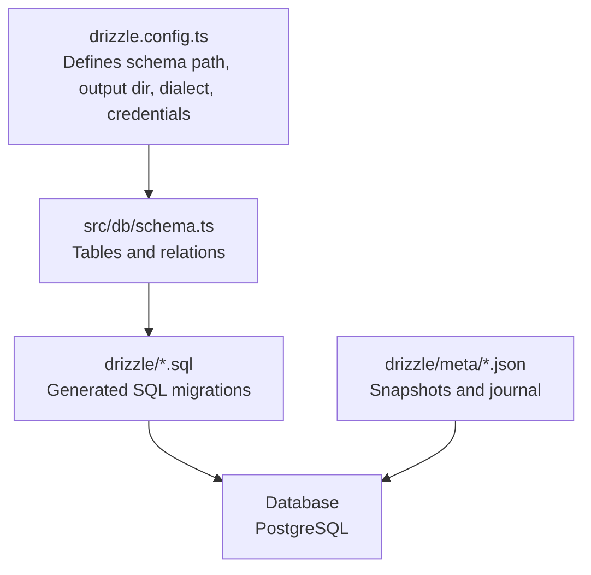
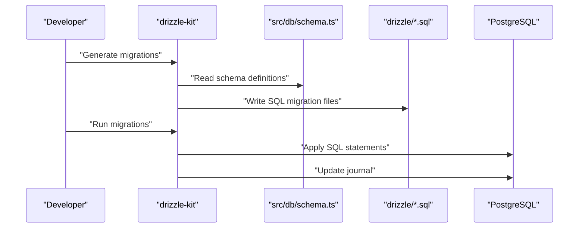
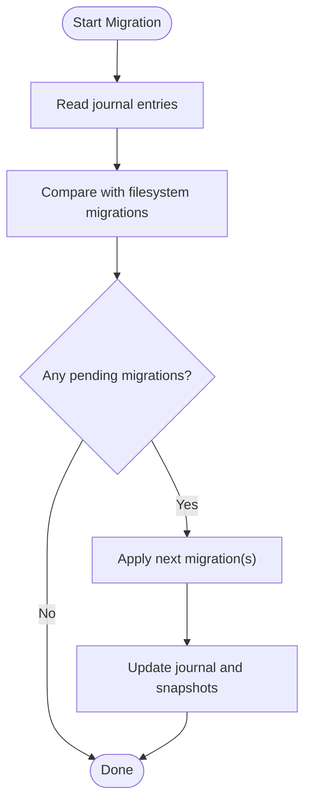
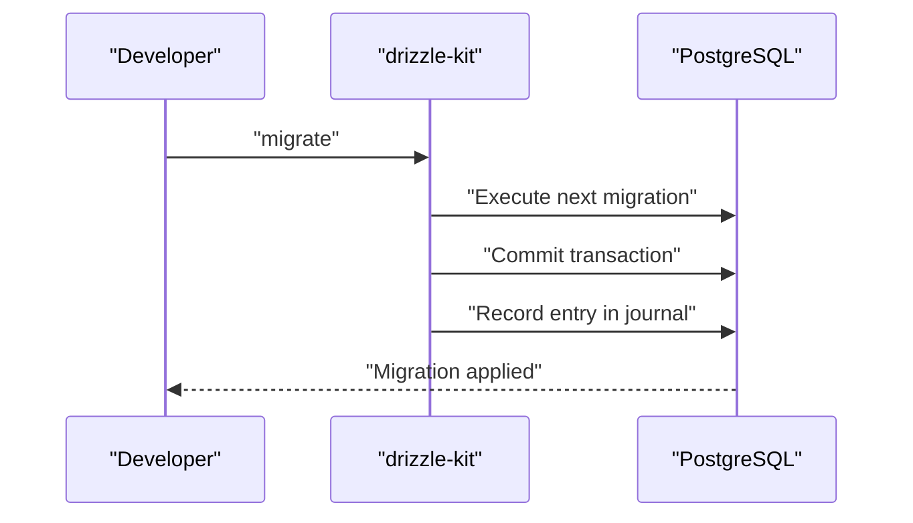
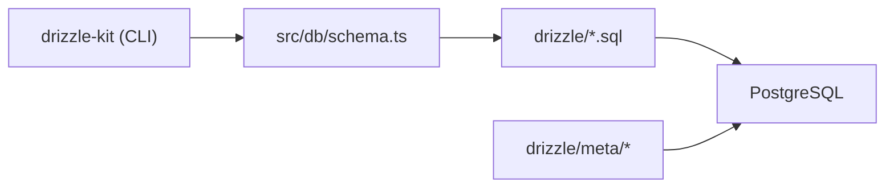

# Migration Management

<cite>
**Referenced Files in This Document**
- [drizzle.config.ts](file://drizzle.config.ts)
- [package.json](file://package.json)
- [src/db/index.ts](file://src/db/index.ts)
- [src/db/schema.ts](file://src/db/schema.ts)
- [drizzle/meta/_journal.json](file://drizzle/meta/_journal.json)
- [drizzle/meta/0000_snapshot.json](file://drizzle/meta/0000_snapshot.json)
- [drizzle/0000_special_white_queen.sql](file://drizzle/0000_special_white_queen.sql)
- [drizzle/0001_chunky_thunderbolts.sql](file://drizzle/0001_chunky_thunderbolts.sql)
- [drizzle/0002_sparkling_madripoor.sql](file://drizzle/0002_sparkling_madripoor.sql)
- [drizzle/0003_deep_thunderbird.sql](file://drizzle/0003_deep_thunderbird.sql)
- [drizzle/0004_mixed_vermin.sql](file://drizzle/0004_mixed_vermin.sql)
- [drizzle/0005_furry_catseye.sql](file://drizzle/0005_furry_catseye.sql)
- [drizzle/0006_overconfident_titania.sql](file://drizzle/0006_overconfident_titania.sql)
</cite>

## Table of Contents
1. [Introduction](#introduction)
2. [Project Structure](#project-structure)
3. [Core Components](#core-components)
4. [Architecture Overview](#architecture-overview)
5. [Detailed Component Analysis](#detailed-component-analysis)
6. [Dependency Analysis](#dependency-analysis)
7. [Performance Considerations](#performance-considerations)
8. [Troubleshooting Guide](#troubleshooting-guide)
9. [Conclusion](#conclusion)

## Introduction
This document explains how database migrations are managed using Drizzle ORM in this project. It covers the migration file structure, version control approach, journal tracking, rollback strategies, and schema evolution patterns. It also provides best practices for creating new migrations, handling data transformations, and managing production deployments, along with examples of common migration scenarios and troubleshooting steps.

## Project Structure
The migration system is organized around:
- A Drizzle configuration that points to the schema and output directory
- A schema module that defines tables and relations
- A migrations directory containing numbered SQL migration files
- A metadata directory storing snapshots and a journal for tracking applied migrations

**Diagram sources**
- [drizzle.config.ts](file://drizzle.config.ts#L1-L11)
- [src/db/schema.ts](file://src/db/schema.ts#L1-L178)
- [drizzle/meta/_journal.json](file://drizzle/meta/_journal.json#L1-L55)

**Section sources**
- [drizzle.config.ts](file://drizzle.config.ts#L1-L11)
- [src/db/schema.ts](file://src/db/schema.ts#L1-L178)
- [drizzle/meta/_journal.json](file://drizzle/meta/_journal.json#L1-L55)

## Core Components
- Drizzle configuration: Declares schema location, output directory, PostgreSQL dialect, and connection credentials.
- Schema module: Defines all tables and relations used by the application.
- Migrations: SQL files named with zero-padded indices and human-readable tags.
- Journal and snapshots: Track applied migrations and maintain a canonical snapshot of the database state.

Key responsibilities:
- Drizzle config: Ensures migrations are generated against the correct schema and target the intended database.
- Schema: Provides the source of truth for schema evolution.
- Migrations: Encapsulate forward-only schema changes.
- Journal: Records which migrations were applied and when, enabling safe re-runs and rollbacks.

**Section sources**
- [drizzle.config.ts](file://drizzle.config.ts#L1-L11)
- [src/db/schema.ts](file://src/db/schema.ts#L1-L178)
- [drizzle/meta/_journal.json](file://drizzle/meta/_journal.json#L1-L55)
- [drizzle/meta/0000_snapshot.json](file://drizzle/meta/0000_snapshot.json#L1-L505)

## Architecture Overview
The migration lifecycle involves generating SQL from the schema, applying migrations to the database, and maintaining a journal and snapshots for safety and reproducibility.

**Diagram sources**
- [drizzle.config.ts](file://drizzle.config.ts#L1-L11)
- [src/db/schema.ts](file://src/db/schema.ts#L1-L178)
- [drizzle/0000_special_white_queen.sql](file://drizzle/0000_special_white_queen.sql#L1-L80)
- [drizzle/meta/_journal.json](file://drizzle/meta/_journal.json#L1-L55)

## Detailed Component Analysis

### Migration File Structure and Naming
- Files are named with a zero-padded index followed by a descriptive tag and a .sql extension.
- Each file contains one or more SQL statements separated by a statement break marker.
- Tags are human-readable and help identify the intent of each migration.

Examples:
- Initial schema creation
- Adding tables
- Altering columns
- Adding constraints

**Section sources**
- [drizzle/0000_special_white_queen.sql](file://drizzle/0000_special_white_queen.sql#L1-L80)
- [drizzle/0001_chunky_thunderbolts.sql](file://drizzle/0001_chunky_thunderbolts.sql#L1-L14)
- [drizzle/0002_sparkling_madripoor.sql](file://drizzle/0002_sparkling_madripoor.sql#L1-L1)
- [drizzle/0003_deep_thunderbird.sql](file://drizzle/0003_deep_thunderbird.sql#L1-L1)
- [drizzle/0004_mixed_vermin.sql](file://drizzle/0004_mixed_vermin.sql#L1-L12)
- [drizzle/0005_furry_catseye.sql](file://drizzle/0005_furry_catseye.sql#L1-L11)
- [drizzle/0006_overconfident_titania.sql](file://drizzle/0006_overconfident_titania.sql#L1-L18)

### Version Control Approach and Journal Tracking
- The journal tracks applied migrations with timestamps and tags.
- Snapshots capture the canonical database state after each migration.
- Together, they enable deterministic reruns and safe rollbacks.

**Diagram sources**
- [drizzle/meta/_journal.json](file://drizzle/meta/_journal.json#L1-L55)
- [drizzle/meta/0000_snapshot.json](file://drizzle/meta/0000_snapshot.json#L1-L505)

**Section sources**
- [drizzle/meta/_journal.json](file://drizzle/meta/_journal.json#L1-L55)
- [drizzle/meta/0000_snapshot.json](file://drizzle/meta/0000_snapshot.json#L1-L505)

### Rollback Strategies
Rollbacks are handled by:
- Re-applying earlier snapshots to restore previous schema states
- Using the journal to determine which migrations to reverse
- Manually writing reverse migrations when necessary

Best practices:
- Prefer forward-only schema evolution
- Keep rollbacks explicit and minimal
- Always backup before manual rollbacks

**Section sources**
- [drizzle/meta/_journal.json](file://drizzle/meta/_journal.json#L1-L55)
- [drizzle/meta/0000_snapshot.json](file://drizzle/meta/0000_snapshot.json#L1-L505)

### Migration Execution Process
- Generate migrations from the schema
- Run migrations against the target database
- Update the journal and snapshots

**Diagram sources**
- [drizzle.config.ts](file://drizzle.config.ts#L1-L11)
- [drizzle/0001_chunky_thunderbolts.sql](file://drizzle/0001_chunky_thunderbolts.sql#L1-L14)
- [drizzle/meta/_journal.json](file://drizzle/meta/_journal.json#L1-L55)

**Section sources**
- [drizzle.config.ts](file://drizzle.config.ts#L1-L11)
- [drizzle/0001_chunky_thunderbolts.sql](file://drizzle/0001_chunky_thunderbolts.sql#L1-L14)
- [drizzle/meta/_journal.json](file://drizzle/meta/_journal.json#L1-L55)

### Schema Evolution Patterns
Common patterns observed in the migration set:
- Creating tables with primary keys and constraints
- Adding columns with defaults
- Altering column types and adding constraints
- Defining foreign keys with appropriate actions
- Introducing enums via text constraints

These patterns reflect a gradual expansion of the domain model with careful attention to referential integrity and data consistency.

**Section sources**
- [drizzle/0000_special_white_queen.sql](file://drizzle/0000_special_white_queen.sql#L1-L80)
- [drizzle/0001_chunky_thunderbolts.sql](file://drizzle/0001_chunky_thunderbolts.sql#L1-L14)
- [drizzle/0002_sparkling_madripoor.sql](file://drizzle/0002_sparkling_madripoor.sql#L1-L1)
- [drizzle/0003_deep_thunderbird.sql](file://drizzle/0003_deep_thunderbird.sql#L1-L1)
- [drizzle/0004_mixed_vermin.sql](file://drizzle/0004_mixed_vermin.sql#L1-L12)
- [drizzle/0005_furry_catseye.sql](file://drizzle/0005_furry_catseye.sql#L1-L11)
- [drizzle/0006_overconfident_titania.sql](file://drizzle/0006_overconfident_titania.sql#L1-L18)

### Best Practices for Creating New Migrations
- Define schema changes in the schema module first
- Generate migrations to capture the diff
- Review generated SQL for correctness and safety
- Add tests or manual verification steps
- Commit both schema and migration files together
- Keep migrations small and focused

**Section sources**
- [drizzle.config.ts](file://drizzle.config.ts#L1-L11)
- [src/db/schema.ts](file://src/db/schema.ts#L1-L178)

### Handling Data Transformations
- Prefer declarative schema changes when possible
- For complex data updates, consider adding a separate data migration script
- Use transactions to ensure atomicity
- Back up data before destructive operations

**Section sources**
- [drizzle/0001_chunky_thunderbolts.sql](file://drizzle/0001_chunky_thunderbolts.sql#L1-L14)
- [drizzle/0004_mixed_vermin.sql](file://drizzle/0004_mixed_vermin.sql#L1-L12)

### Managing Production Deployments
- Always review pending migrations locally
- Run migrations during maintenance windows
- Monitor journal for failed entries
- Use snapshots to recover from partial failures
- Automate migration runs in CI/CD with proper safeguards

**Section sources**
- [drizzle/meta/_journal.json](file://drizzle/meta/_journal.json#L1-L55)
- [drizzle/meta/0000_snapshot.json](file://drizzle/meta/0000_snapshot.json#L1-L505)

### Examples of Common Migration Scenarios
- Adding a new table with foreign keys and constraints
  - See initial schema creation and later additions
- Adding a column with a default value
  - See incremental additions across several migrations
- Altering a column type and setting defaults
  - See type conversion and default adjustments
- Introducing enums via text constraints
  - See enumerated fields defined with text enums

**Section sources**
- [drizzle/0000_special_white_queen.sql](file://drizzle/0000_special_white_queen.sql#L1-L80)
- [drizzle/0001_chunky_thunderbolts.sql](file://drizzle/0001_chunky_thunderbolts.sql#L1-L14)
- [drizzle/0002_sparkling_madripoor.sql](file://drizzle/0002_sparkling_madripoor.sql#L1-L1)
- [drizzle/0003_deep_thunderbird.sql](file://drizzle/0003_deep_thunderbird.sql#L1-L1)
- [drizzle/0004_mixed_vermin.sql](file://drizzle/0004_mixed_vermin.sql#L1-L12)
- [drizzle/0005_furry_catseye.sql](file://drizzle/0005_furry_catseye.sql#L1-L11)
- [drizzle/0006_overconfident_titania.sql](file://drizzle/0006_overconfident_titania.sql#L1-L18)

## Dependency Analysis
The migration system depends on:
- Drizzle Kit for generating migrations from the schema
- The schema module for defining the canonical model
- PostgreSQL for applying DDL statements
- The journal and snapshots for tracking state

**Diagram sources**
- [drizzle.config.ts](file://drizzle.config.ts#L1-L11)
- [src/db/schema.ts](file://src/db/schema.ts#L1-L178)
- [drizzle/meta/_journal.json](file://drizzle/meta/_journal.json#L1-L55)

**Section sources**
- [drizzle.config.ts](file://drizzle.config.ts#L1-L11)
- [src/db/schema.ts](file://src/db/schema.ts#L1-L178)
- [drizzle/meta/_journal.json](file://drizzle/meta/_journal.json#L1-L55)

## Performance Considerations
- Keep migrations small to reduce downtime
- Avoid long-running operations inside migrations
- Use indexes judiciously; consider deferred builds for large datasets
- Batch related changes to minimize transaction overhead

## Troubleshooting Guide
Common issues and resolutions:
- Migration fails mid-execution
  - Check the journal for the partially applied entry
  - Restore from the previous snapshot
  - Fix the migration and re-run
- Conflicts between local schema and migrations
  - Re-generate migrations after updating the schema
  - Verify diffs before applying
- Foreign key constraint errors
  - Ensure parent rows exist before inserting children
  - Use cascading deletes where appropriate
- Data type conversion errors
  - Provide a USING clause for safe casting
  - Set defaults before altering NOT NULL constraints

**Section sources**
- [drizzle/meta/_journal.json](file://drizzle/meta/_journal.json#L1-L55)
- [drizzle/0001_chunky_thunderbolts.sql](file://drizzle/0001_chunky_thunderbolts.sql#L1-L14)
- [drizzle/0004_mixed_vermin.sql](file://drizzle/0004_mixed_vermin.sql#L1-L12)

## Conclusion
This project’s migration management leverages Drizzle Kit to generate SQL migrations from a canonical schema, applies them to PostgreSQL, and tracks progress via a journal and snapshots. By following the outlined best practices—generating, reviewing, and carefully applying migrations—you can evolve the schema safely while maintaining reliability across environments.