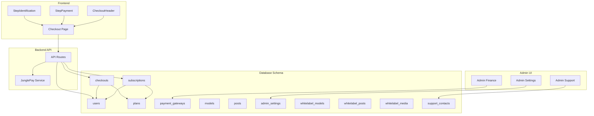
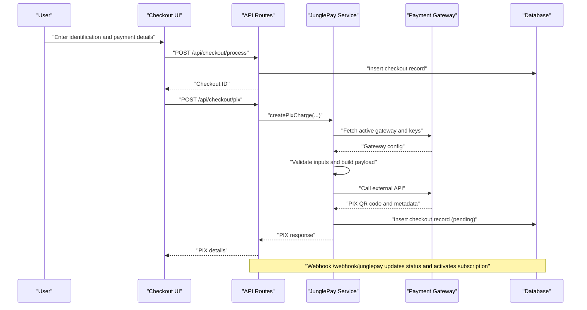
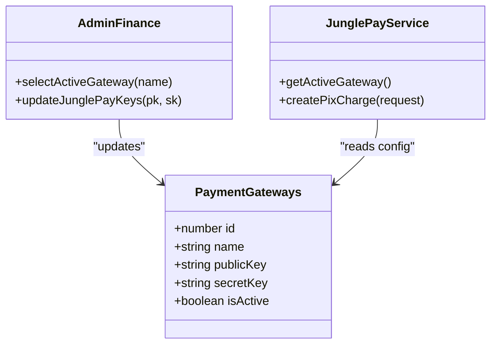
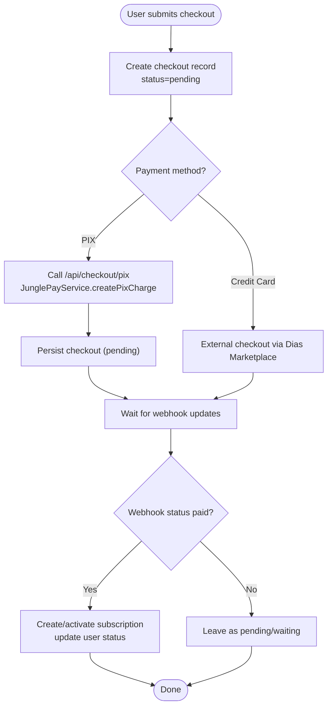
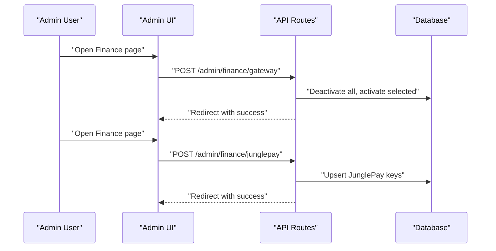
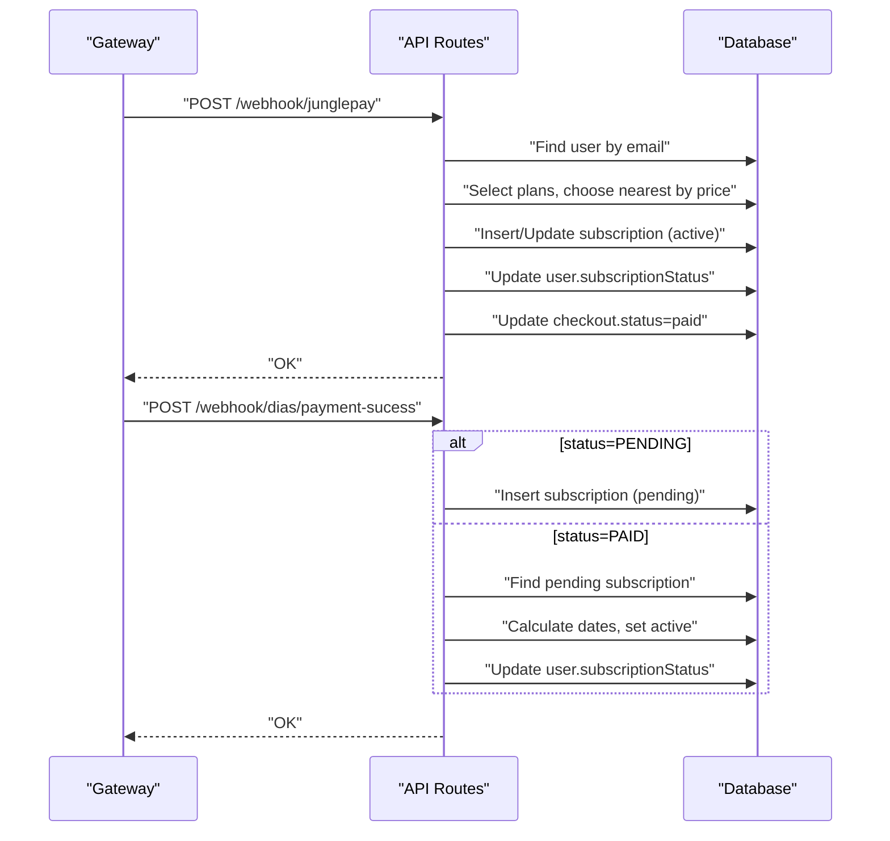
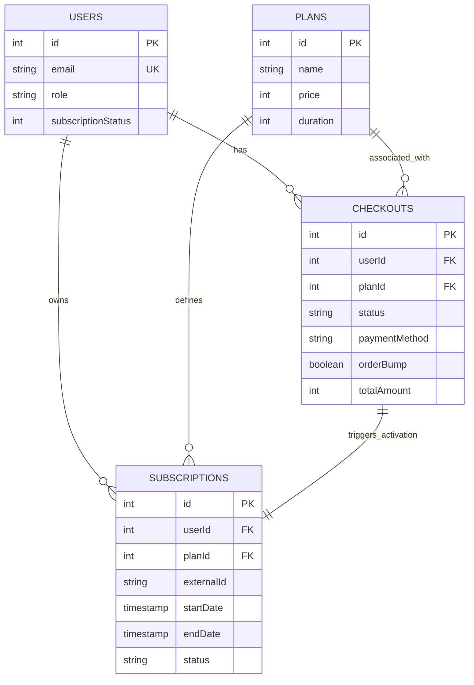
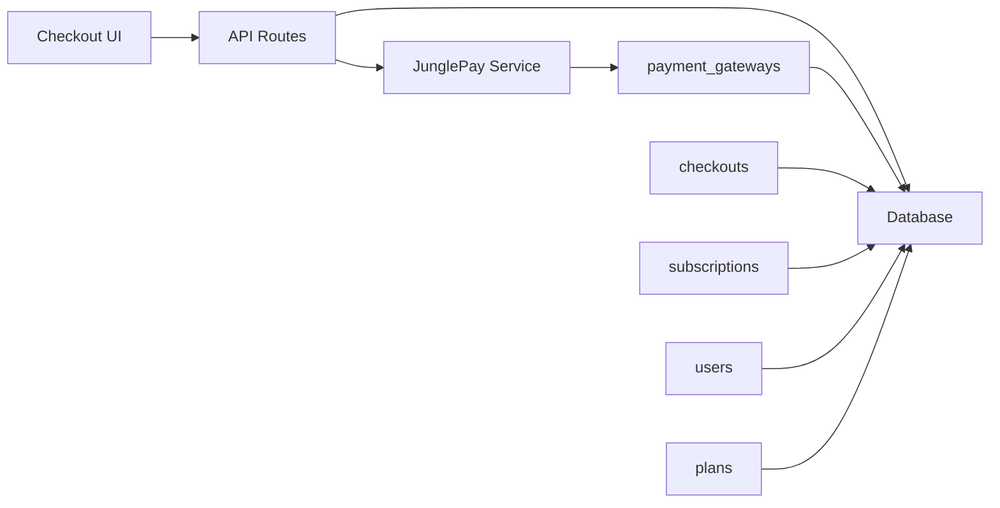

# Payment & Administrative Data Models

<cite>
**Referenced Files in This Document**
- [schema.ts](file://src/db/schema.ts)
- [drizzle.config.ts](file://drizzle.config.ts)
- [Checkout.tsx](file://src/pages/Checkout.tsx)
- [StepIdentification.tsx](file://src/components/organisms/StepIdentification.tsx)
- [StepPayment.tsx](file://src/components/organisms/StepPayment.tsx)
- [CheckoutHeader.tsx](file://src/components/organisms/CheckoutHeader.tsx)
- [api.tsx](file://src/routes/api.tsx)
- [junglepay.ts](file://src/services/junglepay.ts)
- [Finance.tsx](file://src/pages/admin/Finance.tsx)
- [Settings.tsx](file://src/pages/admin/Settings.tsx)
- [Support.tsx](file://src/pages/admin/Support.tsx)
</cite>

## Table of Contents
1. [Introduction](#introduction)
2. [Project Structure](#project-structure)
3. [Core Components](#core-components)
4. [Architecture Overview](#architecture-overview)
5. [Detailed Component Analysis](#detailed-component-analysis)
6. [Dependency Analysis](#dependency-analysis)
7. [Performance Considerations](#performance-considerations)
8. [Troubleshooting Guide](#troubleshooting-guide)
9. [Conclusion](#conclusion)

## Introduction
This document explains the payment processing and administrative data models used by the system, focusing on payment_gateways, checkouts, admin_settings, and support_contacts. It details how payment gateway configuration is managed, how the checkout workflow tracks transactions, and how administrative settings influence payment behavior. It also clarifies the relationships among payment processing, subscription management, and user account handling, along with webhook integration patterns, payment status tracking, and administrative configuration options.

## Project Structure
The payment and administrative subsystems are implemented across database schemas, frontend checkout pages, backend API routes, and admin UI pages. The schema defines core entities and their relationships, while the API routes orchestrate payment creation, status updates, and administrative configuration. The checkout UI captures customer data and triggers payment processing.

**Diagram sources**
- [schema.ts](file://src/db/schema.ts#L6-L127)
- [Checkout.tsx](file://src/pages/Checkout.tsx#L19-L74)
- [StepIdentification.tsx](file://src/components/organisms/StepIdentification.tsx#L11-L50)
- [StepPayment.tsx](file://src/components/organisms/StepPayment.tsx#L11-L61)
- [CheckoutHeader.tsx](file://src/components/organisms/CheckoutHeader.tsx#L3-L32)
- [api.tsx](file://src/routes/api.tsx#L15-L170)
- [junglepay.ts](file://src/services/junglepay.ts#L52-L270)
- [Finance.tsx](file://src/pages/admin/Finance.tsx#L18-L112)
- [Settings.tsx](file://src/pages/admin/Settings.tsx#L5-L51)
- [Support.tsx](file://src/pages/admin/Support.tsx#L15-L88)

**Section sources**
- [schema.ts](file://src/db/schema.ts#L1-L178)
- [drizzle.config.ts](file://drizzle.config.ts#L1-L11)

## Core Components
- Users: Store identity, roles, and subscription status.
- Plans: Define pricing, duration, and checkout configuration flags.
- Payment Gateways: Store gateway metadata and activation state.
- Subscriptions: Track user plan ownership, external transaction IDs, and lifecycle.
- Checkouts: Capture transaction attempts, customer info, and payment method.
- Admin Settings: Centralized key-value store for system-wide configuration.
- Support Contacts: Manage support channel links and visibility.
- Whitelabel Models/Posts/Media: Separate content ingestion and publishing pipeline.

**Section sources**
- [schema.ts](file://src/db/schema.ts#L6-L127)
- [schema.ts](file://src/db/schema.ts#L68-L111)

## Architecture Overview
The system supports two primary payment flows:
- Internal checkout via JunglePay: The frontend collects customer data, the backend creates a checkout record, and the JunglePay service generates a PIX charge and persists a checkout record. Webhooks update statuses and activate subscriptions.
- External checkout via Dias Marketplace: The system records pending subscriptions from webhooks and later activates them upon PAID events.

Administrative controls:
- Admin Finance page toggles active gateway and updates JunglePay keys.
- Admin Settings page exposes general system configuration (placeholder in current UI).
- Admin Support page manages support contact channels.

**Diagram sources**
- [Checkout.tsx](file://src/pages/Checkout.tsx#L19-L74)
- [api.tsx](file://src/routes/api.tsx#L15-L86)
- [junglepay.ts](file://src/services/junglepay.ts#L107-L268)
- [schema.ts](file://src/db/schema.ts#L113-L127)

## Detailed Component Analysis

### Payment Gateways Management
- Purpose: Store gateway configurations and activation state.
- Key fields: name (unique), publicKey, secretKey, isActive.
- Admin actions:
  - Select active gateway (Dias Marketplace or JunglePay).
  - Configure JunglePay public and secret keys.
- Behavior:
  - The JunglePay service checks gateway existence and activation before processing payments.
  - Admin routes persist gateway preferences and keys.

**Diagram sources**
- [schema.ts](file://src/db/schema.ts#L29-L35)
- [Finance.tsx](file://src/pages/admin/Finance.tsx#L39-L107)
- [api.tsx](file://src/routes/api.tsx#L173-L216)
- [junglepay.ts](file://src/services/junglepay.ts#L57-L65)

**Section sources**
- [schema.ts](file://src/db/schema.ts#L29-L35)
- [Finance.tsx](file://src/pages/admin/Finance.tsx#L18-L112)
- [api.tsx](file://src/routes/api.tsx#L173-L216)
- [junglepay.ts](file://src/services/junglepay.ts#L57-L65)

### Checkout Workflow Tracking
- Frontend:
  - Checkout page renders three steps: identification, payment, and success.
  - StepPayment presents payment method selection and order bump option.
  - StepIdentification captures email, name, CPF, and phone.
- Backend:
  - Processes checkout creation and returns a checkout ID.
  - Generates PIX charges via JunglePay and persists a pending checkout.
- Data model:
  - Checkouts capture customer info, plan association, payment method, order bump flag, totals, and status.

**Diagram sources**
- [Checkout.tsx](file://src/pages/Checkout.tsx#L19-L74)
- [StepIdentification.tsx](file://src/components/organisms/StepIdentification.tsx#L11-L50)
- [StepPayment.tsx](file://src/components/organisms/StepPayment.tsx#L11-L61)
- [api.tsx](file://src/routes/api.tsx#L15-L86)
- [junglepay.ts](file://src/services/junglepay.ts#L107-L268)
- [schema.ts](file://src/db/schema.ts#L113-L127)

**Section sources**
- [Checkout.tsx](file://src/pages/Checkout.tsx#L19-L74)
- [StepIdentification.tsx](file://src/components/organisms/StepIdentification.tsx#L11-L50)
- [StepPayment.tsx](file://src/components/organisms/StepPayment.tsx#L11-L61)
- [api.tsx](file://src/routes/api.tsx#L15-L86)
- [junglepay.ts](file://src/services/junglepay.ts#L107-L268)
- [schema.ts](file://src/db/schema.ts#L113-L127)

### Administrative Settings Management
- Admin Finance:
  - Selects active gateway and updates JunglePay keys.
  - Redirects back to Finance page with success feedback.
- Admin Settings:
  - Placeholder UI for general site settings and payment gateway toggles.
- Admin Support:
  - Manages support contact platforms (WhatsApp, Telegram) with activation flags.

**Diagram sources**
- [Finance.tsx](file://src/pages/admin/Finance.tsx#L39-L107)
- [api.tsx](file://src/routes/api.tsx#L173-L216)

**Section sources**
- [Finance.tsx](file://src/pages/admin/Finance.tsx#L18-L112)
- [Settings.tsx](file://src/pages/admin/Settings.tsx#L5-L51)
- [Support.tsx](file://src/pages/admin/Support.tsx#L15-L88)
- [api.tsx](file://src/routes/api.tsx#L173-L216)

### Webhook Integration Patterns
- JunglePay Webhook:
  - Receives transaction updates, identifies user by email, finds nearest plan by price, creates/activates subscription, updates user subscription status, and marks checkout as paid.
- Dias Marketplace Webhook:
  - Handles PENDING and PAID states:
    - PENDING: Creates a pending subscription linked to the external transaction ID.
    - PAID: Finds the pending subscription, calculates dates based on plan duration, activates the subscription, and updates user status.

**Diagram sources**
- [api.tsx](file://src/routes/api.tsx#L88-L170)
- [api.tsx](file://src/routes/api.tsx#L402-L506)

**Section sources**
- [api.tsx](file://src/routes/api.tsx#L88-L170)
- [api.tsx](file://src/routes/api.tsx#L402-L506)

### Relationship Between Payment Processing, Subscriptions, and User Accounts
- Payment processing starts with a checkout record and a gateway charge.
- Successful payment triggers subscription creation/activation and user status updates.
- The checkout record serves as a bridge between the transaction attempt and the resulting subscription.

**Diagram sources**
- [schema.ts](file://src/db/schema.ts#L6-L127)

**Section sources**
- [schema.ts](file://src/db/schema.ts#L6-L127)
- [api.tsx](file://src/routes/api.tsx#L15-L86)
- [api.tsx](file://src/routes/api.tsx#L88-L170)
- [api.tsx](file://src/routes/api.tsx#L402-L506)

## Dependency Analysis
- Checkout UI depends on API routes for processing and payment initiation.
- API routes depend on the JunglePay service for PIX generation and on the database for persistence.
- The JunglePay service depends on the payment_gateways table for configuration and on external APIs for payment processing.
- Webhooks depend on the database to locate users and plans and to update subscriptions and user status.

**Diagram sources**
- [Checkout.tsx](file://src/pages/Checkout.tsx#L19-L74)
- [api.tsx](file://src/routes/api.tsx#L15-L86)
- [junglepay.ts](file://src/services/junglepay.ts#L57-L65)
- [schema.ts](file://src/db/schema.ts#L29-L46)

**Section sources**
- [Checkout.tsx](file://src/pages/Checkout.tsx#L19-L74)
- [api.tsx](file://src/routes/api.tsx#L15-L86)
- [junglepay.ts](file://src/services/junglepay.ts#L57-L65)
- [schema.ts](file://src/db/schema.ts#L29-L46)

## Performance Considerations
- Minimize database queries in hot paths:
  - Prefer single-row lookups with limits when finding users or plans.
  - Use targeted selects to avoid unnecessary joins during webhook processing.
- Webhook idempotency:
  - Ensure subscription updates are safe against repeated events (check externalId and status).
- Caching and indexing:
  - Consider indexing on users.email, checkouts.customerEmail, and subscriptions.externalId to speed up lookups.
- Asynchronous processing:
  - Offload heavy operations (e.g., external API calls) to background tasks if needed.

## Troubleshooting Guide
- Gateway not configured or inactive:
  - Symptom: PIX creation fails with gateway-related errors.
  - Action: Verify active gateway and keys in Admin Finance.
- Invalid customer data:
  - Symptom: PIX creation returns invalid data errors.
  - Action: Ensure required fields (name, email, CPF) are present and valid.
- Webhook not activating subscriptions:
  - Symptom: Transactions remain pending after payment.
  - Action: Confirm webhook endpoint is reachable, payload type is correct, and user exists by email.
- User not found during webhook:
  - Symptom: Webhook logs indicate user not found.
  - Action: Ensure user registration precedes checkout or handle guest scenarios appropriately.

**Section sources**
- [junglepay.ts](file://src/services/junglepay.ts#L107-L133)
- [api.tsx](file://src/routes/api.tsx#L88-L170)
- [api.tsx](file://src/routes/api.tsx#L402-L506)

## Conclusion
The system integrates internal and external payment flows with robust administrative controls and webhook-driven status updates. Payment gateway configuration, checkout tracking, and subscription management are tightly coupled with user account state. Administrators can manage gateway selection and keys, while the backend ensures consistent subscription activation and user status updates across both internal and external payment providers.