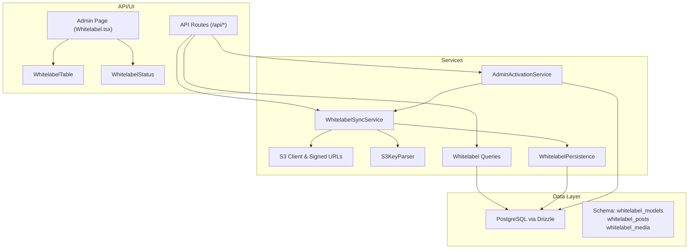
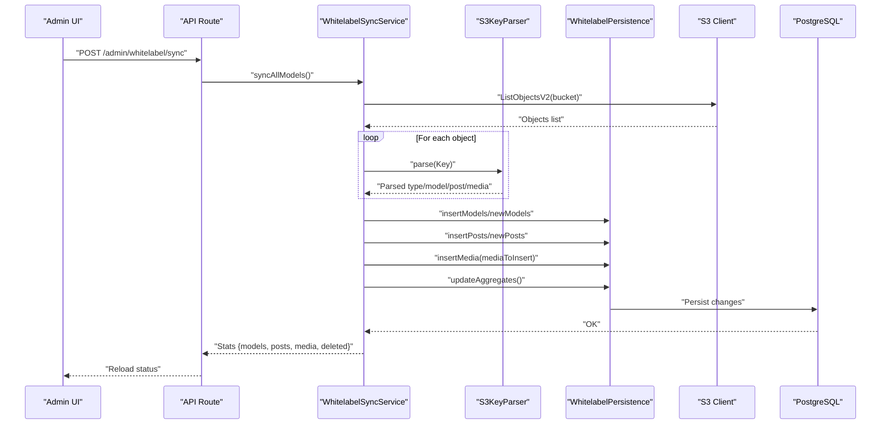
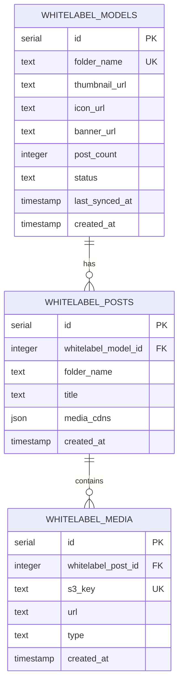
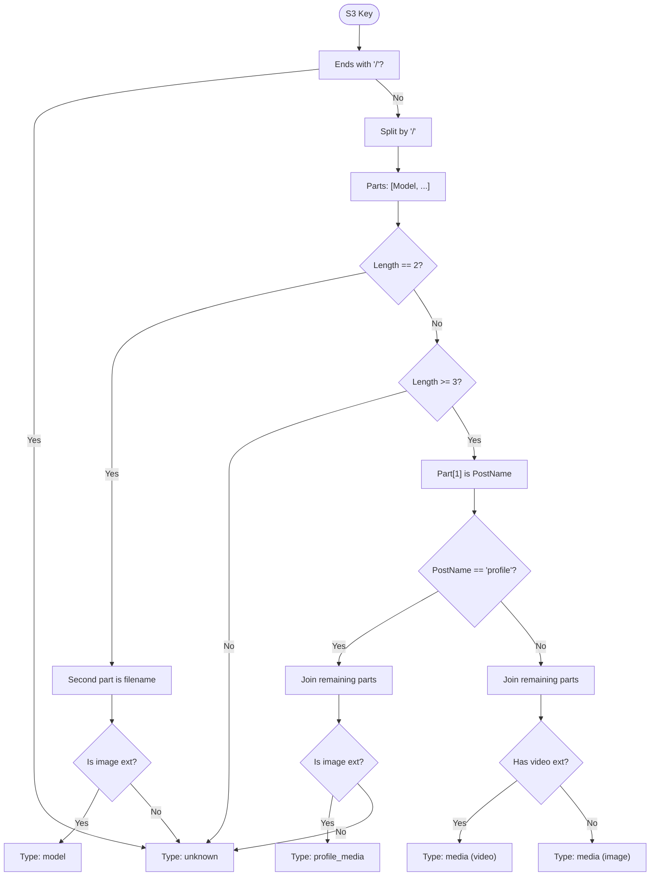
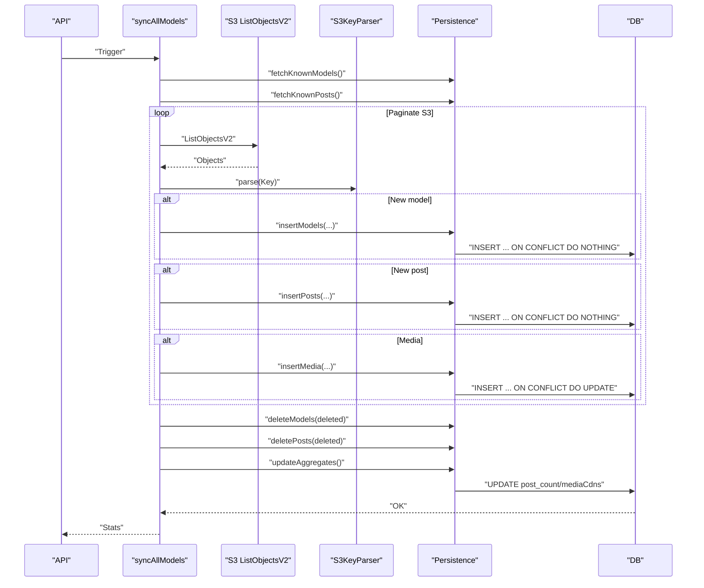
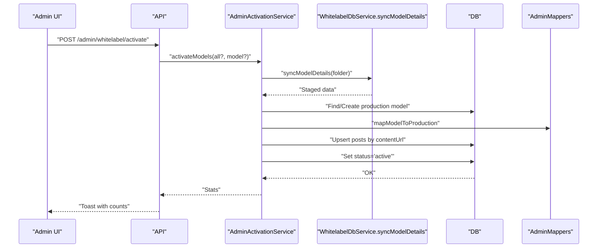
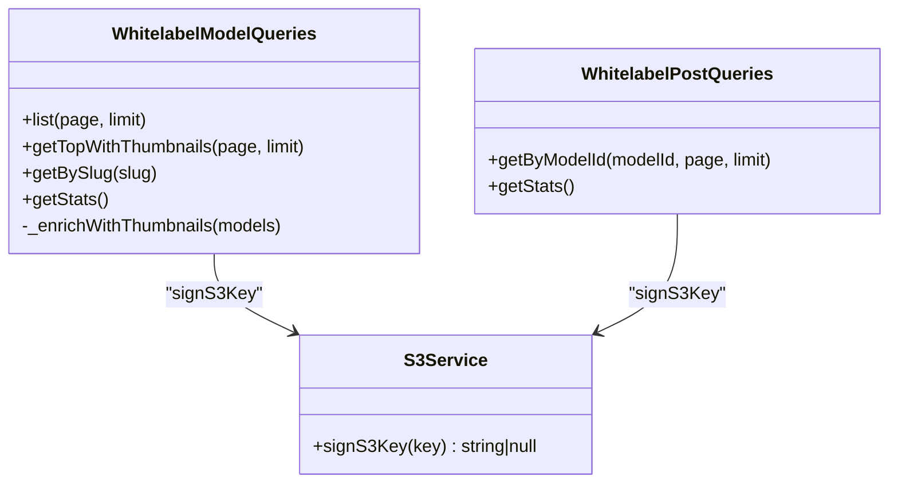
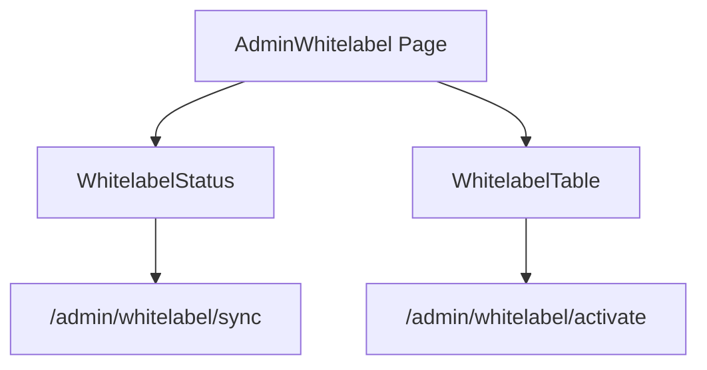
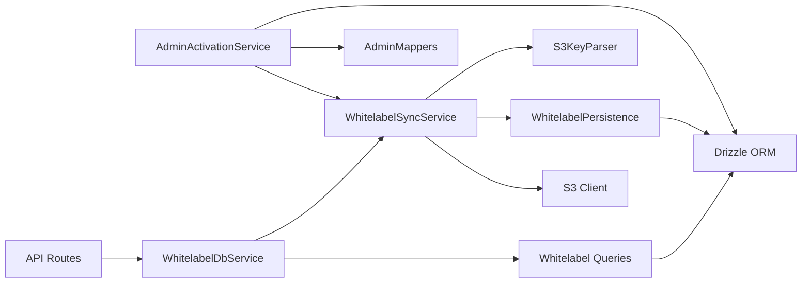

# White-label Data Models

<cite>
**Referenced Files in This Document**
- [schema.ts](file://src/db/schema.ts)
- [index.ts](file://src/db/index.ts)
- [drizzle.config.ts](file://drizzle.config.ts)
- [whitelabel.ts](file://src/services/whitelabel.ts)
- [sync.ts](file://src/services/whitelabel/sync.ts)
- [parser.ts](file://src/services/whitelabel/sync/parser.ts)
- [persistence.ts](file://src/services/whitelabel/sync/persistence.ts)
- [models.ts](file://src/services/whitelabel/queries/models.ts)
- [posts.ts](file://src/services/whitelabel/queries/posts.ts)
- [s3.ts](file://src/services/s3.ts)
- [api.tsx](file://src/routes/api.tsx)
- [activation.ts](file://src/services/admin/activation.ts)
- [mappers.ts](file://src/services/admin/mappers.ts)
- [Whitelabel.tsx](file://src/pages/admin/Whitelabel.tsx)
- [WhitelabelTable.tsx](file://src/components/organisms/WhitelabelTable.tsx)
- [WhitelabelStatus.tsx](file://src/components/organisms/WhitelabelStatus.tsx)
</cite>

## Table of Contents
1. [Introduction](#introduction)
2. [Project Structure](#project-structure)
3. [Core Components](#core-components)
4. [Architecture Overview](#architecture-overview)
5. [Detailed Component Analysis](#detailed-component-analysis)
6. [Dependency Analysis](#dependency-analysis)
7. [Performance Considerations](#performance-considerations)
8. [Troubleshooting Guide](#troubleshooting-guide)
9. [Conclusion](#conclusion)
10. [Appendices](#appendices)

## Introduction
This document explains the white-label system’s data models and ingestion pipeline. It covers the multi-tenant architecture for content ingestion, folder-based organization, and S3 integration patterns. It documents the hierarchical relationships among whitelabel_models, whitelabel_posts, and whitelabel_media, along with status tracking, synchronization workflows, and content lifecycle management. Practical examples demonstrate how white-label content is ingested and managed.

## Project Structure
The white-label system is implemented with:
- PostgreSQL schema using Drizzle ORM for typed database operations
- S3 integration for content storage and signed URL generation
- A three-tier sync pipeline: parsing S3 keys, persisting to staging tables, and upserting production models
- Admin-facing UI components and API endpoints for triggering sync and activation

**Diagram sources**
- [schema.ts](file://src/db/schema.ts#L73-L103)
- [index.ts](file://src/db/index.ts#L1-L8)
- [drizzle.config.ts](file://drizzle.config.ts#L1-L11)
- [s3.ts](file://src/services/s3.ts#L1-L48)
- [parser.ts](file://src/services/whitelabel/sync/parser.ts#L1-L59)
- [persistence.ts](file://src/services/whitelabel/sync/persistence.ts#L1-L94)
- [sync.ts](file://src/services/whitelabel/sync.ts#L1-L334)
- [models.ts](file://src/services/whitelabel/queries/models.ts#L1-L94)
- [posts.ts](file://src/services/whitelabel/queries/posts.ts#L1-L47)
- [api.tsx](file://src/routes/api.tsx#L1-L519)
- [Whitelabel.tsx](file://src/pages/admin/Whitelabel.tsx#L1-L30)
- [WhitelabelTable.tsx](file://src/components/organisms/WhitelabelTable.tsx#L1-L111)
- [WhitelabelStatus.tsx](file://src/components/organisms/WhitelabelStatus.tsx#L1-L104)

**Section sources**
- [schema.ts](file://src/db/schema.ts#L1-L178)
- [index.ts](file://src/db/index.ts#L1-L8)
- [drizzle.config.ts](file://drizzle.config.ts#L1-L11)
- [s3.ts](file://src/services/s3.ts#L1-L48)
- [api.tsx](file://src/routes/api.tsx#L1-L519)

## Core Components
- whitelabel_models: Multi-tenant container for white-labeled content. Each record corresponds to a top-level S3 folder (model).
- whitelabel_posts: Staging posts under a model, keyed by folderName per model.
- whitelabel_media: Assets linked to posts, with S3 key and CDN URL.

Key attributes and statuses:
- whitelabel_models: folderName (unique), postCount, status (new, active, hidden), timestamps.
- whitelabel_posts: whitelabelModelId, folderName, title, mediaCdns (aggregated JSON).
- whitelabel_media: whitelabelPostId, s3Key (unique), url, type (image/video).

Relationships:
- One-to-many: whitelabel_models → whitelabel_posts
- One-to-many: whitelabel_posts → whitelabel_media
- Aggregation: post_count updated via SQL; mediaCdns built per post

**Section sources**
- [schema.ts](file://src/db/schema.ts#L73-L103)
- [persistence.ts](file://src/services/whitelabel/sync/persistence.ts#L63-L92)

## Architecture Overview
The white-label ingestion pipeline follows a staged approach:
1. S3 listing and parsing: Detect models, posts, and media from S3 keys.
2. Staging persistence: Insert or update whitelabel_* records without affecting production.
3. Aggregation: Compute post_count and mediaCdns.
4. Activation: Upsert production models and posts, mark staging as active.

**Diagram sources**
- [api.tsx](file://src/routes/api.tsx#L250-L273)
- [sync.ts](file://src/services/whitelabel/sync.ts#L7-L197)
- [parser.ts](file://src/services/whitelabel/sync/parser.ts#L10-L59)
- [persistence.ts](file://src/services/whitelabel/sync/persistence.ts#L17-L92)
- [s3.ts](file://src/services/s3.ts#L1-L48)

## Detailed Component Analysis

### Data Models and Relationships
The schema defines three core tables and their relations.

- Uniqueness and constraints:
  - whitelabel_models.folder_name is unique.
  - whitelabel_posts.folderName is unique per model (composite unique enforced).
  - whitelabel_media.s3Key is unique.
- Aggregation:
  - post_count updated via SQL subqueries.
  - mediaCdns aggregated per post using JSON build.

**Diagram sources**
- [schema.ts](file://src/db/schema.ts#L73-L103)
- [persistence.ts](file://src/services/whitelabel/sync/persistence.ts#L63-L92)

**Section sources**
- [schema.ts](file://src/db/schema.ts#L73-L103)
- [persistence.ts](file://src/services/whitelabel/sync/persistence.ts#L63-L92)

### S3 Integration and Key Parsing
- S3 configuration: DigitalOcean Spaces endpoint, credentials, and bucket.
- Key parsing:
  - Models: top-level folder names.
  - Posts: ModelName/PostName/*.
  - Profile media: ModelName/profile/*. Recognized image files yield profile_media.
  - Media: inferred by extension; images and videos supported.
- Signed URLs:
  - signS3Key generates short-lived signed URLs for secure access.

**Diagram sources**
- [parser.ts](file://src/services/whitelabel/sync/parser.ts#L10-L59)
- [s3.ts](file://src/services/s3.ts#L1-L48)

**Section sources**
- [parser.ts](file://src/services/whitelabel/sync/parser.ts#L1-L59)
- [s3.ts](file://src/services/s3.ts#L25-L47)

### Synchronization Workflow
The sync service orchestrates ingestion across three passes:
1. Discover models and posts by scanning S3 objects.
2. Insert new models and posts (with conflict handling).
3. Insert media and update model profile images.
4. Delete orphaned models/posts not present in current listing.
5. Recompute aggregates (post_count and mediaCdns).

**Diagram sources**
- [sync.ts](file://src/services/whitelabel/sync.ts#L7-L197)
- [persistence.ts](file://src/services/whitelabel/sync/persistence.ts#L17-L92)
- [parser.ts](file://src/services/whitelabel/sync/parser.ts#L10-L59)

**Section sources**
- [sync.ts](file://src/services/whitelabel/sync.ts#L7-L197)
- [persistence.ts](file://src/services/whitelabel/sync/persistence.ts#L5-L94)

### Activation and Production Upsert
Admin activation moves staged data into production:
- Sync a specific model or all models.
- Fetch staged model with posts and media.
- Upsert production models by name.
- Upsert production posts by matching contentUrl.
- Mark staged model as active.

**Diagram sources**
- [api.tsx](file://src/routes/api.tsx#L251-L273)
- [activation.ts](file://src/services/admin/activation.ts#L8-L86)
- [mappers.ts](file://src/services/admin/mappers.ts#L3-L40)
- [whitelabel.ts](file://src/services/whitelabel.ts#L5-L24)

**Section sources**
- [activation.ts](file://src/services/admin/activation.ts#L8-L86)
- [mappers.ts](file://src/services/admin/mappers.ts#L3-L40)
- [whitelabel.ts](file://src/services/whitelabel.ts#L5-L24)

### Query Services and Signed URLs
- WhitelabelModelQueries:
  - Lists models with pagination and enriches with thumbnails.
  - Retrieves top models by postCount.
  - Returns model by folderName with signed profile URLs.
  - Provides model count statistics.
- WhitelabelPostQueries:
  - Lists posts for a model with pagination.
  - Returns mediaCdns with signed image and video URLs.
  - Provides post and media counts.

**Diagram sources**
- [models.ts](file://src/services/whitelabel/queries/models.ts#L6-L94)
- [posts.ts](file://src/services/whitelabel/queries/posts.ts#L6-L47)
- [s3.ts](file://src/services/s3.ts#L25-L47)

**Section sources**
- [models.ts](file://src/services/whitelabel/queries/models.ts#L6-L94)
- [posts.ts](file://src/services/whitelabel/queries/posts.ts#L6-L47)
- [s3.ts](file://src/services/s3.ts#L25-L47)

### Admin UI and Status Cards
- AdminWhitelabel page renders status cards and a table of models.
- WhitelabelStatus displays storage health, counts, and a sync trigger.
- WhitelabelTable shows model thumbnails, post counts, status, and import actions.

**Diagram sources**
- [Whitelabel.tsx](file://src/pages/admin/Whitelabel.tsx#L15-L30)
- [WhitelabelStatus.tsx](file://src/components/organisms/WhitelabelStatus.tsx#L1-L104)
- [WhitelabelTable.tsx](file://src/components/organisms/WhitelabelTable.tsx#L1-L111)
- [api.tsx](file://src/routes/api.tsx#L250-L273)

**Section sources**
- [Whitelabel.tsx](file://src/pages/admin/Whitelabel.tsx#L1-L30)
- [WhitelabelStatus.tsx](file://src/components/organisms/WhitelabelStatus.tsx#L1-L104)
- [WhitelabelTable.tsx](file://src/components/organisms/WhitelabelTable.tsx#L1-L111)
- [api.tsx](file://src/routes/api.tsx#L250-L273)

## Dependency Analysis
- Database layer:
  - Drizzle ORM connects to PostgreSQL using DATABASE_URL.
  - Drizzle Kit config defines schema location and credentials.
- Service layer:
  - WhitelabelDbService exposes sync and query methods.
  - WhitelabelSyncService depends on S3 client, parser, and persistence.
  - AdminActivationService depends on staging data and mappers.
- API layer:
  - Routes trigger sync, activation, and serve paginated models/posts.

**Diagram sources**
- [api.tsx](file://src/routes/api.tsx#L1-L519)
- [whitelabel.ts](file://src/services/whitelabel.ts#L1-L24)
- [sync.ts](file://src/services/whitelabel/sync.ts#L1-L334)
- [parser.ts](file://src/services/whitelabel/sync/parser.ts#L1-L59)
- [persistence.ts](file://src/services/whitelabel/sync/persistence.ts#L1-L94)
- [s3.ts](file://src/services/s3.ts#L1-L48)
- [index.ts](file://src/db/index.ts#L1-L8)
- [drizzle.config.ts](file://drizzle.config.ts#L1-L11)
- [activation.ts](file://src/services/admin/activation.ts#L1-L86)
- [mappers.ts](file://src/services/admin/mappers.ts#L1-L40)

**Section sources**
- [api.tsx](file://src/routes/api.tsx#L1-L519)
- [whitelabel.ts](file://src/services/whitelabel.ts#L1-L24)
- [index.ts](file://src/db/index.ts#L1-L8)
- [drizzle.config.ts](file://drizzle.config.ts#L1-L11)

## Performance Considerations
- Batch and chunking:
  - S3 listing uses MaxKeys and ContinuationToken to paginate.
  - Media inserts use onConflictDoUpdate to handle duplicates efficiently.
- Indexing and uniqueness:
  - Unique constraints on folderName and s3Key reduce duplicate writes.
- Aggregation efficiency:
  - Single UPDATE statements compute post_count and mediaCdns per model/post.
- Signed URL caching:
  - Frontend caches signed URLs to minimize repeated signing requests.

[No sources needed since this section provides general guidance]

## Troubleshooting Guide
Common issues and resolutions:
- S3 listing returns empty:
  - Verify bucket name and credentials in S3 configuration.
  - Ensure S3 keys follow the expected folder structure.
- Duplicate or missing media entries:
  - Confirm s3Key uniqueness and onConflictDoUpdate behavior.
- Stale aggregates:
  - Trigger updateAggregates after bulk inserts.
- Activation failures:
  - Check mapper outputs and contentUrl uniqueness in production posts.

**Section sources**
- [s3.ts](file://src/services/s3.ts#L4-L12)
- [persistence.ts](file://src/services/whitelabel/sync/persistence.ts#L45-L54)
- [sync.ts](file://src/services/whitelabel/sync.ts#L195-L196)
- [mappers.ts](file://src/services/admin/mappers.ts#L21-L38)

## Conclusion
The white-label system organizes multi-tenant content around S3 folder structures and stages ingestion in whitelabel_* tables before upserting to production. The pipeline supports robust discovery, deduplication, aggregation, and activation workflows. Admin UI components provide visibility and controls for syncing and importing content.

[No sources needed since this section summarizes without analyzing specific files]

## Appendices

### Example Workflows

- Full sync of all models:
  - Trigger: POST /admin/whitelabel/sync
  - Behavior: Scan bucket, detect new models/posts/media, persist, compute aggregates, delete orphans, return stats.

- Sync a single model:
  - Trigger: POST /admin/whitelabel/activate with model folderName
  - Behavior: Run syncModelDetails for the folder, upsert production model and posts, mark staging active.

- Retrieve model posts with signed media:
  - GET /api/models/:modelName/posts?page=1&limit=20
  - Behavior: Return posts with signed images/videos in mediaCdns.

**Section sources**
- [api.tsx](file://src/routes/api.tsx#L251-L273)
- [api.tsx](file://src/routes/api.tsx#L296-L313)
- [sync.ts](file://src/services/whitelabel/sync.ts#L199-L205)
- [posts.ts](file://src/services/whitelabel/queries/posts.ts#L7-L35)