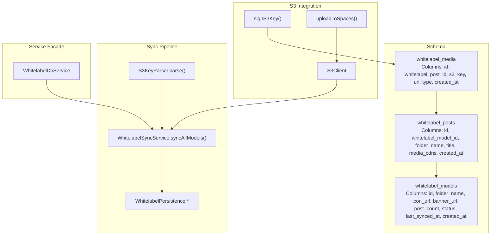
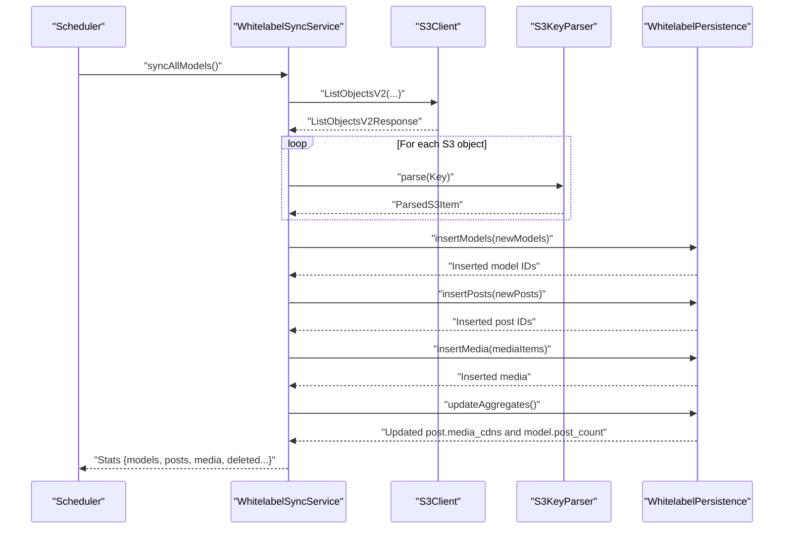
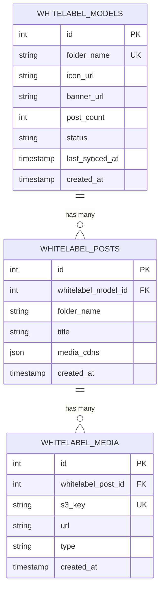
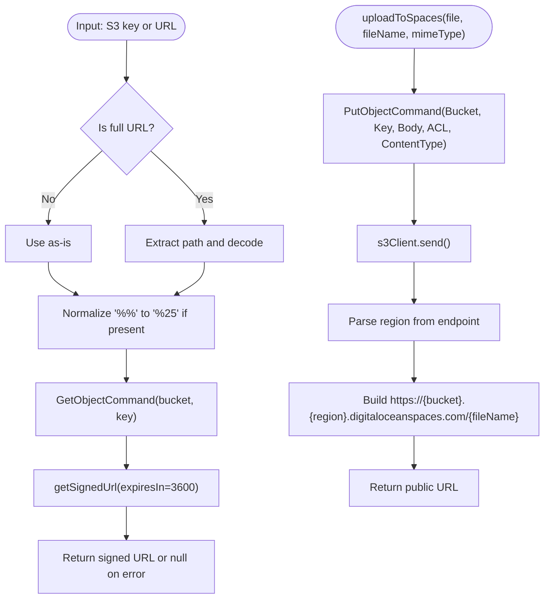
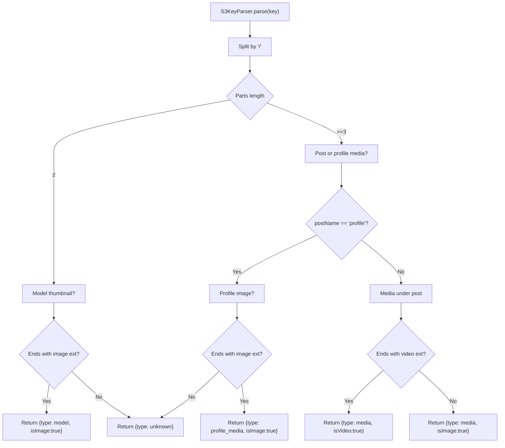
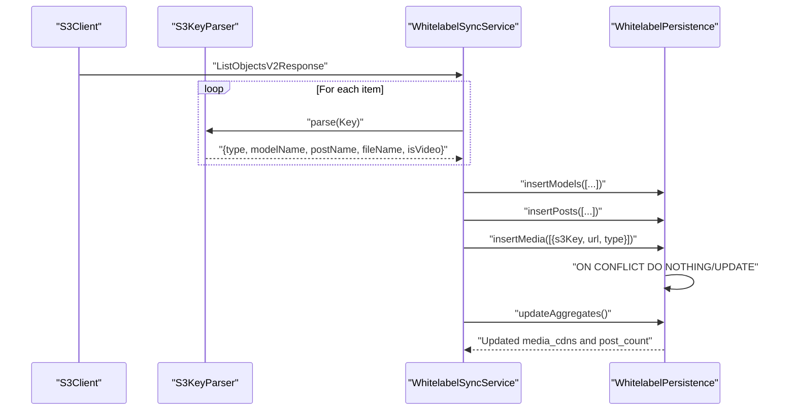
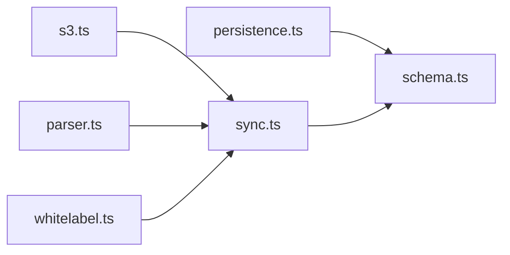

# White-label Media

<cite>
**Referenced Files in This Document**
- [schema.ts](file://src/db/schema.ts)
- [0000_special_white_queen.sql](file://drizzle/0000_special_white_queen.sql)
- [s3.ts](file://src/services/s3.ts)
- [storage.ts](file://src/utils/storage.ts)
- [whitelabel.ts](file://src/services/whitelabel.ts)
- [sync.ts](file://src/services/whitelabel/sync.ts)
- [parser.ts](file://src/services/whitelabel/sync/parser.ts)
- [persistence.ts](file://src/services/whitelabel/sync/persistence.ts)
</cite>

## Table of Contents
1. [Introduction](#introduction)
2. [Project Structure](#project-structure)
3. [Core Components](#core-components)
4. [Architecture Overview](#architecture-overview)
5. [Detailed Component Analysis](#detailed-component-analysis)
6. [Dependency Analysis](#dependency-analysis)
7. [Performance Considerations](#performance-considerations)
8. [Troubleshooting Guide](#troubleshooting-guide)
9. [Conclusion](#conclusion)
10. [Appendices](#appendices)

## Introduction
This document explains the white-label media subsystem, focusing on the whitelabel_media table and the end-to-end media asset management pipeline. It covers how media assets are discovered from S3, parsed and validated, persisted to the database, and exposed via URL generation and CDN-backed retrieval. It also documents the relationships with whitelabel_posts, S3 key management, URL generation, media type handling (image/video), and the broader white-label content ingestion pipeline. Cleanup procedures, synchronization examples, duplicate detection, and integration points are included, along with implementation notes for access control, CDN optimization, and storage management.

## Project Structure
The white-label media system spans schema definitions, S3 integration, parsing logic, persistence orchestration, and a higher-level service facade.

**Diagram sources**
- [schema.ts](file://src/db/schema.ts#L96-L103)
- [0000_special_white_queen.sql](file://drizzle/0000_special_white_queen.sql#L45-L80)
- [s3.ts](file://src/services/s3.ts#L14-L47)
- [storage.ts](file://src/utils/storage.ts#L18-L38)
- [parser.ts](file://src/services/whitelabel/sync/parser.ts#L10-L58)
- [sync.ts](file://src/services/whitelabel/sync.ts#L6-L197)
- [persistence.ts](file://src/services/whitelabel/sync/persistence.ts#L5-L93)
- [whitelabel.ts](file://src/services/whitelabel.ts#L5-L24)

**Section sources**
- [schema.ts](file://src/db/schema.ts#L96-L103)
- [0000_special_white_queen.sql](file://drizzle/0000_special_white_queen.sql#L45-L80)
- [s3.ts](file://src/services/s3.ts#L14-L47)
- [storage.ts](file://src/utils/storage.ts#L18-L38)
- [parser.ts](file://src/services/whitelabel/sync/parser.ts#L10-L58)
- [sync.ts](file://src/services/whitelabel/sync.ts#L6-L197)
- [persistence.ts](file://src/services/whitelabel/sync/persistence.ts#L5-L93)
- [whitelabel.ts](file://src/services/whitelabel.ts#L5-L24)

## Core Components
- whitelabel_media: Stores per-post media entries with S3 key, resolved CDN URL, and type (image/video). It belongs to a whitelabel_post and cascades deletion when the post is removed.
- whitelabel_posts: Aggregates media CDNs per post into a JSON field for efficient client-side rendering.
- S3 integration: Provides signed URL generation for private access and public upload utilities for external workflows.
- Sync pipeline: Discovers S3 keys, parses them into models/posts/media, persists models and posts, and inserts media with conflict handling.
- Persistence layer: Manages upserts, deletions, and aggregate updates for media counts and post-level media CDNs.

**Section sources**
- [schema.ts](file://src/db/schema.ts#L96-L103)
- [0000_special_white_queen.sql](file://drizzle/0000_special_white_queen.sql#L45-L80)
- [s3.ts](file://src/services/s3.ts#L25-L47)
- [storage.ts](file://src/utils/storage.ts#L18-L38)
- [sync.ts](file://src/services/whitelabel/sync.ts#L6-L197)
- [persistence.ts](file://src/services/whitelabel/sync/persistence.ts#L45-L92)

## Architecture Overview
The media lifecycle is driven by periodic S3 listings and a three-pass synchronization process:
1. Discover and normalize models and posts.
2. Insert posts for discovered media groups.
3. Insert media entries with type detection and URL generation.

**Diagram sources**
- [sync.ts](file://src/services/whitelabel/sync.ts#L7-L197)
- [parser.ts](file://src/services/whitelabel/sync/parser.ts#L10-L58)
- [persistence.ts](file://src/services/whitelabel/sync/persistence.ts#L17-L92)

## Detailed Component Analysis

### Schema: whitelabel_media and Relationships
- Table structure: primary key, foreign key to whitelabel_posts with cascade delete, unique S3 key, optional URL, type enum image/video, creation timestamp.
- Relationships: belongs to whitelabel_posts; whitelabel_posts aggregates media CDNs into a JSON field for fast retrieval.

**Diagram sources**
- [schema.ts](file://src/db/schema.ts#L73-L83)
- [schema.ts](file://src/db/schema.ts#L85-L94)
- [schema.ts](file://src/db/schema.ts#L96-L103)
- [0000_special_white_queen.sql](file://drizzle/0000_special_white_queen.sql#L45-L80)

**Section sources**
- [schema.ts](file://src/db/schema.ts#L96-L103)
- [0000_special_white_queen.sql](file://drizzle/0000_special_white_queen.sql#L45-L80)

### S3 Key Management and URL Generation
- Key normalization: Accepts raw S3 keys or full HTTPS URLs; strips domain and decodes percent-encoded segments.
- Signed URL generation: Produces time-limited, publicly accessible links for private assets.
- Public upload utility: Uploads binary buffers to Spaces with appropriate MIME type and ACL, returning a public URL.

**Diagram sources**
- [s3.ts](file://src/services/s3.ts#L25-L47)
- [storage.ts](file://src/utils/storage.ts#L18-L38)

**Section sources**
- [s3.ts](file://src/services/s3.ts#L25-L47)
- [storage.ts](file://src/utils/storage.ts#L18-L38)

### Media Type Handling (Image/Video)
- Type detection is performed during S3 key parsing:
  - Images: recognized by extension (.jpg, .jpeg, .png, .webp).
  - Videos: recognized by extension (.mp4, .mov, .webm, .m4v, .mkv, .avi, .wmv, .flv).
- The sync pipeline sets the media type accordingly when inserting whitelabel_media.

**Diagram sources**
- [parser.ts](file://src/services/whitelabel/sync/parser.ts#L10-L58)

**Section sources**
- [parser.ts](file://src/services/whitelabel/sync/parser.ts#L10-L58)

### Media Lifecycle: From S3 to Database and Back
- Discovery: List S3 objects with pagination and continuation tokens.
- Parsing: Identify model, post, and media items; detect profile media and derive filenames.
- Upsert models and posts; resolve IDs for subsequent steps.
- Insert media with conflict handling on s3_key; update post-level media CDNs and model post counts.

**Diagram sources**
- [sync.ts](file://src/services/whitelabel/sync.ts#L7-L197)
- [parser.ts](file://src/services/whitelabel/sync/parser.ts#L10-L58)
- [persistence.ts](file://src/services/whitelabel/sync/persistence.ts#L17-L92)

**Section sources**
- [sync.ts](file://src/services/whitelabel/sync.ts#L7-L197)
- [persistence.ts](file://src/services/whitelabel/sync/persistence.ts#L45-L92)

### Duplicate Detection and Conflict Resolution
- Media insertion uses a conflict target on s3_key with an upsert strategy that preserves existing records and updates only the URL if provided.
- Model and post insertions use “do nothing on conflict” to avoid duplicates when the identifier already exists.

**Section sources**
- [persistence.ts](file://src/services/whitelabel/sync/persistence.ts#L45-L54)

### Cleanup Procedures
- Deleted models: Identified by absence in current listing; removed after updating aggregates.
- Deleted posts: Identified by absence in current listing for a given model; removed independently.
- Cascade behavior: Deleting a post deletes associated media due to foreign key cascade; deleting a model deletes posts and media accordingly.

**Section sources**
- [sync.ts](file://src/services/whitelabel/sync.ts#L154-L194)
- [schema.ts](file://src/db/schema.ts#L170-L178)

### URL Generation Patterns
- CDN URLs: Constructed from the configured bucket and region, with proper encoding of path segments.
- Signed URLs: Generated for temporary access to private objects.
- Public uploads: Return a public URL derived from the bucket endpoint and filename.

**Section sources**
- [sync.ts](file://src/services/whitelabel/sync.ts#L117-L141)
- [sync.ts](file://src/services/whitelabel/sync.ts#L279-L301)
- [s3.ts](file://src/services/s3.ts#L25-L47)
- [storage.ts](file://src/utils/storage.ts#L30-L34)

### Integration with the White-label Content Ingestion Pipeline
- The service facade exposes sync methods and statistics, enabling scheduled ingestion and monitoring.
- Aggregated media CDNs are stored on whitelabel_posts for efficient client-side rendering.

**Section sources**
- [whitelabel.ts](file://src/services/whitelabel.ts#L5-L24)
- [persistence.ts](file://src/services/whitelabel/sync/persistence.ts#L63-L92)

### Implementation Notes: Access Control, CDN Optimization, and Storage Management
- Access control:
  - Signed URLs enable controlled access to private S3 objects for short periods.
  - Public uploads set ACL to public-read; ensure bucket policies and CORS are configured appropriately.
- CDN optimization:
  - Prebuilt CDN URLs reduce latency; ensure DNS and caching policies are aligned with the bucket endpoint.
  - Consider origin pull caching or cache-control headers for frequently accessed media.
- Storage management:
  - Use pagination and chunked inserts to manage large S3 listings.
  - Monitor S3 key uniqueness constraints to prevent duplication and maintain referential integrity.
  - Periodic cleanup of deleted models and posts ensures database hygiene.

**Section sources**
- [s3.ts](file://src/services/s3.ts#L25-L47)
- [storage.ts](file://src/utils/storage.ts#L18-L38)
- [sync.ts](file://src/services/whitelabel/sync.ts#L199-L333)
- [persistence.ts](file://src/services/whitelabel/sync/persistence.ts#L63-L92)

## Dependency Analysis
The media subsystem depends on S3 clients, the schema definitions, and the sync/persistence layers. The service facade orchestrates the entire pipeline.

**Diagram sources**
- [s3.ts](file://src/services/s3.ts#L1-L12)
- [sync.ts](file://src/services/whitelabel/sync.ts#L1-L6)
- [parser.ts](file://src/services/whitelabel/sync/parser.ts#L1-L8)
- [persistence.ts](file://src/services/whitelabel/sync/persistence.ts#L1-L5)
- [schema.ts](file://src/db/schema.ts#L96-L103)
- [whitelabel.ts](file://src/services/whitelabel.ts#L1-L4)

**Section sources**
- [s3.ts](file://src/services/s3.ts#L1-L12)
- [sync.ts](file://src/services/whitelabel/sync.ts#L1-L6)
- [parser.ts](file://src/services/whitelabel/sync/parser.ts#L1-L8)
- [persistence.ts](file://src/services/whitelabel/sync/persistence.ts#L1-L5)
- [schema.ts](file://src/db/schema.ts#L96-L103)
- [whitelabel.ts](file://src/services/whitelabel.ts#L1-L4)

## Performance Considerations
- Batch sizing: The sync loops process items in batches; tune MaxKeys and chunk sizes to balance memory and throughput.
- Conflict handling: Using ON CONFLICT DO NOTHING/UPDATE minimizes write contention and avoids redundant updates.
- Aggregation updates: Updating media_cdns and post_count in bulk reduces repeated scans and improves read performance.
- CDN caching: Configure long-lived cache headers for stable media assets to reduce origin load.

[No sources needed since this section provides general guidance]

## Troubleshooting Guide
- Signed URL failures: Verify S3 key normalization and percent-encoding handling; confirm credentials and expiration window.
- Upload failures: Check endpoint configuration, region alignment, and bucket permissions; ensure the correct ACL and content type are set.
- Missing media after sync: Confirm S3 key parsing logic recognizes the file extensions; verify that post IDs are resolvable before media insertion.
- Duplicate media entries: Inspect s3_key uniqueness and conflict resolution behavior; ensure the sync runs against the intended bucket and prefix.
- Deleted content not reflected: Ensure cleanup passes run after model/post deletion and that cascade rules are enforced.

**Section sources**
- [s3.ts](file://src/services/s3.ts#L25-L47)
- [storage.ts](file://src/utils/storage.ts#L18-L38)
- [parser.ts](file://src/services/whitelabel/sync/parser.ts#L10-L58)
- [persistence.ts](file://src/services/whitelabel/sync/persistence.ts#L45-L54)
- [sync.ts](file://src/services/whitelabel/sync.ts#L154-L194)

## Conclusion
The white-label media system integrates S3 discovery, robust parsing, and efficient persistence to deliver a scalable media ingestion pipeline. By leveraging unique S3 keys, conflict-aware inserts, and post-level media aggregation, it supports fast client rendering and clean cleanup. With signed URL generation and public upload utilities, it balances access control and performance. Extending the pipeline to include additional validations, CDN-specific headers, and monitoring hooks will further improve reliability and observability.

[No sources needed since this section summarizes without analyzing specific files]

## Appendices
- Example sync invocation: Use the service facade to trigger full or partial synchronization and inspect returned statistics.
- Data model references: See schema definitions and migrations for exact column types, constraints, and foreign keys.

**Section sources**
- [whitelabel.ts](file://src/services/whitelabel.ts#L5-L24)
- [schema.ts](file://src/db/schema.ts#L96-L103)
- [0000_special_white_queen.sql](file://drizzle/0000_special_white_queen.sql#L45-L80)