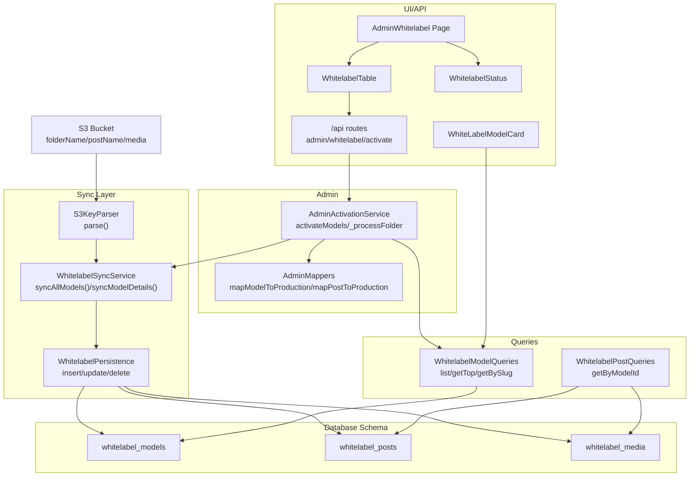
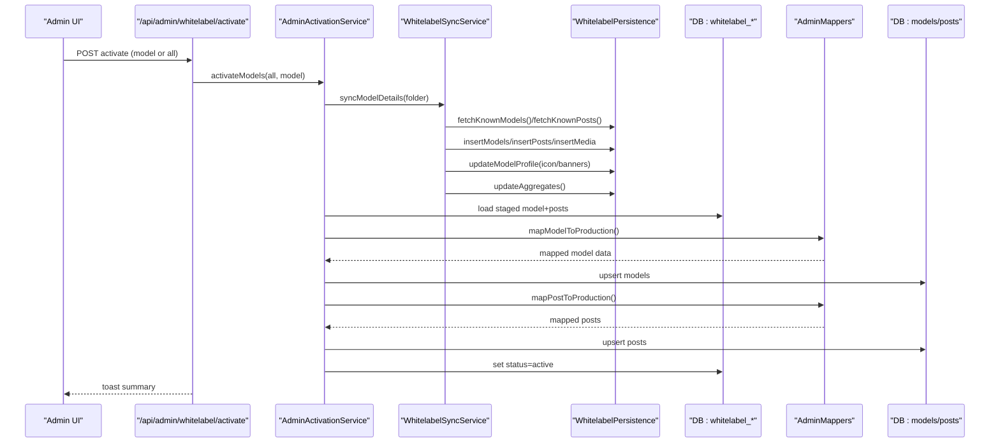
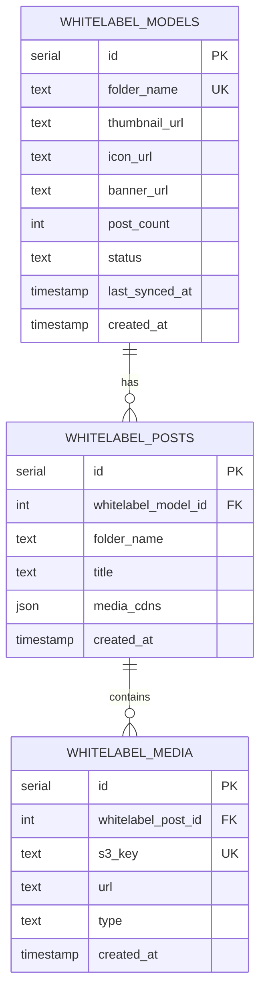
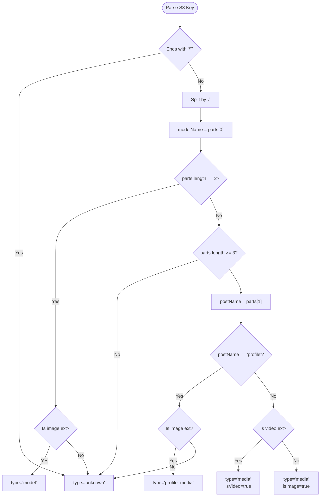
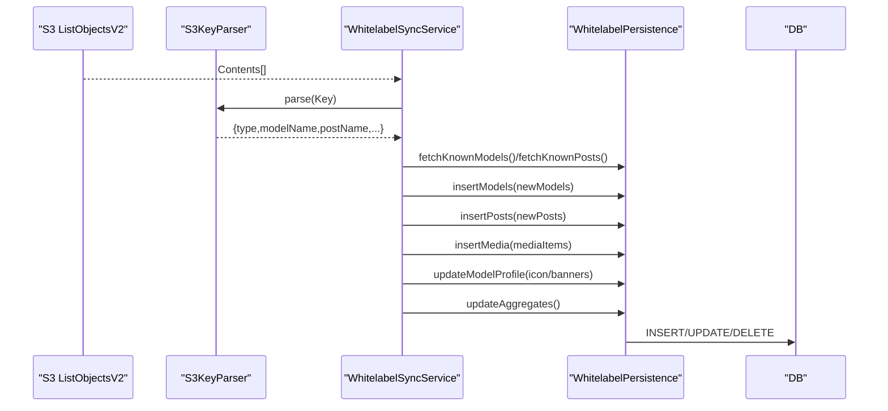
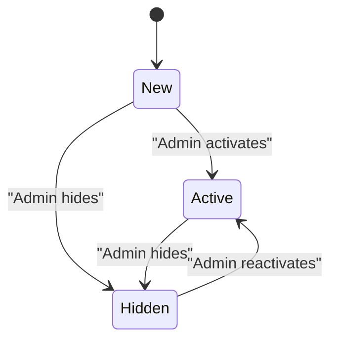
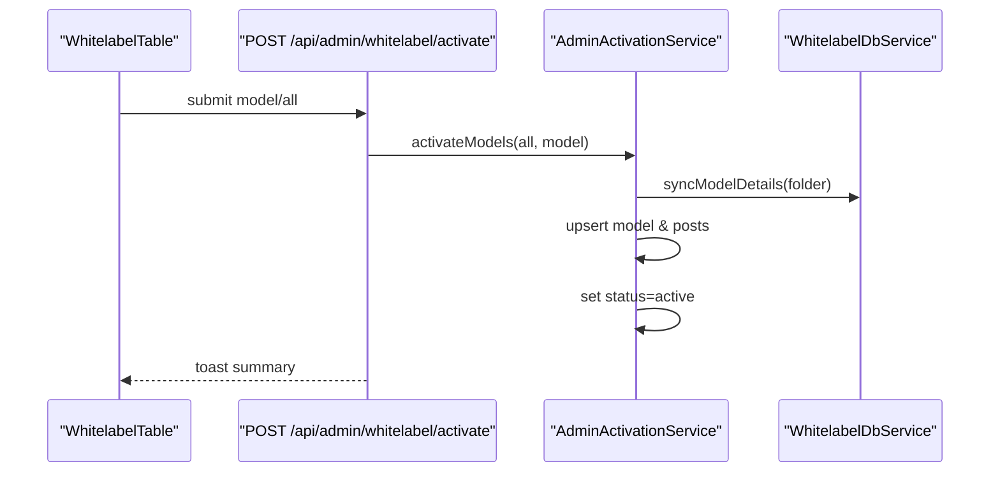
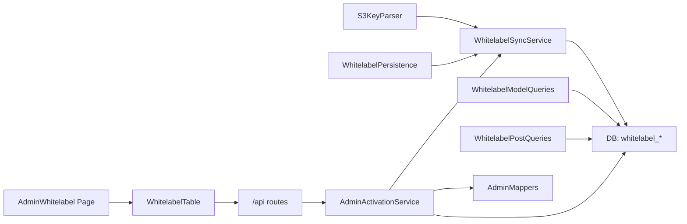

# White-label Models

<cite>
**Referenced Files in This Document**
- [schema.ts](file://src/db/schema.ts)
- [models.ts](file://src/services/whitelabel/queries/models.ts)
- [posts.ts](file://src/services/whitelabel/queries/posts.ts)
- [parser.ts](file://src/services/whitelabel/sync/parser.ts)
- [persistence.ts](file://src/services/whitelabel/sync/persistence.ts)
- [sync.ts](file://src/services/whitelabel/sync.ts)
- [whitelabel.ts](file://src/services/whitelabel.ts)
- [s3.ts](file://src/services/s3.ts)
- [api.tsx](file://src/routes/api.tsx)
- [Whitelabel.tsx](file://src/pages/admin/Whitelabel.tsx)
- [WhitelabelTable.tsx](file://src/components/organisms/WhitelabelTable.tsx)
- [WhitelabelStatus.tsx](file://src/components/organisms/WhitelabelStatus.tsx)
- [WhiteLabelModelCard.tsx](file://src/components/molecules/WhiteLabelModelCard.tsx)
- [activation.ts](file://src/services/admin/activation.ts)
- [mappers.ts](file://src/services/admin/mappers.ts)
</cite>

## Table of Contents
1. [Introduction](#introduction)
2. [Project Structure](#project-structure)
3. [Core Components](#core-components)
4. [Architecture Overview](#architecture-overview)
5. [Detailed Component Analysis](#detailed-component-analysis)
6. [Dependency Analysis](#dependency-analysis)
7. [Performance Considerations](#performance-considerations)
8. [Troubleshooting Guide](#troubleshooting-guide)
9. [Conclusion](#conclusion)

## Introduction
This document explains the whitelabel_models table and the surrounding model management system. It covers the multi-tenant ingestion architecture using S3 folder-based organization, status tracking (new, active, hidden), synchronization workflows, model lifecycle from creation to activation, thumbnail and banner management, and integration with S3. It also documents model discovery, featured content management, and administrative controls, including relationships with whitelabel_posts and whitelabel_media.

## Project Structure
The whitelabel system spans database schema, sync services, query layers, UI components, and admin APIs. The key areas are:
- Database schema for whitelabel_models, whitelabel_posts, and whitelabel_media
- S3 parsing and persistence utilities
- Query services for models and posts
- Admin activation pipeline mapping staged models to production models
- Frontend admin pages and components for discovery and control

**Diagram sources**
- [schema.ts](file://src/db/schema.ts#L73-L103)
- [parser.ts](file://src/services/whitelabel/sync/parser.ts#L10-L58)
- [persistence.ts](file://src/services/whitelabel/sync/persistence.ts#L5-L93)
- [sync.ts](file://src/services/whitelabel/sync.ts#L6-L333)
- [models.ts](file://src/services/whitelabel/queries/models.ts#L6-L93)
- [posts.ts](file://src/services/whitelabel/queries/posts.ts#L6-L46)
- [activation.ts](file://src/services/admin/activation.ts#L7-L85)
- [mappers.ts](file://src/services/admin/mappers.ts#L3-L39)
- [api.tsx](file://src/routes/api.tsx#L250-L273)
- [Whitelabel.tsx](file://src/pages/admin/Whitelabel.tsx#L15-L29)
- [WhitelabelTable.tsx](file://src/components/organisms/WhitelabelTable.tsx#L11-L110)
- [WhitelabelStatus.tsx](file://src/components/organisms/WhitelabelStatus.tsx#L8-L103)
- [WhiteLabelModelCard.tsx](file://src/components/molecules/WhiteLabelModelCard.tsx#L10-L47)

**Section sources**
- [schema.ts](file://src/db/schema.ts#L73-L103)
- [sync.ts](file://src/services/whitelabel/sync.ts#L6-L333)
- [models.ts](file://src/services/whitelabel/queries/models.ts#L6-L93)
- [posts.ts](file://src/services/whitelabel/queries/posts.ts#L6-L46)
- [api.tsx](file://src/routes/api.tsx#L250-L273)
- [Whitelabel.tsx](file://src/pages/admin/Whitelabel.tsx#L15-L29)
- [WhitelabelTable.tsx](file://src/components/organisms/WhitelabelTable.tsx#L11-L110)
- [WhitelabelStatus.tsx](file://src/components/organisms/WhitelabelStatus.tsx#L8-L103)
- [WhiteLabelModelCard.tsx](file://src/components/molecules/WhiteLabelModelCard.tsx#L10-L47)

## Core Components
- whitelabel_models: Stores per-model metadata (folderName, thumbnail/icon/banner URLs, postCount, status, timestamps). Status supports new, active, hidden.
- whitelabel_posts: Links posts to a model with folderName and derived title; stores aggregated media CDN URLs.
- whitelabel_media: Records per-media entries with S3 key, signed URL, and type (image/video).
- S3KeyParser: Parses S3 keys into model, post, and media categories, including profile media detection.
- WhitelabelPersistence: CRUD helpers for models, posts, and media; updates aggregates and profiles.
- WhitelabelSyncService: Full and partial sync from S3 to DB, including deletions and profile updates.
- WhitelabelModelQueries and WhitelabelPostQueries: Listing, top-performing, and detail retrieval with signed URLs.
- AdminActivationService: Imports staged whitelabel_models into production models and posts, marking status active.
- AdminMappers: Maps staged model/post data to production schema and signs S3 URLs.

**Section sources**
- [schema.ts](file://src/db/schema.ts#L73-L103)
- [parser.ts](file://src/services/whitelabel/sync/parser.ts#L10-L58)
- [persistence.ts](file://src/services/whitelabel/sync/persistence.ts#L5-L93)
- [sync.ts](file://src/services/whitelabel/sync.ts#L6-L333)
- [models.ts](file://src/services/whitelabel/queries/models.ts#L6-L93)
- [posts.ts](file://src/services/whitelabel/queries/posts.ts#L6-L46)
- [activation.ts](file://src/services/admin/activation.ts#L7-L85)
- [mappers.ts](file://src/services/admin/mappers.ts#L3-L39)

## Architecture Overview
The system ingests white-label content from an S3 bucket using folder-based organization:
- Model-level: folderName corresponds to the model’s identifier.
- Post-level: folderName/postName identifies individual posts.
- Media-level: postName/media.ext holds images/videos.
- Profile media: folderName/profile/icon.webp and folderName/profile/banner.webp define model icon and banner.

Synchronization runs in three passes:
1) Discover new models and posts
2) Insert posts for known models
3) Insert media and update model profile URLs

Deletions are handled by comparing current S3 listing against known DB state.

**Diagram sources**
- [api.tsx](file://src/routes/api.tsx#L250-L273)
- [activation.ts](file://src/services/admin/activation.ts#L7-L85)
- [sync.ts](file://src/services/whitelabel/sync.ts#L6-L333)
- [persistence.ts](file://src/services/whitelabel/sync/persistence.ts#L5-L93)
- [mappers.ts](file://src/services/admin/mappers.ts#L3-L39)
- [models.ts](file://src/services/whitelabel/queries/models.ts#L6-L93)

## Detailed Component Analysis

### Database Schema: whitelabel_models, whitelabel_posts, whitelabel_media
- whitelabel_models
  - Unique folderName anchors multi-tenancy
  - thumbnailUrl/iconUrl/bannerUrl support
  - postCount maintained via aggregation
  - status supports new, active, hidden
- whitelabel_posts
  - Links to whitelabel_models via foreign key
  - Aggregated media CDNs stored as JSON
- whitelabel_media
  - Unique S3 key, signed URL, type (image/video)

**Diagram sources**
- [schema.ts](file://src/db/schema.ts#L73-L103)

**Section sources**
- [schema.ts](file://src/db/schema.ts#L73-L103)

### S3 Key Parsing and Classification
The parser interprets S3 keys into categories:
- Model-level: folderName/file.ext (image detected)
- Post-level: folderName/postName/file.ext (video/image classification)
- Profile media: folderName/profile/icon.webp or banner.webp

**Diagram sources**
- [parser.ts](file://src/services/whitelabel/sync/parser.ts#L10-L58)

**Section sources**
- [parser.ts](file://src/services/whitelabel/sync/parser.ts#L10-L58)

### Synchronization Workflow
The sync service performs a paginated listing of S3 objects and processes them in three passes:
1) Detect new models and posts
2) Insert posts for known models
3) Insert media and update model profile URLs (icon/banners)

Deletions are computed by comparing seen vs known sets and removing absent records.

**Diagram sources**
- [sync.ts](file://src/services/whitelabel/sync.ts#L6-L333)
- [persistence.ts](file://src/services/whitelabel/sync/persistence.ts#L5-L93)
- [parser.ts](file://src/services/whitelabel/sync/parser.ts#L10-L58)

**Section sources**
- [sync.ts](file://src/services/whitelabel/sync.ts#L6-L333)
- [persistence.ts](file://src/services/whitelabel/sync/persistence.ts#L5-L93)

### Model Lifecycle: Creation to Activation
- Creation: New models discovered via S3 listing are inserted with status new and last_synced_at.
- Discovery: Models are listed, top-performing by postCount, and retrieved by folderName (slug).
- Thumbnail management: Thumbnails are enriched by selecting the first suitable image media per model and signing S3 keys.
- Activation: Admin triggers activation which:
  - Syncs model details
  - Upserts model into production models table
  - Upserts posts into production posts table
  - Marks whitelabel model status as active

**Diagram sources**
- [activation.ts](file://src/services/admin/activation.ts#L7-L85)
- [models.ts](file://src/services/whitelabel/queries/models.ts#L6-L93)
- [persistence.ts](file://src/services/whitelabel/sync/persistence.ts#L5-L93)

**Section sources**
- [activation.ts](file://src/services/admin/activation.ts#L7-L85)
- [models.ts](file://src/services/whitelabel/queries/models.ts#L6-L93)
- [persistence.ts](file://src/services/whitelabel/sync/persistence.ts#L5-L93)

### Thumbnail and Banner Management
- Thumbnails: Selected from first matching image media per model; signed URLs generated for secure access.
- Profiles: icon.webp and banner.webp under folderName/profile are written to model iconUrl and bannerUrl respectively during sync.

**Section sources**
- [models.ts](file://src/services/whitelabel/queries/models.ts#L7-L34)
- [sync.ts](file://src/services/whitelabel/sync.ts#L113-L124)
- [persistence.ts](file://src/services/whitelabel/sync/persistence.ts#L56-L61)

### Relationship with whitelabel_posts and whitelabel_media
- whitelabel_posts aggregates media CDN URLs per post as JSON images/videos lists.
- whitelabel_media stores per-item S3 keys and signed URLs, linked to posts.

**Section sources**
- [schema.ts](file://src/db/schema.ts#L85-L103)
- [posts.ts](file://src/services/whitelabel/queries/posts.ts#L6-L46)
- [persistence.ts](file://src/services/whitelabel/sync/persistence.ts#L76-L91)

### Administrative Controls and UI
- Admin page renders system health metrics and a table of whitelabel models with pagination.
- The table allows importing a single model or bulk activation.
- Activation endpoint triggers AdminActivationService which orchestrates sync, mapping, and promotion to production.

**Diagram sources**
- [WhitelabelTable.tsx](file://src/components/organisms/WhitelabelTable.tsx#L66-L72)
- [api.tsx](file://src/routes/api.tsx#L250-L273)
- [activation.ts](file://src/services/admin/activation.ts#L7-L85)

**Section sources**
- [Whitelabel.tsx](file://src/pages/admin/Whitelabel.tsx#L15-L29)
- [WhitelabelTable.tsx](file://src/components/organisms/WhitelabelTable.tsx#L11-L110)
- [WhitelabelStatus.tsx](file://src/components/organisms/WhitelabelStatus.tsx#L8-L103)
- [api.tsx](file://src/routes/api.tsx#L250-L273)

### Examples

- Example: Model creation from S3
  - A new folder appears in S3; sync discovers it, inserts a whitelabel_models record with status new, and increments postCount as posts are added.
  - Reference: [sync.ts](file://src/services/whitelabel/sync.ts#L44-L75), [persistence.ts](file://src/services/whitelabel/sync/persistence.ts#L17-L29)

- Example: Status update to active
  - Admin selects a model and triggers activation; the system syncs details, upserts into production models/posts, and sets status active.
  - Reference: [api.tsx](file://src/routes/api.tsx#L250-L273), [activation.ts](file://src/services/admin/activation.ts#L31-L54)

- Example: Relationship with whitelabel_posts
  - Posts are inserted per postName; media CDN lists are aggregated per post.
  - Reference: [sync.ts](file://src/services/whitelabel/sync.ts#L244-L308), [persistence.ts](file://src/services/whitelabel/sync/persistence.ts#L31-L54)

- Example: Thumbnail and banner enrichment
  - Thumbnails are resolved from image media and signed; profile icon/banners are set during sync.
  - Reference: [models.ts](file://src/services/whitelabel/queries/models.ts#L7-L34), [sync.ts](file://src/services/whitelabel/sync.ts#L113-L124)

## Dependency Analysis
- Database relations
  - whitelabel_models → whitelabel_posts (one-to-many)
  - whitelabel_posts → whitelabel_media (one-to-many)
- Services
  - WhitelabelSyncService depends on S3KeyParser and WhitelabelPersistence
  - WhitelabelModelQueries and WhitelabelPostQueries depend on DB schema and S3 signing
  - AdminActivationService depends on WhitelabelDbService, AdminMappers, and DB
- UI
  - AdminWhitelabel page composes WhitelabelStatus and WhitelabelTable
  - WhitelabelTable submits activation requests to API routes

**Diagram sources**
- [parser.ts](file://src/services/whitelabel/sync/parser.ts#L10-L58)
- [sync.ts](file://src/services/whitelabel/sync.ts#L6-L333)
- [persistence.ts](file://src/services/whitelabel/sync/persistence.ts#L5-L93)
- [models.ts](file://src/services/whitelabel/queries/models.ts#L6-L93)
- [posts.ts](file://src/services/whitelabel/queries/posts.ts#L6-L46)
- [activation.ts](file://src/services/admin/activation.ts#L7-L85)
- [mappers.ts](file://src/services/admin/mappers.ts#L3-L39)
- [api.tsx](file://src/routes/api.tsx#L250-L273)
- [Whitelabel.tsx](file://src/pages/admin/Whitelabel.tsx#L15-L29)
- [WhitelabelTable.tsx](file://src/components/organisms/WhitelabelTable.tsx#L11-L110)

**Section sources**
- [schema.ts](file://src/db/schema.ts#L161-L178)
- [sync.ts](file://src/services/whitelabel/sync.ts#L6-L333)
- [models.ts](file://src/services/whitelabel/queries/models.ts#L6-L93)
- [posts.ts](file://src/services/whitelabel/queries/posts.ts#L6-L46)
- [api.tsx](file://src/routes/api.tsx#L250-L273)

## Performance Considerations
- Batch operations: Persistence inserts media in batches; consider chunking for very large listings.
- Aggregation updates: updateAggregates recomputes post_count and media_cdns; run after bulk inserts/deletes.
- Signed URL caching: Consider caching signed URLs per request/session to reduce repeated signing calls.
- Pagination: Queries use limit/offset; ensure indexes on createdAt/id for efficient ordering.

## Troubleshooting Guide
- No models appear in admin
  - Trigger sync from the admin UI or verify S3 connectivity and bucket permissions.
  - Check system health card for storage status.
  - References: [WhitelabelStatus.tsx](file://src/components/organisms/WhitelabelStatus.tsx#L40-L44), [api.tsx](file://src/routes/api.tsx#L250-L273)

- Activation fails or does nothing
  - Ensure the model exists in whitelabel_models and has posts; verify mapper resolution of main media.
  - References: [activation.ts](file://src/services/admin/activation.ts#L31-L54), [mappers.ts](file://src/services/admin/mappers.ts#L21-L39)

- Thumbnails not loading
  - Confirm image extensions match supported patterns and signed URLs resolve.
  - References: [models.ts](file://src/services/whitelabel/queries/models.ts#L7-L34), [s3.ts](file://src/services/s3.ts#L25-L47)

- Deleted content not removed
  - Verify deletions occur by comparing seen vs known sets; ensure sync ran without truncation errors.
  - References: [sync.ts](file://src/services/whitelabel/sync.ts#L154-L194)

**Section sources**
- [WhitelabelStatus.tsx](file://src/components/organisms/WhitelabelStatus.tsx#L40-L44)
- [activation.ts](file://src/services/admin/activation.ts#L31-L54)
- [mappers.ts](file://src/services/admin/mappers.ts#L21-L39)
- [models.ts](file://src/services/whitelabel/queries/models.ts#L7-L34)
- [s3.ts](file://src/services/s3.ts#L25-L47)
- [sync.ts](file://src/services/whitelabel/sync.ts#L154-L194)

## Conclusion
The whitelabel_models system provides a robust, folder-based ingestion pipeline from S3 to a structured database, supporting multi-tenant organization, lifecycle management, and seamless activation into production content. Administrators can discover, preview, and import content with confidence, while the system maintains accurate counts and signed media URLs for secure delivery.