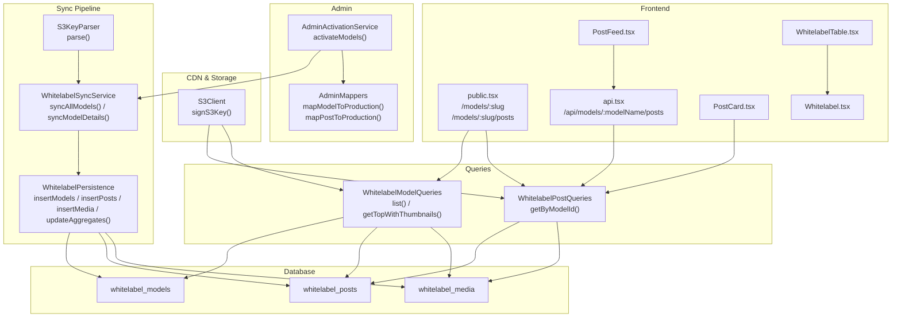
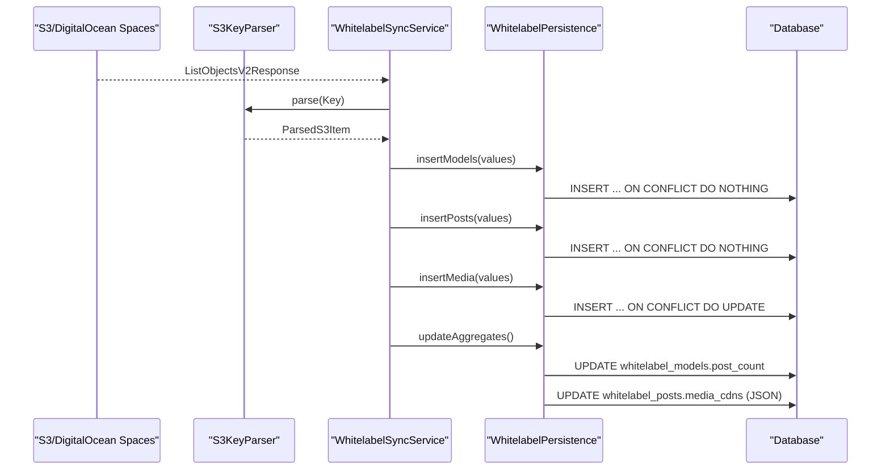
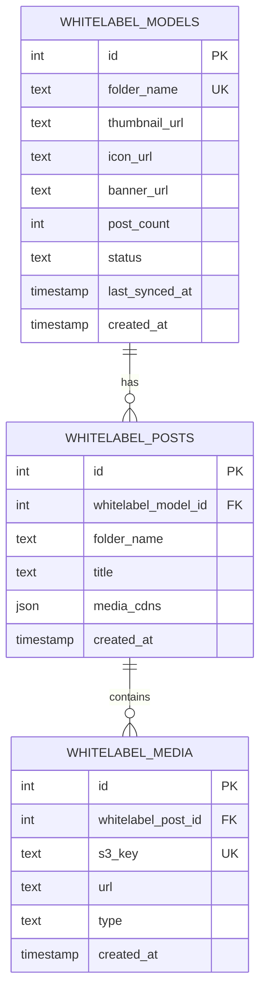
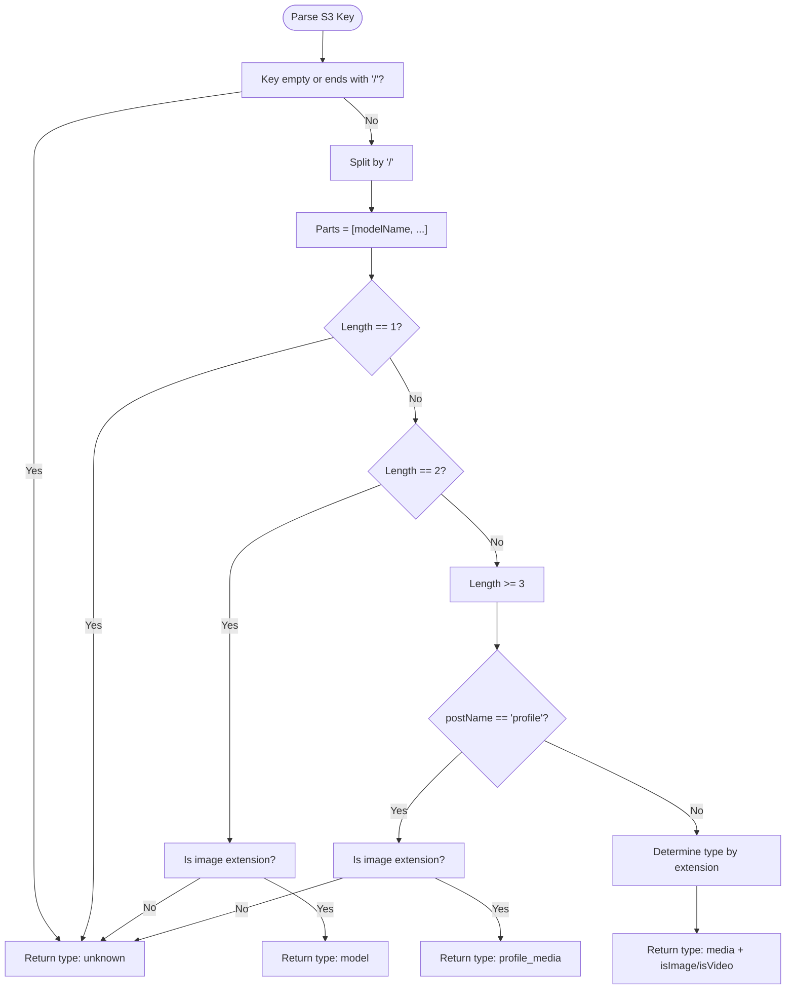
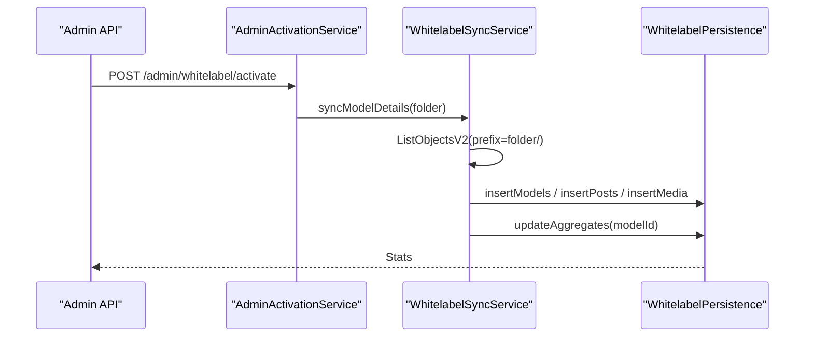
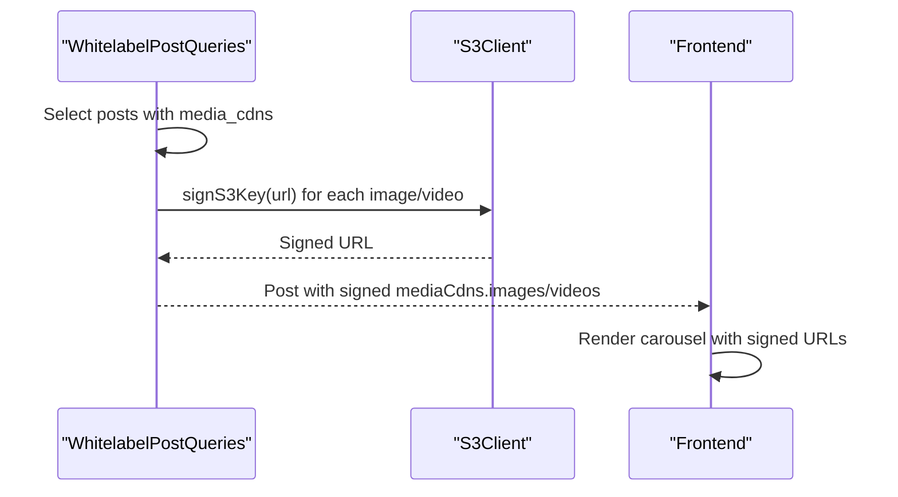
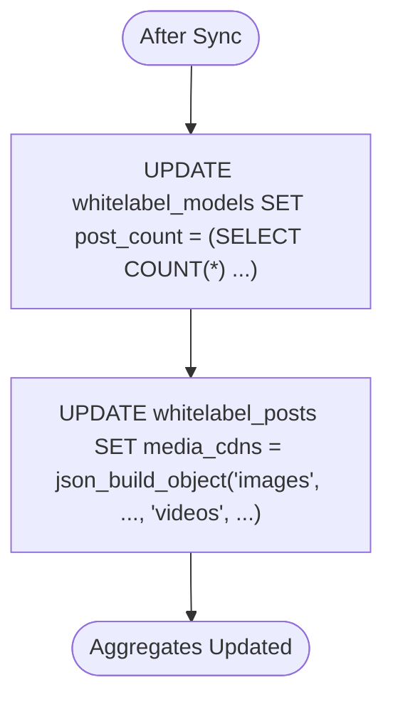
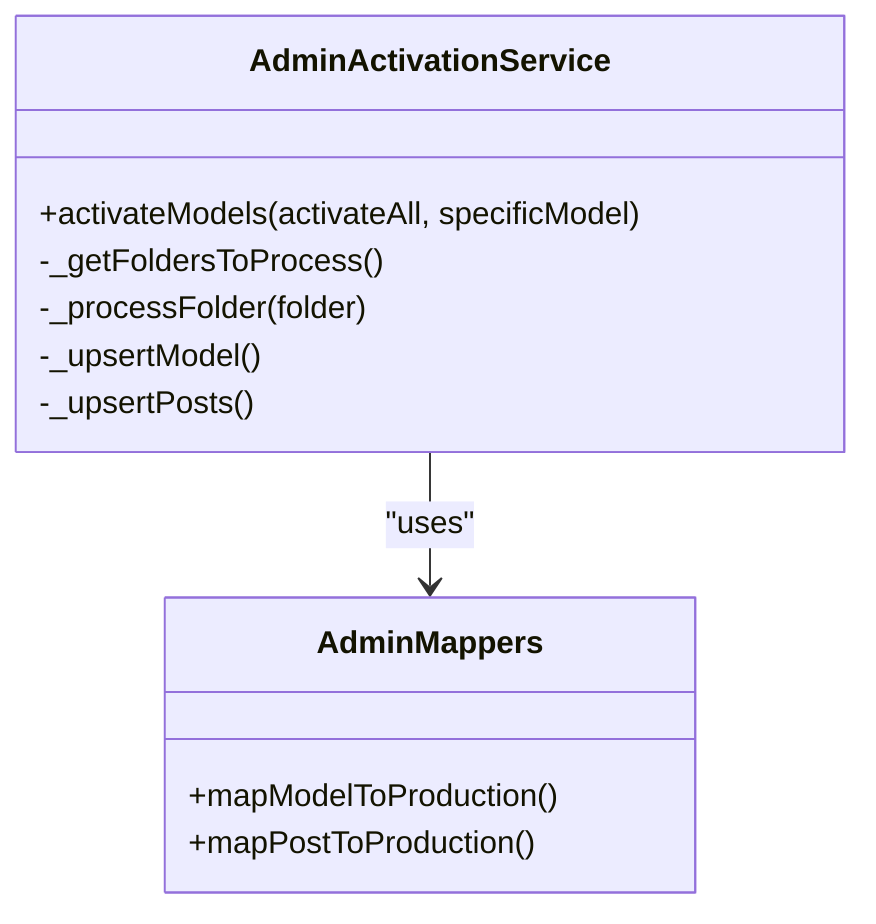
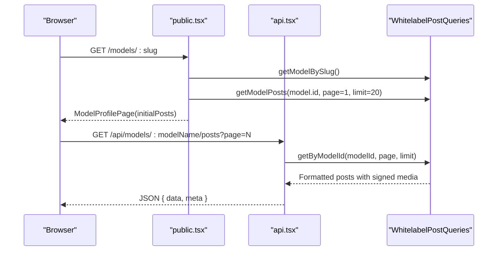
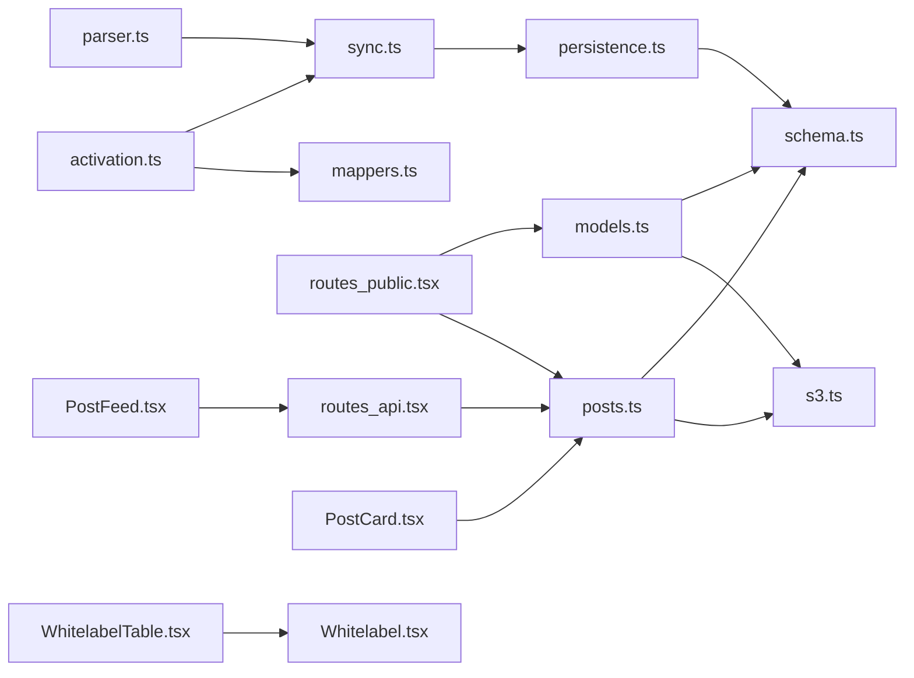

# White-label Posts

<cite>
**Referenced Files in This Document**
- [schema.ts](file://src/db/schema.ts)
- [0006_snapshot.json](file://drizzle/meta/0006_snapshot.json)
- [parser.ts](file://src/services/whitelabel/sync/parser.ts)
- [persistence.ts](file://src/services/whitelabel/sync/persistence.ts)
- [sync.ts](file://src/services/whitelabel/sync.ts)
- [posts.ts](file://src/services/whitelabel/queries/posts.ts)
- [models.ts](file://src/services/whitelabel/queries/models.ts)
- [s3.ts](file://src/services/s3.ts)
- [activation.ts](file://src/services/admin/activation.ts)
- [mappers.ts](file://src/services/admin/mappers.ts)
- [routes_public.tsx](file://src/routes/public.tsx)
- [routes_api.tsx](file://src/routes/api.tsx)
- [PostFeed.tsx](file://src/components/organisms/PostFeed.tsx)
- [PostCard.tsx](file://src/components/organisms/PostCard.tsx)
- [WhitelabelTable.tsx](file://src/components/organisms/WhitelabelTable.tsx)
- [Whitelabel.tsx](file://src/pages/admin/Whitelabel.tsx)
</cite>

## Table of Contents
1. [Introduction](#introduction)
2. [Project Structure](#project-structure)
3. [Core Components](#core-components)
4. [Architecture Overview](#architecture-overview)
5. [Detailed Component Analysis](#detailed-component-analysis)
6. [Dependency Analysis](#dependency-analysis)
7. [Performance Considerations](#performance-considerations)
8. [Troubleshooting Guide](#troubleshooting-guide)
9. [Conclusion](#conclusion)

## Introduction
This document explains the white-label post management system centered around the whitelabel_posts table and its relationships with whitelabel_models and whitelabel_media. It covers:
- Hierarchical relationships and constraints
- Folder-based organization in S3 and DigitalOcean Spaces
- Media CDN integration and signed URL generation
- Post creation workflows and synchronization
- Automatic post count updates per model
- Examples of parsing S3 folders, organizing content, and administrative moderation

## Project Structure
The white-label system spans database schema, sync services, query services, S3 integration, and frontend components:
- Database schema defines whitelabel_models, whitelabel_posts, and whitelabel_media with foreign keys and unique constraints
- Sync pipeline parses S3 keys, creates models and posts, and persists media entries
- Queries enrich data with signed CDN URLs and aggregate counts
- Admin tools enable activation and migration to production models and posts
- Public routes expose model feeds and paginated post lists

**Diagram sources**
- [schema.ts](file://src/db/schema.ts#L73-L103)
- [parser.ts](file://src/services/whitelabel/sync/parser.ts#L10-L58)
- [sync.ts](file://src/services/whitelabel/sync.ts#L6-L197)
- [persistence.ts](file://src/services/whitelabel/sync/persistence.ts#L5-L93)
- [posts.ts](file://src/services/whitelabel/queries/posts.ts#L6-L46)
- [models.ts](file://src/services/whitelabel/queries/models.ts#L6-L93)
- [s3.ts](file://src/services/s3.ts#L25-L47)
- [activation.ts](file://src/services/admin/activation.ts#L7-L85)
- [mappers.ts](file://src/services/admin/mappers.ts#L3-L39)
- [routes_public.tsx](file://src/routes/public.tsx#L66-L78)
- [routes_api.tsx](file://src/routes/api.tsx#L295-L313)
- [PostFeed.tsx](file://src/components/organisms/PostFeed.tsx#L10-L216)
- [PostCard.tsx](file://src/components/organisms/PostCard.tsx#L11-L117)
- [WhitelabelTable.tsx](file://src/components/organisms/WhitelabelTable.tsx#L11-L111)
- [Whitelabel.tsx](file://src/pages/admin/Whitelabel.tsx#L15-L30)

**Section sources**
- [schema.ts](file://src/db/schema.ts#L73-L103)
- [sync.ts](file://src/services/whitelabel/sync.ts#L6-L197)
- [posts.ts](file://src/services/whitelabel/queries/posts.ts#L6-L46)
- [models.ts](file://src/services/whitelabel/queries/models.ts#L6-L93)
- [s3.ts](file://src/services/s3.ts#L25-L47)
- [routes_public.tsx](file://src/routes/public.tsx#L66-L78)
- [routes_api.tsx](file://src/routes/api.tsx#L295-L313)
- [PostFeed.tsx](file://src/components/organisms/PostFeed.tsx#L10-L216)
- [PostCard.tsx](file://src/components/organisms/PostCard.tsx#L11-L117)
- [WhitelabelTable.tsx](file://src/components/organisms/WhitelabelTable.tsx#L11-L111)
- [Whitelabel.tsx](file://src/pages/admin/Whitelabel.tsx#L15-L30)

## Core Components
- whitelabel_models: Stores model metadata, including folder_name (unique), post_count, status, and profile assets
- whitelabel_posts: Represents a post within a model, keyed by whitelabel_model_id and folder_name (unique together)
- whitelabel_media: Links media items to posts with S3 key, CDN URL, and type
- S3KeyParser: Parses S3 keys into model, post, media, or profile media categories
- WhitelabelSyncService: Orchestrates listing S3 objects, parsing, inserting/updating models/posts/media, and deletions
- WhitelabelPersistence: CRUD operations with conflict handling and aggregate updates
- WhitelabelPostQueries and WhitelabelModelQueries: Data retrieval with signed CDN URLs and statistics
- AdminActivationService and AdminMappers: Administrative import from staging (whitelabel) to production models and posts

**Section sources**
- [schema.ts](file://src/db/schema.ts#L73-L103)
- [parser.ts](file://src/services/whitelabel/sync/parser.ts#L10-L58)
- [sync.ts](file://src/services/whitelabel/sync.ts#L6-L197)
- [persistence.ts](file://src/services/whitelabel/sync/persistence.ts#L5-L93)
- [posts.ts](file://src/services/whitelabel/queries/posts.ts#L6-L46)
- [models.ts](file://src/services/whitelabel/queries/models.ts#L6-L93)
- [activation.ts](file://src/services/admin/activation.ts#L7-L85)
- [mappers.ts](file://src/services/admin/mappers.ts#L3-L39)

## Architecture Overview
The system follows a staged ingestion and enrichment pattern:
- S3 listing drives discovery of models, posts, and media
- Parser classifies keys into categories
- Persistence inserts or updates entities and recalculates aggregates
- Queries sign CDN URLs and present paginated feeds
- Admin tools promote staged content to production models and posts

**Diagram sources**
- [sync.ts](file://src/services/whitelabel/sync.ts#L6-L197)
- [parser.ts](file://src/services/whitelabel/sync/parser.ts#L10-L58)
- [persistence.ts](file://src/services/whitelabel/sync/persistence.ts#L5-L93)

## Detailed Component Analysis

### Database Schema and Constraints
- whitelabel_models
  - Unique constraint on folder_name
  - post_count defaults to 0
  - status enum includes new, active, hidden
- whitelabel_posts
  - Composite unique index on (whitelabel_model_id, folder_name)
  - Foreign key to whitelabel_models with cascade delete
  - media_cdns stores JSON with images/videos arrays
- whitelabel_media
  - Unique constraint on s3_key
  - Foreign key to whitelabel_posts with cascade delete
  - type enum image or video

**Diagram sources**
- [schema.ts](file://src/db/schema.ts#L73-L103)
- [0006_snapshot.json](file://drizzle/meta/0006_snapshot.json#L676-L796)

**Section sources**
- [schema.ts](file://src/db/schema.ts#L73-L103)
- [0006_snapshot.json](file://drizzle/meta/0006_snapshot.json#L676-L796)

### S3 Key Parsing and Folder Organization
- Keys are split by "/"
- Model-level thumbnails: "ModelName/file.jpg" -> type: model
- Profile media: "ModelName/profile/*" -> type: profile_media
- Post content: "ModelName/PostName/file.ext" -> type: media; images if not video extension
- Unknown: empty or trailing slash keys

**Diagram sources**
- [parser.ts](file://src/services/whitelabel/sync/parser.ts#L10-L58)

**Section sources**
- [parser.ts](file://src/services/whitelabel/sync/parser.ts#L10-L58)

### Post Creation Workflows and Synchronization
- Two-pass sync:
  - Pass 1: Discover models and new posts; insert models
  - Pass 2: Re-scan to ensure model IDs exist; insert posts
  - Pass 3: Process media; build CDN URLs; insert media
- Deletion handling:
  - Track seen models/posts; delete absent ones after sync
- Aggregate updates:
  - Recalculate post_count per model
  - Recalculate media_cdns JSON per post

**Diagram sources**
- [routes_api.tsx](file://src/routes/api.tsx#L251-L273)
- [activation.ts](file://src/services/admin/activation.ts#L7-L55)
- [sync.ts](file://src/services/whitelabel/sync.ts#L199-L333)
- [persistence.ts](file://src/services/whitelabel/sync/persistence.ts#L63-L92)

**Section sources**
- [sync.ts](file://src/services/whitelabel/sync.ts#L6-L197)
- [sync.ts](file://src/services/whitelabel/sync.ts#L199-L333)
- [persistence.ts](file://src/services/whitelabel/sync/persistence.ts#L63-L92)
- [routes_api.tsx](file://src/routes/api.tsx#L251-L273)
- [activation.ts](file://src/services/admin/activation.ts#L7-L55)

### Media CDN Integration and Signed URLs
- Media entries store s3Key and CDN url
- Queries sign S3 keys to produce temporary URLs for images/videos
- Frontend receives signed images/videos and renders carousels

**Diagram sources**
- [posts.ts](file://src/services/whitelabel/queries/posts.ts#L16-L32)
- [s3.ts](file://src/services/s3.ts#L25-L47)
- [PostFeed.tsx](file://src/components/organisms/PostFeed.tsx#L55-L72)
- [PostCard.tsx](file://src/components/organisms/PostCard.tsx#L13-L26)

**Section sources**
- [posts.ts](file://src/services/whitelabel/queries/posts.ts#L16-L32)
- [s3.ts](file://src/services/s3.ts#L25-L47)
- [PostFeed.tsx](file://src/components/organisms/PostFeed.tsx#L55-L72)
- [PostCard.tsx](file://src/components/organisms/PostCard.tsx#L13-L26)

### Automatic Post Count Updates
- After sync, aggregates are recalculated:
  - whitelabel_models.post_count = COUNT(whitelabel_posts) per model
  - whitelabel_posts.media_cdns = JSON with images/videos arrays grouped by post

**Diagram sources**
- [persistence.ts](file://src/services/whitelabel/sync/persistence.ts#L63-L92)

**Section sources**
- [persistence.ts](file://src/services/whitelabel/sync/persistence.ts#L63-L92)

### Post Discovery, Content Categorization, and Moderation
- Discovery:
  - S3 listing with pagination and continuation tokens
  - Parser distinguishes model thumbnails, profile media, and post media
- Categorization:
  - Images vs videos determined by filename extensions
  - Profile media handled separately for icon/banner updates
- Moderation:
  - whitelabel_models.status supports new/active/hidden
  - Admin activation toggles status to active after import
  - Production models/posts can be created from staging via mappers

**Diagram sources**
- [activation.ts](file://src/services/admin/activation.ts#L7-L85)
- [mappers.ts](file://src/services/admin/mappers.ts#L3-L39)

**Section sources**
- [activation.ts](file://src/services/admin/activation.ts#L7-L85)
- [mappers.ts](file://src/services/admin/mappers.ts#L3-L39)

### Public Feeds and Pagination
- Public route: GET /models/:slug loads model and first page of posts
- API route: GET /api/models/:modelName/posts?page=N returns paginated posts with signed media
- Frontend components render infinite scroll and carousels

**Diagram sources**
- [routes_public.tsx](file://src/routes/public.tsx#L66-L78)
- [routes_api.tsx](file://src/routes/api.tsx#L295-L313)
- [posts.ts](file://src/services/whitelabel/queries/posts.ts#L7-L35)
- [PostFeed.tsx](file://src/components/organisms/PostFeed.tsx#L48-L72)

**Section sources**
- [routes_public.tsx](file://src/routes/public.tsx#L66-L78)
- [routes_api.tsx](file://src/routes/api.tsx#L295-L313)
- [posts.ts](file://src/services/whitelabel/queries/posts.ts#L7-L35)
- [PostFeed.tsx](file://src/components/organisms/PostFeed.tsx#L48-L72)

## Dependency Analysis
- Schema defines referential integrity and unique constraints
- Sync depends on Parser and Persistence
- Queries depend on schema relations and S3 signing
- Admin Activation depends on Sync and Mappers
- Frontend depends on API routes and query results

**Diagram sources**
- [schema.ts](file://src/db/schema.ts#L73-L103)
- [parser.ts](file://src/services/whitelabel/sync/parser.ts#L10-L58)
- [sync.ts](file://src/services/whitelabel/sync.ts#L6-L197)
- [persistence.ts](file://src/services/whitelabel/sync/persistence.ts#L5-L93)
- [posts.ts](file://src/services/whitelabel/queries/posts.ts#L6-L46)
- [models.ts](file://src/services/whitelabel/queries/models.ts#L6-L93)
- [s3.ts](file://src/services/s3.ts#L25-L47)
- [activation.ts](file://src/services/admin/activation.ts#L7-L85)
- [mappers.ts](file://src/services/admin/mappers.ts#L3-L39)
- [routes_public.tsx](file://src/routes/public.tsx#L66-L78)
- [routes_api.tsx](file://src/routes/api.tsx#L295-L313)
- [PostFeed.tsx](file://src/components/organisms/PostFeed.tsx#L10-L216)
- [PostCard.tsx](file://src/components/organisms/PostCard.tsx#L11-L117)
- [WhitelabelTable.tsx](file://src/components/organisms/WhitelabelTable.tsx#L11-L111)
- [Whitelabel.tsx](file://src/pages/admin/Whitelabel.tsx#L15-L30)

**Section sources**
- [schema.ts](file://src/db/schema.ts#L73-L103)
- [sync.ts](file://src/services/whitelabel/sync.ts#L6-L197)
- [posts.ts](file://src/services/whitelabel/queries/posts.ts#L6-L46)
- [models.ts](file://src/services/whitelabel/queries/models.ts#L6-L93)
- [s3.ts](file://src/services/s3.ts#L25-L47)
- [activation.ts](file://src/services/admin/activation.ts#L7-L85)
- [mappers.ts](file://src/services/admin/mappers.ts#L3-L39)
- [routes_public.tsx](file://src/routes/public.tsx#L66-L78)
- [routes_api.tsx](file://src/routes/api.tsx#L295-L313)
- [PostFeed.tsx](file://src/components/organisms/PostFeed.tsx#L10-L216)
- [PostCard.tsx](file://src/components/organisms/PostCard.tsx#L11-L117)
- [WhitelabelTable.tsx](file://src/components/organisms/WhitelabelTable.tsx#L11-L111)
- [Whitelabel.tsx](file://src/pages/admin/Whitelabel.tsx#L15-L30)

## Performance Considerations
- Batch operations: Persistence inserts media in bulk; consider chunking large batches
- Unique constraints: ON CONFLICT DO NOTHING prevents duplicates; ensure caller deduplicates
- Aggregation queries: JSON aggregation and COUNT are efficient but can be optimized with materialized views if scale grows
- Pagination: Limit and offset reduce payload sizes; consider cursor-based pagination for very large datasets
- Signed URL caching: Frontend caches signed URLs to minimize repeated signing requests

[No sources needed since this section provides general guidance]

## Troubleshooting Guide
- No posts shown for a model:
  - Verify whitelabel_posts exist for the model and media entries are present
  - Confirm media_cdns JSON is populated and signed URLs are generated
- Missing thumbnails:
  - Ensure profile media keys exist and updateModelProfile is executed during sync
- CDN URL failures:
  - Validate S3 key normalization and percent-encoding in signS3Key
- Sync inconsistencies:
  - Check deletion logic for models/posts not seen in current listing
  - Re-run syncAllModels or syncModelDetails for the affected folder

**Section sources**
- [sync.ts](file://src/services/whitelabel/sync.ts#L154-L196)
- [persistence.ts](file://src/services/whitelabel/sync/persistence.ts#L56-L92)
- [posts.ts](file://src/services/whitelabel/queries/posts.ts#L16-L32)
- [s3.ts](file://src/services/s3.ts#L25-L47)

## Conclusion
The white-label post management system integrates S3/DigitalOcean Spaces with a PostgreSQL schema to deliver scalable, folder-based content ingestion. It enforces strong constraints, automates aggregate updates, and provides robust query-time enrichment with signed CDN URLs. Administrative tools streamline moderation and migration to production models and posts, while frontend components deliver responsive feeds and carousels.