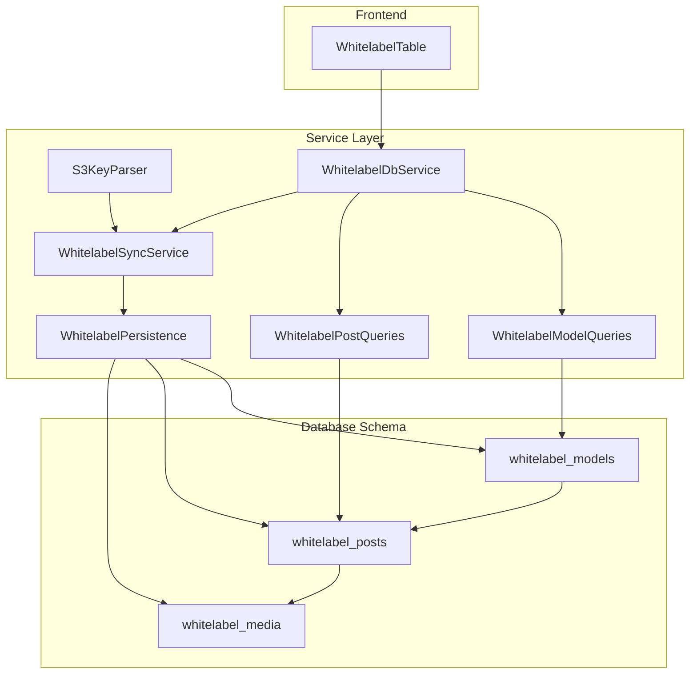
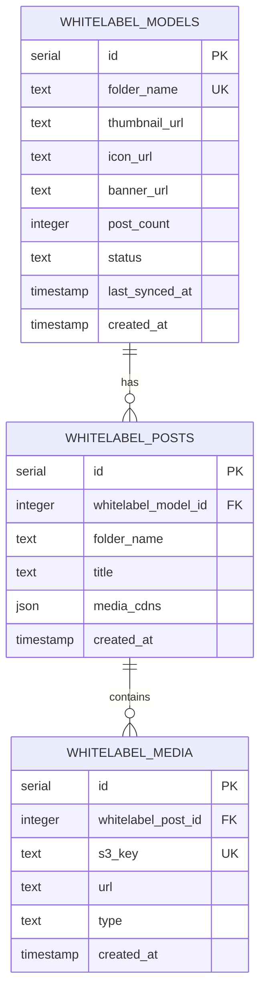
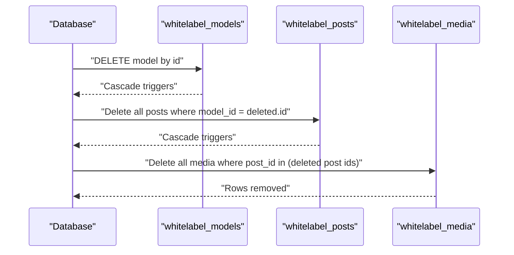
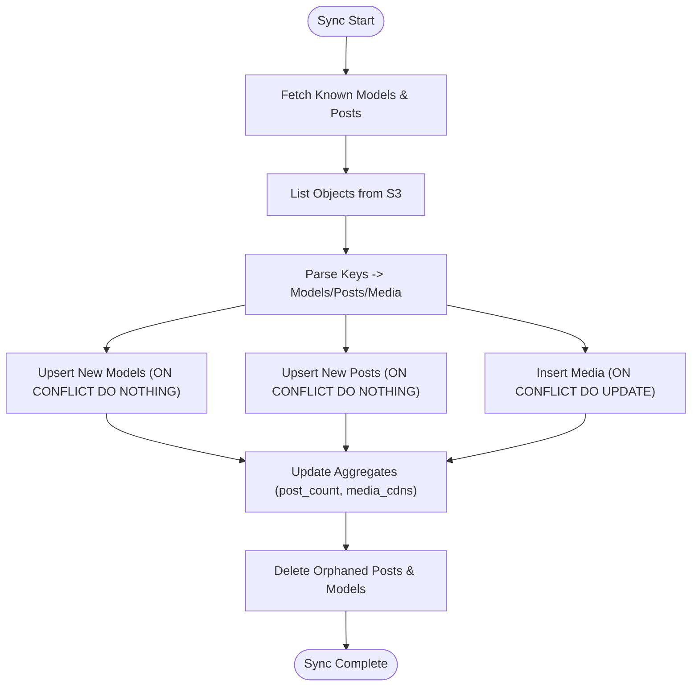
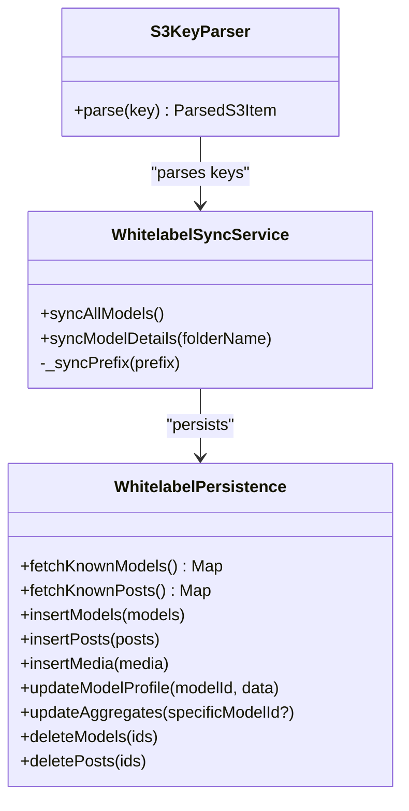
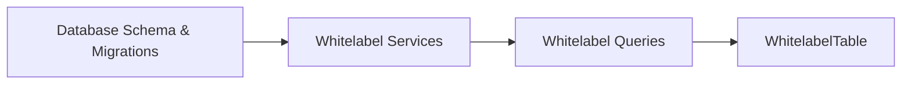

# White-label Relationships & Constraints

<cite>
**Referenced Files in This Document**
- [schema.ts](file://src/db/schema.ts)
- [index.ts](file://src/db/index.ts)
- [0006_overconfident_titania.sql](file://drizzle/0006_overconfident_titania.sql)
- [0005_furry_catseye.sql](file://drizzle/0005_furry_catseye.sql)
- [0004_mixed_vermin.sql](file://drizzle/0004_mixed_vermin.sql)
- [0005_snapshot.json](file://drizzle/meta/0005_snapshot.json)
- [0006_snapshot.json](file://drizzle/meta/0006_snapshot.json)
- [whitelabel.ts](file://src/services/whitelabel.ts)
- [models.ts](file://src/services/whitelabel/queries/models.ts)
- [posts.ts](file://src/services/whitelabel/queries/posts.ts)
- [sync.ts](file://src/services/whitelabel/sync.ts)
- [persistence.ts](file://src/services/whitelabel/sync/persistence.ts)
- [parser.ts](file://src/services/whitelabel/sync/parser.ts)
- [WhitelabelTable.tsx](file://src/components/organisms/WhitelabelTable.tsx)
</cite>

## Table of Contents
1. [Introduction](#introduction)
2. [Project Structure](#project-structure)
3. [Core Components](#core-components)
4. [Architecture Overview](#architecture-overview)
5. [Detailed Component Analysis](#detailed-component-analysis)
6. [Dependency Analysis](#dependency-analysis)
7. [Performance Considerations](#performance-considerations)
8. [Troubleshooting Guide](#troubleshooting-guide)
9. [Conclusion](#conclusion)

## Introduction
This document explains the white-label data model relationships and constraints, focusing on the cascading delete chain whitelabel_models → whitelabel_posts → whitelabel_media, unique constraints on folder names, and referential integrity enforcement. It also documents database-level constraints, foreign key relationships, and transaction handling for multi-entity operations. Examples illustrate cascade deletion scenarios, constraint violations, and data consistency maintenance, along with implementation details for bulk operations, relationship validation, and error handling strategies.

## Project Structure
The white-label domain spans database schema definitions, migrations, a service layer for synchronization and queries, and frontend components that render the data.

**Diagram sources**
- [schema.ts](file://src/db/schema.ts#L73-L103)
- [persistence.ts](file://src/services/whitelabel/sync/persistence.ts#L5-L94)
- [sync.ts](file://src/services/whitelabel/sync.ts#L6-L334)
- [parser.ts](file://src/services/whitelabel/sync/parser.ts#L10-L59)
- [models.ts](file://src/services/whitelabel/queries/models.ts#L6-L94)
- [posts.ts](file://src/services/whitelabel/queries/posts.ts#L6-L47)
- [whitelabel.ts](file://src/services/whitelabel.ts#L5-L24)
- [WhitelabelTable.tsx](file://src/components/organisms/WhitelabelTable.tsx#L11-L111)

**Section sources**
- [schema.ts](file://src/db/schema.ts#L73-L103)
- [index.ts](file://src/db/index.ts#L1-L8)
- [whitelabel.ts](file://src/services/whitelabel.ts#L5-L24)

## Core Components
- whitelabel_models: top-level entity representing a white-label model with a unique folder_name and metadata.
- whitelabel_posts: child entity linked to a model via a foreign key; each post is uniquely identified by the combination (whitelabel_model_id, folder_name).
- whitelabel_media: leaf entity linked to a post via a foreign key with ON DELETE CASCADE; enforces uniqueness on s3_key.

These components define a strict hierarchy with cascading deletes and unique constraints ensuring referential integrity and data consistency.

**Section sources**
- [schema.ts](file://src/db/schema.ts#L73-L103)
- [0005_snapshot.json](file://drizzle/meta/0005_snapshot.json#L554-L705)
- [0006_snapshot.json](file://drizzle/meta/0006_snapshot.json#L604-L753)

## Architecture Overview
The white-label architecture enforces referential integrity at the database level and maintains consistency through:
- Foreign keys with cascading deletes from models to posts and posts to media.
- Unique constraints on folder_name for models and composite (model_id, folder_name) for posts.
- Unique constraint on s3_key for media entries.
- Aggregation updates after bulk inserts and deletions.

**Diagram sources**
- [schema.ts](file://src/db/schema.ts#L73-L103)
- [0005_snapshot.json](file://drizzle/meta/0005_snapshot.json#L554-L705)
- [0006_snapshot.json](file://drizzle/meta/0006_snapshot.json#L604-L753)

## Detailed Component Analysis

### Database Schema and Constraints
- whitelabel_models
  - Unique constraint on folder_name ensures each model identifier is distinct.
  - Additional metadata fields capture branding assets and status.
- whitelabel_posts
  - Foreign key to whitelabel_models with ON DELETE CASCADE.
  - Composite unique constraint on (whitelabel_model_id, folder_name) prevents duplicate post identifiers per model.
- whitelabel_media
  - Foreign key to whitelabel_posts with ON DELETE CASCADE.
  - Unique constraint on s3_key prevents duplicate S3 keys across media entries.

These constraints guarantee:
- No orphaned posts under deleted models.
- No orphaned media under deleted posts.
- No duplicate folder names per model.
- No duplicate S3 keys.

**Section sources**
- [schema.ts](file://src/db/schema.ts#L73-L103)
- [0005_snapshot.json](file://drizzle/meta/0005_snapshot.json#L633-L705)
- [0006_snapshot.json](file://drizzle/meta/0006_snapshot.json#L604-L753)

### Cascade Delete Relationships
When a whitelabel_models record is deleted:
- All associated whitelabel_posts rows are automatically removed due to ON DELETE CASCADE.
- All associated whitelabel_media rows are automatically removed due to ON DELETE CASCADE.

This ensures complete cleanup of related entities without manual intervention.

**Diagram sources**
- [schema.ts](file://src/db/schema.ts#L87-L103)
- [0005_snapshot.json](file://drizzle/meta/0005_snapshot.json#L676-L689)
- [0006_snapshot.json](file://drizzle/meta/0006_snapshot.json#L647-L660)

**Section sources**
- [schema.ts](file://src/db/schema.ts#L87-L103)
- [0005_snapshot.json](file://drizzle/meta/0005_snapshot.json#L676-L689)
- [0006_snapshot.json](file://drizzle/meta/0006_snapshot.json#L647-L660)

### Unique Constraints and Referential Integrity
- Model-level uniqueness: folder_name is unique, preventing duplicate model identifiers.
- Post-level uniqueness: (whitelabel_model_id, folder_name) is unique, preventing duplicate post identifiers within the same model.
- Media-level uniqueness: s3_key is unique, preventing duplicate S3 keys.

Violations of these constraints result in database-level errors during insert/update operations. The service layer mitigates most violations by using conflict-handling strategies:
- Insert models and posts with ON CONFLICT DO NOTHING to avoid duplicates.
- Insert media with ON CONFLICT DO UPDATE to reconcile existing entries.

**Section sources**
- [schema.ts](file://src/db/schema.ts#L75-L94)
- [persistence.ts](file://src/services/whitelabel/sync/persistence.ts#L17-L54)
- [0005_snapshot.json](file://drizzle/meta/0005_snapshot.json#L620-L700)
- [0006_snapshot.json](file://drizzle/meta/0006_snapshot.json#L663-L671)

### Transaction Handling for Multi-Entity Operations
The sync pipeline performs multi-entity operations across models, posts, and media. While individual operations are executed as separate statements, the overall process maintains consistency through:
- Batched inserts with conflict handling to prevent duplicate writes.
- Aggregate updates after bulk operations to maintain derived fields (e.g., post_count, media_cdns).
- Deletion scans to remove entities absent from the latest S3 listing.

**Diagram sources**
- [sync.ts](file://src/services/whitelabel/sync.ts#L7-L197)
- [persistence.ts](file://src/services/whitelabel/sync/persistence.ts#L5-L94)

**Section sources**
- [sync.ts](file://src/services/whitelabel/sync.ts#L7-L197)
- [persistence.ts](file://src/services/whitelabel/sync/persistence.ts#L5-L94)

### Relationship Validation and Bulk Operations
- S3KeyParser validates and categorizes S3 keys into models, posts, and media, enabling accurate mapping to database entities.
- WhitelabelPersistence coordinates bulk inserts and updates with conflict resolution and aggregate recalculations.
- Queries enrich data with signed URLs and thumbnails, ensuring frontend rendering consistency.

**Diagram sources**
- [parser.ts](file://src/services/whitelabel/sync/parser.ts#L10-L59)
- [persistence.ts](file://src/services/whitelabel/sync/persistence.ts#L5-L94)
- [sync.ts](file://src/services/whitelabel/sync.ts#L6-L334)

**Section sources**
- [parser.ts](file://src/services/whitelabel/sync/parser.ts#L10-L59)
- [persistence.ts](file://src/services/whitelabel/sync/persistence.ts#L5-L94)
- [sync.ts](file://src/services/whitelabel/sync.ts#L6-L334)

### Example Scenarios

- Cascade deletion scenario
  - Deleting a whitelabel_models row triggers automatic removal of all related whitelabel_posts and whitelabel_media rows.
  - This preserves referential integrity and avoids orphaned records.

- Constraint violation examples
  - Attempting to insert a model with an existing folder_name fails at the database level.
  - Attempting to create two posts with the same (model_id, folder_name) pair fails at the database level.
  - Attempting to insert media with an existing s3_key fails at the database level.

- Data consistency maintenance
  - After bulk inserts, aggregates are recalculated to keep post_count and media_cdns up-to-date.
  - Conflict handling ensures idempotent operations and avoids duplicates.

**Section sources**
- [schema.ts](file://src/db/schema.ts#L75-L94)
- [persistence.ts](file://src/services/whitelabel/sync/persistence.ts#L45-L94)
- [0005_snapshot.json](file://drizzle/meta/0005_snapshot.json#L620-L700)
- [0006_snapshot.json](file://drizzle/meta/0006_snapshot.json#L663-L671)

## Dependency Analysis
The white-label domain depends on:
- Database schema and migrations for enforcing constraints and relationships.
- Service layer for parsing S3 keys, persisting entities, and maintaining aggregates.
- Query layer for listing and retrieving whitelabel data.
- Frontend components for rendering whitelabel models and pagination.

**Diagram sources**
- [schema.ts](file://src/db/schema.ts#L73-L103)
- [0005_snapshot.json](file://drizzle/meta/0005_snapshot.json#L554-L705)
- [0006_snapshot.json](file://drizzle/meta/0006_snapshot.json#L604-L753)
- [whitelabel.ts](file://src/services/whitelabel.ts#L5-L24)
- [models.ts](file://src/services/whitelabel/queries/models.ts#L6-L94)
- [posts.ts](file://src/services/whitelabel/queries/posts.ts#L6-L47)
- [WhitelabelTable.tsx](file://src/components/organisms/WhitelabelTable.tsx#L11-L111)

**Section sources**
- [schema.ts](file://src/db/schema.ts#L73-L103)
- [whitelabel.ts](file://src/services/whitelabel.ts#L5-L24)
- [models.ts](file://src/services/whitelabel/queries/models.ts#L6-L94)
- [posts.ts](file://src/services/whitelabel/queries/posts.ts#L6-L47)
- [WhitelabelTable.tsx](file://src/components/organisms/WhitelabelTable.tsx#L11-L111)

## Performance Considerations
- Use conflict-handling strategies (ON CONFLICT DO NOTHING/UPDATE) to minimize write conflicts and retries.
- Batch inserts for models, posts, and media to reduce round-trips.
- Recalculate aggregates after bulk operations to avoid stale counts and CDN lists.
- Indexes on foreign keys and unique columns improve lookup and constraint checks.

[No sources needed since this section provides general guidance]

## Troubleshooting Guide
Common issues and resolutions:
- Duplicate folder_name on models
  - Symptom: Insert failure due to unique constraint.
  - Resolution: Ensure unique folder names; rely on ON CONFLICT DO NOTHING to skip duplicates.
- Duplicate post identifiers within a model
  - Symptom: Insert failure due to composite unique constraint.
  - Resolution: Normalize post folder names per model; use ON CONFLICT DO NOTHING.
- Duplicate S3 keys
  - Symptom: Insert failure due to unique constraint on s3_key.
  - Resolution: Use ON CONFLICT DO UPDATE to reconcile existing entries.
- Orphaned media or posts after sync
  - Symptom: Stale media or posts remain after S3 listing changes.
  - Resolution: Run deletion scans for missing posts and models; rely on CASCADE for automatic cleanup.

**Section sources**
- [schema.ts](file://src/db/schema.ts#L75-L94)
- [persistence.ts](file://src/services/whitelabel/sync/persistence.ts#L17-L54)
- [sync.ts](file://src/services/whitelabel/sync.ts#L154-L197)

## Conclusion
The white-label data model enforces strong referential integrity through cascading deletes and unique constraints. The service layer implements robust bulk operations with conflict handling and aggregate updates to maintain consistency. Together, these mechanisms ensure reliable synchronization from S3 to the database and consistent presentation in the UI.