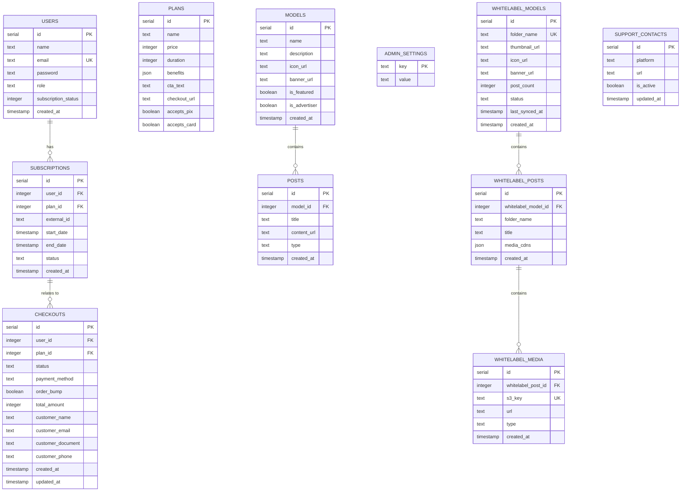

# Deployment & Build

<cite>
**Referenced Files in This Document**
- [package.json](file://package.json)
- [README.md](file://README.md)
- [drizzle.config.ts](file://drizzle.config.ts)
- [tailwind.config.js](file://tailwind.config.js)
- [tsconfig.json](file://tsconfig.json)
- [src/index.tsx](file://src/index.tsx)
- [src/db/index.ts](file://src/db/index.ts)
- [src/db/schema.ts](file://src/db/schema.ts)
- [src/routes/public.tsx](file://src/routes/public.tsx)
- [src/routes/admin.tsx](file://src/routes/admin.tsx)
- [src/routes/api.tsx](file://src/routes/api.tsx)
- [junglepay-documentation.md](file://junglepay-documentation.md)
</cite>

## Table of Contents
1. [Introduction](#introduction)
2. [Project Structure](#project-structure)
3. [Core Components](#core-components)
4. [Architecture Overview](#architecture-overview)
5. [Detailed Component Analysis](#detailed-component-analysis)
6. [Dependency Analysis](#dependency-analysis)
7. [Performance Considerations](#performance-considerations)
8. [Troubleshooting Guide](#troubleshooting-guide)
9. [Conclusion](#conclusion)
10. [Appendices](#appendices)

## Introduction
This document provides comprehensive deployment and build guidance for CreatorFlix. It explains the build process, asset compilation, production optimization strategies, environment configuration, database migration deployment, and asset bundling procedures. It also covers deployment strategies across development, staging, and production environments, containerization options, infrastructure requirements, CI/CD pipeline setup, automated testing integration, release management, performance optimization techniques, caching strategies, monitoring setup, security considerations for production, and maintenance procedures.

## Project Structure
CreatorFlix is a Bun-based Hono application with a frontend built using Tailwind CSS v4. The runtime is Bun, the framework is Hono, the database is PostgreSQL with Drizzle ORM, and assets are compiled via Tailwind CLI. The repository includes:
- Application entry and routing
- Database schema and migrations
- Styling configuration and build scripts
- Payment integrations and webhooks
- Environment-specific configuration via environment variables

**Diagram sources**
- [src/index.tsx](file://src/index.tsx#L1-L21)
- [src/routes/public.tsx](file://src/routes/public.tsx#L1-L170)
- [src/routes/admin.tsx](file://src/routes/admin.tsx#L1-L158)
- [src/routes/api.tsx](file://src/routes/api.tsx#L1-L519)
- [src/db/index.ts](file://src/db/index.ts#L1-L8)
- [src/db/schema.ts](file://src/db/schema.ts#L1-L178)
- [tailwind.config.js](file://tailwind.config.js#L1-L39)
- [package.json](file://package.json#L1-L23)

**Section sources**
- [README.md](file://README.md#L1-L49)
- [package.json](file://package.json#L1-L23)
- [tsconfig.json](file://tsconfig.json#L1-L13)
- [tailwind.config.js](file://tailwind.config.js#L1-L39)

## Core Components
- Build and asset pipeline
  - Bun scripts for development and Tailwind CSS compilation
  - Tailwind CLI configuration for content scanning and output
- Database layer
  - Drizzle ORM schema and connection management
  - Drizzle Kit configuration for migrations
- Routing and server
  - Hono server with static asset serving and route mounting
- Payment and webhooks
  - Internal checkout and subscription flows
  - JunglePay integration and webhook handlers
- Environment configuration
  - DATABASE_URL and JWT_SECRET usage across routes and services

**Section sources**
- [package.json](file://package.json#L3-L7)
- [tailwind.config.js](file://tailwind.config.js#L1-L39)
- [drizzle.config.ts](file://drizzle.config.ts#L1-L11)
- [src/index.tsx](file://src/index.tsx#L1-L21)
- [src/db/index.ts](file://src/db/index.ts#L1-L8)
- [src/db/schema.ts](file://src/db/schema.ts#L1-L178)
- [src/routes/public.tsx](file://src/routes/public.tsx#L18-L51)
- [src/routes/api.tsx](file://src/routes/api.tsx#L13-L13)

## Architecture Overview
The application runs on Bun with Hono as the HTTP server. Requests are routed to public, admin, and API endpoints. The public and admin routes render HTML pages, while API routes handle JSON responses and payment/webhook integrations. Drizzle ORM connects to PostgreSQL for persistence. Tailwind compiles CSS from a single input file to a static output.

**Diagram sources**
- [src/index.tsx](file://src/index.tsx#L1-L21)
- [src/routes/public.tsx](file://src/routes/public.tsx#L54-L64)
- [src/routes/admin.tsx](file://src/routes/admin.tsx#L22-L48)
- [src/routes/api.tsx](file://src/routes/api.tsx#L16-L39)
- [src/db/index.ts](file://src/db/index.ts#L1-L8)

## Detailed Component Analysis

### Build and Asset Pipeline
- Development
  - Hot-reload development server via Bun
- CSS compilation
  - Tailwind CLI compiles input CSS to a static stylesheet
  - Watch mode for iterative development
- Production
  - Build CSS once during deployment
  - Serve static assets via Hono static middleware

**Diagram sources**
- [package.json](file://package.json#L3-L7)
- [tailwind.config.js](file://tailwind.config.js#L1-L39)
- [src/index.tsx](file://src/index.tsx#L9-L9)

**Section sources**
- [package.json](file://package.json#L3-L7)
- [tailwind.config.js](file://tailwind.config.js#L1-L39)
- [src/index.tsx](file://src/index.tsx#L9-L9)

### Database Layer and Migrations
- Schema
  - Strongly typed tables and relations for users, plans, subscriptions, models, posts, whitelabel entities, and admin settings
- Connection
  - Drizzle ORM initialized with a PostgreSQL client and schema mapping
- Migrations
  - Drizzle Kit configuration defines schema location, output directory, and credentials
  - Migration generation and application steps are documented in the project README

**Diagram sources**
- [src/db/schema.ts](file://src/db/schema.ts#L1-L178)

**Section sources**
- [src/db/schema.ts](file://src/db/schema.ts#L1-L178)
- [src/db/index.ts](file://src/db/index.ts#L1-L8)
- [drizzle.config.ts](file://drizzle.config.ts#L1-L11)
- [README.md](file://README.md#L20-L27)

### Routing and Server
- Hono server initialization with static asset serving and route mounting
- Public routes for home, models, posts, plans, checkout, and auth
- Admin routes for dashboard, models, ads, plans, settings, whitelabel, support, and finance
- API routes for checkout, payment webhooks, admin operations, auth, and data retrieval

**Diagram sources**
- [src/index.tsx](file://src/index.tsx#L1-L21)
- [src/routes/public.tsx](file://src/routes/public.tsx#L54-L64)
- [src/routes/admin.tsx](file://src/routes/admin.tsx#L18-L18)
- [src/routes/api.tsx](file://src/routes/api.tsx#L89-L170)

**Section sources**
- [src/index.tsx](file://src/index.tsx#L1-L21)
- [src/routes/public.tsx](file://src/routes/public.tsx#L1-L170)
- [src/routes/admin.tsx](file://src/routes/admin.tsx#L1-L158)
- [src/routes/api.tsx](file://src/routes/api.tsx#L1-L519)

### Payment Integrations and Webhooks
- Internal checkout flow
  - Create checkout record and return checkout identifier
- JunglePay integration
  - Create PIX charge requests and handle webhook updates
- Webhook handlers
  - Process payment success and JunglePay webhooks to activate subscriptions and update statuses

**Diagram sources**
- [src/routes/api.tsx](file://src/routes/api.tsx#L16-L86)
- [src/routes/api.tsx](file://src/routes/api.tsx#L89-L170)
- [src/routes/api.tsx](file://src/routes/api.tsx#L402-L506)

**Section sources**
- [src/routes/api.tsx](file://src/routes/api.tsx#L16-L86)
- [src/routes/api.tsx](file://src/routes/api.tsx#L89-L170)
- [src/routes/api.tsx](file://src/routes/api.tsx#L402-L506)
- [junglepay-documentation.md](file://junglepay-documentation.md#L1-L3198)

## Dependency Analysis
- Runtime and framework
  - Bun runtime, Hono server
- Styling
  - Tailwind CSS v4 and PostCSS
- Database
  - Drizzle ORM, PostgreSQL driver
- AWS SDK
  - S3 client and presigner for DigitalOcean Spaces
- Tooling
  - Drizzle Kit for migrations

**Diagram sources**
- [package.json](file://package.json#L8-L16)
- [src/index.tsx](file://src/index.tsx#L1-L21)
- [src/routes/public.tsx](file://src/routes/public.tsx#L1-L170)
- [src/routes/admin.tsx](file://src/routes/admin.tsx#L1-L158)
- [src/routes/api.tsx](file://src/routes/api.tsx#L1-L519)

**Section sources**
- [package.json](file://package.json#L8-L16)

## Performance Considerations
- Asset optimization
  - Compile Tailwind CSS once for production and cache static assets
  - Minimize and deduplicate CSS by scoping content globs appropriately
- Database performance
  - Use indexes on frequently queried columns (e.g., user email, plan duration)
  - Batch operations for whitelabel synchronization
- Server tuning
  - Adjust idle timeouts for long-running operations
  - Enable compression for API responses
- CDN and caching
  - Serve static assets via CDN for global distribution
  - Implement cache headers for immutable assets
- Monitoring
  - Track response times, error rates, and database query latency
  - Log webhook deliveries and payment events

[No sources needed since this section provides general guidance]

## Troubleshooting Guide
- Database connectivity
  - Verify DATABASE_URL format and network access
  - Confirm Drizzle connection initialization
- Migrations
  - Ensure Drizzle Kit configuration matches schema location and credentials
  - Run migration generation and apply steps as documented
- Authentication cookies
  - Check JWT_SECRET environment variable
  - Confirm cookie attributes (httpOnly, secure, sameSite) for production
- Webhooks
  - Validate webhook signatures and payload parsing
  - Monitor webhook logs and retry mechanisms
- Payment integration
  - Confirm JunglePay credentials and webhook URLs
  - Review webhook handler logic for pending and paid states

**Section sources**
- [src/db/index.ts](file://src/db/index.ts#L5-L6)
- [drizzle.config.ts](file://drizzle.config.ts#L7-L10)
- [README.md](file://README.md#L20-L27)
- [src/routes/public.tsx](file://src/routes/public.tsx#L18-L51)
- [src/routes/api.tsx](file://src/routes/api.tsx#L13-L13)
- [src/routes/api.tsx](file://src/routes/api.tsx#L89-L170)
- [src/routes/api.tsx](file://src/routes/api.tsx#L402-L506)

## Conclusion
CreatorFlix provides a streamlined Bun/Hono stack with Tailwind CSS for styling and Drizzle ORM for database operations. The deployment process centers around compiling CSS, connecting to PostgreSQL, and serving static assets. Production readiness requires careful environment configuration, robust database migrations, secure cookie handling, and reliable webhook processing. CI/CD pipelines should automate dependency installation, CSS compilation, migration application, and image/container builds.

[No sources needed since this section summarizes without analyzing specific files]

## Appendices

### Environment Configuration
- Required variables
  - DATABASE_URL: PostgreSQL connection string
  - JWT_SECRET: Secret for signing auth tokens
- Optional variables
  - NODE_ENV: Controls cookie secure flag and logging verbosity

**Section sources**
- [src/db/index.ts](file://src/db/index.ts#L5-L6)
- [src/routes/public.tsx](file://src/routes/public.tsx#L18-L18)
- [src/routes/api.tsx](file://src/routes/api.tsx#L336-L343)
- [src/routes/api.tsx](file://src/routes/api.tsx#L367-L374)
- [src/routes/api.tsx](file://src/routes/api.tsx#L508-L516)

### Database Migration Deployment
- Generate and apply migrations
  - Use Drizzle Kit to generate and migrate schema changes
- Local vs remote credentials
  - Drizzle Kit configuration includes credentials for schema management

**Section sources**
- [README.md](file://README.md#L24-L27)
- [drizzle.config.ts](file://drizzle.config.ts#L7-L10)

### Asset Bundling Procedures
- CSS compilation
  - Build once for production and commit static/styles.css
  - Use watch mode during development
- Static assets
  - Serve via Hono static middleware under /static

**Section sources**
- [package.json](file://package.json#L5-L6)
- [src/index.tsx](file://src/index.tsx#L9-L9)

### Deployment Strategies
- Development
  - Run Bun dev server with hot reload
  - Use local database and Tailwind watch mode
- Staging
  - Use separate DATABASE_URL and JWT_SECRET
  - Apply migrations and compile CSS
- Production
  - Containerized deployment with Bun runtime
  - Static assets served via CDN or application
  - Secure cookies enabled and HTTPS enforced

**Section sources**
- [README.md](file://README.md#L34-L41)
- [src/index.tsx](file://src/index.tsx#L17-L20)
- [src/routes/api.tsx](file://src/routes/api.tsx#L336-L343)
- [src/routes/api.tsx](file://src/routes/api.tsx#L367-L374)
- [src/routes/api.tsx](file://src/routes/api.tsx#L508-L516)

### Containerization Options
- Image requirements
  - Base image with Bun runtime
  - Install dependencies, build CSS, and start Hono server
- Entrypoint
  - Use Bun to run the exported server module
- Volumes and secrets
  - Mount static assets and configure environment variables

[No sources needed since this section provides general guidance]

### Infrastructure Requirements
- Compute
  - Stateless application server
- Database
  - PostgreSQL instance with Drizzle ORM
- Storage
  - DigitalOcean Spaces (S3-compatible) for media
- Networking
  - HTTPS termination at load balancer or reverse proxy
  - Webhook endpoints exposed securely

**Section sources**
- [README.md](file://README.md#L11-L11)
- [package.json](file://package.json#L9-L11)

### CI/CD Pipeline Setup
- Build stages
  - Install dependencies, compile Tailwind CSS, and run tests
- Security
  - Scan images and dependencies
- Release
  - Tag releases and deploy to target environments
- Rollback
  - Maintain artifact retention and blue/green deployments

[No sources needed since this section provides general guidance]

### Automated Testing Integration
- Unit and integration tests
  - Test database queries, route handlers, and webhook logic
- Coverage
  - Report test coverage and enforce thresholds

[No sources needed since this section provides general guidance]

### Release Management
- Versioning
  - Semantic versioning and changelog maintenance
- Rollout
  - Canary or staged rollouts with health checks
- Post-release
  - Monitor metrics and address incidents

[No sources needed since this section provides general guidance]

### Monitoring Setup
- Logs
  - Centralize Bun application logs and database logs
- Metrics
  - Track HTTP request latency, error rates, and database query times
- Alerts
  - Notify on failed migrations, webhook delivery failures, and high error rates

[No sources needed since this section provides general guidance]

### Security Considerations
- Secrets management
  - Store DATABASE_URL and JWT_SECRET in environment variables
- Transport security
  - Enforce HTTPS and secure cookies in production
- Input validation
  - Sanitize and validate all API inputs and webhook payloads
- Least privilege
  - Limit database and S3 permissions to required actions

**Section sources**
- [src/routes/api.tsx](file://src/routes/api.tsx#L336-L343)
- [src/routes/api.tsx](file://src/routes/api.tsx#L367-L374)
- [src/routes/api.tsx](file://src/routes/api.tsx#L508-L516)