# Administrative Interfaces

<cite>
**Referenced Files in This Document**
- [Admin.tsx](file://src/pages/Admin.tsx)
- [admin.tsx](file://src/routes/admin.tsx)
- [Dashboard.tsx](file://src/pages/admin/Dashboard.tsx)
- [Models.tsx](file://src/pages/admin/Models.tsx)
- [Ads.tsx](file://src/pages/admin/Ads.tsx)
- [AdsCreate.tsx](file://src/pages/admin/AdsCreate.tsx)
- [Plans.tsx](file://src/pages/admin/Plans.tsx)
- [Finance.tsx](file://src/pages/admin/Finance.tsx)
- [Settings.tsx](file://src/pages/admin/Settings.tsx)
- [Support.tsx](file://src/pages/admin/Support.tsx)
- [Whitelabel.tsx](file://src/pages/admin/Whitelabel.tsx)
- [Clients.tsx](file://src/pages/admin/Clients.tsx)
- [AdminLayout.tsx](file://src/components/templates/AdminLayout.tsx)
- [AdminSidebar.tsx](file://src/components/organisms/AdminSidebar.tsx)
- [AdTable.tsx](file://src/components/organisms/AdTable.tsx)
- [AdBanner.tsx](file://src/components/molecules/AdBanner.tsx)
- [AdSpotSmall.tsx](file://src/components/molecules/AdSpotSmall.tsx)
- [NativeAdBlock.tsx](file://src/components/molecules/NativeAdBlock.tsx)
- [PostCard.tsx](file://src/components/organisms/PostCard.tsx)
- [TransactionsTable.tsx](file://src/components/organisms/TransactionsTable.tsx)
- [ClientStatsSection.tsx](file://src/components/organisms/ClientStatsSection.tsx)
- [ClientTable.tsx](file://src/components/organisms/ClientTable.tsx)
- [ActionHistoryButton.tsx](file://src/components/molecules/ActionHistoryButton.tsx)
- [TransactionHistoryModal.tsx](file://src/components/organisms/TransactionHistoryModal.tsx)
- [OrderBump.tsx](file://src/components/molecules/OrderBump.tsx)
- [OrderSummary.tsx](file://src/components/organisms/OrderSummary.tsx)
- [Checkout.tsx](file://src/pages/Checkout.tsx)
- [checkout-core.js](file://static/js/checkout-core.js)
- [admin.ts](file://src/services/admin.ts)
- [activation.ts](file://src/services/admin/activation.ts)
- [ads.ts](file://src/services/ads.ts)
- [schema.ts](file://src/db/schema.ts)
- [api.tsx](file://src/routes/api.tsx)
- [migrate-postback.ts](file://scripts/migrate-postback.ts)
- [junglepay.ts](file://src/services/junglepay.ts)
- [junglepay-documentation.md](file://junglepay-documentation.md)
- [0010_ads_table.sql](file://drizzle/0010_ads_table.sql)
</cite>

## Update Summary
**Changes Made**
- Enhanced advertising management system with comprehensive Ads listing, AdsCreate form with real-time preview, and complete CRUD operations for ad campaigns
- Added detailed component analysis for advertising controls and campaign creation
- Integrated AdsService with full CRUD operations, placement validation, and analytics tracking
- Implemented real-time preview system with dynamic ad type switching and client-side updates
- Added comprehensive ad placement management with type-specific validation and display options
- Enhanced admin routes with complete advertising workflow including listing, filtering, and management operations

## Table of Contents
1. [Introduction](#introduction)
2. [Project Structure](#project-structure)
3. [Core Components](#core-components)
4. [Architecture Overview](#architecture-overview)
5. [Detailed Component Analysis](#detailed-component-analysis)
6. [Advertising Management System](#advertising-management-system)
7. [Order Bump Management System](#order-bump-management-system)
8. [Client Management System](#client-management-system)
9. [Transaction Management System](#transaction-management-system)
10. [Payment Gateway Configuration and Webhook Integration](#payment-gateway-configuration-and-webhook-integration)
11. [Transaction History Modal Feature](#transaction-history-modal-feature)
12. [Component Architecture Refactoring](#component-architecture-refactoring)
13. [Dependency Analysis](#dependency-analysis)
14. [Performance Considerations](#performance-considerations)
15. [Troubleshooting Guide](#troubleshooting-guide)
16. [Conclusion](#conclusion)

## Introduction
This document describes the administrative dashboard and management interfaces for the CreatorFlix platform. It explains the admin layout structure, navigation patterns, role-based access controls, and the dashboards for analytics, user metrics, and system status. It also documents model management, content moderation, advertising controls, financial oversight and reporting functionality, whitelabel integration, client management, order bump administration, and system configuration. Finally, it covers data visualization components, bulk operations, administrative workflows, security measures, audit logging, and approval processes.

**Updated** Enhanced with comprehensive advertising management capabilities including Ads listing, AdsCreate form with real-time preview, and complete CRUD operations for ad campaigns. The advertising system now provides sophisticated campaign management with type-specific placements, real-time preview updates, and comprehensive analytics tracking.

## Project Structure
The admin system is organized around a server-side rendered React-like JSX stack with Hono routing and Drizzle ORM for database operations. The admin pages are grouped under `/admin`, each responsible for a functional domain (dashboard, models, ads, plans, finance, clients, settings, support, whitelabel). The AdminLayout composes a fixed sidebar and a content area, while the AdminSidebar provides navigation across admin sections including the new advertising management capabilities.

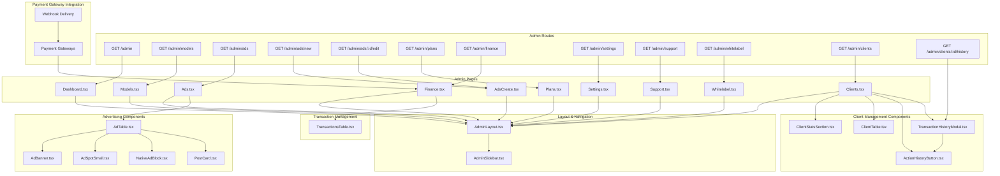
```mermaid
graph TB
subgraph "Admin Routes"
R1["GET /admin"]
R2["GET /admin/models"]
R3["GET /admin/ads"]
R4["GET /admin/ads/new"]
R5["GET /admin/ads/:id/edit"]
R6["GET /admin/plans"]
R7["GET /admin/finance"]
R8["GET /admin/settings"]
R9["GET /admin/support"]
R10["GET /admin/whitelabel"]
R11["GET /admin/clients"]
R12["GET /admin/clients/:id/history"]
end
subgraph "Admin Pages"
D["Dashboard.tsx"]
M["Models.tsx"]
A["Ads.tsx"]
AC["AdsCreate.tsx"]
P["Plans.tsx"]
F["Finance.tsx"]
S["Settings.tsx"]
U["Support.tsx"]
W["Whitelabel.tsx"]
C["Clients.tsx"]
end
subgraph "Layout & Navigation"
L["AdminLayout.tsx"]
SB["AdminSidebar.tsx"]
end
subgraph "Advertising Components"
AT["AdTable.tsx"]
AB["AdBanner.tsx"]
AS["AdSpotSmall.tsx"]
NAB["NativeAdBlock.tsx"]
PC["PostCard.tsx"]
end
subgraph "Client Management Components"
CSS["ClientStatsSection.tsx"]
CT["ClientTable.tsx"]
AHB["ActionHistoryButton.tsx"]
THM["TransactionHistoryModal.tsx"]
end
subgraph "Transaction Management"
TT["TransactionsTable.tsx"]
end
subgraph "Payment Gateway Integration"
PG["Payment Gateways"]
WEBHOOK["Webhook Delivery"]
end
R1 --> D
R2 --> M
R3 --> A
R4 --> AC
R5 --> AC
R6 --> P
R7 --> F
R8 --> S
R9 --> U
R10 --> W
R11 --> C
R12 --> THM
D --> L
M --> L
A --> L
AC --> L
P --> L
F --> L
S --> L
U --> L
W --> L
C --> L
L --> SB
F --> TT
PG --> F
WEBHOOK --> PG
C --> CSS
C --> CT
C --> AHB
C --> THM
THM --> AHB
A --> AT
AT --> AB
AT --> AS
AT --> NAB
AT --> PC
```

**Diagram sources**
- [admin.tsx](file://src/routes/admin.tsx#L1-L595)
- [Ads.tsx](file://src/pages/admin/Ads.tsx#L1-L131)
- [AdsCreate.tsx](file://src/pages/admin/AdsCreate.tsx#L1-L569)
- [AdTable.tsx](file://src/components/organisms/AdTable.tsx#L1-L119)
- [AdBanner.tsx](file://src/components/molecules/AdBanner.tsx#L1-L36)
- [AdSpotSmall.tsx](file://src/components/molecules/AdSpotSmall.tsx#L1-L32)
- [NativeAdBlock.tsx](file://src/components/molecules/NativeAdBlock.tsx#L1-L29)
- [PostCard.tsx](file://src/components/organisms/PostCard.tsx#L1-L162)

**Section sources**
- [admin.tsx](file://src/routes/admin.tsx#L1-L595)
- [AdminLayout.tsx](file://src/components/templates/AdminLayout.tsx#L1-L64)
- [AdminSidebar.tsx](file://src/components/organisms/AdminSidebar.tsx#L1-L99)

## Core Components
- AdminLayout: Provides the global admin shell with header, sidebar placement, and background accents. It injects shared assets and sets the active page context for highlighting navigation.
- AdminSidebar: Renders categorized navigation items, highlights the current route, and includes a user card and logout affordance.
- Ads: **ENHANCED** Comprehensive advertising management interface with campaign listing, filtering, and CRUD operations.
- AdsCreate: **ENHANCED** Advanced campaign creation form with real-time preview, type-specific validation, and dynamic placement options.
- AdTable: **ENHANCED** Sophisticated table component for displaying advertising campaigns with analytics, status management, and action controls.
- AdBanner: **ENHANCED** Real-time preview component for banner advertisements with dynamic content updates.
- AdSpotSmall: **ENHANCED** Real-time preview component for small advertisement spots with adaptive layouts.
- NativeAdBlock: **ENHANCED** Real-time preview component for native advertisement blocks with sponsored content styling.
- PostCard: **ENHANCED** Real-time preview component for diamond-style advertisements integrated into content feeds.
- ClientStatsSection: **NEW** Dedicated component for displaying client statistics with three key metrics (total users, active subscribers, inactive subscribers) in a responsive grid layout.
- ClientTable: **NEW** Enhanced table component with improved dark theme styling, better column structure, and integrated pagination controls.
- ActionHistoryButton: **NEW** HTMX-powered button component that triggers transaction history modal with smooth animations and modal scripting.
- TransactionHistoryModal: **NEW** Sophisticated modal component with dark theme styling, glass morphism effects, and smooth entrance/exit animations.
- TransactionsTable: **NEW** Comprehensive transaction management component that displays both checkout transactions and subscription records with filtering, pagination, and status management.
- Clients: **NEW** Dedicated client management page that integrates all new components for user listing, search functionality, subscription status tracking, and transaction history modal integration.
- Admin pages: Each page composes layout and domain-specific UI (tables, forms, charts, and lists) with pagination and filters.

Key responsibilities:
- AdminLayout: Sets up the HTML shell, fonts, and scripts; positions the sidebar and content area; renders header with status indicators.
- AdminSidebar: Manages navigation sections (Overview, Content, Monetization, System); applies active state styling; supports logout.
- Ads: **ENHANCED** Manages advertising campaigns with comprehensive CRUD operations, filtering by status and placement, and analytics display.
- AdsCreate: **ENHANCED** Provides campaign creation with real-time preview, type-specific field validation, dynamic placement options, and client-side updates.
- AdTable: **ENHANCED** Displays advertising campaigns with impression/click tracking, CTR calculation, status badges, and action buttons.
- AdBanner: **ENHANCED** Renders banner advertisements with dynamic content updates and click tracking integration.
- AdSpotSmall: **ENHANCED** Renders small advertisement spots with adaptive layouts and click tracking.
- NativeAdBlock: **ENHANCED** Renders native advertisement blocks with sponsored content styling and model card integration.
- PostCard: **ENHANCED** Renders diamond-style advertisements integrated into content feeds with promotional overlays.
- ClientStatsSection: Displays client statistics cards with proper localization and responsive design.
- ClientTable: Renders user data in an enhanced dark theme with improved column structure and pagination controls.
- ActionHistoryButton: Provides HTMX integration for dynamic modal loading with smooth animations.
- TransactionHistoryModal: Manages modal state, animations, and dark theme styling with glass morphism effects.
- TransactionsTable: Handles dual-mode transaction display (JunglePay checkouts vs Dias Marketplace subscriptions) with advanced filtering, status badges, and pagination.
- Clients: Integrates all client management components with improved user experience and administrative controls.
- Admin pages: Render domain views, bind to services and database, and expose CRUD and configuration UIs.

**Section sources**
- [AdminLayout.tsx](file://src/components/templates/AdminLayout.tsx#L1-L64)
- [AdminSidebar.tsx](file://src/components/organisms/AdminSidebar.tsx#L1-L99)
- [Ads.tsx](file://src/pages/admin/Ads.tsx#L1-L131)
- [AdsCreate.tsx](file://src/pages/admin/AdsCreate.tsx#L1-L569)
- [AdTable.tsx](file://src/components/organisms/AdTable.tsx#L1-L119)
- [AdBanner.tsx](file://src/components/molecules/AdBanner.tsx#L1-L36)
- [AdSpotSmall.tsx](file://src/components/molecules/AdSpotSmall.tsx#L1-L32)
- [NativeAdBlock.tsx](file://src/components/molecules/NativeAdBlock.tsx#L1-L29)
- [PostCard.tsx](file://src/components/organisms/PostCard.tsx#L1-L162)
- [ClientStatsSection.tsx](file://src/components/organisms/ClientStatsSection.tsx#L1-L21)
- [ClientTable.tsx](file://src/components/organisms/ClientTable.tsx#L1-L84)
- [ActionHistoryButton.tsx](file://src/components/molecules/ActionHistoryButton.tsx#L1-L62)
- [TransactionHistoryModal.tsx](file://src/components/organisms/TransactionHistoryModal.tsx#L1-L34)
- [TransactionsTable.tsx](file://src/components/organisms/TransactionsTable.tsx#L1-L319)
- [Clients.tsx](file://src/pages/admin/Clients.tsx#L1-L40)
- [Dashboard.tsx](file://src/pages/admin/Dashboard.tsx#L1-L85)
- [Models.tsx](file://src/pages/admin/Models.tsx#L1-L35)
- [Finance.tsx](file://src/pages/admin/Finance.tsx#L1-L151)
- [Settings.tsx](file://src/pages/admin/Settings.tsx#L1-L51)
- [Support.tsx](file://src/pages/admin/Support.tsx#L1-L88)
- [Whitelabel.tsx](file://src/pages/admin/Whitelabel.tsx#L1-L30)

## Architecture Overview
The admin architecture follows a layered approach:
- Routing layer: Hono routes map URLs to admin pages and handle initialization logic (e.g., seeding default plans, initializing support contacts, client management, advertising campaign management). The routing system now includes dedicated endpoints for advertising CRUD operations and real-time preview updates.
- Presentation layer: Admin pages render domain UIs using shared components (AdminLayout, AdminSidebar) and domain-specific organisms and molecules. **Enhanced** with comprehensive advertising management interface and real-time preview system.
- Services layer: Admin service orchestrates model activation workflows; whitelabel services manage S3/DigitalOcean integrations; finance and plans services coordinate gateway and pricing configuration; client management services handle user administration; **NEW** advertising services manage campaign lifecycle, placement validation, and analytics tracking.
- Data layer: Drizzle ORM interacts with the database to fetch and persist admin-related data including user management, subscription tracking, advertising campaigns, and analytics.

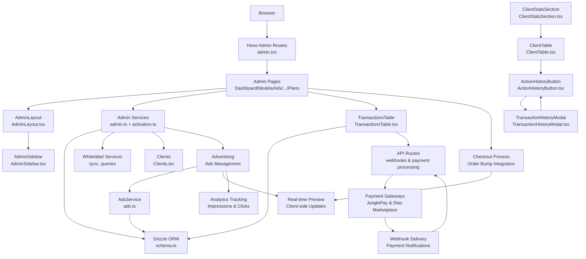
```mermaid
graph TB
Client["Browser"]
Router["Hono Admin Routes<br/>admin.tsx"]
Pages["Admin Pages<br/>Dashboard/Models/Ads/.../Plans"]
Layout["AdminLayout<br/>AdminLayout.tsx"]
Sidebar["AdminSidebar<br/>AdminSidebar.tsx"]
Services["Admin Services<br/>admin.ts + activation.ts"]
AdsService["AdsService<br/>ads.ts"]
DB["Drizzle ORM<br/>schema.ts"]
WL["Whitelabel Services<br/>sync, queries"]
CSS["ClientStatsSection<br/>ClientStatsSection.tsx"]
CT["ClientTable<br/>ClientTable.tsx"]
AHB["ActionHistoryButton<br/>ActionHistoryButton.tsx"]
THM["TransactionHistoryModal<br/>TransactionHistoryModal.tsx"]
TT["TransactionsTable<br/>TransactionsTable.tsx"]
Clients["Clients<br/>Clients.tsx"]
Ads["Advertising<br/>Ads Management"]
Preview["Real-time Preview<br/>Client-side Updates"]
Analytics["Analytics Tracking<br/>Impressions & Clicks"]
API["API Routes<br/>webhooks & payment processing"]
PG["Payment Gateways<br/>JunglePay & Dias Marketplace"]
WEBHOOK["Webhook Delivery<br/>Payment Notifications"]
Checkout["Checkout Process<br/>Order Bump Integration"]
Client --> Router
Router --> Pages
Pages --> Layout
Layout --> Sidebar
Pages --> Services
Services --> DB
Services --> WL
Services --> Clients
Services --> Ads
Ads --> AdsService
AdsService --> DB
Ads --> Preview
Ads --> Analytics
Pages --> TT
TT --> DB
TT --> API
API --> PG
PG --> WEBHOOK
WEBHOOK --> API
CSS --> CT
CT --> AHB
AHB --> THM
THM --> AHB
Pages --> Checkout
Checkout --> Preview
```

**Diagram sources**
- [admin.tsx](file://src/routes/admin.tsx#L1-L595)
- [Ads.tsx](file://src/pages/admin/Ads.tsx#L1-L131)
- [AdsCreate.tsx](file://src/pages/admin/AdsCreate.tsx#L1-L569)
- [ads.ts](file://src/services/ads.ts#L1-L329)
- [AdminLayout.tsx](file://src/components/templates/AdminLayout.tsx#L1-L64)
- [AdminSidebar.tsx](file://src/components/organisms/AdminSidebar.tsx#L1-L99)
- [admin.ts](file://src/services/admin.ts#L1-L5)
- [activation.ts](file://src/services/admin/activation.ts#L1-L86)
- [Clients.tsx](file://src/pages/admin/Clients.tsx#L1-L40)
- [ClientStatsSection.tsx](file://src/components/organisms/ClientStatsSection.tsx#L1-L21)
- [ClientTable.tsx](file://src/components/organisms/ClientTable.tsx#L1-L84)
- [ActionHistoryButton.tsx](file://src/components/molecules/ActionHistoryButton.tsx#L1-L62)
- [TransactionHistoryModal.tsx](file://src/components/organisms/TransactionHistoryModal.tsx#L1-L34)
- [TransactionsTable.tsx](file://src/components/organisms/TransactionsTable.tsx#L1-L319)
- [api.tsx](file://src/routes/api.tsx#L690-L858)
- [Plans.tsx](file://src/pages/admin/Plans.tsx#L1-L492)

**Section sources**
- [admin.tsx](file://src/routes/admin.tsx#L1-L595)
- [ads.ts](file://src/services/ads.ts#L1-L329)
- [admin.ts](file://src/services/admin.ts#L1-L5)
- [activation.ts](file://src/services/admin/activation.ts#L1-L86)

## Detailed Component Analysis

### Admin Layout and Navigation
- Fixed sidebar with categorized sections and active-state indicators.
- Header with branding, online status, version, and notifications area.
- Content area with background gradients and depth effects.

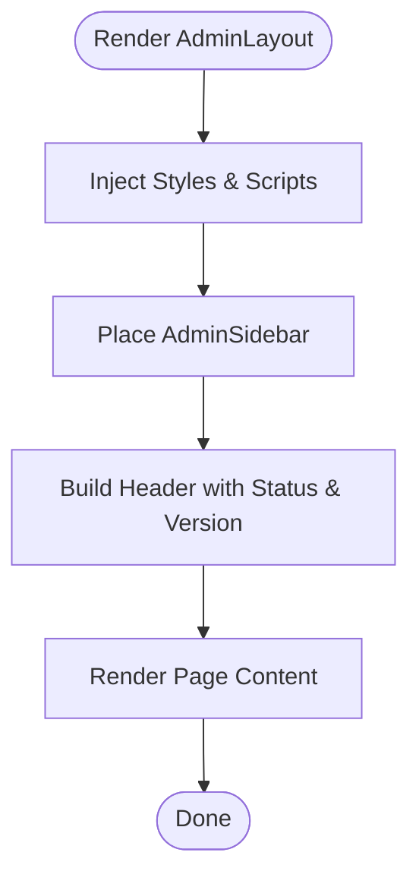
```mermaid
flowchart TD
Start(["Render AdminLayout"]) --> InjectAssets["Inject Styles & Scripts"]
InjectAssets --> PlaceSidebar["Place AdminSidebar"]
PlaceSidebar --> BuildHeader["Build Header with Status & Version"]
BuildHeader --> RenderContent["Render Page Content"]
RenderContent --> End(["Done"])
```

**Diagram sources**
- [AdminLayout.tsx](file://src/components/templates/AdminLayout.tsx#L1-L64)
- [AdminSidebar.tsx](file://src/components/organisms/AdminSidebar.tsx#L1-L99)

**Section sources**
- [AdminLayout.tsx](file://src/components/templates/AdminLayout.tsx#L1-L64)
- [AdminSidebar.tsx](file://src/components/organisms/AdminSidebar.tsx#L1-L99)

### Dashboard Analytics and System Status
- Overview cards for revenue, active users, and model counts.
- Traffic chart visualization with hourly data and hover details.
- Live activity feed with recent events and a log view action.

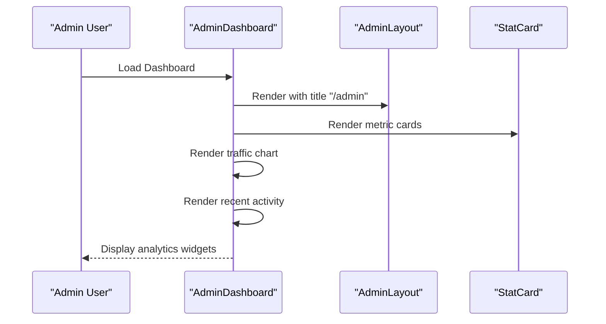
```mermaid
sequenceDiagram
participant User as "Admin User"
participant Page as "AdminDashboard"
participant Layout as "AdminLayout"
participant Stats as "StatCard"
User->>Page : Load Dashboard
Page->>Layout : Render with title "/admin"
Page->>Stats : Render metric cards
Page->>Page : Render traffic chart
Page->>Page : Render recent activity
Page-->>User : Display analytics widgets
```

**Diagram sources**
- [Dashboard.tsx](file://src/pages/admin/Dashboard.tsx#L1-L85)
- [AdminLayout.tsx](file://src/components/templates/AdminLayout.tsx#L1-L64)

**Section sources**
- [Dashboard.tsx](file://src/pages/admin/Dashboard.tsx#L1-L85)

### Model Management and Moderation
- Model listing with tabs for filtering (All, Pending, Banned).
- Search input and pagination controls.
- Bulk moderation actions (activate, ban) handled by AdminActivationService.

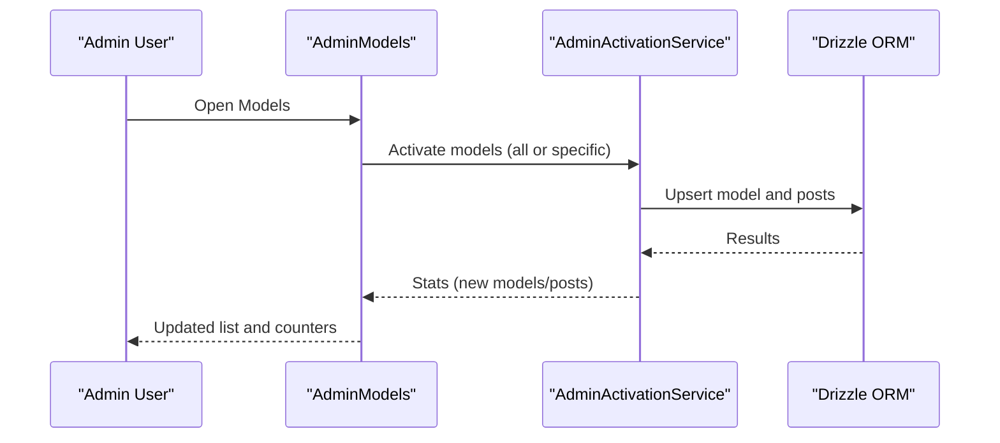
```mermaid
sequenceDiagram
participant User as "Admin User"
participant ModelsPage as "AdminModels"
participant Service as "AdminActivationService"
participant DB as "Drizzle ORM"
User->>ModelsPage : Open Models
ModelsPage->>Service : Activate models (all or specific)
Service->>DB : Upsert model and posts
DB-->>Service : Results
Service-->>ModelsPage : Stats (new models/posts)
ModelsPage-->>User : Updated list and counters
```

**Diagram sources**
- [Models.tsx](file://src/pages/admin/Models.tsx#L1-L35)
- [admin.ts](file://src/services/admin.ts#L1-L5)
- [activation.ts](file://src/services/admin/activation.ts#L1-L86)

**Section sources**
- [Models.tsx](file://src/pages/admin/Models.tsx#L1-L35)
- [admin.ts](file://src/services/admin.ts#L1-L5)
- [activation.ts](file://src/services/admin/activation.ts#L1-L86)

### Advertising Controls and Campaign Creation
- Ads listing with pagination, filtering by status and placement, and action buttons.
- New campaign creation with comprehensive form validation and real-time preview for multiple ad formats.
- Complete CRUD operations with type-specific field validation and placement restrictions.
- Analytics tracking with impression and click counters, CTR calculation, and status management.

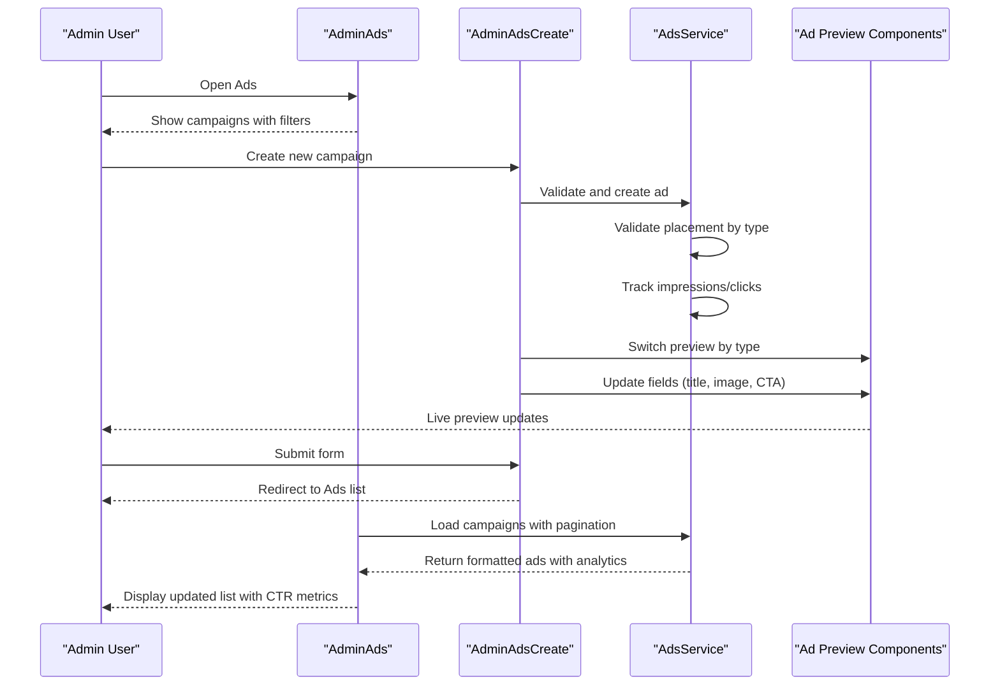
```mermaid
sequenceDiagram
participant User as "Admin User"
participant AdsList as "AdminAds"
participant AdsCreate as "AdminAdsCreate"
participant AdsService as "AdsService"
participant Preview as "Ad Preview Components"
User->>AdsList : Open Ads
AdsList-->>User : Show campaigns with filters
User->>AdsCreate : Create new campaign
AdsCreate->>AdsService : Validate and create ad
AdsService->>AdsService : Validate placement by type
AdsService->>AdsService : Track impressions/clicks
AdsCreate->>Preview : Switch preview by type
AdsCreate->>Preview : Update fields (title, image, CTA)
Preview-->>User : Live preview updates
User->>AdsCreate : Submit form
AdsCreate-->>User : Redirect to Ads list
AdsList->>AdsService : Load campaigns with pagination
AdsService-->>AdsList : Return formatted ads with analytics
AdsList-->>User : Display updated list with CTR metrics
```

**Diagram sources**
- [Ads.tsx](file://src/pages/admin/Ads.tsx#L1-L131)
- [AdsCreate.tsx](file://src/pages/admin/AdsCreate.tsx#L1-L569)
- [ads.ts](file://src/services/ads.ts#L1-L329)
- [AdTable.tsx](file://src/components/organisms/AdTable.tsx#L1-L119)

**Section sources**
- [Ads.tsx](file://src/pages/admin/Ads.tsx#L1-L131)
- [AdsCreate.tsx](file://src/pages/admin/AdsCreate.tsx#L1-L569)
- [ads.ts](file://src/services/ads.ts#L1-L329)
- [AdTable.tsx](file://src/components/organisms/AdTable.tsx#L1-L119)

### Finance and Subscription Configuration
- Payment gateway selection (external marketplace vs internal checkout).
- JunglePay keys management with active state indicator.
- Plan configuration per duration (weekly, monthly, annual) with pricing and checkout URL or accepted methods.

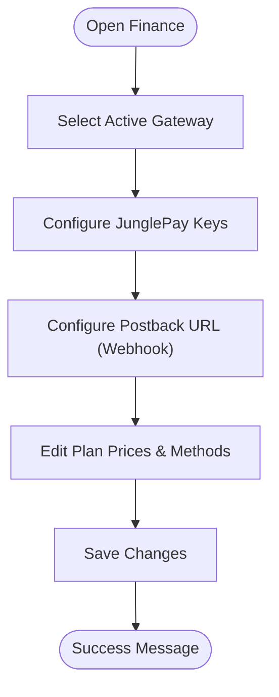
```mermaid
flowchart TD
Start(["Open Finance"]) --> SelectGateway["Select Active Gateway"]
SelectGateway --> ConfigureJunglePay["Configure JunglePay Keys"]
ConfigureJunglePay --> ConfigurePostback["Configure Postback URL (Webhook)"]
ConfigurePostback --> EditPlans["Edit Plan Prices & Methods"]
EditPlans --> Save["Save Changes"]
Save --> End(["Success Message"])
```

**Diagram sources**
- [Finance.tsx](file://src/pages/admin/Finance.tsx#L1-L151)
- [Plans.tsx](file://src/pages/admin/Plans.tsx#L1-L492)

**Section sources**
- [Finance.tsx](file://src/pages/admin/Finance.tsx#L1-L151)
- [Plans.tsx](file://src/pages/admin/Plans.tsx#L1-L492)

### System Configuration and Support Channels
- General site settings (name, support email).
- Payment gateway toggles and statuses.
- Support channels configuration with validation and prefixes for WhatsApp/Telegram.

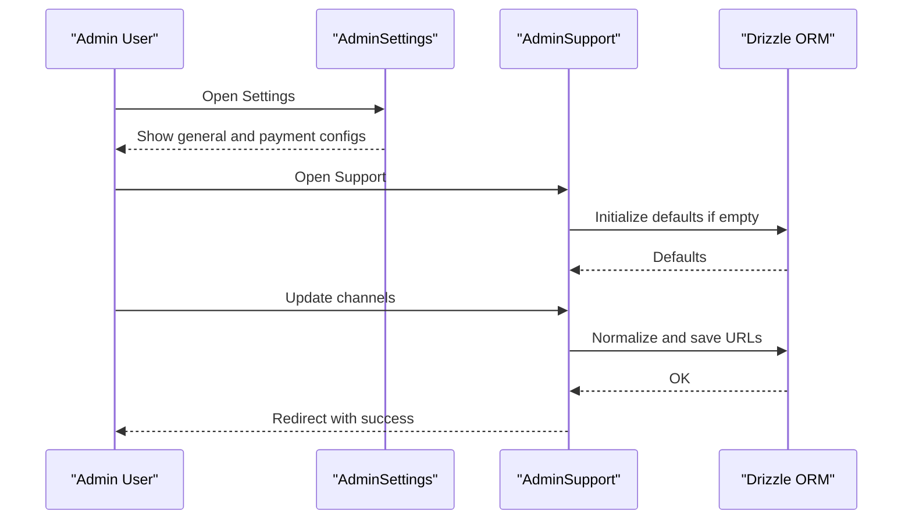
```mermaid
sequenceDiagram
participant User as "Admin User"
participant Settings as "AdminSettings"
participant Support as "AdminSupport"
participant DB as "Drizzle ORM"
User->>Settings : Open Settings
Settings-->>User : Show general and payment configs
User->>Support : Open Support
Support->>DB : Initialize defaults if empty
DB-->>Support : Defaults
User->>Support : Update channels
Support->>DB : Normalize and save URLs
DB-->>Support : OK
Support-->>User : Redirect with success
```

**Diagram sources**
- [Settings.tsx](file://src/pages/admin/Settings.tsx#L1-L51)
- [Support.tsx](file://src/pages/admin/Support.tsx#L1-L88)
- [admin.tsx](file://src/routes/admin.tsx#L343-L386)

**Section sources**
- [Settings.tsx](file://src/pages/admin/Settings.tsx#L1-L51)
- [Support.tsx](file://src/pages/admin/Support.tsx#L1-L88)
- [admin.tsx](file://src/routes/admin.tsx#L343-L386)

### Whitelabel Integration and S3/DigitalOcean
- Paginated whitelabel model listing with sync and status statistics.
- Background sync from bucket to staging and activation pipeline to production.
- Admin activation service coordinates model and post upserts and marks models active.

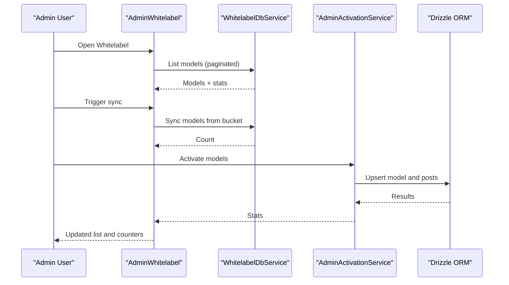
```mermaid
sequenceDiagram
participant User as "Admin User"
participant WL as "AdminWhitelabel"
participant WLService as "WhitelabelDbService"
participant AdminSvc as "AdminActivationService"
participant DB as "Drizzle ORM"
User->>WL : Open Whitelabel
WL->>WLService : List models (paginated)
WLService-->>WL : Models + stats
User->>WL : Trigger sync
WL->>WLService : Sync models from bucket
WLService-->>WL : Count
User->>AdminSvc : Activate models
AdminSvc->>DB : Upsert model and posts
DB-->>AdminSvc : Results
AdminSvc-->>WL : Stats
WL-->>User : Updated list and counters
```

**Diagram sources**
- [Whitelabel.tsx](file://src/pages/admin/Whitelabel.tsx#L1-L30)
- [admin.tsx](file://src/routes/admin.tsx#L554-L592)
- [activation.ts](file://src/services/admin/activation.ts#L1-L86)

**Section sources**
- [Whitelabel.tsx](file://src/pages/admin/Whitelabel.tsx#L1-L30)
- [admin.tsx](file://src/routes/admin.tsx#L554-L592)
- [activation.ts](file://src/services/admin/activation.ts#L1-L86)

### Role-Based Access Controls and Security Measures
- Authentication and session handling are managed by the application's auth layer (outside the scope of admin pages).
- AdminSidebar includes a logout action for secure session termination.
- Finance and settings pages handle sensitive configuration updates with server-side validation and redirects.

Security considerations:
- Prefer server-side validation for sensitive fields (payment keys, URLs).
- Use HTTPS and secure cookies for sessions.
- Limit administrative actions to authorized users and log significant changes.

**Section sources**
- [AdminSidebar.tsx](file://src/components/organisms/AdminSidebar.tsx#L91-L94)
- [Finance.tsx](file://src/pages/admin/Finance.tsx#L76-L106)
- [Support.tsx](file://src/pages/admin/Support.tsx#L39-L82)

### Audit Logging and Administrative Workflows
- Finance and support pages display success messages after updates.
- Whitelabel activation returns statistics for processed models and posts.
- AdminActivationService tracks new model and post counts during bulk activation.
- AdsService provides comprehensive logging for campaign operations.

Recommended enhancements:
- Add structured audit logs for admin actions (who, when, what changed).
- Implement approval workflows for sensitive changes (e.g., payment keys, whitelabel sync).
- Provide a dedicated logs page for administrators.

**Section sources**
- [Finance.tsx](file://src/pages/admin/Finance.tsx#L50-L54)
- [Whitelabel.tsx](file://src/pages/admin/Whitelabel.tsx#L22-L24)
- [activation.ts](file://src/services/admin/activation.ts#L10-L20)
- [ads.ts](file://src/services/ads.ts#L145-L173)

## Advertising Management System

**NEW** The administrative interfaces now include a comprehensive advertising management system through the enhanced Ads.tsx, AdsCreate.tsx, and AdTable.tsx components, providing sophisticated campaign management with real-time preview capabilities and complete CRUD operations.

### Enhanced Ads.tsx Component Architecture
The Ads.tsx component provides a comprehensive advertising management interface:

#### Campaign Listing and Filtering
- **Pagination Support**: Displays up to 20 campaigns per page with navigation controls.
- **Advanced Filtering**: Filter by status (active, paused, draft) and placement locations.
- **Analytics Display**: Shows impression counts, click counts, and calculated CTR percentages.
- **Action Controls**: Edit, toggle status, and delete operations for each campaign.

#### Comprehensive Campaign Management
- **Status Management**: Toggle between active and paused states with visual indicators.
- **Placement Validation**: Ensures campaigns are placed in appropriate locations based on ad type.
- **Priority System**: Sort campaigns by priority for display ordering.
- **Analytics Tracking**: Real-time impression and click counting with CTR calculation.

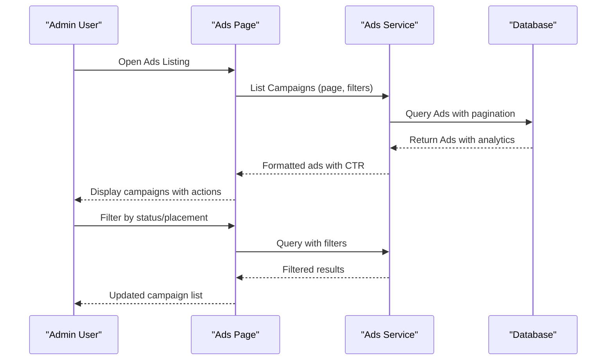
```mermaid
sequenceDiagram
participant Admin as "Admin User"
participant AdsPage as "Ads Page"
participant AdsService as "Ads Service"
participant DB as "Database"
Admin->>AdsPage : Open Ads Listing
AdsPage->>AdsService : List Campaigns (page, filters)
AdsService->>DB : Query Ads with pagination
DB-->>AdsService : Return Ads with analytics
AdsService-->>AdsPage : Formatted ads with CTR
AdsPage-->>Admin : Display campaigns with actions
Admin->>AdsPage : Filter by status/placement
AdsPage->>AdsService : Query with filters
AdsService-->>AdsPage : Filtered results
AdsPage-->>Admin : Updated campaign list
```

**Diagram sources**
- [Ads.tsx](file://src/pages/admin/Ads.tsx#L40-L72)
- [ads.ts](file://src/services/ads.ts#L90-L132)

#### Enhanced AdsCreate.tsx Component Architecture
The AdsCreate.tsx component provides a sophisticated campaign creation interface:

##### Real-Time Preview System
- **Dynamic Type Switching**: Client-side JavaScript updates preview based on ad type selection.
- **Placement Validation**: Automatically validates placement options based on selected ad type.
- **Field Visibility**: Shows/hides type-specific fields (subtitle for banners, category for heroes).
- **Image Preview**: Real-time image updates in all preview variants.

##### Comprehensive Form Validation
- **Type-Specific Fields**: Different form fields based on ad type (diamond, banner, spot, hero).
- **Placement Restrictions**: Enforces valid placements for each ad type.
- **Priority Management**: Numeric priority input with validation (0-100 range).
- **Image URL Validation**: Placeholder recommendations and validation.

##### Client-Side JavaScript Integration
- **Event Listeners**: Automatic updates when form fields change.
- **Preview Updates**: Real-time preview updates across all ad variants.
- **Placement Options**: Dynamic placement dropdown based on ad type.
- **Status Messages**: Informative hints about placement availability.

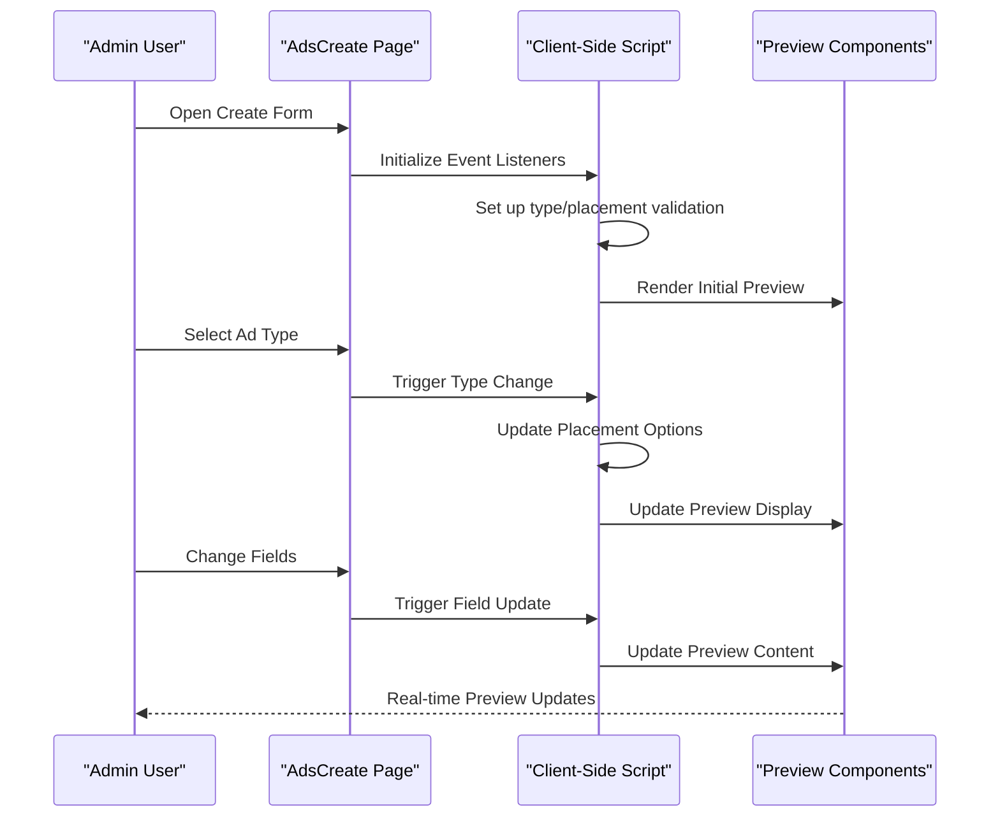
```mermaid
sequenceDiagram
participant Admin as "Admin User"
participant CreatePage as "AdsCreate Page"
participant JS as "Client-Side Script"
participant Preview as "Preview Components"
Admin->>CreatePage : Open Create Form
CreatePage->>JS : Initialize Event Listeners
JS->>JS : Set up type/placement validation
JS->>Preview : Render Initial Preview
Admin->>CreatePage : Select Ad Type
CreatePage->>JS : Trigger Type Change
JS->>JS : Update Placement Options
JS->>Preview : Update Preview Display
Admin->>CreatePage : Change Fields
CreatePage->>JS : Trigger Field Update
JS->>Preview : Update Preview Content
Preview-->>Admin : Real-time Preview Updates
```

**Diagram sources**
- [AdsCreate.tsx](file://src/pages/admin/AdsCreate.tsx#L300-L565)

#### Enhanced AdTable.tsx Component Architecture
The AdTable.tsx component provides a sophisticated campaign display interface:

##### Analytics Integration
- **CTR Calculation**: Real-time click-through rate calculation (clicks/impressions × 100).
- **Color-Coded Metrics**: Visual indicators for high-performing campaigns (green >2%, yellow >1%).
- **Status Badges**: Color-coded status indicators (Active, Paused, Draft).
- **Campaign Details**: Shows campaign name, type, placement, and unique identifiers.

##### Action Controls
- **Edit Operations**: Direct edit access with contextual navigation.
- **Toggle Actions**: One-click status toggling with confirmation prompts.
- **Delete Operations**: Secure deletion with user confirmation.
- **Visual Feedback**: Hover states and transition effects for better UX.

##### Data Formatting
- **Number Localization**: Proper Brazilian locale formatting for large numbers.
- **Type Labels**: Human-readable ad type descriptions.
- **Placement Descriptions**: Clear placement location descriptions.

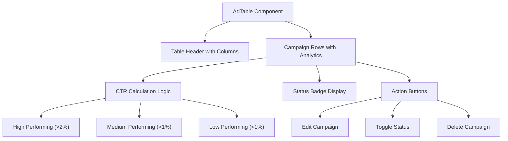
```mermaid
flowchart TD
AdTable["AdTable Component"] --> Header["Table Header with Columns"]
AdTable --> Rows["Campaign Rows with Analytics"]
Rows --> CTR["CTR Calculation Logic"]
Rows --> Status["Status Badge Display"]
Rows --> Actions["Action Buttons"]
CTR --> High["High Performing (>2%)"]
CTR --> Medium["Medium Performing (>1%)"]
CTR --> Low["Low Performing (<1%)"]
Actions --> Edit["Edit Campaign"]
Actions --> Toggle["Toggle Status"]
Actions --> Delete["Delete Campaign"]
```

**Diagram sources**
- [AdTable.tsx](file://src/components/organisms/AdTable.tsx#L34-L63)

#### AdsService Integration and Database Schema
The advertising system integrates with a comprehensive database schema:

##### Database Schema
- **Ads Table**: Core advertising campaign storage with comprehensive metadata.
- **Type System**: Enumerated ad types (diamond, diamond_block, banner, spot, hero).
- **Placement System**: Extensive placement locations with type-specific restrictions.
- **Analytics Tracking**: Separate counters for impressions and clicks.
- **Priority System**: Numeric priority for display ordering.
- **Date Management**: Optional start/end dates for campaign scheduling.

##### Service Operations
- **List Operations**: Paginated queries with filtering by status and placement.
- **CRUD Operations**: Full create, read, update, delete functionality.
- **Analytics Tracking**: Automatic increment of impressions and clicks.
- **Placement Validation**: Type-specific placement validation and defaults.
- **Active Campaigns**: Query system for active campaigns by placement.

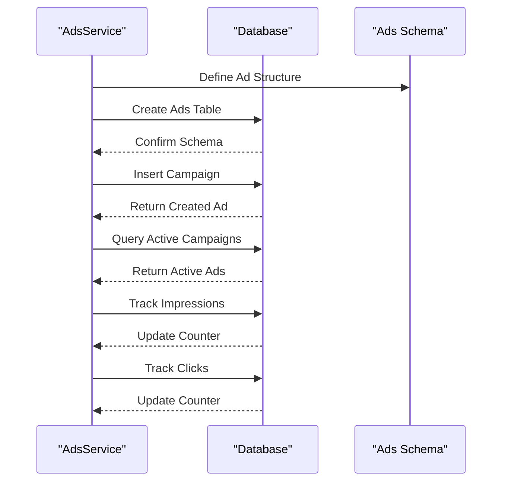
```mermaid
sequenceDiagram
participant Service as "AdsService"
participant DB as "Database"
participant Schema as "Ads Schema"
Service->>Schema : Define Ad Structure
Service->>DB : Create Ads Table
DB-->>Service : Confirm Schema
Service->>DB : Insert Campaign
DB-->>Service : Return Created Ad
Service->>DB : Query Active Campaigns
DB-->>Service : Return Active Ads
Service->>DB : Track Impressions
DB-->>Service : Update Counter
Service->>DB : Track Clicks
DB-->>Service : Update Counter
```

**Diagram sources**
- [ads.ts](file://src/services/ads.ts#L1-L329)
- [schema.ts](file://src/db/schema.ts#L194-L210)
- [0010_ads_table.sql](file://drizzle/0010_ads_table.sql#L1-L21)

#### Real-Time Preview Components
The advertising system includes sophisticated preview components:

##### AdBanner Component
- **Gradient Background**: Modern gradient design with overlay effects.
- **Image Integration**: Full-width image backgrounds with opacity effects.
- **Call-to-Action**: Prominent CTA buttons with hover effects.
- **Localization**: Proper text sizing and spacing for different screen sizes.

##### AdSpotSmall Component
- **Card Layout**: Compact card design with overlay text.
- **Image Scaling**: Smooth scaling effects on hover.
- **Text Overlay**: Centered text with contrasting background.
- **Button Styling**: Prominent call-to-action buttons.

##### NativeAdBlock Component
- **Sponsored Label**: Clear "Sponsored" indicators.
- **Model Integration**: Integration with model cards and promotional styling.
- **Grid Layout**: Responsive grid for multiple model displays.
- **Premium Overlay**: Visual distinction for sponsored content.

##### PostCard Integration
- **Diamond Style**: Integration with content feed styling.
- **Promotional Text**: "Official Partner" and promotional captions.
- **Image Integration**: Full-width promotional imagery.
- **Content Overlay**: Promotional content overlays.

**Section sources**
- [Ads.tsx](file://src/pages/admin/Ads.tsx#L1-L131)
- [AdsCreate.tsx](file://src/pages/admin/AdsCreate.tsx#L1-L569)
- [AdTable.tsx](file://src/components/organisms/AdTable.tsx#L1-L119)
- [AdBanner.tsx](file://src/components/molecules/AdBanner.tsx#L1-L36)
- [AdSpotSmall.tsx](file://src/components/molecules/AdSpotSmall.tsx#L1-L32)
- [NativeAdBlock.tsx](file://src/components/molecules/NativeAdBlock.tsx#L1-L29)
- [PostCard.tsx](file://src/components/organisms/PostCard.tsx#L1-L162)
- [ads.ts](file://src/services/ads.ts#L1-L329)
- [schema.ts](file://src/db/schema.ts#L194-L210)
- [0010_ads_table.sql](file://drizzle/0010_ads_table.sql#L1-L21)

## Order Bump Management System

**NEW** The administrative interfaces now include comprehensive order bump management capabilities through the enhanced Plans.tsx component, providing sophisticated upsell product administration with full CRUD operations, sorting controls, and status management.

### Enhanced Plans.tsx Component Architecture
The Plans.tsx component has been significantly expanded to include comprehensive order bump administration:

#### Order Bump Data Model
The system manages order bump entities with the following structure:
- **id**: Unique identifier for each order bump
- **name**: Display name for the upsell product
- **description**: Optional description shown in checkout
- **price**: Price in cents for proper currency handling
- **isActive**: Boolean flag for product availability
- **imageUrl**: Optional image URL for visual representation
- **displayOrder**: Integer for ordering in checkout interface
- **createdAt**: Timestamp for record creation

#### Comprehensive CRUD Operations
The order bump management system provides full CRUD functionality:

**Create Operation**
- Modal-based form with validation for required fields
- Price conversion from decimal to cents for database storage
- Image URL validation and optional field handling
- Default activation status and display order configuration

**Read Operations**
- Public API endpoint for active order bumps retrieval
- Admin-only endpoint for complete order bump listing
- Database query optimization with sorting by display order and ID

**Update Operations**
- Individual field updates with selective data modification
- Toggle operation for quick activation/deactivation
- Display order management for checkout positioning

**Delete Operations**
- Confirmation-based deletion with user verification
- Cascade handling for dependent checkout records

#### Sorting and Status Controls
The system includes sophisticated sorting and status management:

**Display Ordering**
- Numeric displayOrder field for precise checkout positioning
- Sorting by displayOrder ascending, then by ID for consistency
- Visual indicators showing current order position

**Status Management**
- isActive boolean flag controlling product visibility
- Toggle operations for immediate status changes
- Visual status badges (Active/Inactive) with color coding

#### Modal-Based User Interface
The order bump management uses a sophisticated modal interface:

**Create/Edit Modal**
- Comprehensive form with validation and error handling
- Real-time price formatting (R$ 0,00 format)
- Image URL preview and optional field handling
- Loading states and success/error feedback

**Action Buttons**
- Toggle button for activation status with smooth transitions
- Edit button for modal-based editing
- Delete button with confirmation dialog
- Visual feedback for all operations

#### JavaScript Integration and Validation
The system includes robust client-side validation and user experience features:

**Form Validation**
- Required field validation (name, price)
- Price format validation (decimal to cents conversion)
- URL validation for image fields
- Real-time error feedback and user guidance

**Loading States**
- Button state management during API operations
- Loading spinners for long-running operations
- Disabled states to prevent duplicate submissions

**Error Handling**
- Network error detection and user feedback
- Validation error display and recovery
- Graceful degradation for failed operations

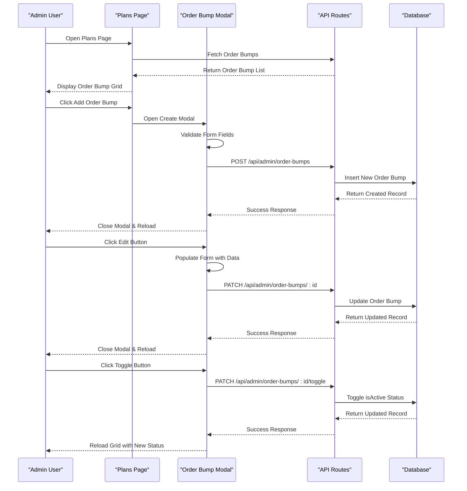
```mermaid
sequenceDiagram
participant Admin as "Admin User"
participant Plans as "Plans Page"
participant Modal as "Order Bump Modal"
participant API as "API Routes"
participant DB as "Database"
Admin->>Plans : Open Plans Page
Plans->>API : Fetch Order Bumps
API-->>Plans : Return Order Bump List
Plans-->>Admin : Display Order Bump Grid
Admin->>Plans : Click Add Order Bump
Plans->>Modal : Open Create Modal
Modal->>Modal : Validate Form Fields
Modal->>API : POST /api/admin/order-bumps
API->>DB : Insert New Order Bump
DB-->>API : Return Created Record
API-->>Modal : Success Response
Modal-->>Admin : Close Modal & Reload
Admin->>Modal : Click Edit Button
Modal->>Modal : Populate Form with Data
Modal->>API : PATCH /api/admin/order-bumps/ : id
API->>DB : Update Order Bump
DB-->>API : Return Updated Record
API-->>Modal : Success Response
Modal-->>Admin : Close Modal & Reload
Admin->>Modal : Click Toggle Button
Modal->>API : PATCH /api/admin/order-bumps/ : id/toggle
API->>DB : Toggle isActive Status
DB-->>API : Return Updated Record
API-->>Modal : Success Response
Modal-->>Admin : Reload Grid with New Status
```

**Diagram sources**
- [Plans.tsx](file://src/pages/admin/Plans.tsx#L137-L492)
- [api.tsx](file://src/routes/api.tsx#L690-L858)

#### Database Schema Integration
The order bump system integrates with the following database tables:

**Order Bumps Table**
- **id**: Primary key with auto-increment
- **name**: Text field for product name
- **description**: Optional text description
- **price**: Integer field storing cents
- **isActive**: Boolean with default true
- **imageUrl**: Optional URL for product image
- **displayOrder**: Integer for checkout ordering
- **createdAt**: Timestamp with default now()

**Checkouts Table Enhancement**
- **orderBumpIds**: JSON field for storing selected order bump IDs
- Enables checkout processing with multiple upsell selections

**Query Optimization**
- Indexing on isActive for fast active product retrieval
- Composite sorting on displayOrder and ID for consistent ordering
- Efficient filtering for public checkout display

#### Checkout Integration
The order bump system seamlessly integrates with the checkout process:

**Public Order Bump Retrieval**
- API endpoint returns only active order bumps
- Sorted by displayOrder and ID for consistent checkout experience
- Price formatting and image handling for frontend display

**Checkout Processing**
- Selected order bump IDs stored in checkout record
- Price calculation includes base plan plus selected upsells
- Order bump summary displayed in checkout interface

**JavaScript Integration**
- Client-side selection with visual feedback
- Real-time price updates based on selections
- Hidden input field for form submission

**Section sources**
- [Plans.tsx](file://src/pages/admin/Plans.tsx#L1-L492)
- [api.tsx](file://src/routes/api.tsx#L690-L858)
- [schema.ts](file://src/db/schema.ts#L132-L141)
- [Checkout.tsx](file://src/pages/Checkout.tsx#L32-L98)
- [checkout-core.js](file://static/js/checkout-core.js#L191-L220)

## Client Management System

**NEW** The administrative interfaces now include a comprehensive client management system through the dedicated Clients page, providing user oversight and subscription management capabilities with a major component architecture refactoring.

### Clients Page Overview
The Clients page serves as the central hub for managing all platform users and their subscription status:

#### Integrated Component Architecture
- **ClientStatsSection**: Displays three key statistical cards (total users, active subscribers, inactive subscribers) in a responsive grid layout with proper localization.
- **ClientSearchForm**: Provides real-time search functionality for filtering users by name or email.
- **ClientTable**: Enhanced table component with improved dark theme styling, better column structure, and integrated pagination controls.
- **TransactionHistoryModal**: Sophisticated modal component with dark theme styling, glass morphism effects, and smooth entrance/exit animations.

#### Comprehensive User Management
- **User Listing**: Displays all registered users with essential information (ID, name, email, last subscription end date)
- **Subscription Status Tracking**: Real-time display of active/inactive subscription states with color-coded badges
- **Search Functionality**: Real-time search by username or email address with form-based filtering
- **Pagination Support**: Efficient handling of large user datasets with configurable limits
- **Transaction History Integration**: **NEW** Enhanced with Histórico (History) button for each user entry

#### Advanced Filtering and Search
- **Real-time Search**: Instant filtering of users based on name or email input
- **Form-based Filtering**: Server-side query processing for efficient database operations
- **URL Parameter Support**: Maintains search state across page navigation

#### Enhanced User Interface Features
- **Responsive Design**: Adapts to mobile and desktop screen sizes
- **Visual Status Indicators**: Green badges for active subscriptions, red for inactive
- **Formatted Dates**: Localized date display in Brazilian Portuguese format
- **Empty State Handling**: Friendly message when no users match search criteria
- **Pagination Controls**: Intuitive navigation for large user datasets
- **Transaction History Button**: **NEW** Histórico button in the Ações column for each client entry

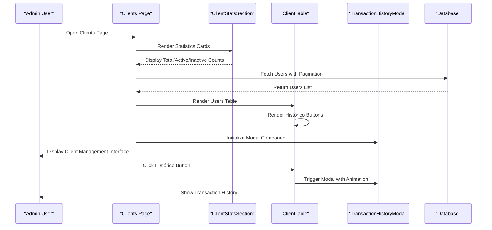
```mermaid
sequenceDiagram
participant Admin as "Admin User"
participant Clients as "Clients Page"
participant Stats as "ClientStatsSection"
participant Table as "ClientTable"
participant Modal as "TransactionHistoryModal"
participant DB as "Database"
Admin->>Clients : Open Clients Page
Clients->>Stats : Render Statistics Cards
Stats-->>Clients : Display Total/Active/Inactive Counts
Clients->>DB : Fetch Users with Pagination
DB-->>Clients : Return Users List
Clients->>Table : Render Users Table
Table->>Table : Render Histórico Buttons
Clients->>Modal : Initialize Modal Component
Clients-->>Admin : Display Client Management Interface
Admin->>Table : Click Histórico Button
Table->>Modal : Trigger Modal with Animation
Modal-->>Admin : Show Transaction History
```

**Diagram sources**
- [Clients.tsx](file://src/pages/admin/Clients.tsx#L25-L39)
- [ClientStatsSection.tsx](file://src/components/organisms/ClientStatsSection.tsx#L10-L20)
- [ClientTable.tsx](file://src/components/organisms/ClientTable.tsx#L48-L83)
- [TransactionHistoryModal.tsx](file://src/components/organisms/TransactionHistoryModal.tsx#L4-L33)

#### Database Integration
The client management system integrates with the following database tables:

**Users Table Integration**
- **subscriptionStatus Field**: Integer field (0/1) indicating subscription active status
- **User Information**: Name, email, and registration timestamps
- **Role Management**: Admin/user role assignments for access control

**Subscriptions Table Integration**
- **Latest Subscription Tracking**: Uses subquery to find most recent subscription end date per user
- **Subscription Status**: Active/expired/pending status tracking
- **Plan Associations**: Links subscriptions to pricing plans

**Statistical Queries**
The system uses advanced SQL aggregation for efficient statistics:
- **Total User Count**: Simple COUNT aggregation across users table
- **Active Subscriber Count**: Filtered COUNT with subscription_status = 1
- **Inactive Subscriber Count**: Filtered COUNT with subscription_status = 0 or NULL

#### User Interface Features
- **Responsive Design**: Adapts to mobile and desktop screen sizes
- **Visual Status Indicators**: Green badges for active subscriptions, red for inactive
- **Formatted Dates**: Localized date display in Brazilian Portuguese format
- **Empty State Handling**: Friendly message when no users match search criteria
- **Pagination Controls**: Intuitive navigation for large user datasets

**Section sources**
- [Clients.tsx](file://src/pages/admin/Clients.tsx#L1-L40)
- [ClientStatsSection.tsx](file://src/components/organisms/ClientStatsSection.tsx#L1-L21)
- [ClientTable.tsx](file://src/components/organisms/ClientTable.tsx#L1-L84)
- [admin.tsx](file://src/routes/admin.tsx#L388-L459)
- [schema.ts](file://src/db/schema.ts#L6-L14)

## Transaction Management System

**NEW** The administrative interfaces now include comprehensive transaction management capabilities through the TransactionsTable component, providing financial oversight and reporting functionality.

### TransactionsTable Component
The TransactionsTable component serves as the central hub for monitoring all payment activities across different gateways:

#### Dual-Gateway Support
- **JunglePay Mode**: Displays checkout transactions with customer details, payment methods, and order bump indicators
- **Dias Marketplace Mode**: Shows subscription records with user information, plan details, and billing cycles

#### Advanced Filtering and Search
- Real-time search by customer name, email, or document
- Status-based filtering (pending, paid, failed, active, expired)
- Dynamic filter options based on active gateway type

#### Comprehensive Data Display
- Customer information with formatted Brazilian phone numbers and CPF documents
- Payment method visualization with custom icons (PIX vs Credit Card)
- Status badges with color-coded indicators
- Currency formatting in Brazilian Real (BRL)
- Pagination support for large transaction volumes

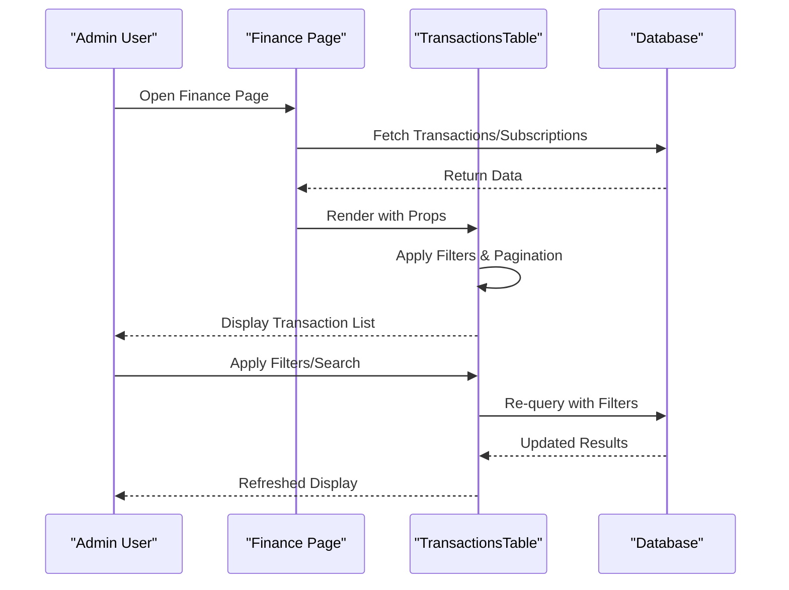
```mermaid
sequenceDiagram
participant Admin as "Admin User"
participant Finance as "Finance Page"
participant Table as "TransactionsTable"
participant DB as "Database"
Admin->>Finance : Open Finance Page
Finance->>DB : Fetch Transactions/Subscriptions
DB-->>Finance : Return Data
Finance->>Table : Render with Props
Table->>Table : Apply Filters & Pagination
Table-->>Admin : Display Transaction List
Admin->>Table : Apply Filters/Search
Table->>DB : Re-query with Filters
DB-->>Table : Updated Results
Table-->>Admin : Refreshed Display
```

**Diagram sources**
- [TransactionsTable.tsx](file://src/components/organisms/TransactionsTable.tsx#L124-L319)
- [Finance.tsx](file://src/pages/admin/Finance.tsx#L224-L337)
- [admin.tsx](file://src/routes/admin.tsx#L200-L338)

#### Payment Gateway Integration
The system seamlessly handles two distinct payment processing modes:

**JunglePay Integration**
- Direct checkout transactions with customer information capture
- Order bump tracking for upsell opportunities
- Real-time status updates through webhook processing
- PIX and credit card payment method differentiation

**Dias Marketplace Integration**
- External marketplace subscription management
- Automated webhook processing for payment success/failure
- User subscription lifecycle management
- Plan-based billing cycle tracking

#### Database Schema Integration
The transaction management system integrates with the following database tables:

- **Checkouts**: Internal checkout transactions with customer details and payment methods
- **Subscriptions**: External marketplace subscriptions with user associations
- **Users**: Customer profiles linked to transactions and subscriptions
- **Plans**: Pricing tiers associated with transactions and subscriptions

**Section sources**
- [TransactionsTable.tsx](file://src/components/organisms/TransactionsTable.tsx#L1-L319)
- [Finance.tsx](file://src/pages/admin/Finance.tsx#L1-L151)
- [admin.tsx](file://src/routes/admin.tsx#L200-L338)
- [schema.ts](file://src/db/schema.ts#L114-L130)
- [schema.ts](file://src/db/schema.ts#L38-L47)
- [schema.ts](file://src/db/schema.ts#L6-L14)
- [schema.ts](file://src/db/schema.ts#L16-L27)
- [api.tsx](file://src/routes/api.tsx#L454-L558)

## Payment Gateway Configuration and Webhook Integration

**UPDATED** The admin Finance interface now includes comprehensive postback URL configuration capabilities for payment gateway webhook delivery, enabling automated payment notification handling.

### Enhanced Finance Interface
The Finance page has been enhanced with advanced payment gateway configuration options:

#### Postback URL Configuration
- **JunglePay Postback URL Field**: Dedicated input field for webhook delivery URL
- **Real-time Validation**: URL format validation for proper webhook endpoint configuration
- **Documentation Support**: Inline help text explaining webhook purpose and requirements
- **Configuration Persistence**: Automatic saving of postback URL to database

#### Database Schema Enhancement
The payment_gateways table now includes a postback_url column:

```sql
ALTER TABLE "payment_gateways" ADD COLUMN "postback_url" text;
```

#### Webhook Delivery System
The system supports automated payment notification delivery through webhooks:

**JunglePay Webhook Integration**
- **Webhook Endpoint**: `/api/webhook/junglepay` for payment status notifications
- **Postback URL Usage**: JunglePay transactions utilize configured postback URL for notifications
- **Automatic Delivery**: Payment gateway automatically sends notifications to configured endpoint
- **Status Synchronization**: Real-time status updates for payment processing

**Dias Marketplace Webhook Integration**
- **External Webhook Handling**: Payment success/failure notifications from external marketplace
- **Automated Subscription Management**: Automatic subscription activation and deactivation
- **User Status Updates**: Automatic user subscription status updates

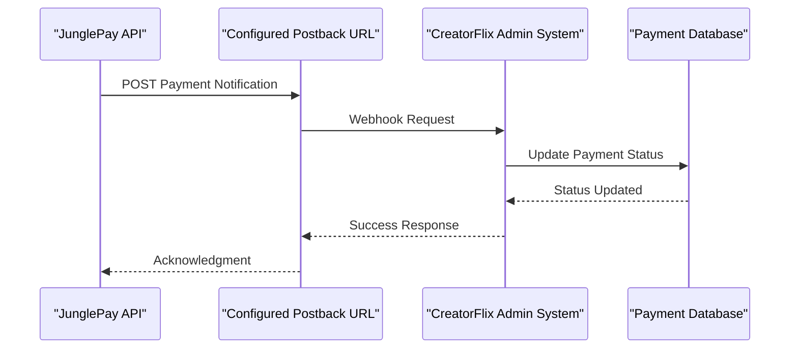
```mermaid
sequenceDiagram
participant JunglePay as "JunglePay API"
participant PostbackURL as "Configured Postback URL"
participant AdminSystem as "CreatorFlix Admin System"
participant Database as "Payment Database"
JunglePay->>PostbackURL : POST Payment Notification
PostbackURL->>AdminSystem : Webhook Request
AdminSystem->>Database : Update Payment Status
Database-->>AdminSystem : Status Updated
AdminSystem-->>PostbackURL : Success Response
PostbackURL-->>JunglePay : Acknowledgment
```

**Diagram sources**
- [Finance.tsx](file://src/pages/admin/Finance.tsx#L120-L129)
- [api.tsx](file://src/routes/api.tsx#L221-L221)
- [junglepay.ts](file://src/services/junglepay.ts#L239-L240)

#### Migration and Configuration
The system includes automatic migration support for the new postback_url column:

**Migration Script**
- **Automatic Column Addition**: Migration script safely adds postback_url column if not exists
- **Backward Compatibility**: Graceful handling of existing payment gateway configurations
- **Schema Evolution**: Supports future payment gateway configuration enhancements

**Configuration Workflow**
1. **Gateway Selection**: Choose active payment gateway (JunglePay or Dias Marketplace)
2. **Key Configuration**: Enter public/private keys for selected gateway
3. **Postback URL Setup**: Configure webhook delivery URL for payment notifications
4. **Validation**: Test webhook endpoint accessibility and configuration
5. **Activation**: Enable gateway for live payment processing

#### Payment Gateway Service Integration
The JunglePay service utilizes the configured postback URL for transaction processing:

**Service Configuration**
- **Gateway Retrieval**: Service retrieves active gateway configuration from database
- **Postback URL Usage**: Automatically includes postback URL in transaction requests
- **Error Handling**: Graceful fallback if postback URL is not configured
- **Security Validation**: Validates postback URL format and accessibility

**Section sources**
- [Finance.tsx](file://src/pages/admin/Finance.tsx#L1-L151)
- [schema.ts](file://src/db/schema.ts#L29-L36)
- [api.tsx](file://src/routes/api.tsx#L221-L221)
- [migrate-postback.ts](file://scripts/migrate-postback.ts#L1-L22)
- [junglepay.ts](file://src/services/junglepay.ts#L239-L240)
- [junglepay-documentation.md](file://junglepay-documentation.md#L151-L280)

## Transaction History Modal Feature

**NEW** The administrative interfaces now include a sophisticated transaction history modal feature that displays complete financial transaction records for individual users via HTMX-powered modal system with enhanced animations and dark theme styling.

### Modal System Architecture
The transaction history modal system provides a seamless user experience for viewing detailed financial records:

#### HTMX-Powered Dynamic Loading
- **AJAX Integration**: Uses HTMX attributes (hx-get, hx-target, hx-indicator) for seamless content loading
- **Dynamic Content Loading**: Loads transaction history without full page refresh
- **Loading States**: Visual feedback through skeleton loaders and loading animations
- **Modal Animation**: Smooth entrance/exit animations with backdrop blur effects and scale transformations

#### Enhanced Modal Interface Design
- **Backdrop Effects**: Semi-transparent black backdrop with blur effect for focus enhancement
- **Glass Morphism**: Dark-themed modal with glass-like transparency and border effects
- **Neon Accents**: Purple neon border accents for visual appeal
- **Responsive Sizing**: Maximum width constraints with responsive height scaling
- **Dark Theme Styling**: Deep dark background (#121212) with subtle borders and glow effects

#### Transaction History Display
- **Unified Timeline**: Combines checkout and subscription transactions in chronological order
- **Status Visualization**: Color-coded status badges (green for paid/active, yellow for pending, red for failed)
- **Currency Formatting**: Proper Brazilian Real (BRL) formatting with localized display
- **Method Differentiation**: Clear distinction between payment methods (PIX vs Credit Card)
- **Date Localization**: Formatted dates in Brazilian Portuguese locale

#### Enhanced Modal Scripting
The modal system includes sophisticated JavaScript for smooth animations and user experience:

**Animation Functions**
- **Open Animation**: Fade-in with scale-up from 95% to 100% with 300ms duration
- **Close Animation**: Scale-down to 95% then fade-out with backdrop blur removal
- **Body Overflow Control**: Prevents scrolling when modal is open
- **Event Handling**: Proper cleanup of event listeners and state management

**Skeleton Loading**
- **Pulse Animation**: Animated skeleton loaders with gradient shimmer effects
- **Responsive Grid**: Three transaction cards in skeleton state with varying heights
- **Smooth Transition**: Immediate skeleton loading then content replacement

#### Database Integration and Query Optimization
The modal system integrates with the database to provide comprehensive transaction history:

**Dual-Source Transaction Retrieval**
- **Checkout Transactions**: Retrieves JunglePay checkout records with payment methods and amounts
- **Subscription Transactions**: Retrieves Dias Marketplace subscription records with plan associations
- **Unified Sorting**: Combines and sorts transactions chronologically by creation date

**Query Structure**
- **Parallel Execution**: Uses Promise.all for concurrent checkout and subscription queries
- **Type Casting**: Explicitly casts transaction types for proper sorting and display
- **Amount Normalization**: Converts cent-based amounts to real currency values
- **Status Mapping**: Maps database statuses to user-friendly display labels

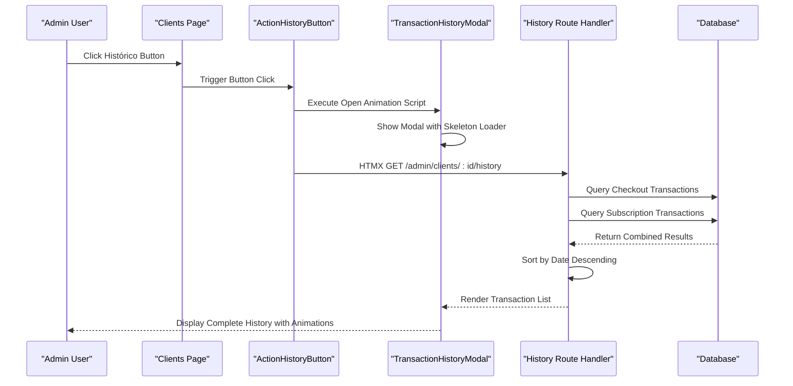
```mermaid
sequenceDiagram
participant Admin as "Admin User"
participant Clients as "Clients Page"
participant Button as "ActionHistoryButton"
participant Modal as "TransactionHistoryModal"
participant Route as "History Route Handler"
participant DB as "Database"
Admin->>Clients : Click Histórico Button
Clients->>Button : Trigger Button Click
Button->>Modal : Execute Open Animation Script
Modal->>Modal : Show Modal with Skeleton Loader
Button->>Route : HTMX GET /admin/clients/ : id/history
Route->>DB : Query Checkout Transactions
Route->>DB : Query Subscription Transactions
DB-->>Route : Return Combined Results
Route->>Route : Sort by Date Descending
Route-->>Modal : Render Transaction List
Modal-->>Admin : Display Complete History with Animations
```

**Diagram sources**
- [Clients.tsx](file://src/pages/admin/Clients.tsx#L36)
- [ActionHistoryButton.tsx](file://src/components/molecules/ActionHistoryButton.tsx#L3-L50)
- [TransactionHistoryModal.tsx](file://src/components/organisms/TransactionHistoryModal.tsx#L4-L33)
- [admin.tsx](file://src/routes/admin.tsx#L461-L550)

#### User Experience Features
- **Smooth Animations**: CSS transitions for modal entrance/exit with scale transformations
- **Backdrop Interaction**: Clicking backdrop closes modal gracefully
- **Keyboard Support**: Escape key functionality for modal dismissal
- **Overflow Control**: Body scroll locking during modal display
- **Responsive Design**: Adapts to various screen sizes with max-height constraints
- **Accessibility**: Proper ARIA attributes and keyboard navigation support

#### Error Handling and Edge Cases
- **User Not Found**: Graceful handling with informative error message
- **No Transactions**: Friendly empty state with icon and explanation
- **Loading States**: Visual feedback during data fetching
- **Modal Cleanup**: Proper cleanup of event listeners and body styles

**Section sources**
- [Clients.tsx](file://src/pages/admin/Clients.tsx#L36)
- [ActionHistoryButton.tsx](file://src/components/molecules/ActionHistoryButton.tsx#L1-L62)
- [TransactionHistoryModal.tsx](file://src/components/organisms/TransactionHistoryModal.tsx#L1-L34)
- [admin.tsx](file://src/routes/admin.tsx#L461-L550)

## Component Architecture Refactoring

**NEW** The Clients page has undergone a major component architecture refactoring that improves modularity, maintainability, and user experience through better separation of concerns and enhanced styling.

### New Component Structure
The refactored architecture introduces a clean separation of concerns with specialized components:

#### ClientStatsSection Component
- **Purpose**: Displays client statistics cards with three key metrics
- **Responsibility**: Pure presentation component for statistical overview
- **Features**: Responsive grid layout, proper localization, and visual indicators

#### ClientTable Component
- **Purpose**: Renders user data in an enhanced table format
- **Responsibility**: Data presentation with improved dark theme styling
- **Features**: Better column structure, pagination integration, and status badges

#### ActionHistoryButton Component
- **Purpose**: Provides HTMX-powered transaction history access
- **Responsibility**: Modal trigger with smooth animations and state management
- **Features**: HTMX integration, modal scripting, and skeleton loading

#### TransactionHistoryModal Component
- **Purpose**: Displays detailed transaction history in a modal interface
- **Responsibility**: Modal presentation with dark theme styling and animations
- **Features**: Glass morphism effects, smooth transitions, and responsive design

#### Enhanced ClientTable Implementation
The ClientTable component has been significantly improved:

**Improved Table Structure**
- **Better Column Headers**: More descriptive headers with proper uppercase formatting
- **Enhanced Cell Styling**: Improved typography with monospace font for IDs
- **Status Badges**: Color-coded badges for subscription status with hover effects
- **Action Buttons**: Integrated Histórico buttons with proper spacing

**Dark Theme Integration**
- **Background Colors**: Dark background with subtle gradients
- **Border Effects**: Subtle borders with white/5 opacity
- **Hover States**: Smooth hover transitions with primary color accents
- **Typography**: Proper contrast ratios with white text and gray accents

**Pagination Integration**
- **Conditional Rendering**: Only shows pagination when totalPages > 1
- **Base URL Support**: Configurable base URL for pagination links
- **Responsive Design**: Adapts to different screen sizes

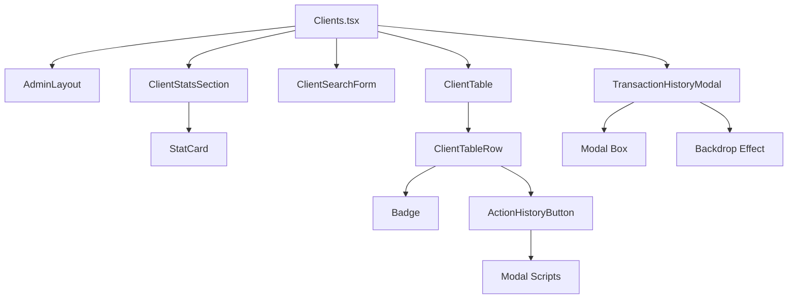
```mermaid
flowchart TD
ClientsPage["Clients.tsx"] --> Layout["AdminLayout"]
ClientsPage --> Stats["ClientStatsSection"]
ClientsPage --> Search["ClientSearchForm"]
ClientsPage --> Table["ClientTable"]
ClientsPage --> Modal["TransactionHistoryModal"]
Stats --> StatCard["StatCard"]
Table --> TableRow["ClientTableRow"]
TableRow --> Badge["Badge"]
TableRow --> ActionBtn["ActionHistoryButton"]
ActionBtn --> ModalScript["Modal Scripts"]
Modal --> ModalBox["Modal Box"]
Modal --> Backdrop["Backdrop Effect"]
```

**Diagram sources**
- [Clients.tsx](file://src/pages/admin/Clients.tsx#L25-L39)
- [ClientStatsSection.tsx](file://src/components/organisms/ClientStatsSection.tsx#L10-L20)
- [ClientTable.tsx](file://src/components/organisms/ClientTable.tsx#L23-L46)
- [ActionHistoryButton.tsx](file://src/components/molecules/ActionHistoryButton.tsx#L3-L50)
- [TransactionHistoryModal.tsx](file://src/components/organisms/TransactionHistoryModal.tsx#L4-L33)

#### Component Communication Patterns
The refactored architecture uses clear communication patterns:

**Props-Driven Architecture**
- **Type Safety**: Strongly typed props for all components
- **Data Flow**: Unidirectional data flow from parent to children
- **Interface Definitions**: Clear interface contracts for component interactions

**Event Handling**
- **Modal Scripts**: Centralized modal animation functions
- **HTMX Integration**: Seamless AJAX integration for dynamic content
- **State Management**: Minimal state management with DOM manipulation

**Styling Architecture**
- **Tailwind Classes**: Consistent utility-first styling approach
- **Theme Integration**: Dark theme with glass morphism effects
- **Responsive Design**: Mobile-first responsive layout system

**Section sources**
- [Clients.tsx](file://src/pages/admin/Clients.tsx#L1-L40)
- [ClientStatsSection.tsx](file://src/components/organisms/ClientStatsSection.tsx#L1-L21)
- [ClientTable.tsx](file://src/components/organisms/ClientTable.tsx#L1-L84)
- [ActionHistoryButton.tsx](file://src/components/molecules/ActionHistoryButton.tsx#L1-L62)
- [TransactionHistoryModal.tsx](file://src/components/organisms/TransactionHistoryModal.tsx#L1-L34)

## Dependency Analysis
Admin components depend on:
- AdminLayout and AdminSidebar for consistent navigation and shell.
- Domain-specific organisms and molecules (e.g., ModelTable, AdTable, StatCard, **TransactionsTable**, **Clients**, **OrderBump**, **AdBanner**, **AdSpotSmall**, **NativeAdBlock**, **PostCard**).
- **NEW** Specialized advertising management components (Ads listing, AdsCreate form, AdTable, real-time preview system).
- **NEW** Enhanced Plans.tsx component with comprehensive order bump administration capabilities.
- Services for backend orchestration (AdminActivationService, WhitelabelDbService, **AdsService**).
- Drizzle ORM for database reads/writes.
- **NEW** API routes for advertising CRUD operations and real-time preview updates.
- **NEW** Payment gateway configuration services for webhook delivery management.
- **NEW** Client management services for user administration and subscription tracking.
- **NEW** HTMX-powered modal system for dynamic content loading and user interaction.
- **NEW** Enhanced component architecture with improved modularity and separation of concerns.

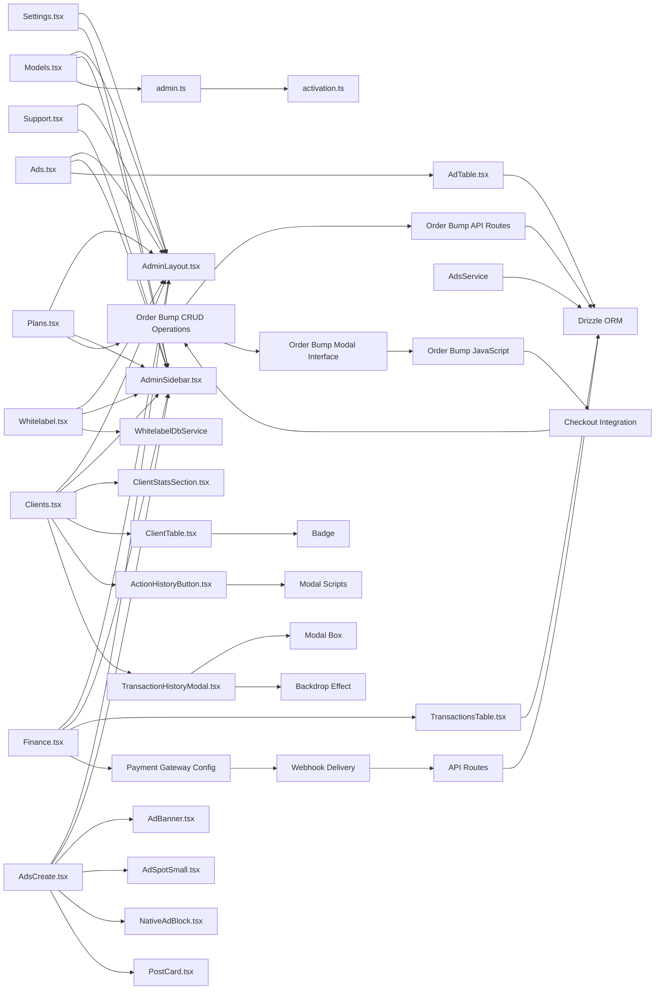
```mermaid
graph LR
ModelsPage["Models.tsx"] --> AdminLayout["AdminLayout.tsx"]
AdsPage["Ads.tsx"] --> AdminLayout
AdsCreatePage["AdsCreate.tsx"] --> AdminLayout
PlansPage["Plans.tsx"] --> AdminLayout
FinancePage["Finance.tsx"] --> AdminLayout
SettingsPage["Settings.tsx"] --> AdminLayout
SupportPage["Support.tsx"] --> AdminLayout
WLPage["Whitelabel.tsx"] --> AdminLayout
ClientsPage["Clients.tsx"] --> AdminLayout
ModelsPage --> AdminSidebar["AdminSidebar.tsx"]
AdsPage --> AdminSidebar
AdsCreatePage --> AdminSidebar
PlansPage --> AdminSidebar
FinancePage --> AdminSidebar
SettingsPage --> AdminSidebar
SupportPage --> AdminSidebar
WLPage --> AdminSidebar
ClientsPage --> AdminSidebar
ClientsPage --> ClientStats["ClientStatsSection.tsx"]
ClientsPage --> ClientTable["ClientTable.tsx"]
ClientsPage --> ActionBtn["ActionHistoryButton.tsx"]
ClientsPage --> Modal["TransactionHistoryModal.tsx"]
ClientTable --> Badge["Badge"]
ActionBtn --> ModalScripts["Modal Scripts"]
Modal --> ModalBox["Modal Box"]
Modal --> Backdrop["Backdrop Effect"]
ModelsPage --> AdminService["admin.ts"]
AdminService --> Activation["activation.ts"]
WLPage --> WLService["WhitelabelDbService"]
FinancePage --> TransactionsTable["TransactionsTable.tsx"]
TransactionsTable --> DB["Drizzle ORM"]
AdsPage --> AdTable["AdTable.tsx"]
AdsCreatePage --> AdBanner["AdBanner.tsx"]
AdsCreatePage --> AdSpotSmall["AdSpotSmall.tsx"]
AdsCreatePage --> NativeAdBlock["NativeAdBlock.tsx"]
AdsCreatePage --> PostCard["PostCard.tsx"]
AdTable --> DB
AdsService["AdsService"] --> DB
API["API Routes"] --> DB
FinancePage --> PGConfig["Payment Gateway Config"]
PGConfig --> Webhook["Webhook Delivery"]
Webhook --> API
PlansPage --> OrderBumpOps["Order Bump CRUD Operations"]
OrderBumpOps --> OrderBumpAPI["Order Bump API Routes"]
OrderBumpAPI --> DB
OrderBumpOps --> OrderBumpModal["Order Bump Modal Interface"]
OrderBumpModal --> OrderBumpJS["Order Bump JavaScript"]
OrderBumpJS --> Checkout["Checkout Integration"]
Checkout --> OrderBumpOps
```

**Diagram sources**
- [Models.tsx](file://src/pages/admin/Models.tsx#L1-L35)
- [Ads.tsx](file://src/pages/admin/Ads.tsx#L1-L131)
- [AdsCreate.tsx](file://src/pages/admin/AdsCreate.tsx#L1-L569)
- [AdTable.tsx](file://src/components/organisms/AdTable.tsx#L1-L119)
- [AdBanner.tsx](file://src/components/molecules/AdBanner.tsx#L1-L36)
- [AdSpotSmall.tsx](file://src/components/molecules/AdSpotSmall.tsx#L1-L32)
- [NativeAdBlock.tsx](file://src/components/molecules/NativeAdBlock.tsx#L1-L29)
- [PostCard.tsx](file://src/components/organisms/PostCard.tsx#L1-L162)
- [Plans.tsx](file://src/pages/admin/Plans.tsx#L1-L492)
- [Finance.tsx](file://src/pages/admin/Finance.tsx#L1-L151)
- [Settings.tsx](file://src/pages/admin/Settings.tsx#L1-L51)
- [Support.tsx](file://src/pages/admin/Support.tsx#L1-L88)
- [Whitelabel.tsx](file://src/pages/admin/Whitelabel.tsx#L1-L30)
- [Clients.tsx](file://src/pages/admin/Clients.tsx#L1-L40)
- [ClientStatsSection.tsx](file://src/components/organisms/ClientStatsSection.tsx#L1-L21)
- [ClientTable.tsx](file://src/components/organisms/ClientTable.tsx#L1-L84)
- [ActionHistoryButton.tsx](file://src/components/molecules/ActionHistoryButton.tsx#L1-L62)
- [TransactionHistoryModal.tsx](file://src/components/organisms/TransactionHistoryModal.tsx#L1-L34)
- [AdminLayout.tsx](file://src/components/templates/AdminLayout.tsx#L1-L64)
- [AdminSidebar.tsx](file://src/components/organisms/AdminSidebar.tsx#L1-L99)
- [admin.ts](file://src/services/admin.ts#L1-L5)
- [activation.ts](file://src/services/admin/activation.ts#L1-L86)
- [ads.ts](file://src/services/ads.ts#L1-L329)
- [TransactionsTable.tsx](file://src/components/organisms/TransactionsTable.tsx#L1-L319)
- [api.tsx](file://src/routes/api.tsx#L690-L858)
- [Checkout.tsx](file://src/pages/Checkout.tsx#L32-L98)

**Section sources**
- [Models.tsx](file://src/pages/admin/Models.tsx#L1-L35)
- [Ads.tsx](file://src/pages/admin/Ads.tsx#L1-L131)
- [AdsCreate.tsx](file://src/pages/admin/AdsCreate.tsx#L1-L569)
- [AdTable.tsx](file://src/components/organisms/AdTable.tsx#L1-L119)
- [AdBanner.tsx](file://src/components/molecules/AdBanner.tsx#L1-L36)
- [AdSpotSmall.tsx](file://src/components/molecules/AdSpotSmall.tsx#L1-L32)
- [NativeAdBlock.tsx](file://src/components/molecules/NativeAdBlock.tsx#L1-L29)
- [PostCard.tsx](file://src/components/organisms/PostCard.tsx#L1-L162)
- [Plans.tsx](file://src/pages/admin/Plans.tsx#L1-L492)
- [Finance.tsx](file://src/pages/admin/Finance.tsx#L1-L151)
- [Settings.tsx](file://src/pages/admin/Settings.tsx#L1-L51)
- [Support.tsx](file://src/pages/admin/Support.tsx#L1-L88)
- [Whitelabel.tsx](file://src/pages/admin/Whitelabel.tsx#L1-L30)
- [Clients.tsx](file://src/pages/admin/Clients.tsx#L1-L40)
- [ClientStatsSection.tsx](file://src/components/organisms/ClientStatsSection.tsx#L1-L21)
- [ClientTable.tsx](file://src/components/organisms/ClientTable.tsx#L1-L84)
- [ActionHistoryButton.tsx](file://src/components/molecules/ActionHistoryButton.tsx#L1-L62)
- [TransactionHistoryModal.tsx](file://src/components/organisms/TransactionHistoryModal.tsx#L1-L34)
- [AdminLayout.tsx](file://src/components/templates/AdminLayout.tsx#L1-L64)
- [AdminSidebar.tsx](file://src/components/organisms/AdminSidebar.tsx#L1-L99)
- [admin.ts](file://src/services/admin.ts#L1-L5)
- [activation.ts](file://src/services/admin/activation.ts#L1-L86)
- [ads.ts](file://src/services/ads.ts#L1-L329)
- [TransactionsTable.tsx](file://src/components/organisms/TransactionsTable.tsx#L1-L319)
- [api.tsx](file://src/routes/api.tsx#L690-L858)
- [Checkout.tsx](file://src/pages/Checkout.tsx#L32-L98)

## Performance Considerations
- Use pagination and virtualized lists for large datasets (models, ads, whitelabel entries, transactions, clients).
- Debounce search inputs to avoid excessive filtering requests.
- Batch operations for bulk moderation and activation to reduce round trips.
- Optimize chart rendering by limiting data points and using efficient DOM updates.
- **NEW** Implement lazy loading for transaction data and optimize database queries with proper indexing on status and date columns.
- **NEW** Cache payment gateway configurations to reduce database queries for webhook delivery.
- **NEW** Implement webhook delivery retry mechanisms for failed notifications.
- **NEW** Optimize client management queries with proper indexing on subscriptionStatus and user search fields.
- **NEW** Use efficient subqueries for latest subscription tracking in client management system.
- **NEW** Implement HTMX request debouncing to prevent rapid successive modal opens.
- **NEW** Optimize transaction history queries with proper indexing on user_id and created_at columns.
- **NEW** Use database connection pooling for concurrent transaction history requests.
- **NEW** Implement component-level caching for frequently accessed client data.
- **NEW** Optimize modal animations with requestAnimationFrame for smooth performance.
- **NEW** Use CSS containment for modal content to improve rendering performance.
- **NEW** Optimize order bump queries with proper indexing on isActive and displayOrder fields.
- **NEW** Implement order bump caching for checkout performance optimization.
- **NEW** Use efficient JSON serialization for order bump data transfer between frontend and backend.
- **NEW** Implement real-time preview optimization with debounced updates to prevent excessive DOM manipulation.
- **NEW** Cache ad placement validation results to reduce repeated type checking operations.
- **NEW** Use efficient CSS transforms for preview animations instead of layout-affecting properties.
- **NEW** Implement preview component memoization to avoid unnecessary re-renders.

## Troubleshooting Guide
Common issues and resolutions:
- Empty support contacts: The route initializes defaults if none exist; verify database seeding.
- Payment gateway misconfiguration: Ensure active gateway matches configured keys; check success messages after saves.
- Whitelabel sync failures: Inspect error propagation and logs; retry sync and verify bucket connectivity.
- Ads preview not updating: Confirm client-side script loads and event listeners are attached.
- **NEW** Advertising campaign creation fails: Verify type-specific field validation and placement restrictions.
- **NEW** Real-time preview not working: Check JavaScript event listeners and DOM element references.
- **NEW** Placement validation errors: Ensure ad type matches allowed placements in VALID_PLACEMENTS_BY_TYPE.
- **NEW** Campaign status toggle not working: Verify AdsService.toggleStatus operation and database updates.
- **NEW** Analytics tracking not updating: Check impression/click tracking endpoints and database increment operations.
- **NEW** Transaction table empty: Verify active gateway configuration and check webhook processing for external marketplace transactions.
- **NEW** Filter not working: Ensure proper URL encoding for search parameters and verify database query conditions.
- **NEW** Pagination issues: Check limit/offset calculations and verify total count queries for accurate page navigation.
- **NEW** Postback URL configuration errors: Verify webhook endpoint accessibility and proper URL format validation.
- **NEW** Webhook delivery failures: Check webhook endpoint logs and payment gateway configuration settings.
- **NEW** Payment notification delays: Monitor webhook delivery status and payment gateway response times.
- **NEW** Client management search not working: Verify search parameter handling and database LIKE query conditions.
- **NEW** Client statistics incorrect: Check SQL aggregation queries and subscriptionStatus field values.
- **NEW** Client table pagination issues: Verify total count queries and pagination limit/offset calculations.
- **NEW** Transaction history modal not loading: Verify HTMX attributes are properly set and modal target exists.
- **NEW** Modal animation issues: Check CSS transitions and ensure proper modal state management.
- **NEW** Transaction history empty: Verify user exists and has associated transactions in both checkouts and subscriptions tables.
- **NEW** Modal backdrop click not closing: Ensure onclick handlers are properly bound and event propagation is handled.
- **NEW** Component rendering issues: Verify component imports and ensure proper TypeScript interface implementations.
- **NEW** Client table styling problems: Check Tailwind CSS classes and ensure proper dark theme integration.
- **NEW** Modal scripting errors: Verify JavaScript function definitions and ensure proper DOM element references.
- **NEW** Order bump management not working: Verify API routes are accessible and database connections are established.
- **NEW** Order bump modal validation failing: Check form validation logic and ensure proper price formatting.
- **NEW** Order bump toggle not changing status: Verify API endpoint is reachable and database update operations succeed.
- **NEW** Order bump deletion confirmation issues: Check confirm dialog implementation and API response handling.
- **NEW** Checkout order bump integration failing: Verify order bump data is properly serialized and JavaScript integration works.
- **NEW** Order bump display order not working: Check database sorting queries and frontend display logic.
- **NEW** Order bump price calculation errors: Verify price conversion from cents to real currency and checkout integration.
- **NEW** Ad placement validation errors: Check VALID_PLACEMENTS_BY_TYPE mapping and type-specific placement restrictions.
- **NEW** Campaign analytics not displaying: Verify impression/click counter updates and CTR calculation logic.
- **NEW** Preview component not updating: Check client-side JavaScript event handling and DOM manipulation operations.

**Section sources**
- [admin.tsx](file://src/routes/admin.tsx#L343-L386)
- [Finance.tsx](file://src/pages/admin/Finance.tsx#L50-L54)
- [admin.tsx](file://src/routes/admin.tsx#L554-L592)
- [AdsCreate.tsx](file://src/pages/admin/AdsCreate.tsx#L300-L565)
- [ads.ts](file://src/services/ads.ts#L145-L173)
- [TransactionsTable.tsx](file://src/components/organisms/TransactionsTable.tsx#L152-L191)
- [admin.tsx](file://src/routes/admin.tsx#L200-L338)
- [migrate-postback.ts](file://scripts/migrate-postback.ts#L1-L22)
- [Clients.tsx](file://src/pages/admin/Clients.tsx#L388-L459)
- [ClientStatsSection.tsx](file://src/components/organisms/ClientStatsSection.tsx#L10-L20)
- [ClientTable.tsx](file://src/components/organisms/ClientTable.tsx#L23-L46)
- [ActionHistoryButton.tsx](file://src/components/molecules/ActionHistoryButton.tsx#L3-L50)
- [TransactionHistoryModal.tsx](file://src/components/organisms/TransactionHistoryModal.tsx#L4-L33)
- [admin.tsx](file://src/routes/admin.tsx#L461-L550)
- [Plans.tsx](file://src/pages/admin/Plans.tsx#L1-L492)
- [api.tsx](file://src/routes/api.tsx#L690-L858)
- [Checkout.tsx](file://src/pages/Checkout.tsx#L32-L98)

## Conclusion
The administrative interfaces provide a comprehensive, modular admin experience with consistent layout, robust navigation, and domain-specific capabilities. The system integrates model activation, advertising controls, financial configuration, whitelabel synchronization, client management, order bump administration, and system settings, supported by services and ORM. **The enhancement of the Ads.tsx, AdsCreate.tsx, and AdTable.tsx components with comprehensive advertising management capabilities represents a significant advancement in campaign administration**, providing administrators with powerful tools to create, validate, preview, and manage advertising campaigns with real-time updates and analytics tracking. **The addition of the Clients page significantly enhances user management capabilities**, providing administrators with powerful tools to monitor user activity, track subscription status, and manage client relationships through a major component architecture refactoring. **The addition of the TransactionsTable component significantly enhances financial oversight and reporting capabilities**, providing administrators with powerful tools to monitor payment activities across multiple gateways. **The enhanced Finance interface with postback URL configuration capabilities enables automated payment notification handling and improves payment processing workflows**, supporting both internal checkout systems and external marketplace integrations. **The new transaction history modal feature represents a significant advancement in user experience**, providing administrators with seamless access to detailed financial records through HTMX-powered dynamic content loading and sophisticated animations. **The enhanced Admin Clients interface with Histórico buttons and improved component architecture demonstrates thoughtful UI/UX improvements** that streamline administrative workflows and improve operational efficiency. **The major component architecture refactoring improves modularity, maintainability, and user experience** through better separation of concerns and enhanced styling. **The comprehensive order bump management system with full CRUD operations, sorting controls, and status management provides sophisticated upsell capabilities** that enhance revenue optimization and customer experience. **The real-time preview system with dynamic ad type switching and client-side updates provides administrators with immediate visual feedback** for campaign creation and management. **The comprehensive AdsService with placement validation, analytics tracking, and type-specific operations ensures robust campaign management** with proper validation and monitoring. Enhancing audit logging, approval workflows, and performance optimizations will further strengthen operational safety and scalability.