# Checkout Flow

<cite>
**Referenced Files in This Document**
- [Checkout.tsx](file://src/pages/Checkout.tsx)
- [checkout-core.js](file://static/js/checkout-core.js)
- [StepIdentification.tsx](file://src/components/organisms/StepIdentification.tsx)
- [StepPayment.tsx](file://src/components/organisms/StepPayment.tsx)
- [StepSuccess.tsx](file://src/components/organisms/StepSuccess.tsx)
- [OrderSummary.tsx](file://src/components/organisms/OrderSummary.tsx)
- [OrderBump.tsx](file://src/components/molecules/OrderBump.tsx)
- [junglepay.ts](file://src/services/junglepay.ts)
- [api.tsx](file://src/routes/api.tsx)
- [sse.ts](file://src/services/sse.ts)
- [schema.ts](file://src/db/schema.ts)
- [Finance.tsx](file://src/pages/admin/Finance.tsx)
- [junglepay-documentation.md](file://junglepay-documentation.md)
</cite>

## Update Summary
**Changes Made**
- **Comprehensive Order Bumps Feature**: Implemented multi-order bump checkout flow with new OrderBump component supporting multiple bump selections
- **Enhanced Payment Processing**: Updated JunglePay service to support order bump arrays with dynamic item building
- **Advanced Frontend Integration**: Enhanced checkout-core.js with order bump state management, real-time selection tracking, and total calculation
- **Database Schema Updates**: Added order_bumps table and orderBumpIds column to checkouts table for storing multiple bump selections
- **Admin Management Interface**: Created comprehensive order bump CRUD operations for admin panel management
- **Multi-Order Bump Support**: Both PIX and credit card processing now support multiple order bumps with individual pricing

## Table of Contents
1. [Introduction](#introduction)
2. [Project Structure](#project-structure)
3. [Core Components](#core-components)
4. [Architecture Overview](#architecture-overview)
5. [Detailed Component Analysis](#detailed-component-analysis)
6. [Real-Time Event Streaming](#real-time-event-streaming)
7. [Order Bumps System](#order-bumps-system)
8. [Dependency Analysis](#dependency-analysis)
9. [Performance Considerations](#performance-considerations)
10. [Security and Compliance](#security-and-compliance)
11. [Admin Financial Reporting](#admin-financial-reporting)
12. [Troubleshooting Guide](#troubleshooting-guide)
13. [Conclusion](#conclusion)

## Introduction
This document explains the checkout and payment processing flow for the subscription service, now featuring a comprehensive order bumps system. The system supports multi-order bump checkout with real-time selection tracking, dynamic pricing calculations, and enhanced payment processing capabilities. It covers the multi-step checkout process, plan selection, payment method configuration, confirmation screens, and integration with the JunglePay payment gateway for both PIX and comprehensive credit card processing. The enhanced order bumps feature allows customers to select multiple add-on products during checkout, with each bump contributing to the total amount and appearing in the order summary.

## Project Structure
The checkout flow spans frontend pages and components, backend API routes, SSE service management, and database schema. The frontend is rendered server-side with JSX and hydrated client-side by a modular checkout script with real-time event streaming capabilities. Backend services encapsulate payment gateway logic, webhook handling, SSE connection management, and comprehensive order bump management.

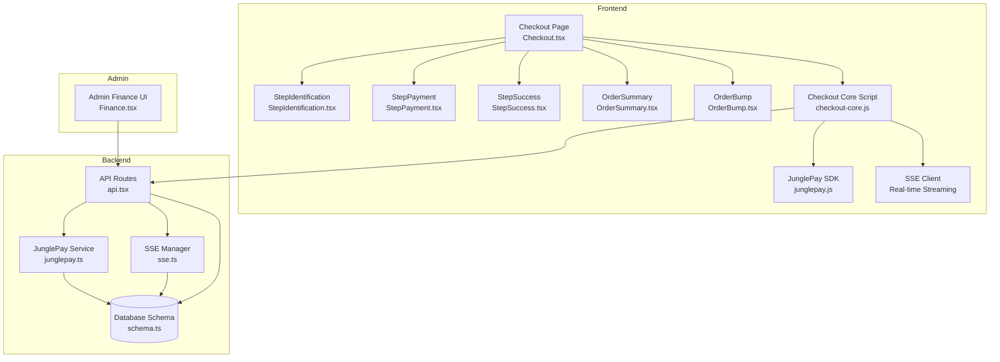

**Diagram sources**
- [Checkout.tsx](file://src/pages/Checkout.tsx#L1-L98)
- [StepIdentification.tsx](file://src/components/organisms/StepIdentification.tsx#L1-L50)
- [StepPayment.tsx](file://src/components/organisms/StepPayment.tsx#L1-L92)
- [StepSuccess.tsx](file://src/components/organisms/StepSuccess.tsx#L1-L77)
- [OrderSummary.tsx](file://src/components/organisms/OrderSummary.tsx#L1-L88)
- [OrderBump.tsx](file://src/components/molecules/OrderBump.tsx#L1-L191)
- [checkout-core.js](file://static/js/checkout-core.js#L1-L716)
- [api.tsx](file://src/routes/api.tsx#L1-L946)
- [sse.ts](file://src/services/sse.ts#L1-L160)
- [junglepay.ts](file://src/services/junglepay.ts#L1-L537)
- [schema.ts](file://src/db/schema.ts#L1-L235)
- [Finance.tsx](file://src/pages/admin/Finance.tsx#L1-L151)

**Section sources**
- [Checkout.tsx](file://src/pages/Checkout.tsx#L1-L98)
- [checkout-core.js](file://static/js/checkout-core.js#L1-L716)
- [api.tsx](file://src/routes/api.tsx#L1-L946)
- [sse.ts](file://src/services/sse.ts#L1-L160)
- [junglepay.ts](file://src/services/junglepay.ts#L1-L537)
- [schema.ts](file://src/db/schema.ts#L1-L235)
- [Finance.tsx](file://src/pages/admin/Finance.tsx#L1-L151)

## Core Components
- **Checkout Page**: Renders the multi-step checkout UI, initializes pricing, loads the JunglePay SDK, handles checkout initialization with payment method selection, order bump integration, and manages real-time event streaming.
- **StepIdentification**: Collects user identity details (email, name, CPF, phone) with input masking for Brazilian formats.
- **StepPayment**: Presents payment method selection (PIX, credit card), **multi-order bump selection**, masked card input fields, installment selection dropdown, and a secure checkout button with conditional UI handling.
- **StepSuccess**: Displays success messaging with dynamic state switching between pending and confirmed states, real-time payment status updates, and visual feedback.
- **OrderSummary**: Shows plan details, **selected order bumps**, discount, and total price with a countdown timer and real-time updates.
- **OrderBump**: **NEW** Component that renders multiple order bump options with individual selection, visual feedback, and dynamic total calculation.
- **Checkout Core Script**: Handles step navigation, input masking, **order bump state management**, total calculation, checkout submission with conditional logic for different payment methods, JunglePay SDK integration for card tokenization, and real-time SSE event listening.
- **API Routes**: Processes checkout requests for both PIX and credit card payments, **manages order bump arrays**, generates PIX charges via JunglePay, handles webhooks, manages payment method routing, and provides SSE event streaming endpoints.
- **SSE Manager**: Manages Server-Sent Events connections, client registration/unregistration, payment confirmation notifications, heartbeat maintenance, and connection cleanup.
- **JunglePay Service**: Validates gateway configuration, sanitizes customer data, builds payloads with **dynamic order bump items**, calls JunglePay API for both PIX and card transactions, persists checkout records, and returns appropriate results.
- **Database Schema**: Defines users, plans, payment gateways, subscriptions, **order bumps**, and checkouts with appropriate constraints and enums, including **orderBumpIds** for storing multiple bump selections.
- **Admin Finance UI**: Allows selecting active gateway and updating JunglePay keys.

**Section sources**
- [Checkout.tsx](file://src/pages/Checkout.tsx#L1-L98)
- [StepIdentification.tsx](file://src/components/organisms/StepIdentification.tsx#L1-L50)
- [StepPayment.tsx](file://src/components/organisms/StepPayment.tsx#L1-L92)
- [StepSuccess.tsx](file://src/components/organisms/StepSuccess.tsx#L1-L77)
- [OrderSummary.tsx](file://src/components/organisms/OrderSummary.tsx#L1-L88)
- [OrderBump.tsx](file://src/components/molecules/OrderBump.tsx#L1-L191)
- [checkout-core.js](file://static/js/checkout-core.js#L1-L716)
- [api.tsx](file://src/routes/api.tsx#L15-L160)
- [sse.ts](file://src/services/sse.ts#L1-L160)
- [junglepay.ts](file://src/services/junglepay.ts#L52-L537)
- [schema.ts](file://src/db/schema.ts#L6-L141)
- [Finance.tsx](file://src/pages/admin/Finance.tsx#L18-L151)

## Architecture Overview
The checkout flow integrates frontend UX with backend services, external payment processing, and real-time event streaming. For PIX, the frontend submits customer details to the backend, which validates and forwards to JunglePay. On success, the backend persists a checkout record with **order bump arrays** and returns the PIX payload to the frontend for QR code display. For credit card payments, the frontend uses the JunglePay SDK to tokenize card data securely, then submits the encrypted token to the backend for processing. Real-time event streaming provides immediate payment confirmation notifications via Server-Sent Events. Webhooks from JunglePay update subscriptions and user statuses upon payment confirmation.

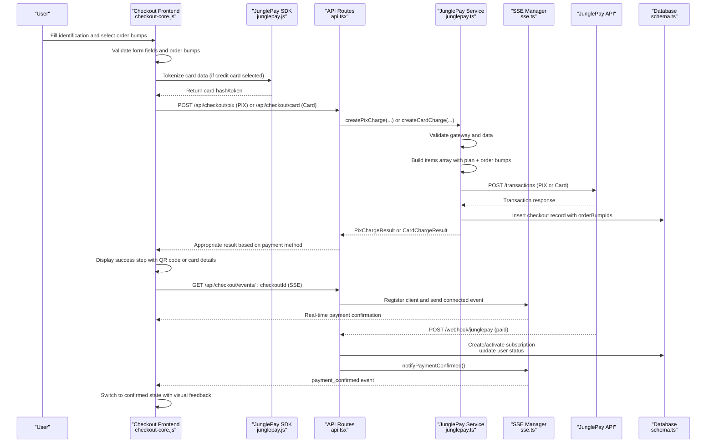

**Diagram sources**
- [checkout-core.js](file://static/js/checkout-core.js#L266-L275)
- [checkout-core.js](file://static/js/checkout-core.js#L303-L350)
- [checkout-core.js](file://static/js/checkout-core.js#L488-L565)
- [checkout-core.js](file://static/js/checkout-core.js#L166-L189)
- [checkout-core.js](file://static/js/checkout-core.js#L286-L287)
- [api.tsx](file://src/routes/api.tsx#L42-L86)
- [api.tsx](file://src/routes/api.tsx#L88-L136)
- [api.tsx](file://src/routes/api.tsx#L139-L219)
- [api.tsx](file://src/routes/api.tsx#L221-L316)
- [junglepay.ts](file://src/services/junglepay.ts#L235-L254)
- [junglepay.ts](file://src/services/junglepay.ts#L422-L441)
- [sse.ts](file://src/services/sse.ts#L21-L94)
- [schema.ts](file://src/db/schema.ts#L113-L141)

## Detailed Component Analysis

### Multi-Step Checkout Flow with Order Bumps
- **Step 1**: Identification collects email, name, CPF, and phone with automatic input masking for Brazilian formats. Validation prevents proceeding with missing fields.
- **Step 2**: Payment presents PIX and credit card options, **multi-order bump selection**, masked card input fields, installment selection dropdown, and a secure checkout button with conditional UI handling.
- **Step 3**: Success confirms receipt and displays either PIX QR code and copyable code for PIX payments or credit card approval details for card payments, with dynamic state switching for real-time updates.

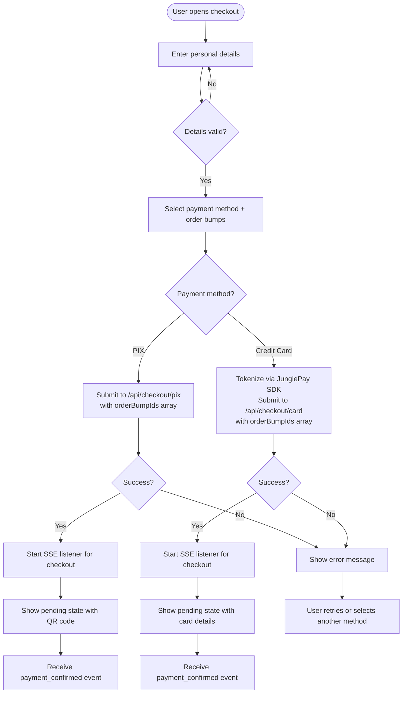

**Diagram sources**
- [StepIdentification.tsx](file://src/components/organisms/StepIdentification.tsx#L14-L46)
- [StepPayment.tsx](file://src/components/organisms/StepPayment.tsx#L20-L57)
- [checkout-core.js](file://static/js/checkout-core.js#L186-L252)
- [checkout-core.js](file://static/js/checkout-core.js#L266-L350)
- [checkout-core.js](file://static/js/checkout-core.js#L488-L565)
- [checkout-core.js](file://static/js/checkout-core.js#L166-L189)

**Section sources**
- [StepIdentification.tsx](file://src/components/organisms/StepIdentification.tsx#L1-L50)
- [StepPayment.tsx](file://src/components/organisms/StepPayment.tsx#L1-L92)
- [StepSuccess.tsx](file://src/components/organisms/StepSuccess.tsx#L1-L77)
- [checkout-core.js](file://static/js/checkout-core.js#L1-L716)

### Enhanced Payment Method Configuration with Order Bumps
- **PIX**: New internal flow via JunglePay service with QR code generation. The frontend conditionally calls /api/checkout/pix and receives a QR code payload, then starts SSE event listening for real-time updates. **Enhanced**: Now supports order bump arrays via orderBumpIds parameter.
- **Credit Card**: Comprehensive integration via JunglePay SDK for secure tokenization. The frontend collects card details, masks them, tokenizes via SDK, and sends encrypted token to backend for processing, then starts SSE event listening for real-time updates. **Enhanced**: Now supports order bump arrays via orderBumpIds parameter.
- **Conditional UI**: Payment method selection triggers different field sets - PIX shows QR code display, credit card shows masked input fields and installment dropdown, both with real-time status updates and **order bump selection**.

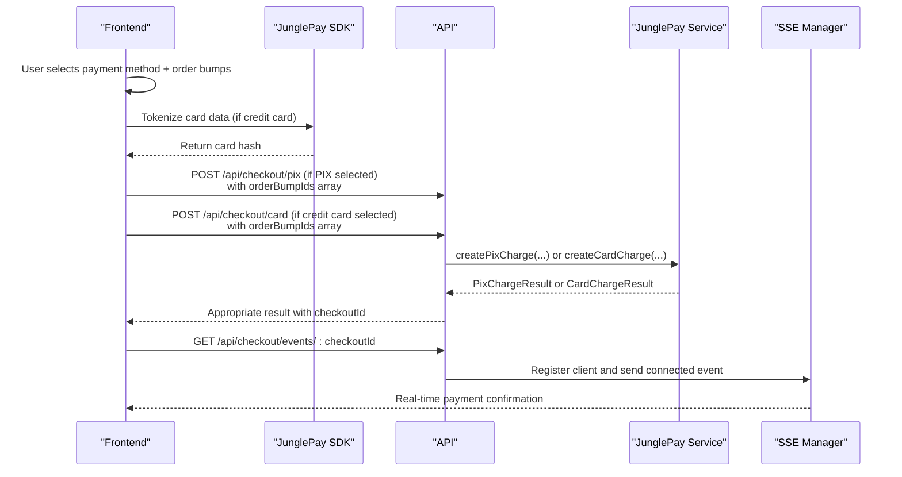

**Diagram sources**
- [checkout-core.js](file://static/js/checkout-core.js#L266-L350)
- [checkout-core.js](file://static/js/checkout-core.js#L303-L350)
- [checkout-core.js](file://static/js/checkout-core.js#L488-L565)
- [checkout-core.js](file://static/js/checkout-core.js#L286-L287)
- [api.tsx](file://src/routes/api.tsx#L42-L136)
- [api.tsx](file://src/routes/api.tsx#L139-L219)
- [junglepay.ts](file://src/services/junglepay.ts#L235-L254)
- [junglepay.ts](file://src/services/junglepay.ts#L422-L441)
- [sse.ts](file://src/services/sse.ts#L21-L94)

**Section sources**
- [StepPayment.tsx](file://src/components/organisms/StepPayment.tsx#L20-L57)
- [checkout-core.js](file://static/js/checkout-core.js#L128-L141)
- [checkout-core.js](file://static/js/checkout-core.js#L303-L350)
- [checkout-core.js](file://static/js/checkout-core.js#L488-L565)
- [checkout-core.js](file://static/js/checkout-core.js#L286-L287)
- [api.tsx](file://src/routes/api.tsx#L15-L160)
- [api.tsx](file://src/routes/api.tsx#L139-L219)
- [junglepay.ts](file://src/services/junglepay.ts#L235-L254)
- [junglepay.ts](file://src/services/junglepay.ts#L422-L441)
- [sse.ts](file://src/services/sse.ts#L21-L94)

### Comprehensive Credit Card Payment Integration with Order Bumps
- **JunglePay SDK Integration**: The checkout page loads the JunglePay SDK and initializes it with the public key from admin configuration.
- **Secure Tokenization**: Card data (number, expiry, CVC, holder name) is collected and immediately tokenized using `JunglePagamentos.encrypt()` before any transmission.
- **Installment Selection**: Dynamic dropdown with 1-12 installments, automatically calculating monthly values based on plan price.
- **Validation**: Frontend validates card fields including number length, expiry format, and required fields before tokenization.
- **Backend Processing**: Tokenized card data is sent to `/api/checkout/card` where JunglePay processes the transaction and returns approval details. **Enhanced**: Now includes order bump arrays via orderBumpIds parameter.
- **Real-Time Updates**: Checkout ID enables SSE event listening for immediate payment confirmation notifications.

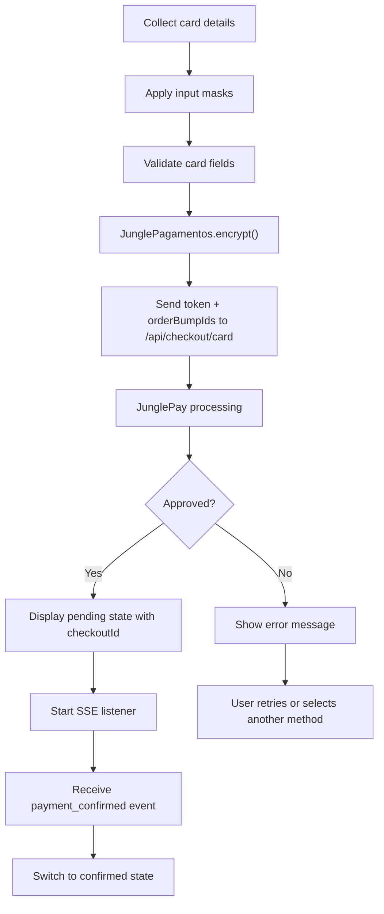

**Diagram sources**
- [Checkout.tsx](file://src/pages/Checkout.tsx#L41-L42)
- [checkout-core.js](file://static/js/checkout-core.js#L303-L350)
- [StepPayment.tsx](file://src/components/organisms/StepPayment.tsx#L13-L18)
- [StepPayment.tsx](file://src/components/organisms/StepPayment.tsx#L56-L67)
- [checkout-core.js](file://static/js/checkout-core.js#L488-L565)
- [checkout-core.js](file://static/js/checkout-core.js#L286-L287)

**Section sources**
- [Checkout.tsx](file://src/pages/Checkout.tsx#L41-L42)
- [checkout-core.js](file://static/js/checkout-core.js#L303-L350)
- [StepPayment.tsx](file://src/components/organisms/StepPayment.tsx#L13-L18)
- [StepPayment.tsx](file://src/components/organisms/StepPayment.tsx#L56-L67)
- [checkout-core.js](file://static/js/checkout-core.js#L488-L565)
- [checkout-core.js](file://static/js/checkout-core.js#L286-L287)

### Dynamic QR Code Display and Success Handling with Order Bumps
- Success screen shows a green checkmark and messaging with dynamic state switching.
- For PIX, displays QR code image generated from PIX payload and a copyable code field, with pending state until payment confirmation.
- For credit card, displays approval status with card brand, last digits, and installments, with pending state until payment confirmation.
- Real-time event streaming provides immediate status updates with automatic visual feedback.
- Automatic reconnection logic handles connection failures with retry mechanisms.

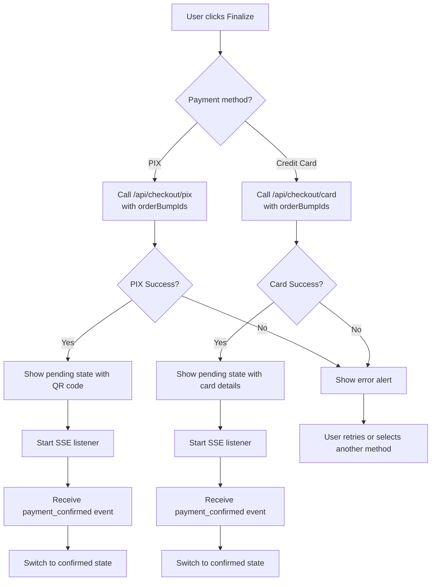

**Diagram sources**
- [checkout-core.js](file://static/js/checkout-core.js#L186-L252)
- [StepSuccess.tsx](file://src/components/organisms/StepSuccess.tsx#L13-L37)
- [checkout-core.js](file://static/js/checkout-core.js#L392-L431)
- [checkout-core.js](file://static/js/checkout-core.js#L352-L390)
- [checkout-core.js](file://static/js/checkout-core.js#L488-L565)
- [checkout-core.js](file://static/js/checkout-core.js#L286-L287)

**Section sources**
- [StepSuccess.tsx](file://src/components/organisms/StepSuccess.tsx#L1-L77)
- [checkout-core.js](file://static/js/checkout-core.js#L392-L431)
- [checkout-core.js](file://static/js/checkout-core.js#L352-L390)
- [checkout-core.js](file://static/js/checkout-core.js#L488-L565)
- [checkout-core.js](file://static/js/checkout-core.js#L286-L287)

### Integration with JunglePay
- **Gateway validation** ensures JunglePay is configured and active with a secret key.
- **Customer data sanitization** removes special characters from CPF and phone.
- **Payload construction** includes items (plan and **multiple order bumps**), customer info, and postback URL.
- **Enhanced Card Processing**: Supports card hash tokenization, installments, and comprehensive error handling.
- **Dynamic Order Bump Items**: **NEW** Builds items array dynamically from orderBumpIds, retrieving individual bump prices and names.
- On success, a checkout record is inserted with **orderBumpIds** array for real-time event streaming and the frontend displays appropriate results based on payment method.

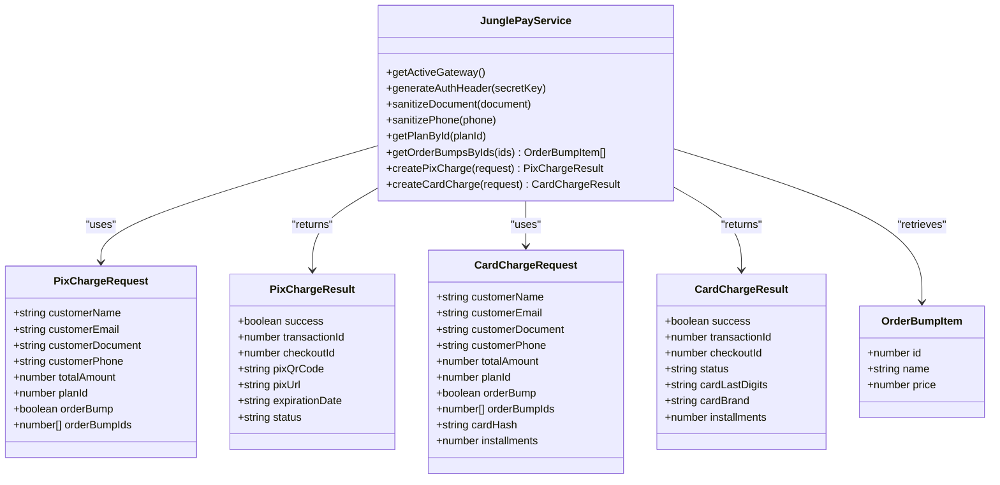

**Diagram sources**
- [junglepay.ts](file://src/services/junglepay.ts#L7-L57)
- [junglepay.ts](file://src/services/junglepay.ts#L154-L164)

**Section sources**
- [junglepay.ts](file://src/services/junglepay.ts#L90-L537)
- [junglepay-documentation.md](file://junglepay-documentation.md#L1-L800)

### Webhook Processing
- JunglePay webhook endpoint receives transaction updates.
- On paid status, finds the user by email, identifies the plan by closest price match, creates/activates a subscription, updates user subscription status, and marks the checkout as paid.
- Additional external provider webhook supports pending and paid transitions.
- **Enhanced**: Immediately notifies SSE clients with payment confirmation for real-time updates.

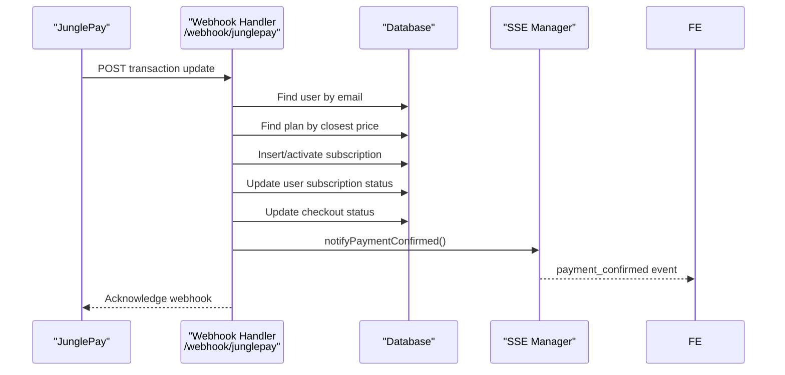

**Diagram sources**
- [api.tsx](file://src/routes/api.tsx#L139-L220)
- [api.tsx](file://src/routes/api.tsx#L221-L316)
- [schema.ts](file://src/db/schema.ts#L6-L46)
- [sse.ts](file://src/services/sse.ts#L56-L94)

**Section sources**
- [api.tsx](file://src/routes/api.tsx#L139-L220)
- [api.tsx](file://src/routes/api.tsx#L221-L316)
- [schema.ts](file://src/db/schema.ts#L6-L46)
- [sse.ts](file://src/services/sse.ts#L56-L94)

## Real-Time Event Streaming

### Server-Sent Events (SSE) Implementation
The system now features comprehensive real-time event streaming using Server-Sent Events for immediate payment status updates. The SSE implementation provides automatic reconnection logic, heartbeat maintenance, and client lifecycle management.

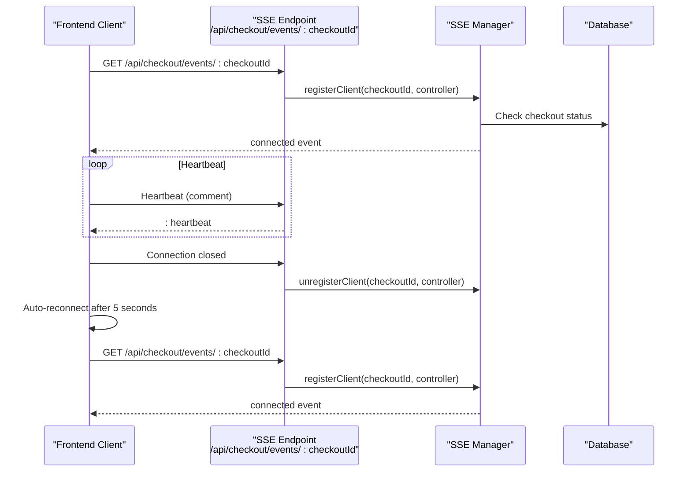

**Diagram sources**
- [checkout-core.js](file://static/js/checkout-core.js#L488-L565)
- [api.tsx](file://src/routes/api.tsx#L139-L219)
- [sse.ts](file://src/services/sse.ts#L21-L106)

### SSE Manager Features
- **Client Registration**: Tracks active SSE connections per checkout ID with automatic cleanup
- **Automatic Reconnection**: Implements exponential backoff for failed connections
- **Heartbeat Maintenance**: Sends periodic heartbeats to keep connections alive
- **Timeout Management**: Automatically closes connections after 15 minutes of inactivity
- **Cleanup Mechanism**: Removes stale connections older than 15 minutes

### Frontend SSE Integration
- **Event Listeners**: Handles 'connected', 'payment_confirmed', and 'timeout' events
- **Visual Feedback**: Provides immediate UI updates with animations and sound effects
- **Automatic State Switching**: Transitions from pending to confirmed state upon payment confirmation
- **Error Recovery**: Attempts automatic reconnection after connection failures

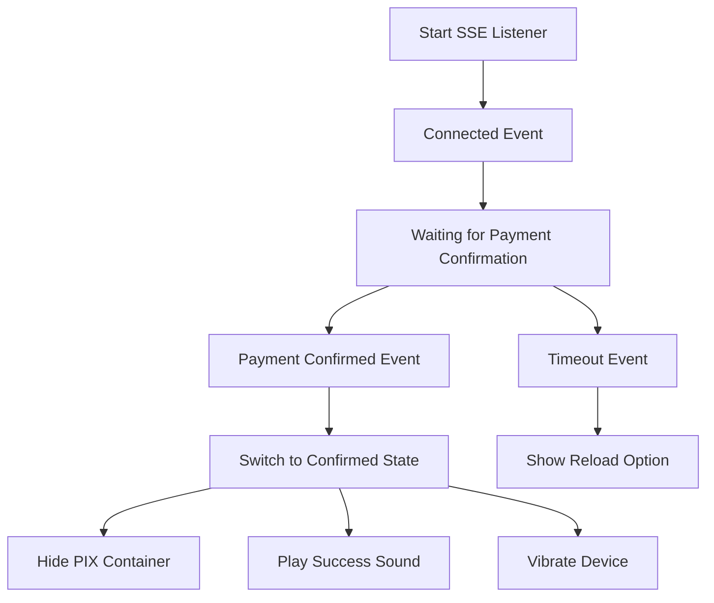

**Diagram sources**
- [checkout-core.js](file://static/js/checkout-core.js#L515-L565)
- [checkout-core.js](file://static/js/checkout-core.js#L578-L610)

**Section sources**
- [checkout-core.js](file://static/js/checkout-core.js#L488-L565)
- [checkout-core.js](file://static/js/checkout-core.js#L578-L610)
- [api.tsx](file://src/routes/api.tsx#L139-L219)
- [sse.ts](file://src/services/sse.ts#L1-L160)

## Order Bumps System

### OrderBump Component Architecture
The new OrderBump component provides a comprehensive multi-order bump selection interface with advanced state management and real-time updates.

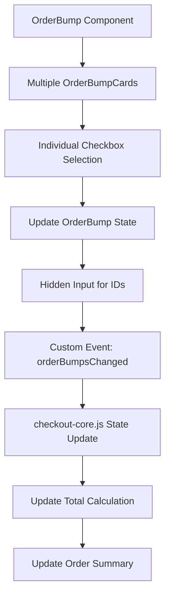

**Diagram sources**
- [OrderBump.tsx](file://src/components/molecules/OrderBump.tsx#L18-L77)
- [OrderBump.tsx](file://src/components/molecules/OrderBump.tsx#L98-L156)
- [checkout-core.js](file://static/js/checkout-core.js#L166-L189)

### Order Bump State Management
- **State Tracking**: Maintains selected bump IDs, total bump price, and order bump visibility
- **Real-time Updates**: Listens for custom 'orderBumpsChanged' events to update UI instantly
- **Visual Feedback**: Dynamically updates checkbox styling, container borders, and icon visibility
- **Hidden Input Management**: Automatically updates hidden input with comma-separated selected IDs

### Database Schema for Order Bumps
The system now supports multiple order bumps per checkout through enhanced database schema:

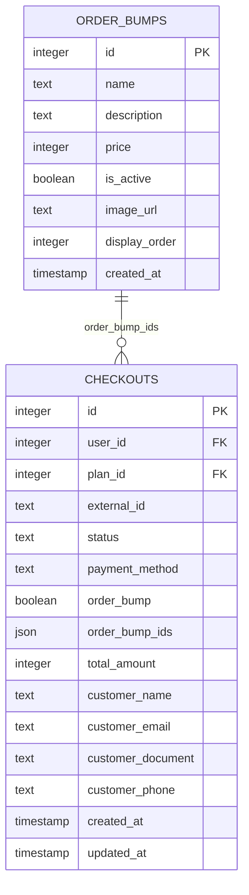

**Diagram sources**
- [schema.ts](file://src/db/schema.ts#L114-L141)

### Admin Order Bump Management
The admin interface provides comprehensive order bump management capabilities:

- **List Active Order Bumps**: Public endpoint `/api/order-bumps/active` for checkout integration
- **Full CRUD Operations**: Complete create, read, update, delete, and toggle functionality
- **Batch Operations**: Support for bulk order bump management
- **Display Ordering**: Configurable display order for optimal customer experience

**Section sources**
- [OrderBump.tsx](file://src/components/molecules/OrderBump.tsx#L1-L191)
- [checkout-core.js](file://static/js/checkout-core.js#L166-L220)
- [schema.ts](file://src/db/schema.ts#L114-L141)
- [api.tsx](file://src/routes/api.tsx#L690-L858)

## Dependency Analysis
- Frontend depends on checkout-core.js for state management, masking, conditional payment processing, **order bump state management**, JunglePay SDK integration, checkout submission, and real-time SSE event listening.
- API routes depend on JunglePay service for PIX and comprehensive credit card processing, **order bump management**, SSE manager for real-time event streaming, and database schema for persistence.
- SSE manager depends on database for checkout status validation and client tracking.
- Admin Finance UI posts to API routes to manage gateway preferences and keys.

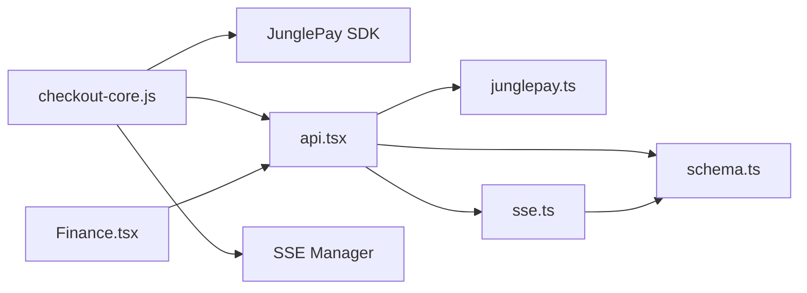

**Diagram sources**
- [checkout-core.js](file://static/js/checkout-core.js#L1-L716)
- [api.tsx](file://src/routes/api.tsx#L1-L946)
- [junglepay.ts](file://src/services/junglepay.ts#L1-L537)
- [sse.ts](file://src/services/sse.ts#L1-L160)
- [schema.ts](file://src/db/schema.ts#L1-L235)
- [Finance.tsx](file://src/pages/admin/Finance.tsx#L1-L151)

**Section sources**
- [checkout-core.js](file://static/js/checkout-core.js#L1-L716)
- [api.tsx](file://src/routes/api.tsx#L1-L946)
- [junglepay.ts](file://src/services/junglepay.ts#L1-L537)
- [sse.ts](file://src/services/sse.ts#L1-L160)
- [schema.ts](file://src/db/schema.ts#L1-L235)
- [Finance.tsx](file://src/pages/admin/Finance.tsx#L1-L151)

## Performance Considerations
- Minimize synchronous work in webhook handlers; database operations should be efficient and avoid unnecessary joins.
- Use indexing on frequently queried fields (e.g., users.email, subscriptions.externalId) to speed up lookups during webhook processing.
- Cache plan metadata when feasible to reduce repeated reads.
- Keep frontend scripts lightweight; defer initialization until DOM is ready.
- Implement QR code caching for PIX transactions to reduce external API calls.
- **Optimize card tokenization**: Cache JunglePay SDK initialization and reuse where possible.
- **SSE Optimization**: Implement connection pooling and efficient client tracking to minimize memory usage.
- **Heartbeat Efficiency**: Use 30-second intervals for heartbeats to balance connection maintenance with bandwidth usage.
- **Automatic Cleanup**: Regular cleanup of stale connections prevents memory leaks and improves system stability.
- **Order Bump Caching**: Cache order bump data in frontend state to avoid repeated DOM manipulation.
- **Event Delegation**: Use event delegation for order bump checkboxes to improve performance with many items.

## Security and Compliance
- **Payment data handling**:
  - **Enhanced Credit Card Security**: All card data is tokenized client-side using JunglePay SDK before any transmission. The tokenization library encrypts sensitive card data using the public key.
  - For PIX, sensitive card fields are not collected by the frontend; payment is processed via JunglePay.
  - **PCI DSS Compliance**: Card data never touches application servers; all sensitive data is handled by JunglePay's PCI-compliant infrastructure.
  - **Real-Time Security**: SSE connections use HTTPS and proper CORS headers to prevent unauthorized access.
- **Authentication and cookies**:
  - Secure cookie attributes (HttpOnly, SameSite, Secure) are set for JWT-based sessions.
- **Input validation**:
  - Validate and sanitize all inputs on the server side before processing.
  - Client-side input masks prevent invalid formats (e.g., card numbers, dates).
- **Secrets management**:
  - Store JunglePay secret keys securely in environment variables and avoid logging sensitive values.
  - Public keys are loaded from admin configuration and used only for tokenization.
- **Webhook authenticity**:
  - Verify webhook signatures or use shared secrets to prevent spoofing (recommended enhancement).
- **SSE Security**: Implement proper origin validation and CSRF protection for SSE endpoints.
- **Order Bump Security**: Validate order bump IDs against database to prevent injection attacks.

## Admin Financial Reporting
- Admin Finance UI allows selecting the active payment gateway and updating JunglePay keys.
- API routes handle saving gateway preferences and updating JunglePay credentials.
- The system maintains checkouts and subscriptions for reporting and reconciliation.
- **Enhanced**: Real-time event streaming provides immediate payment confirmation notifications for admin monitoring.
- **Order Bump Analytics**: Admin interface supports managing and tracking order bump performance.

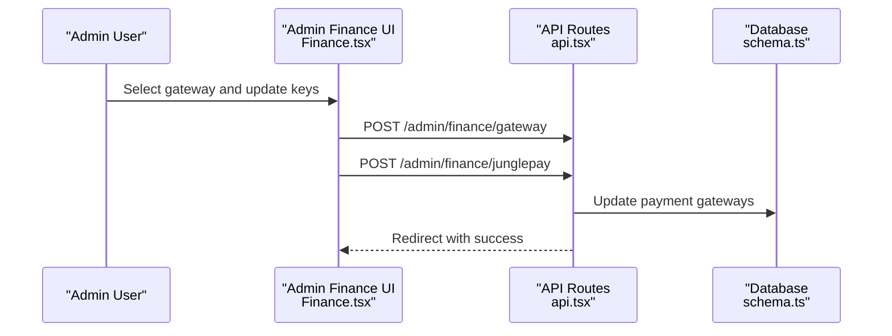

**Diagram sources**
- [Finance.tsx](file://src/pages/admin/Finance.tsx#L18-L151)
- [api.tsx](file://src/routes/api.tsx#L223-L266)
- [schema.ts](file://src/db/schema.ts#L29-L35)

**Section sources**
- [Finance.tsx](file://src/pages/admin/Finance.tsx#L1-L151)
- [api.tsx](file://src/routes/api.tsx#L223-L266)
- [schema.ts](file://src/db/schema.ts#L29-L35)

## Troubleshooting Guide
- **Gateway not configured or inactive**:
  - Symptoms: PIX charge returns gateway not configured or inactive.
  - Resolution: Confirm gateway is active and secret key is set in Admin Finance.
- **Invalid data errors**:
  - Symptoms: Missing required fields or invalid amount.
  - Resolution: Ensure customer details and total amount are present and valid.
- **Credit Card tokenization failures**:
  - Symptoms: "SDK de pagamento não carregado" or "Erro ao tokenizar cartão".
  - Resolution: Verify JunglePay SDK is loaded, public key is configured, and card data is valid.
- **Card declined errors**:
  - Symptoms: "Cartão recusado pela operadora" or 402 HTTP status.
  - Resolution: Check card limits, authentication requirements, and card validity.
- **API errors**:
  - Symptoms: HTTP errors from JunglePay or unexpected responses.
  - Resolution: Check network connectivity, secret key correctness, and payload formatting.
- **Webhook not activating subscription**:
  - Symptoms: Paid transactions do not activate subscriptions.
  - Resolution: Verify webhook URL is reachable, payload type is transaction, and user/email mapping is correct.
- **QR code generation failures**:
  - Symptoms: PIX QR code not displaying or copy-to-clipboard not working.
  - Resolution: Check external QR code API availability and ensure proper data formatting.
- **SSE Connection Issues**:
  - Symptoms: Payment status not updating in real-time, connection timeouts.
  - Resolution: Check SSE endpoint accessibility, verify checkout ID exists, ensure proper CORS configuration.
- **Automatic Reconnection Failures**:
  - Symptoms: Continuous connection attempts without success.
  - Resolution: Verify server-side SSE manager is running, check database connectivity, review timeout settings.
- **Real-Time Update Delays**:
  - Symptoms: Delayed payment confirmation notifications.
  - Resolution: Check heartbeat interval settings, verify webhook processing time, monitor SSE client registration.
- **Order Bump Selection Issues**:
  - Symptoms: Order bumps not appearing, selection not persisting, or total not updating.
  - Resolution: Verify order bump IDs are valid, check browser console for JavaScript errors, ensure proper event handling.
- **Order Bump Pricing Errors**:
  - Symptoms: Incorrect total calculation or missing order bump amounts.
  - Resolution: Verify order bump prices in database, check order bump retrieval logic, ensure proper price formatting.

**Section sources**
- [junglepay.ts](file://src/services/junglepay.ts#L145-L171)
- [api.tsx](file://src/routes/api.tsx#L42-L86)
- [api.tsx](file://src/routes/api.tsx#L88-L136)
- [api.tsx](file://src/routes/api.tsx#L139-L220)
- [checkout-core.js](file://static/js/checkout-core.js#L303-L350)
- [checkout-core.js](file://static/js/checkout-core.js#L392-L431)
- [checkout-core.js](file://static/js/checkout-core.js#L488-L565)
- [checkout-core.js](file://static/js/checkout-core.js#L166-L189)
- [checkout-core.js](file://static/js/checkout-core.js#L222-L249)
- [sse.ts](file://src/services/sse.ts#L122-L148)

## Conclusion
The checkout and payment processing system provides a secure, multi-step flow with clear presentation of plan details and order totals. **The comprehensive order bumps feature significantly enhances the customer experience by offering multiple add-on product selections during checkout.** The new OrderBump component provides intuitive multi-selection capabilities with real-time visual feedback, dynamic total calculation, and seamless integration with the existing checkout flow.

PIX is integrated via JunglePay with robust validation, QR code generation, and webhook-driven subscription activation. The enhanced comprehensive credit card payment integration adds secure tokenization, installment selection, and dynamic calculations, providing customers with flexible payment options while maintaining strict PCI compliance.

**Enhanced Real-Time Features**: The system now features comprehensive real-time event streaming with Server-Sent Events, providing immediate payment confirmation notifications, automatic reconnection logic, and dynamic visual feedback. The SSE implementation includes heartbeat maintenance, automatic cleanup of stale connections, and robust error recovery mechanisms.

**Order Bump Integration**: The multi-order bump system seamlessly integrates with both payment methods, dynamically building item arrays for JunglePay processing and maintaining accurate pricing throughout the checkout process. The frontend provides immediate visual feedback as customers select order bumps, with the total updating in real-time.

The frontend logic handles conditional processing for different payment methods and order bump combinations, while the backend APIs support both PIX and comprehensive credit card flows with enhanced order bump processing seamlessly. The admin interface enables flexible gateway configuration, key management, and comprehensive order bump management. For production hardening, implement webhook signature verification, strengthen input sanitization, ensure strict adherence to PCI guidelines, consider implementing QR code caching for improved performance, and optimize SSE connection management for scalability.

The real-time event streaming architecture significantly enhances user experience by providing immediate feedback on payment status, reducing uncertainty during the checkout process, and enabling seamless integration with webhook-based payment confirmation systems. The addition of multi-order bump capabilities positions the platform for enhanced revenue optimization and customer satisfaction through flexible upsell opportunities.