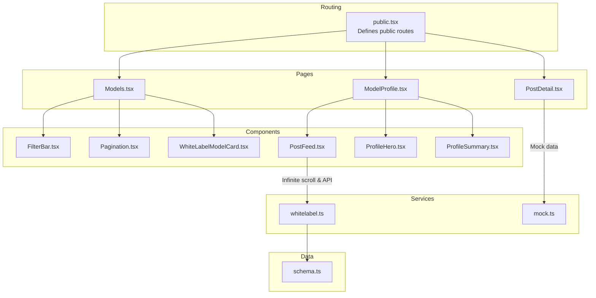
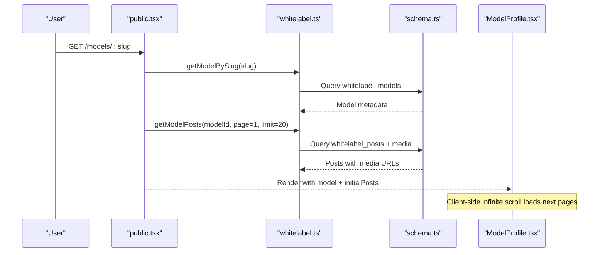
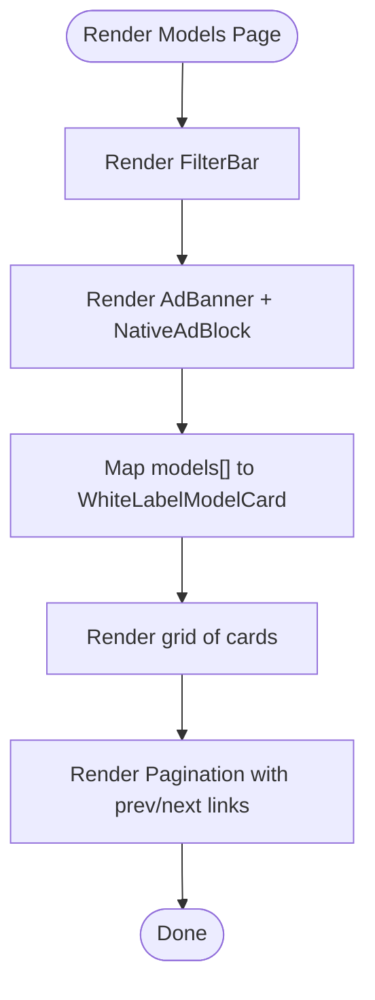
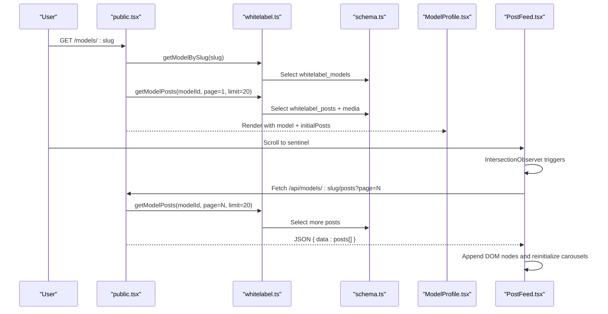
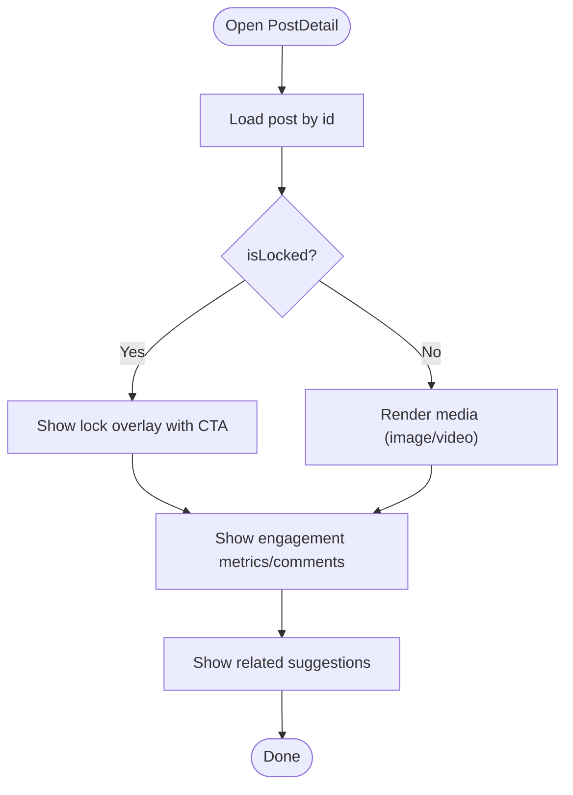
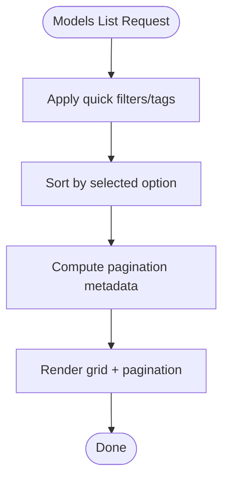
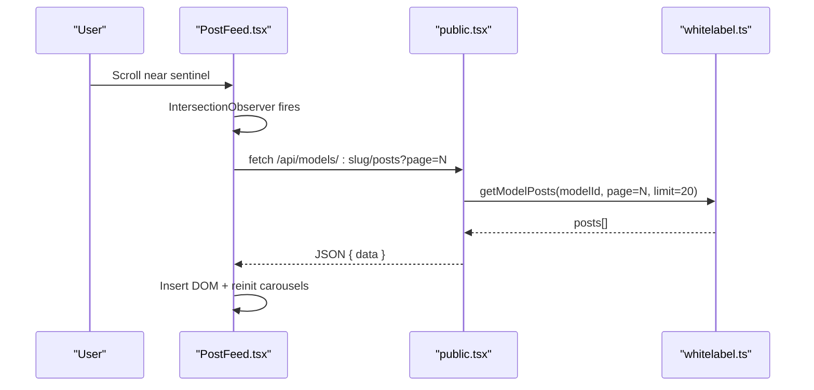
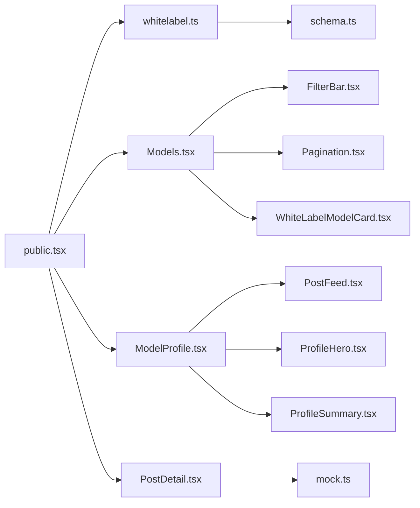

# Content Discovery

<cite>
**Referenced Files in This Document**
- [Models.tsx](file://src/pages/Models.tsx)
- [ModelProfile.tsx](file://src/pages/ModelProfile.tsx)
- [PostDetail.tsx](file://src/pages/PostDetail.tsx)
- [FilterBar.tsx](file://src/components/molecules/FilterBar.tsx)
- [Pagination.tsx](file://src/components/molecules/Pagination.tsx)
- [WhiteLabelModelCard.tsx](file://src/components/molecules/WhiteLabelModelCard.tsx)
- [PostFeed.tsx](file://src/components/organisms/PostFeed.tsx)
- [ProfileHero.tsx](file://src/components/organisms/ProfileHero.tsx)
- [ProfileSummary.tsx](file://src/components/organisms/ProfileSummary.tsx)
- [mock.ts](file://src/services/mock.ts)
- [public.tsx](file://src/routes/public.tsx)
- [schema.ts](file://src/db/schema.ts)
- [whitelabel.ts](file://src/services/whitelabel.ts)
</cite>

## Table of Contents
1. [Introduction](#introduction)
2. [Project Structure](#project-structure)
3. [Core Components](#core-components)
4. [Architecture Overview](#architecture-overview)
5. [Detailed Component Analysis](#detailed-component-analysis)
6. [Dependency Analysis](#dependency-analysis)
7. [Performance Considerations](#performance-considerations)
8. [Troubleshooting Guide](#troubleshooting-guide)
9. [Conclusion](#conclusion)

## Introduction
This document explains the content discovery and browsing experience across three primary pages: the models listing page, the model profile page, and the post detail page. It covers filtering, sorting, and pagination on the models listing; the model profile’s galleries, stats, and subscription affordances; the post detail page’s media viewing, engagement features, and access controls; and the underlying data-loading strategies, infinite scrolling, and performance optimizations for media-heavy content.

## Project Structure
The content discovery feature spans routing, server-side rendering with Hono JSX, reusable UI components, and database-backed services. The public routes define endpoints that render pages and pass data to components. Components encapsulate UI and client-side behavior such as infinite scrolling.

**Diagram sources**
- [public.tsx](file://src/routes/public.tsx#L1-L170)
- [Models.tsx](file://src/pages/Models.tsx#L1-L56)
- [ModelProfile.tsx](file://src/pages/ModelProfile.tsx#L1-L51)
- [PostDetail.tsx](file://src/pages/PostDetail.tsx#L1-L163)
- [FilterBar.tsx](file://src/components/molecules/FilterBar.tsx#L1-L34)
- [Pagination.tsx](file://src/components/molecules/Pagination.tsx#L1-L69)
- [WhiteLabelModelCard.tsx](file://src/components/molecules/WhiteLabelModelCard.tsx#L1-L48)
- [PostFeed.tsx](file://src/components/organisms/PostFeed.tsx#L1-L216)
- [ProfileHero.tsx](file://src/components/organisms/ProfileHero.tsx#L1-L24)
- [ProfileSummary.tsx](file://src/components/organisms/ProfileSummary.tsx#L1-L51)
- [whitelabel.ts](file://src/services/whitelabel.ts#L1-L24)
- [mock.ts](file://src/services/mock.ts#L1-L193)
- [schema.ts](file://src/db/schema.ts#L1-L178)

**Section sources**
- [public.tsx](file://src/routes/public.tsx#L1-L170)
- [Models.tsx](file://src/pages/Models.tsx#L1-L56)
- [ModelProfile.tsx](file://src/pages/ModelProfile.tsx#L1-L51)
- [PostDetail.tsx](file://src/pages/PostDetail.tsx#L1-L163)

## Core Components
- Models listing page: Renders a filter bar, ad banners, a responsive model grid, native ads, and pagination. It receives paginated model data and user context from the route handler.
- Model profile page: Displays a cinematic hero, profile summary with avatar, badges, stats, and a subscription action. The posts feed is rendered alongside a bio column.
- Post detail page: Shows media (image or video) with lock overlays for premium content, engagement metrics, comments, and related suggestions.
- Filtering and sorting: Implemented via quick filters and tag chips in the filter bar.
- Pagination: Provides previous/next navigation and a compact page indicator.
- Infinite scroll: Implemented client-side in the profile feed to load more posts as the user approaches the sentinel element.

**Section sources**
- [Models.tsx](file://src/pages/Models.tsx#L1-L56)
- [ModelProfile.tsx](file://src/pages/ModelProfile.tsx#L1-L51)
- [PostDetail.tsx](file://src/pages/PostDetail.tsx#L1-L163)
- [FilterBar.tsx](file://src/components/molecules/FilterBar.tsx#L1-L34)
- [Pagination.tsx](file://src/components/molecules/Pagination.tsx#L1-L69)
- [PostFeed.tsx](file://src/components/organisms/PostFeed.tsx#L1-L216)

## Architecture Overview
The public routes resolve user context from cookies and JWT, query the database or whitelabel service for models and posts, and render pages with Hono JSX. The model profile page initializes with a fixed set of posts and lazily loads more via IntersectionObserver when reaching the sentinel.

**Diagram sources**
- [public.tsx](file://src/routes/public.tsx#L66-L78)
- [whitelabel.ts](file://src/services/whitelabel.ts#L1-L24)
- [schema.ts](file://src/db/schema.ts#L73-L103)
- [ModelProfile.tsx](file://src/pages/ModelProfile.tsx#L1-L51)

## Detailed Component Analysis

### Models Listing Page
- Purpose: Discover models with filtering, discovery banners, and pagination.
- Key UI elements:
  - FilterBar: Sticky header with quick filters and tag chips.
  - AdBanner and NativeAdBlock: Promote subscription plans and recommended models.
  - WhiteLabelModelCard: Grid item with lazy-loaded image, gradient overlay, and post count.
  - Pagination: Previous/Next buttons and page indicators.
- Data flow:
  - Route handler computes pagination metadata and passes it to the page.
  - Mock data is used for VIP models and ads in the listing template.

**Diagram sources**
- [Models.tsx](file://src/pages/Models.tsx#L16-L56)
- [FilterBar.tsx](file://src/components/molecules/FilterBar.tsx#L1-L34)
- [WhiteLabelModelCard.tsx](file://src/components/molecules/WhiteLabelModelCard.tsx#L10-L48)
- [Pagination.tsx](file://src/components/molecules/Pagination.tsx#L13-L69)

**Section sources**
- [Models.tsx](file://src/pages/Models.tsx#L1-L56)
- [FilterBar.tsx](file://src/components/molecules/FilterBar.tsx#L1-L34)
- [WhiteLabelModelCard.tsx](file://src/components/molecules/WhiteLabelModelCard.tsx#L1-L48)
- [Pagination.tsx](file://src/components/molecules/Pagination.tsx#L1-L69)

### Model Profile Page
- Purpose: Present model identity, stats, subscription action, and a media-rich post feed.
- Key UI elements:
  - ProfileHero: Full-width cinematic banner with gradient overlay.
  - ProfileSummary: Avatar, live badge, handle, stats, and primary CTA.
  - PostFeed: Initial posts, followed by an infinite scroll sentinel.
- Data loading:
  - Server renders initialPosts and model metadata.
  - Client-side script observes the sentinel and appends more posts via an API endpoint.

**Diagram sources**
- [public.tsx](file://src/routes/public.tsx#L66-L78)
- [whitelabel.ts](file://src/services/whitelabel.ts#L1-L24)
- [schema.ts](file://src/db/schema.ts#L73-L103)
- [ModelProfile.tsx](file://src/pages/ModelProfile.tsx#L15-L49)
- [PostFeed.tsx](file://src/components/organisms/PostFeed.tsx#L48-L213)

**Section sources**
- [ModelProfile.tsx](file://src/pages/ModelProfile.tsx#L1-L51)
- [ProfileHero.tsx](file://src/components/organisms/ProfileHero.tsx#L1-L24)
- [ProfileSummary.tsx](file://src/components/organisms/ProfileSummary.tsx#L1-L51)
- [PostFeed.tsx](file://src/components/organisms/PostFeed.tsx#L1-L216)

### Post Detail Page
- Purpose: Display a single post with media, engagement metrics, comments, and related suggestions.
- Key UI elements:
  - Media area: image or video player with controls.
  - Lock overlay: prompts users to subscribe for premium content.
  - Engagement: likes and comment counts with a mock comments section.
  - Sidebar: model info, CTA, and “Related” suggestions.
- Access control:
  - Premium posts show a lock overlay and a CTA to upgrade plans.

**Diagram sources**
- [PostDetail.tsx](file://src/pages/PostDetail.tsx#L10-L163)

**Section sources**
- [PostDetail.tsx](file://src/pages/PostDetail.tsx#L1-L163)

### Filtering, Sorting, and Pagination
- Filtering and sorting:
  - FilterBar exposes quick filters and tag chips for categories and features.
  - Sorting options are present in the filter bar (e.g., Recommended, Popular, New).
- Pagination:
  - Pagination component displays current range and total items, with previous/next links computed by the route handler.

**Diagram sources**
- [FilterBar.tsx](file://src/components/molecules/FilterBar.tsx#L15-L29)
- [Pagination.tsx](file://src/components/molecules/Pagination.tsx#L13-L69)
- [public.tsx](file://src/routes/public.tsx#L81-L101)

**Section sources**
- [FilterBar.tsx](file://src/components/molecules/FilterBar.tsx#L1-L34)
- [Pagination.tsx](file://src/components/molecules/Pagination.tsx#L1-L69)
- [public.tsx](file://src/routes/public.tsx#L81-L101)

### Infinite Scroll and Lazy Loading
- Infinite scroll:
  - PostFeed uses IntersectionObserver to detect when the sentinel enters the viewport.
  - On trigger, it fetches the next page of posts for the model and appends DOM nodes.
  - Reinitializes carousels after insertion.
- Lazy loading:
  - Model cards use native lazy loading on images.
  - Video and image media in posts are loaded on demand.

**Diagram sources**
- [PostFeed.tsx](file://src/components/organisms/PostFeed.tsx#L48-L213)
- [public.tsx](file://src/routes/public.tsx#L66-L78)
- [whitelabel.ts](file://src/services/whitelabel.ts#L1-L24)

**Section sources**
- [PostFeed.tsx](file://src/components/organisms/PostFeed.tsx#L1-L216)
- [WhiteLabelModelCard.tsx](file://src/components/molecules/WhiteLabelModelCard.tsx#L28-L28)

## Dependency Analysis
- Routing depends on user authentication (JWT cookie verification) and delegates model/post queries to the whitelabel service.
- The whitelabel service orchestrates model and post queries against the schema tables.
- Pages depend on components for UI and behavior; PostDetail uses mock data for demonstration.

**Diagram sources**
- [public.tsx](file://src/routes/public.tsx#L1-L170)
- [whitelabel.ts](file://src/services/whitelabel.ts#L1-L24)
- [schema.ts](file://src/db/schema.ts#L1-L178)
- [Models.tsx](file://src/pages/Models.tsx#L1-L56)
- [ModelProfile.tsx](file://src/pages/ModelProfile.tsx#L1-L51)
- [PostDetail.tsx](file://src/pages/PostDetail.tsx#L1-L163)
- [PostFeed.tsx](file://src/components/organisms/PostFeed.tsx#L1-L216)
- [FilterBar.tsx](file://src/components/molecules/FilterBar.tsx#L1-L34)
- [Pagination.tsx](file://src/components/molecules/Pagination.tsx#L1-L69)
- [WhiteLabelModelCard.tsx](file://src/components/molecules/WhiteLabelModelCard.tsx#L1-L48)
- [ProfileHero.tsx](file://src/components/organisms/ProfileHero.tsx#L1-L24)
- [ProfileSummary.tsx](file://src/components/organisms/ProfileSummary.tsx#L1-L51)
- [mock.ts](file://src/services/mock.ts#L1-L193)

**Section sources**
- [public.tsx](file://src/routes/public.tsx#L1-L170)
- [whitelabel.ts](file://src/services/whitelabel.ts#L1-L24)
- [schema.ts](file://src/db/schema.ts#L1-L178)

## Performance Considerations
- Media lazy loading:
  - Model cards and post media use native lazy loading to defer offscreen resources.
- Infinite scroll:
  - Uses IntersectionObserver to avoid heavy polling and to load only when needed.
  - DOM updates append new nodes; carousels are reinitialized after insertion.
- Rendering:
  - Pages render server-side with Hono JSX, reducing client work and improving perceived performance.
- Recommendations:
  - Use server-side pagination and limit batch sizes to keep memory usage low during scroll.
  - Consider preloading next-page assets when the user is near the sentinel.

[No sources needed since this section provides general guidance]

## Troubleshooting Guide
- Authentication and user context:
  - If user is not recognized, verify the presence and validity of the auth cookie and JWT signature.
- Model/profile not found:
  - Ensure the slug exists in whitelabel models and that posts are synced.
- Infinite scroll not triggering:
  - Confirm the sentinel element exists and the IntersectionObserver is attached.
  - Check network tab for failed requests to the posts API endpoint.
- Media not loading:
  - Verify CDN URLs in post media and that CORS allows your domain.
- Lock overlay appears unexpectedly:
  - Confirm the post’s locked flag and user subscription status.

**Section sources**
- [public.tsx](file://src/routes/public.tsx#L20-L51)
- [PostFeed.tsx](file://src/components/organisms/PostFeed.tsx#L37-L40)
- [PostDetail.tsx](file://src/pages/PostDetail.tsx#L38-L49)

## Conclusion
The content discovery and browsing experience combines server-rendered pages with client-side infinite scroll and lazy loading to deliver a smooth, media-first interface. Filtering and pagination are integrated into the models listing, while the model profile page provides a rich gallery experience with subscription prompts and engagement features. The architecture cleanly separates routing, data access, and UI concerns, enabling scalable enhancements such as search, recommendation algorithms, and advanced analytics.