# Landing Pages

<cite>
**Referenced Files in This Document**
- [src/pages/Home.tsx](file://src/pages/Home.tsx)
- [src/pages/Auth.tsx](file://src/pages/Auth.tsx)
- [src/pages/Plans.tsx](file://src/pages/Plans.tsx)
- [src/components/organisms/HeroCarousel.tsx](file://src/components/organisms/HeroCarousel.tsx)
- [src/components/molecules/ModelCard.tsx](file://src/components/molecules/ModelCard.tsx)
- [src/components/molecules/WhiteLabelModelCard.tsx](file://src/components/molecules/WhiteLabelModelCard.tsx)
- [src/components/molecules/PlanCard.tsx](file://src/components/molecules/PlanCard.tsx)
- [src/components/molecules/TrendingSideColumn.tsx](file://src/components/molecules/TrendingSideColumn.tsx)
- [src/components/molecules/FilterBar.tsx](file://src/components/molecules/FilterBar.tsx)
- [src/components/organisms/AuthHero.tsx](file://src/components/organisms/AuthHero.tsx)
- [src/components/templates/Layout.tsx](file://src/components/templates/Layout.tsx)
- [src/services/mock.ts](file://src/services/mock.ts)
- [src/services/auth.ts](file://src/services/auth.ts)
- [src/routes/public.tsx](file://src/routes/public.tsx)
- [src/db/schema.ts](file://src/db/schema.ts)
- [static/js/carousel.js](file://static/js/carousel.js)
</cite>

## Table of Contents
1. [Introduction](#introduction)
2. [Project Structure](#project-structure)
3. [Core Components](#core-components)
4. [Architecture Overview](#architecture-overview)
5. [Detailed Component Analysis](#detailed-component-analysis)
6. [Dependency Analysis](#dependency-analysis)
7. [Performance Considerations](#performance-considerations)
8. [Troubleshooting Guide](#troubleshooting-guide)
9. [Conclusion](#conclusion)
10. [Appendices](#appendices)

## Introduction
This document explains CreatorFlix’s landing page components and user journeys. It covers:
- Home page implementation with hero carousel, trending models sidebar, content filtering, and model grids
- Authentication flow for registration and login
- Pricing plans page with subscription options and checkout integration
- Component composition patterns, data fetching strategies, and user journey optimization
- Server-side rendering (SSR) implementation, SEO considerations, and performance optimization
- Responsive design patterns and cross-page navigation flows

## Project Structure
The landing pages are implemented as Hono JSX pages rendered server-side and composed with reusable React-like components. Public routes orchestrate SSR, hydrate user context, and fetch data from the database or whitelabel service.

**Diagram sources**
- [src/routes/public.tsx](file://src/routes/public.tsx#L54-L170)
- [src/pages/Home.tsx](file://src/pages/Home.tsx#L22-L96)
- [src/pages/Auth.tsx](file://src/pages/Auth.tsx#L10-L116)
- [src/pages/Plans.tsx](file://src/pages/Plans.tsx#L10-L84)
- [src/components/templates/Layout.tsx](file://src/components/templates/Layout.tsx#L17-L56)
- [src/components/organisms/HeroCarousel.tsx](file://src/components/organisms/HeroCarousel.tsx#L9-L64)
- [src/components/molecules/WhiteLabelModelCard.tsx](file://src/components/molecules/WhiteLabelModelCard.tsx#L10-L48)
- [src/components/molecules/ModelCard.tsx](file://src/components/molecules/ModelCard.tsx#L12-L69)
- [src/components/molecules/PlanCard.tsx](file://src/components/molecules/PlanCard.tsx#L25-L110)
- [src/components/molecules/TrendingSideColumn.tsx](file://src/components/molecules/TrendingSideColumn.tsx#L8-L33)
- [src/components/molecules/FilterBar.tsx](file://src/components/molecules/FilterBar.tsx#L3-L34)
- [src/components/organisms/AuthHero.tsx](file://src/components/organisms/AuthHero.tsx#L3-L41)
- [src/services/mock.ts](file://src/services/mock.ts#L1-L193)
- [src/services/auth.ts](file://src/services/auth.ts#L5-L91)

**Section sources**
- [src/routes/public.tsx](file://src/routes/public.tsx#L54-L170)
- [src/pages/Home.tsx](file://src/pages/Home.tsx#L22-L96)
- [src/pages/Auth.tsx](file://src/pages/Auth.tsx#L10-L116)
- [src/pages/Plans.tsx](file://src/pages/Plans.tsx#L10-L84)
- [src/components/templates/Layout.tsx](file://src/components/templates/Layout.tsx#L17-L56)

## Core Components
- Home page orchestrates hero carousel, trending sidebar, ad banners, tag filters, and two model grids (featured and reverse-ordered) using whitelabel model cards.
- Authentication page renders a split layout with a hero and a form that posts to backend endpoints for login or registration.
- Plans page conditionally renders either a “current subscription” summary or a plan selection grid powered by plan cards.

Key implementation patterns:
- Composition: Pages render templates and molecules/organisms; atoms provide base UI primitives.
- Data fetching: Routes resolve user context and fetch models/plans; pages receive props.
- SSR: Pages render JSX to HTML on the server; client scripts enhance interactivity where needed.

**Section sources**
- [src/pages/Home.tsx](file://src/pages/Home.tsx#L22-L96)
- [src/pages/Auth.tsx](file://src/pages/Auth.tsx#L10-L116)
- [src/pages/Plans.tsx](file://src/pages/Plans.tsx#L10-L84)
- [src/components/templates/Layout.tsx](file://src/components/templates/Layout.tsx#L17-L56)

## Architecture Overview
The public routes handle SSR, user authentication via JWT cookie verification, and data retrieval from the database or whitelabel service. Pages are rendered with props for models, plans, and user context.

```mermaid
sequenceDiagram
participant U as "User"
participant R as "public.tsx"
participant WL as "Whitelabel Service"
participant DB as "Database"
participant P as "Page (Home/Plans/Auth)"
U->>R : GET /
R->>R : getUser(cookie)
R->>WL : getTopModelsWithThumbnails()
WL-->>R : models[]
R->>DB : select plans (ordered)
DB-->>R : plans[]
R->>P : Render HomePage(props)
P-->>U : HTML (SSR)
U->>R : GET /plans
R->>DB : select plans
DB-->>R : plans[]
R->>P : Render PlansPage(props)
P-->>U : HTML (SSR)
```

**Diagram sources**
- [src/routes/public.tsx](file://src/routes/public.tsx#L54-L144)
- [src/pages/Home.tsx](file://src/pages/Home.tsx#L22-L96)
- [src/pages/Plans.tsx](file://src/pages/Plans.tsx#L10-L84)

## Detailed Component Analysis

### Home Page: Hero Carousel, Trending Sidebar, Filters, and Model Grids
- Hero carousel displays promotional content with navigation controls and live badges. It loads slides from a mock service and defers a client script for carousel behavior.
- Trending sidebar shows a live trending model and a small promotional square ad.
- Tag filter bar provides quick filters and counts.
- Two model grids use whitelabel model cards for real data and a second grid with reversed order to vary content.

**Diagram sources**
- [src/pages/Home.tsx](file://src/pages/Home.tsx#L22-L96)
- [src/components/organisms/HeroCarousel.tsx](file://src/components/organisms/HeroCarousel.tsx#L9-L64)
- [src/components/molecules/TrendingSideColumn.tsx](file://src/components/molecules/TrendingSideColumn.tsx#L8-L33)
- [src/components/molecules/FilterBar.tsx](file://src/components/molecules/FilterBar.tsx#L3-L34)
- [src/components/molecules/WhiteLabelModelCard.tsx](file://src/components/molecules/WhiteLabelModelCard.tsx#L10-L48)

**Section sources**
- [src/pages/Home.tsx](file://src/pages/Home.tsx#L22-L96)
- [src/components/organisms/HeroCarousel.tsx](file://src/components/organisms/HeroCarousel.tsx#L9-L64)
- [src/components/molecules/TrendingSideColumn.tsx](file://src/components/molecules/TrendingSideColumn.tsx#L8-L33)
- [src/components/molecules/FilterBar.tsx](file://src/components/molecules/FilterBar.tsx#L3-L34)
- [src/components/molecules/WhiteLabelModelCard.tsx](file://src/components/molecules/WhiteLabelModelCard.tsx#L10-L48)

### Authentication Page Flow: Registration and Login
- The page renders a split layout with a hero and a form. The form posts to backend endpoints determined by the page type.
- For registration, it collects name, email, password, and terms agreement. For login, it requests email and password.
- Navigation toggles between login and register.

**Diagram sources**
- [src/pages/Auth.tsx](file://src/pages/Auth.tsx#L10-L116)
- [src/routes/public.tsx](file://src/routes/public.tsx#L167-L168)
- [src/services/auth.ts](file://src/services/auth.ts#L6-L39)

**Section sources**
- [src/pages/Auth.tsx](file://src/pages/Auth.tsx#L10-L116)
- [src/services/auth.ts](file://src/services/auth.ts#L6-L39)
- [src/routes/public.tsx](file://src/routes/public.tsx#L167-L168)

### Pricing Plans Page: Subscription Options and Payment Integration
- The page conditionally renders either a current subscription summary (when user has an active subscription) or a plan selection grid.
- Plan cards render features, pricing, and a checkout link. The checkout route resolves plan and active gateway, then renders the checkout page.

**Diagram sources**
- [src/routes/public.tsx](file://src/routes/public.tsx#L108-L144)
- [src/pages/Plans.tsx](file://src/pages/Plans.tsx#L10-L84)
- [src/components/molecules/PlanCard.tsx](file://src/components/molecules/PlanCard.tsx#L25-L110)

**Section sources**
- [src/pages/Plans.tsx](file://src/pages/Plans.tsx#L10-L84)
- [src/components/molecules/PlanCard.tsx](file://src/components/molecules/PlanCard.tsx#L25-L110)
- [src/routes/public.tsx](file://src/routes/public.tsx#L108-L144)

### Component Composition Patterns
- Templates: Layout wraps pages, injects head metadata, fonts, and global styles.
- Molecules: Reusable UI blocks like ModelCard, WhiteLabelModelCard, PlanCard encapsulate presentation and interactions.
- Organisms: Larger compositions like HeroCarousel and AuthHero assemble molecules and templates.

**Diagram sources**
- [src/components/templates/Layout.tsx](file://src/components/templates/Layout.tsx#L17-L56)
- [src/components/organisms/HeroCarousel.tsx](file://src/components/organisms/HeroCarousel.tsx#L9-L64)
- [src/components/molecules/WhiteLabelModelCard.tsx](file://src/components/molecules/WhiteLabelModelCard.tsx#L10-L48)
- [src/components/molecules/PlanCard.tsx](file://src/components/molecules/PlanCard.tsx#L25-L110)
- [src/components/molecules/TrendingSideColumn.tsx](file://src/components/molecules/TrendingSideColumn.tsx#L8-L33)
- [src/components/molecules/FilterBar.tsx](file://src/components/molecules/FilterBar.tsx#L3-L34)
- [src/components/organisms/AuthHero.tsx](file://src/components/organisms/AuthHero.tsx#L3-L41)
- [src/pages/Home.tsx](file://src/pages/Home.tsx#L22-L96)
- [src/pages/Auth.tsx](file://src/pages/Auth.tsx#L10-L116)
- [src/pages/Plans.tsx](file://src/pages/Plans.tsx#L10-L84)

**Section sources**
- [src/components/templates/Layout.tsx](file://src/components/templates/Layout.tsx#L17-L56)
- [src/components/organisms/HeroCarousel.tsx](file://src/components/organisms/HeroCarousel.tsx#L9-L64)
- [src/components/molecules/WhiteLabelModelCard.tsx](file://src/components/molecules/WhiteLabelModelCard.tsx#L10-L48)
- [src/components/molecules/PlanCard.tsx](file://src/components/molecules/PlanCard.tsx#L25-L110)
- [src/components/molecules/TrendingSideColumn.tsx](file://src/components/molecules/TrendingSideColumn.tsx#L8-L33)
- [src/components/molecules/FilterBar.tsx](file://src/components/molecules/FilterBar.tsx#L3-L34)
- [src/components/organisms/AuthHero.tsx](file://src/components/organisms/AuthHero.tsx#L3-L41)
- [src/pages/Home.tsx](file://src/pages/Home.tsx#L22-L96)
- [src/pages/Auth.tsx](file://src/pages/Auth.tsx#L10-L116)
- [src/pages/Plans.tsx](file://src/pages/Plans.tsx#L10-L84)

### Data Fetching Strategies
- Home: SSR route fetches whitelabel top models and passes them to the page as props.
- Plans: SSR route fetches plans from the database and maps them to UI-ready plan objects.
- User context: SSR route verifies JWT cookie and enriches user with active subscription and plan.

**Diagram sources**
- [src/routes/public.tsx](file://src/routes/public.tsx#L20-L51)
- [src/routes/public.tsx](file://src/routes/public.tsx#L54-L64)
- [src/routes/public.tsx](file://src/routes/public.tsx#L108-L144)

**Section sources**
- [src/routes/public.tsx](file://src/routes/public.tsx#L20-L51)
- [src/routes/public.tsx](file://src/routes/public.tsx#L54-L64)
- [src/routes/public.tsx](file://src/routes/public.tsx#L108-L144)

### SSR Implementation and SEO Considerations
- SSR: Pages render JSX to HTML on the server via Hono’s c.html, ensuring initial content is delivered quickly and SEO crawlers can index content.
- SEO: Layout sets title, viewport, and fonts; pages set page-specific titles; images use lazy loading for performance.

**Section sources**
- [src/pages/Home.tsx](file://src/pages/Home.tsx#L22-L96)
- [src/pages/Plans.tsx](file://src/pages/Plans.tsx#L10-L84)
- [src/pages/Auth.tsx](file://src/pages/Auth.tsx#L10-L116)
- [src/components/templates/Layout.tsx](file://src/components/templates/Layout.tsx#L17-L56)

### Responsive Design Patterns and Cross-Page Navigation
- Responsive: Grid layouts adapt from 2–5 columns based on screen size; sticky filter bar adjusts to mobile; hero and sidebar layouts stack on smaller screens.
- Navigation: Pages link to model profiles, plans, and checkout; buttons navigate to catalog or profile.

**Section sources**
- [src/pages/Home.tsx](file://src/pages/Home.tsx#L62-L91)
- [src/components/molecules/WhiteLabelModelCard.tsx](file://src/components/molecules/WhiteLabelModelCard.tsx#L21-L47)
- [src/components/molecules/PlanCard.tsx](file://src/components/molecules/PlanCard.tsx#L40-L46)

## Dependency Analysis
The routing layer depends on the database and whitelabel service to supply data to pages. Pages depend on templates and molecules/organisms. The carousel component depends on a client script for interactivity.

**Diagram sources**
- [src/routes/public.tsx](file://src/routes/public.tsx#L54-L170)
- [src/pages/Home.tsx](file://src/pages/Home.tsx#L22-L96)
- [src/pages/Auth.tsx](file://src/pages/Auth.tsx#L10-L116)
- [src/pages/Plans.tsx](file://src/pages/Plans.tsx#L10-L84)
- [src/components/templates/Layout.tsx](file://src/components/templates/Layout.tsx#L17-L56)
- [src/components/organisms/HeroCarousel.tsx](file://src/components/organisms/HeroCarousel.tsx#L9-L64)
- [src/components/molecules/WhiteLabelModelCard.tsx](file://src/components/molecules/WhiteLabelModelCard.tsx#L10-L48)
- [src/components/molecules/PlanCard.tsx](file://src/components/molecules/PlanCard.tsx#L25-L110)
- [src/components/molecules/TrendingSideColumn.tsx](file://src/components/molecules/TrendingSideColumn.tsx#L8-L33)
- [src/components/molecules/FilterBar.tsx](file://src/components/molecules/FilterBar.tsx#L3-L34)
- [src/components/organisms/AuthHero.tsx](file://src/components/organisms/AuthHero.tsx#L3-L41)
- [src/db/schema.ts](file://src/db/schema.ts#L6-L46)
- [static/js/carousel.js](file://static/js/carousel.js)

**Section sources**
- [src/routes/public.tsx](file://src/routes/public.tsx#L54-L170)
- [src/db/schema.ts](file://src/db/schema.ts#L6-L46)

## Performance Considerations
- Lazy loading: Model images use lazy loading to reduce initial bandwidth.
- Minimal client-side scripts: Carousel defers a single script; most interactions are server-rendered.
- Efficient grids: CSS grid adapts column count based on breakpoints to avoid layout thrashing.
- SSR-first delivery: Critical content is delivered immediately without hydration overhead.

**Section sources**
- [src/components/molecules/WhiteLabelModelCard.tsx](file://src/components/molecules/WhiteLabelModelCard.tsx#L27-L29)
- [src/components/organisms/HeroCarousel.tsx](file://src/components/organisms/HeroCarousel.tsx#L60-L61)

## Troubleshooting Guide
- Authentication failures: Verify JWT cookie presence and validity; ensure backend endpoints return appropriate redirects or errors.
- Missing models/plans: Confirm database queries succeed and routes fall back to empty arrays gracefully.
- Carousel not moving: Ensure the carousel script is loaded and DOM IDs match the component’s event handlers.

**Section sources**
- [src/routes/public.tsx](file://src/routes/public.tsx#L20-L51)
- [src/routes/public.tsx](file://src/routes/public.tsx#L54-L64)
- [src/routes/public.tsx](file://src/routes/public.tsx#L108-L144)
- [src/components/organisms/HeroCarousel.tsx](file://src/components/organisms/HeroCarousel.tsx#L60-L61)

## Conclusion
CreatorFlix’s landing pages combine SSR-driven data fetching with modular, reusable components. The home page emphasizes discovery via hero, trending, and filters, while the auth and plans pages streamline conversion with clear CTAs and subscription visibility. The architecture supports scalability, SEO, and responsive UX.

## Appendices
- Database schema highlights relevant tables for users, plans, subscriptions, and payment gateways.
- Mock service provides sample data for development and testing.

**Section sources**
- [src/db/schema.ts](file://src/db/schema.ts#L6-L46)
- [src/services/mock.ts](file://src/services/mock.ts#L1-L193)