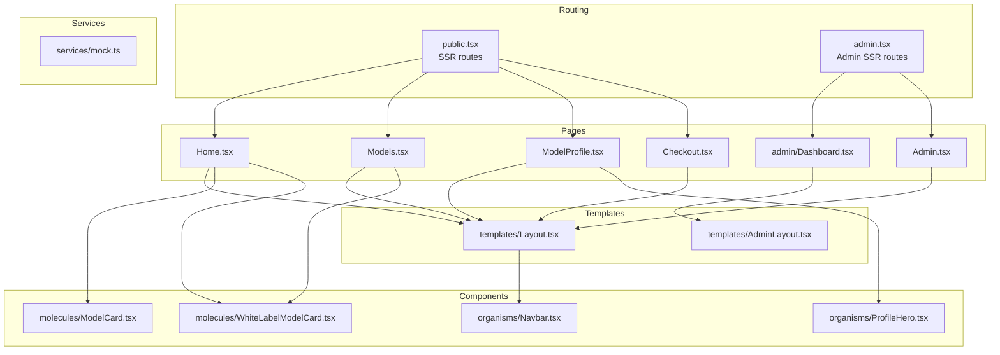
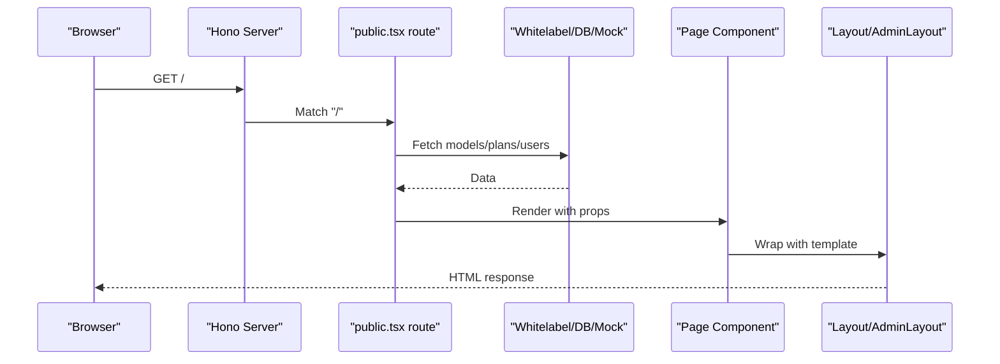
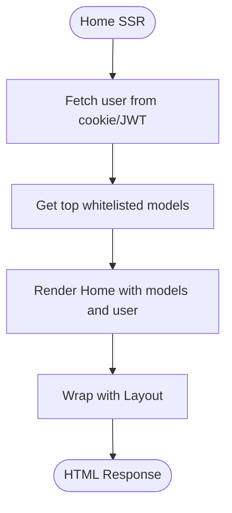
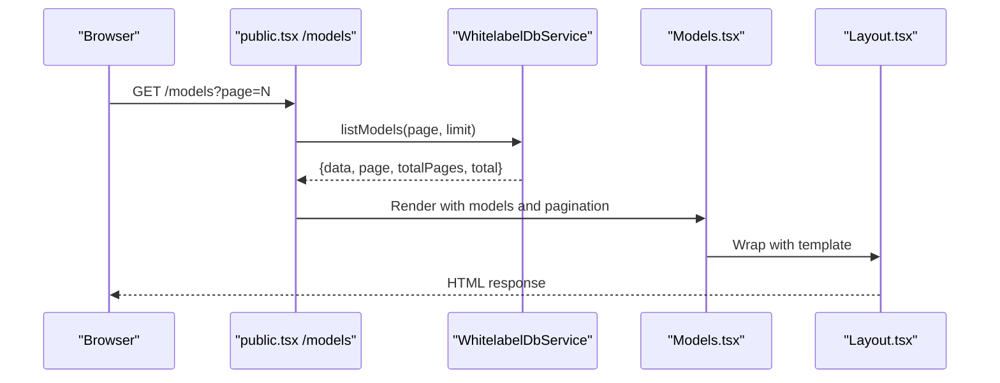
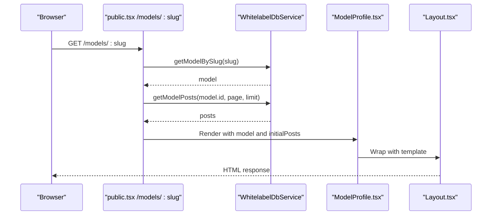
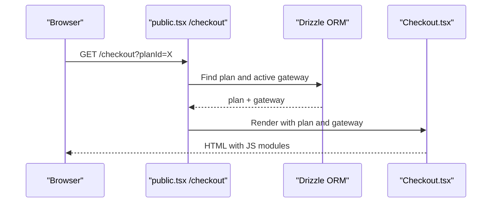
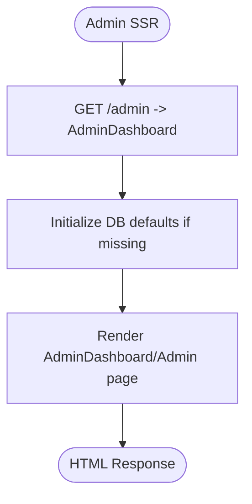
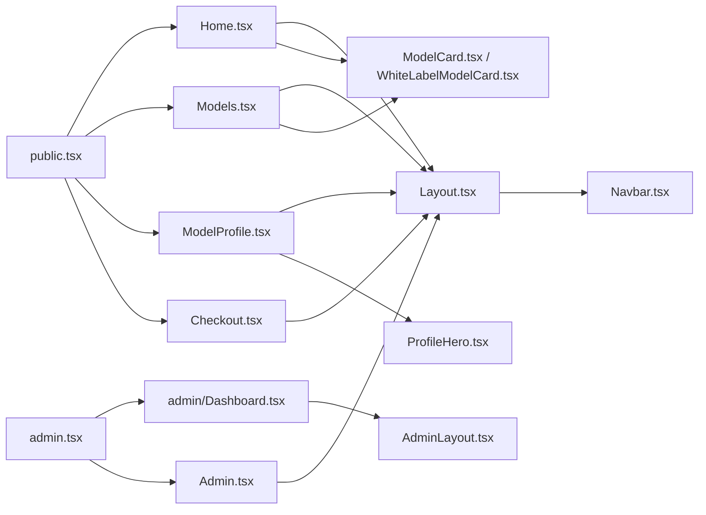

# Page Components

<cite>
**Referenced Files in This Document**
- [src/pages/Home.tsx](file://src/pages/Home.tsx)
- [src/pages/ModelProfile.tsx](file://src/pages/ModelProfile.tsx)
- [src/pages/Models.tsx](file://src/pages/Models.tsx)
- [src/pages/Checkout.tsx](file://src/pages/Checkout.tsx)
- [src/pages/admin/Dashboard.tsx](file://src/pages/admin/Dashboard.tsx)
- [src/pages/Admin.tsx](file://src/pages/Admin.tsx)
- [src/components/templates/Layout.tsx](file://src/components/templates/Layout.tsx)
- [src/components/templates/AdminLayout.tsx](file://src/components/templates/AdminLayout.tsx)
- [src/components/organisms/Navbar.tsx](file://src/components/organisms/Navbar.tsx)
- [src/components/organisms/ProfileHero.tsx](file://src/components/organisms/ProfileHero.tsx)
- [src/components/molecules/ModelCard.tsx](file://src/components/molecules/ModelCard.tsx)
- [src/components/molecules/WhiteLabelModelCard.tsx](file://src/components/molecules/WhiteLabelModelCard.tsx)
- [src/services/mock.ts](file://src/services/mock.ts)
- [src/routes/public.tsx](file://src/routes/public.tsx)
- [src/routes/admin.tsx](file://src/routes/admin.tsx)
</cite>

## Table of Contents
1. [Introduction](#introduction)
2. [Project Structure](#project-structure)
3. [Core Components](#core-components)
4. [Architecture Overview](#architecture-overview)
5. [Detailed Component Analysis](#detailed-component-analysis)
6. [Dependency Analysis](#dependency-analysis)
7. [Performance Considerations](#performance-considerations)
8. [Troubleshooting Guide](#troubleshooting-guide)
9. [Conclusion](#conclusion)
10. [Appendices](#appendices)

## Introduction
This document explains CreatorFlix’s frontend page components and their implementation patterns. It covers landing pages, model profiles, content discovery interfaces, checkout flows, and administrative dashboards. You will learn how pages compose reusable components, how data is fetched and passed server-side via Hono JSX, how user interactions work, and how SSR and SEO are handled. The guide also documents page-specific features such as content filtering, payment processing, and administrative controls, along with responsive design and cross-page consistency.

## Project Structure
CreatorFlix organizes pages under src/pages, shared UI building blocks under src/components (atoms, molecules, organisms, templates), routing under src/routes, and data services under src/services. Pages render with Hono JSX and are embedded into HTML templates via Layout components. Routes in src/routes/public.tsx and src/routes/admin.tsx orchestrate SSR rendering and data preparation.

**Diagram sources**
- [src/routes/public.tsx](file://src/routes/public.tsx#L54-L165)
- [src/routes/admin.tsx](file://src/routes/admin.tsx#L18-L155)
- [src/pages/Home.tsx](file://src/pages/Home.tsx#L22-L96)
- [src/pages/Models.tsx](file://src/pages/Models.tsx#L16-L55)
- [src/pages/ModelProfile.tsx](file://src/pages/ModelProfile.tsx#L15-L49)
- [src/pages/Checkout.tsx](file://src/pages/Checkout.tsx#L19-L73)
- [src/pages/admin/Dashboard.tsx](file://src/pages/admin/Dashboard.tsx#L5-L84)
- [src/pages/Admin.tsx](file://src/pages/Admin.tsx#L26-L106)
- [src/components/templates/Layout.tsx](file://src/components/templates/Layout.tsx#L17-L55)
- [src/components/templates/AdminLayout.tsx](file://src/components/templates/AdminLayout.tsx#L9-L63)
- [src/components/organisms/Navbar.tsx](file://src/components/organisms/Navbar.tsx#L14-L116)
- [src/components/organisms/ProfileHero.tsx](file://src/components/organisms/ProfileHero.tsx#L8-L23)
- [src/components/molecules/ModelCard.tsx](file://src/components/molecules/ModelCard.tsx#L12-L68)
- [src/components/molecules/WhiteLabelModelCard.tsx](file://src/components/molecules/WhiteLabelModelCard.tsx#L10-L47)
- [src/services/mock.ts](file://src/services/mock.ts#L1-L193)

**Section sources**
- [src/routes/public.tsx](file://src/routes/public.tsx#L1-L170)
- [src/routes/admin.tsx](file://src/routes/admin.tsx#L1-L158)
- [src/pages/Home.tsx](file://src/pages/Home.tsx#L1-L97)
- [src/pages/Models.tsx](file://src/pages/Models.tsx#L1-L56)
- [src/pages/ModelProfile.tsx](file://src/pages/ModelProfile.tsx#L1-L51)
- [src/pages/Checkout.tsx](file://src/pages/Checkout.tsx#L1-L74)
- [src/pages/admin/Dashboard.tsx](file://src/pages/admin/Dashboard.tsx#L1-L85)
- [src/pages/Admin.tsx](file://src/pages/Admin.tsx#L1-L107)
- [src/components/templates/Layout.tsx](file://src/components/templates/Layout.tsx#L1-L56)
- [src/components/templates/AdminLayout.tsx](file://src/components/templates/AdminLayout.tsx#L1-L64)
- [src/components/organisms/Navbar.tsx](file://src/components/organisms/Navbar.tsx#L1-L117)
- [src/components/organisms/ProfileHero.tsx](file://src/components/organisms/ProfileHero.tsx#L1-L24)
- [src/components/molecules/ModelCard.tsx](file://src/components/molecules/ModelCard.tsx#L1-L69)
- [src/components/molecules/WhiteLabelModelCard.tsx](file://src/components/molecules/WhiteLabelModelCard.tsx#L1-L48)
- [src/services/mock.ts](file://src/services/mock.ts#L1-L193)

## Core Components
- Layout and AdminLayout: Provide consistent HTML shells, fonts, styles, and global UI scaffolding for public and admin pages respectively.
- Navbar: Implements responsive header with search, CTA, and user account dropdown.
- Model cards: Render model entries with lazy images, live badges, promoted indicators, and slugged links.
- ProfileHero: Renders cinematic profile banners with overlay actions.

These components are composed by pages to deliver cohesive experiences across CreatorFlix.

**Section sources**
- [src/components/templates/Layout.tsx](file://src/components/templates/Layout.tsx#L17-L55)
- [src/components/templates/AdminLayout.tsx](file://src/components/templates/AdminLayout.tsx#L9-L63)
- [src/components/organisms/Navbar.tsx](file://src/components/organisms/Navbar.tsx#L14-L116)
- [src/components/molecules/ModelCard.tsx](file://src/components/molecules/ModelCard.tsx#L12-L68)
- [src/components/molecules/WhiteLabelModelCard.tsx](file://src/components/molecules/WhiteLabelModelCard.tsx#L10-L47)
- [src/components/organisms/ProfileHero.tsx](file://src/components/organisms/ProfileHero.tsx#L8-L23)

## Architecture Overview
CreatorFlix uses Hono for SSR. Routes fetch data (either from the database or mock service), prepare props, and render pages with Hono JSX inside Layout templates. Pages are thin compositions of components. Navigation is client-driven via HTMX in the base template and direct anchor links for internal navigation.

**Diagram sources**
- [src/routes/public.tsx](file://src/routes/public.tsx#L54-L64)
- [src/pages/Home.tsx](file://src/pages/Home.tsx#L22-L96)
- [src/components/templates/Layout.tsx](file://src/components/templates/Layout.tsx#L17-L55)

**Section sources**
- [src/routes/public.tsx](file://src/routes/public.tsx#L1-L170)
- [src/components/templates/Layout.tsx](file://src/components/templates/Layout.tsx#L17-L55)

## Detailed Component Analysis

### Landing Page (Home)
- Composition pattern:
  - Uses Layout to wrap content.
  - Renders HeroCarousel, TrendingSideColumn, AdBanner, tag filters, and two model grids (featured and reverse-ordered).
  - Uses WhiteLabelModelCard for real data and ModelCard for mock-based sections.
- Data fetching strategy:
  - SSR route fetches top whitelisted models and passes them as props to the page.
  - MockService supplies trending, sponsored, and hero slides for auxiliary content.
- User interaction flows:
  - Tag filters are interactive buttons; navigation to model profiles uses slugged links.
- SEO and SSR:
  - Title set via Layout; content rendered server-side for fast TTFB and SEO-friendly markup.

**Diagram sources**
- [src/routes/public.tsx](file://src/routes/public.tsx#L54-L64)
- [src/pages/Home.tsx](file://src/pages/Home.tsx#L22-L96)
- [src/components/templates/Layout.tsx](file://src/components/templates/Layout.tsx#L17-L55)

**Section sources**
- [src/pages/Home.tsx](file://src/pages/Home.tsx#L11-L96)
- [src/services/mock.ts](file://src/services/mock.ts#L1-L57)
- [src/routes/public.tsx](file://src/routes/public.tsx#L54-L64)

### Model Discovery (Models)
- Composition pattern:
  - Uses Layout with a FilterBar and Pagination.
  - Renders a responsive grid of WhiteLabelModelCard entries.
  - Includes top banner ad and a native ad block for VIP models.
- Data fetching strategy:
  - SSR route paginates whitelisted models and passes pagination metadata.
- Filtering and navigation:
  - FilterBar component provides category/tag filters; cards link to model profiles.

**Diagram sources**
- [src/routes/public.tsx](file://src/routes/public.tsx#L81-L101)
- [src/pages/Models.tsx](file://src/pages/Models.tsx#L16-L55)
- [src/components/templates/Layout.tsx](file://src/components/templates/Layout.tsx#L17-L55)

**Section sources**
- [src/pages/Models.tsx](file://src/pages/Models.tsx#L10-L55)
- [src/routes/public.tsx](file://src/routes/public.tsx#L81-L101)

### Model Profile
- Composition pattern:
  - Uses Layout with a cinematic ProfileHero and ProfileSummary.
  - BioSection and PostFeed are arranged side-by-side on large screens.
  - TabSelector toggles feed tabs; PostFeed renders posts with lazy carousels.
- Data fetching strategy:
  - SSR route resolves model by slug and preloads initial posts.
- SEO and SSR:
  - Title customized per profile; content server-rendered for SEO.

**Diagram sources**
- [src/routes/public.tsx](file://src/routes/public.tsx#L66-L78)
- [src/pages/ModelProfile.tsx](file://src/pages/ModelProfile.tsx#L15-L49)
- [src/components/templates/Layout.tsx](file://src/components/templates/Layout.tsx#L17-L55)
- [src/components/organisms/ProfileHero.tsx](file://src/components/organisms/ProfileHero.tsx#L8-L23)

**Section sources**
- [src/pages/ModelProfile.tsx](file://src/pages/ModelProfile.tsx#L9-L49)
- [src/routes/public.tsx](file://src/routes/public.tsx#L66-L78)

### Checkout Flow
- Composition pattern:
  - Single HTML page with three steps: identification, payment, and success.
  - CheckoutHeader, StepIdentification, StepPayment, StepSuccess, and OrderSummary.
  - Uses third-party scripts (e.g., IMask) and a modular checkout-core.js.
- Data fetching strategy:
  - SSR route validates plan existence and fetches active gateway; props include plan and gateway.
- User interaction flows:
  - Form submission is disabled at the form level; checkout-core.js handles step transitions and masking.

**Diagram sources**
- [src/routes/public.tsx](file://src/routes/public.tsx#L146-L165)
- [src/pages/Checkout.tsx](file://src/pages/Checkout.tsx#L19-L73)

**Section sources**
- [src/pages/Checkout.tsx](file://src/pages/Checkout.tsx#L8-L73)
- [src/routes/public.tsx](file://src/routes/public.tsx#L146-L165)

### Administrative Dashboard
- Composition pattern:
  - AdminLayout wraps content with sidebar and header.
  - AdminDashboard displays metrics and charts using StatCard and chart bars.
- Data fetching strategy:
  - Admin routes initialize defaults (plans, gateways, support contacts) and render admin pages.
- Controls:
  - Admin dashboard includes activity logs and chart visuals; admin legacy page demonstrates a different layout.

**Diagram sources**
- [src/routes/admin.tsx](file://src/routes/admin.tsx#L18-L48)
- [src/pages/admin/Dashboard.tsx](file://src/pages/admin/Dashboard.tsx#L5-L84)
- [src/pages/Admin.tsx](file://src/pages/Admin.tsx#L26-L106)
- [src/components/templates/AdminLayout.tsx](file://src/components/templates/AdminLayout.tsx#L9-L63)

**Section sources**
- [src/pages/admin/Dashboard.tsx](file://src/pages/admin/Dashboard.tsx#L1-L85)
- [src/pages/Admin.tsx](file://src/pages/Admin.tsx#L1-L107)
- [src/routes/admin.tsx](file://src/routes/admin.tsx#L18-L83)

## Dependency Analysis
- Pages depend on:
  - Layout/AdminLayout for HTML scaffolding.
  - Components for UI composition (cards, heroes, nav).
  - Services for data (mock or whitelabel/db).
- Routes orchestrate SSR:
  - public.tsx for public pages (home, models, profile, checkout, plans).
  - admin.tsx for admin pages and data initialization.
- Navigation patterns:
  - Internal links to models/profiles; external scripts loaded conditionally for checkout.

**Diagram sources**
- [src/routes/public.tsx](file://src/routes/public.tsx#L1-L170)
- [src/routes/admin.tsx](file://src/routes/admin.tsx#L1-L158)
- [src/pages/Home.tsx](file://src/pages/Home.tsx#L1-L97)
- [src/pages/Models.tsx](file://src/pages/Models.tsx#L1-L56)
- [src/pages/ModelProfile.tsx](file://src/pages/ModelProfile.tsx#L1-L51)
- [src/pages/Checkout.tsx](file://src/pages/Checkout.tsx#L1-L74)
- [src/pages/admin/Dashboard.tsx](file://src/pages/admin/Dashboard.tsx#L1-L85)
- [src/pages/Admin.tsx](file://src/pages/Admin.tsx#L1-L107)
- [src/components/templates/Layout.tsx](file://src/components/templates/Layout.tsx#L1-L56)
- [src/components/templates/AdminLayout.tsx](file://src/components/templates/AdminLayout.tsx#L1-L64)
- [src/components/organisms/Navbar.tsx](file://src/components/organisms/Navbar.tsx#L1-L117)
- [src/components/organisms/ProfileHero.tsx](file://src/components/organisms/ProfileHero.tsx#L1-L24)
- [src/components/molecules/ModelCard.tsx](file://src/components/molecules/ModelCard.tsx#L1-L69)
- [src/components/molecules/WhiteLabelModelCard.tsx](file://src/components/molecules/WhiteLabelModelCard.tsx#L1-L48)

**Section sources**
- [src/routes/public.tsx](file://src/routes/public.tsx#L1-L170)
- [src/routes/admin.tsx](file://src/routes/admin.tsx#L1-L158)

## Performance Considerations
- SSR rendering:
  - Pages render server-side via Hono JSX, reducing client work and improving initial load.
- Lazy loading:
  - Images in cards use lazy loading attributes to defer offscreen assets.
- Minimal client-side scripts:
  - Checkout loads only necessary third-party libraries and a dedicated core module.
- Responsive design:
  - Tailwind utilities and grid layouts adapt to mobile, tablet, and desktop breakpoints.
- CDN/static assets:
  - Styles and JS are served as static resources for caching and fast delivery.

[No sources needed since this section provides general guidance]

## Troubleshooting Guide
- Authentication and user context:
  - Routes extract a JWT from cookies, verify it, and hydrate user data. Failures return null user gracefully.
- NotFound handling:
  - Model profile route returns 404 when model lookup fails.
- Plan validation:
  - Checkout route redirects to plans if planId is missing or invalid.
- Admin defaults:
  - Admin routes initialize default plans, gateways, and support contacts if missing.

**Section sources**
- [src/routes/public.tsx](file://src/routes/public.tsx#L20-L51)
- [src/routes/public.tsx](file://src/routes/public.tsx#L72-L72)
- [src/routes/public.tsx](file://src/routes/public.tsx#L149-L157)
- [src/routes/admin.tsx](file://src/routes/admin.tsx#L23-L41)
- [src/routes/admin.tsx](file://src/routes/admin.tsx#L53-L59)
- [src/routes/admin.tsx](file://src/routes/admin.tsx#L73-L80)

## Conclusion
CreatorFlix’s pages are thin, SSR-driven compositions that rely on reusable components and robust routing. Data fetching occurs server-side, ensuring SEO-friendly markup and fast performance. The checkout flow is modularized with clear separation of concerns, while admin dashboards provide operational insights and controls. Consistent layouts and component libraries maintain cross-page design coherence and responsiveness.

[No sources needed since this section summarizes without analyzing specific files]

## Appendices
- SEO and SSR:
  - Layout sets page titles and loads fonts/styles; pages render structured HTML for discoverability.
- Navigation:
  - Navbar adapts CTAs based on user subscription status; internal links navigate between pages.
- Content filtering:
  - Models page includes a filter bar and pagination; Home page includes tag-based filters.

**Section sources**
- [src/components/templates/Layout.tsx](file://src/components/templates/Layout.tsx#L17-L55)
- [src/components/organisms/Navbar.tsx](file://src/components/organisms/Navbar.tsx#L50-L54)
- [src/pages/Models.tsx](file://src/pages/Models.tsx#L20-L55)
- [src/pages/Home.tsx](file://src/pages/Home.tsx#L48-L55)