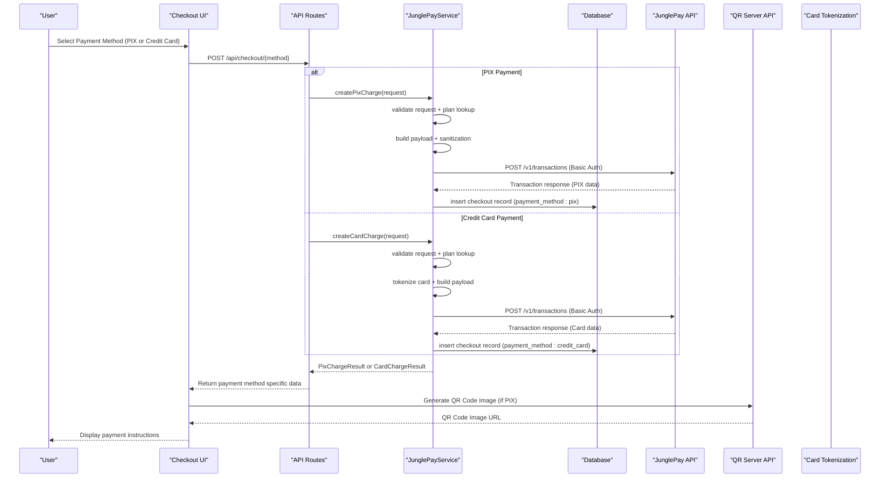
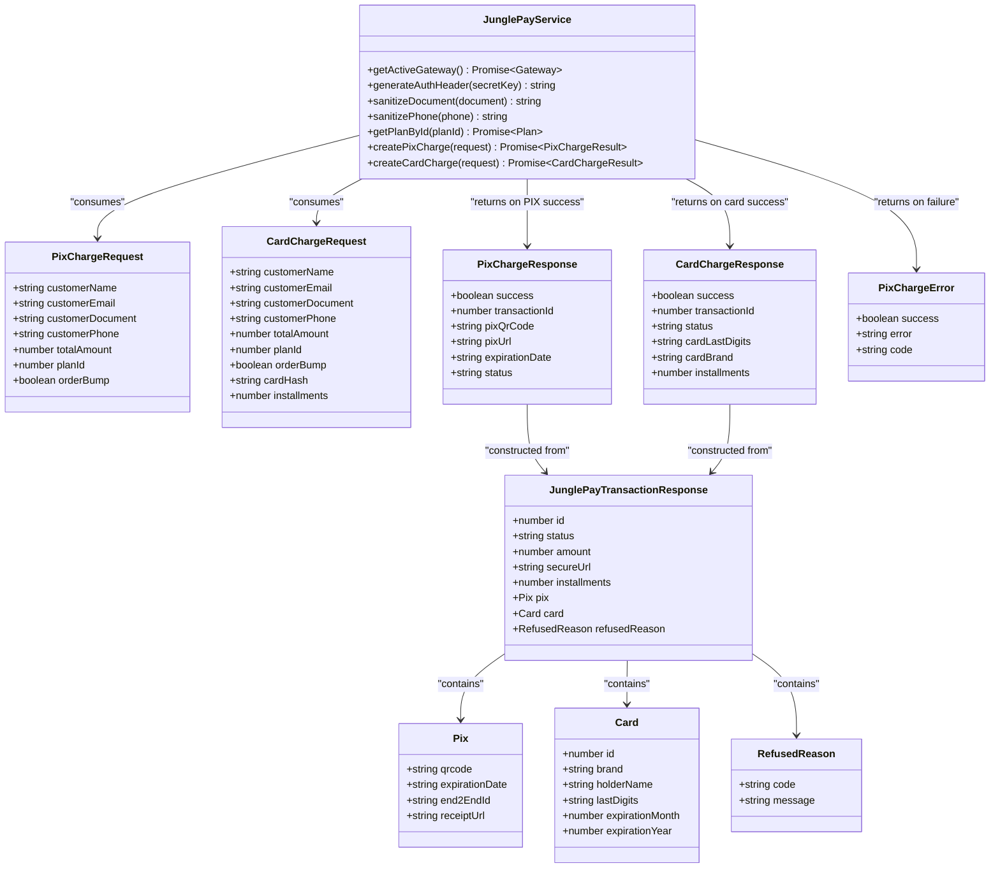
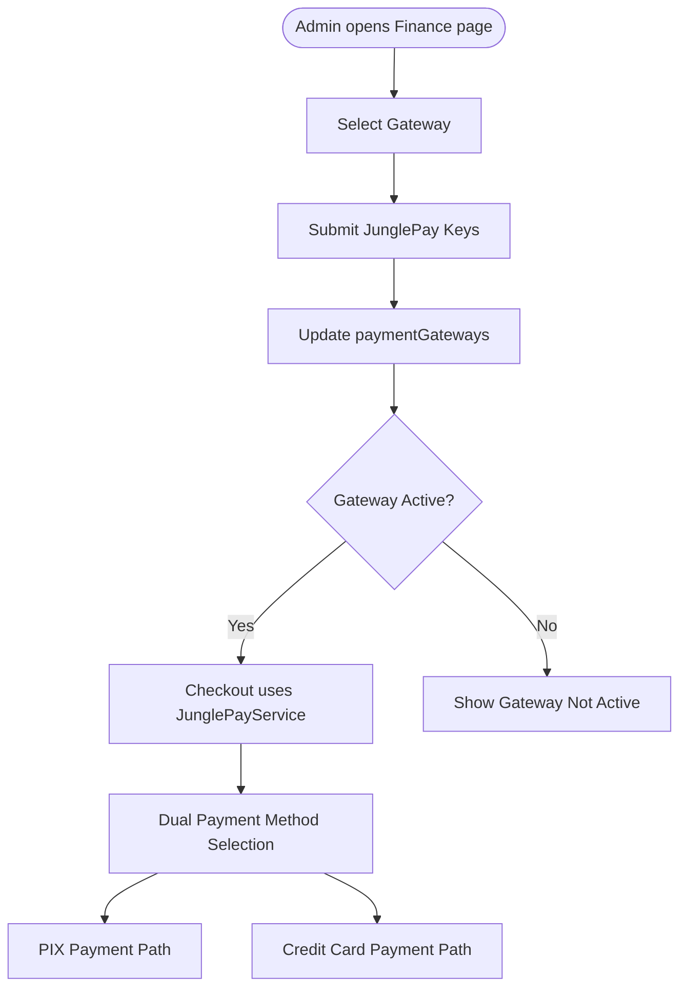
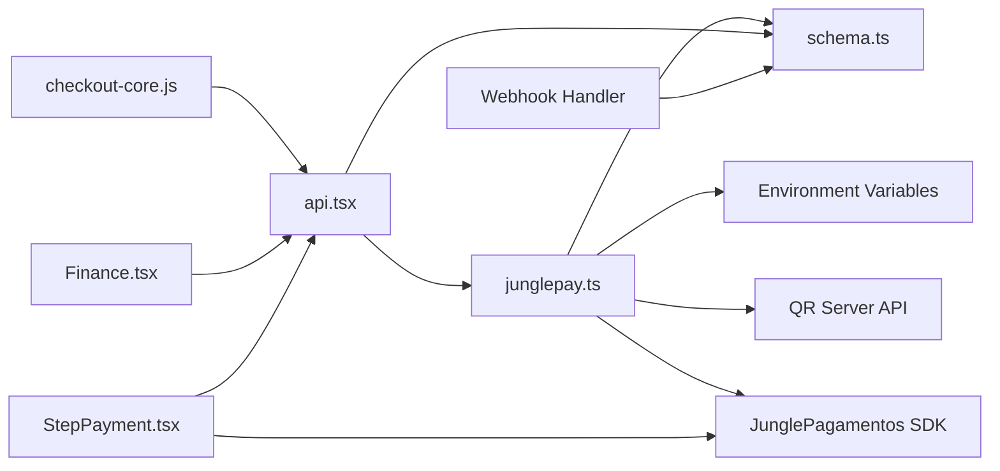

# JunglePay Gateway Integration

<cite>
**Referenced Files in This Document**
- [junglepay.ts](file://src/services/junglepay.ts)
- [schema.ts](file://src/db/schema.ts)
- [api.tsx](file://src/routes/api.tsx)
- [checkout-core.js](file://static/js/checkout-core.js)
- [Checkout.tsx](file://src/pages/Checkout.tsx)
- [Finance.tsx](file://src/pages/admin/Finance.tsx)
- [StepPayment.tsx](file://src/components/organisms/StepPayment.tsx)
- [junglepay-documentation.md](file://junglepay-documentation.md)
- [package.json](file://package.json)
- [drizzle.config.ts](file://drizzle.config.ts)
- [0006_overconfident_titania.sql](file://drizzle/0006_overconfident_titania.sql)
</cite>

## Update Summary
**Changes Made**
- Added comprehensive credit card payment system integration with JunglePay
- Updated JunglePayService class to support both PIX and credit card payment methods
- Added new credit card processing capabilities including card tokenization, installment options, and enhanced error handling
- Updated API endpoints to include /api/checkout/card for credit card processing
- Enhanced frontend checkout integration with dual payment method support (PIX and credit card)
- Expanded database schema to support credit card payment method tracking
- Updated webhook processing to handle both PIX and credit card transaction states
- Added detailed implementation of card tokenization workflow and installment calculation

## Table of Contents
1. [Introduction](#introduction)
2. [Project Structure](#project-structure)
3. [Core Components](#core-components)
4. [Architecture Overview](#architecture-overview)
5. [Detailed Component Analysis](#detailed-component-analysis)
6. [Payment Methods Implementation](#payment-methods-implementation)
7. [Credit Card Payment System](#credit-card-payment-system)
8. [Frontend Integration](#frontend-integration)
9. [Webhook Processing](#webhook-processing)
10. [Dependency Analysis](#dependency-analysis)
11. [Performance Considerations](#performance-considerations)
12. [Troubleshooting Guide](#troubleshooting-guide)
13. [Conclusion](#conclusion)

## Introduction
This document explains the complete JunglePay gateway integration for a subscription-based platform, covering both PIX and credit card payment methods. The integration encompasses the comprehensive JunglePayService class implementation, authentication using Basic Auth, API endpoint configuration, gateway activation workflow, secret key management, credential sanitization, and the complete transaction lifecycle from initiation to completion. It documents PIX charge creation, payload construction, QR code generation, credit card tokenization, installment processing, response handling, error handling strategies, and database integration with status tracking.

## Project Structure
The integration spans backend services, database schema, frontend checkout flow, and administrative configuration screens. Key areas:
- Backend service: JunglePayService encapsulates all gateway logic including PIX and credit card payment processing
- API routes: Hono-based endpoints for checkout, PIX creation, credit card processing, and webhooks
- Frontend: Checkout page with dual payment method selection and real-time payment monitoring
- Database: Drizzle ORM schema with payment gateways, plans, subscriptions, and checkouts supporting both payment methods
- Admin: Finance page to configure JunglePay credentials and activate the gateway

```mermaid
graph TB
subgraph "Frontend"
UI["Checkout Page<br/>Checkout.tsx"]
JS["Checkout Core<br/>checkout-core.js"]
StepPayment["Payment Selection<br/>StepPayment.tsx"]
CardFields["Card Fields & Installments<br/>StepPayment.tsx"]
QR["QR Code Generation<br/>PIX Display"]
End
subgraph "Backend"
API["API Routes<br/>api.tsx"]
SVC["JunglePay Service<br/>junglepay.ts"]
DB["Database Schema<br/>schema.ts"]
WEBHOOK["Webhook Processing<br/>Real-time Updates"]
END
subgraph "External"
JUNG["JunglePay API"]
QRGEN["QR Server API"]
TOKEN["Card Tokenization<br/>JunglePagamentos.encrypt()"]
END
UI --> JS
JS --> API
API --> SVC
SVC --> DB
SVC --> JUNG
SVC --> TOKEN
API --> WEBHOOK
WEBHOOK --> DB
QR --> QRGEN
```

**Diagram sources**
- [Checkout.tsx](file://src/pages/Checkout.tsx#L1-L86)
- [checkout-core.js](file://static/js/checkout-core.js#L1-L472)
- [StepPayment.tsx](file://src/components/organisms/StepPayment.tsx#L1-L82)
- [api.tsx](file://src/routes/api.tsx#L1-L569)
- [junglepay.ts](file://src/services/junglepay.ts#L1-L487)
- [schema.ts](file://src/db/schema.ts#L1-L178)

**Section sources**
- [junglepay.ts](file://src/services/junglepay.ts#L1-L487)
- [api.tsx](file://src/routes/api.tsx#L1-L569)
- [schema.ts](file://src/db/schema.ts#L1-L178)
- [checkout-core.js](file://static/js/checkout-core.js#L1-L472)
- [Checkout.tsx](file://src/pages/Checkout.tsx#L1-L86)
- [StepPayment.tsx](file://src/components/organisms/StepPayment.tsx#L1-L82)

## Core Components
- **JunglePayService**: Implements gateway activation checks, Basic Auth generation, data sanitization, plan lookup, PIX charge creation, credit card charge creation, payload construction, API communication, response validation, and checkout record creation for both payment methods.
- **API Routes**: Expose endpoints for processing checkout (PIX and credit card), creating charges, and receiving JunglePay webhooks.
- **Database Schema**: Defines paymentGateways, plans, subscriptions, and checkouts tables with appropriate relations supporting both payment methods.
- **Frontend Checkout**: Collects customer data, handles dual payment method selection, generates QR codes for PIX, and manages card fields for credit card payments.
- **Admin Finance**: Manages gateway activation and JunglePay secret/public keys.

**Section sources**
- [junglepay.ts](file://src/services/junglepay.ts#L90-L487)
- [api.tsx](file://src/routes/api.tsx#L41-L136)
- [schema.ts](file://src/db/schema.ts#L29-L127)
- [checkout-core.js](file://static/js/checkout-core.js#L266-L431)
- [Finance.tsx](file://src/pages/admin/Finance.tsx#L18-L111)

## Architecture Overview
The system follows a layered architecture with real-time webhook processing and dual payment method support:
- Presentation Layer: Checkout UI with dual payment method selection and real-time status updates
- Application Layer: Hono routes and service logic with webhook handlers for both payment methods
- Domain Layer: Business logic for payment processing including PIX QR code generation and credit card tokenization
- Persistence Layer: PostgreSQL via Drizzle ORM
- External Integration: JunglePay API with QR code generation and card tokenization capabilities



**Diagram sources**
- [checkout-core.js](file://static/js/checkout-core.js#L266-L275)
- [api.tsx](file://src/routes/api.tsx#L41-L136)
- [junglepay.ts](file://src/services/junglepay.ts#L145-L487)
- [schema.ts](file://src/db/schema.ts#L113-L127)

## Detailed Component Analysis

### JunglePayService Implementation
Responsibilities:
- Activation and configuration checks
- Basic Auth header generation
- Data sanitization for CPF and phone
- Plan retrieval and payload assembly
- API call to JunglePay transactions endpoint
- Response validation and checkout record creation for both payment methods
- Error classification and standardized responses

Key methods and behaviors:
- **getActiveGateway()**: Queries paymentGateways table for JunglePay and verifies isActive flag and secretKey presence.
- **generateAuthHeader(secretKey)**: Creates Basic Auth header using Base64 encoding of "secretKey:x".
- **sanitizeDocument(document)**: Removes non-digit characters from CPF.
- **sanitizePhone(phone)**: Removes non-digit characters from phone.
- **getPlanById(planId)**: Retrieves plan details for payload construction.
- **createPixCharge(request)**: Orchestrates the entire PIX flow from validation to API call and checkout persistence.
- **createCardCharge(request)**: Orchestrates the entire credit card flow including tokenization, validation, and checkout persistence.

Error handling:
- Gateway not configured or inactive
- Missing secret key
- Invalid customer data or amount
- Plan not found
- Card tokenization failures
- API HTTP errors and unexpected responses
- Network exceptions during fetch
- Card refusal handling with specific error codes

Response handling:
- On success: Returns transactionId, payment method specific data, and status.
- On failure: Returns standardized error with code for client-side handling.

**Section sources**
- [junglepay.ts](file://src/services/junglepay.ts#L90-L487)

#### Class Diagram


**Diagram sources**
- [junglepay.ts](file://src/services/junglepay.ts#L7-L86)

### Authentication Mechanisms Using Basic Auth
- Secret key is used to construct credentials "secretKey:x"
- Base64 encoding produces the Basic scheme value
- Authorization header is sent with every transaction request to JunglePay
- Admin page allows updating secret/public keys for JunglePay

**Section sources**
- [junglepay.ts](file://src/services/junglepay.ts#L108-L113)
- [Finance.tsx](file://src/pages/admin/Finance.tsx#L66-L107)
- [junglepay-documentation.md](file://junglepay-documentation.md#L11-L25)

### API Endpoint Configuration
Endpoints:
- **POST /api/checkout/pix**: Validates request and delegates to JunglePayService.createPixCharge
- **POST /api/checkout/card**: Validates request and delegates to JunglePayService.createCardCharge
- **POST /api/webhook/junglepay**: Processes JunglePay webhook events and updates subscriptions and checkouts
- **POST /api/admin/finance/junglepay**: Updates JunglePay credentials
- **POST /api/admin/finance/gateway**: Activates selected gateway

Status codes:
- 400 for INVALID_DATA
- 402 for CARD_REFUSED (specific to credit card payments)
- 503 for GATEWAY_NOT_CONFIGURED and GATEWAY_INACTIVE
- 500 for API_ERROR and UNEXPECTED_RESPONSE

**Section sources**
- [api.tsx](file://src/routes/api.tsx#L41-L86)
- [api.tsx](file://src/routes/api.tsx#L88-L136)
- [api.tsx](file://src/routes/api.tsx#L138-L220)
- [api.tsx](file://src/routes/api.tsx#L222-L266)
- [api.tsx](file://src/routes/api.tsx#L222-L244)

### Gateway Activation Workflow
- Admin selects "JunglePay (Checkout Interno)" as active gateway
- Admin submits secret/public keys
- Backend updates paymentGateways table
- Frontend checkout route uses JunglePayService.createPixCharge or createCardCharge when gateway is active



**Diagram sources**
- [Finance.tsx](file://src/pages/admin/Finance.tsx#L36-L60)
- [api.tsx](file://src/routes/api.tsx#L222-L244)
- [junglepay.ts](file://src/services/junglepay.ts#L95-L103)
- [StepPayment.tsx](file://src/components/organisms/StepPayment.tsx#L28-L46)

**Section sources**
- [Finance.tsx](file://src/pages/admin/Finance.tsx#L18-L111)
- [api.tsx](file://src/routes/api.tsx#L222-L244)
- [junglepay.ts](file://src/services/junglepay.ts#L95-L103)
- [StepPayment.tsx](file://src/components/organisms/StepPayment.tsx#L28-L46)

### Secret Key Management and Credential Sanitization
- Secret key stored in paymentGateways.secretKey
- Public key optional for internal checkout flows
- Credentials sanitized before API requests:
  - CPF: digits only
  - Phone: digits only
- Admin page exposes password-protected input for secret key

**Section sources**
- [schema.ts](file://src/db/schema.ts#L29-L35)
- [junglepay.ts](file://src/services/junglepay.ts#L118-L127)
- [Finance.tsx](file://src/pages/admin/Finance.tsx#L90-L99)

## Payment Methods Implementation

### Dual Payment Method Support
The system now supports both PIX and credit card payment methods through a unified JunglePayService:

**Payment Method Types**:
- **PIX**: Instant payment with QR code generation
- **Credit Card**: Tokenized card payments with installment options

**Shared Processing Flow**:
- Gateway validation and configuration checks
- Customer data sanitization
- Plan lookup and item assembly
- Payment method specific payload construction
- API communication and response validation
- Checkout record creation with payment method tracking

**Section sources**
- [junglepay.ts](file://src/services/junglepay.ts#L90-L487)
- [schema.ts](file://src/db/schema.ts#L117-L118)

### PIX Payment Implementation

#### PIX Charge Creation Process
The PIX payment implementation follows a comprehensive workflow:

**Payload Construction**:
- paymentMethod: pix
- amount: totalAmount in cents
- customer: name, email, sanitized phone, document with type cpf
- items: plan item and optional order bump item
- pix: expiresInDays: 1
- postbackUrl: constructed from BASE_URL environment variable

**API Call Details**:
- Method: POST to https://api.junglepagamentos.com/v1/transactions
- Headers: Content-Type: application/json, Authorization: Basic <Base64(secretKey:x)>
- Response validation requires pix.qrcode presence

**Database Integration**:
- Checkout record inserted with payment_method: pix
- Customer information sanitized and stored
- Transaction ID stored for webhook correlation

**Section sources**
- [junglepay.ts](file://src/services/junglepay.ts#L202-L240)
- [junglepay.ts](file://src/services/junglepay.ts#L244-L273)
- [junglepay.ts](file://src/services/junglepay.ts#L276-L286)

#### Response Handling and Error Management
PIX response handling includes:
- Success case: Returns transactionId, pix QR code, secure URL, expiration date, and status
- Error cases: Standardized error codes with appropriate HTTP status mapping
- Validation: Ensures pix.qrcode presence in API response

**Section sources**
- [junglepay.ts](file://src/services/junglepay.ts#L289-L296)
- [junglepay.ts](file://src/services/junglepay.ts#L266-L273)
- [junglepay.ts](file://src/services/junglepay.ts#L298-L305)

### Credit Card Payment Implementation

#### Credit Card Charge Creation Process
The credit card payment implementation includes advanced tokenization and installment processing:

**Card Tokenization**:
- Uses JunglePagamentos.encrypt() for secure card data tokenization
- Frontend collects card details and generates hash via SDK
- Tokenized card data passed securely to backend

**Installment Options**:
- Supports 1x to 12x installments
- Dynamic installment calculation based on plan price
- Installment count passed to JunglePay API

**Payload Construction**:
- paymentMethod: credit_card
- amount: totalAmount in cents
- installments: request.installments || 1
- card: { hash: request.cardHash }
- customer: sanitized customer data
- items: plan item and optional order bump item
- postbackUrl: constructed from BASE_URL environment variable

**API Call Details**:
- Method: POST to https://api.junglepagamentos.com/v1/transactions
- Headers: Content-Type: application/json, Authorization: Basic <Base64(secretKey:x)>
- Response validation includes card data and status

**Database Integration**:
- Checkout record inserted with payment_method: credit_card
- Customer information sanitized and stored
- Transaction ID stored for webhook correlation
- Card brand and last digits stored for display

**Section sources**
- [junglepay.ts](file://src/services/junglepay.ts#L375-L415)
- [junglepay.ts](file://src/services/junglepay.ts#L417-L484)
- [junglepay.ts](file://src/services/junglepay.ts#L454-L465)

#### Card Tokenization Workflow
The card tokenization process involves secure frontend processing:

**Frontend Tokenization**:
- JunglePagamentos SDK loaded from JunglePay CDN
- Card details collected via masked input fields
- Tokenization performed using JunglePagamentos.encrypt()
- Hash validated before submission

**Backend Processing**:
- Tokenized card hash validated and processed
- Installment count validated (1-12)
- Payment processed through JunglePay API
- Response handled with card-specific data

**Section sources**
- [checkout-core.js](file://static/js/checkout-core.js#L313-L327)
- [checkout-core.js](file://static/js/checkout-core.js#L330-L341)
- [StepPayment.tsx](file://src/components/organisms/StepPayment.tsx#L48-L68)

#### Response Handling and Error Management
Credit card response handling includes:
- Success case: Returns transactionId, status, card brand, last digits, and installments
- Error cases: Standardized error codes including CARD_REFUSED
- Card refusal handling with specific error messages
- Validation: Ensures card data presence in API response

**Section sources**
- [junglepay.ts](file://src/services/junglepay.ts#L467-L475)
- [junglepay.ts](file://src/services/junglepay.ts#L443-L452)
- [junglepay.ts](file://src/services/junglepay.ts#L477-L484)

## Frontend Integration

### Dual Payment Method Checkout
The frontend checkout page provides comprehensive dual payment method experience:

**Payment Method Selection**:
- Radio button selection between PIX and Credit Card
- Dynamic form field visibility based on selection
- Real-time payment method switching

**Initialization**:
- Loads JunglePay SDK for card tokenization
- Sets up masked input fields for CPF and phone
- Initializes checkout state with pricing information
- Generates installment options for credit card payments

**Payment Flow**:
- Customer fills identification and contact information
- Selects payment method (PIX or Credit Card)
- For PIX: Calls /api/checkout/pix endpoint
- For Credit Card: Tokenizes card via SDK, then calls /api/checkout/card
- Receives payment method specific data with status information
- Generates QR code image using external QR server API (for PIX)

**Section sources**
- [Checkout.tsx](file://src/pages/Checkout.tsx#L21-L53)
- [checkout-core.js](file://static/js/checkout-core.js#L31-L43)
- [checkout-core.js](file://static/js/checkout-core.js#L308-L350)
- [StepPayment.tsx](file://src/components/organisms/StepPayment.tsx#L12-L18)

### JavaScript Payment Processing
The checkout-core.js handles the complete dual payment processing:

**State Management**:
- Tracks current step in checkout process
- Manages pricing calculations with optional order bump
- Stores JunglePay public key for SDK initialization
- Handles payment method switching logic

**Event Handling**:
- Form validation for required fields
- Payment method toggle between PIX and credit card
- Order bump selection with dynamic pricing
- Installment selection for credit card payments

**Payment Processing**:
- For PIX: Calls /api/checkout/pix endpoint with sanitized data
- For Credit Card: Calls JunglePagamentos.encrypt() for tokenization, then /api/checkout/card
- Handles successful payment responses with appropriate UI updates
- Provides error handling for failed payment creation

**Section sources**
- [checkout-core.js](file://static/js/checkout-core.js#L21-L43)
- [checkout-core.js](file://static/js/checkout-core.js#L186-L252)
- [checkout-core.js](file://static/js/checkout-core.js#L308-L350)
- [checkout-core.js](file://static/js/checkout-core.js#L352-L390)

### Installment Calculation
The frontend calculates and displays installment options dynamically:

**Installment Generation**:
- Generates 1x to 12x installment options
- Calculates monthly payment amount based on plan price
- Formats currency display with comma decimal separator
- Sets default to 1x installment

**UI Integration**:
- Dropdown select element for installment selection
- Real-time display of installment details
- Automatic recalculation when plan price changes

**Section sources**
- [StepPayment.tsx](file://src/components/organisms/StepPayment.tsx#L13-L18)
- [StepPayment.tsx](file://src/components/organisms/StepPayment.tsx#L56-L67)

## Webhook Processing

### Real-Time Transaction Updates
The webhook system provides real-time transaction status updates for both payment methods:

**Webhook Endpoint**:
- POST /api/webhook/junglepay processes JunglePay events
- Handles transaction status updates for both PIX and credit card payments
- Supports paid and waiting_payment states for all payment methods

**Processing Logic**:
- Validates webhook payload type (must be transaction)
- Extracts customer, status, amount, and payment method from payload
- Creates/activates subscriptions for paid transactions
- Updates user subscription status to active
- Marks checkout records as paid based on payment method

**State Management**:
- Paid status: Creates subscription, activates user, updates checkout
- Waiting payment: Logs transaction status for monitoring
- Unsupported status: Ignores and logs for debugging

**Section sources**
- [api.tsx](file://src/routes/api.tsx#L138-L220)
- [api.tsx](file://src/routes/api.tsx#L159-L205)

### Database Integration
Webhook processing integrates with the database for both payment methods:

**Subscription Creation**:
- Calculates start and end dates based on plan duration
- Creates subscription record with external transaction ID
- Sets subscription status to active immediately for paid transactions

**User Status Updates**:
- Updates user subscriptionStatus to 1 (active)
- Links subscription to user account
- Maintains audit trail with timestamps

**Checkout Updates**:
- Updates checkout records to paid status based on payment method
- Links checkout to user and plan information
- Provides correlation between checkout and transaction
- Handles both pix and credit_card payment methods

**Section sources**
- [api.tsx](file://src/routes/api.tsx#L179-L202)
- [schema.ts](file://src/db/schema.ts#L37-L46)

## Dependency Analysis
- JunglePayService depends on:
  - Database access via Drizzle ORM
  - Environment variables for BASE_URL
  - Fetch API for external calls
  - QR server API for QR code generation
  - JunglePagamentos SDK for card tokenization
- API routes depend on:
  - JunglePayService for business logic
  - Database for CRUD operations
  - Webhook processing for real-time updates
- Frontend depends on:
  - API routes for checkout and webhook handling
  - Admin routes for configuration
  - QR server API for payment visualization
  - JunglePagamentos SDK for card tokenization



**Diagram sources**
- [checkout-core.js](file://static/js/checkout-core.js#L404-L405)
- [api.tsx](file://src/routes/api.tsx#L1-L569)
- [junglepay.ts](file://src/services/junglepay.ts#L1-L487)
- [schema.ts](file://src/db/schema.ts#L1-L178)
- [StepPayment.tsx](file://src/components/organisms/StepPayment.tsx#L1-L82)

**Section sources**
- [package.json](file://package.json#L8-L22)
- [drizzle.config.ts](file://drizzle.config.ts#L1-L11)
- [0006_overconfident_titania.sql](file://drizzle/0006_overconfident_titania.sql#L1-L18)

## Performance Considerations
- Minimize network round-trips by batching validations and database writes
- Use connection pooling for database operations
- Cache frequently accessed plan data if needed
- Implement retry/backoff for transient API failures
- Keep payload minimal and only include required fields
- Optimize QR code generation caching for repeated displays
- Implement efficient webhook processing with proper error handling
- Cache JunglePay public key for card tokenization
- Use installment calculation caching for performance

## Troubleshooting Guide
Common issues and resolutions:
- **Gateway not configured or inactive**:
  - Verify paymentGateways row for JunglePay and isActive flag
  - Ensure secretKey is present
- **Invalid data errors**:
  - Confirm customerName, customerEmail, customerDocument, totalAmount, planId are provided and valid
  - For credit card: ensure cardHash and installments are provided
- **API communication failures**:
  - Check network connectivity and BASE_URL environment variable
  - Review Basic Auth header construction
- **Unexpected responses**:
  - Validate pix.qrcode presence in PIX response
  - Validate card data presence in credit card response
- **Webhook not activating subscription**:
  - Ensure webhook endpoint is reachable and correctly parses payloads
  - Verify user exists and plan amount matches
- **QR code generation failures**:
  - Check QR server API availability
  - Verify pix QR code URL construction
- **Frontend checkout issues**:
  - Ensure JunglePay SDK loads correctly
  - Verify public key configuration
  - Check browser console for JavaScript errors
- **Credit card tokenization failures**:
  - Verify JunglePagamentos SDK is loaded
  - Check card field validation and formatting
  - Ensure cardHash is properly generated and passed
- **Installment calculation errors**:
  - Verify plan price is correctly calculated
  - Check installment option generation logic
  - Ensure installment count is within 1-12 range

**Section sources**
- [junglepay.ts](file://src/services/junglepay.ts#L149-L171)
- [junglepay.ts](file://src/services/junglepay.ts#L174-L189)
- [junglepay.ts](file://src/services/junglepay.ts#L253-L261)
- [junglepay.ts](file://src/services/junglepay.ts#L340-L354)
- [junglepay.ts](file://src/services/junglepay.ts#L430-L438)
- [api.tsx](file://src/routes/api.tsx#L138-L220)
- [checkout-core.js](file://static/js/checkout-core.js#L404-L405)
- [checkout-core.js](file://static/js/checkout-core.js#L313-L327)

## Conclusion
The JunglePay integration provides a robust, secure, and auditable payment flow supporting both PIX and credit card transactions with comprehensive real-time processing capabilities. By centralizing validation, sanitization, and API communication in JunglePayService, leveraging webhook-driven state updates, implementing frontend QR code generation for PIX, and providing secure card tokenization for credit card payments, the system ensures reliable transaction lifecycle management with clear error handling and admin-controlled configuration. The complete implementation supports both internal checkout flows and external payment processing, providing flexibility for different deployment scenarios while maintaining security and compliance standards. The addition of credit card payment capabilities with tokenization and installment options significantly expands the platform's payment processing capabilities while maintaining the same high standards of security and reliability.