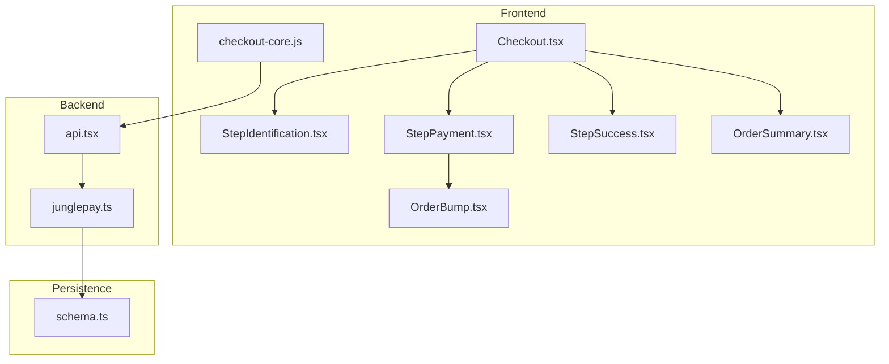
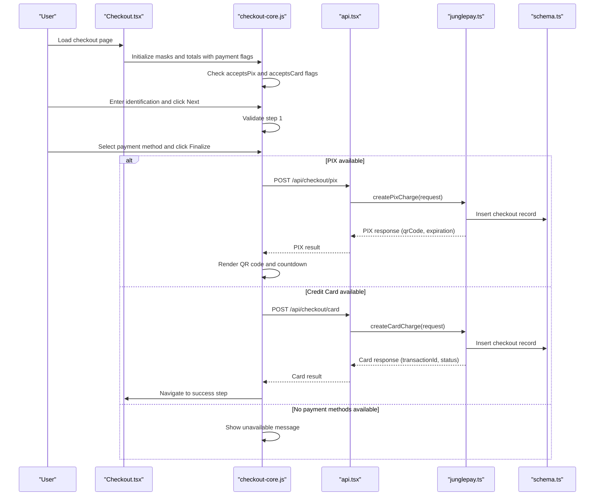
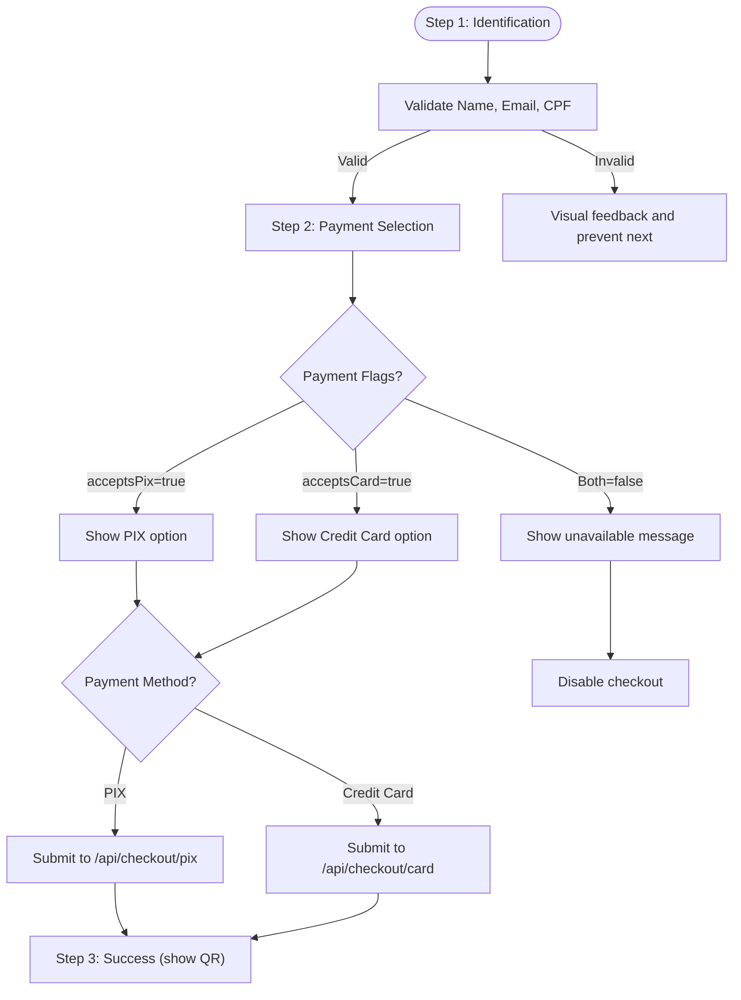
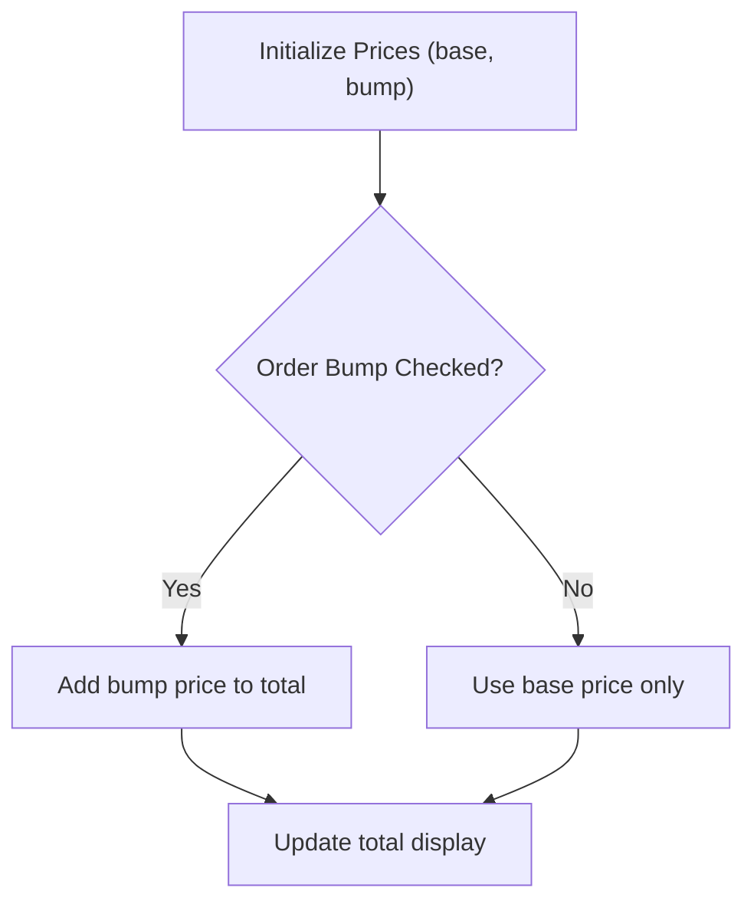
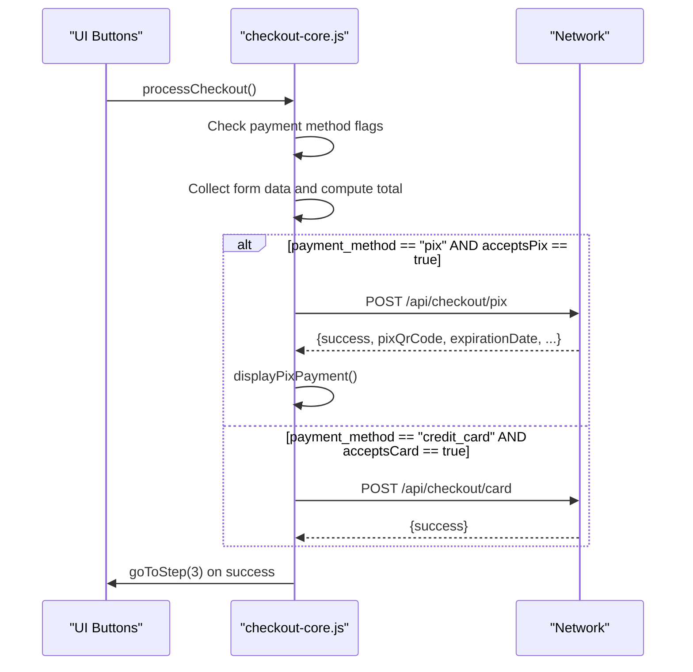
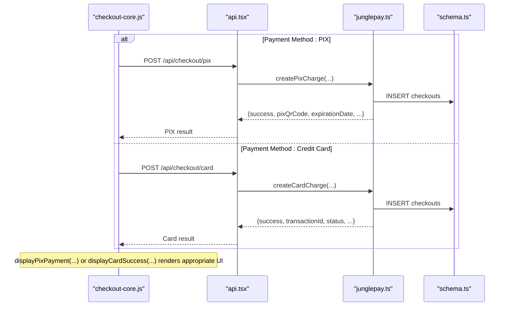
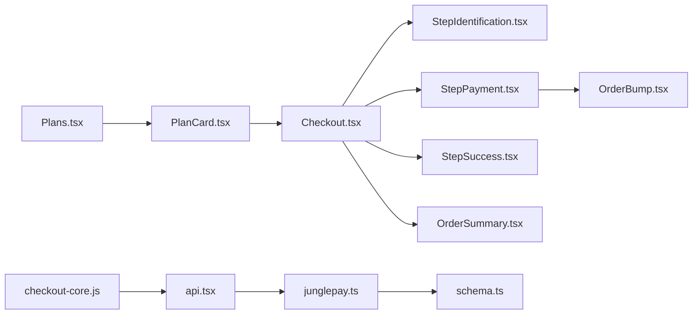

# Payment Methods & Workflows

<cite>
**Referenced Files in This Document**
- [Checkout.tsx](file://src/pages/Checkout.tsx)
- [StepIdentification.tsx](file://src/components/organisms/StepIdentification.tsx)
- [StepPayment.tsx](file://src/components/organisms/StepPayment.tsx)
- [StepSuccess.tsx](file://src/components/organisms/StepSuccess.tsx)
- [OrderSummary.tsx](file://src/components/organisms/OrderSummary.tsx)
- [OrderBump.tsx](file://src/components/molecules/OrderBump.tsx)
- [PlanCard.tsx](file://src/components/molecules/PlanCard.tsx)
- [Plans.tsx](file://src/pages/Plans.tsx)
- [checkout-core.js](file://static/js/checkout-core.js)
- [junglepay.ts](file://src/services/junglepay.ts)
- [api.tsx](file://src/routes/api.tsx)
- [schema.ts](file://src/db/schema.ts)
- [junglepay-documentation.md](file://junglepay-documentation.md)
</cite>

## Update Summary
**Changes Made**
- Added documentation for new `acceptsPix` and `acceptsCard` flags for flexible payment method control
- Updated payment method availability per plan functionality
- Enhanced checkout flow documentation to handle payment method availability
- Added validation logic documentation for backend services
- Updated frontend conditional rendering documentation

## Table of Contents
1. [Introduction](#introduction)
2. [Project Structure](#project-structure)
3. [Core Components](#core-components)
4. [Architecture Overview](#architecture-overview)
5. [Detailed Component Analysis](#detailed-component-analysis)
6. [Dependency Analysis](#dependency-analysis)
7. [Performance Considerations](#performance-considerations)
8. [Troubleshooting Guide](#troubleshooting-guide)
9. [Conclusion](#conclusion)

## Introduction
This document explains the payment method implementations and workflows in the checkout system. It covers:
- PIX payment processing via JunglePay, including QR code generation, expiration handling, and customer data sanitization
- Credit card payment flow, form validation, and security considerations
- Order bump functionality, plan selection integration, and amount calculation
- **Enhanced payment method control with `acceptsPix` and `acceptsCard` flags for flexible payment method availability per plan**
- Payment flow orchestration, user experience considerations, and error recovery mechanisms
- Checkout page integration, form submission handling, and payment confirmation processes

## Project Structure
The checkout experience spans frontend pages, UI components, client-side orchestration, backend APIs, and database schemas. Key areas:
- Pages: Checkout page and plan selection
- Components: Step-by-step checkout UI and summary
- Client logic: checkout-core.js orchestrating steps, validation, and payment submission with payment method flags
- Backend: API routes for checkout processing and webhook handling
- Services: JunglePay service encapsulating gateway integration
- Database: Schema modeling users, plans, gateways, subscriptions, and checkouts with payment method flags

**Diagram sources**
- [Checkout.tsx](file://src/pages/Checkout.tsx#L1-L107)
- [StepIdentification.tsx](file://src/components/organisms/StepIdentification.tsx#L1-L50)
- [StepPayment.tsx](file://src/components/organisms/StepPayment.tsx#L1-L110)
- [StepSuccess.tsx](file://src/components/organisms/StepSuccess.tsx#L1-L26)
- [OrderSummary.tsx](file://src/components/organisms/OrderSummary.tsx#L1-L62)
- [OrderBump.tsx](file://src/components/molecules/OrderBump.tsx#L1-L31)
- [checkout-core.js](file://static/js/checkout-core.js#L1-L734)
- [api.tsx](file://src/routes/api.tsx#L1-L973)
- [junglepay.ts](file://src/services/junglepay.ts#L1-L555)
- [schema.ts](file://src/db/schema.ts#L1-L253)

**Section sources**
- [Checkout.tsx](file://src/pages/Checkout.tsx#L1-L107)
- [checkout-core.js](file://static/js/checkout-core.js#L1-L734)
- [api.tsx](file://src/routes/api.tsx#L1-L973)
- [junglepay.ts](file://src/services/junglepay.ts#L1-L555)
- [schema.ts](file://src/db/schema.ts#L1-L253)

## Core Components
- Checkout page: Renders the checkout layout, initializes pricing, and embeds client-side logic with payment method flags
- Step components: Identification, payment selection with conditional rendering based on plan availability, and success confirmation
- Order summary and order bump: Dynamic pricing updates and promotional add-ons
- Client-side orchestration: Navigation, validation, masking, payment method flag management, and payment submission
- Backend API: Processes checkout requests and handles JunglePay PIX charges with enhanced validation
- JunglePay service: Validates gateway, sanitizes customer data, builds payloads, and persists checkout records
- Database schema: Models users, plans, gateways, subscriptions, and checkouts with payment method flags

**Section sources**
- [Checkout.tsx](file://src/pages/Checkout.tsx#L8-L107)
- [StepIdentification.tsx](file://src/components/organisms/StepIdentification.tsx#L11-L50)
- [StepPayment.tsx](file://src/components/organisms/StepPayment.tsx#L1-L110)
- [OrderSummary.tsx](file://src/components/organisms/OrderSummary.tsx#L10-L62)
- [OrderBump.tsx](file://src/components/molecules/OrderBump.tsx#L1-L31)
- [checkout-core.js](file://static/js/checkout-core.js#L21-L74)
- [api.tsx](file://src/routes/api.tsx#L15-L86)
- [junglepay.ts](file://src/services/junglepay.ts#L52-L270)
- [schema.ts](file://src/db/schema.ts#L6-L27)

## Architecture Overview
The checkout flow integrates frontend and backend components to deliver a secure, user-friendly payment experience with flexible payment method control.

**Diagram sources**
- [Checkout.tsx](file://src/pages/Checkout.tsx#L34-L107)
- [checkout-core.js](file://static/js/checkout-core.js#L35-L74)
- [checkout-core.js](file://static/js/checkout-core.js#L278-L359)
- [api.tsx](file://src/routes/api.tsx#L44-L160)
- [junglepay.ts](file://src/services/junglepay.ts#L169-L200)
- [schema.ts](file://src/db/schema.ts#L14-L27)

## Detailed Component Analysis

### Checkout Page Integration
- Initializes pricing from props and exposes them to client-side totals
- Embeds client-side script for checkout logic and masks with payment method flags
- Renders identification, payment, and success steps alongside order summary
- **Passes `acceptsPix` and `acceptsCard` flags from plan data to frontend components**

**Section sources**
- [Checkout.tsx](file://src/pages/Checkout.tsx#L8-L107)

### Step-by-Step UX Components
- Identification step: Collects email, name, CPF, and phone; validates presence before advancing
- **Payment step: Presents PIX and credit card options conditionally based on plan flags; toggles credit card fields; renders order bump**
- Success step: Confirms receipt and displays PIX QR code and copyable code when applicable

**Diagram sources**
- [StepIdentification.tsx](file://src/components/organisms/StepIdentification.tsx#L49-L61)
- [StepPayment.tsx](file://src/components/organisms/StepPayment.tsx#L46-L74)
- [StepSuccess.tsx](file://src/components/organisms/StepSuccess.tsx#L3-L26)

**Section sources**
- [StepIdentification.tsx](file://src/components/organisms/StepIdentification.tsx#L11-L50)
- [StepPayment.tsx](file://src/components/organisms/StepPayment.tsx#L1-L110)
- [StepSuccess.tsx](file://src/components/organisms/StepSuccess.tsx#L1-L26)

### Order Bump and Amount Calculation
- Order bump is optional and toggled via a checkbox
- Client-side total updates dynamically based on base plan and bump price
- Order summary reflects bump visibility and total price

**Diagram sources**
- [checkout-core.js](file://static/js/checkout-core.js#L233-L260)
- [OrderBump.tsx](file://src/components/molecules/OrderBump.tsx#L1-L31)
- [OrderSummary.tsx](file://src/components/organisms/OrderSummary.tsx#L33-L46)

**Section sources**
- [checkout-core.js](file://static/js/checkout-core.js#L233-L260)
- [OrderBump.tsx](file://src/components/molecules/OrderBump.tsx#L1-L31)
- [OrderSummary.tsx](file://src/components/organisms/OrderSummary.tsx#L10-L62)

### Client-Side Orchestration (checkout-core.js)
- Masks: CPF and phone inputs use IMask for Brazilian formats
- Navigation: Steps validated and indicators updated
- **Payment method flags: State management tracks `acceptsPix` and `acceptsCard` for conditional rendering**
- Payment submission: Handles PIX via dedicated endpoint and credit card via card endpoint
- PIX rendering: Displays QR code (preferably via QRCode library, fallback to text), copyable code, and expiration date
- Error handling: Disables button during processing, shows alerts, and restores UI on failure

**Diagram sources**
- [checkout-core.js](file://static/js/checkout-core.js#L278-L359)
- [checkout-core.js](file://static/js/checkout-core.js#L373-L382)
- [checkout-core.js](file://static/js/checkout-core.js#L384-L410)

**Section sources**
- [checkout-core.js](file://static/js/checkout-core.js#L21-L74)
- [checkout-core.js](file://static/js/checkout-core.js#L278-L359)

### Enhanced Payment Method Control
- **Database schema now includes `accepts_pix` and `accepts_card` boolean flags in the plans table**
- **Frontend components conditionally render payment options based on plan flags**
- **Checkout initialization receives payment method flags from plan data**
- **State management tracks payment method availability for dynamic UI updates**

**Section sources**
- [schema.ts](file://src/db/schema.ts#L16-L27)
- [StepPayment.tsx](file://src/components/organisms/StepPayment.tsx#L17-L29)
- [Checkout.tsx](file://src/pages/Checkout.tsx#L34-L69)
- [checkout-core.js](file://static/js/checkout-core.js#L22-L32)

### PIX Payment Workflow (JunglePay)
- Gateway verification: Ensures JunglePay is configured and active
- Validation: Checks required customer fields, amount, and plan existence
- Customer data sanitization: Removes special characters from CPF and phone
- Payload construction: Builds items array with plan and optional order bump
- API call: Submits to JunglePay transactions endpoint with Basic Auth
- Persistence: Inserts checkout record with sanitized customer data
- Response: Returns transaction ID, QR code, secure URL, expiration date, and status

**Diagram sources**
- [junglepay.ts](file://src/services/junglepay.ts#L169-L200)

**Section sources**
- [junglepay.ts](file://src/services/junglepay.ts#L169-L200)

### Credit Card Payment Workflow
- **Frontend: Credit card fields are shown when "credit_card" is selected and `acceptsCard` flag is true**
- **Submission: Client sends checkout data to `/api/checkout/card` endpoint**
- Backend: Creates a pending checkout record and returns success
- **Enhanced validation: Additional card-specific validation including card hash and installments**

**Section sources**
- [StepPayment.tsx](file://src/components/organisms/StepPayment.tsx#L58-L67)
- [checkout-core.js](file://static/js/checkout-core.js#L384-L410)
- [api.tsx](file://src/routes/api.tsx#L102-L160)

### Checkout API Endpoints
- POST /api/checkout/process: Creates a pending checkout record and returns an ID
- POST /api/checkout/pix: Validates request, calls JunglePay service, and returns PIX data
- **POST /api/checkout/card: Validates card request, calls JunglePay service, and returns card data**
- POST /webhook/junglepay: Updates subscriptions and user status upon payment confirmation

**Diagram sources**
- [api.tsx](file://src/routes/api.tsx#L44-L160)
- [junglepay.ts](file://src/services/junglepay.ts#L169-L200)
- [schema.ts](file://src/db/schema.ts#L114-L130)

**Section sources**
- [api.tsx](file://src/routes/api.tsx#L15-L160)

### Webhooks and Confirmation
- JunglePay webhook: On paid status, finds user by email, selects nearest plan by price, creates/activates subscription, updates user subscription status, and marks checkout as paid
- Dias webhook: Handles Dias Marketplace payments with pending and paid transitions

**Section sources**
- [api.tsx](file://src/routes/api.tsx#L162-L214)
- [api.tsx](file://src/routes/api.tsx#L401-L506)

### Plan Selection Integration
- Plan cards link to checkout with planId query parameter
- Plans page displays plan details and subscription status for logged-in users
- **Plan data now includes `acceptsPix` and `acceptsCard` flags for payment method availability**

**Section sources**
- [PlanCard.tsx](file://src/components/molecules/PlanCard.tsx#L39-L47)
- [Plans.tsx](file://src/pages/Plans.tsx#L10-L84)

## Dependency Analysis
- Checkout.tsx depends on Step components and OrderSummary for rendering with payment method flags
- StepPayment depends on OrderBump and Input components with conditional rendering
- checkout-core.js orchestrates UI steps, validation, masking, payment method flags, and network calls
- api.tsx routes depend on JunglePay service and database schema with enhanced validation
- JunglePay service depends on paymentGateways and plans tables and inserts into checkouts

**Diagram sources**
- [Checkout.tsx](file://src/pages/Checkout.tsx#L1-L107)
- [StepIdentification.tsx](file://src/components/organisms/StepIdentification.tsx#L1-L50)
- [StepPayment.tsx](file://src/components/organisms/StepPayment.tsx#L1-L110)
- [StepSuccess.tsx](file://src/components/organisms/StepSuccess.tsx#L1-L26)
- [OrderSummary.tsx](file://src/components/organisms/OrderSummary.tsx#L1-L62)
- [OrderBump.tsx](file://src/components/molecules/OrderBump.tsx#L1-L31)
- [checkout-core.js](file://static/js/checkout-core.js#L1-L734)
- [api.tsx](file://src/routes/api.tsx#L1-L973)
- [junglepay.ts](file://src/services/junglepay.ts#L1-L555)
- [schema.ts](file://src/db/schema.ts#L1-L253)
- [Plans.tsx](file://src/pages/Plans.tsx#L1-L84)
- [PlanCard.tsx](file://src/components/molecules/PlanCard.tsx#L1-L110)

**Section sources**
- [schema.ts](file://src/db/schema.ts#L6-L27)
- [api.tsx](file://src/routes/api.tsx#L1-L973)
- [junglepay.ts](file://src/services/junglepay.ts#L1-L555)

## Performance Considerations
- Client-side validation reduces unnecessary server calls and improves perceived responsiveness
- Masking and incremental total updates minimize layout thrashing
- **Conditional rendering based on payment method flags reduces DOM complexity**
- Webhook-driven subscription activation avoids polling and reduces server load
- Database writes are minimal per checkout creation; ensure indexes on email and external IDs for webhook lookups

## Troubleshooting Guide
Common issues and remedies:
- Gateway misconfiguration
  - Symptom: PIX endpoint returns gateway errors
  - Action: Verify JunglePay configuration and active status in admin routes
- Invalid customer data
  - Symptom: PIX creation fails with invalid data
  - Action: Ensure CPF and phone are sanitized and required fields are present
- Network/API errors
  - Symptom: PIX creation throws API_ERROR
  - Action: Inspect response status and logs; retry after cooldown
- **Payment method unavailable**
  - Symptom: Payment options not visible or unavailable message displayed
  - Action: Verify plan `acceptsPix` and `acceptsCard` flags in database
- Webhook not activating subscription
  - Symptom: Paid status not reflected
  - Action: Confirm webhook URL is reachable and payload parsing succeeds; verify user exists and plan mapping by amount

**Section sources**
- [junglepay.ts](file://src/services/junglepay.ts#L169-L200)
- [api.tsx](file://src/routes/api.tsx#L44-L160)

## Conclusion
The checkout system combines modular frontend components with robust backend APIs and a gateway-integrated service to provide a seamless payment experience. **Enhanced payment method control with `acceptsPix` and `acceptsCard` flags allows flexible payment method availability per plan, improving user experience and operational flexibility.** PIX is fully supported with QR rendering and expiration handling, while credit card processing is available via the dedicated card endpoint. Order bump and dynamic pricing enhance conversion, and webhooks ensure reliable subscription activation. Future enhancements can unify payment methods behind a single gateway service and implement polling for improved reliability.