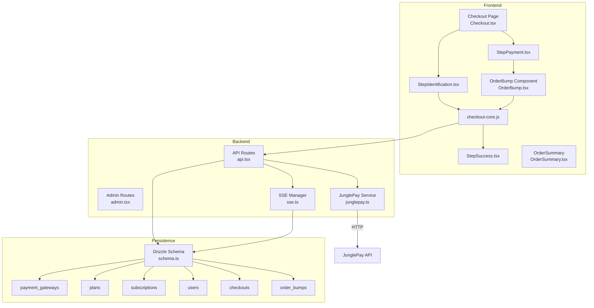
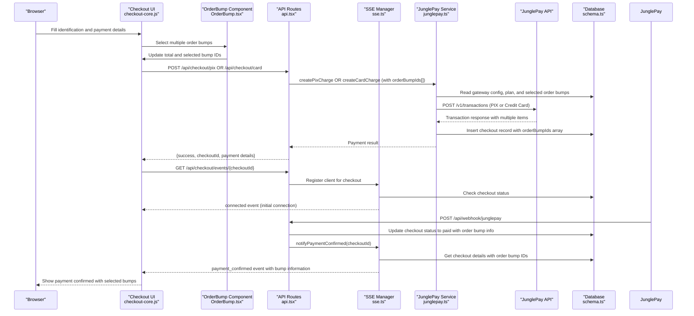
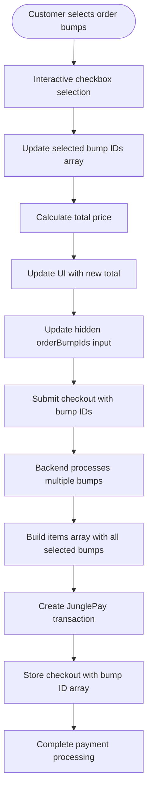
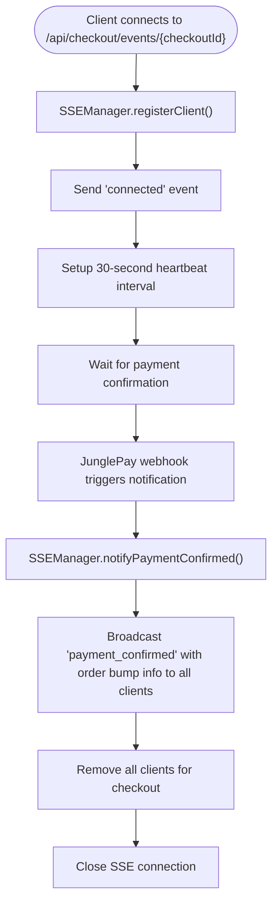
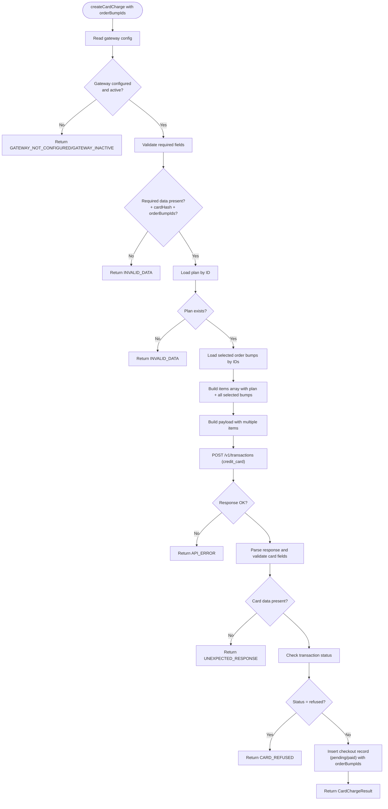
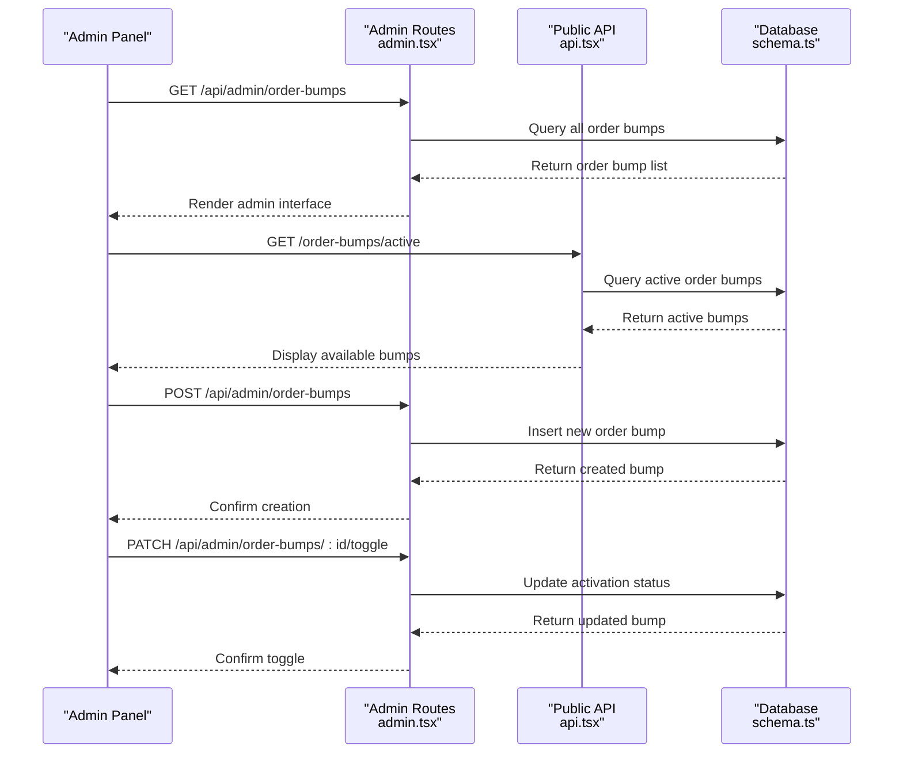
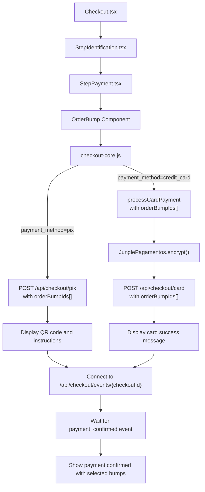
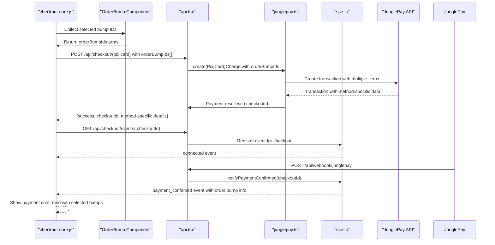
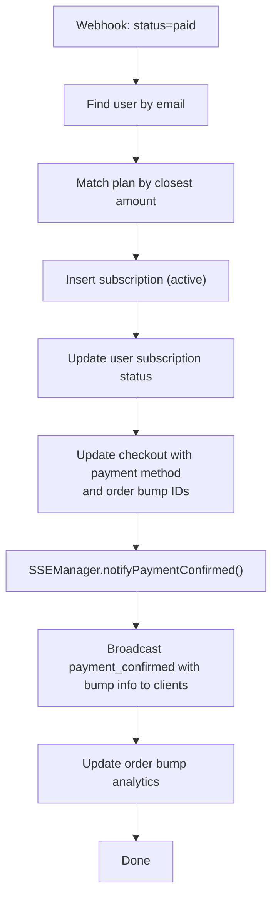
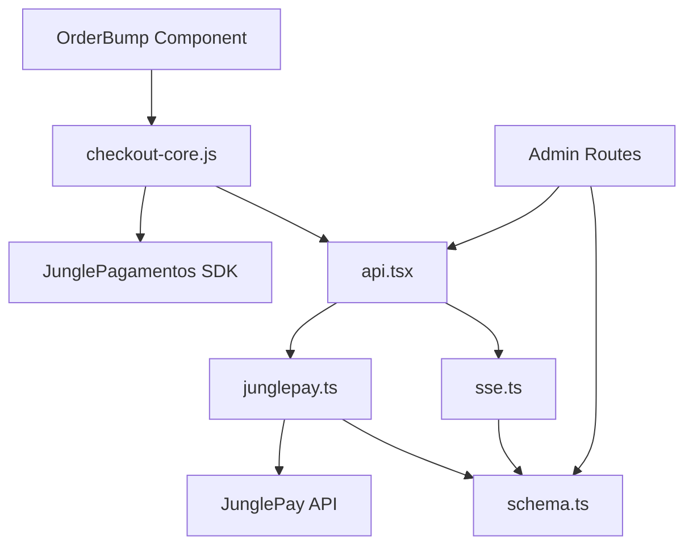

# Payment Processing System

<cite>
**Referenced Files in This Document**
- [junglepay.ts](file://src/services/junglepay.ts)
- [api.tsx](file://src/routes/api.tsx)
- [sse.ts](file://src/services/sse.ts)
- [schema.ts](file://src/db/schema.ts)
- [checkout-core.js](file://static/js/checkout-core.js)
- [StepPayment.tsx](file://src/components/organisms/StepPayment.tsx)
- [StepIdentification.tsx](file://src/components/organisms/StepIdentification.tsx)
- [Checkout.tsx](file://src/pages/Checkout.tsx)
- [StepSuccess.tsx](file://src/components/organisms/StepSuccess.tsx)
- [OrderBump.tsx](file://src/components/molecules/OrderBump.tsx)
- [OrderSummary.tsx](file://src/components/organisms/OrderSummary.tsx)
- [Plans.tsx](file://src/pages/admin/Plans.tsx)
- [admin.tsx](file://src/routes/admin.tsx)
- [junglepay-documentation.md](file://junglepay-documentation.md)
- [0005_furry_catseye.sql](file://drizzle/0005_furry_catseye.sql)
- [0006_overconfident_titania.sql](file://drizzle/0006_overconfident_titania.sql)
- [0009_order_bumps.sql](file://drizzle/0009_order_bumps.sql)
- [0010_ads_table.sql](file://drizzle/0010_ads_table.sql)
- [0000_special_white_queen.sql](file://drizzle/0000_special_white_queen.sql)
- [0001_chunky_thunderbolts.sql](file://drizzle/0001_chunky_thunderbolts.sql)
- [0002_sparkling_madripoor.sql](file://drizzle/0002_sparkling_madripoor.sql)
</cite>

## Update Summary
**Changes Made**
- Enhanced payment processing workflows to support multi-order bump processing with flexible selection
- Expanded API endpoints for order bump management including admin CRUD operations and active listing
- Updated JunglePay service to handle multiple order bump selections with dynamic item building
- Enhanced frontend checkout integration with order bump selection UI and real-time total calculation
- Added comprehensive order bump database schema with JSON storage for selected bump IDs
- Integrated order bump management into admin dashboard with toggle functionality

## Table of Contents
1. [Introduction](#introduction)
2. [Project Structure](#project-structure)
3. [Core Components](#core-components)
4. [Architecture Overview](#architecture-overview)
5. [Detailed Component Analysis](#detailed-component-analysis)
6. [Dependency Analysis](#dependency-analysis)
7. [Performance Considerations](#performance-considerations)
8. [Security and Compliance](#security-and-compliance)
9. [Troubleshooting Guide](#troubleshooting-guide)
10. [Conclusion](#conclusion)

## Introduction
This document explains CreatorFlix's payment processing system with comprehensive JunglePay integration supporting both PIX and credit card payment methods. The system features a modern real-time Server-Sent Events (SSE) streaming architecture that replaces traditional polling-based status checking with instant payment notifications. The system covers gateway configuration, transaction processing workflows, webhook handling, subscription management, error handling, security considerations, and operational procedures for reconciliation and troubleshooting.

**Updated** Enhanced with multi-order bump processing support allowing customers to select multiple add-on services during checkout, with comprehensive admin management capabilities for order bump configuration and real-time selection tracking.

## Project Structure
The payment system spans frontend checkout UI, backend API routes, SSE infrastructure, and a service layer that interacts with JunglePay. Data is persisted via Drizzle ORM with dedicated tables for plans, subscriptions, users, payment gateways, checkouts, and order bumps.

**Diagram sources**
- [Checkout.tsx](file://src/pages/Checkout.tsx#L1-L98)
- [StepIdentification.tsx](file://src/components/organisms/StepIdentification.tsx#L1-L50)
- [StepPayment.tsx](file://src/components/organisms/StepPayment.tsx#L1-L92)
- [OrderBump.tsx](file://src/components/molecules/OrderBump.tsx#L1-L191)
- [OrderSummary.tsx](file://src/components/organisms/OrderSummary.tsx#L1-L100)
- [StepSuccess.tsx](file://src/components/organisms/StepSuccess.tsx#L1-L33)
- [checkout-core.js](file://static/js/checkout-core.js#L1-L626)
- [api.tsx](file://src/routes/api.tsx#L1-L946)
- [admin.tsx](file://src/routes/admin.tsx#L1-L579)
- [sse.ts](file://src/services/sse.ts#L1-L161)
- [junglepay.ts](file://src/services/junglepay.ts#L1-L537)
- [schema.ts](file://src/db/schema.ts#L1-L235)

**Section sources**
- [Checkout.tsx](file://src/pages/Checkout.tsx#L1-L98)
- [StepIdentification.tsx](file://src/components/organisms/StepIdentification.tsx#L1-L50)
- [StepPayment.tsx](file://src/components/organisms/StepPayment.tsx#L1-L92)
- [OrderBump.tsx](file://src/components/molecules/OrderBump.tsx#L1-L191)
- [OrderSummary.tsx](file://src/components/organisms/OrderSummary.tsx#L1-L100)
- [StepSuccess.tsx](file://src/components/organisms/StepSuccess.tsx#L1-L33)
- [checkout-core.js](file://static/js/checkout-core.js#L1-L626)
- [api.tsx](file://src/routes/api.tsx#L1-L946)
- [admin.tsx](file://src/routes/admin.tsx#L1-L579)
- [sse.ts](file://src/services/sse.ts#L1-L161)
- [junglepay.ts](file://src/services/junglepay.ts#L1-L537)
- [schema.ts](file://src/db/schema.ts#L1-L235)

## Core Components
- **JunglePay Service**: Handles both PIX and credit card creation, gateway validation, payload construction, and response parsing with enhanced multi-order bump support.
- **SSE Manager**: Provides real-time event streaming infrastructure with client registration, heartbeat management, and automatic cleanup.
- **API Routes**: Expose endpoints for checkout initiation, SSE event streaming, PIX charge creation, credit card processing, webhooks, and comprehensive order bump management.
- **Frontend Checkout**: Collects customer data, renders payment options, handles order bump selection, and triggers payment flows with real-time status updates.
- **Persistence Layer**: Stores plans, subscriptions, users, gateways, checkouts, and order bumps with dual payment method support and multi-order bump tracking.

Key responsibilities:
- Validate gateway configuration and credentials before processing.
- Sanitize customer documents and phone numbers.
- Build items list from plan and multiple order bump selections.
- Persist checkout records with order bump ID arrays and update statuses via webhooks.
- Manage real-time SSE connections with heartbeat and timeout handling.
- Support both PIX QR code generation and credit card tokenization.
- Handle multiple order bump selections with dynamic pricing calculation.

**Updated** Enhanced with multi-order bump processing that allows customers to select multiple add-ons during checkout, with comprehensive admin management for order bump configuration and real-time selection tracking.

**Section sources**
- [junglepay.ts](file://src/services/junglepay.ts#L152-L164)
- [junglepay.ts](file://src/services/junglepay.ts#L235-L254)
- [sse.ts](file://src/services/sse.ts#L18-L160)
- [api.tsx](file://src/routes/api.tsx#L692-L818)
- [api.tsx](file://src/routes/api.tsx#L44-L160)
- [checkout-core.js](file://static/js/checkout-core.js#L191-L220)
- [schema.ts](file://src/db/schema.ts#L132-L141)

## Architecture Overview
The system now features a modern real-time architecture with comprehensive SSE streaming support and enhanced multi-order bump processing:
- **PIX**: Instant payment via QR code generated by JunglePay with real-time status notifications and multi-order bump support.
- **Credit Card**: Full card processing via JunglePay with tokenization and encryption, immediate status updates, and multi-order bump integration.
- **SSE Infrastructure**: Real-time event streaming from webhook notifications to client browsers.
- **Order Bump Management**: Comprehensive admin system for creating, managing, and toggling order bump offerings.

**Diagram sources**
- [checkout-core.js](file://static/js/checkout-core.js#L191-L220)
- [OrderBump.tsx](file://src/components/molecules/OrderBump.tsx#L98-L156)
- [api.tsx](file://src/routes/api.tsx#L44-L160)
- [api.tsx](file://src/routes/api.tsx#L300-L339)
- [sse.ts](file://src/services/sse.ts#L21-L94)
- [junglepay.ts](file://src/services/junglepay.ts#L235-L254)
- [junglepay.ts](file://src/services/junglepay.ts#L314-L322)
- [schema.ts](file://src/db/schema.ts#L132-L141)

## Detailed Component Analysis

### Enhanced Multi-Order Bump Processing System
The system now supports comprehensive multi-order bump processing with flexible customer selection:

**Order Bump Database Schema:**
- Dedicated `order_bumps` table with activation/deactivation capability
- JSON storage for `orderBumpIds` in checkout records for multiple selection tracking
- Display ordering and image support for enhanced presentation
- Price tracking in cents for precise calculations

**Frontend Order Bump Component:**
- Interactive checkbox-based selection with visual feedback
- Real-time total calculation and bump summary updates
- Dynamic styling with gold accents for selected items
- Hidden input field for transmitting selected bump IDs to backend
- Custom event dispatching for parent component updates

**Backend Order Bump Integration:**
- Enhanced JunglePay service with dynamic item building from multiple selections
- Flexible order bump ID array processing with validation
- Backward compatibility with legacy single-order bump parameter
- Comprehensive error handling for invalid or inactive order bumps

**Diagram sources**
- [OrderBump.tsx](file://src/components/molecules/OrderBump.tsx#L98-L156)
- [checkout-core.js](file://static/js/checkout-core.js#L191-L220)
- [junglepay.ts](file://src/services/junglepay.ts#L235-L254)
- [schema.ts](file://src/db/schema.ts#L132-L141)

**Section sources**
- [OrderBump.tsx](file://src/components/molecules/OrderBump.tsx#L1-L191)
- [checkout-core.js](file://static/js/checkout-core.js#L191-L220)
- [junglepay.ts](file://src/services/junglepay.ts#L152-L164)
- [junglepay.ts](file://src/services/junglepay.ts#L235-L254)
- [schema.ts](file://src/db/schema.ts#L132-L141)
- [0009_order_bumps.sql](file://drizzle/0009_order_bumps.sql#L1-L12)

### Enhanced SSE Infrastructure
The new SSE system provides comprehensive real-time event streaming with enhanced order bump information:

**SSE Manager Features:**
- Client registration and management with checkoutId mapping
- Automatic heartbeat generation to maintain connections
- Connection cleanup with 15-minute timeout handling
- Multi-client support for multiple browser tabs
- Graceful connection termination and resource cleanup

**Enhanced Connection Lifecycle:**
- Registration: `registerClient(checkoutId, controller)` adds new SSE clients
- Heartbeat: `sendHeartbeat(controller)` sends keep-alive messages every 30 seconds
- Notification: `notifyPaymentConfirmed(checkoutId, data)` broadcasts payment updates with order bump information
- Cleanup: Automatic removal of stale connections after 15 minutes

**Diagram sources**
- [api.tsx](file://src/routes/api.tsx#L163-L200)
- [sse.ts](file://src/services/sse.ts#L21-L94)

**Section sources**
- [sse.ts](file://src/services/sse.ts#L1-L161)
- [api.tsx](file://src/routes/api.tsx#L163-L200)

### Enhanced JunglePay Service
The service now provides comprehensive support for both payment methods with enhanced multi-order bump processing:

**Enhanced Order Bump Processing:**
- Dynamic item building from multiple order bump selections
- Validation of selected order bump IDs against database
- Backward compatibility with legacy single-order bump parameter
- Comprehensive error handling for invalid selections

**Credit Card Processing Features:**
- Card tokenization via JunglePagamentos.encrypt() for PCI compliance
- Installment calculation and validation
- Card brand detection and last digits masking
- Refusal reason handling with detailed error codes

**Shared Features:**
- Gateway validation with active/inactive status checking
- Customer data sanitization (CPF, phone number)
- Plan loading and item payload construction with multiple bumps
- Webhook URL attachment for transaction updates

**Diagram sources**
- [junglepay.ts](file://src/services/junglepay.ts#L348-L400)
- [junglepay.ts](file://src/services/junglepay.ts#L235-L254)
- [junglepay.ts](file://src/services/junglepay.ts#L314-L322)

**Section sources**
- [junglepay.ts](file://src/services/junglepay.ts#L152-L164)
- [junglepay.ts](file://src/services/junglepay.ts#L235-L254)
- [junglepay.ts](file://src/services/junglepay.ts#L348-L400)
- [junglepay.ts](file://src/services/junglepay.ts#L314-L322)

### Enhanced API Routes
The API now exposes comprehensive endpoints for both payment methods, SSE streaming, and extensive order bump management:

**New Order Bump Management Endpoints:**
- `GET /api/admin/order-bumps`: List all order bumps with sorting
- `GET /order-bumps/active`: Public endpoint for active order bumps
- `POST /api/admin/order-bumps`: Create new order bump
- `PATCH /api/admin/order-bumps/:id`: Update order bump details
- `PATCH /api/admin/order-bumps/:id/toggle`: Toggle activation status
- `DELETE /api/admin/order-bumps/:id`: Delete order bump

**Enhanced Checkout Endpoints:**
- `POST /api/checkout/pix`: Now accepts `orderBumpIds` array parameter
- `POST /api/checkout/card`: Now accepts `orderBumpIds` array parameter
- Enhanced parameter validation for order bump selections

**Enhanced Webhook Processing:**
- Unified webhook handler processes both PIX and credit card transactions
- Immediate SSE notifications upon payment confirmation with order bump details
- Supports card brand, last digits, and multiple order bump information
- Handles payment status updates for both methods with bump tracking

**Diagram sources**
- [admin.tsx](file://src/routes/admin.tsx#L147-L179)
- [api.tsx](file://src/routes/api.tsx#L692-L818)
- [schema.ts](file://src/db/schema.ts#L132-L141)

**Section sources**
- [api.tsx](file://src/routes/api.tsx#L692-L818)
- [api.tsx](file://src/routes/api.tsx#L44-L160)
- [api.tsx](file://src/routes/api.tsx#L300-L339)
- [admin.tsx](file://src/routes/admin.tsx#L147-L179)

### Enhanced Frontend Checkout Flow
The checkout page now supports both payment methods with intelligent real-time status updates and comprehensive order bump selection:

**Enhanced Payment Method Selection:**
- Radio button interface for PIX vs Credit Card selection
- Dynamic field visibility based on chosen method
- Parcelation options for credit card payments (1x-12x)

**Advanced Order Bump Integration:**
- Interactive checkbox-based selection with visual feedback
- Real-time total calculation and bump summary updates
- Dynamic styling with gold accents for selected items
- Hidden input field for transmitting selected bump IDs to backend
- Custom event dispatching for parent component updates

**Real-Time Status Updates:**
- SSE connection establishment for immediate notifications
- Heartbeat maintenance for connection reliability
- Automatic timeout handling after 15 minutes
- Graceful fallback to manual refresh if SSE fails

**Credit Card Implementation:**
- Card number, holder name, expiry date, and CVC inputs
- Real-time validation and formatting
- Installment selector with calculated values
- Tokenization via JunglePagamentos SDK

**Diagram sources**
- [Checkout.tsx](file://src/pages/Checkout.tsx#L32-L98)
- [StepIdentification.tsx](file://src/components/organisms/StepIdentification.tsx#L11-L50)
- [StepPayment.tsx](file://src/components/organisms/StepPayment.tsx#L22-L92)
- [OrderBump.tsx](file://src/components/molecules/OrderBump.tsx#L98-L156)
- [checkout-core.js](file://static/js/checkout-core.js#L191-L220)

**Section sources**
- [Checkout.tsx](file://src/pages/Checkout.tsx#L1-L98)
- [StepIdentification.tsx](file://src/components/organisms/StepIdentification.tsx#L1-L50)
- [StepPayment.tsx](file://src/components/organisms/StepPayment.tsx#L1-L92)
- [OrderBump.tsx](file://src/components/molecules/OrderBump.tsx#L1-L191)
- [StepSuccess.tsx](file://src/components/organisms/StepSuccess.tsx#L1-L33)
- [checkout-core.js](file://static/js/checkout-core.js#L191-L220)

### Enhanced Database Schema
The database now supports comprehensive checkout tracking for both payment methods and multi-order bump processing:

**Enhanced Checkout Table:**
- `payment_method` column with enum values ('pix', 'credit_card')
- `card_brand` and `card_last_digits` for credit card tracking
- `installments` field for installment information
- `orderBumpIds` JSON field for storing multiple selected bump IDs
- Enhanced foreign key relationships

**New Order Bumps Table:**
- `order_bumps` table with comprehensive fields for management
- `id`, `name`, `description`, `price` (in cents), `isActive`, `imageUrl`, `displayOrder`, `createdAt`
- Separate from legacy single-order-bump boolean field
- Supports unlimited order bump offerings

**Plan Table Updates:**
- `accepts_pix` and `accepts_card` boolean flags for payment method availability
- Enables granular control over accepted payment methods per plan

**Migration History:**
- Initial schema with users, plans, subscriptions, models, posts
- Payment gateways table for gateway configuration
- Checkouts table for transaction tracking with enhanced bump support
- Order bumps table for comprehensive add-on management

**Section sources**
- [schema.ts](file://src/db/schema.ts#L114-L141)
- [schema.ts](file://src/db/schema.ts#L16-L27)
- [0009_order_bumps.sql](file://drizzle/0009_order_bumps.sql#L1-L12)
- [0010_ads_table.sql](file://drizzle/0010_ads_table.sql#L1-L21)

### Supported Payment Methods
The system now comprehensively supports both payment methods with real-time processing and enhanced multi-order bump capabilities:

**PIX (Instant Payment):**
- QR code generation via JunglePay API
- Real-time status monitoring via SSE events with order bump information
- Immediate webhook-driven activation
- Instant content access with SSE notifications
- Multi-order bump support with dynamic item building

**Credit Card (Full Integration):**
- Tokenized card processing via JunglePagamentos SDK
- Installment calculation (1x-12x)
- Card brand detection (Visa, MasterCard, etc.)
- PCI DSS compliant through tokenization
- Refusal handling with detailed reasons
- Real-time status updates via SSE with order bump tracking

**Enhanced Order Bump Support:**
- Multiple order bump selection during checkout
- Dynamic pricing calculation based on selected bumps
- Visual feedback for selected add-ons
- Backward compatibility with legacy single-order bump parameter
- Comprehensive admin management for order bump offerings

**Section sources**
- [junglepay-documentation.md](file://junglepay-documentation.md#L27-L52)
- [junglepay-documentation.md](file://junglepay-documentation.md#L54-L149)
- [junglepay.ts](file://src/services/junglepay.ts#L235-L254)
- [checkout-core.js](file://static/js/checkout-core.js#L191-L220)

### Enhanced Payment Flow Orchestration
The system now orchestrates payment flows seamlessly across both methods with real-time updates and comprehensive multi-order bump processing:

**Unified Flow Architecture:**
- Shared validation and sanitization logic
- Conditional processing based on payment method
- Consistent error handling across methods
- Unified webhook processing with immediate SSE notifications
- Enhanced order bump integration with dynamic item building

**Real-Time Processing:**
- SSE connection established immediately after payment initiation
- Heartbeat maintenance for connection reliability
- Automatic timeout handling after 15 minutes
- Graceful fallback to manual refresh if SSE fails

**Enhanced Credit Card Flow:**
- Frontend tokenization via JunglePagamentos SDK
- Backend cardHash validation and processing
- Installment-aware pricing calculations
- Card brand and last digits tracking
- Real-time status updates via SSE with order bump information

**Enhanced PIX Flow:**
- Direct QR code generation and display
- Real-time status updates via SSE with order bump details
- Immediate subscription activation
- Expiration handling with timeout notifications
- Multi-order bump support with dynamic item building

**Diagram sources**
- [checkout-core.js](file://static/js/checkout-core.js#L191-L220)
- [OrderBump.tsx](file://src/components/molecules/OrderBump.tsx#L98-L156)
- [api.tsx](file://src/routes/api.tsx#L44-L160)
- [api.tsx](file://src/routes/api.tsx#L300-L339)
- [junglepay.ts](file://src/services/junglepay.ts#L235-L254)
- [junglepay.ts](file://src/services/junglepay.ts#L314-L322)
- [sse.ts](file://src/services/sse.ts#L56-L94)

**Section sources**
- [checkout-core.js](file://static/js/checkout-core.js#L191-L220)
- [OrderBump.tsx](file://src/components/molecules/OrderBump.tsx#L98-L156)
- [api.tsx](file://src/routes/api.tsx#L44-L160)
- [api.tsx](file://src/routes/api.tsx#L300-L339)
- [junglepay.ts](file://src/services/junglepay.ts#L235-L254)
- [junglepay.ts](file://src/services/junglepay.ts#L314-L322)
- [sse.ts](file://src/services/sse.ts#L1-L161)

### Enhanced Subscription Management and Recurring Payments
Subscription management now works seamlessly with both payment methods, real-time updates, and comprehensive order bump tracking:

**Unified Activation Logic:**
- Webhook handler processes both PIX and credit card transactions
- Immediate SSE notifications upon payment confirmation with order bump details
- Plan matching based on amount for both methods
- Consistent subscription creation and activation
- User status updates regardless of payment method
- Order bump information preserved for reporting and analytics

**Enhanced Status Tracking:**
- Checkout records track payment method used and selected order bumps
- Card-specific information stored for credit card payments
- Installment information preserved for recurring tracking
- Payment method differentiation in reports
- Real-time status updates via SSE events with bump information

**Order Bump Analytics:**
- Track which order bumps are most popular
- Analyze correlation between plan selection and bump choices
- Generate revenue reports by order bump category
- Monitor customer behavior patterns

**Diagram sources**
- [api.tsx](file://src/routes/api.tsx#L300-L339)
- [sse.ts](file://src/services/sse.ts#L56-L94)

**Section sources**
- [api.tsx](file://src/routes/api.tsx#L300-L339)
- [schema.ts](file://src/db/schema.ts#L114-L141)
- [sse.ts](file://src/services/sse.ts#L56-L94)

### Enhanced Webhook Endpoints and Status Tracking
Webhook processing now handles both payment methods comprehensively with real-time notifications and enhanced order bump information:

**Unified Webhook Architecture:**
- Single endpoint processes both PIX and credit card transactions
- Method-specific data extraction and validation
- Immediate SSE notifications upon payment confirmation with order bump details
- Consistent subscription activation logic
- Enhanced error logging and debugging

**Real-Time Notification System:**
- `notifyPaymentConfirmed(checkoutId, data)` broadcasts payment updates with order bump information
- Automatic client cleanup after successful notification
- Multi-client support for multiple browser tabs
- Connection timeout handling after 15 minutes

**Enhanced Payment Method Detection:**
- Automatic detection of payment method from webhook payload
- Card brand and last digits extraction for credit card payments
- Installment information preservation
- Refusal reason logging for failed transactions
- Order bump ID array processing for multi-selection tracking

**Section sources**
- [api.tsx](file://src/routes/api.tsx#L300-L339)
- [junglepay.ts](file://src/services/junglepay.ts#L60-L86)
- [sse.ts](file://src/services/sse.ts#L56-L94)

### Enhanced Reconciliation Processes
Reconciliation now supports both payment methods with real-time tracking and comprehensive order bump analytics:

**Multi-Method Reconciliation:**
- Plan price matching for both PIX and credit card transactions
- Payment method differentiation in reconciliation reports
- Card brand and installment tracking for credit card payments
- Gateway credential management for multiple providers
- Real-time status updates via SSE infrastructure
- Order bump revenue tracking and analytics

**Enhanced Audit Trail:**
- Checkout records store payment method used and selected order bumps
- Card-specific information for dispute resolution
- Installment tracking for subscription management
- Enhanced webhook processing logs
- SSE connection lifecycle tracking
- Order bump selection analytics for business insights

**Order Bump Revenue Analysis:**
- Track revenue generated by each order bump type
- Monitor conversion rates for different bump offerings
- Analyze seasonal trends in bump selection
- Generate profit margins for individual order bumps

**Section sources**
- [api.tsx](file://src/routes/api.tsx#L300-L339)
- [schema.ts](file://src/db/schema.ts#L114-L141)
- [sse.ts](file://src/services/sse.ts#L122-L148)

### Enhanced Admin Order Bump Management
The admin system now provides comprehensive management capabilities for order bump offerings:

**Admin Interface Features:**
- Complete CRUD operations for order bump management
- Toggle activation/deactivation of order bumps
- Real-time preview of order bump listings
- Image upload and display order configuration
- Price management in centavos for precision

**API Endpoints:**
- `GET /api/admin/order-bumps`: List all order bumps with sorting
- `GET /order-bumps/active`: Public endpoint for active order bumps
- `POST /api/admin/order-bumps`: Create new order bump
- `PATCH /api/admin/order-bumps/:id`: Update order bump details
- `PATCH /api/admin/order-bumps/:id/toggle`: Toggle activation status
- `DELETE /api/admin/order-bumps/:id`: Delete order bump

**Integration with Checkout:**
- Automatic filtering of inactive order bumps
- Real-time updates to checkout interface
- Consistent pricing display across admin and frontend
- Synchronized display order for customer experience

**Section sources**
- [admin.tsx](file://src/routes/admin.tsx#L147-L179)
- [api.tsx](file://src/routes/api.tsx#L692-L818)
- [Plans.tsx](file://src/pages/admin/Plans.tsx#L154-L385)

## Dependency Analysis
The enhanced system maintains clean separation of concerns with improved dependencies and comprehensive order bump integration:

**Frontend Dependencies:**
- checkout-core.js depends on EventSource API for SSE connections
- JunglePagamentos SDK for card tokenization
- OrderBump component for interactive selection management
- Dual payment method routing based on user selection
- Method-specific UI rendering and validation
- Real-time order bump selection tracking

**Backend Dependencies:**
- API routes depend on enhanced JunglePay service and SSE manager
- Service layer handles both PIX and credit card processing with multi-order bump support
- SSE manager manages real-time event streaming with order bump information
- Database layer supports checkout records for both methods with bump ID arrays
- Admin routes handle comprehensive order bump management

**External Dependencies:**
- JunglePay API for transaction processing
- JunglePagamentos SDK for card tokenization
- PostgreSQL via Drizzle ORM for data persistence
- Enhanced order bump database schema for multi-selection tracking

**Diagram sources**
- [checkout-core.js](file://static/js/checkout-core.js#L1-L626)
- [OrderBump.tsx](file://src/components/molecules/OrderBump.tsx#L1-L191)
- [api.tsx](file://src/routes/api.tsx#L1-L946)
- [admin.tsx](file://src/routes/admin.tsx#L1-L579)
- [sse.ts](file://src/services/sse.ts#L1-L161)
- [junglepay.ts](file://src/services/junglepay.ts#L1-L537)
- [schema.ts](file://src/db/schema.ts#L1-L235)

**Section sources**
- [checkout-core.js](file://static/js/checkout-core.js#L1-L626)
- [OrderBump.tsx](file://src/components/molecules/OrderBump.tsx#L1-L191)
- [api.tsx](file://src/routes/api.tsx#L1-L946)
- [admin.tsx](file://src/routes/admin.tsx#L1-L579)
- [sse.ts](file://src/services/sse.ts#L1-L161)
- [junglepay.ts](file://src/services/junglepay.ts#L1-L537)
- [schema.ts](file://src/db/schema.ts#L1-L235)

## Performance Considerations
Enhanced performance optimizations for real-time multi-method processing with multi-order bump support:

**Optimized SSE Infrastructure:**
- Efficient client registration and cleanup with automatic timeout handling
- Heartbeat management to maintain connection reliability
- Connection pooling for SSE streams with 15-minute timeout
- Memory-efficient event broadcasting to multiple clients
- Enhanced event payload compression for order bump information

**Database Operations:**
- Indexed fields (email, externalId, orderBumpIds) for fast webhook lookups
- Batch operations for checkout record creation with multi-order bump arrays
- Connection pooling for JunglePay API calls
- Caching of plan durations, gateway configurations, and order bump lists
- JSON array optimization for orderBumpIds storage and retrieval

**Frontend Optimizations:**
- Lazy loading of payment method components
- Debounced validation for card inputs
- Efficient DOM manipulation for method switching
- Minimal re-renders during payment processing
- Automatic fallback to manual refresh if SSE fails
- Optimized order bump selection with efficient state management

**API Performance:**
- Parallel processing for webhook validation and order bump loading
- Connection reuse for JunglePay API calls
- Response caching for frequently accessed order bump data
- Background job processing for heavy operations
- Efficient order bump ID array processing and validation

## Security and Compliance
Enhanced security measures for comprehensive payment processing with multi-order bump support:

**PCI DSS Compliance:**
- Credit card data never touches application servers
- Tokenization via JunglePagamentos SDK ensures compliance
- Sensitive data is processed by JunglePay's PCI-compliant infrastructure
- CardHash-based transactions eliminate data storage requirements

**Data Protection:**
- Customer document and phone number sanitization
- HTTPS enforcement in production environments
- Secure cookie handling for session management
- Environment variable storage for API keys
- SSE connection security with proper CORS handling
- Order bump data validation and sanitization

**Authentication and Authorization:**
- JWT-based authentication for admin endpoints
- Role-based access control for payment management
- Signed cookies with secure attributes
- CSRF protection for payment forms
- Admin route protection for order bump management

**SSE Security Measures:**
- Connection timeout after 15 minutes to prevent abuse
- Automatic client cleanup to prevent memory leaks
- Heartbeat mechanism to detect stale connections
- Proper SSE header configuration for security
- Order bump information filtering for sensitive data

**Section sources**
- [junglepay-documentation.md](file://junglepay-documentation.md#L27-L52)
- [junglepay.ts](file://src/services/junglepay.ts#L108-L127)
- [api.tsx](file://src/routes/api.tsx#L366-L429)
- [sse.ts](file://src/services/sse.ts#L122-L148)

## Troubleshooting Guide
Enhanced troubleshooting procedures for real-time multi-method payment processing with multi-order bump support:

**SSE Connection Issues:**
- Verify SSE endpoint `/api/checkout/events/:checkoutId` is accessible
- Check browser EventSource API support and CORS configuration
- Monitor SSE connection timeout after 15 minutes
- Verify automatic client cleanup and resource management
- Test order bump information delivery in payment_confirmed events

**Gateway Configuration Issues:**
- Verify payment_gateways row for JunglePay with correct credentials
- Ensure isActive flag is set to true for active processing
- Confirm secret key and public key are properly configured
- Check BASE_URL environment variable for webhook URLs

**Credit Card Processing Errors:**
- Validate cardHash is properly generated via JunglePagamentos.encrypt()
- Check card number length (13-19 digits) and format
- Verify expiration date format (MM/YY or MM/YYYY)
- Ensure cardCvc is 3-4 digits for Visa/MasterCard and Amex respectively
- Confirm cardHash validity (5-minute TTL)
- Verify order bump IDs are properly transmitted and validated

**PIX Processing Issues:**
- Validate PIX QR code generation and display
- Check expiration date handling and countdown
- Verify webhook URL configuration in transaction payload
- Monitor API response codes and error messages
- Ensure order bump items are properly included in transaction

**Webhook Processing Problems:**
- Confirm webhook URL accessibility and SSL certificate
- Verify signature verification for webhook authenticity
- Check database connection for webhook processing
- Monitor webhook retry logic and failure handling
- Verify SSE notification delivery after payment confirmation
- Test order bump information processing in webhook responses

**Order Bump Management Issues:**
- Verify order bumps table has proper structure and indexes
- Check order bump activation status affects checkout display
- Validate order bump ID array processing in payment requests
- Monitor order bump revenue tracking and analytics
- Test backward compatibility with legacy single-order bump parameter

**Real-Time Status Issues:**
- Check SSE connection establishment after payment initiation
- Monitor heartbeat messages every 30 seconds
- Verify payment_confirmed event delivery with order bump info
- Test fallback to manual refresh if SSE fails
- Verify order bump selection persistence across payment methods

**Section sources**
- [sse.ts](file://src/services/sse.ts#L122-L148)
- [api.tsx](file://src/routes/api.tsx#L163-L200)
- [api.tsx](file://src/routes/api.tsx#L300-L339)
- [junglepay.ts](file://src/services/junglepay.ts#L235-L254)
- [checkout-core.js](file://static/js/checkout-core.js#L191-L220)
- [schema.ts](file://src/db/schema.ts#L132-L141)

## Conclusion
CreatorFlix now features a comprehensive payment processing system with full JunglePay integration supporting both PIX and credit card payment methods. The system provides seamless payment flow orchestration, robust security compliance, and enhanced operational capabilities through a modern real-time Server-Sent Events (SSE) streaming architecture. Key improvements include PCI DSS compliant credit card processing via tokenization, unified webhook handling with immediate SSE notifications, comprehensive checkout tracking, enhanced subscription management, real-time status updates, and sophisticated multi-order bump processing with flexible customer selection capabilities.

The enhanced system now supports comprehensive order bump management with interactive selection, dynamic pricing calculation, and real-time analytics. Admins can manage unlimited order bump offerings with activation controls, while customers enjoy intuitive selection interfaces with immediate feedback. The modular architecture supports future expansion for additional payment methods and advanced features like recurring billing and refund processing, while maintaining optimal performance and security standards.

**Updated** The system now provides enterprise-grade multi-order bump processing capabilities that significantly enhance revenue opportunities while maintaining the seamless customer experience that CreatorFlix is known for.