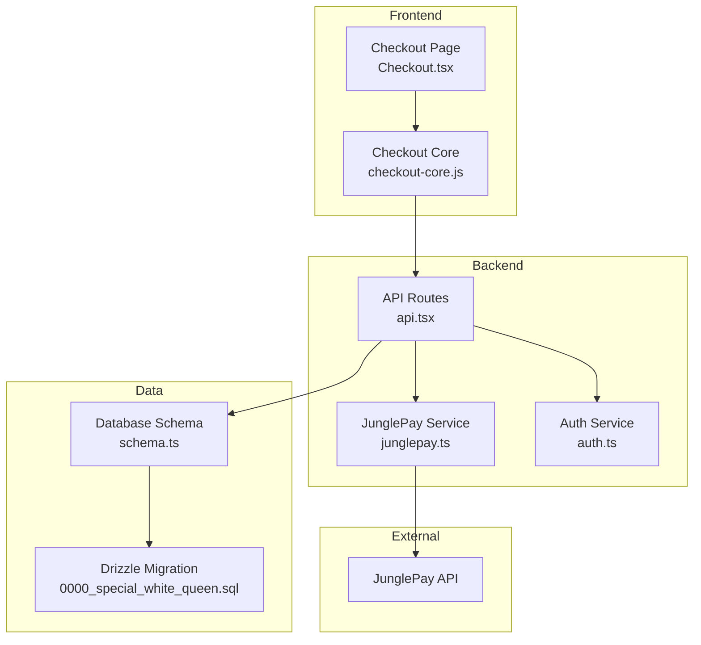
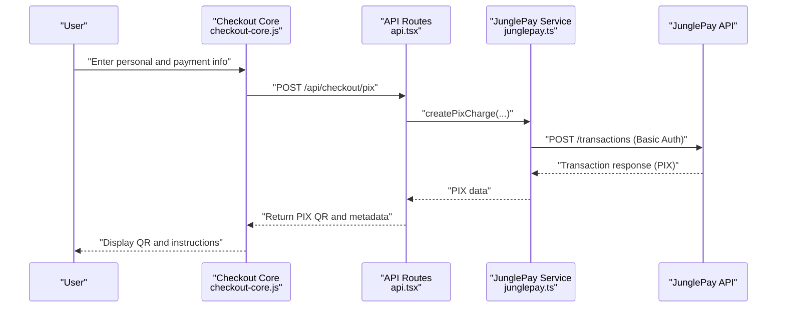
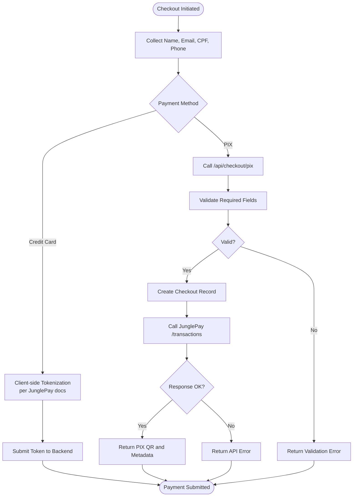
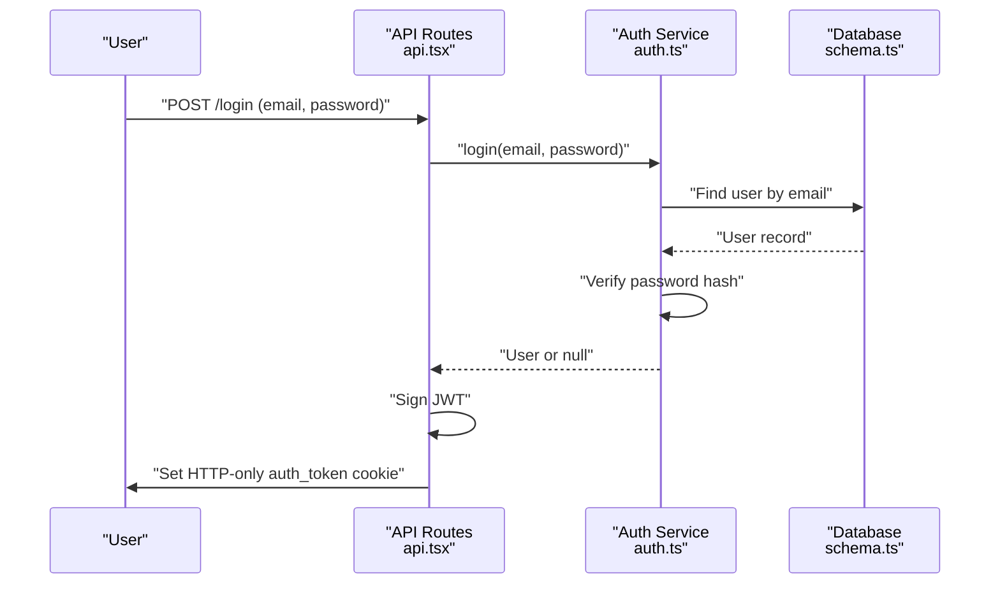
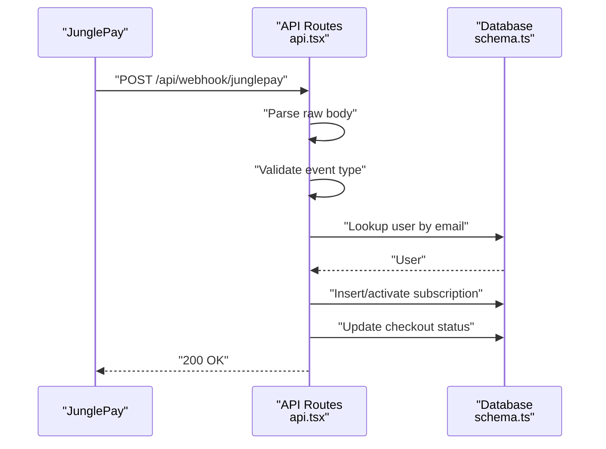
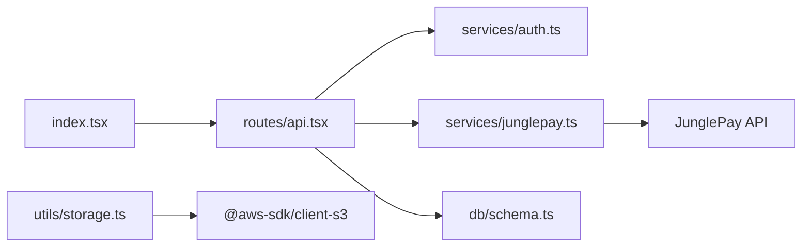

# Security & PCI Compliance

<cite>
**Referenced Files in This Document**
- [junglepay.ts](file://src/services/junglepay.ts)
- [api.tsx](file://src/routes/api.tsx)
- [auth.ts](file://src/services/auth.ts)
- [schema.ts](file://src/db/schema.ts)
- [Checkout.tsx](file://src/pages/Checkout.tsx)
- [checkout-core.js](file://static/js/checkout-core.js)
- [storage.ts](file://src/utils/storage.ts)
- [index.tsx](file://src/index.tsx)
- [package.json](file://package.json)
- [drizzle.config.ts](file://drizzle.config.ts)
- [0000_special_white_queen.sql](file://drizzle/0000_special_white_queen.sql)
- [junglepay-documentation.md](file://junglepay-documentation.md)
</cite>

## Table of Contents
1. [Introduction](#introduction)
2. [Project Structure](#project-structure)
3. [Core Components](#core-components)
4. [Architecture Overview](#architecture-overview)
5. [Detailed Component Analysis](#detailed-component-analysis)
6. [Dependency Analysis](#dependency-analysis)
7. [Performance Considerations](#performance-considerations)
8. [Troubleshooting Guide](#troubleshooting-guide)
9. [Conclusion](#conclusion)
10. [Appendices](#appendices)

## Introduction
This document provides comprehensive security and compliance guidance for payment processing within the project. It focuses on PCI DSS alignment, encryption standards, secure transmission, tokenization strategies, sensitive data handling, secure storage, authentication and authorization controls, audit trail maintenance, fraud prevention, risk assessment, suspicious activity monitoring, webhook security, API key management, and customer data protection. It also outlines compliance reporting and incident response procedures tailored to the current implementation.

## Project Structure
The payment stack spans frontend, backend routes, services, and database schema:
- Frontend checkout page and JS orchestrate payment collection and initiate requests.
- Backend routes expose payment endpoints and webhooks.
- Services encapsulate provider integrations and internal business logic.
- Database schema defines entities and constraints for auditability and integrity.

**Diagram sources**
- [Checkout.tsx](file://src/pages/Checkout.tsx#L1-L74)
- [checkout-core.js](file://static/js/checkout-core.js#L1-L312)
- [api.tsx](file://src/routes/api.tsx#L1-L519)
- [junglepay.ts](file://src/services/junglepay.ts#L1-L270)
- [auth.ts](file://src/services/auth.ts#L1-L91)
- [schema.ts](file://src/db/schema.ts#L1-L178)
- [0000_special_white_queen.sql](file://drizzle/0000_special_white_queen.sql#L1-L80)

**Section sources**
- [Checkout.tsx](file://src/pages/Checkout.tsx#L1-L74)
- [checkout-core.js](file://static/js/checkout-core.js#L1-L312)
- [api.tsx](file://src/routes/api.tsx#L1-L519)
- [junglepay.ts](file://src/services/junglepay.ts#L1-L270)
- [auth.ts](file://src/services/auth.ts#L1-L91)
- [schema.ts](file://src/db/schema.ts#L1-L178)
- [0000_special_white_queen.sql](file://drizzle/0000_special_white_queen.sql#L1-L80)

## Core Components
- Payment orchestration via frontend and backend routes.
- Provider integration with JunglePay for PIX and credit card transactions.
- Authentication and session management with JWT cookies.
- Database schema supporting audit trails and subscription lifecycle.
- Storage utilities for external media uploads.

Key implementation references:
- Payment initiation and webhook handling: [api.tsx](file://src/routes/api.tsx#L16-L86), [api.tsx](file://src/routes/api.tsx#L88-L170), [api.tsx](file://src/routes/api.tsx#L401-L506)
- Provider service for PIX: [junglepay.ts](file://src/services/junglepay.ts#L107-L268)
- Authentication and JWT cookie handling: [api.tsx](file://src/routes/api.tsx#L316-L379), [api.tsx](file://src/routes/api.tsx#L508-L517), [auth.ts](file://src/services/auth.ts#L28-L39)
- Database schema for auditability: [schema.ts](file://src/db/schema.ts#L6-L127), [0000_special_white_queen.sql](file://drizzle/0000_special_white_queen.sql#L35-L43)
- Storage utilities: [storage.ts](file://src/utils/storage.ts#L1-L39)

**Section sources**
- [api.tsx](file://src/routes/api.tsx#L16-L86)
- [api.tsx](file://src/routes/api.tsx#L88-L170)
- [api.tsx](file://src/routes/api.tsx#L401-L506)
- [junglepay.ts](file://src/services/junglepay.ts#L107-L268)
- [auth.ts](file://src/services/auth.ts#L28-L39)
- [schema.ts](file://src/db/schema.ts#L6-L127)
- [0000_special_white_queen.sql](file://drizzle/0000_special_white_queen.sql#L35-L43)
- [storage.ts](file://src/utils/storage.ts#L1-L39)

## Architecture Overview
The payment flow integrates frontend, backend, and external provider APIs while maintaining strict separation of sensitive data handling.

**Diagram sources**
- [checkout-core.js](file://static/js/checkout-core.js#L141-L220)
- [api.tsx](file://src/routes/api.tsx#L41-L86)
- [junglepay.ts](file://src/services/junglepay.ts#L107-L268)
- [junglepay-documentation.md](file://junglepay-documentation.md#L11-L25)

## Detailed Component Analysis

### Payment Orchestration and Tokenization
- Frontend collects minimal required data and initiates PIX payments through backend endpoints.
- Credit card flows rely on provider-side tokenization per external documentation.
- Sensitive PAN/CVV are not handled server-side; tokenization occurs client-side as documented.

Implementation references:
- Frontend checkout flow and PIX initiation: [checkout-core.js](file://static/js/checkout-core.js#L141-L220)
- Backend PIX endpoint and validation: [api.tsx](file://src/routes/api.tsx#L41-L86)
- Provider tokenization guidance: [junglepay-documentation.md](file://junglepay-documentation.md#L29-L52)

**Diagram sources**
- [checkout-core.js](file://static/js/checkout-core.js#L141-L220)
- [api.tsx](file://src/routes/api.tsx#L41-L86)
- [junglepay.ts](file://src/services/junglepay.ts#L107-L268)
- [junglepay-documentation.md](file://junglepay-documentation.md#L29-L52)

**Section sources**
- [checkout-core.js](file://static/js/checkout-core.js#L141-L220)
- [api.tsx](file://src/routes/api.tsx#L41-L86)
- [junglepay.ts](file://src/services/junglepay.ts#L107-L268)
- [junglepay-documentation.md](file://junglepay-documentation.md#L29-L52)

### Authentication and Authorization Controls
- Password hashing uses a modern hashing scheme.
- JWT signing and verification are used for session tokens stored in HTTP-only cookies.
- Cookie attributes include SameSite, Secure, and HttpOnly for transport and XSS protections.
- Role-based access is present in the schema; enforcement depends on route guards.

Implementation references:
- Password hashing and login verification: [auth.ts](file://src/services/auth.ts#L7-L39)
- JWT cookie creation and logout: [api.tsx](file://src/routes/api.tsx#L316-L379), [api.tsx](file://src/routes/api.tsx#L508-L517)
- Cookie attributes: [api.tsx](file://src/routes/api.tsx#L337-L343), [api.tsx](file://src/routes/api.tsx#L509-L515)
- User schema with role: [schema.ts](file://src/db/schema.ts#L6-L14)

**Diagram sources**
- [api.tsx](file://src/routes/api.tsx#L316-L379)
- [auth.ts](file://src/services/auth.ts#L28-L39)
- [schema.ts](file://src/db/schema.ts#L6-L14)

**Section sources**
- [auth.ts](file://src/services/auth.ts#L7-L39)
- [api.tsx](file://src/routes/api.tsx#L316-L379)
- [api.tsx](file://src/routes/api.tsx#L508-L517)
- [schema.ts](file://src/db/schema.ts#L6-L14)

### Webhook Security and Fraud Prevention
- Webhooks receive provider events and update subscriptions and user status.
- Webhook handlers parse raw bodies and validate event types and statuses.
- Consider adding signature verification and idempotency keys for stronger integrity.

Implementation references:
- JunglePay webhook handler: [api.tsx](file://src/routes/api.tsx#L88-L170)
- Dias marketplace webhook handler: [api.tsx](file://src/routes/api.tsx#L401-L506)

**Diagram sources**
- [api.tsx](file://src/routes/api.tsx#L88-L170)
- [schema.ts](file://src/db/schema.ts#L37-L46)

**Section sources**
- [api.tsx](file://src/routes/api.tsx#L88-L170)
- [api.tsx](file://src/routes/api.tsx#L401-L506)
- [schema.ts](file://src/db/schema.ts#L37-L46)

### Data Encryption Standards and Secure Transmission
- Basic Access Authentication is used for provider API calls.
- TLS is implied by HTTPS endpoints; ensure outbound provider calls use HTTPS.
- Client-side tokenization for credit cards is recommended per provider docs.

Implementation references:
- Basic Auth generation: [junglepay.ts](file://src/services/junglepay.ts#L70-L75)
- Provider API call: [junglepay.ts](file://src/services/junglepay.ts#L206-L213)
- Tokenization guidance: [junglepay-documentation.md](file://junglepay-documentation.md#L11-L25), [junglepay-documentation.md](file://junglepay-documentation.md#L29-L52)

**Section sources**
- [junglepay.ts](file://src/services/junglepay.ts#L70-L75)
- [junglepay.ts](file://src/services/junglepay.ts#L206-L213)
- [junglepay-documentation.md](file://junglepay-documentation.md#L11-L25)
- [junglepay-documentation.md](file://junglepay-documentation.md#L29-L52)

### Sensitive Data Handling and Secure Storage
- User passwords are hashed server-side; plaintext passwords are not stored.
- Customer identifiers (CPF, phone) are collected; sanitize and avoid logging sensitive values.
- Media uploads use S3-compatible storage; ensure credentials are managed securely.

Implementation references:
- Password hashing: [auth.ts](file://src/services/auth.ts#L7)
- Data sanitization helpers: [junglepay.ts](file://src/services/junglepay.ts#L80-L89)
- S3 upload utility: [storage.ts](file://src/utils/storage.ts#L1-L39)

**Section sources**
- [auth.ts](file://src/services/auth.ts#L7)
- [junglepay.ts](file://src/services/junglepay.ts#L80-L89)
- [storage.ts](file://src/utils/storage.ts#L1-L39)

### Audit Trail Maintenance
- Database schema includes timestamps and status fields enabling auditability.
- Checkout records capture customer data and status transitions.
- Webhook handlers update subscriptions and user status, creating change logs.

Implementation references:
- Audit fields in schema: [schema.ts](file://src/db/schema.ts#L113-L127), [schema.ts](file://src/db/schema.ts#L37-L46)
- Checkout creation: [api.tsx](file://src/routes/api.tsx#L21-L34)
- Webhook updates: [api.tsx](file://src/routes/api.tsx#L129-L155), [api.tsx](file://src/routes/api.tsx#L442-L496)

**Section sources**
- [schema.ts](file://src/db/schema.ts#L113-L127)
- [schema.ts](file://src/db/schema.ts#L37-L46)
- [api.tsx](file://src/routes/api.tsx#L21-L34)
- [api.tsx](file://src/routes/api.tsx#L129-L155)
- [api.tsx](file://src/routes/api.tsx#L442-L496)

### Risk Assessment and Suspicious Activity Monitoring
- Implement rate limiting on payment endpoints.
- Add signature verification for webhooks and idempotency checks.
- Monitor unusual patterns (multiple failed attempts, high-value transactions, IP anomalies).
- Enforce strong input validation and sanitization.

[No sources needed since this section provides general guidance]

### Compliance Reporting and Incident Response
- Maintain logs for payment events, authentication attempts, and webhook deliveries.
- Define escalation paths for suspected breaches and unauthorized access.
- Document remediation steps and timelines for incident resolution.

[No sources needed since this section provides general guidance]

## Dependency Analysis
External dependencies impacting security:
- Hono for routing and JWT utilities.
- Drizzle ORM for database access.
- AWS SDK for S3-compatible storage.

**Diagram sources**
- [index.tsx](file://src/index.tsx#L1-L20)
- [api.tsx](file://src/routes/api.tsx#L1-L11)
- [auth.ts](file://src/services/auth.ts#L1-L4)
- [junglepay.ts](file://src/services/junglepay.ts#L1-L4)
- [schema.ts](file://src/db/schema.ts#L1-L3)
- [storage.ts](file://src/utils/storage.ts#L1-L2)
- [package.json](file://package.json#L8-L16)

**Section sources**
- [index.tsx](file://src/index.tsx#L1-L20)
- [package.json](file://package.json#L8-L16)

## Performance Considerations
- Minimize synchronous operations in hot paths; offload heavy tasks to background jobs.
- Cache non-sensitive plan data to reduce repeated database queries.
- Ensure outbound provider calls are asynchronous and resilient to network failures.

[No sources needed since this section provides general guidance]

## Troubleshooting Guide
Common issues and mitigations:
- Authentication failures: Verify JWT secret configuration and cookie attributes.
- Payment errors: Check provider API credentials and network connectivity.
- Webhook mismatches: Confirm event types and statuses; add logging for raw payloads.

Implementation references:
- JWT secret usage: [api.tsx](file://src/routes/api.tsx#L13)
- Cookie configuration: [api.tsx](file://src/routes/api.tsx#L337-L343), [api.tsx](file://src/routes/api.tsx#L509-L515)
- Webhook parsing and logging: [api.tsx](file://src/routes/api.tsx#L89-L170), [api.tsx](file://src/routes/api.tsx#L402-L506)

**Section sources**
- [api.tsx](file://src/routes/api.tsx#L13)
- [api.tsx](file://src/routes/api.tsx#L337-L343)
- [api.tsx](file://src/routes/api.tsx#L509-L515)
- [api.tsx](file://src/routes/api.tsx#L89-L170)
- [api.tsx](file://src/routes/api.tsx#L402-L506)

## Conclusion
The project implements a clear separation of concerns for payment processing, leveraging provider-side tokenization for sensitive card data, hashing for passwords, and JWT cookies for session management. To achieve full PCI DSS alignment, strengthen webhook integrity with signatures, enforce strict input validation, and enhance observability with robust audit trails and monitoring. Establish formal incident response procedures and maintain compliance documentation for audits.

[No sources needed since this section summarizes without analyzing specific files]

## Appendices

### PCI DSS Alignment Checklist
- Do not store full primary account numbers (PAN) or service codes.
- Use transport layer encryption (TLS) for all communications.
- Implement strong access control and least privilege.
- Maintain audit trails for all transactions and administrative actions.
- Regularly test security controls and vulnerability assessments.

[No sources needed since this section provides general guidance]

### API Key Management Best Practices
- Store provider secrets in environment variables.
- Rotate keys regularly and revoke compromised credentials.
- Limit permissions and use separate keys for development and production.

[No sources needed since this section provides general guidance]