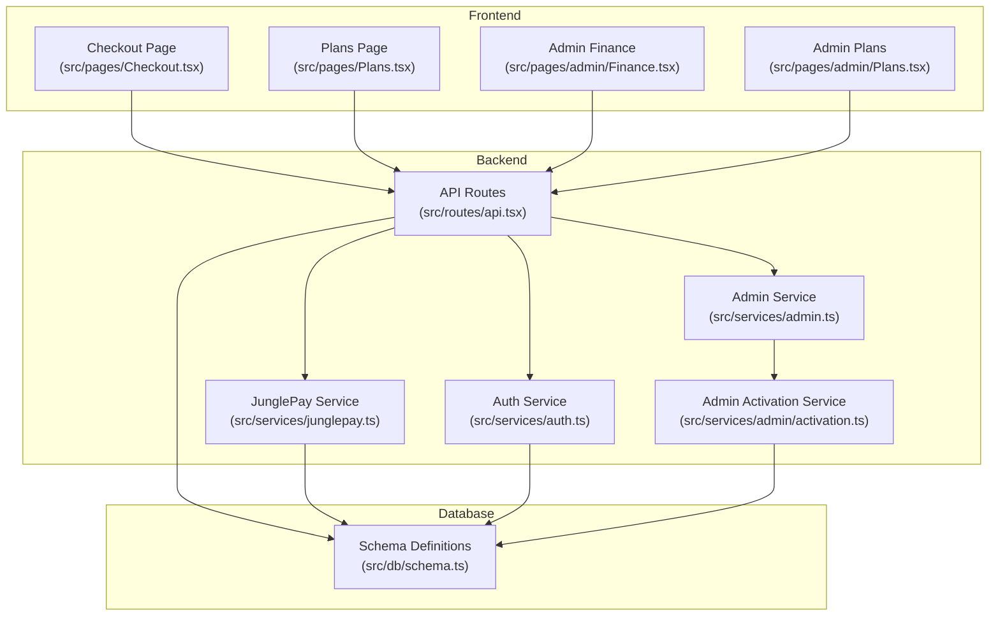
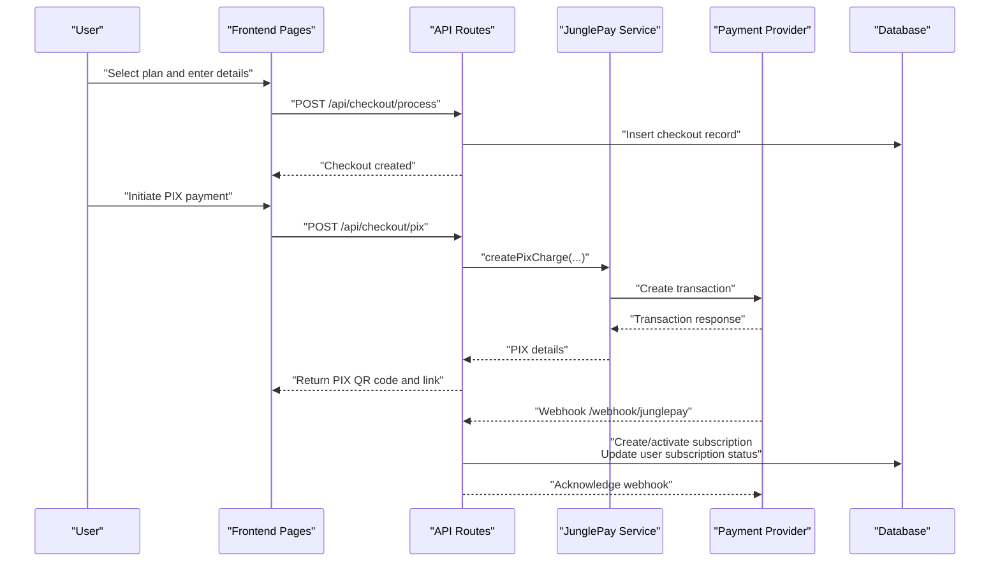
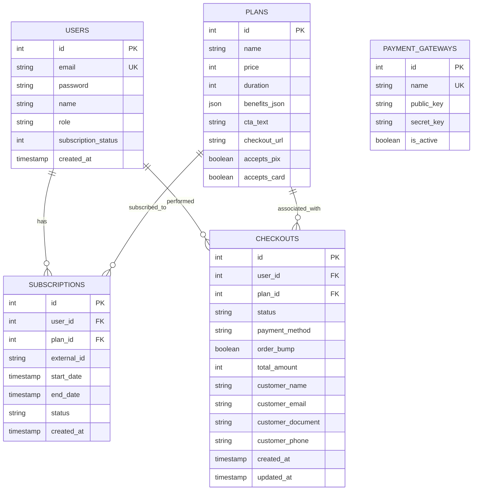
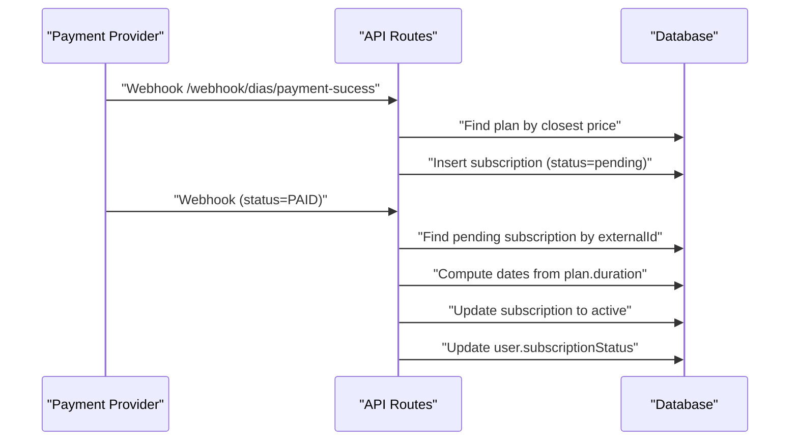
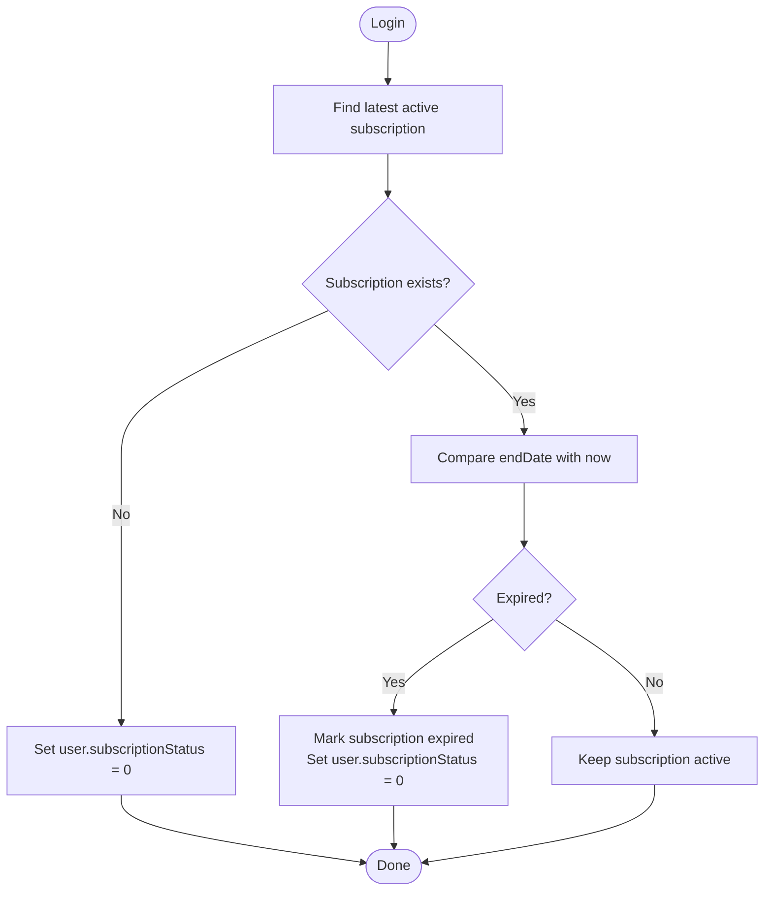
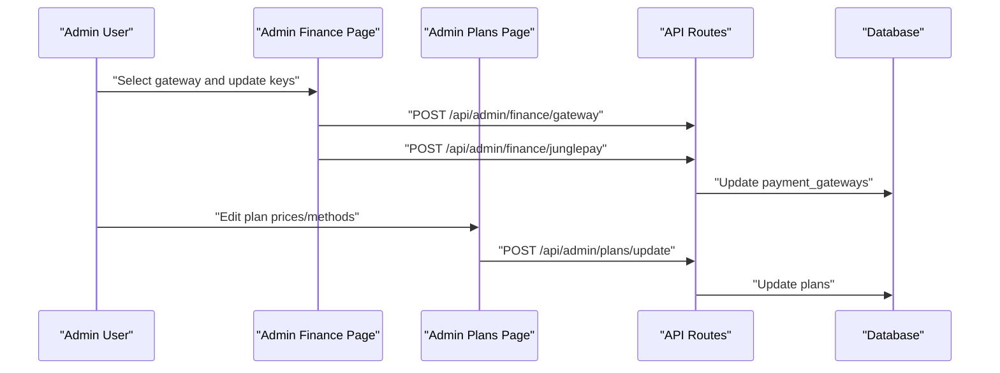
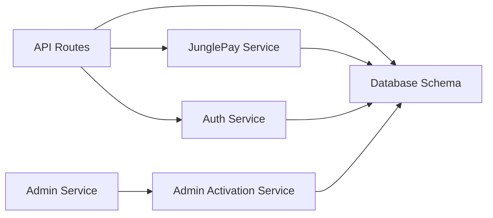

# Subscription Management & Recurring Payments

<cite>
**Referenced Files in This Document**
- [src/db/schema.ts](file://src/db/schema.ts)
- [drizzle/0001_chunky_thunderbolts.sql](file://drizzle/0001_chunky_thunderbolts.sql)
- [drizzle/0004_mixed_vermin.sql](file://drizzle/0004_mixed_vermin.sql)
- [src/services/junglepay.ts](file://src/services/junglepay.ts)
- [src/routes/api.tsx](file://src/routes/api.tsx)
- [src/services/auth.ts](file://src/services/auth.ts)
- [src/pages/Checkout.tsx](file://src/pages/Checkout.tsx)
- [src/pages/Plans.tsx](file://src/pages/Plans.tsx)
- [src/pages/admin/Finance.tsx](file://src/pages/admin/Finance.tsx)
- [src/pages/admin/Plans.tsx](file://src/pages/admin/Plans.tsx)
- [src/services/admin.ts](file://src/services/admin.ts)
- [src/services/admin/activation.ts](file://src/services/admin/activation.ts)
- [junglepay-documentation.md](file://junglepay-documentation.md)
</cite>

## Table of Contents
1. [Introduction](#introduction)
2. [Project Structure](#project-structure)
3. [Core Components](#core-components)
4. [Architecture Overview](#architecture-overview)
5. [Detailed Component Analysis](#detailed-component-analysis)
6. [Dependency Analysis](#dependency-analysis)
7. [Performance Considerations](#performance-considerations)
8. [Troubleshooting Guide](#troubleshooting-guide)
9. [Conclusion](#conclusion)
10. [Appendices](#appendices)

## Introduction
This document explains the subscription management and recurring payment system. It covers the subscription lifecycle, plan activation workflows, recurring payment processing, integration between payment processing and subscription services, automatic renewal handling, grace period management, status tracking, plan upgrades/downgrades, cancellations, database schema relationships, state management, and administrative controls.

## Project Structure
The subscription system spans frontend pages, backend routes, payment services, and database schema. Key areas:
- Database schema defines users, plans, subscriptions, payment gateways, checkouts, and related entities.
- Backend routes expose checkout processing, payment provider webhooks, and admin configuration APIs.
- Payment service integrates with JunglePay for PIX transactions.
- Authentication service manages subscription creation and status checks.
- Admin pages enable gateway configuration and plan updates.

**Diagram sources**
- [src/pages/Checkout.tsx](file://src/pages/Checkout.tsx#L1-L74)
- [src/pages/Plans.tsx](file://src/pages/Plans.tsx#L1-L84)
- [src/pages/admin/Finance.tsx](file://src/pages/admin/Finance.tsx#L1-L112)
- [src/pages/admin/Plans.tsx](file://src/pages/admin/Plans.tsx#L1-L126)
- [src/routes/api.tsx](file://src/routes/api.tsx#L1-L519)
- [src/services/junglepay.ts](file://src/services/junglepay.ts#L1-L270)
- [src/services/auth.ts](file://src/services/auth.ts#L1-L91)
- [src/services/admin.ts](file://src/services/admin.ts#L1-L5)
- [src/services/admin/activation.ts](file://src/services/admin/activation.ts#L1-L86)
- [src/db/schema.ts](file://src/db/schema.ts#L1-L178)

**Section sources**
- [src/db/schema.ts](file://src/db/schema.ts#L1-L178)
- [src/routes/api.tsx](file://src/routes/api.tsx#L1-L519)

## Core Components
- Database schema: Defines users, plans, subscriptions, payment gateways, checkouts, and relationships.
- Payment service: Handles JunglePay PIX charge creation and webhook processing.
- API routes: Expose checkout processing, payment webhooks, and admin configuration endpoints.
- Authentication service: Creates subscriptions and validates active status.
- Admin services: Manage gateway activation and plan updates.

**Section sources**
- [src/db/schema.ts](file://src/db/schema.ts#L6-L127)
- [src/services/junglepay.ts](file://src/services/junglepay.ts#L52-L270)
- [src/routes/api.tsx](file://src/routes/api.tsx#L15-L170)
- [src/services/auth.ts](file://src/services/auth.ts#L41-L91)
- [src/services/admin.ts](file://src/services/admin.ts#L1-L5)

## Architecture Overview
The system supports two primary payment flows:
- Internal checkout via JunglePay (PIX).
- External checkout via Dias Marketplace (redirect-based).

Both flows integrate with webhooks to update subscription status and user subscription status.

**Diagram sources**
- [src/pages/Checkout.tsx](file://src/pages/Checkout.tsx#L19-L74)
- [src/routes/api.tsx](file://src/routes/api.tsx#L15-L86)
- [src/services/junglepay.ts](file://src/services/junglepay.ts#L107-L268)
- [src/routes/api.tsx](file://src/routes/api.tsx#L88-L170)

## Detailed Component Analysis

### Database Schema and Relationships
The schema defines core entities and their relationships:
- Users: Track roles and subscription status.
- Plans: Define pricing, duration, and acceptance flags for payment methods.
- Subscriptions: Link users to plans, track external transaction IDs, dates, and status.
- Payment Gateways: Store provider configurations.
- Checkouts: Capture pending payment attempts.

**Diagram sources**
- [src/db/schema.ts](file://src/db/schema.ts#L6-L127)

**Section sources**
- [src/db/schema.ts](file://src/db/schema.ts#L6-L127)
- [drizzle/0001_chunky_thunderbolts.sql](file://drizzle/0001_chunky_thunderbolts.sql#L1-L14)
- [drizzle/0004_mixed_vermin.sql](file://drizzle/0004_mixed_vermin.sql#L1-L12)

### Payment Processing and Webhooks
- Internal checkout (JunglePay):
  - Frontend submits customer details and plan selection.
  - Backend creates a checkout record and calls the JunglePay service to generate a PIX charge.
  - On successful response, the service persists checkout details and returns PIX QR code and secure URL.
  - Payment provider sends a webhook to acknowledge payment; backend activates subscription and updates user status.

- External checkout (Dias Marketplace):
  - Webhook receives transaction events indicating pending and paid statuses.
  - Pending: create a pending subscription linked to the external transaction ID.
  - Paid: locate the pending subscription, compute start/end dates based on plan duration, activate subscription, and update user status.

**Diagram sources**
- [src/routes/api.tsx](file://src/routes/api.tsx#L402-L506)

**Section sources**
- [src/services/junglepay.ts](file://src/services/junglepay.ts#L107-L268)
- [src/routes/api.tsx](file://src/routes/api.tsx#L88-L170)
- [src/routes/api.tsx](file://src/routes/api.tsx#L402-L506)

### Subscription Lifecycle Management
- Creation:
  - Admin-managed creation sets status to active immediately and updates user subscription status.
  - Authenticated user subscription creation uses plan duration to compute start/end dates and sets status to active.

- Status tracking:
  - On login, backend checks for the most recent active subscription and updates user status accordingly.
  - Expired subscriptions are marked expired and user status reset.

**Diagram sources**
- [src/services/auth.ts](file://src/services/auth.ts#L67-L89)

**Section sources**
- [src/services/auth.ts](file://src/services/auth.ts#L41-L91)

### Plan Activation Workflows
- Admin configuration:
  - Admin Finance page allows selecting active gateway and updating JunglePay keys.
  - Admin Plans page enables editing plan prices, checkout URLs, and accepted payment methods per plan.

- Activation service:
  - Admin activation service orchestrates model/post synchronization and upserts into production tables.

**Diagram sources**
- [src/pages/admin/Finance.tsx](file://src/pages/admin/Finance.tsx#L18-L112)
- [src/pages/admin/Plans.tsx](file://src/pages/admin/Plans.tsx#L20-L126)
- [src/routes/api.tsx](file://src/routes/api.tsx#L172-L248)

**Section sources**
- [src/pages/admin/Finance.tsx](file://src/pages/admin/Finance.tsx#L18-L112)
- [src/pages/admin/Plans.tsx](file://src/pages/admin/Plans.tsx#L20-L126)
- [src/routes/api.tsx](file://src/routes/api.tsx#L172-L248)
- [src/services/admin/activation.ts](file://src/services/admin/activation.ts#L1-L86)

### Recurring Payments and Automatic Renewal
- Current implementation:
  - Subscriptions are created with fixed start/end dates based on plan duration.
  - No automated renewal logic is present in the current codebase.
  - External provider webhooks handle paid events; internal PIX charges are initiated by the service.

- Recommendations:
  - Implement scheduled jobs to check upcoming expirations and trigger renewal attempts.
  - Add a "renewalAttempts" counter and "autoRenew" flag on subscriptions.
  - Extend webhook handlers to manage failed renewal events and transitions to grace/expired states.

[No sources needed since this section provides general guidance]

### Grace Period Management
- Current behavior:
  - Subscriptions are marked expired when endDate passes; user status resets to inactive.
  - No explicit grace period logic is implemented.

- Recommendations:
  - Add a configurable grace window (e.g., 7 days) after expiration.
  - During grace, keep user access functional while marking subscription as on-hold.
  - After grace, mark as expired and revoke access.

[No sources needed since this section provides general guidance]

### Plan Upgrades/Downgrades
- Current behavior:
  - No explicit upgrade/downgrade logic exists in the codebase.

- Implementation approach:
  - Create proration logic based on remaining time on the current plan.
  - Adjust billing cycle to align with the new plan’s duration.
  - Emit proration events and adjust next billing date accordingly.

[No sources needed since this section provides general guidance]

### Cancellations
- Current behavior:
  - No explicit cancellation endpoints or logic are present.

- Implementation approach:
  - Add cancellation endpoint to set subscription status to canceled and optionally refund unused period.
  - Prevent renewal processing for canceled subscriptions.
  - Update user status to reflect lack of active subscription.

[No sources needed since this section provides general guidance]

### User-Facing Subscription Features
- Plans page displays current subscription details when a user is subscribed.
- Checkout page handles customer identification, order summary, and payment initiation.

**Section sources**
- [src/pages/Plans.tsx](file://src/pages/Plans.tsx#L10-L84)
- [src/pages/Checkout.tsx](file://src/pages/Checkout.tsx#L19-L74)

### Administrative Controls
- Admin Finance:
  - Select active gateway and configure JunglePay keys.
- Admin Plans:
  - Update plan prices, checkout URLs, and accepted payment methods.
- Admin Activation:
  - Orchestrate model/post synchronization and activation.

**Section sources**
- [src/pages/admin/Finance.tsx](file://src/pages/admin/Finance.tsx#L18-L112)
- [src/pages/admin/Plans.tsx](file://src/pages/admin/Plans.tsx#L20-L126)
- [src/services/admin/activation.ts](file://src/services/admin/activation.ts#L1-L86)

## Dependency Analysis
- API routes depend on:
  - JunglePay service for PIX charges.
  - Authentication service for subscription creation and status checks.
  - Database schema for persistence.
- Payment service depends on:
  - Payment gateway configuration and external provider APIs.
- Admin services depend on:
  - Whitelabel data and mapping utilities.

**Diagram sources**
- [src/routes/api.tsx](file://src/routes/api.tsx#L1-L12)
- [src/services/junglepay.ts](file://src/services/junglepay.ts#L1-L10)
- [src/services/auth.ts](file://src/services/auth.ts#L1-L5)
- [src/services/admin.ts](file://src/services/admin.ts#L1-L5)
- [src/services/admin/activation.ts](file://src/services/admin/activation.ts#L1-L5)

**Section sources**
- [src/routes/api.tsx](file://src/routes/api.tsx#L1-L12)
- [src/services/junglepay.ts](file://src/services/junglepay.ts#L1-L10)
- [src/services/auth.ts](file://src/services/auth.ts#L1-L5)
- [src/services/admin.ts](file://src/services/admin.ts#L1-L5)
- [src/services/admin/activation.ts](file://src/services/admin/activation.ts#L1-L5)

## Performance Considerations
- Webhook processing:
  - Minimize database writes by batching updates and avoiding redundant lookups.
  - Use indexed columns (external_id, user_id) for efficient joins.
- Checkout creation:
  - Persist checkout records early to reduce race conditions during payment processing.
- Subscription status checks:
  - Cache user subscription status per session to avoid repeated DB queries.

[No sources needed since this section provides general guidance]

## Troubleshooting Guide
- Gateway configuration errors:
  - Verify active gateway and presence of secret/public keys before initiating payments.
- Webhook mismatches:
  - Ensure external transaction IDs match stored subscriptions; handle missing records gracefully.
- Payment provider documentation:
  - Refer to JunglePay documentation for expected webhook payloads and status transitions.

**Section sources**
- [src/services/junglepay.ts](file://src/services/junglepay.ts#L107-L133)
- [src/routes/api.tsx](file://src/routes/api.tsx#L88-L170)
- [junglepay-documentation.md](file://junglepay-documentation.md#L54-L149)

## Conclusion
The system provides a solid foundation for subscription management with internal and external payment flows, webhook-driven activation, and administrative controls. To achieve full recurring billing maturity, implement scheduled renewal checks, grace periods, upgrade/downgrade logic, and explicit cancellation handling.

## Appendices

### API Endpoints Overview
- POST /api/checkout/process: Create a checkout record.
- POST /api/checkout/pix: Initiate a PIX charge via JunglePay.
- POST /webhook/junglepay: Handle payment provider webhook.
- POST /webhook/dias/payment-sucess: Handle Dias Marketplace webhook.
- POST /admin/finance/gateway: Set active gateway.
- POST /admin/finance/junglepay: Update JunglePay keys.
- POST /admin/plans/update: Update plan configuration.
- POST /subscribe: Create subscription for authenticated users.

**Section sources**
- [src/routes/api.tsx](file://src/routes/api.tsx#L15-L86)
- [src/routes/api.tsx](file://src/routes/api.tsx#L88-L170)
- [src/routes/api.tsx](file://src/routes/api.tsx#L172-L248)
- [src/services/junglepay.ts](file://src/services/junglepay.ts#L107-L268)