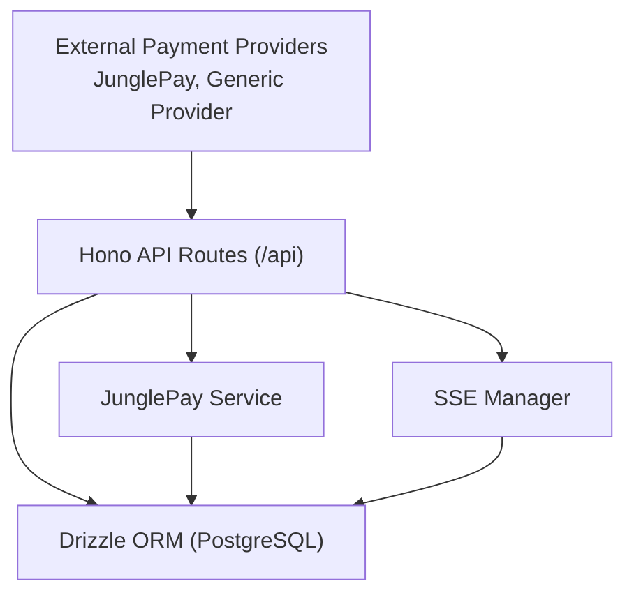
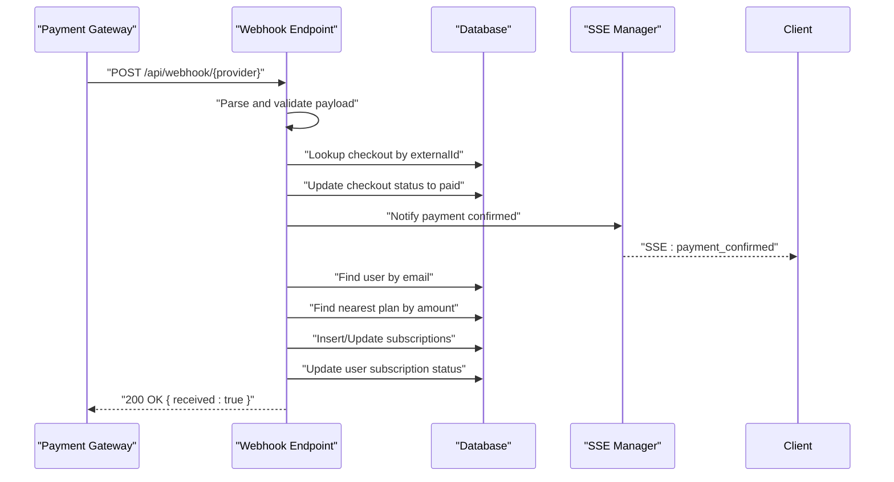
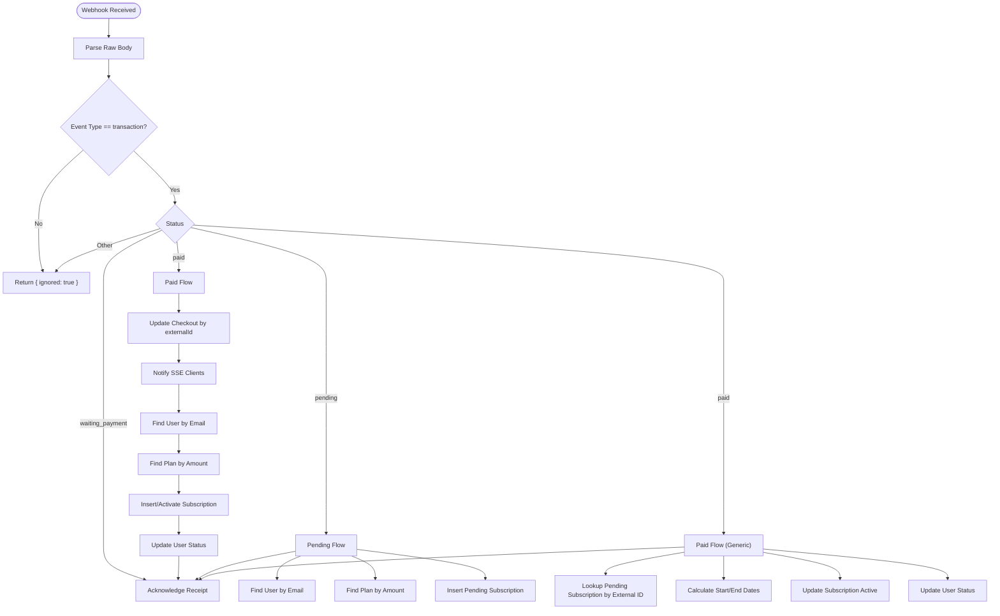
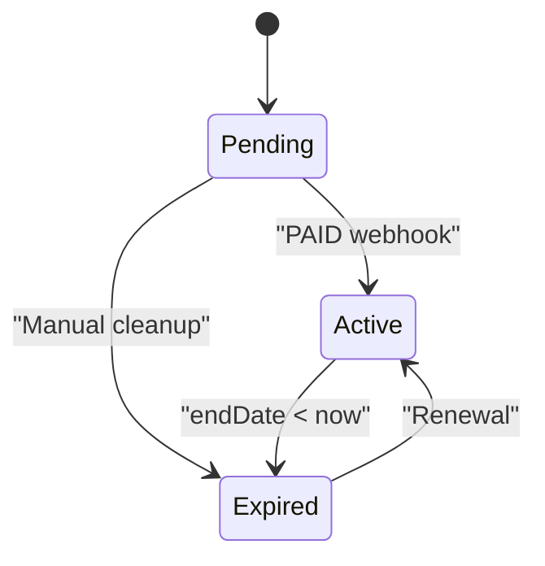
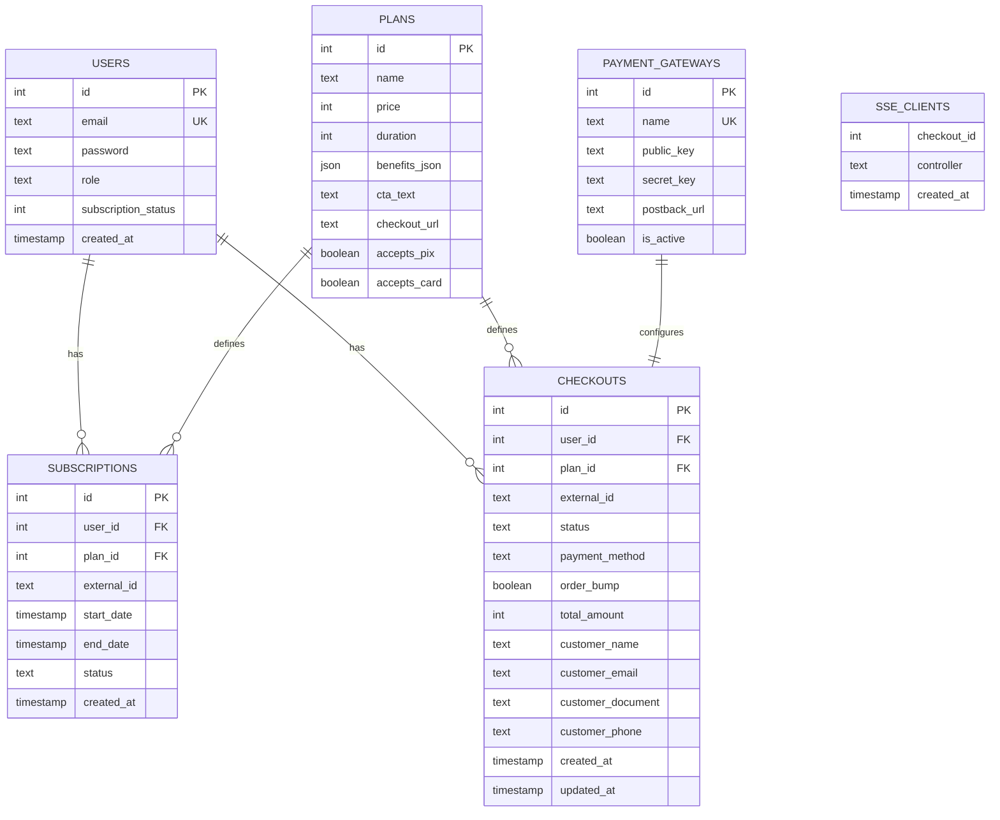
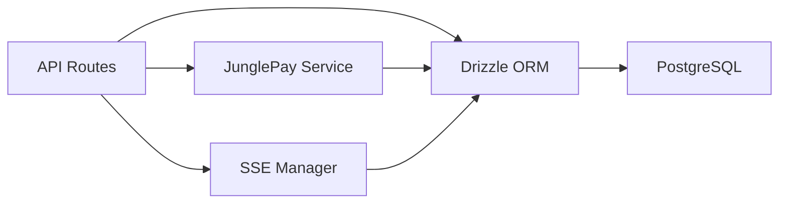

# Webhook Processing & Status Tracking

<cite>
**Referenced Files in This Document**
- [api.tsx](file://src/routes/api.tsx)
- [junglepay.ts](file://src/services/junglepay.ts)
- [schema.ts](file://src/db/schema.ts)
- [index.tsx](file://src/index.tsx)
- [auth.ts](file://src/services/auth.ts)
- [db/index.ts](file://src/db/index.ts)
- [drizzle.config.ts](file://drizzle.config.ts)
- [sse.ts](file://src/services/sse.ts)
- [migrate-postback.ts](file://scripts/migrate-postback.ts)
</cite>

## Update Summary
**Changes Made**
- Updated webhook processing to reflect new external ID mapping system
- Added documentation for postback URL configuration in payment gateways
- Updated architecture to reflect transition from polling to real-time SSE streaming
- Enhanced webhook flow with immediate checkout updates and SSE notifications
- Added new SSE manager component for real-time payment status updates

## Table of Contents
1. [Introduction](#introduction)
2. [Project Structure](#project-structure)
3. [Core Components](#core-components)
4. [Architecture Overview](#architecture-overview)
5. [Detailed Component Analysis](#detailed-component-analysis)
6. [Dependency Analysis](#dependency-analysis)
7. [Performance Considerations](#performance-considerations)
8. [Troubleshooting Guide](#troubleshooting-guide)
9. [Conclusion](#conclusion)

## Introduction
This document explains the webhook processing pipeline for payment status updates, focusing on two payment providers: JunglePay and a generic provider handled under a unified webhook endpoint. The system has been enhanced with real-time Server-Sent Events (SSE) streaming for immediate payment notifications, improved external ID mapping for payment correlation, and configurable postback URLs for payment provider communications. It covers endpoint configuration, payload validation, signature verification, event handling, payment status tracking, database updates, subscription activation, retry mechanisms, failure handling, security considerations, and rate limiting strategies.

## Project Structure
The webhook system is implemented as part of the API routes mounted under /api. Payment provider integrations are encapsulated in dedicated services, while database access is centralized via Drizzle ORM. Real-time payment status updates are handled through a dedicated SSE manager that maintains persistent connections with clients.

**Diagram sources**
- [api.tsx](file://src/routes/api.tsx#L222-L316)
- [junglepay.ts](file://src/services/junglepay.ts#L239-L241)
- [sse.ts](file://src/services/sse.ts#L1-L160)
- [db/index.ts](file://src/db/index.ts#L1-L7)

**Section sources**
- [api.tsx](file://src/routes/api.tsx#L1-L20)
- [index.tsx](file://src/index.tsx#L11-L14)

## Core Components
- Webhook endpoints:
  - JunglePay webhook: POST /api/webhook/junglepay
  - Generic provider webhook: POST /api/webhook/dias/payment-sucess
- Payment provider service:
  - JunglePayService: handles provider-specific requests, authentication, and postback URL generation
- Real-time streaming:
  - SSE Manager: manages persistent connections for real-time payment notifications
- Database schema:
  - Users, Plans, Subscriptions, Checkouts, Payment Gateways
- Authentication and subscription helpers:
  - AuthService: manages user subscription lifecycle and status checks

**Section sources**
- [api.tsx](file://src/routes/api.tsx#L222-L316)
- [api.tsx](file://src/routes/api.tsx#L549-L654)
- [junglepay.ts](file://src/services/junglepay.ts#L239-L241)
- [sse.ts](file://src/services/sse.ts#L1-L160)
- [schema.ts](file://src/db/schema.ts#L29-L36)
- [auth.ts](file://src/services/auth.ts#L67-L89)

## Architecture Overview
The enhanced webhook architecture integrates external payment providers with internal state transitions and real-time notifications. Providers send asynchronous notifications upon payment events, which are processed through webhooks that immediately update checkout records and notify connected clients via SSE streams. The system validates incoming payloads, identifies users and plans, and updates subscriptions and user status accordingly.

**Diagram sources**
- [api.tsx](file://src/routes/api.tsx#L222-L316)
- [api.tsx](file://src/routes/api.tsx#L549-L654)
- [schema.ts](file://src/db/schema.ts#L114-L129)
- [sse.ts](file://src/services/sse.ts#L56-L93)

## Detailed Component Analysis

### Webhook Endpoint Configuration
- JunglePay webhook:
  - Path: /api/webhook/junglepay
  - Method: POST
  - Behavior: Accepts transaction events, filters by type, parses payload, processes paid/waiting_payment statuses, updates checkout records, and triggers SSE notifications
- Generic provider webhook:
  - Path: /api/webhook/dias/payment-sucess
  - Method: POST
  - Behavior: Accepts PENDING and PAID events, creates pending subscriptions on PENDING, activates on PAID

Both endpoints:
- Log raw bodies for observability
- Ignore non-matching event types
- Return structured JSON responses indicating receipt or errors

**Updated** Enhanced with immediate checkout updates and SSE notifications for real-time payment confirmation

**Section sources**
- [api.tsx](file://src/routes/api.tsx#L222-L316)
- [api.tsx](file://src/routes/api.tsx#L549-L654)

### Signature Verification
- JunglePay webhook does not implement signature verification in the current code.
- The JunglePayService generates a Basic Auth header for outbound API calls but does not validate inbound signatures for webhooks.
- Recommendation: Implement HMAC verification using shared secrets or signed payloads to prevent spoofing.

**Section sources**
- [api.tsx](file://src/routes/api.tsx#L222-L316)
- [junglepay.ts](file://src/services/junglepay.ts#L110-L115)

### Event Handling Mechanisms
- JunglePay webhook:
  - On paid status: first updates checkout by externalId, notifies SSE clients immediately, finds user by email, determines plan by closest price match, inserts/activates subscription, updates user subscription status
  - On waiting_payment: acknowledges receipt without changes
- Generic provider webhook:
  - On PENDING: finds user by email, identifies plan by closest price, inserts a pending subscription record
  - On PAID: locates the pending subscription by external transaction ID, calculates start/end dates based on plan duration, updates subscription to active, sets user status to subscribed

**Diagram sources**
- [api.tsx](file://src/routes/api.tsx#L222-L316)
- [api.tsx](file://src/routes/api.tsx#L549-L654)

**Section sources**
- [api.tsx](file://src/routes/api.tsx#L222-L316)
- [api.tsx](file://src/routes/api.tsx#L549-L654)

### Real-Time SSE Streaming Integration
- SSE Endpoint: GET /api/checkout/events/:checkoutId
- Connection Management: Maintains persistent connections with heartbeat mechanism
- Client Registration: Tracks multiple browser tabs for the same checkout
- Immediate Notifications: Sends payment_confirmed events when webhooks process payments
- Timeout Handling: Automatic cleanup after 15 minutes of inactivity
- Connection Cleanup: Removes stale connections and prevents memory leaks

**New** Real-time streaming replaces polling-based status checking for immediate payment notifications

**Section sources**
- [api.tsx](file://src/routes/api.tsx#L139-L219)
- [sse.ts](file://src/services/sse.ts#L1-L160)

### External ID Mapping System
- Checkout Correlation: Uses externalId from payment providers to link checkout records with payment transactions
- Dynamic Mapping: Supports different external ID formats across payment providers
- Immediate Updates: Webhooks first update checkout records by externalId before processing user subscriptions
- Consistent Tracking: Ensures reliable payment status correlation regardless of provider differences

**New** Enhanced external ID mapping system for improved payment correlation

**Section sources**
- [api.tsx](file://src/routes/api.tsx#L244-L248)
- [junglepay.ts](file://src/services/junglepay.ts#L277-L288)

### Postback URL Configuration
- Database Schema: Added postback_url column to payment_gateways table
- Dynamic Configuration: Payment providers receive webhook URLs configured in the database
- Provider Integration: JunglePay service automatically includes postbackUrl in transaction requests
- Migration Support: Backward compatible migration script ensures existing installations work

**New** Configurable postback URLs for payment provider webhook integration

**Section sources**
- [schema.ts](file://src/db/schema.ts#L34)
- [junglepay.ts](file://src/services/junglepay.ts#L239-L241)
- [migrate-postback.ts](file://scripts/migrate-postback.ts#L1-L22)

### Payment Status Tracking Workflows
- Pending state:
  - Creates a subscription record with status pending and null dates
  - Associates the subscription with the matched plan based on amount
- Paid state:
  - First updates checkout by externalId, then processes user subscription
  - Locates the pending subscription by external transaction ID
  - Calculates start date as current date and end date as start + plan duration
  - Updates subscription to active and user subscription status to subscribed
- Real-time Updates:
  - Immediate SSE notifications when payments are confirmed
  - Client-side event listeners for instant UI updates

**Updated** Enhanced with immediate checkout updates and SSE notifications

**Diagram sources**
- [api.tsx](file://src/routes/api.tsx#L549-L654)
- [auth.ts](file://src/services/auth.ts#L67-L89)

**Section sources**
- [api.tsx](file://src/routes/api.tsx#L549-L654)
- [auth.ts](file://src/services/auth.ts#L67-L89)

### Database Updates and Schema
- Users table stores subscriptionStatus as an integer flag; webhook handlers update it to reflect active subscription state.
- Subscriptions table tracks externalId, status, and date ranges; used to correlate webhook events with user subscriptions.
- Checkouts table records payment attempts and is updated when webhooks confirm paid status.
- Payment gateways table stores provider credentials, activation status, and postback URLs.
- SSE Manager maintains client connections for real-time notifications.

**Diagram sources**
- [schema.ts](file://src/db/schema.ts#L6-L180)

**Section sources**
- [schema.ts](file://src/db/schema.ts#L6-L180)

### Retry Mechanisms and Failure Handling
- Current implementation:
  - Returns 200 OK on successful receipt or ignores non-applicable events
  - Returns 404 when user or subscription is not found
  - Returns 500 on internal errors with error messages
  - SSE Manager handles connection cleanup and heartbeat maintenance
- Recommended improvements:
  - Implement idempotency keys to prevent duplicate processing
  - Add exponential backoff retries for downstream failures
  - Store webhook events with delivery attempts and dead-letter queues for unrecoverable failures
  - Enforce strict deduplication using externalId and event IDs
  - Implement SSE reconnection logic for client-side resilience

**Updated** Enhanced with SSE connection management and heartbeat mechanisms

**Section sources**
- [api.tsx](file://src/routes/api.tsx#L222-L316)
- [api.tsx](file://src/routes/api.tsx#L549-L654)
- [sse.ts](file://src/services/sse.ts#L122-L148)

### Security Considerations
- Endpoint exposure:
  - Webhooks are publicly exposed under /api; ensure production deployments restrict access via reverse proxy or middleware
- Signature verification:
  - Not implemented for inbound webhooks; add HMAC verification using shared secrets
- Data validation:
  - Validate presence and types of required fields (status, id, externalRef, amount, payer/email)
- Rate limiting:
  - Implement per-IP or per-provider rate limits to mitigate abuse
  - Use sliding window counters or token buckets
- Transport security:
  - Enforce HTTPS in production and consider certificate pinning for provider callbacks
- SSE Security:
  - Validate checkoutId parameters to prevent unauthorized access
  - Implement connection limits to prevent resource exhaustion

**Updated** Enhanced with SSE security considerations

**Section sources**
- [api.tsx](file://src/routes/api.tsx#L222-L316)
- [api.tsx](file://src/routes/api.tsx#L549-L654)
- [api.tsx](file://src/routes/api.tsx#L139-L219)

### Integration with Subscription Management
- User subscription status:
  - Updated to subscribed when a subscription becomes active
  - Checked and recalculated on login to handle expired states
- Checkout synchronization:
  - Paid webhooks update checkout records to reflect paid status
  - Immediate SSE notifications inform clients of payment confirmation
- Plan matching:
  - Uses nearest price match to associate transactions with plans
- Real-time Client Updates:
  - SSE Manager notifies all connected clients when payments are confirmed
  - Client-side event listeners provide instant UI feedback

**Updated** Enhanced with real-time SSE notifications and immediate checkout updates

**Section sources**
- [api.tsx](file://src/routes/api.tsx#L262-L301)
- [api.tsx](file://src/routes/api.tsx#L590-L644)
- [auth.ts](file://src/services/auth.ts#L67-L89)
- [sse.ts](file://src/services/sse.ts#L56-L93)

## Dependency Analysis
- Route dependencies:
  - Webhook routes depend on database access for user/subscription/plan lookups
  - JunglePay webhook depends on JunglePayService for outbound provider calls and postback URL configuration
  - SSE routes depend on SSEManager for connection management
- Database dependencies:
  - Drizzle ORM connects to PostgreSQL via DATABASE_URL
  - Migrations managed by drizzle-kit configuration
  - Postback URL column added to payment_gateways table
- Service dependencies:
  - SSE Manager maintains global client connections
  - Authentication service handles subscription status calculations

**Diagram sources**
- [api.tsx](file://src/routes/api.tsx#L222-L316)
- [junglepay.ts](file://src/services/junglepay.ts#L239-L241)
- [sse.ts](file://src/services/sse.ts#L1-L160)
- [db/index.ts](file://src/db/index.ts#L1-L7)
- [drizzle.config.ts](file://drizzle.config.ts#L1-L11)

**Section sources**
- [api.tsx](file://src/routes/api.tsx#L222-L316)
- [junglepay.ts](file://src/services/junglepay.ts#L239-L241)
- [sse.ts](file://src/services/sse.ts#L1-L160)
- [db/index.ts](file://src/db/index.ts#L1-L7)
- [drizzle.config.ts](file://drizzle.config.ts#L1-L11)

## Performance Considerations
- Query optimization:
  - Use targeted selects with equality filters (email, externalId) to minimize scans
  - Avoid unnecessary joins in webhook handlers
  - Optimize SSE client registration and cleanup operations
- Idempotency:
  - Implement idempotency keys to prevent duplicate processing overhead
  - Use externalId for deduplication across payment providers
- Logging:
  - Keep logs concise; avoid logging sensitive data
  - Monitor SSE connection metrics and cleanup performance
- Concurrency:
  - Ensure database transactions wrap subscription/user updates atomically
  - Implement connection pooling for SSE manager operations
- Real-time Performance:
  - SSE heartbeat interval optimized for 30-second intervals
  - Connection cleanup runs every 5 minutes to prevent memory leaks

**Updated** Enhanced with SSE performance considerations

## Troubleshooting Guide
- Common issues:
  - User not found: occurs when payer email is missing or unregistered; webhook returns 404
  - Subscription not found: occurs when externalId does not match any pending subscription; webhook returns 404
  - Unexpected status: non-PENDING/PAID statuses are ignored; verify provider configuration
  - SSE connection failures: check heartbeat mechanism and connection cleanup
  - Postback URL configuration: verify payment gateway postback_url is properly set
- Debugging steps:
  - Inspect raw webhook body logs
  - Verify provider postback URL matches deployed BASE_URL
  - Confirm payment gateway credentials and activation status
  - Check plan price alignment for nearest-match logic
  - Monitor SSE client connections and cleanup operations
  - Verify externalId mapping between checkout and payment provider

**Updated** Enhanced with SSE troubleshooting and postback URL configuration

**Section sources**
- [api.tsx](file://src/routes/api.tsx#L266-L269)
- [api.tsx](file://src/routes/api.tsx#L611-L614)
- [api.tsx](file://src/routes/api.tsx#L154-L156)
- [junglepay.ts](file://src/services/junglepay.ts#L346-L361)
- [sse.ts](file://src/services/sse.ts#L122-L148)

## Conclusion
The enhanced webhook system now supports two payment providers with robust user and plan matching, subscription creation/activation, user status updates, and real-time payment notifications through Server-Sent Events. The new external ID mapping system provides reliable payment correlation across different providers, while configurable postback URLs enable flexible webhook integration. Real-time SSE streaming eliminates polling overhead and provides instant payment confirmation to clients. To harden the system, implement signature verification, idempotency, retry/backoff, rate limiting, and stricter input validation. These enhancements will improve reliability, security, and operational resilience for payment status updates while providing superior user experience through immediate notifications.