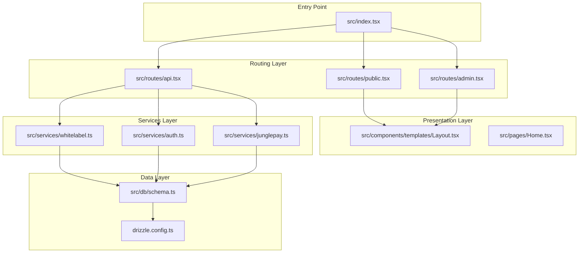
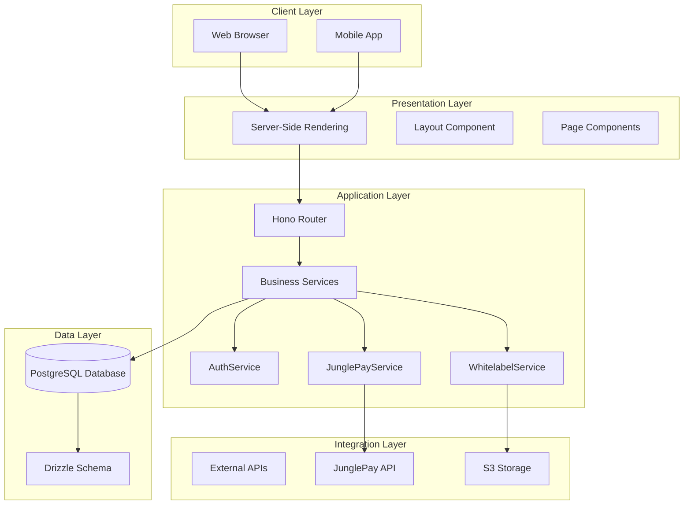
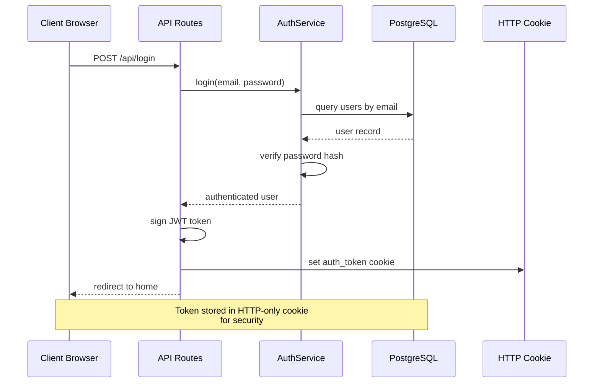
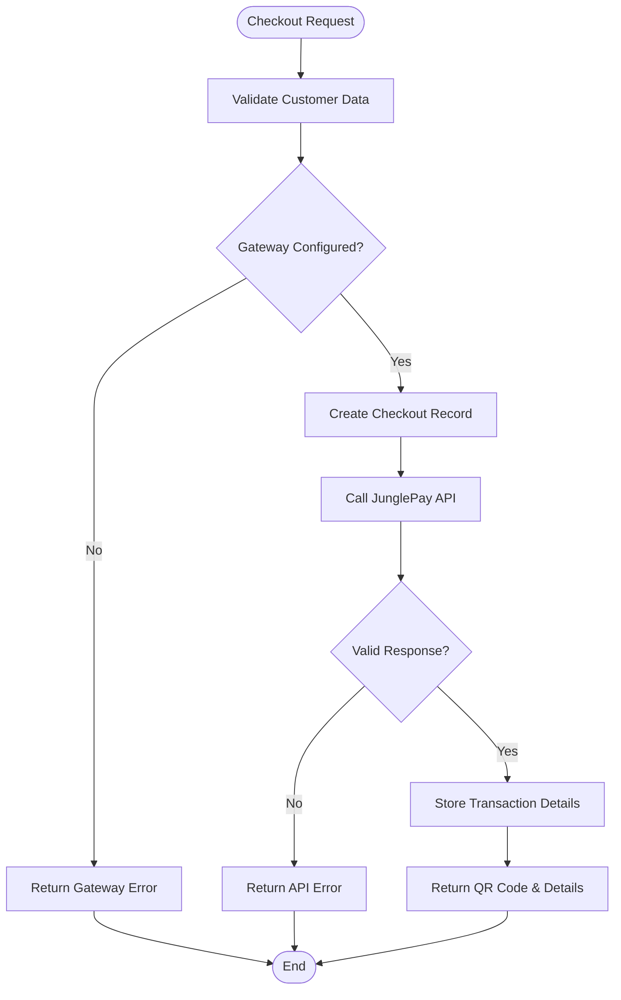
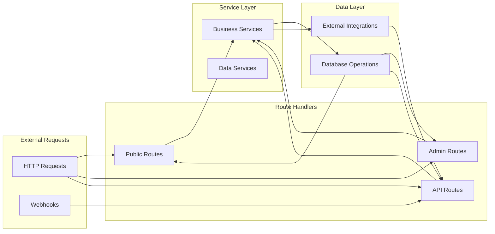
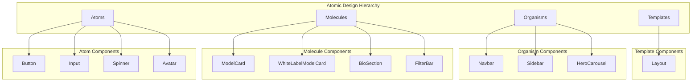
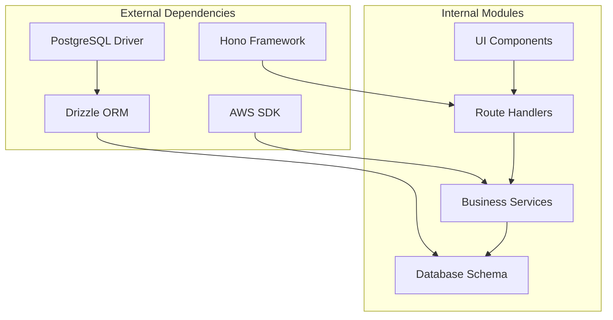

# Architecture Overview

<cite>
**Referenced Files in This Document**
- [README.md](file://README.md)
- [package.json](file://package.json)
- [src/index.tsx](file://src/index.tsx)
- [src/routes/public.tsx](file://src/routes/public.tsx)
- [src/routes/admin.tsx](file://src/routes/admin.tsx)
- [src/routes/api.tsx](file://src/routes/api.tsx)
- [src/db/schema.ts](file://src/db/schema.ts)
- [drizzle.config.ts](file://drizzle.config.ts)
- [src/services/auth.ts](file://src/services/auth.ts)
- [src/services/junglepay.ts](file://src/services/junglepay.ts)
- [src/services/whitelabel.ts](file://src/services/whitelabel.ts)
- [src/components/templates/Layout.tsx](file://src/components/templates/Layout.tsx)
- [src/pages/Home.tsx](file://src/pages/Home.tsx)
</cite>

## Table of Contents
1. [Introduction](#introduction)
2. [Project Structure](#project-structure)
3. [Core Components](#core-components)
4. [Architecture Overview](#architecture-overview)
5. [Detailed Component Analysis](#detailed-component-analysis)
6. [Dependency Analysis](#dependency-analysis)
7. [Performance Considerations](#performance-considerations)
8. [Troubleshooting Guide](#troubleshooting-guide)
9. [Conclusion](#conclusion)

## Introduction
CreatorFlix is a premium content streaming platform inspired by Netflix and OnlyFans. It follows a layered architecture with clear separation of concerns:
- Frontend built with Hono JSX for server-side rendering
- Backend powered by Hono web framework
- Database using PostgreSQL with Drizzle ORM
- Payment processing via external JunglePay service
- Component-based design aligned with Atomic Design principles

The system emphasizes server-side rendering for improved SEO and performance, while maintaining a modern React-like component architecture through Hono JSX.

## Project Structure
The project follows a well-organized structure that separates concerns across layers:

**Diagram sources**
- [src/index.tsx](file://src/index.tsx#L1-L21)
- [src/routes/public.tsx](file://src/routes/public.tsx#L1-L170)
- [src/routes/admin.tsx](file://src/routes/admin.tsx#L1-L158)
- [src/routes/api.tsx](file://src/routes/api.tsx#L1-L519)
- [src/db/schema.ts](file://src/db/schema.ts#L1-L178)

**Section sources**
- [README.md](file://README.md#L1-L49)
- [package.json](file://package.json#L1-L23)

## Core Components
The system is composed of several key architectural layers that work together to deliver the streaming platform experience:

### Routing Architecture
The application uses Hono's routing system with three main route groups:
- Public routes for customer-facing pages
- Admin routes for platform management
- API routes for internal and external integrations

### Service Layer Organization
Services encapsulate business logic and external integrations:
- Authentication service handles user registration and login
- JunglePay service manages payment processing
- Whitelabel service coordinates with external content providers

### Data Access Layer
Drizzle ORM provides type-safe database operations with clear table relationships and constraints.

**Section sources**
- [src/index.tsx](file://src/index.tsx#L1-L21)
- [src/routes/public.tsx](file://src/routes/public.tsx#L1-L170)
- [src/routes/admin.tsx](file://src/routes/admin.tsx#L1-L158)
- [src/routes/api.tsx](file://src/routes/api.tsx#L1-L519)

## Architecture Overview
CreatorFlix implements a layered architecture with clear separation between presentation, business logic, and data access layers:

**Diagram sources**
- [src/index.tsx](file://src/index.tsx#L1-L21)
- [src/routes/public.tsx](file://src/routes/public.tsx#L1-L170)
- [src/routes/admin.tsx](file://src/routes/admin.tsx#L1-L158)
- [src/routes/api.tsx](file://src/routes/api.tsx#L1-L519)
- [src/services/auth.ts](file://src/services/auth.ts#L1-L91)
- [src/services/junglepay.ts](file://src/services/junglepay.ts#L1-L270)
- [src/services/whitelabel.ts](file://src/services/whitelabel.ts#L1-L24)

## Detailed Component Analysis

### Authentication Flow
The authentication system uses JWT tokens stored in HTTP-only cookies for security:

**Diagram sources**
- [src/routes/api.tsx](file://src/routes/api.tsx#L316-L349)
- [src/services/auth.ts](file://src/services/auth.ts#L28-L39)

### Payment Processing Pipeline
The payment system integrates with JunglePay for PIX transactions:

**Diagram sources**
- [src/routes/api.tsx](file://src/routes/api.tsx#L42-L86)
- [src/services/junglepay.ts](file://src/services/junglepay.ts#L107-L268)

### Data Flow Patterns
The system follows predictable data flow patterns:

**Diagram sources**
- [src/routes/public.tsx](file://src/routes/public.tsx#L1-L170)
- [src/routes/admin.tsx](file://src/routes/admin.tsx#L1-L158)
- [src/routes/api.tsx](file://src/routes/api.tsx#L1-L519)

### Component-Based Design
The frontend follows Atomic Design principles with clear component hierarchy:

**Diagram sources**
- [src/components/templates/Layout.tsx](file://src/components/templates/Layout.tsx#L1-L56)
- [src/pages/Home.tsx](file://src/pages/Home.tsx#L1-L97)

**Section sources**
- [src/routes/api.tsx](file://src/routes/api.tsx#L316-L349)
- [src/services/auth.ts](file://src/services/auth.ts#L1-L91)
- [src/services/junglepay.ts](file://src/services/junglepay.ts#L1-L270)
- [src/components/templates/Layout.tsx](file://src/components/templates/Layout.tsx#L1-L56)

## Dependency Analysis
The system maintains clean dependencies between layers with minimal coupling:

**Diagram sources**
- [package.json](file://package.json#L8-L16)
- [src/index.tsx](file://src/index.tsx#L1-L21)

**Section sources**
- [package.json](file://package.json#L1-L23)
- [drizzle.config.ts](file://drizzle.config.ts#L1-L11)

## Performance Considerations
The architecture incorporates several performance optimizations:

- **Server-Side Rendering**: Reduces client-side JavaScript execution time
- **Static Asset Serving**: Direct static file serving for improved CDN caching
- **Database Indexing**: Strategic use of unique constraints and indexes
- **Pagination**: Built-in pagination for large datasets
- **Lazy Loading**: Component-based loading patterns

## Troubleshooting Guide
Common issues and their resolutions:

### Authentication Issues
- Verify JWT_SECRET environment variable is set
- Check cookie domain and security settings
- Ensure password hashing compatibility

### Database Connectivity
- Verify DATABASE_URL connection string
- Check PostgreSQL server accessibility
- Review Drizzle migration status

### Payment Processing
- Validate JunglePay API credentials
- Check webhook endpoint accessibility
- Monitor external API rate limits

**Section sources**
- [src/routes/api.tsx](file://src/routes/api.tsx#L18-L519)
- [src/services/junglepay.ts](file://src/services/junglepay.ts#L57-L133)

## Conclusion
CreatorFlix demonstrates a well-architected streaming platform that successfully combines modern web technologies with traditional architectural patterns. The layered approach ensures maintainability while the Atomic Design principles provide scalability for the component library. The integration with external services like JunglePay showcases robust service-oriented architecture, and the server-side rendering approach delivers excellent performance characteristics.

The system's modular design allows for easy extension and maintenance, making it a solid foundation for a premium content streaming service.