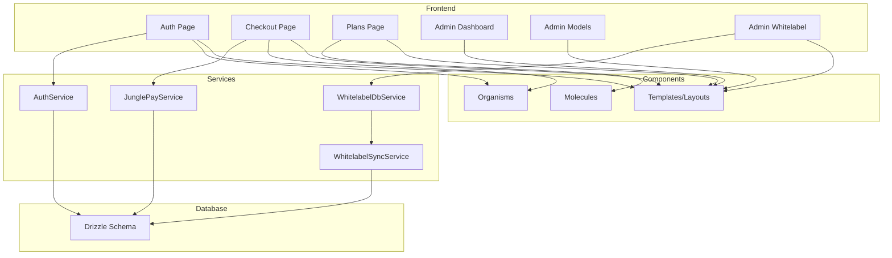
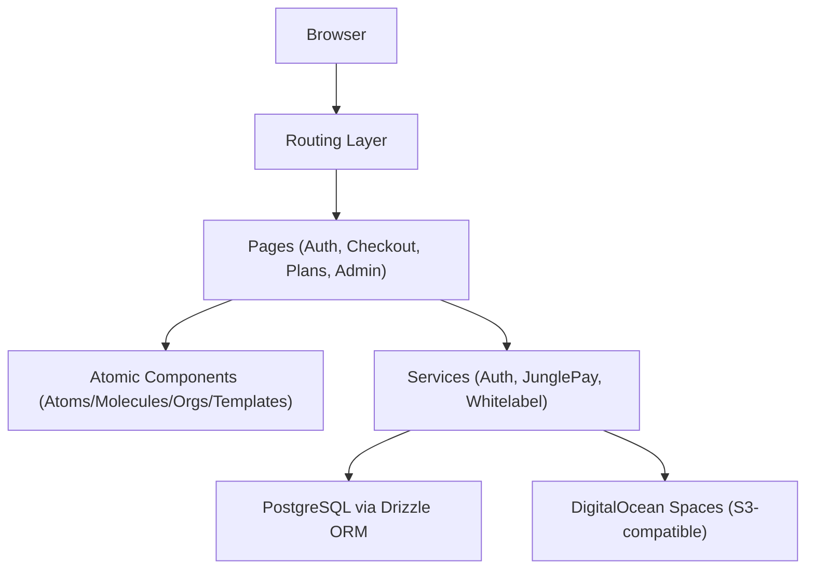
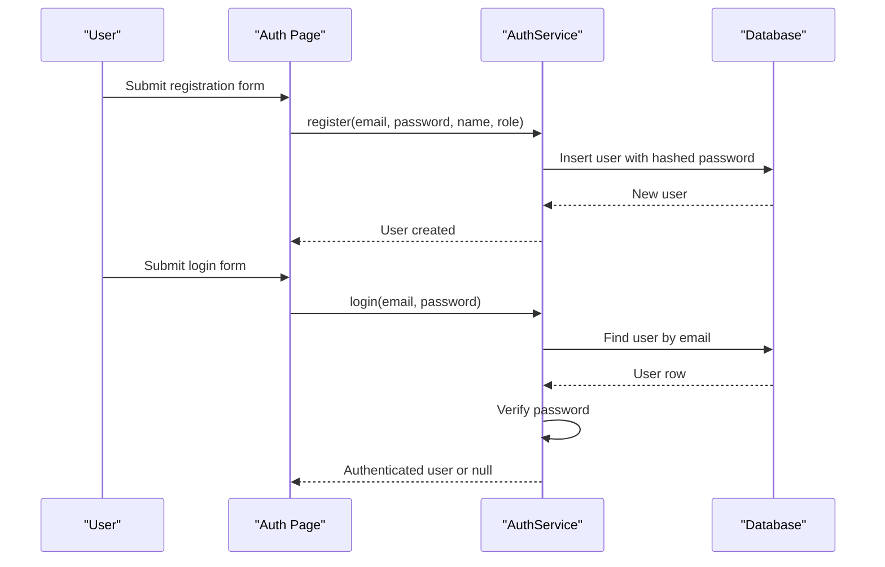
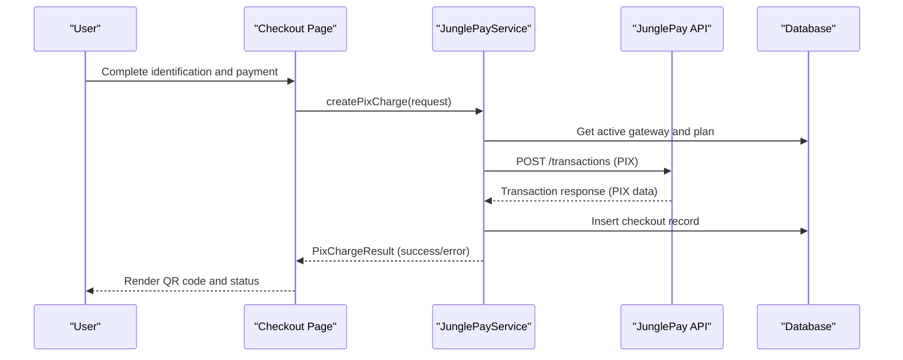
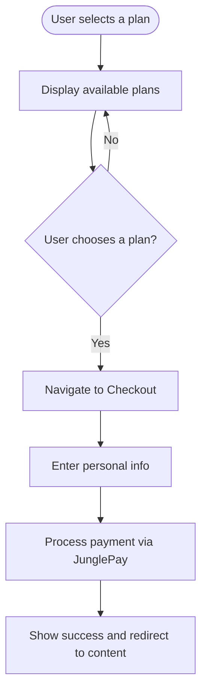
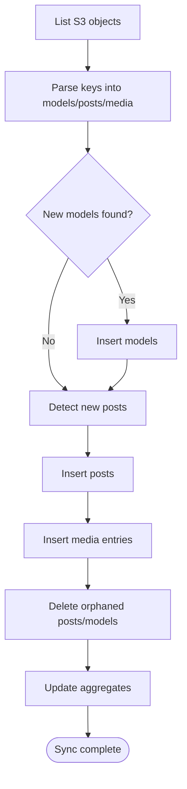
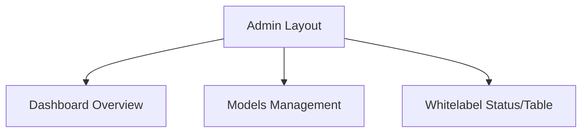
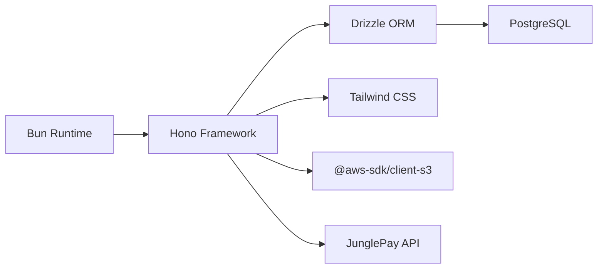

# Feature Highlights

<cite>
**Referenced Files in This Document**
- [README.md](file://README.md)
- [package.json](file://package.json)
- [junglepay-documentation.md](file://junglepay-documentation.md)
- [src/db/schema.ts](file://src/db/schema.ts)
- [src/services/auth.ts](file://src/services/auth.ts)
- [src/services/junglepay.ts](file://src/services/junglepay.ts)
- [src/services/whitelabel.ts](file://src/services/whitelabel.ts)
- [src/services/whitelabel/sync.ts](file://src/services/whitelabel/sync.ts)
- [src/pages/Auth.tsx](file://src/pages/Auth.tsx)
- [src/pages/Checkout.tsx](file://src/pages/Checkout.tsx)
- [src/pages/Plans.tsx](file://src/pages/Plans.tsx)
- [src/pages/admin/Dashboard.tsx](file://src/pages/admin/Dashboard.tsx)
- [src/pages/admin/Models.tsx](file://src/pages/admin/Models.tsx)
- [src/pages/admin/Whitelabel.tsx](file://src/pages/admin/Whitelabel.tsx)
</cite>

## Table of Contents
1. [Introduction](#introduction)
2. [Project Structure](#project-structure)
3. [Core Components](#core-components)
4. [Architecture Overview](#architecture-overview)
5. [Detailed Component Analysis](#detailed-component-analysis)
6. [Dependency Analysis](#dependency-analysis)
7. [Performance Considerations](#performance-considerations)
8. [Troubleshooting Guide](#troubleshooting-guide)
9. [Conclusion](#conclusion)
10. [Appendices](#appendices)

## Introduction
CreatorFlix is a premium content streaming platform inspired by industry leaders, built with a modern stack and Atomic Design principles. It offers:
- Premium content streaming for subscribers
- Creator marketplace functionality
- White-label content ingestion from S3-compatible storage
- User authentication and subscription lifecycle management
- Payment processing integrated with JunglePay
- Administrative dashboard for analytics, models, whitelabel ingestion, and finance

Target audiences include adult content consumers seeking exclusive premium access, content creators monetizing memberships, and brands requiring white-label distribution of curated content.

## Project Structure
The project follows an Atomic Design-based frontend architecture with modular backend services and a PostgreSQL database via Drizzle ORM. Key areas:
- Pages: Route-mounted pages for public and admin experiences
- Components: Atomic Design building blocks (atoms, molecules, organisms, templates)
- Services: Business logic for auth, payments (JunglePay), whitelabel ingestion, and admin operations
- Database: Schema modeling for users, plans, subscriptions, models, posts, whitelabel assets, and checkouts

**Diagram sources**
- [src/pages/Auth.tsx](file://src/pages/Auth.tsx#L1-L116)
- [src/pages/Checkout.tsx](file://src/pages/Checkout.tsx#L1-L74)
- [src/pages/Plans.tsx](file://src/pages/Plans.tsx#L1-L84)
- [src/pages/admin/Dashboard.tsx](file://src/pages/admin/Dashboard.tsx#L1-L85)
- [src/pages/admin/Models.tsx](file://src/pages/admin/Models.tsx#L1-L35)
- [src/pages/admin/Whitelabel.tsx](file://src/pages/admin/Whitelabel.tsx#L1-L30)
- [src/services/auth.ts](file://src/services/auth.ts#L1-L91)
- [src/services/junglepay.ts](file://src/services/junglepay.ts#L1-L270)
- [src/services/whitelabel.ts](file://src/services/whitelabel.ts#L1-L24)
- [src/services/whitelabel/sync.ts](file://src/services/whitelabel/sync.ts#L1-L334)
- [src/db/schema.ts](file://src/db/schema.ts#L1-L178)

**Section sources**
- [README.md](file://README.md#L1-L49)
- [package.json](file://package.json#L1-L23)

## Core Components
- Authentication and Subscription Management
  - Registration and login with password hashing
  - Subscription creation and lifecycle checks
  - Subscription status updates based on plan duration and expiry

- Payment Processing with JunglePay
  - PIX charge creation with sanitized customer data
  - Gateway validation and error handling
  - Checkout record creation and webhook-aware postback URL

- Premium Content Streaming and Creator Marketplace
  - Plans page showcasing subscription tiers
  - Checkout flow with identification and payment steps
  - User subscription status display

- White-label Content Ingestion
  - S3 bucket scanning and parsing of model/post/media keys
  - Model and post discovery with media insertion
  - Aggregate statistics and deletion handling

- Administrative Dashboard
  - Overview metrics and recent activity
  - Models management and filtering
  - Whitelabel ingestion status and table

**Section sources**
- [src/services/auth.ts](file://src/services/auth.ts#L1-L91)
- [src/services/junglepay.ts](file://src/services/junglepay.ts#L1-L270)
- [src/pages/Plans.tsx](file://src/pages/Plans.tsx#L1-L84)
- [src/pages/Checkout.tsx](file://src/pages/Checkout.tsx#L1-L74)
- [src/services/whitelabel.ts](file://src/services/whitelabel.ts#L1-L24)
- [src/services/whitelabel/sync.ts](file://src/services/whitelabel/sync.ts#L1-L334)
- [src/pages/admin/Dashboard.tsx](file://src/pages/admin/Dashboard.tsx#L1-L85)
- [src/pages/admin/Models.tsx](file://src/pages/admin/Models.tsx#L1-L35)
- [src/pages/admin/Whitelabel.tsx](file://src/pages/admin/Whitelabel.tsx#L1-L30)

## Architecture Overview
CreatorFlix uses a lightweight runtime with a routing framework, a database abstraction layer, and a CDN-backed storage system. The admin and public experiences share a component library organized by Atomic Design.

**Diagram sources**
- [README.md](file://README.md#L5-L11)
- [src/db/schema.ts](file://src/db/schema.ts#L1-L178)
- [src/services/whitelabel/sync.ts](file://src/services/whitelabel/sync.ts#L1-L334)

## Detailed Component Analysis

### Authentication and Subscription Lifecycle
- Registration hashes passwords and prevents duplicates
- Login verifies credentials securely
- Subscription creation computes start/end dates and updates user status
- Subscription status checks determine active/expired states and update accordingly

**Diagram sources**
- [src/pages/Auth.tsx](file://src/pages/Auth.tsx#L1-L116)
- [src/services/auth.ts](file://src/services/auth.ts#L1-L91)

**Section sources**
- [src/services/auth.ts](file://src/services/auth.ts#L1-L91)
- [src/pages/Auth.tsx](file://src/pages/Auth.tsx#L1-L116)

### Payment Processing with JunglePay
- Validates gateway configuration and active status
- Sanitizes customer documents and phone numbers
- Builds items payload including optional order bump
- Creates PIX charge and persists checkout record
- Returns structured success/error responses with QR code and expiration

**Diagram sources**
- [src/pages/Checkout.tsx](file://src/pages/Checkout.tsx#L1-L74)
- [src/services/junglepay.ts](file://src/services/junglepay.ts#L1-L270)
- [junglepay-documentation.md](file://junglepay-documentation.md#L1-L3198)

**Section sources**
- [src/services/junglepay.ts](file://src/services/junglepay.ts#L1-L270)
- [junglepay-documentation.md](file://junglepay-documentation.md#L1-L3198)

### Premium Content Streaming and Creator Marketplace
- Plans page displays subscription tiers and user’s current subscription status
- Checkout page orchestrates identification, payment, and success steps with order summary

**Diagram sources**
- [src/pages/Plans.tsx](file://src/pages/Plans.tsx#L1-L84)
- [src/pages/Checkout.tsx](file://src/pages/Checkout.tsx#L1-L74)

**Section sources**
- [src/pages/Plans.tsx](file://src/pages/Plans.tsx#L1-L84)
- [src/pages/Checkout.tsx](file://src/pages/Checkout.tsx#L1-L74)

### White-label Content Ingestion
- Scans S3 bucket for models, posts, and media
- Parses keys to detect profiles, posts, and media types
- Inserts models, posts, and media into the database
- Handles deletions and updates aggregates

**Diagram sources**
- [src/services/whitelabel/sync.ts](file://src/services/whitelabel/sync.ts#L1-L334)
- [src/services/whitelabel.ts](file://src/services/whitelabel.ts#L1-L24)

**Section sources**
- [src/services/whitelabel/sync.ts](file://src/services/whitelabel/sync.ts#L1-L334)
- [src/services/whitelabel.ts](file://src/services/whitelabel.ts#L1-L24)

### Administrative Dashboard Features
- Dashboard overview cards and recent activity feed
- Models management with filters and pagination
- Whitelabel ingestion status and model table

**Diagram sources**
- [src/pages/admin/Dashboard.tsx](file://src/pages/admin/Dashboard.tsx#L1-L85)
- [src/pages/admin/Models.tsx](file://src/pages/admin/Models.tsx#L1-L35)
- [src/pages/admin/Whitelabel.tsx](file://src/pages/admin/Whitelabel.tsx#L1-L30)

**Section sources**
- [src/pages/admin/Dashboard.tsx](file://src/pages/admin/Dashboard.tsx#L1-L85)
- [src/pages/admin/Models.tsx](file://src/pages/admin/Models.tsx#L1-L35)
- [src/pages/admin/Whitelabel.tsx](file://src/pages/admin/Whitelabel.tsx#L1-L30)

## Dependency Analysis
- Runtime and framework: Bun + Hono
- Database: PostgreSQL with Drizzle ORM
- Styling: Tailwind CSS v4
- Storage: DigitalOcean Spaces (S3-compatible)
- Payment: JunglePay REST API

**Diagram sources**
- [README.md](file://README.md#L5-L11)
- [package.json](file://package.json#L1-L23)

**Section sources**
- [README.md](file://README.md#L1-L49)
- [package.json](file://package.json#L1-L23)

## Performance Considerations
- Use pagination for admin lists to limit DOM and API payloads
- Batch S3 listing operations and process in passes to reduce memory pressure during whitelabel sync
- Cache frequently accessed plan and model metadata
- Optimize image/video CDN URLs and lazy-load media where appropriate
- Minimize re-renders by structuring component props and state efficiently

## Troubleshooting Guide
- Authentication
  - Duplicate email registration errors
  - Incorrect password verification
- Payments
  - Gateway not configured or inactive
  - Invalid customer data or amount
  - API connectivity or unexpected response
- Whitelabel Sync
  - Missing model entries for posts
  - Deleted models causing orphaned posts
  - S3 permission or bucket misconfiguration

**Section sources**
- [src/services/auth.ts](file://src/services/auth.ts#L1-L91)
- [src/services/junglepay.ts](file://src/services/junglepay.ts#L1-L270)
- [src/services/whitelabel/sync.ts](file://src/services/whitelabel/sync.ts#L1-L334)

## Conclusion
CreatorFlix combines a modern tech stack with a robust set of features tailored for premium content delivery and creator monetization. Its strengths lie in flexible subscription management, seamless payment processing via JunglePay, scalable white-label ingestion from S3, and a comprehensive admin experience. These capabilities position it to serve niche audiences effectively while offering clear operational visibility and extensibility.

## Appendices
- Screenshots and Descriptions of Major Workflows
  - Authentication
    - Registration and login forms with validation and submission actions
  - Checkout
    - Multi-step checkout with identification, payment, and success states
  - Plans
    - Plan selection and current subscription status display
  - Admin
    - Dashboard overview, models management, and whitelabel ingestion status

[No sources needed since this section describes conceptual workflows without analyzing specific files]